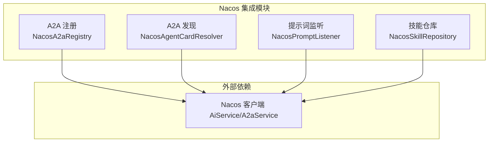
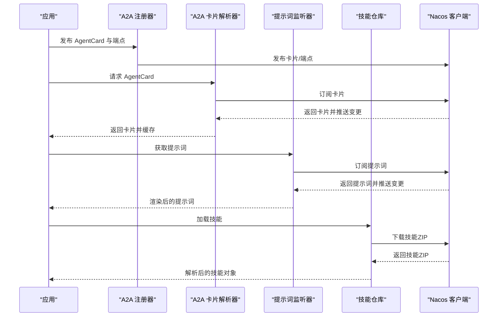
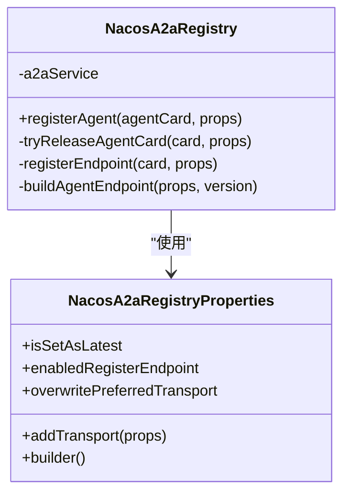
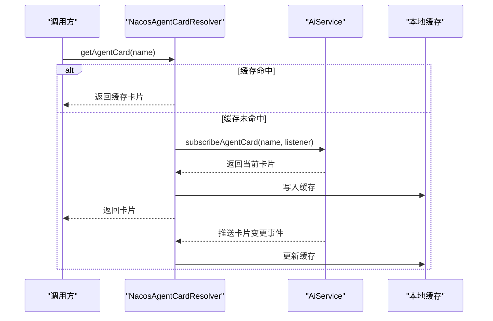
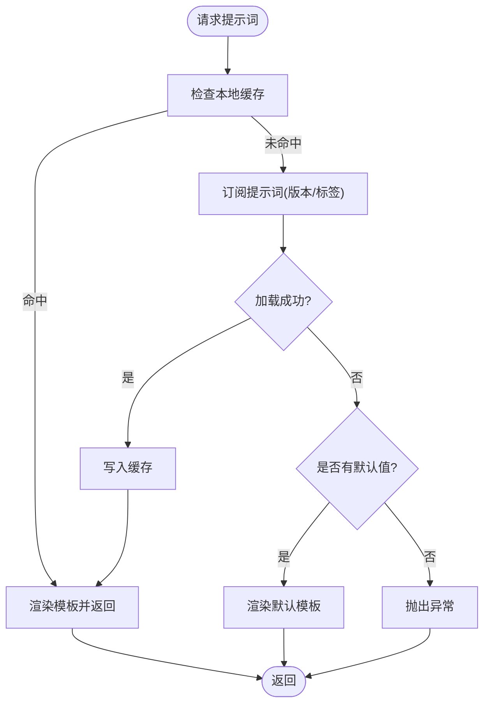
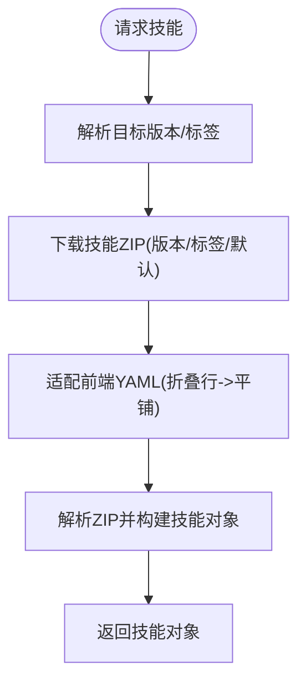
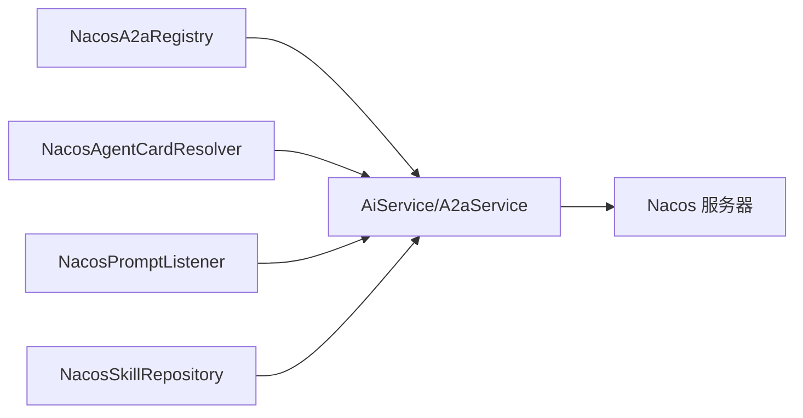

# Nacos 集成

<cite>
**本文引用的文件**
- [NacosA2aRegistry.java](file://agentscope-extensions/agentscope-extensions-nacos/agentscope-extensions-nacos-a2a/src/main/java/io/agentscope/core/nacos/a2a/registry/NacosA2aRegistry.java)
- [NacosAgentCardResolver.java](file://agentscope-extensions/agentscope-extensions-nacos/agentscope-extensions-nacos-a2a/src/main/java/io/agentscope/core/nacos/a2a/discovery/NacosAgentCardResolver.java)
- [NacosA2aRegistryProperties.java](file://agentscope-extensions/agentscope-extensions-nacos/agentscope-extensions-nacos-a2a/src/main/java/io/agentscope/core/nacos/a2a/registry/NacosA2aRegistryProperties.java)
- [Constants.java](file://agentscope-extensions/agentscope-extensions-nacos/agentscope-extensions-nacos-a2a/src/main/java/io/agentscope/core/nacos/a2a/registry/constants/Constants.java)
- [NacosPromptListener.java](file://agentscope-extensions/agentscope-extensions-nacos/agentscope-extensions-nacos-prompt/src/main/java/io/agentscope/core/nacos/prompt/NacosPromptListener.java)
- [NacosSkillRepository.java](file://agentscope-extensions/agentscope-extensions-nacos/agentscope-extensions-nacos-skill/src/main/java/io/agentscope/core/nacos/skill/NacosSkillRepository.java)
- [application.yml](file://agentscope-examples/a2a/src/main/resources/application.yml)
- [NacosA2aAgentExample.java](file://agentscope-examples/a2a/src/main/java/io/agentscope/examples/a2a/NacosA2aAgentExample.java)
- [NacosA2aRegistryTest.java](file://agentscope-extensions/agentscope-extensions-nacos/agentscope-extensions-nacos-a2a/src/test/java/io/agentscope/core/nacos/a2a/registry/NacosA2aRegistryTest.java)
- [NacosPromptListenerTest.java](file://agentscope-extensions/agentscope-extensions-nacos/agentscope-extensions-nacos-prompt/src/test/java/io/agentscope/core/nacos/prompt/NacosPromptListenerTest.java)
- [business-mcp-server/pom.xml](file://agentscope-examples/boba-tea-shop/business-mcp-server/pom.xml)
- [init-himarket-local.sh](file://agentscope-examples/boba-tea-shop/himarket-image/init-himarket-local.sh)
</cite>

## 目录
1. [简介](#简介)
2. [项目结构](#项目结构)
3. [核心组件](#核心组件)
4. [架构总览](#架构总览)
5. [详细组件分析](#详细组件分析)
6. [依赖分析](#依赖分析)
7. [性能考虑](#性能考虑)
8. [故障排查指南](#故障排查指南)
9. [结论](#结论)
10. [附录](#附录)

## 简介
本文件面向 AgentScope Java 的 Nacos 集成模块，系统化阐述其在配置中心与服务编排中的关键能力：动态配置管理（配置加载、热更新、版本/标签控制）、服务发现（智能体实例注册、注销与健康检查）、提示词监听器（实时获取与更新提示词）、技能仓库动态加载（远程管理与版本控制）。同时提供完整配置示例、连接参数设置、服务注册表管理策略与故障转移机制、配置同步性能优化与缓存策略，以及企业级部署的 Nacos 集群高可用设计建议。

## 项目结构
Nacos 集成相关代码主要分布在以下模块：
- A2A 注册与发现：提供智能体卡片发布、订阅与端点注册能力
- 提示词监听：提供提示词的订阅、缓存与渲染
- 技能仓库：提供基于 Nacos 的技能包下载与解析

图表来源
- [NacosA2aRegistry.java:1-150](file://agentscope-extensions/agentscope-extensions-nacos/agentscope-extensions-nacos-a2a/src/main/java/io/agentscope/core/nacos/a2a/registry/NacosA2aRegistry.java#L1-L150)
- [NacosAgentCardResolver.java:1-123](file://agentscope-extensions/agentscope-extensions-nacos/agentscope-extensions-nacos-a2a/src/main/java/io/agentscope/core/nacos/a2a/discovery/NacosAgentCardResolver.java#L1-L123)
- [NacosPromptListener.java:1-160](file://agentscope-extensions/agentscope-extensions-nacos/agentscope-extensions-nacos-prompt/src/main/java/io/agentscope/core/nacos/prompt/NacosPromptListener.java#L1-L160)
- [NacosSkillRepository.java:1-507](file://agentscope-extensions/agentscope-extensions-nacos/agentscope-extensions-nacos-skill/src/main/java/io/agentscope/core/nacos/skill/NacosSkillRepository.java#L1-L507)

章节来源
- [NacosA2aRegistry.java:1-150](file://agentscope-extensions/agentscope-extensions-nacos/agentscope-extensions-nacos-a2a/src/main/java/io/agentscope/core/nacos/a2a/registry/NacosA2aRegistry.java#L1-L150)
- [NacosAgentCardResolver.java:1-123](file://agentscope-extensions/agentscope-extensions-nacos/agentscope-extensions-nacos-a2a/src/main/java/io/agentscope/core/nacos/a2a/discovery/NacosAgentCardResolver.java#L1-L123)
- [NacosPromptListener.java:1-160](file://agentscope-extensions/agentscope-extensions-nacos/agentscope-extensions-nacos-prompt/src/main/java/io/agentscope/core/nacos/prompt/NacosPromptListener.java#L1-L160)
- [NacosSkillRepository.java:1-507](file://agentscope-extensions/agentscope-extensions-nacos/agentscope-extensions-nacos-skill/src/main/java/io/agentscope/core/nacos/skill/NacosSkillRepository.java#L1-L507)

## 核心组件
- A2A 注册器：将 AgentCard 与端点发布到 Nacos，并支持“设为最新版本”“端点自动注册”等策略
- A2A 卡片解析器：从 Nacos 订阅并缓存 AgentCard，支持事件驱动的热更新
- 提示词监听器：订阅提示词，按版本/标签拉取与渲染，支持默认值回退与缓存命中
- 技能仓库：从 Nacos 下载技能包 ZIP，适配前端 YAML，构建 AgentSkill 并提供只读访问

章节来源
- [NacosA2aRegistry.java:68-134](file://agentscope-extensions/agentscope-extensions-nacos/agentscope-extensions-nacos-a2a/src/main/java/io/agentscope/core/nacos/a2a/registry/NacosA2aRegistry.java#L68-L134)
- [NacosAgentCardResolver.java:90-111](file://agentscope-extensions/agentscope-extensions-nacos/agentscope-extensions-nacos-a2a/src/main/java/io/agentscope/core/nacos/a2a/discovery/NacosAgentCardResolver.java#L90-L111)
- [NacosPromptListener.java:104-139](file://agentscope-extensions/agentscope-extensions-nacos/agentscope-extensions-nacos-prompt/src/main/java/io/agentscope/core/nacos/prompt/NacosPromptListener.java#L104-L139)
- [NacosSkillRepository.java:146-164](file://agentscope-extensions/agentscope-extensions-nacos/agentscope-extensions-nacos-skill/src/main/java/io/agentscope/core/nacos/skill/NacosSkillRepository.java#L146-L164)

## 架构总览
下图展示 Nacos 集成在 AgentScope 中的整体交互：客户端通过 AiService/A2aService 与 Nacos 通信；注册器负责发布 AgentCard 与端点；发现器负责订阅卡片并缓存；提示词监听器负责订阅提示词并渲染；技能仓库负责下载技能包并解析。

图表来源
- [NacosA2aRegistry.java:68-134](file://agentscope-extensions/agentscope-extensions-nacos/agentscope-extensions-nacos-a2a/src/main/java/io/agentscope/core/nacos/a2a/registry/NacosA2aRegistry.java#L68-L134)
- [NacosAgentCardResolver.java:101-111](file://agentscope-extensions/agentscope-extensions-nacos/agentscope-extensions-nacos-a2a/src/main/java/io/agentscope/core/nacos/a2a/discovery/NacosAgentCardResolver.java#L101-L111)
- [NacosPromptListener.java:141-150](file://agentscope-extensions/agentscope-extensions-nacos/agentscope-extensions-nacos-prompt/src/main/java/io/agentscope/core/nacos/prompt/NacosPromptListener.java#L141-L150)
- [NacosSkillRepository.java:252-261](file://agentscope-extensions/agentscope-extensions-nacos/agentscope-extensions-nacos-skill/src/main/java/io/agentscope/core/nacos/skill/NacosSkillRepository.java#L252-L261)

## 详细组件分析

### A2A 注册器（NacosA2aRegistry）
职责与流程
- 将 AgentCard 发布至 Nacos，并可选择将其标记为“最新版本”
- 可选地批量注册多个传输协议的端点（HTTP/WebSocket 等）
- 对已存在卡片进行幂等处理，避免重复发布
- 支持通过属性控制是否注册端点、是否覆盖首选传输

关键点
- 使用 AiFactory 创建 A2aService/AiService 实例
- 通过 releaseAgentCard 发布卡片，registerAgentEndpoint 注册端点
- 通过 NacosA2aRegistryProperties 控制行为，如是否注册端点、是否设为最新版本

图表来源
- [NacosA2aRegistry.java:37-149](file://agentscope-extensions/agentscope-extensions-nacos/agentscope-extensions-nacos-a2a/src/main/java/io/agentscope/core/nacos/a2a/registry/NacosA2aRegistry.java#L37-L149)
- [NacosA2aRegistryProperties.java:34-140](file://agentscope-extensions/agentscope-extensions-nacos/agentscope-extensions-nacos-a2a/src/main/java/io/agentscope/core/nacos/a2a/registry/NacosA2aRegistryProperties.java#L34-L140)

章节来源
- [NacosA2aRegistry.java:68-134](file://agentscope-extensions/agentscope-extensions-nacos/agentscope-extensions-nacos-a2a/src/main/java/io/agentscope/core/nacos/a2a/registry/NacosA2aRegistry.java#L68-L134)
- [NacosA2aRegistryProperties.java:34-140](file://agentscope-extensions/agentscope-extensions-nacos/agentscope-extensions-nacos-a2a/src/main/java/io/agentscope/core/nacos/a2a/registry/NacosA2aRegistryProperties.java#L34-L140)

### A2A 卡片解析器（NacosAgentCardResolver）
职责与流程
- 通过 AiService 订阅指定名称的 AgentCard
- 维护本地缓存，首次缺失时触发订阅，后续直接返回缓存
- 通过内部监听器接收卡片变更事件，更新缓存

图表来源
- [NacosAgentCardResolver.java:90-111](file://agentscope-extensions/agentscope-extensions-nacos/agentscope-extensions-nacos-a2a/src/main/java/io/agentscope/core/nacos/a2a/discovery/NacosAgentCardResolver.java#L90-L111)

章节来源
- [NacosAgentCardResolver.java:90-111](file://agentscope-extensions/agentscope-extensions-nacos/agentscope-extensions-nacos-a2a/src/main/java/io/agentscope/core/nacos/a2a/discovery/NacosAgentCardResolver.java#L90-L111)

### 提示词监听器（NacosPromptListener）
职责与流程
- 订阅指定键的提示词，支持版本/标签定位
- 按需加载：若本地无缓存则触发订阅并写入缓存
- 事件回调：当远端提示词更新时，替换本地缓存并重新渲染
- 默认值回退：当 Nacos 返回空或异常时，可使用默认模板并支持变量渲染

图表来源
- [NacosPromptListener.java:104-158](file://agentscope-extensions/agentscope-extensions-nacos/agentscope-extensions-nacos-prompt/src/main/java/io/agentscope/core/nacos/prompt/NacosPromptListener.java#L104-L158)

章节来源
- [NacosPromptListener.java:71-158](file://agentscope-extensions/agentscope-extensions-nacos/agentscope-extensions-nacos-prompt/src/main/java/io/agentscope/core/nacos/prompt/NacosPromptListener.java#L71-L158)
- [NacosPromptListenerTest.java:60-176](file://agentscope-extensions/agentscope-extensions-nacos/agentscope-extensions-nacos-prompt/src/test/java/io/agentscope/core/nacos/prompt/NacosPromptListenerTest.java#L60-L176)

### 技能仓库（NacosSkillRepository）
职责与流程
- 基于 Nacos 技能包（ZIP）进行动态加载
- 支持按版本或标签下载，版本优先于标签
- 适配 Nacos 导出的 YAML 前端格式，确保 Flat 键值解析兼容
- 提供只读接口：仅支持按名称获取技能、查询仓库信息，不支持列出与写入

图表来源
- [NacosSkillRepository.java:252-318](file://agentscope-extensions/agentscope-extensions-nacos/agentscope-extensions-nacos-skill/src/main/java/io/agentscope/core/nacos/skill/NacosSkillRepository.java#L252-L318)

章节来源
- [NacosSkillRepository.java:146-232](file://agentscope-extensions/agentscope-extensions-nacos/agentscope-extensions-nacos-skill/src/main/java/io/agentscope/core/nacos/skill/NacosSkillRepository.java#L146-L232)
- [NacosSkillRepository.java:252-318](file://agentscope-extensions/agentscope-extensions-nacos/agentscope-extensions-nacos-skill/src/main/java/io/agentscope/core/nacos/skill/NacosSkillRepository.java#L252-L318)

## 依赖分析
- 组件耦合
  - A2A 注册器与解析器均依赖 AiService/A2aService
  - 提示词监听器依赖 AiService 的提示词订阅能力
  - 技能仓库依赖 AiService 的技能包下载能力
- 外部依赖
  - Nacos 客户端（AiService/A2aService）用于与 Nacos 交互
  - 示例工程中引入 nacos-client 依赖以支持客户端功能

图表来源
- [NacosA2aRegistry.java:49-60](file://agentscope-extensions/agentscope-extensions-nacos/agentscope-extensions-nacos-a2a/src/main/java/io/agentscope/core/nacos/a2a/registry/NacosA2aRegistry.java#L49-L60)
- [NacosAgentCardResolver.java:75-87](file://agentscope-extensions/agentscope-extensions-nacos/agentscope-extensions-nacos-a2a/src/main/java/io/agentscope/core/nacos/a2a/discovery/NacosAgentCardResolver.java#L75-L87)
- [NacosPromptListener.java:66-69](file://agentscope-extensions/agentscope-extensions-nacos/agentscope-extensions-nacos-prompt/src/main/java/io/agentscope/core/nacos/prompt/NacosPromptListener.java#L66-L69)
- [NacosSkillRepository.java:95-101](file://agentscope-extensions/agentscope-extensions-nacos/agentscope-extensions-nacos-skill/src/main/java/io/agentscope/core/nacos/skill/NacosSkillRepository.java#L95-L101)
- [business-mcp-server/pom.xml:89-93](file://agentscope-examples/boba-tea-shop/business-mcp-server/pom.xml#L89-L93)

章节来源
- [business-mcp-server/pom.xml:89-93](file://agentscope-examples/boba-tea-shop/business-mcp-server/pom.xml#L89-L93)

## 性能考虑
- 缓存策略
  - 提示词监听器与卡片解析器均采用本地缓存，首次缺失时触发订阅，后续直接命中，显著降低网络开销
  - 缓存使用并发映射，保证多线程安全
- 版本/标签解析
  - 技能仓库在构造阶段解析版本/标签，避免运行期重复计算
- ZIP 适配
  - 仅在必要时对技能包进行 ZIP 重打包，减少 IO 开销
- 连接与会话
  - 建议复用 AiService 实例，避免频繁创建客户端导致资源浪费

章节来源
- [NacosPromptListener.java:68-69](file://agentscope-extensions/agentscope-extensions-nacos/agentscope-extensions-nacos-prompt/src/main/java/io/agentscope/core/nacos/prompt/NacosPromptListener.java#L68-L69)
- [NacosAgentCardResolver.java:84-87](file://agentscope-extensions/agentscope-extensions-nacos/agentscope-extensions-nacos-a2a/src/main/java/io/agentscope/core/nacos/a2a/discovery/NacosAgentCardResolver.java#L84-L87)
- [NacosSkillRepository.java:128-143](file://agentscope-extensions/agentscope-extensions-nacos/agentscope-extensions-nacos-skill/src/main/java/io/agentscope/core/nacos/skill/NacosSkillRepository.java#L128-L143)

## 故障排查指南
- Nacos 认证失败
  - 检查环境变量或配置项是否正确传入用户名/密码
  - 示例工程中通过环境变量设置 NACOS_USERNAME/NACOS_PASSWORD
- 端点注册失败
  - 确认 NacosA2aRegistryProperties 中 enabledRegisterEndpoint 已启用
  - 检查传输属性是否完整（主机、端口、协议等）
- 提示词为空或异常
  - 若 Nacos 返回空模板，可提供默认模板并支持变量渲染
  - 当订阅异常时，监听器会回退到默认模板或抛出异常
- 技能包下载失败
  - 确认技能版本/标签解析顺序（版本优先于标签）
  - 检查命名空间与技能名是否正确

章节来源
- [application.yml:61-65](file://agentscope-examples/a2a/src/main/resources/application.yml#L61-L65)
- [NacosA2aRegistryTest.java:112-160](file://agentscope-extensions/agentscope-extensions-nacos/agentscope-extensions-nacos-a2a/src/test/java/io/agentscope/core/nacos/a2a/registry/NacosA2aRegistryTest.java#L112-L160)
- [NacosPromptListenerTest.java:232-251](file://agentscope-extensions/agentscope-extensions-nacos/agentscope-extensions-nacos-prompt/src/test/java/io/agentscope/core/nacos/prompt/NacosPromptListenerTest.java#L232-L251)
- [NacosSkillRepository.java:128-143](file://agentscope-extensions/agentscope-extensions-nacos/agentscope-extensions-nacos-skill/src/main/java/io/agentscope/core/nacos/skill/NacosSkillRepository.java#L128-L143)

## 结论
Nacos 集成模块围绕“动态配置+服务编排”的核心目标，提供了从智能体卡片发布与发现、提示词热更新到技能包远程管理的完整链路。通过本地缓存、版本/标签控制与事件驱动更新，实现了低延迟、高可用的配置与资源管理。结合企业级集群与高可用设计，可在生产环境中稳定支撑大规模智能体协作场景。

## 附录

### Nacos 连接参数与配置示例
- 应用配置示例（示例工程）
  - 启用开关、服务地址、认证信息等
- 环境变量
  - NACOS_SERVER_ADDR、NACOS_USERNAME、NACOS_PASSWORD
- 端点属性环境变量前缀
  - NACOS_A2A_AGENT_{TRANSPORT}_{ATTR}=...

章节来源
- [application.yml:61-65](file://agentscope-examples/a2a/src/main/resources/application.yml#L61-L65)
- [NacosA2aAgentExample.java:53-67](file://agentscope-examples/a2a/src/main/java/io/agentscope/examples/a2a/NacosA2aAgentExample.java#L53-L67)
- [Constants.java:37-52](file://agentscope-extensions/agentscope-extensions-nacos/agentscope-extensions-nacos-a2a/src/main/java/io/agentscope/core/nacos/a2a/registry/constants/Constants.java#L37-L52)

### 服务注册表管理策略与故障转移
- 注册表策略
  - 使用 isSetAsLatest 将新版本标记为“最新”，便于客户端透明切换
  - 通过 enabledRegisterEndpoint 自动注册多种传输端点，提升可用性
- 故障转移
  - 多端点注册后，客户端可优先尝试可用端点
  - 通过卡片缓存与事件回调，实现快速故障感知与切换

章节来源
- [NacosA2aRegistryProperties.java:34-74](file://agentscope-extensions/agentscope-extensions-nacos/agentscope-extensions-nacos-a2a/src/main/java/io/agentscope/core/nacos/a2a/registry/NacosA2aRegistryProperties.java#L34-L74)
- [NacosA2aRegistry.java:105-134](file://agentscope-extensions/agentscope-extensions-nacos/agentscope-extensions-nacos-a2a/src/main/java/io/agentscope/core/nacos/a2a/registry/NacosA2aRegistry.java#L105-L134)

### 企业级部署与高可用设计
- Nacos 集群
  - 建议部署多节点集群，开启认证与 TLS
  - 使用独立命名空间隔离不同环境（开发/测试/生产）
- 资源治理
  - 为提示词与技能包设置版本/标签策略，配合回退模板保障降级
  - 对关键服务配置健康检查与熔断策略

[本节为通用指导，不直接分析具体文件]

### Nacos 实例注册脚本（参考）
- 本地初始化脚本中包含 Nacos 实例注册步骤，支持用户名/密码与商业版 AK/SK 认证

章节来源
- [init-himarket-local.sh:287-344](file://agentscope-examples/boba-tea-shop/himarket-image/init-himarket-local.sh#L287-L344)