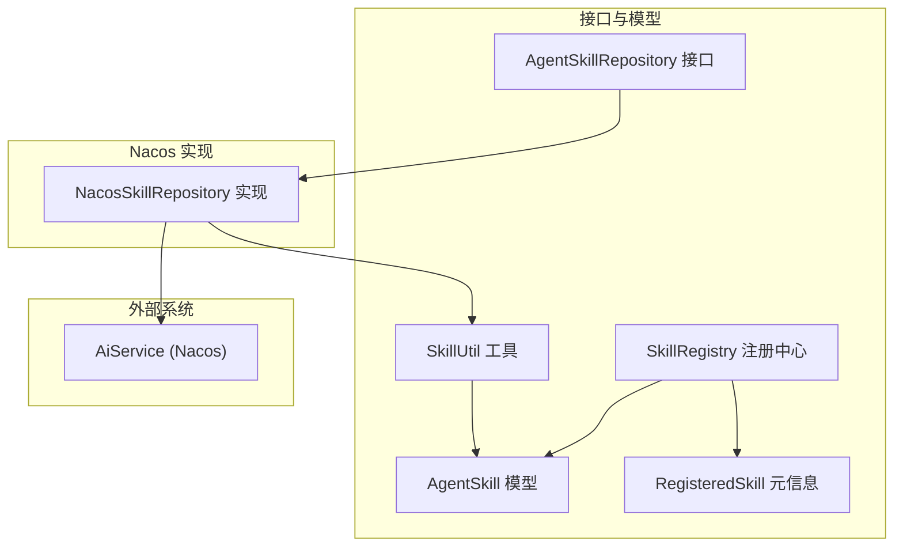
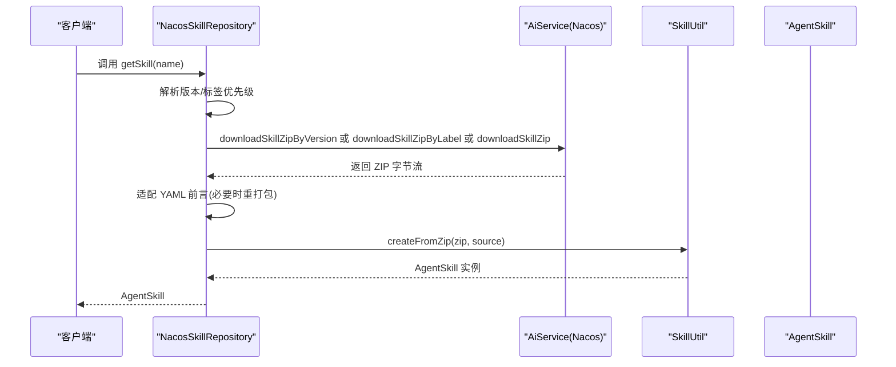
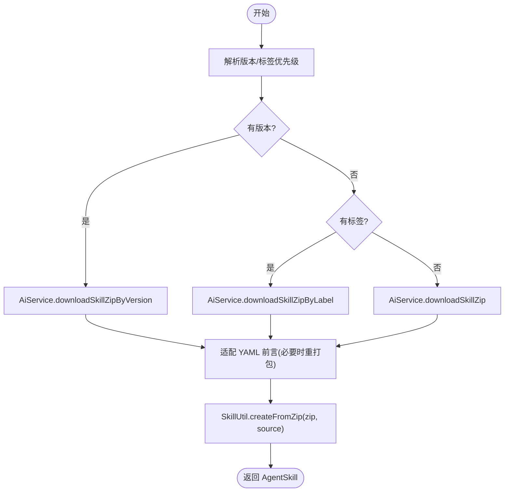
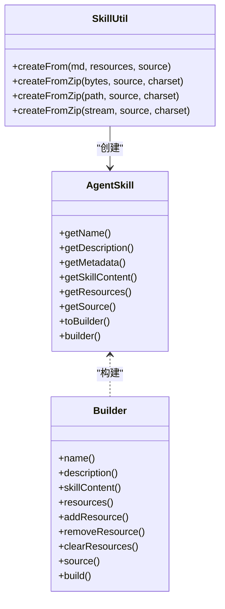
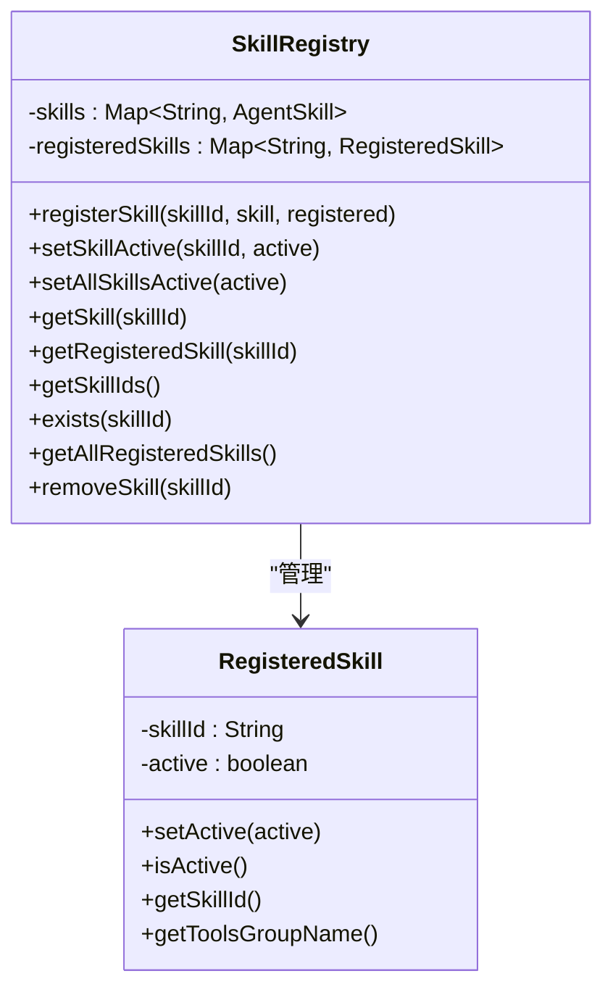
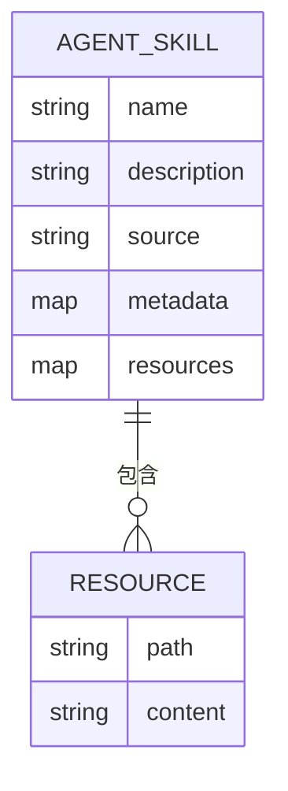
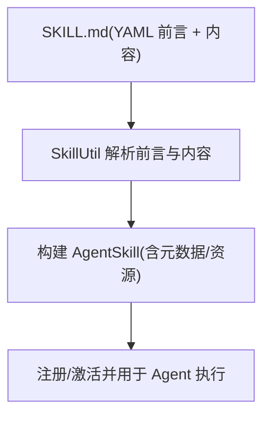
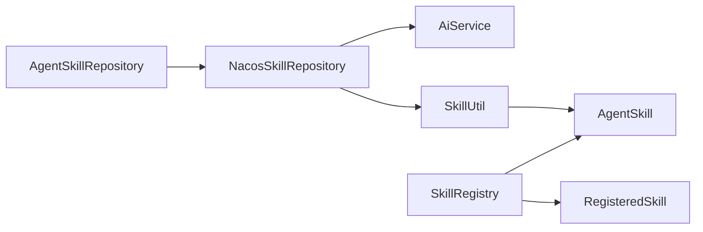

# 技能仓库

<cite>
**本文档引用的文件**
- [NacosSkillRepository.java](file://agentscope-extensions/agentscope-extensions-nacos/agentscope-extensions-nacos-skill/src/main/java/io/agentscope/core/nacos/skill/NacosSkillRepository.java)
- [AgentSkillRepository.java](file://agentscope-core/src/main/java/io/agentscope/core/skill/repository/AgentSkillRepository.java)
- [AgentSkill.java](file://agentscope-core/src/main/java/io/agentscope/core/skill/AgentSkill.java)
- [SkillRegistry.java](file://agentscope-core/src/main/java/io/agentscope/core/skill/SkillRegistry.java)
- [SkillUtil.java](file://agentscope-core/src/main/java/io/agentscope/core/skill/util/SkillUtil.java)
- [RegisteredSkill.java](file://agentscope-core/src/main/java/io/agentscope/core/skill/RegisteredSkill.java)
- [SKILL.md](file://SKILL.md)
- [calculation-skill/SKILL.md](file://agentscope-core/src/test/resources/test-skills/calculation-skill/SKILL.md)
- [agent-skill.md](file://docs/zh/task/agent-skill.md)
- [nacos-mcp.json](file://agentscope-examples/boba-tea-shop/himarket-image/nacos-mcp.json)
</cite>

## 目录
1. [简介](#简介)
2. [项目结构](#项目结构)
3. [核心组件](#核心组件)
4. [架构总览](#架构总览)
5. [详细组件分析](#详细组件分析)
6. [依赖关系分析](#依赖关系分析)
7. [性能考虑](#性能考虑)
8. [故障排查指南](#故障排查指南)
9. [结论](#结论)
10. [附录](#附录)

## 简介
本文件面向 Nacos 技能仓库功能，系统性阐述基于 Nacos 的远程技能管理机制，覆盖技能配置的集中存储、动态加载与版本控制；深入解析 NacosSkillRepository 的实现原理，包括技能清单获取、技能包下载与技能注册流程；说明技能仓库的存储结构（技能分类、元数据管理与依赖关系）；提供完整技能配置示例（技能描述、参数定义与执行逻辑）；解释热加载与运行时更新策略；给出版本管理最佳实践（向后兼容与迁移策略）；并提供性能优化建议（缓存与并发控制）以及企业级部署下的技能分发与一致性保障。

## 项目结构
围绕技能仓库的关键模块与文件如下：
- 接口层：AgentSkillRepository 定义统一的技能仓库能力边界（读写、存在性、信息查询等）
- 核心模型：AgentSkill 表示技能实体（元数据、内容、资源、来源），SkillUtil 提供从 ZIP 包创建技能的能力
- 注册中心：SkillRegistry 管理技能注册与激活状态
- Nacos 实现：NacosSkillRepository 基于 AiService 从 Nacos 下载技能包并适配为 AgentSkill
- 示例与文档：SKILL.md 示例、calculation-skill/SKILL.md 示例、agent-skill.md 文档、nacos-mcp.json 配置示例

**图表来源**
- [AgentSkillRepository.java:34-132](file://agentscope-core/src/main/java/io/agentscope/core/skill/repository/AgentSkillRepository.java#L34-L132)
- [AgentSkill.java:65-479](file://agentscope-core/src/main/java/io/agentscope/core/skill/AgentSkill.java#L65-L479)
- [SkillUtil.java:52-399](file://agentscope-core/src/main/java/io/agentscope/core/skill/util/SkillUtil.java#L52-L399)
- [SkillRegistry.java:39-145](file://agentscope-core/src/main/java/io/agentscope/core/skill/SkillRegistry.java#L39-L145)
- [RegisteredSkill.java:24-74](file://agentscope-core/src/main/java/io/agentscope/core/skill/RegisteredSkill.java#L24-L74)
- [NacosSkillRepository.java:67-507](file://agentscope-extensions/agentscope-extensions-nacos/agentscope-extensions-nacos-skill/src/main/java/io/agentscope/core/nacos/skill/NacosSkillRepository.java#L67-L507)

**章节来源**
- [AgentSkillRepository.java:21-132](file://agentscope-core/src/main/java/io/agentscope/core/skill/repository/AgentSkillRepository.java#L21-L132)
- [NacosSkillRepository.java:43-66](file://agentscope-extensions/agentscope-extensions-nacos/agentscope-extensions-nacos-skill/src/main/java/io/agentscope/core/nacos/skill/NacosSkillRepository.java#L43-L66)

## 核心组件
- AgentSkillRepository：定义技能仓库的统一接口，包括按名称获取技能、列举技能、保存/删除、存在性检查、仓库信息与来源标识、可写性控制等
- AgentSkill：技能实体，包含元数据（name、description 等）、技能内容、资源映射、来源标识，并提供 Builder 构建器与不可变语义
- SkillUtil：从 Markdown/YAML 前言与 ZIP 包创建 AgentSkill 的工厂方法，支持多种输入形式与字符集处理
- SkillRegistry：并发安全的技能注册与激活状态管理，提供注册、激活切换、查询与移除操作
- NacosSkillRepository：基于 AiService 的 Nacos 技能仓库实现，负责下载技能 ZIP、适配 YAML 前言、创建 AgentSkill 并返回

**章节来源**
- [AgentSkillRepository.java:34-132](file://agentscope-core/src/main/java/io/agentscope/core/skill/repository/AgentSkillRepository.java#L34-L132)
- [AgentSkill.java:65-479](file://agentscope-core/src/main/java/io/agentscope/core/skill/AgentSkill.java#L65-L479)
- [SkillUtil.java:52-399](file://agentscope-core/src/main/java/io/agentscope/core/skill/util/SkillUtil.java#L52-L399)
- [SkillRegistry.java:39-145](file://agentscope-core/src/main/java/io/agentscope/core/skill/SkillRegistry.java#L39-L145)
- [NacosSkillRepository.java:67-507](file://agentscope-extensions/agentscope-extensions-nacos/agentscope-extensions-nacos-skill/src/main/java/io/agentscope/core/nacos/skill/NacosSkillRepository.java#L67-L507)

## 架构总览
Nacos 技能仓库采用“接口抽象 + 外部服务集成”的设计，通过 AiService 与 Nacos 对接，实现技能包的动态拉取与运行时适配。整体流程如下：

**图表来源**
- [NacosSkillRepository.java:146-164](file://agentscope-extensions/agentscope-extensions-nacos/agentscope-extensions-nacos-skill/src/main/java/io/agentscope/core/nacos/skill/NacosSkillRepository.java#L146-L164)
- [NacosSkillRepository.java:252-261](file://agentscope-extensions/agentscope-extensions-nacos/agentscope-extensions-nacos-skill/src/main/java/io/agentscope/core/nacos/skill/NacosSkillRepository.java#L252-L261)
- [NacosSkillRepository.java:269-318](file://agentscope-extensions/agentscope-extensions-nacos/agentscope-extensions-nacos-skill/src/main/java/io/agentscope/core/nacos/skill/NacosSkillRepository.java#L269-L318)
- [SkillUtil.java:207-354](file://agentscope-core/src/main/java/io/agentscope/core/skill/util/SkillUtil.java#L207-L354)

## 详细组件分析

### NacosSkillRepository 实现原理
- 版本与标签解析优先级：支持从 Properties、JVM 系统属性、环境变量三处解析技能版本与标签，按“首次非空即用”策略确定下载路径
- 技能下载策略：优先按版本下载，其次按标签下载，最后无条件下载；若均不可用则回退到无条件下载
- YAML 前言适配：针对 Nacos 导出的 SKILL.md 中“缩进续行”的 YAML 前言，转换为 AgentScope 扁平 key: value 形式，必要时重打包 ZIP 再解析
- 只读特性：不支持列出全部技能、保存与删除；写入相关操作仅记录警告日志
- 来源标识：source 由仓库类型与命名空间组合而成，location 为命名空间定位

**图表来源**
- [NacosSkillRepository.java:119-144](file://agentscope-extensions/agentscope-extensions-nacos/agentscope-extensions-nacos-skill/src/main/java/io/agentscope/core/nacos/skill/NacosSkillRepository.java#L119-L144)
- [NacosSkillRepository.java:252-261](file://agentscope-extensions/agentscope-extensions-nacos/agentscope-extensions-nacos-skill/src/main/java/io/agentscope/core/nacos/skill/NacosSkillRepository.java#L252-L261)
- [NacosSkillRepository.java:269-318](file://agentscope-extensions/agentscope-extensions-nacos/agentscope-extensions-nacos-skill/src/main/java/io/agentscope/core/nacos/skill/NacosSkillRepository.java#L269-L318)
- [SkillUtil.java:207-354](file://agentscope-core/src/main/java/io/agentscope/core/skill/util/SkillUtil.java#L207-L354)

**章节来源**
- [NacosSkillRepository.java:67-232](file://agentscope-extensions/agentscope-extensions-nacos/agentscope-extensions-nacos-skill/src/main/java/io/agentscope/core/nacos/skill/NacosSkillRepository.java#L67-L232)
- [NacosSkillRepository.java:252-318](file://agentscope-extensions/agentscope-extensions-nacos/agentscope-extensions-nacos-skill/src/main/java/io/agentscope/core/nacos/skill/NacosSkillRepository.java#L252-L318)

### AgentSkill 与 SkillUtil：技能模型与创建
- AgentSkill：不可变元数据 + 技能内容 + 资源映射 + 来源标识；提供 Builder 支持增量修改与复制
- SkillUtil：支持从 Markdown/YAML 前言、ZIP 包、路径与流创建 AgentSkill；对 ZIP 包格式严格校验（根目录、SKILL.md 位置、重复条目等）

**图表来源**
- [AgentSkill.java:65-479](file://agentscope-core/src/main/java/io/agentscope/core/skill/AgentSkill.java#L65-L479)
- [SkillUtil.java:52-399](file://agentscope-core/src/main/java/io/agentscope/core/skill/util/SkillUtil.java#L52-L399)

**章节来源**
- [AgentSkill.java:65-273](file://agentscope-core/src/main/java/io/agentscope/core/skill/AgentSkill.java#L65-L273)
- [SkillUtil.java:73-354](file://agentscope-core/src/main/java/io/agentscope/core/skill/util/SkillUtil.java#L73-L354)

### SkillRegistry：技能注册与激活
- 并发安全存储：使用 ConcurrentHashMap 存储 AgentSkill 与 RegisteredSkill
- 激活状态：支持按技能 ID 设置激活/非激活，以及批量设置
- 查询与移除：提供按 ID 获取、存在性判断、全部 ID 列表与移除操作

**图表来源**
- [SkillRegistry.java:39-145](file://agentscope-core/src/main/java/io/agentscope/core/skill/SkillRegistry.java#L39-L145)
- [RegisteredSkill.java:24-74](file://agentscope-core/src/main/java/io/agentscope/core/skill/RegisteredSkill.java#L24-L74)

**章节来源**
- [SkillRegistry.java:39-145](file://agentscope-core/src/main/java/io/agentscope/core/skill/SkillRegistry.java#L39-L145)
- [RegisteredSkill.java:24-74](file://agentscope-core/src/main/java/io/agentscope/core/skill/RegisteredSkill.java#L24-L74)

### 技能仓库存储结构与元数据管理
- 技能包结构：ZIP 包内需包含一个根目录，且根目录下直接包含 SKILL.md；其余资源文件位于同一根目录下
- 元数据来源：SKILL.md 的 YAML 前言提取 name、description 等关键字段；其他元数据可扩展
- 依赖关系：AgentSkill 的 resources 映射可承载技能所需的辅助文件；工具链在运行时按路径读取

**图表来源**
- [AgentSkill.java:65-207](file://agentscope-core/src/main/java/io/agentscope/core/skill/AgentSkill.java#L65-L207)
- [SkillUtil.java:294-354](file://agentscope-core/src/main/java/io/agentscope/core/skill/util/SkillUtil.java#L294-L354)

**章节来源**
- [AgentSkill.java:65-207](file://agentscope-core/src/main/java/io/agentscope/core/skill/AgentSkill.java#L65-L207)
- [SkillUtil.java:294-354](file://agentscope-core/src/main/java/io/agentscope/core/skill/util/SkillUtil.java#L294-L354)

### 技能配置示例与执行逻辑
- 示例一：基础计算技能（含 YAML 前言与说明）
- 示例二：框架专家技能（包含 name、description、license、metadata 等）

**图表来源**
- [calculation-skill/SKILL.md:1-13](file://agentscope-core/src/test/resources/test-skills/calculation-skill/SKILL.md#L1-L13)
- [SKILL.md:1-120](file://SKILL.md#L1-L120)
- [SkillUtil.java:73-112](file://agentscope-core/src/main/java/io/agentscope/core/skill/util/SkillUtil.java#L73-L112)

**章节来源**
- [calculation-skill/SKILL.md:1-13](file://agentscope-core/src/test/resources/test-skills/calculation-skill/SKILL.md#L1-L13)
- [SKILL.md:1-120](file://SKILL.md#L1-L120)
- [SkillUtil.java:73-112](file://agentscope-core/src/main/java/io/agentscope/core/skill/util/SkillUtil.java#L73-L112)

### 热加载与运行时更新策略
- 运行时拉取：NacosSkillRepository 在每次请求时通过 AiService 拉取最新技能 ZIP，确保 Agent 获取到最新技能
- 前言适配：对 Nacos 导出的 YAML 前言进行扁平化处理，避免解析失败导致的加载中断
- 只读约束：由于实现为只读，更新策略通过 Nacos 端发布新版本/标签触发 AiService 下载新包，客户端无需显式刷新

**章节来源**
- [NacosSkillRepository.java:146-164](file://agentscope-extensions/agentscope-extensions-nacos/agentscope-extensions-nacos-skill/src/main/java/io/agentscope/core/nacos/skill/NacosSkillRepository.java#L146-L164)
- [NacosSkillRepository.java:269-318](file://agentscope-extensions/agentscope-extensions-nacos/agentscope-extensions-nacos-skill/src/main/java/io/agentscope/core/nacos/skill/NacosSkillRepository.java#L269-L318)

### 版本管理最佳实践
- 版本优先：当同时指定版本与标签时，版本优先；若仅指定标签，则按标签下载
- 回退策略：若版本/标签均不可用，回退到无条件下载
- 向后兼容：通过固定版本号或标签发布，避免破坏性变更；新增字段建议在 YAML 前言中以可选键形式提供
- 迁移策略：发布新版本时保留旧版本标签一段时间，逐步引导客户端切换；在 AgentSkill 元数据中记录版本信息，便于诊断

**章节来源**
- [NacosSkillRepository.java:119-144](file://agentscope-extensions/agentscope-extensions-nacos/agentscope-extensions-nacos-skill/src/main/java/io/agentscope/core/nacos/skill/NacosSkillRepository.java#L119-L144)
- [NacosSkillRepository.java:252-261](file://agentscope-extensions/agentscope-extensions-nacos/agentscope-extensions-nacos-skill/src/main/java/io/agentscope/core/nacos/skill/NacosSkillRepository.java#L252-L261)

### 企业级部署与一致性保障
- 分发策略：通过 Nacos 命名空间隔离不同环境（如 dev/stage/prod），并在 AiService 层面按命名空间拉取
- 一致性：AiService 作为单一可信源，客户端仅做只读拉取；通过版本/标签锁定，避免漂移
- 配置参考：nacos-mcp.json 展示了 MCP 服务器与工具的声明方式，可类比用于技能包的统一描述与分发

**章节来源**
- [NacosSkillRepository.java:80-94](file://agentscope-extensions/agentscope-extensions-nacos/agentscope-extensions-nacos-skill/src/main/java/io/agentscope/core/nacos/skill/NacosSkillRepository.java#L80-L94)
- [nacos-mcp.json:1-126](file://agentscope-examples/boba-tea-shop/himarket-image/nacos-mcp.json#L1-L126)

## 依赖关系分析
- NacosSkillRepository 依赖 AiService 进行技能包下载
- NacosSkillRepository 通过 SkillUtil 将 ZIP 包解析为 AgentSkill
- SkillRegistry 依赖 AgentSkill 与 RegisteredSkill 进行注册与激活管理
- AgentSkillRepository 接口定义了统一的仓库能力边界，便于替换实现（如本地文件、Git、MySQL、Classpath 等）

**图表来源**
- [NacosSkillRepository.java:95-101](file://agentscope-extensions/agentscope-extensions-nacos/agentscope-extensions-nacos-skill/src/main/java/io/agentscope/core/nacos/skill/NacosSkillRepository.java#L95-L101)
- [SkillUtil.java:52-112](file://agentscope-core/src/main/java/io/agentscope/core/skill/util/SkillUtil.java#L52-L112)
- [AgentSkill.java:65-141](file://agentscope-core/src/main/java/io/agentscope/core/skill/AgentSkill.java#L65-L141)
- [SkillRegistry.java:39-57](file://agentscope-core/src/main/java/io/agentscope/core/skill/SkillRegistry.java#L39-L57)
- [RegisteredSkill.java:24-45](file://agentscope-core/src/main/java/io/agentscope/core/skill/RegisteredSkill.java#L24-L45)
- [AgentSkillRepository.java:34-132](file://agentscope-core/src/main/java/io/agentscope/core/skill/repository/AgentSkillRepository.java#L34-L132)

**章节来源**
- [AgentSkillRepository.java:34-132](file://agentscope-core/src/main/java/io/agentscope/core/skill/repository/AgentSkillRepository.java#L34-L132)
- [NacosSkillRepository.java:95-101](file://agentscope-extensions/agentscope-extensions-nacos/agentscope-extensions-nacos-skill/src/main/java/io/agentscope/core/nacos/skill/NacosSkillRepository.java#L95-L101)

## 性能考虑
- 缓存策略
  - 客户端缓存：对最近使用的 AgentSkill 进行短期缓存，减少重复下载与解析开销
  - 前言适配缓存：对已适配的 ZIP 内容进行哈希缓存，避免重复 ZIP 重打包
- 并发控制
  - 使用并发安全容器（ConcurrentHashMap）管理注册表
  - 对 AiService 的下载请求进行限流与超时控制，避免阻塞
- I/O 优化
  - ZIP 流式读取与写入，避免一次性加载至内存
  - 字符集选择与错误处理，减少异常开销
- 版本与标签解析
  - 将版本/标签解析结果在构造阶段完成一次缓存，避免运行期重复解析

[本节为通用指导，不涉及具体文件分析]

## 故障排查指南
- 技能不存在
  - 现象：getSkill 抛出非法参数异常或返回空
  - 排查：确认技能名称正确、Nacos 中是否存在对应技能包；检查版本/标签解析是否命中
- ZIP 结构错误
  - 现象：解析失败或抛出异常
  - 排查：确认 ZIP 包根目录唯一、SKILL.md 位于根目录直接子项；避免重复条目与非法路径
- YAML 前言格式问题
  - 现象：解析到的内容缺失或异常
  - 排查：检查前言是否为扁平 key: value 形式；必要时启用前言适配逻辑
- 只读限制
  - 现象：save/delete 操作无效
  - 说明：NacosSkillRepository 为只读实现，应通过 Nacos 端发布新版本/标签来更新

**章节来源**
- [NacosSkillRepository.java:146-181](file://agentscope-extensions/agentscope-extensions-nacos/agentscope-extensions-nacos-skill/src/main/java/io/agentscope/core/nacos/skill/NacosSkillRepository.java#L146-L181)
- [SkillUtil.java:314-354](file://agentscope-core/src/main/java/io/agentscope/core/skill/util/SkillUtil.java#L314-L354)

## 结论
Nacos 技能仓库通过 AiService 实现与 Nacos 的无缝对接，提供只读、可追踪、可版本化的技能加载能力。其核心优势在于：
- 动态拉取与运行时适配，确保技能始终最新
- 统一接口与清晰的数据模型，便于扩展与替换实现
- 严格的 ZIP 结构与前言解析规则，提升稳定性
结合合理的版本管理与企业级部署策略，可在多环境、多团队协作场景下实现高效、一致的技能分发与治理。

## 附录
- 使用示例与依赖说明参见文档：[agent-skill.md:336-349](file://docs/zh/task/agent-skill.md#L336-L349)
- 技能包示例参考：
  - [calculation-skill/SKILL.md:1-13](file://agentscope-core/src/test/resources/test-skills/calculation-skill/SKILL.md#L1-L13)
  - [SKILL.md:1-120](file://SKILL.md#L1-L120)
- MCP 服务器与工具声明参考：[nacos-mcp.json:1-126](file://agentscope-examples/boba-tea-shop/himarket-image/nacos-mcp.json#L1-L126)