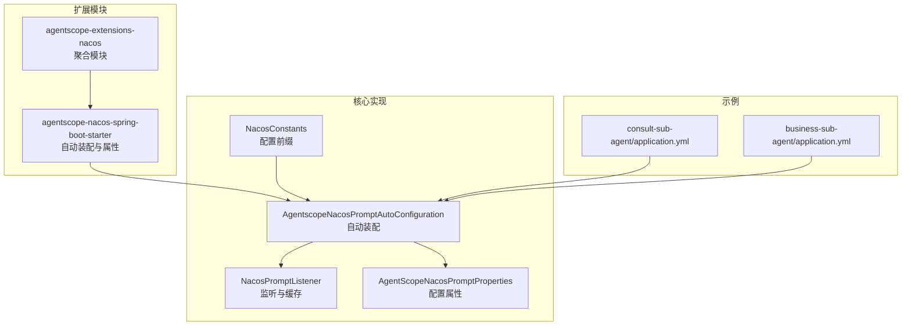
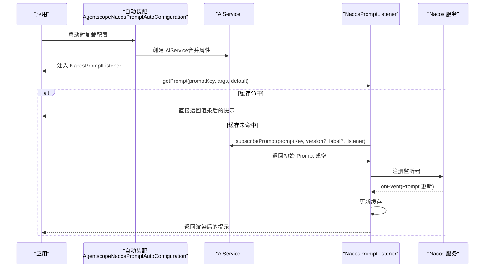
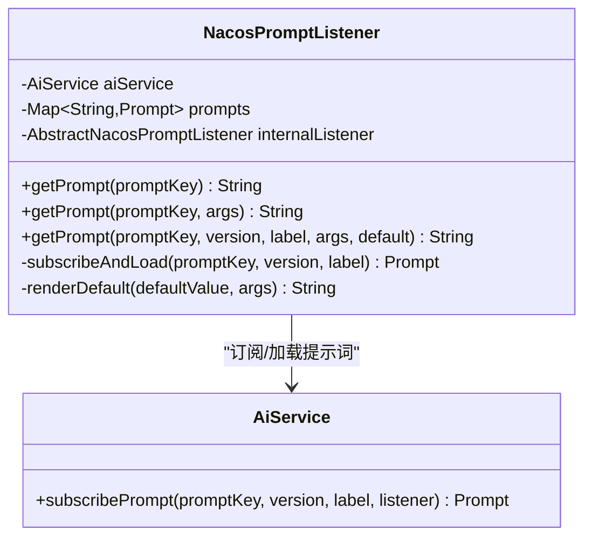
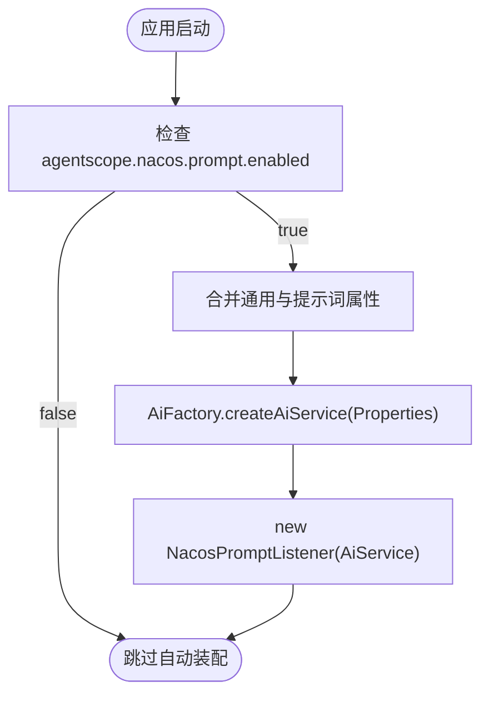
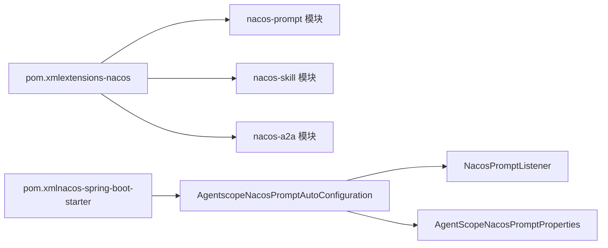

# 提示词监听

<cite>
**本文档引用的文件**
- [NacosPromptListener.java](file://agentscope-extensions/agentscope-extensions-nacos/agentscope-extensions-nacos-prompt/src/main/java/io/agentscope/core/nacos/prompt/NacosPromptListener.java)
- [NacosPromptListenerTest.java](file://agentscope-extensions/agentscope-extensions-nacos/agentscope-extensions-nacos-prompt/src/test/java/io/agentscope/core/nacos/prompt/NacosPromptListenerTest.java)
- [AgentscopeNacosPromptAutoConfiguration.java](file://agentscope-extensions/agentscope-spring-boot-starters/agentscope-nacos-spring-boot-starter/src/main/java/io/agentscope/spring/boot/nacos/AgentscopeNacosPromptAutoConfiguration.java)
- [AgentScopeNacosPromptProperties.java](file://agentscope-extensions/agentscope-spring-boot-starters/agentscope-nacos-spring-boot-starter/src/main/java/io/agentscope/spring/boot/nacos/properties/AgentScopeNacosPromptProperties.java)
- [NacosConstants.java](file://agentscope-extensions/agentscope-spring-boot-starters/agentscope-nacos-spring-boot-starter/src/main/java/io/agentscope/spring/boot/nacos/constants/NacosConstants.java)
- [application.yml（consult-sub-agent）](file://agentscope-examples/boba-tea-shop/consult-sub-agent/src/main/resources/application.yml)
- [application.yml（business-sub-agent）](file://agentscope-examples/boba-tea-shop/business-sub-agent/src/main/resources/application.yml)
- [pom.xml（extensions-nacos）](file://agentscope-extensions/agentscope-extensions-nacos/pom.xml)
- [pom.xml（nacos-spring-boot-starter）](file://agentscope-extensions/agentscope-spring-boot-starters/agentscope-nacos-spring-boot-starter/pom.xml)
</cite>

## 目录
1. [简介](#简介)
2. [项目结构](#项目结构)
3. [核心组件](#核心组件)
4. [架构总览](#架构总览)
5. [详细组件分析](#详细组件分析)
6. [依赖关系分析](#依赖关系分析)
7. [性能考虑](#性能考虑)
8. [故障排查指南](#故障排查指南)
9. [结论](#结论)
10. [附录](#附录)

## 简介
本文件面向使用 Nacos 进行动态提示词管理的场景，系统化阐述 AgentScope Java 中的“提示词监听”能力。重点包括：
- 远程存储与实时更新：通过 Nacos AiService 订阅提示词，接收变更事件并热更新。
- 版本与标签控制：支持按版本或标签定向获取提示词，满足灰度与多环境管理。
- 存储结构与命名：提示词在 Nacos 中以 Prompt 形式存储，使用统一的键值标识。
- 配置示例：提供 YAML 与 JSON 的提示词模板参考格式。
- 优先级与回退策略：Nacos 提示词优先于本地默认值，异常时可回退至默认模板。
- 性能优化：缓存命中、批量订阅与最小化网络交互。
- 企业级部署：一致性与同步保障建议。

## 项目结构
围绕提示词监听的关键模块与文件如下：
- 核心监听器：NacosPromptListener
- Spring Boot 自动装配：AgentscopeNacosPromptAutoConfiguration
- 配置属性：AgentScopeNacosPromptProperties
- 常量前缀：NacosConstants
- 示例配置：consult-sub-agent 与 business-sub-agent 的 application.yml
- 模块聚合：agentscope-extensions-nacos 与 agentscope-nacos-spring-boot-starter

**图表来源**
- [pom.xml（extensions-nacos）:34-38](file://agentscope-extensions/agentscope-extensions-nacos/pom.xml#L34-L38)
- [AgentscopeNacosPromptAutoConfiguration.java:45-76](file://agentscope-extensions/agentscope-spring-boot-starters/agentscope-nacos-spring-boot-starter/src/main/java/io/agentscope/spring/boot/nacos/AgentscopeNacosPromptAutoConfiguration.java#L45-L76)
- [AgentScopeNacosPromptProperties.java:53-122](file://agentscope-extensions/agentscope-spring-boot-starters/agentscope-nacos-spring-boot-starter/src/main/java/io/agentscope/spring/boot/nacos/properties/AgentScopeNacosPromptProperties.java#L53-L122)
- [NacosConstants.java:27-38](file://agentscope-extensions/agentscope-spring-boot-starters/agentscope-nacos-spring-boot-starter/src/main/java/io/agentscope/spring/boot/nacos/constants/NacosConstants.java#L27-L38)
- [application.yml（consult-sub-agent）:1-124](file://agentscope-examples/boba-tea-shop/consult-sub-agent/src/main/resources/application.yml#L1-L124)
- [application.yml（business-sub-agent）:1-126](file://agentscope-examples/boba-tea-shop/business-sub-agent/src/main/resources/application.yml#L1-L126)

**章节来源**
- [pom.xml（extensions-nacos）:34-38](file://agentscope-extensions/agentscope-extensions-nacos/pom.xml#L34-L38)
- [pom.xml（nacos-spring-boot-starter）:1-200](file://agentscope-extensions/agentscope-spring-boot-starters/agentscope-nacos-spring-boot-starter/pom.xml#L1-L200)

## 核心组件
- NacosPromptListener：负责订阅提示词、缓存、渲染与热更新；支持版本/标签定向与默认值回退。
- AgentscopeNacosPromptAutoConfiguration：在启用时创建 AiService 与 NacosPromptListener Bean，并合并 Nacos 与提示词相关配置。
- AgentScopeNacosPromptProperties：定义提示词键、版本/标签、变量映射等配置项。
- NacosConstants：提供 agentscope.nacos.prompt 的配置前缀，确保属性路径一致。

关键职责与行为要点：
- 订阅与加载：首次访问某 promptKey 时，调用 AiService.subscribePrompt 完成订阅与加载。
- 缓存与并发：内部以线程安全的 Map 缓存提示词，支持并发读写。
- 热更新：通过 Nacos 事件回调更新缓存，后续 getPrompt 直接返回最新渲染结果。
- 渲染：支持模板变量占位符渲染；若变量缺失则保留原占位符。
- 回退：Nacos 返回空或异常时，可回退到默认模板；若无默认则返回空字符串。

**章节来源**
- [NacosPromptListener.java:29-160](file://agentscope-extensions/agentscope-extensions-nacos/agentscope-extensions-nacos-prompt/src/main/java/io/agentscope/core/nacos/prompt/NacosPromptListener.java#L29-L160)
- [AgentscopeNacosPromptAutoConfiguration.java:45-76](file://agentscope-extensions/agentscope-spring-boot-starters/agentscope-nacos-spring-boot-starter/src/main/java/io/agentscope/spring/boot/nacos/AgentscopeNacosPromptAutoConfiguration.java#L45-L76)
- [AgentScopeNacosPromptProperties.java:53-122](file://agentscope-extensions/agentscope-spring-boot-starters/agentscope-nacos-spring-boot-starter/src/main/java/io/agentscope/spring/boot/nacos/properties/AgentScopeNacosPromptProperties.java#L53-L122)
- [NacosConstants.java:27-38](file://agentscope-extensions/agentscope-spring-boot-starters/agentscope-nacos-spring-boot-starter/src/main/java/io/agentscope/spring/boot/nacos/constants/NacosConstants.java#L27-L38)

## 架构总览
下图展示从应用启动到运行期热更新的端到端流程。

**图表来源**
- [AgentscopeNacosPromptAutoConfiguration.java:60-75](file://agentscope-extensions/agentscope-spring-boot-starters/agentscope-nacos-spring-boot-starter/src/main/java/io/agentscope/spring/boot/nacos/AgentscopeNacosPromptAutoConfiguration.java#L60-L75)
- [NacosPromptListener.java:104-158](file://agentscope-extensions/agentscope-extensions-nacos/agentscope-extensions-nacos-prompt/src/main/java/io/agentscope/core/nacos/prompt/NacosPromptListener.java#L104-L158)

## 详细组件分析

### NacosPromptListener 实现原理
- 监听器注册：内部持有 AbstractNacosPromptListener，接收 Nacos 事件并更新内存缓存。
- 订阅与加载：首次访问时调用 AiService.subscribePrompt，若返回空则标记为空哨兵，避免重复拉取。
- 渲染逻辑：若模板为空或不可用，优先使用默认模板渲染；否则直接渲染。
- 版本/标签：支持 version 与 label 参数互斥传入，实现定向获取。
- 默认值：当 Nacos 异常或模板为空时，可回退到默认模板并渲染变量。

**图表来源**
- [NacosPromptListener.java:29-160](file://agentscope-extensions/agentscope-extensions-nacos/agentscope-extensions-nacos-prompt/src/main/java/io/agentscope/core/nacos/prompt/NacosPromptListener.java#L29-L160)

**章节来源**
- [NacosPromptListener.java:29-160](file://agentscope-extensions/agentscope-extensions-nacos/agentscope-extensions-nacos-prompt/src/main/java/io/agentscope/core/nacos/prompt/NacosPromptListener.java#L29-L160)

### 配置加载与自动装配
- 自动装配条件：当 agentscope.nacos.prompt.enabled 为 true 时生效，默认开启。
- 属性合并：将通用 Nacos 属性与提示词专用属性合并后创建 AiService。
- Bean 注入：提供 agentscopePromptAiService 与 NacosPromptListener Bean。

**图表来源**
- [AgentscopeNacosPromptAutoConfiguration.java:52-75](file://agentscope-extensions/agentscope-spring-boot-starters/agentscope-nacos-spring-boot-starter/src/main/java/io/agentscope/spring/boot/nacos/AgentscopeNacosPromptAutoConfiguration.java#L52-L75)
- [AgentScopeNacosPromptProperties.java:53-122](file://agentscope-extensions/agentscope-spring-boot-starters/agentscope-nacos-spring-boot-starter/src/main/java/io/agentscope/spring/boot/nacos/properties/AgentScopeNacosPromptProperties.java#L53-L122)
- [NacosConstants.java:27-38](file://agentscope-extensions/agentscope-spring-boot-starters/agentscope-nacos-spring-boot-starter/src/main/java/io/agentscope/spring/boot/nacos/constants/NacosConstants.java#L27-L38)

**章节来源**
- [AgentscopeNacosPromptAutoConfiguration.java:45-76](file://agentscope-extensions/agentscope-spring-boot-starters/agentscope-nacos-spring-boot-starter/src/main/java/io/agentscope/spring/boot/nacos/AgentscopeNacosPromptAutoConfiguration.java#L45-L76)
- [AgentScopeNacosPromptProperties.java:53-122](file://agentscope-extensions/agentscope-spring-boot-starters/agentscope-nacos-spring-boot-starter/src/main/java/io/agentscope/spring/boot/nacos/properties/AgentScopeNacosPromptProperties.java#L53-L122)
- [NacosConstants.java:27-38](file://agentscope-extensions/agentscope-spring-boot-starters/agentscope-nacos-spring-boot-starter/src/main/java/io/agentscope/spring/boot/nacos/constants/NacosConstants.java#L27-L38)

### 提示词存储结构与命名规则
- 存储模型：提示词以 Prompt 对象形式存储于 Nacos，包含键、版本与模板文本。
- 命名与定位：通过 promptKey 定位提示词；可选 version 或 label 实现版本/标签定向。
- 数据组织：建议按业务域划分命名空间与分组，键采用语义化命名，便于团队协作与治理。

注意：以上为基于源码行为的抽象说明，具体键值与分组策略应由团队在 Nacos 控制台或管理接口中统一规范。

**章节来源**
- [NacosPromptListener.java:104-158](file://agentscope-extensions/agentscope-extensions-nacos/agentscope-extensions-nacos-prompt/src/main/java/io/agentscope/core/nacos/prompt/NacosPromptListener.java#L104-L158)

### 配置示例与模板格式
- YAML 格式：示例工程中展示了如何在 application.yml 中声明 Nacos 服务地址、命名空间以及业务提示词内容（非 Nacos 提示词键，而是本地默认提示词）。
- JSON 格式：提示词模板可作为 JSON 字段存储于 Nacos，键为提示词键，值为包含模板文本的对象；渲染时使用占位符替换变量。

提示词模板占位符语法：采用双花括号的变量占位符，渲染时将变量映射替换到对应位置。

**章节来源**
- [application.yml（consult-sub-agent）:1-124](file://agentscope-examples/boba-tea-shop/consult-sub-agent/src/main/resources/application.yml#L1-L124)
- [application.yml（business-sub-agent）:1-126](file://agentscope-examples/boba-tea-shop/business-sub-agent/src/main/resources/application.yml#L1-L126)
- [NacosPromptListenerTest.java:255-302](file://agentscope-extensions/agentscope-extensions-nacos/agentscope-extensions-nacos-prompt/src/test/java/io/agentscope/core/nacos/prompt/NacosPromptListenerTest.java#L255-L302)

### 优先级与覆盖策略
- 优先级：Nacos 提示词优先于本地默认值；当 Nacos 可用时，本地默认值仅作为兜底。
- 覆盖策略：当收到 Nacos 的新事件时，立即更新缓存并影响后续渲染；若事件无效（空键、空模板），则忽略更新并保持旧值。

**章节来源**
- [AgentscopeNacosPromptAutoConfiguration.java:37-46](file://agentscope-extensions/agentscope-spring-boot-starters/agentscope-nacos-spring-boot-starter/src/main/java/io/agentscope/spring/boot/nacos/AgentscopeNacosPromptAutoConfiguration.java#L37-L46)
- [NacosPromptListenerTest.java:340-440](file://agentscope-extensions/agentscope-extensions-nacos/agentscope-extensions-nacos-prompt/src/test/java/io/agentscope/core/nacos/prompt/NacosPromptListenerTest.java#L340-L440)

### 版本管理与回滚策略
- 版本/标签：通过 version 或 label 指定目标提示词版本；二者互斥，二者皆空时默认取最新版本。
- 回滚：若线上出现异常，可通过降低版本或切换标签快速回滚；同时可利用默认模板作为紧急回退。

**章节来源**
- [AgentScopeNacosPromptProperties.java:66-76](file://agentscope-extensions/agentscope-spring-boot-starters/agentscope-nacos-spring-boot-starter/src/main/java/io/agentscope/spring/boot/nacos/properties/AgentScopeNacosPromptProperties.java#L66-L76)
- [NacosPromptListener.java:104-139](file://agentscope-extensions/agentscope-extensions-nacos/agentscope-extensions-nacos-prompt/src/main/java/io/agentscope/core/nacos/prompt/NacosPromptListener.java#L104-L139)

## 依赖关系分析
- 模块聚合：agentscope-extensions-nacos 下包含 nacos-prompt、nacos-skill、nacos-a2a 等子模块。
- 自动装配：nacos-spring-boot-starter 提供 AiService 与 NacosPromptListener 的 Bean 定义。
- 属性绑定：AgentScopeNacosPromptProperties 绑定 agentscope.nacos.prompt.* 前缀的配置项。

**图表来源**
- [pom.xml（extensions-nacos）:34-38](file://agentscope-extensions/agentscope-extensions-nacos/pom.xml#L34-L38)
- [pom.xml（nacos-spring-boot-starter）:1-200](file://agentscope-extensions/agentscope-spring-boot-starters/agentscope-nacos-spring-boot-starter/pom.xml#L1-L200)

**章节来源**
- [pom.xml（extensions-nacos）:34-38](file://agentscope-extensions/agentscope-extensions-nacos/pom.xml#L34-L38)
- [pom.xml（nacos-spring-boot-starter）:1-200](file://agentscope-extensions/agentscope-spring-boot-starters/agentscope-nacos-spring-boot-starter/pom.xml#L1-L200)

## 性能考虑
- 缓存策略：首次访问时拉取并缓存；后续直接命中，避免重复网络请求。
- 并发安全：使用线程安全的并发映射，支持高并发读取。
- 最小化订阅：同一 promptKey 仅一次订阅，后续复用缓存。
- 批量更新：Nacos 事件回调会触发缓存更新，避免轮询带来的额外开销。
- 渲染成本：模板变量渲染为内存操作，建议控制变量数量与模板复杂度。

**章节来源**
- [NacosPromptListener.java:66-158](file://agentscope-extensions/agentscope-extensions-nacos/agentscope-extensions-nacos-prompt/src/main/java/io/agentscope/core/nacos/prompt/NacosPromptListener.java#L66-L158)
- [NacosPromptListenerTest.java:304-338](file://agentscope-extensions/agentscope-extensions-nacos/agentscope-extensions-nacos-prompt/src/test/java/io/agentscope/core/nacos/prompt/NacosPromptListenerTest.java#L304-L338)

## 故障排查指南
- 无提示词返回：检查 promptKey 是否正确；确认 Nacos 中是否存在该键；查看日志是否输出“未找到”或“模板为空”的警告。
- 渲染异常：确认变量映射是否完整；缺失变量将保留占位符；必要时提供默认模板。
- Nacos 异常：当订阅失败时，若提供了默认模板则回退渲染；否则抛出异常。
- 事件未生效：确认内部监听器已被注册；检查事件回调中键与模板的有效性。

**章节来源**
- [NacosPromptListenerTest.java:101-147](file://agentscope-extensions/agentscope-extensions-nacos/agentscope-extensions-nacos-prompt/src/test/java/io/agentscope/core/nacos/prompt/NacosPromptListenerTest.java#L101-L147)
- [NacosPromptListenerTest.java:178-251](file://agentscope-extensions/agentscope-extensions-nacos/agentscope-extensions-nacos-prompt/src/test/java/io/agentscope/core/nacos/prompt/NacosPromptListenerTest.java#L178-L251)
- [NacosPromptListenerTest.java:340-440](file://agentscope-extensions/agentscope-extensions-nacos/agentscope-extensions-nacos-prompt/src/test/java/io/agentscope/core/nacos/prompt/NacosPromptListenerTest.java#L340-L440)

## 结论
Nacos 提示词监听通过 AiService 的订阅与事件机制，实现了提示词的远程存储、实时更新与版本/标签控制。配合 Spring Boot 自动装配与属性绑定，开发者可以以极低侵入的方式启用动态提示词管理，并在异常与变更场景下具备可靠的回退与回滚能力。建议在企业级环境中统一命名规范、版本策略与回滚预案，以确保一致性与稳定性。

## 附录
- 配置前缀：agentscope.nacos.prompt.*
- 关键属性：
  - enabled：是否启用 Nacos 提示词集成
  - sysPromptKey：系统提示词键
  - version：目标版本
  - label：目标标签
  - variables：模板变量映射

**章节来源**
- [AgentScopeNacosPromptProperties.java:53-122](file://agentscope-extensions/agentscope-spring-boot-starters/agentscope-nacos-spring-boot-starter/src/main/java/io/agentscope/spring/boot/nacos/properties/AgentScopeNacosPromptProperties.java#L53-L122)
- [NacosConstants.java:27-38](file://agentscope-extensions/agentscope-spring-boot-starters/agentscope-nacos-spring-boot-starter/src/main/java/io/agentscope/spring/boot/nacos/constants/NacosConstants.java#L27-L38)