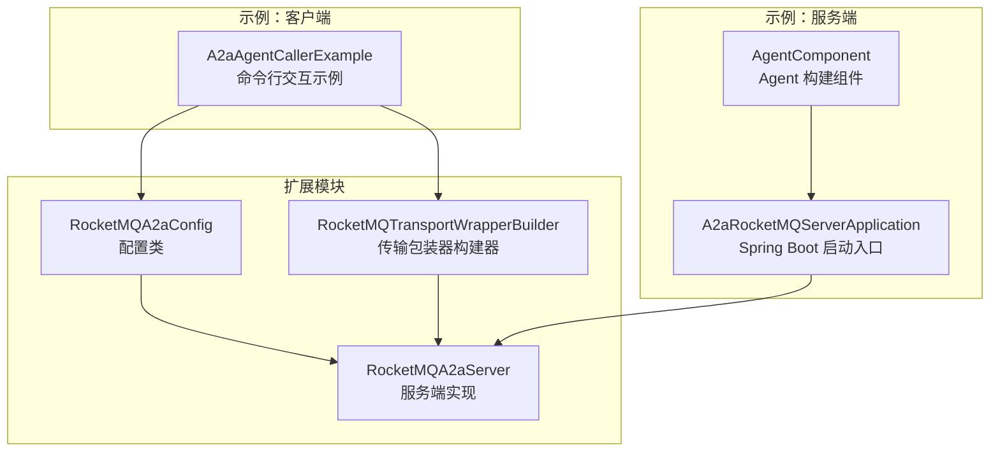
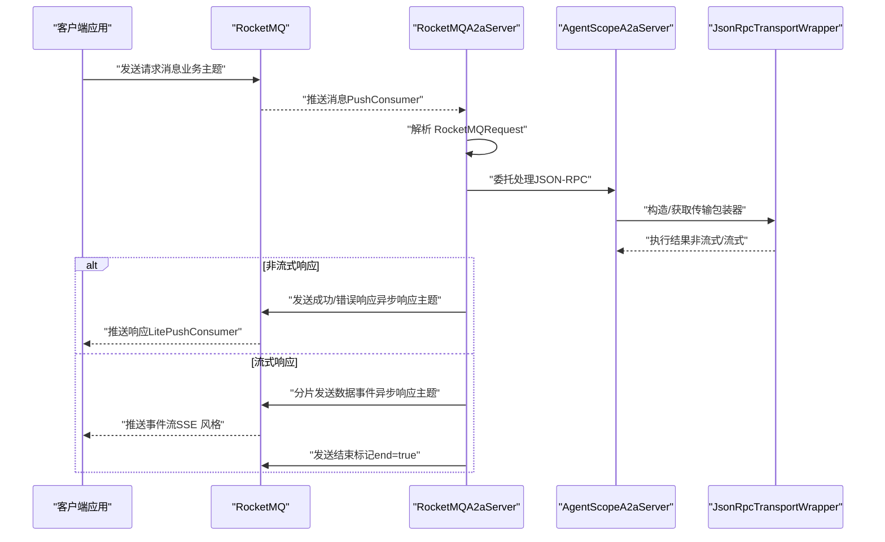
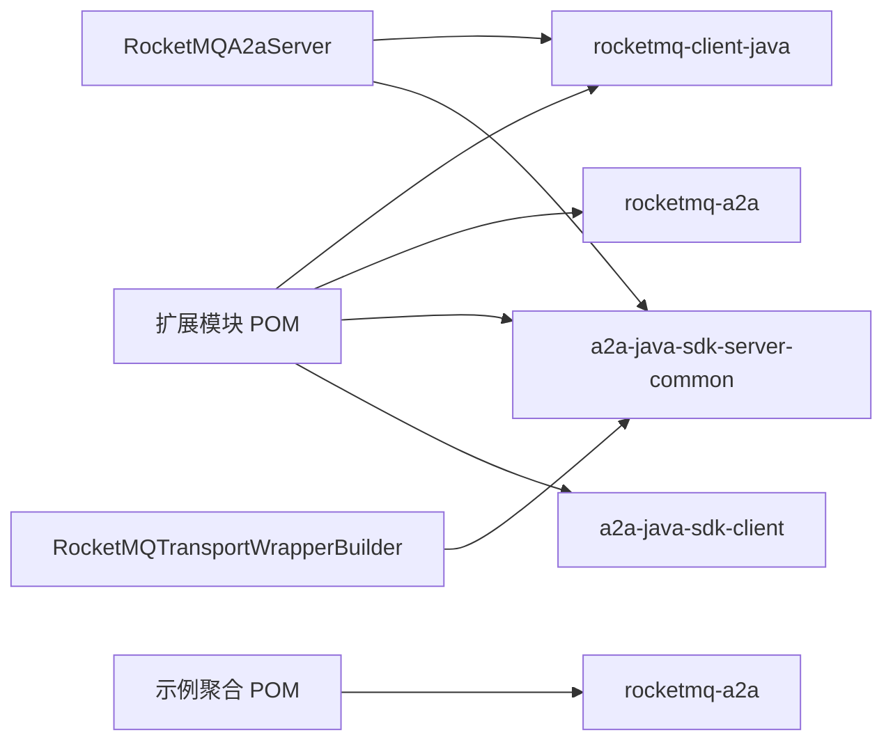

# RocketMQ 集成

<cite>
**本文引用的文件**   
- [agentscope-extensions-rocketmq/pom.xml](file://agentscope-extensions/agentscope-extensions-rocketmq/pom.xml)
- [a2a-rocketmq 示例聚合 POM](file://agentscope-examples/a2a-rocketmq/pom.xml)
- [agentscope-extensions-rocketmq/src/main/java/io/agentscope/extensions/rocketmq/a2a/config/RocketMQA2aConfig.java](file://agentscope-extensions/agentscope-extensions-rocketmq/src/main/java/io/agentscope/extensions/rocketmq/a2a/config/RocketMQA2aConfig.java)
- [agentscope-extensions-rocketmq/src/main/java/io/agentscope/extensions/rocketmq/a2a/server/RocketMQA2aServer.java](file://agentscope-extensions/agentscope-extensions-rocketmq/src/main/java/io/agentscope/extensions/rocketmq/a2a/server/RocketMQA2aServer.java)
- [agentscope-extensions-rocketmq/src/main/java/io/agentscope/extensions/rocketmq/a2a/wrapper/RocketMQTransportWrapperBuilder.java](file://agentscope-extensions/agentscope-extensions-rocketmq/src/main/java/io/agentscope/extensions/rocketmq/a2a/wrapper/RocketMQTransportWrapperBuilder.java)
- [agentscope-examples/a2a-rocketmq/agentscope-client/src/main/java/io/agentscope/examples/a2a/rocketmq/client/A2aAgentCallerExample.java](file://agentscope-examples/a2a-rocketmq/agentscope-client/src/main/java/io/agentscope/examples/a2a/rocketmq/client/A2aAgentCallerExample.java)
- [agentscope-examples/a2a-rocketmq/agentscope-server/src/main/java/io/agentscope/examples/a2a/rocketmq/server/A2aRocketMQServerApplication.java](file://agentscope-examples/a2a-rocketmq/agentscope-server/src/main/java/io/agentscope/examples/a2a/rocketmq/server/A2aRocketMQServerApplication.java)
- [agentscope-examples/a2a-rocketmq/agentscope-server/src/main/java/io/agentscope/examples/a2a/rocketmq/server/component/AgentComponent.java](file://agentscope-examples/a2a-rocketmq/agentscope-server/src/main/java/io/agentscope/examples/a2a/rocketmq/server/component/AgentComponent.java)
</cite>

## 目录
1. [引言](#引言)
2. [项目结构](#项目结构)
3. [核心组件](#核心组件)
4. [架构总览](#架构总览)
5. [详细组件分析](#详细组件分析)
6. [依赖关系分析](#依赖关系分析)
7. [性能考量](#性能考量)
8. [故障排查指南](#故障排查指南)
9. [结论](#结论)
10. [附录](#附录)

## 引言
本技术文档聚焦于 AgentScope Java 中基于 RocketMQ 的 A2A（Agent-to-Agent）通信集成模块，系统阐述 RocketMQ 在智能体间消息传递中的角色与实现方式，覆盖消息发送、接收与确认、A2A 协议的消息封装与协议适配、异步/流式响应、连接配置与订阅管理、以及可靠性保障（含重试、死信与监控告警）等主题。同时给出性能调优建议与企业级部署的集群与容灾思路，帮助读者在高并发场景下实现稳定可靠的智能体协作。

## 项目结构
该集成模块位于扩展工程 agentscope-extensions-rocketmq 下，并配套 a2a-rocketmq 示例工程，包含客户端与服务端两部分。核心代码围绕 RocketMQA2aConfig、RocketMQA2aServer、RocketMQTransportWrapperBuilder 三大构件展开；示例工程展示了如何通过 RocketMQ 传输进行 A2A 调用与服务端集成。



图表来源
- [agentscope-extensions-rocketmq/src/main/java/io/agentscope/extensions/rocketmq/a2a/config/RocketMQA2aConfig.java:1-400](file://agentscope-extensions/agentscope-extensions-rocketmq/src/main/java/io/agentscope/extensions/rocketmq/a2a/config/RocketMQA2aConfig.java#L1-L400)
- [agentscope-extensions-rocketmq/src/main/java/io/agentscope/extensions/rocketmq/a2a/server/RocketMQA2aServer.java:1-532](file://agentscope-extensions/agentscope-extensions-rocketmq/src/main/java/io/agentscope/extensions/rocketmq/a2a/server/RocketMQA2aServer.java#L1-L532)
- [agentscope-extensions-rocketmq/src/main/java/io/agentscope/extensions/rocketmq/a2a/wrapper/RocketMQTransportWrapperBuilder.java:1-49](file://agentscope-extensions/agentscope-extensions-rocketmq/src/main/java/io/agentscope/extensions/rocketmq/a2a/wrapper/RocketMQTransportWrapperBuilder.java#L1-L49)
- [agentscope-examples/a2a-rocketmq/agentscope-client/src/main/java/io/agentscope/examples/a2a/rocketmq/client/A2aAgentCallerExample.java:1-167](file://agentscope-examples/a2a-rocketmq/agentscope-client/src/main/java/io/agentscope/examples/a2a/rocketmq/client/A2aAgentCallerExample.java#L1-L167)
- [agentscope-examples/a2a-rocketmq/agentscope-server/src/main/java/io/agentscope/examples/a2a/rocketmq/server/A2aRocketMQServerApplication.java:1-37](file://agentscope-examples/a2a-rocketmq/agentscope-server/src/main/java/io/agentscope/examples/a2a/rocketmq/server/A2aRocketMQServerApplication.java#L1-L37)
- [agentscope-examples/a2a-rocketmq/agentscope-server/src/main/java/io/agentscope/examples/a2a/rocketmq/server/component/AgentComponent.java:1-63](file://agentscope-examples/a2a-rocketmq/agentscope-server/src/main/java/io/agentscope/examples/a2a/rocketmq/server/component/AgentComponent.java#L1-L63)

章节来源
- [agentscope-extensions-rocketmq/pom.xml:1-86](file://agentscope-extensions/agentscope-extensions-rocketmq/pom.xml#L1-L86)
- [a2a-rocketmq 示例聚合 POM:1-90](file://agentscope-examples/a2a-rocketmq/pom.xml#L1-L90)

## 核心组件
- RocketMQA2aConfig：封装 RocketMQ 连接端点、命名空间、业务主题、消费者组、访问密钥、异步响应主题与组等关键配置项，提供 Builder 模式以简化装配。
- RocketMQA2aServer：基于 RocketMQ 客户端 API 实现 A2A 请求的接收、解析、转发至 AgentScopeA2aServer 并回发响应；内置 SSE 流式支持与线程池处理。
- RocketMQTransportWrapperBuilder：将 JSON-RPC 请求处理器包装为 A2A 传输层，供 AgentScope 使用。
- 示例客户端 A2aAgentCallerExample：演示如何通过 RocketMQ 传输发起 A2A 调用并消费流式响应。
- 示例服务端组件：Spring Boot 应用入口与 Agent 组件装配，展示如何在服务端启用 A2A RocketMQ 传输。

章节来源
- [agentscope-extensions-rocketmq/src/main/java/io/agentscope/extensions/rocketmq/a2a/config/RocketMQA2aConfig.java:1-400](file://agentscope-extensions/agentscope-extensions-rocketmq/src/main/java/io/agentscope/extensions/rocketmq/a2a/config/RocketMQA2aConfig.java#L1-L400)
- [agentscope-extensions-rocketmq/src/main/java/io/agentscope/extensions/rocketmq/a2a/server/RocketMQA2aServer.java:1-532](file://agentscope-extensions/agentscope-extensions-rocketmq/src/main/java/io/agentscope/extensions/rocketmq/a2a/server/RocketMQA2aServer.java#L1-L532)
- [agentscope-extensions-rocketmq/src/main/java/io/agentscope/extensions/rocketmq/a2a/wrapper/RocketMQTransportWrapperBuilder.java:1-49](file://agentscope-extensions/agentscope-extensions-rocketmq/src/main/java/io/agentscope/extensions/rocketmq/a2a/wrapper/RocketMQTransportWrapperBuilder.java#L1-L49)
- [agentscope-examples/a2a-rocketmq/agentscope-client/src/main/java/io/agentscope/examples/a2a/rocketmq/client/A2aAgentCallerExample.java:1-167](file://agentscope-examples/a2a-rocketmq/agentscope-client/src/main/java/io/agentscope/examples/a2a/rocketmq/client/A2aAgentCallerExample.java#L1-L167)
- [agentscope-examples/a2a-rocketmq/agentscope-server/src/main/java/io/agentscope/examples/a2a/rocketmq/server/A2aRocketMQServerApplication.java:1-37](file://agentscope-examples/a2a-rocketmq/agentscope-server/src/main/java/io/agentscope/examples/a2a/rocketmq/server/A2aRocketMQServerApplication.java#L1-L37)
- [agentscope-examples/a2a-rocketmq/agentscope-server/src/main/java/io/agentscope/examples/a2a/rocketmq/server/component/AgentComponent.java:1-63](file://agentscope-examples/a2a-rocketmq/agentscope-server/src/main/java/io/agentscope/examples/a2a/rocketmq/server/component/AgentComponent.java#L1-L63)

## 架构总览
下图展示了从客户端到服务端的消息流转路径，以及 RocketMQ 在其中的角色：客户端通过 RocketMQ 发送请求，服务端订阅业务主题并消费消息，解析为 JSON-RPC 请求后交由 A2A 处理器执行，再通过 RocketMQ 将非流式或流式响应返回给客户端。



图表来源
- [agentscope-extensions-rocketmq/src/main/java/io/agentscope/extensions/rocketmq/a2a/server/RocketMQA2aServer.java:183-222](file://agentscope-extensions/agentscope-extensions-rocketmq/src/main/java/io/agentscope/extensions/rocketmq/a2a/server/RocketMQA2aServer.java#L183-L222)
- [agentscope-extensions-rocketmq/src/main/java/io/agentscope/extensions/rocketmq/a2a/server/RocketMQA2aServer.java:229-274](file://agentscope-extensions/agentscope-extensions-rocketmq/src/main/java/io/agentscope/extensions/rocketmq/a2a/server/RocketMQA2aServer.java#L229-L274)
- [agentscope-extensions-rocketmq/src/main/java/io/agentscope/extensions/rocketmq/a2a/server/RocketMQA2aServer.java:287-325](file://agentscope-extensions/agentscope-extensions-rocketmq/src/main/java/io/agentscope/extensions/rocketmq/a2a/server/RocketMQA2aServer.java#L287-L325)
- [agentscope-extensions-rocketmq/src/main/java/io/agentscope/extensions/rocketmq/a2a/server/RocketMQA2aServer.java:402-445](file://agentscope-extensions/agentscope-extensions-rocketmq/src/main/java/io/agentscope/extensions/rocketmq/a2a/server/RocketMQA2aServer.java#L402-L445)
- [agentscope-extensions-rocketmq/src/main/java/io/agentscope/extensions/rocketmq/a2a/wrapper/RocketMQTransportWrapperBuilder.java:38-47](file://agentscope-extensions/agentscope-extensions-rocketmq/src/main/java/io/agentscope/extensions/rocketmq/a2a/wrapper/RocketMQTransportWrapperBuilder.java#L38-L47)

## 详细组件分析

### 配置与连接：RocketMQA2aConfig
- 关键字段：服务端点、命名空间、业务主题、业务消费者组、访问密钥、密钥、异步响应主题、异步响应消费者组。
- 设计要点：提供 Builder 以链式设置；toString 便于日志输出；用于初始化 Producer、PushConsumer、LitePushConsumer。
- 使用建议：生产环境务必通过安全渠道注入 AK/SK 与命名空间；主题与消费者组需按租户/环境隔离。

章节来源
- [agentscope-extensions-rocketmq/src/main/java/io/agentscope/extensions/rocketmq/a2a/config/RocketMQA2aConfig.java:21-240](file://agentscope-extensions/agentscope-extensions-rocketmq/src/main/java/io/agentscope/extensions/rocketmq/a2a/config/RocketMQA2aConfig.java#L21-L240)
- [agentscope-extensions-rocketmq/src/main/java/io/agentscope/extensions/rocketmq/a2a/config/RocketMQA2aConfig.java:247-368](file://agentscope-extensions/agentscope-extensions-rocketmq/src/main/java/io/agentscope/extensions/rocketmq/a2a/config/RocketMQA2aConfig.java#L247-L368)

### 服务端实现：RocketMQA2aServer
- 初始化流程：校验配置 → 构建 Producer → 构建 PushConsumer 订阅业务主题 → 构建 LitePushConsumer 订阅异步响应主题 → 动态生成 serverLiteTopic 用于点对点直连。
- 消息监听：解析 RocketMQRequest → 交由 JsonRpcTransportWrapper 处理 → 根据结果类型选择非流式或流式回发。
- 流式支持：内部使用 FluxSseSupport 将响应事件转换为“data: ...”+“id: ...”格式并通过 Producer 分片发送，结束时发送 end=true 标记。
- 线程池：独立线程池处理流式事件，避免阻塞消息消费；超时等待 CompletableFuture 完成后决定消费结果 SUCCESS/FAILURE。
- 错误处理：异常记录日志并返回 FAILURE；CompletableFuture 超时默认 15 分钟。

```mermaid
flowchart TD
Start(["进入监听回调"]) --> Parse["解析 RocketMQRequest"]
Parse --> Dispatch["交由 JsonRpcTransportWrapper 处理"]
Dispatch --> Branch{"返回类型？"}
Branch --> |JSONRPCErrorResponse| BuildErr["构建错误响应"]
Branch --> |JSONRPCResponse| BuildOK["构建成功响应"]
Branch --> |Flux(流式)| ToStream["提交到线程池处理流式"]
BuildErr --> SendResp["发送到异步响应主题"]
BuildOK --> SendResp
ToStream --> Split["分片发送事件end=false"]
Split --> Done["发送结束标记end=true"]
SendResp --> Ack["根据 CompletableFuture 返回消费结果"]
Done --> Ack
Ack --> End(["结束"])
```

图表来源
- [agentscope-extensions-rocketmq/src/main/java/io/agentscope/extensions/rocketmq/a2a/server/RocketMQA2aServer.java:183-222](file://agentscope-extensions/agentscope-extensions-rocketmq/src/main/java/io/agentscope/extensions/rocketmq/a2a/server/RocketMQA2aServer.java#L183-L222)
- [agentscope-extensions-rocketmq/src/main/java/io/agentscope/extensions/rocketmq/a2a/server/RocketMQA2aServer.java:229-274](file://agentscope-extensions/agentscope-extensions-rocketmq/src/main/java/io/agentscope/extensions/rocketmq/a2a/server/RocketMQA2aServer.java#L229-L274)
- [agentscope-extensions-rocketmq/src/main/java/io/agentscope/extensions/rocketmq/a2a/server/RocketMQA2aServer.java:287-325](file://agentscope-extensions/agentscope-extensions-rocketmq/src/main/java/io/agentscope/extensions/rocketmq/a2a/server/RocketMQA2aServer.java#L287-L325)
- [agentscope-extensions-rocketmq/src/main/java/io/agentscope/extensions/rocketmq/a2a/server/RocketMQA2aServer.java:402-445](file://agentscope-extensions/agentscope-extensions-rocketmq/src/main/java/io/agentscope/extensions/rocketmq/a2a/server/RocketMQA2aServer.java#L402-L445)
- [agentscope-extensions-rocketmq/src/main/java/io/agentscope/extensions/rocketmq/a2a/server/RocketMQA2aServer.java:369-381](file://agentscope-extensions/agentscope-rocketmq/src/main/java/io/agentscope/extensions/rocketmq/a2a/server/RocketMQA2aServer.java#L369-L381)

章节来源
- [agentscope-extensions-rocketmq/src/main/java/io/agentscope/extensions/rocketmq/a2a/server/RocketMQA2aServer.java:66-178](file://agentscope-extensions/agentscope-extensions-rocketmq/src/main/java/io/agentscope/extensions/rocketmq/a2a/server/RocketMQA2aServer.java#L66-L178)
- [agentscope-extensions-rocketmq/src/main/java/io/agentscope/extensions/rocketmq/a2a/server/RocketMQA2aServer.java:183-222](file://agentscope-extensions/agentscope-extensions-rocketmq/src/main/java/io/agentscope/extensions/rocketmq/a2a/server/RocketMQA2aServer.java#L183-L222)
- [agentscope-extensions-rocketmq/src/main/java/io/agentscope/extensions/rocketmq/a2a/server/RocketMQA2aServer.java:229-274](file://agentscope-extensions/agentscope-extensions-rocketmq/src/main/java/io/agentscope/extensions/rocketmq/a2a/server/RocketMQA2aServer.java#L229-L274)
- [agentscope-extensions-rocketmq/src/main/java/io/agentscope/extensions/rocketmq/a2a/server/RocketMQA2aServer.java:287-325](file://agentscope-extensions/agentscope-extensions-rocketmq/src/main/java/io/agentscope/extensions/rocketmq/a2a/server/RocketMQA2aServer.java#L287-L325)
- [agentscope-extensions-rocketmq/src/main/java/io/agentscope/extensions/rocketmq/a2a/server/RocketMQA2aServer.java:386-504](file://agentscope-extensions/agentscope-extensions-rocketmq/src/main/java/io/agentscope/extensions/rocketmq/a2a/server/RocketMQA2aServer.java#L386-L504)
- [agentscope-extensions-rocketmq/src/main/java/io/agentscope/extensions/rocketmq/a2a/server/RocketMQA2aServer.java:507-530](file://agentscope-extensions/agentscope-extensions-rocketmq/src/main/java/io/agentscope/extensions/rocketmq/a2a/server/RocketMQA2aServer.java#L507-L530)

### 传输包装器：RocketMQTransportWrapperBuilder
- 作用：将 JSON-RPC 请求处理器包装为 A2A 传输层，指定传输类型为 RocketMQ 协议常量。
- 适用场景：在 AgentScope 内部按协议类型选择对应的传输包装器，从而统一 A2A 协议与底层传输。

章节来源
- [agentscope-extensions-rocketmq/src/main/java/io/agentscope/extensions/rocketmq/a2a/wrapper/RocketMQTransportWrapperBuilder.java:26-48](file://agentscope-extensions/agentscope-extensions-rocketmq/src/main/java/io/agentscope/extensions/rocketmq/a2a/wrapper/RocketMQTransportWrapperBuilder.java#L26-L48)

### 示例：客户端调用
- 通过 RocketMQTransportConfig 设置 AK/SK、命名空间、异步响应主题与组、HTTP 客户端等。
- 构造 A2aAgent 并使用 agentCardResolver 指定目标服务地址，随后发起流式对话。
- 输出过滤仅保留文本块内容，实时打印增量响应。

章节来源
- [agentscope-examples/a2a-rocketmq/agentscope-client/src/main/java/io/agentscope/examples/a2a/rocketmq/client/A2aAgentCallerExample.java:85-107](file://agentscope-examples/a2a-rocketmq/agentscope-client/src/main/java/io/agentscope/examples/a2a/rocketmq/client/A2aAgentCallerExample.java#L85-L107)
- [agentscope-examples/a2a-rocketmq/agentscope-client/src/main/java/io/agentscope/examples/a2a/rocketmq/client/A2aAgentCallerExample.java:145-165](file://agentscope-examples/a2a-rocketmq/agentscope-client/src/main/java/io/agentscope/examples/a2a/rocketmq/client/A2aAgentCallerExample.java#L145-L165)

### 示例：服务端集成
- Spring Boot 启动入口，启用 A2A 能力。
- AgentComponent 提供 ReActAgent 构建器，支持 DashScope 模型，开启流式输出。

章节来源
- [agentscope-examples/a2a-rocketmq/agentscope-server/src/main/java/io/agentscope/examples/a2a/rocketmq/server/A2aRocketMQServerApplication.java:25-35](file://agentscope-examples/a2a-rocketmq/agentscope-server/src/main/java/io/agentscope/examples/a2a/rocketmq/server/A2aRocketMQServerApplication.java#L25-L35)
- [agentscope-examples/a2a-rocketmq/agentscope-server/src/main/java/io/agentscope/examples/a2a/rocketmq/server/component/AgentComponent.java:35-61](file://agentscope-examples/a2a-rocketmq/agentscope-server/src/main/java/io/agentscope/examples/a2a/rocketmq/server/component/AgentComponent.java#L35-L61)

## 依赖关系分析
- RocketMQ 客户端与 A2A SDK：扩展模块引入 rocketmq-client-java 与 rocketmq-a2a，以及 A2A SDK 的服务端与客户端组件。
- 示例模块：a2a-rocketmq 示例聚合 POM 引入 rocketmq-a2a 依赖，并在客户端示例中直接使用 RocketMQ A2A 传输类与配置类。
- 传输包装器：通过 SPI 或注册机制将 RocketMQTransportWrapperBuilder 注册为 JSON-RPC 传输包装器。



图表来源
- [agentscope-extensions-rocketmq/pom.xml:41-86](file://agentscope-extensions/agentscope-extensions-rocketmq/pom.xml#L41-L86)
- [a2a-rocketmq 示例聚合 POM:61-90](file://agentscope-examples/a2a-rocketmq/pom.xml#L61-L90)
- [agentscope-extensions-rocketmq/src/main/java/io/agentscope/extensions/rocketmq/a2a/server/RocketMQA2aServer.java:18-57](file://agentscope-extensions/agentscope-extensions-rocketmq/src/main/java/io/agentscope/extensions/rocketmq/a2a/server/RocketMQA2aServer.java#L18-L57)
- [agentscope-extensions-rocketmq/src/main/java/io/agentscope/extensions/rocketmq/a2a/wrapper/RocketMQTransportWrapperBuilder.java:18-25](file://agentscope-extensions/agentscope-extensions-rocketmq/src/main/java/io/agentscope/extensions/rocketmq/a2a/wrapper/RocketMQTransportWrapperBuilder.java#L18-L25)

章节来源
- [agentscope-extensions-rocketmq/pom.xml:32-86](file://agentscope-extensions/agentscope-extensions-rocketmq/pom.xml#L32-L86)
- [a2a-rocketmq 示例聚合 POM:61-90](file://agentscope-examples/a2a-rocketmq/pom.xml#L61-L90)

## 性能考量
- 线程池与背压：服务端为流式响应单独配置线程池，队列容量较大，避免阻塞消息消费；建议结合实际 QPS 调整核心线程数与队列长度。
- 消息分片与延迟：流式事件采用分片发送并在结束时发送 end=true 标记，有助于客户端及时释放资源；建议控制单片大小与发送频率。
- Producer/Consumer 参数：可结合 RocketMQ 官方客户端参数进行批量大小、压缩阈值、重试次数、拉取超时等优化（具体参数请参考 RocketMQ 官方文档与版本特性）。
- 命名空间与主题隔离：通过命名空间与主题区分不同租户/环境，降低争抢与放大效应。

[本节为通用性能建议，不直接分析具体文件]

## 故障排查指南
- 配置缺失：初始化阶段会校验关键参数，若为空将抛出非法参数异常；检查端点、业务主题、消费者组、异步响应主题与组是否正确设置。
- 消费失败：监听回调中捕获异常并返回 FAILURE；检查网络连通性、AK/SK 权限、主题权限与消费者组状态。
- CompletableFuture 超时：默认等待 15 分钟；若长时间无完成，检查上游处理耗时与线程池饱和情况。
- 日志定位：关注初始化日志与错误日志，定位 Producer/Consumer 构建与消息发送/接收阶段的问题。

章节来源
- [agentscope-extensions-rocketmq/src/main/java/io/agentscope/extensions/rocketmq/a2a/server/RocketMQA2aServer.java:507-530](file://agentscope-extensions/agentscope-extensions-rocketmq/src/main/java/io/agentscope/extensions/rocketmq/a2a/server/RocketMQA2aServer.java#L507-L530)
- [agentscope-extensions-rocketmq/src/main/java/io/agentscope/extensions/rocketmq/a2a/server/RocketMQA2aServer.java:268-273](file://agentscope-extensions/agentscope-extensions-rocketmq/src/main/java/io/agentscope/extensions/rocketmq/a2a/server/RocketMQA2aServer.java#L268-L273)
- [agentscope-extensions-rocketmq/src/main/java/io/agentscope/extensions/rocketmq/a2a/server/RocketMQA2aServer.java:369-381](file://agentscope-extensions/agentscope-extensions-rocketmq/src/main/java/io/agentscope/extensions/rocketmq/a2a/server/RocketMQA2aServer.java#L369-L381)

## 结论
本集成模块以 RocketMQ 为传输载体，实现了 A2A 协议在智能体间的可靠消息传递，覆盖非流式与流式响应、异步确认、线程池并发处理与配置化管理。通过示例工程可快速落地，配合生产级参数与运维策略，可在高并发场景下实现稳定高效的智能体协作。

[本节为总结性内容，不直接分析具体文件]

## 附录

### A2A 协议与消息封装要点
- 请求封装：服务端监听到消息后解析为 RocketMQRequest，交由 JSON-RPC 处理器执行。
- 响应封装：非流式直接封装为 RocketMQResponse 并发送；流式通过分片发送事件并在末尾发送结束标记。
- 协议适配：通过 RocketMQTransportWrapperBuilder 将 JSON-RPC 包装为 A2A 传输层，保持协议无关性。

章节来源
- [agentscope-extensions-rocketmq/src/main/java/io/agentscope/extensions/rocketmq/a2a/server/RocketMQA2aServer.java:229-274](file://agentscope-extensions/agentscope-extensions-rocketmq/src/main/java/io/agentscope/extensions/rocketmq/a2a/server/RocketMQA2aServer.java#L229-L274)
- [agentscope-extensions-rocketmq/src/main/java/io/agentscope/extensions/rocketmq/a2a/server/RocketMQA2aServer.java:287-325](file://agentscope-extensions/agentscope-extensions-rocketmq/src/main/java/io/agentscope/extensions/rocketmq/a2a/server/RocketMQA2aServer.java#L287-L325)
- [agentscope-extensions-rocketmq/src/main/java/io/agentscope/extensions/rocketmq/a2a/wrapper/RocketMQTransportWrapperBuilder.java:32-47](file://agentscope-extensions/agentscope-extensions-rocketmq/src/main/java/io/agentscope/extensions/rocketmq/a2a/wrapper/RocketMQTransportWrapperBuilder.java#L32-L47)

### 异步通信与高并发
- 独立线程池：处理流式事件，避免阻塞消息消费。
- SSE 风格事件：以“data: ...”+“id: ...”形式发送，便于客户端增量渲染。
- 并发模型：PushConsumer 并发消费，LitePushConsumer 支持点对点直连；建议按实例数量与负载合理配置消费者组与分区。

章节来源
- [agentscope-extensions-rocketmq/src/main/java/io/agentscope/extensions/rocketmq/a2a/server/RocketMQA2aServer.java:142-150](file://agentscope-extensions/agentscope-extensions-rocketmq/src/main/java/io/agentscope/extensions/rocketmq/a2a/server/RocketMQA2aServer.java#L142-L150)
- [agentscope-extensions-rocketmq/src/main/java/io/agentscope/extensions/rocketmq/a2a/server/RocketMQA2aServer.java:423-444](file://agentscope-extensions/agentscope-extensions-rocketmq/src/main/java/io/agentscope/extensions/rocketmq/a2a/server/RocketMQA2aServer.java#L423-L444)

### 连接配置、主题订阅与消费者组
- 连接配置：端点、命名空间、AK/SK。
- 主题与订阅：业务主题（PushConsumer）、异步响应主题（LitePushConsumer）、动态生成的 serverLiteTopic。
- 消费者组：业务消费者组与异步响应消费者组需独立且按租户隔离。

章节来源
- [agentscope-extensions-rocketmq/src/main/java/io/agentscope/extensions/rocketmq/a2a/config/RocketMQA2aConfig.java:21-96](file://agentscope-extensions/agentscope-extensions-rocketmq/src/main/java/io/agentscope/extensions/rocketmq/a2a/config/RocketMQA2aConfig.java#L21-L96)
- [agentscope-extensions-rocketmq/src/main/java/io/agentscope/extensions/rocketmq/a2a/server/RocketMQA2aServer.java:183-222](file://agentscope-extensions/agentscope-extensions-rocketmq/src/main/java/io/agentscope/extensions/rocketmq/a2a/server/RocketMQA2aServer.java#L183-L222)

### 可靠性与事务处理
- 消息确认：监听回调根据 CompletableFuture 的完成状态返回 SUCCESS/FAILURE，实现消费确认。
- 重试与死信：建议结合 RocketMQ 的重试策略与死信队列配置，确保异常消息不丢失。
- 监控告警：建议对接 RocketMQ 控制台与日志系统，建立延迟、堆积、失败率等指标告警。

[本节为通用可靠性建议，不直接分析具体文件]

### 企业级部署与容灾
- 集群部署：RocketMQ 集群多 Master 多 Slave 部署，跨机房容灾。
- 主题分区：按租户/环境划分主题与分区，避免热点。
- 消费扩容：动态增加消费者实例，提升吞吐；注意消费者组内均衡。
- 备份策略：定期备份配置与元数据，演练故障切换。

[本节为企业级实践建议，不直接分析具体文件]