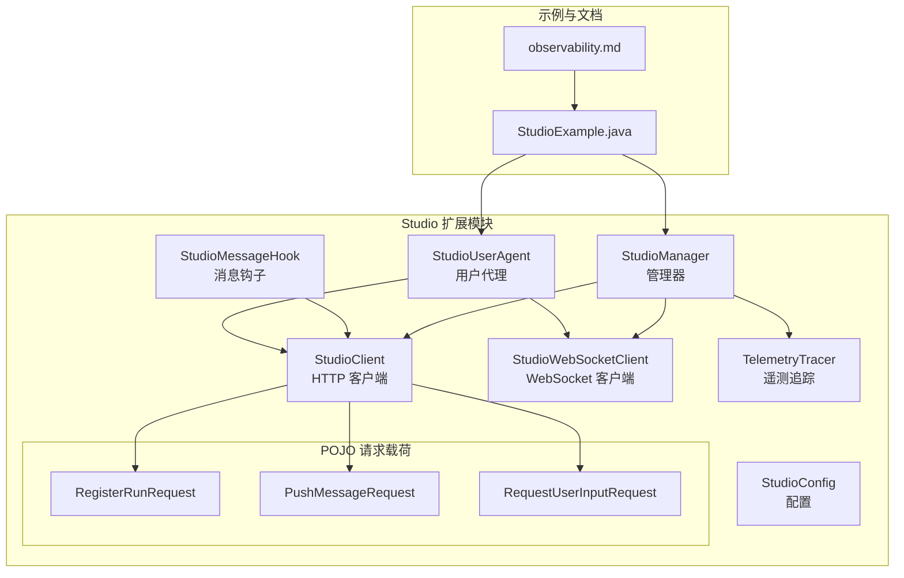
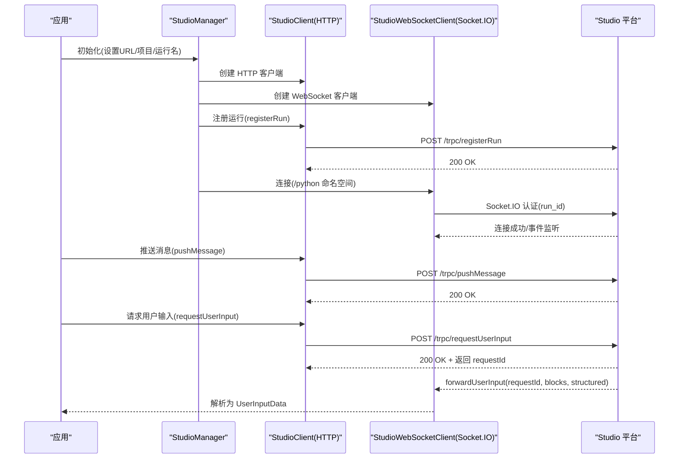
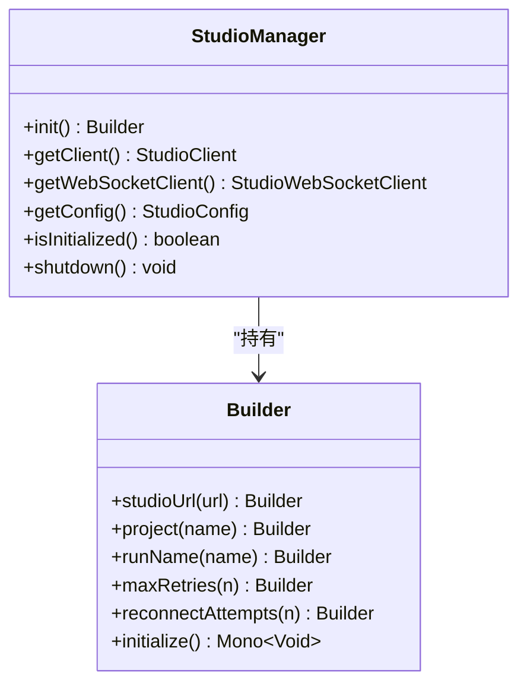
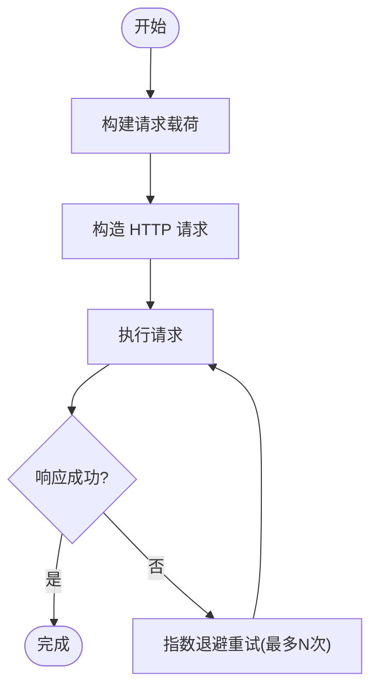
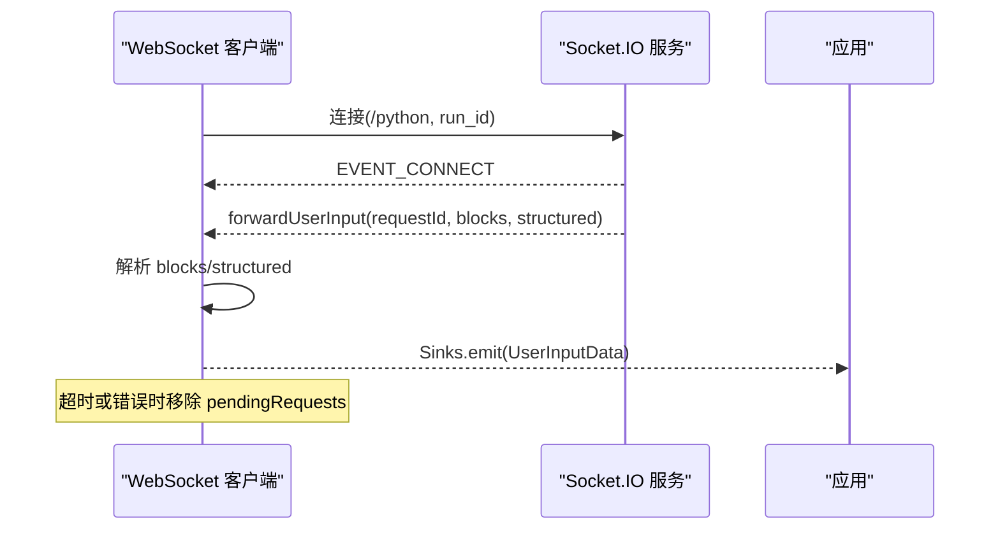
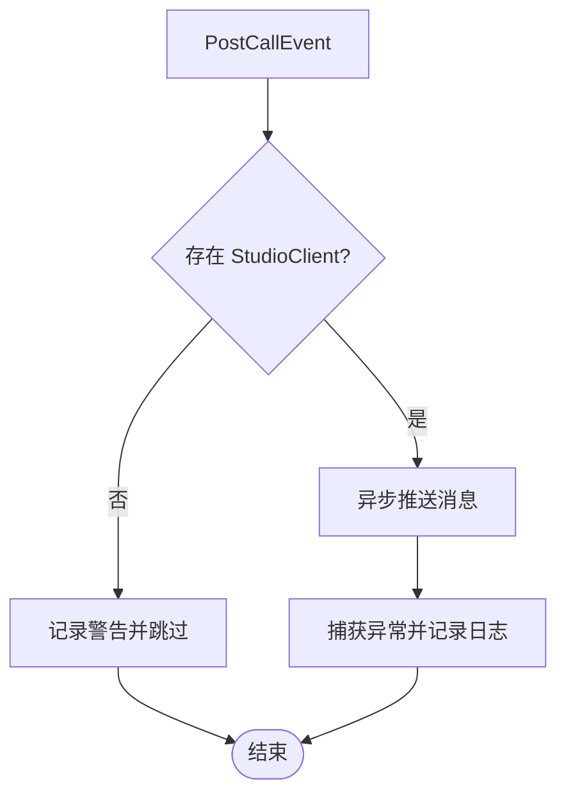
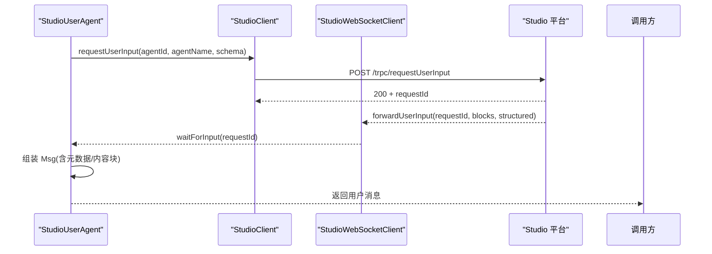
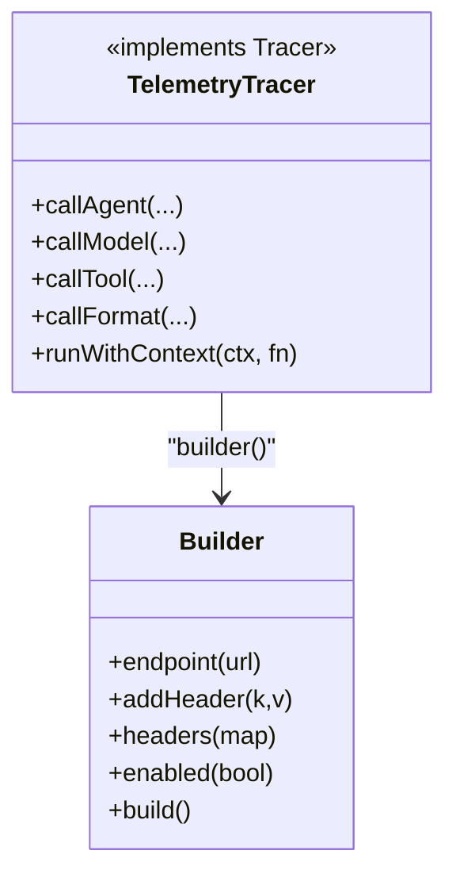
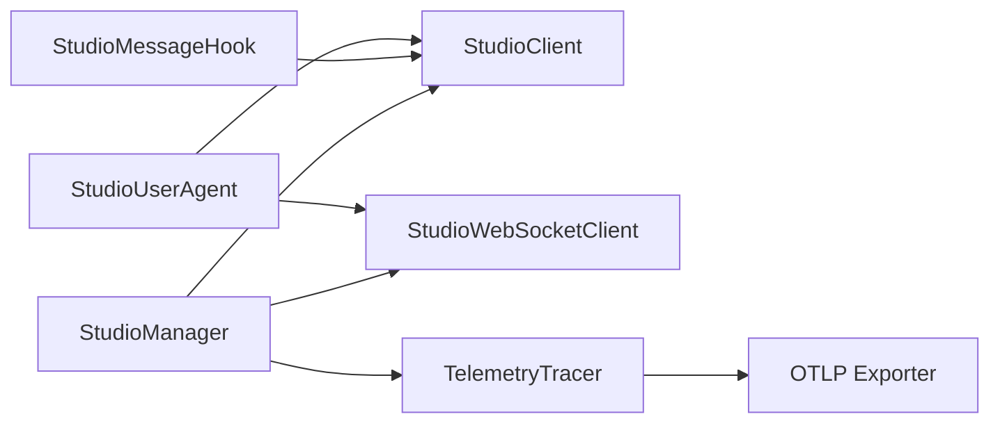

# Studio 集成

<cite>
**本文引用的文件**
- [StudioManager.java](file://agentscope-extensions/agentscope-extensions-studio/src/main/java/io/agentscope/core/studio/StudioManager.java)
- [StudioClient.java](file://agentscope-extensions/agentscope-extensions-studio/src/main/java/io/agentscope/core/studio/StudioClient.java)
- [StudioWebSocketClient.java](file://agentscope-extensions/agentscope-extensions-studio/src/main/java/io/agentscope/core/studio/StudioWebSocketClient.java)
- [StudioMessageHook.java](file://agentscope-extensions/agentscope-extensions-studio/src/main/java/io/agentscope/core/studio/StudioMessageHook.java)
- [StudioUserAgent.java](file://agentscope-extensions/agentscope-extensions-studio/src/main/java/io/agentscope/core/studio/StudioUserAgent.java)
- [StudioConfig.java](file://agentscope-extensions/agentscope-extensions-studio/src/main/java/io/agentscope/core/studio/StudioConfig.java)
- [TelemetryTracer.java](file://agentscope-extensions/agentscope-extensions-studio/src/main/java/io/agentscope/core/tracing/telemetry/TelemetryTracer.java)
- [RegisterRunRequest.java](file://agentscope-extensions/agentscope-extensions-studio/src/main/java/io/agentscope/core/studio/pojo/RegisterRunRequest.java)
- [PushMessageRequest.java](file://agentscope-extensions/agentscope-extensions-studio/src/main/java/io/agentscope/core/studio/pojo/PushMessageRequest.java)
- [RequestUserInputRequest.java](file://agentscope-extensions/agentscope-extensions-studio/src/main/java/io/agentscope/core/studio/pojo/RequestUserInputRequest.java)
- [StudioExample.java](file://agentscope-examples/advanced/src/main/java/io/agentscope/examples/advanced/StudioExample.java)
- [observability.md](file://docs/en/task/observability.md)
</cite>

## 目录
1. [简介](#简介)
2. [项目结构](#项目结构)
3. [核心组件](#核心组件)
4. [架构总览](#架构总览)
5. [详细组件分析](#详细组件分析)
6. [依赖关系分析](#依赖关系分析)
7. [性能考量](#性能考量)
8. [故障排查指南](#故障排查指南)
9. [结论](#结论)
10. [附录](#附录)

## 简介
本技术文档面向 AgentScope Java 的 Studio 集成模块，系统性阐述 Studio 开发平台的可视化调试能力：智能体状态监控、消息流追踪与性能分析；WebSocket 通信机制（Socket.IO）在 Studio 中的实现与实时数据传输；遥测追踪系统（OpenTelemetry + OTLP）在 Studio 中的链路追踪、指标采集与日志聚合；Studio 管理器的协调功能（初始化、生命周期管理、注册运行、建立连接）；Studio 客户端的连接配置、认证与安全策略；以及可视化界面的使用指南、调试技巧、性能监控面板、错误诊断工具与资源使用展示。最后提供与 Studio 平台集成的示例、最佳实践及企业级部署与扩展开发建议。

## 项目结构
Studio 集成位于扩展模块中，核心代码集中在 studio 包下，并通过 pojo 定义请求载荷，配合示例工程与文档进行演示与说明。

**图表来源**
- [StudioManager.java:53-270](file://agentscope-extensions/agentscope-extensions-studio/src/main/java/io/agentscope/core/studio/StudioManager.java#L53-L270)
- [StudioClient.java:50-247](file://agentscope-extensions/agentscope-extensions-studio/src/main/java/io/agentscope/core/studio/StudioClient.java#L50-L247)
- [StudioWebSocketClient.java:48-399](file://agentscope-extensions/agentscope-extensions-studio/src/main/java/io/agentscope/core/studio/StudioWebSocketClient.java#L48-L399)
- [StudioMessageHook.java:42-97](file://agentscope-extensions/agentscope-extensions-studio/src/main/java/io/agentscope/core/studio/StudioMessageHook.java#L42-L97)
- [StudioUserAgent.java:74-335](file://agentscope-extensions/agentscope-extensions-studio/src/main/java/io/agentscope/core/studio/StudioUserAgent.java#L74-L335)
- [StudioConfig.java:41-213](file://agentscope-extensions/agentscope-extensions-studio/src/main/java/io/agentscope/core/studio/StudioConfig.java#L41-L213)
- [TelemetryTracer.java:67-308](file://agentscope-extensions/agentscope-extensions-studio/src/main/java/io/agentscope/core/tracing/telemetry/TelemetryTracer.java#L67-L308)
- [RegisterRunRequest.java:25-173](file://agentscope-extensions/agentscope-extensions-studio/src/main/java/io/agentscope/core/studio/pojo/RegisterRunRequest.java#L25-L173)
- [PushMessageRequest.java:26-136](file://agentscope-extensions/agentscope-extensions-studio/src/main/java/io/agentscope/core/studio/pojo/PushMessageRequest.java#L26-L136)
- [RequestUserInputRequest.java:26-136](file://agentscope-extensions/agentscope-extensions-studio/src/main/java/io/agentscope/core/studio/pojo/RequestUserInputRequest.java#L26-L136)
- [StudioExample.java:28-105](file://agentscope-examples/advanced/src/main/java/io/agentscope/examples/advanced/StudioExample.java#L28-L105)
- [observability.md:121-200](file://docs/en/task/observability.md#L121-L200)

**章节来源**
- [StudioManager.java:26-122](file://agentscope-extensions/agentscope-extensions-studio/src/main/java/io/agentscope/core/studio/StudioManager.java#L26-L122)
- [StudioClient.java:40-88](file://agentscope-extensions/agentscope-extensions-studio/src/main/java/io/agentscope/core/studio/StudioClient.java#L40-L88)
- [StudioWebSocketClient.java:37-82](file://agentscope-extensions/agentscope-extensions-studio/src/main/java/io/agentscope/core/studio/StudioWebSocketClient.java#L37-L82)
- [StudioUserAgent.java:36-73](file://agentscope-extensions/agentscope-extensions-studio/src/main/java/io/agentscope/core/studio/StudioUserAgent.java#L36-L73)
- [StudioConfig.java:21-62](file://agentscope-extensions/agentscope-extensions-studio/src/main/java/io/agentscope/core/studio/StudioConfig.java#L21-L62)
- [TelemetryTracer.java:67-107](file://agentscope-extensions/agentscope-extensions-studio/src/main/java/io/agentscope/core/tracing/telemetry/TelemetryTracer.java#L67-L107)

## 核心组件
- StudioManager：集中式管理器，负责初始化、注册运行、建立 WebSocket 连接、注册遥测追踪器，并提供客户端访问入口。
- StudioClient：基于 OkHttp 的 HTTP 客户端，封装与 Studio 的 REST API 交互（注册运行、推送消息、请求用户输入），内置重试逻辑。
- StudioWebSocketClient：基于 Socket.IO 的 WebSocket 客户端，连接到 Studio 的 /python 命名空间，接收用户输入事件并解析为内容块。
- StudioMessageHook：后处理钩子，在智能体调用完成后自动将输出消息推送到 Studio，失败时记录日志但不中断执行。
- StudioUserAgent：用户代理，支持终端与 Studio 双模式输入；在 Studio 模式下通过 HTTP 请求触发 UI 表单，再通过 WebSocket 接收用户输入。
- StudioConfig：配置对象，包含 Studio 地址、项目名、运行名、运行 ID、HTTP 重试次数、WebSocket 重连参数等。
- TelemetryTracer：基于 OpenTelemetry 的遥测追踪器，将 Agent/模型/工具/format 调用转换为链路追踪与指标，支持 OTLP 导出。
- POJO 请求载荷：RegisterRunRequest、PushMessageRequest、RequestUserInputRequest，用于与 Studio 后端 API 通信的数据结构。

**章节来源**
- [StudioManager.java:53-122](file://agentscope-extensions/agentscope-extensions-studio/src/main/java/io/agentscope/core/studio/StudioManager.java#L53-L122)
- [StudioClient.java:50-121](file://agentscope-extensions/agentscope-extensions-studio/src/main/java/io/agentscope/core/studio/StudioClient.java#L50-L121)
- [StudioWebSocketClient.java:48-140](file://agentscope-extensions/agentscope-extensions-studio/src/main/java/io/agentscope/core/studio/StudioWebSocketClient.java#L48-L140)
- [StudioMessageHook.java:42-95](file://agentscope-extensions/agentscope-extensions-studio/src/main/java/io/agentscope/core/studio/StudioMessageHook.java#L42-L95)
- [StudioUserAgent.java:74-120](file://agentscope-extensions/agentscope-extensions-studio/src/main/java/io/agentscope/core/studio/StudioUserAgent.java#L74-L120)
- [StudioConfig.java:41-147](file://agentscope-extensions/agentscope-extensions-studio/src/main/java/io/agentscope/core/studio/StudioConfig.java#L41-L147)
- [TelemetryTracer.java:67-228](file://agentscope-extensions/agentscope-extensions-studio/src/main/java/io/agentscope/core/tracing/telemetry/TelemetryTracer.java#L67-L228)
- [RegisterRunRequest.java:25-118](file://agentscope-extensions/agentscope-extensions-studio/src/main/java/io/agentscope/core/studio/pojo/RegisterRunRequest.java#L25-L118)
- [PushMessageRequest.java:26-93](file://agentscope-extensions/agentscope-extensions-studio/src/main/java/io/agentscope/core/studio/pojo/PushMessageRequest.java#L26-L93)
- [RequestUserInputRequest.java:26-93](file://agentscope-extensions/agentscope-extensions-studio/src/main/java/io/agentscope/core/studio/pojo/RequestUserInputRequest.java#L26-L93)

## 架构总览
Studio 集成采用“管理器 + 客户端 + 钩子 + 用户代理”的分层设计，结合 HTTP 与 WebSocket 实现可视化调试与实时交互；同时通过遥测追踪器将链路信息导出至 Studio 的 OTLP 端点，实现统一的可观测性平台。

**图表来源**
- [StudioManager.java:213-267](file://agentscope-extensions/agentscope-extensions-studio/src/main/java/io/agentscope/core/studio/StudioManager.java#L213-L267)
- [StudioClient.java:89-121](file://agentscope-extensions/agentscope-extensions-studio/src/main/java/io/agentscope/core/studio/StudioClient.java#L89-L121)
- [StudioWebSocketClient.java:83-140](file://agentscope-extensions/agentscope-extensions-studio/src/main/java/io/agentscope/core/studio/StudioWebSocketClient.java#L83-L140)
- [PushMessageRequest.java:26-48](file://agentscope-extensions/agentscope-extensions-studio/src/main/java/io/agentscope/core/studio/pojo/PushMessageRequest.java#L26-L48)
- [RequestUserInputRequest.java:26-48](file://agentscope-extensions/agentscope-extensions-studio/src/main/java/io/agentscope/core/studio/pojo/RequestUserInputRequest.java#L26-L48)

## 详细组件分析

### StudioManager 管理器
- 职责：集中初始化、注册运行、建立 WebSocket、注册系统钩子与遥测追踪器；提供客户端访问与生命周期管理。
- 关键流程：
  - 构建配置 → 创建 HTTP/WS 客户端 → 注册运行 → 建立 WS 连接 → 添加系统钩子 → 注册遥测追踪器。
  - 提供静态方法获取客户端、配置与初始化状态；支持优雅关闭释放资源。
- 设计要点：Builder 模式配置；链式 Mono 流水线；异常时清理资源；默认遥测端点拼接。

**图表来源**
- [StudioManager.java:127-267](file://agentscope-extensions/agentscope-extensions-studio/src/main/java/io/agentscope/core/studio/StudioManager.java#L127-L267)

**章节来源**
- [StudioManager.java:53-122](file://agentscope-extensions/agentscope-extensions-studio/src/main/java/io/agentscope/core/studio/StudioManager.java#L53-L122)
- [StudioManager.java:213-267](file://agentscope-extensions/agentscope-extensions-studio/src/main/java/io/agentscope/core/studio/StudioManager.java#L213-L267)

### StudioClient HTTP 客户端
- 职责：与 Studio REST API 交互，提供注册运行、推送消息、请求用户输入三大能力。
- 特性：基于 OkHttp；所有操作返回 Mono；内置指数退避重试；超时控制；错误包装。
- 关键接口：
  - registerRun：POST /trpc/registerRun，携带运行标识、项目名、时间戳、进程号、状态等。
  - pushMessage：POST /trpc/pushMessage，将智能体输出消息可视化展示。
  - requestUserInput：POST /trpc/requestUserInput，触发 Studio UI 表单，等待 WebSocket 回传。
- 错误处理：IO 异常触发重试；非成功响应抛出异常；关闭时释放连接池与调度器。

**图表来源**
- [StudioClient.java:89-121](file://agentscope-extensions/agentscope-extensions-studio/src/main/java/io/agentscope/core/studio/StudioClient.java#L89-L121)
- [StudioClient.java:134-166](file://agentscope-extensions/agentscope-extensions-studio/src/main/java/io/agentscope/core/studio/StudioClient.java#L134-L166)
- [StudioClient.java:181-214](file://agentscope-extensions/agentscope-extensions-studio/src/main/java/io/agentscope/core/studio/StudioClient.java#L181-L214)
- [StudioClient.java:231-241](file://agentscope-extensions/agentscope-extensions-studio/src/main/java/io/agentscope/core/studio/StudioClient.java#L231-L241)

**章节来源**
- [StudioClient.java:50-121](file://agentscope-extensions/agentscope-extensions-studio/src/main/java/io/agentscope/core/studio/StudioClient.java#L50-L121)
- [StudioClient.java:134-214](file://agentscope-extensions/agentscope-extensions-studio/src/main/java/io/agentscope/core/studio/StudioClient.java#L134-L214)
- [StudioClient.java:219-241](file://agentscope-extensions/agentscope-extensions-studio/src/main/java/io/agentscope/core/studio/StudioClient.java#L219-L241)
- [RegisterRunRequest.java:25-118](file://agentscope-extensions/agentscope-extensions-studio/src/main/java/io/agentscope/core/studio/pojo/RegisterRunRequest.java#L25-L118)
- [PushMessageRequest.java:26-93](file://agentscope-extensions/agentscope-extensions-studio/src/main/java/io/agentscope/core/studio/pojo/PushMessageRequest.java#L26-L93)
- [RequestUserInputRequest.java:26-93](file://agentscope-extensions/agentscope-extensions-studio/src/main/java/io/agentscope/core/studio/pojo/RequestUserInputRequest.java#L26-L93)

### StudioWebSocketClient WebSocket 客户端
- 职责：与 Studio 的 Socket.IO 服务建立持久连接，接收用户输入事件，解析为内容块与结构化数据。
- 认证与命名空间：通过 run_id 进行认证，连接到 /python 命名空间；支持自动重连与最大延迟限制。
- 事件处理：注册连接、断开、重连、错误等事件；核心事件 forwardUserInput 解析为 UserInputData 并匹配 requestId。
- 数据解析：将 JSON 数组转换为 ContentBlock 列表；对工具结果块进行格式规范化；支持结构化输入映射。
- 超时与清理：等待输入具备超时控制；关闭时断开连接并清理资源。

**图表来源**
- [StudioWebSocketClient.java:83-140](file://agentscope-extensions/agentscope-extensions-studio/src/main/java/io/agentscope/core/studio/StudioWebSocketClient.java#L83-L140)
- [StudioWebSocketClient.java:169-217](file://agentscope-extensions/agentscope-extensions-studio/src/main/java/io/agentscope/core/studio/StudioWebSocketClient.java#L169-L217)
- [StudioWebSocketClient.java:327-338](file://agentscope-extensions/agentscope-extensions-studio/src/main/java/io/agentscope/core/studio/StudioWebSocketClient.java#L327-L338)

**章节来源**
- [StudioWebSocketClient.java:48-140](file://agentscope-extensions/agentscope-extensions-studio/src/main/java/io/agentscope/core/studio/StudioWebSocketClient.java#L48-L140)
- [StudioWebSocketClient.java:169-217](file://agentscope-extensions/agentscope-extensions-studio/src/main/java/io/agentscope/core/studio/StudioWebSocketClient.java#L169-L217)
- [StudioWebSocketClient.java:229-294](file://agentscope-extensions/agentscope-extensions-studio/src/main/java/io/agentscope/core/studio/StudioWebSocketClient.java#L229-L294)
- [StudioWebSocketClient.java:327-338](file://agentscope-extensions/agentscope-extensions-studio/src/main/java/io/agentscope/core/studio/StudioWebSocketClient.java#L327-L338)

### StudioMessageHook 消息钩子
- 职责：拦截智能体调用后的输出消息，异步推送到 Studio，不影响主流程执行。
- 行为：仅处理 PostCallEvent；若 Studio 客户端为空则警告并跳过；推送失败记录日志并继续。
- 适用场景：自动可视化智能体对话、中间态与最终态消息。

**图表来源**
- [StudioMessageHook.java:67-95](file://agentscope-extensions/agentscope-extensions-studio/src/main/java/io/agentscope/core/studio/StudioMessageHook.java#L67-L95)

**章节来源**
- [StudioMessageHook.java:42-95](file://agentscope-extensions/agentscope-extensions-studio/src/main/java/io/agentscope/core/studio/StudioMessageHook.java#L42-L95)

### StudioUserAgent 用户代理
- 职责：代表人类用户向其他智能体提供输入；支持终端与 Studio 双模式。
- Studio 模式流程：发送请求用户输入 → Studio 显示 UI 表单 → 用户在浏览器提交 → WebSocket 回传 → 转换为消息返回。
- 终端模式：从标准输入读取文本，封装为消息。
- 中断处理：返回中断消息，便于上层流程处理。

**图表来源**
- [StudioUserAgent.java:128-193](file://agentscope-extensions/agentscope-extensions-studio/src/main/java/io/agentscope/core/studio/StudioUserAgent.java#L128-L193)
- [StudioClient.java:181-214](file://agentscope-extensions/agentscope-extensions-studio/src/main/java/io/agentscope/core/studio/StudioClient.java#L181-L214)
- [StudioWebSocketClient.java:327-338](file://agentscope-extensions/agentscope-extensions-studio/src/main/java/io/agentscope/core/studio/StudioWebSocketClient.java#L327-L338)

**章节来源**
- [StudioUserAgent.java:74-120](file://agentscope-extensions/agentscope-extensions-studio/src/main/java/io/agentscope/core/studio/StudioUserAgent.java#L74-L120)
- [StudioUserAgent.java:128-193](file://agentscope-extensions/agentscope-extensions-studio/src/main/java/io/agentscope/core/studio/StudioUserAgent.java#L128-L193)
- [StudioUserAgent.java:222-230](file://agentscope-extensions/agentscope-extensions-studio/src/main/java/io/agentscope/core/studio/StudioUserAgent.java#L222-L230)

### StudioConfig 配置对象
- 职责：集中管理 Studio 连接与通信参数，支持默认值与 Builder 模式。
- 关键字段：Studio 基础 URL、遥测端点、项目名、运行名、运行 ID、HTTP 最大重试、WebSocket 重连次数与延迟。
- 默认行为：未显式设置遥测端点时，默认拼接为 studioUrl + “/v1/traces”。

**章节来源**
- [StudioConfig.java:41-147](file://agentscope-extensions/agentscope-extensions-studio/src/main/java/io/agentscope/core/studio/StudioConfig.java#L41-L147)
- [StudioConfig.java:205-211](file://agentscope-extensions/agentscope-extensions-studio/src/main/java/io/agentscope/core/studio/StudioConfig.java#L205-L211)

### TelemetryTracer 遥测追踪器
- 职责：将 Agent/模型/工具/format 调用包装为 OpenTelemetry Span，提取通用与特定属性，支持上下文传播。
- 导出：默认使用 OTLP HTTP Exporter，可配置端点与请求头；支持禁用与自定义 Tracer。
- 应用：StudioManager 在初始化时根据配置注册 TelemetryTracer，实现链路追踪与指标采集。

**图表来源**
- [TelemetryTracer.java:67-228](file://agentscope-extensions/agentscope-extensions-studio/src/main/java/io/agentscope/core/tracing/telemetry/TelemetryTracer.java#L67-L228)
- [TelemetryTracer.java:229-306](file://agentscope-extensions/agentscope-extensions-studio/src/main/java/io/agentscope/core/tracing/telemetry/TelemetryTracer.java#L229-L306)

**章节来源**
- [TelemetryTracer.java:67-107](file://agentscope-extensions/agentscope-extensions-studio/src/main/java/io/agentscope/core/tracing/telemetry/TelemetryTracer.java#L67-L107)
- [TelemetryTracer.java:229-306](file://agentscope-extensions/agentscope-extensions-studio/src/main/java/io/agentscope/core/tracing/telemetry/TelemetryTracer.java#L229-L306)
- [StudioManager.java:252-259](file://agentscope-extensions/agentscope-extensions-studio/src/main/java/io/agentscope/core/studio/StudioManager.java#L252-L259)

## 依赖关系分析
- 组件耦合：
  - StudioManager 作为中枢，依赖 StudioClient、StudioWebSocketClient、TracerRegistry、TelemetryTracer。
  - StudioMessageHook 依赖 StudioClient；StudioUserAgent 依赖 StudioClient 与 StudioWebSocketClient。
  - TelemetryTracer 依赖 OpenTelemetry SDK 与 OTLP Exporter。
- 外部依赖：
  - OkHttp（HTTP）、Socket.IO（WebSocket）、OpenTelemetry（遥测）。
- 潜在风险：
  - WebSocket 断连需确保重连策略与超时控制；HTTP 重试避免雪崩；消息钩子异步推送避免阻塞主流程。

**图表来源**
- [StudioManager.java:213-267](file://agentscope-extensions/agentscope-extensions-studio/src/main/java/io/agentscope/core/studio/StudioManager.java#L213-L267)
- [StudioClient.java:50-77](file://agentscope-extensions/agentscope-extensions-studio/src/main/java/io/agentscope/core/studio/StudioClient.java#L50-L77)
- [StudioWebSocketClient.java:48-73](file://agentscope-extensions/agentscope-extensions-studio/src/main/java/io/agentscope/core/studio/StudioWebSocketClient.java#L48-L73)
- [TelemetryTracer.java:297-304](file://agentscope-extensions/agentscope-extensions-studio/src/main/java/io/agentscope/core/tracing/telemetry/TelemetryTracer.java#L297-L304)

**章节来源**
- [StudioManager.java:213-267](file://agentscope-extensions/agentscope-extensions-studio/src/main/java/io/agentscope/core/studio/StudioManager.java#L213-L267)
- [StudioClient.java:50-77](file://agentscope-extensions/agentscope-extensions-studio/src/main/java/io/agentscope/core/studio/StudioClient.java#L50-L77)
- [StudioWebSocketClient.java:48-73](file://agentscope-extensions/agentscope-extensions-studio/src/main/java/io/agentscope/core/studio/StudioWebSocketClient.java#L48-L73)
- [TelemetryTracer.java:297-304](file://agentscope-extensions/agentscope-extensions-studio/src/main/java/io/agentscope/core/tracing/telemetry/TelemetryTracer.java#L297-L304)

## 性能考量
- HTTP 重试与超时：StudioClient 使用指数退避重试与合理超时，降低网络抖动影响；建议根据环境调整最大重试次数与超时阈值。
- WebSocket 重连：StudioWebSocketClient 支持最大重连次数与最大延迟，避免风暴重连；建议结合业务超时设置合理等待时间。
- 遥测开销：TelemetryTracer 默认启用，Span 批量导出；在高并发场景建议评估采样率与批量大小，避免对主流程造成显著延迟。
- 异步推送：StudioMessageHook 异步推送消息，避免阻塞智能体执行；建议监控推送失败率与日志告警。

[本节为通用性能指导，无需具体文件引用]

## 故障排查指南
- 初始化失败：
  - 检查 Studio 地址可达性与鉴权；确认注册运行接口返回成功；查看日志中的连接错误与异常堆栈。
- WebSocket 连接问题：
  - 查看 Socket.IO 事件日志（连接/断开/重连/错误）；确认 run_id 认证是否正确；检查网络策略与防火墙。
- 消息推送失败：
  - 查看 HTTP 重试日志与最终错误；确认消息格式与 StudioClient 配置；检查 Studio 侧是否正常接收。
- 用户输入未到达：
  - 确认 requestUserInput 是否返回 requestId；检查 forwardUserInput 事件是否被正确解析；关注超时与 pendingRequests 清理。
- 遥测不可见：
  - 检查 TelemetryTracer 端点与请求头；确认 OTLP Exporter 正常工作；验证 Studio 侧遥测接收配置。

**章节来源**
- [StudioManager.java:260-266](file://agentscope-extensions/agentscope-extensions-studio/src/main/java/io/agentscope/core/studio/StudioManager.java#L260-L266)
- [StudioWebSocketClient.java:145-180](file://agentscope-extensions/agentscope-extensions-studio/src/main/java/io/agentscope/core/studio/StudioWebSocketClient.java#L145-L180)
- [StudioClient.java:231-241](file://agentscope-extensions/agentscope-extensions-studio/src/main/java/io/agentscope/core/studio/StudioClient.java#L231-L241)
- [StudioUserAgent.java:187-193](file://agentscope-extensions/agentscope-extensions-studio/src/main/java/io/agentscope/core/studio/StudioUserAgent.java#L187-L193)

## 结论
Studio 集成模块通过管理器统一初始化与协调、HTTP 客户端实现 REST API 通信、WebSocket 客户端实现双向实时交互、消息钩子与用户代理提供可视化与交互体验，并以遥测追踪器实现链路与指标的统一采集与导出。该方案具备良好的可扩展性与企业级可用性，适合在多智能体协作与可视化调试场景中大规模应用。

[本节为总结性内容，无需具体文件引用]

## 附录

### 可视化界面使用指南与调试技巧
- 启动与连接：通过 StudioManager 初始化并连接 Studio；打开浏览器访问 Studio UI 查看运行状态与消息流。
- 消息流追踪：在 Studio 中查看注册运行、消息推送与用户输入事件；利用链路视图定位慢调用与异常。
- 调试技巧：开启详细日志；使用超时与重试策略；在 Studio 中查看结构化输入与内容块渲染效果。

**章节来源**
- [StudioExample.java:36-44](file://agentscope-examples/advanced/src/main/java/io/agentscope/examples/advanced/StudioExample.java#L36-L44)
- [observability.md:121-200](file://docs/en/task/observability.md#L121-L200)

### Studio 客户端连接配置、认证与安全策略
- 连接配置：设置 Studio 基础 URL、项目名、运行名、运行 ID；可选设置遥测端点与 HTTP/WS 重试参数。
- 认证机制：WebSocket 通过 run_id 进行命名空间认证；HTTP 请求由 Studio 后端鉴权；建议在生产环境启用 HTTPS 与访问控制。
- 安全策略：限制 WebSocket 命名空间访问；对 OTLP 导出端点添加鉴权头；定期轮换密钥与令牌。

**章节来源**
- [StudioConfig.java:149-211](file://agentscope-extensions/agentscope-extensions-studio/src/main/java/io/agentscope/core/studio/StudioConfig.java#L149-L211)
- [StudioWebSocketClient.java:96-103](file://agentscope-extensions/agentscope-extensions-studio/src/main/java/io/agentscope/core/studio/StudioWebSocketClient.java#L96-L103)
- [TelemetryTracer.java:281-306](file://agentscope-extensions/agentscope-extensions-studio/src/main/java/io/agentscope/core/tracing/telemetry/TelemetryTracer.java#L281-L306)

### 与 Studio 平台的集成示例与最佳实践
- 示例参考：使用 StudioExample 展示初始化、创建智能体与用户代理、循环对话与优雅关闭。
- 最佳实践：
  - 先初始化 StudioManager 再创建智能体与钩子；
  - 在生产环境配置合理的重试与超时；
  - 对关键路径增加遥测与日志；
  - 使用结构化输入提升交互体验与数据一致性。

**章节来源**
- [StudioExample.java:28-105](file://agentscope-examples/advanced/src/main/java/io/agentscope/examples/advanced/StudioExample.java#L28-L105)
- [observability.md:121-200](file://docs/en/task/observability.md#L121-L200)

### 企业级部署与扩展开发指南
- 服务器配置：确保 Studio 服务具备高可用与弹性伸缩能力；配置负载均衡与健康检查；启用 TLS 与访问审计。
- 扩展开发：
  - 自定义钩子：基于 Hook 接口扩展更多事件类型与处理逻辑；
  - 自定义遥测：通过 TelemetryTracer Builder 配置端点与头信息，适配企业监控平台；
  - 自定义用户代理：扩展输入类型（如语音/图像）与内容块解析逻辑。

**章节来源**
- [TelemetryTracer.java:281-306](file://agentscope-extensions/agentscope-extensions-studio/src/main/java/io/agentscope/core/tracing/telemetry/TelemetryTracer.java#L281-L306)
- [StudioManager.java:252-259](file://agentscope-extensions/agentscope-extensions-studio/src/main/java/io/agentscope/core/studio/StudioManager.java#L252-L259)