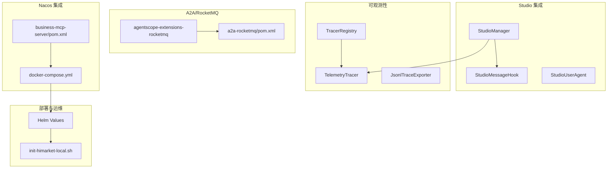
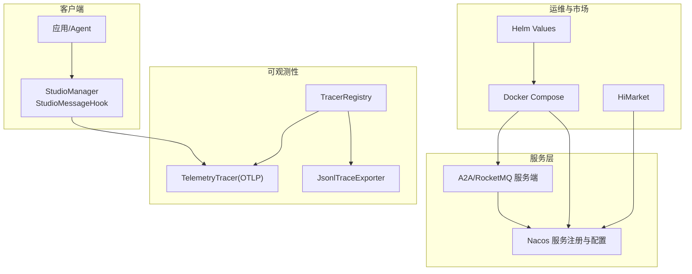
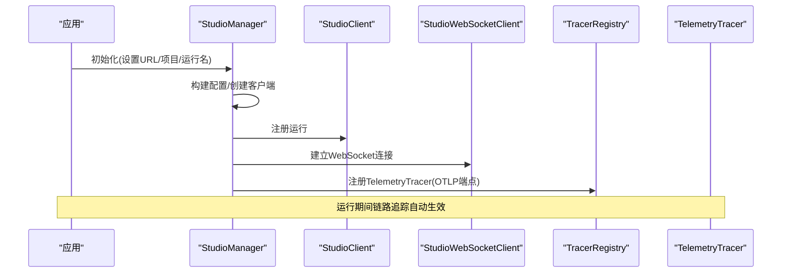
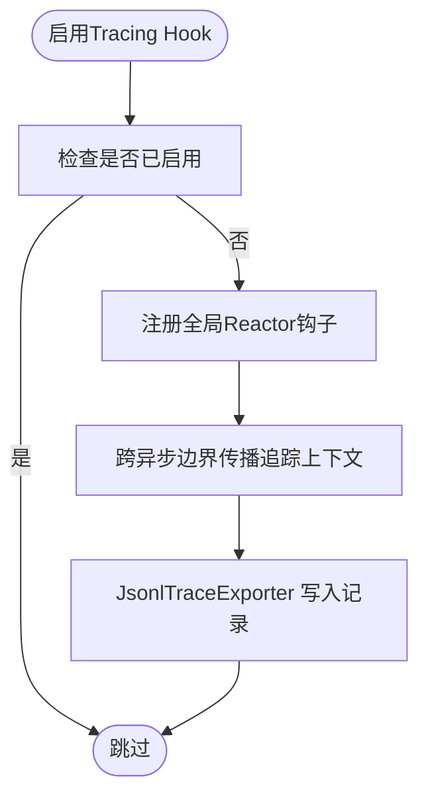
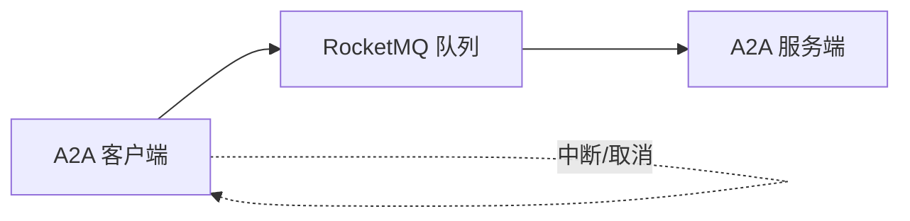
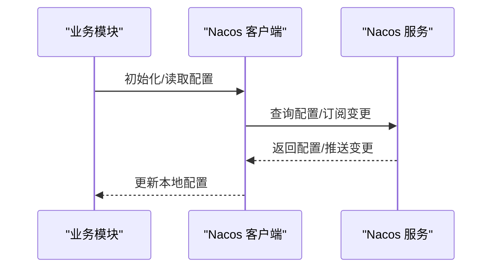
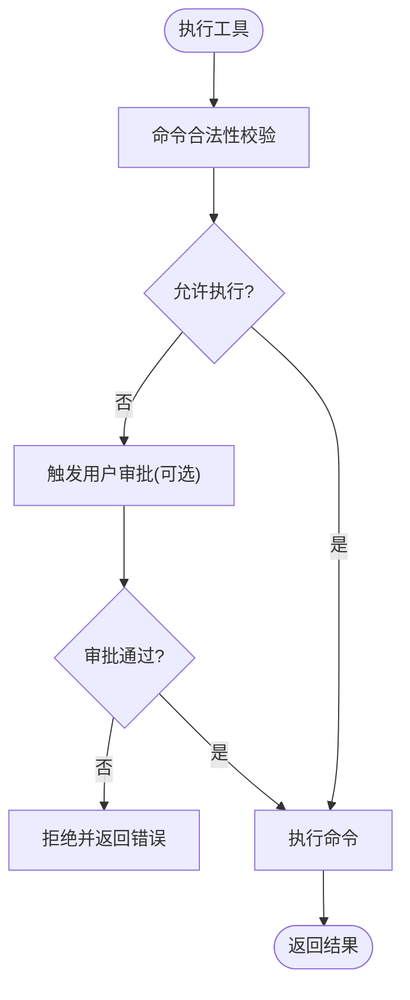
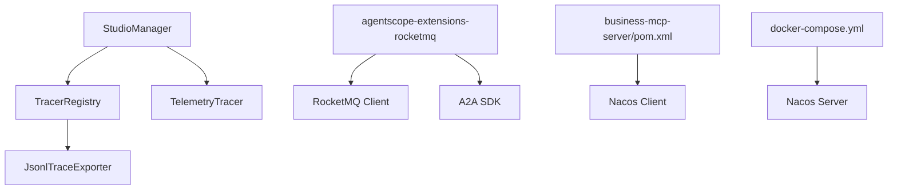

# 企业级集成

<cite>
**本文引用的文件**
- [StudioManager.java](file://agentscope-extensions/agentscope-extensions-studio/src/main/java/io/agentscope/core/studio/StudioManager.java)
- [StudioMessageHook.java](file://agentscope-extensions/agentscope-extensions-studio/src/main/java/io/agentscope/core/studio/StudioMessageHook.java)
- [StudioExample.java](file://agentscope-examples/advanced/src/main/java/io/agentscope/examples/advanced/StudioExample.java)
- [observability.md（中文）](file://docs/zh/task/observability.md)
- [observability.md（英文）](file://docs/en/task/observability.md)
- [TracerRegistry.java](file://agentscope-core/src/main/java/io/agentscope/core/tracing/TracerRegistry.java)
- [NoopTracer.java](file://agentscope-core/src/main/java/io/agentscope/core/tracing/NoopTracer.java)
- [JsonlTraceExporter.java](file://agentscope-core/src/main/java/io/agentscope/core/hook/recorder/JsonlTraceExporter.java)
- [a2a.md（英文）](file://docs/en/task/a2a.md)
- [agentscope-extensions-rocketmq/pom.xml](file://agentscope-extensions/agentscope-extensions-rocketmq/pom.xml)
- [a2a-rocketmq/pom.xml](file://agentscope-examples/a2a-rocketmq/pom.xml)
- [business-mcp-server/pom.xml](file://agentscope-examples/boba-tea-shop/business-mcp-server/pom.xml)
- [docker-compose.yml](file://agentscope-examples/boba-tea-shop/docker-compose.yml)
- [HIMARKET_DEPLOYMENT.md](file://agentscope-examples/boba-tea-shop/HIMARKET_DEPLOYMENT.md)
- [init-himarket-local.sh](file://agentscope-examples/boba-tea-shop/himarket-image/init-himarket-local.sh)
- [values.yaml](file://agentscope-examples/boba-tea-shop/helm/values.yaml)
- [ShellCommandTool.java](file://agentscope-core/src/main/java/io/agentscope/core/tool/coding/ShellCommandTool.java)
- [CoreAgentE2ETest.java](file://agentscope-core/src/test/java/io/agentscope/core/e2e/CoreAgentE2ETest.java)
</cite>

## 目录
1. [简介](#简介)
2. [项目结构](#项目结构)
3. [核心组件](#核心组件)
4. [架构总览](#架构总览)
5. [详细组件分析](#详细组件分析)
6. [依赖关系分析](#依赖关系分析)
7. [性能考虑](#性能考虑)
8. [故障排查指南](#故障排查指南)
9. [结论](#结论)
10. [附录](#附录)

## 简介
本文件聚焦 AgentScope Java 的企业级集成模块，围绕以下目标展开：
- Nacos 集成：配置中心、服务注册与发现、动态配置更新
- RocketMQ 集成：消息队列、异步通信、分布式事务处理
- Studio 集成：可视化调试、消息追踪、可观测性
- 企业级安全：权限控制、访问审计、合规基线
- 微服务架构：A2A 协议、服务编排、跨进程调用
- 高可用与灾备：多副本、熔断降级、故障转移
- 运维自动化：容器化、Kubernetes 部署、Helm 管理
- 与企业系统集成：统一认证、权限体系、数据迁移策略

## 项目结构
企业级集成涉及的核心模块与示例包括：
- Studio 集成：StudioManager、StudioMessageHook、StudioUserAgent、示例应用
- 可观测性：TracerRegistry、TelemetryTracer、JsonlTraceExporter
- A2A/RocketMQ：扩展模块与示例聚合工程
- Nacos 集成：示例工程中的 Nacos 客户端依赖与部署编排
- 部署与运维：Docker Compose、Helm、本地初始化脚本

**图表来源**
- [StudioManager.java:1-270](file://agentscope-extensions/agentscope-extensions-studio/src/main/java/io/agentscope/core/studio/StudioManager.java#L1-270)
- [StudioMessageHook.java:1-97](file://agentscope-extensions/agentscope-extensions-studio/src/main/java/io/agentscope/core/studio/StudioMessageHook.java#L1-97)
- [TracerRegistry.java:44-76](file://agentscope-core/src/main/java/io/agentscope/core/tracing/TracerRegistry.java#L44-L76)
- [JsonlTraceExporter.java:369-437](file://agentscope-core/src/main/java/io/agentscope/core/hook/recorder/JsonlTraceExporter.java#L369-L437)
- [agentscope-extensions-rocketmq/pom.xml:1-87](file://agentscope-extensions/agentscope-extensions-rocketmq/pom.xml#L1-87)
- [a2a-rocketmq/pom.xml:1-91](file://agentscope-examples/a2a-rocketmq/pom.xml#L1-91)
- [business-mcp-server/pom.xml:1-100](file://agentscope-examples/boba-tea-shop/business-mcp-server/pom.xml#L1-100)
- [docker-compose.yml:1-255](file://agentscope-examples/boba-tea-shop/docker-compose.yml#L1-255)
- [HIMARKET_DEPLOYMENT.md:1-197](file://agentscope-examples/boba-tea-shop/HIMARKET_DEPLOYMENT.md#L1-197)
- [init-himarket-local.sh:287-787](file://agentscope-examples/boba-tea-shop/himarket-image/init-himarket-local.sh#L287-L787)

**章节来源**
- [StudioManager.java:1-270](file://agentscope-extensions/agentscope-extensions-studio/src/main/java/io/agentscope/core/studio/StudioManager.java#L1-270)
- [StudioMessageHook.java:1-97](file://agentscope-extensions/agentscope-extensions-studio/src/main/java/io/agentscope/core/studio/StudioMessageHook.java#L1-97)
- [observability.md（中文）:1-198](file://docs/zh/task/observability.md#L1-L198)
- [observability.md（英文）:1-200](file://docs/en/task/observability.md#L1-L200)
- [TracerRegistry.java:44-76](file://agentscope-core/src/main/java/io/agentscope/core/tracing/TracerRegistry.java#L44-L76)
- [JsonlTraceExporter.java:369-437](file://agentscope-core/src/main/java/io/agentscope/core/hook/recorder/JsonlTraceExporter.java#L369-L437)
- [a2a.md（英文）:273-294](file://docs/en/task/a2a.md#L273-L294)
- [agentscope-extensions-rocketmq/pom.xml:1-87](file://agentscope-extensions/agentscope-extensions-rocketmq/pom.xml#L1-87)
- [a2a-rocketmq/pom.xml:1-91](file://agentscope-examples/a2a-rocketmq/pom.xml#L1-91)
- [business-mcp-server/pom.xml:1-100](file://agentscope-examples/boba-tea-shop/business-mcp-server/pom.xml#L1-100)
- [docker-compose.yml:1-255](file://agentscope-examples/boba-tea-shop/docker-compose.yml#L1-255)
- [HIMARKET_DEPLOYMENT.md:1-197](file://agentscope-examples/boba-tea-shop/HIMARKET_DEPLOYMENT.md#L1-197)
- [init-himarket-local.sh:287-787](file://agentscope-examples/boba-tea-shop/himarket-image/init-himarket-local.sh#L287-L787)
- [values.yaml:1-44](file://agentscope-examples/boba-tea-shop/helm/values.yaml#L1-44)

## 核心组件
- Studio 集成：通过 StudioManager 统一初始化 HTTP 与 WebSocket 客户端，注册运行、建立连接，并向 TracerRegistry 注册 TelemetryTracer，实现链路追踪与可视化调试。
- 可观测性：TracerRegistry 提供全局 Reactor 钩子，确保跨异步边界的追踪上下文传播；JsonlTraceExporter 支持将记录写入本地文件并携带 trace_id/spam_id。
- A2A/RocketMQ：扩展模块引入 RocketMQ 客户端与 A2A 协议适配，示例工程提供客户端/服务端模块与依赖管理。
- Nacos 集成：示例工程在业务模块中引入 nacos-client，Docker Compose 提供 Nacos 单机服务，Helm/脚本支持导入与初始化。

**章节来源**
- [StudioManager.java:26-122](file://agentscope-extensions/agentscope-extensions-studio/src/main/java/io/agentscope/core/studio/StudioManager.java#L26-L122)
- [StudioMessageHook.java:26-95](file://agentscope-extensions/agentscope-extensions-studio/src/main/java/io/agentscope/core/studio/StudioMessageHook.java#L26-L95)
- [TracerRegistry.java:44-76](file://agentscope-core/src/main/java/io/agentscope/core/tracing/TracerRegistry.java#L44-L76)
- [JsonlTraceExporter.java:369-437](file://agentscope-core/src/main/java/io/agentscope/core/hook/recorder/JsonlTraceExporter.java#L369-L437)
- [agentscope-extensions-rocketmq/pom.xml:41-85](file://agentscope-extensions/agentscope-extensions-rocketmq/pom.xml#L41-L85)
- [a2a-rocketmq/pom.xml:43-90](file://agentscope-examples/a2a-rocketmq/pom.xml#L43-L90)
- [business-mcp-server/pom.xml:89-93](file://agentscope-examples/boba-tea-shop/business-mcp-server/pom.xml#L89-L93)
- [docker-compose.yml:50-74](file://agentscope-examples/boba-tea-shop/docker-compose.yml#L50-L74)

## 架构总览
下图展示了企业级集成的关键交互：Studio 作为可视化与可观测性入口，TracerRegistry 负责链路追踪，A2A/RocketMQ 提供跨进程通信，Nacos 作为服务注册与配置中心，配合 HiMarket 实现能力市场与统一管理。

**图表来源**
- [StudioManager.java:213-267](file://agentscope-extensions/agentscope-extensions-studio/src/main/java/io/agentscope/core/studio/StudioManager.java#L213-L267)
- [StudioMessageHook.java:66-95](file://agentscope-extensions/agentscope-extensions-studio/src/main/java/io/agentscope/core/studio/StudioMessageHook.java#L66-L95)
- [TracerRegistry.java:44-76](file://agentscope-core/src/main/java/io/agentscope/core/tracing/TracerRegistry.java#L44-L76)
- [JsonlTraceExporter.java:369-437](file://agentscope-core/src/main/java/io/agentscope/core/hook/recorder/JsonlTraceExporter.java#L369-L437)
- [agentscope-extensions-rocketmq/pom.xml:41-85](file://agentscope-extensions/agentscope-extensions-rocketmq/pom.xml#L41-L85)
- [docker-compose.yml:50-74](file://agentscope-examples/boba-tea-shop/docker-compose.yml#L50-L74)
- [HIMARKET_DEPLOYMENT.md:1-197](file://agentscope-examples/boba-tea-shop/HIMARKET_DEPLOYMENT.md#L1-L197)

## 详细组件分析

### Studio 集成：可视化调试与可观测性
- StudioManager 负责初始化 HTTP 与 WebSocket 客户端，注册运行、建立连接，并将 TelemetryTracer 注册到 TracerRegistry，实现链路追踪与可视化。
- StudioMessageHook 在 PostCallEvent 事件后异步推送消息至 Studio，不影响主流程执行。
- 示例应用演示了从初始化到对话循环的完整流程。

**图表来源**
- [StudioManager.java:213-267](file://agentscope-extensions/agentscope-extensions-studio/src/main/java/io/agentscope/core/studio/StudioManager.java#L213-L267)
- [StudioMessageHook.java:66-95](file://agentscope-extensions/agentscope-extensions-studio/src/main/java/io/agentscope/core/studio/StudioMessageHook.java#L66-L95)
- [observability.md（中文）:269-307](file://docs/zh/task/observability.md#L269-L307)

**章节来源**
- [StudioManager.java:26-122](file://agentscope-extensions/agentscope-extensions-studio/src/main/java/io/agentscope/core/studio/StudioManager.java#L26-L122)
- [StudioMessageHook.java:26-95](file://agentscope-extensions/agentscope-extensions-studio/src/main/java/io/agentscope/core/studio/StudioMessageHook.java#L26-L95)
- [StudioExample.java:30-103](file://agentscope-examples/advanced/src/main/java/io/agentscope/examples/advanced/StudioExample.java#L30-L103)
- [observability.md（中文）:1-198](file://docs/zh/task/observability.md#L1-L198)
- [observability.md（英文）:1-200](file://docs/en/task/observability.md#L1-L200)

### 可观测性：链路追踪与日志导出
- TracerRegistry.enableTracingHook 为全局 Reactor 流启用追踪上下文传播，影响所有后续装配的 Mono/Flux。
- TelemetryTracer 支持通过 Builder 设置端点、请求头、启用开关等，便于对接 Langfuse 等平台。
- JsonlTraceExporter 在存在 OpenTelemetry API 时自动捕获 trace_id/spam_id 并写入本地文件。

**图表来源**
- [TracerRegistry.java:44-76](file://agentscope-core/src/main/java/io/agentscope/core/tracing/TracerRegistry.java#L44-L76)
- [JsonlTraceExporter.java:369-437](file://agentscope-core/src/main/java/io/agentscope/core/hook/recorder/JsonlTraceExporter.java#L369-L437)

**章节来源**
- [TracerRegistry.java:44-76](file://agentscope-core/src/main/java/io/agentscope/core/tracing/TracerRegistry.java#L44-L76)
- [NoopTracer.java:1-19](file://agentscope-core/src/main/java/io/agentscope/core/tracing/NoopTracer.java#L1-L19)
- [JsonlTraceExporter.java:369-437](file://agentscope-core/src/main/java/io/agentscope/core/hook/recorder/JsonlTraceExporter.java#L369-L437)
- [observability.md（中文）:269-307](file://docs/zh/task/observability.md#L269-L307)

### A2A/RocketMQ：异步通信与分布式事务
- 扩展模块引入 RocketMQ 客户端、Fastjson、Jackson、A2A SDK 以及 Reactor 核心，支撑跨进程/跨机器的 A2A 调用。
- 示例工程的 POM 管理 Spring Boot 依赖与 RocketMQ A2A 版本，避免日志管理器冲突。
- A2A 文档提供了参数与中断能力的说明，便于在企业场景中实现任务委派与取消。

**图表来源**
- [agentscope-extensions-rocketmq/pom.xml:41-85](file://agentscope-extensions/agentscope-extensions-rocketmq/pom.xml#L41-L85)
- [a2a-rocketmq/pom.xml:43-90](file://agentscope-examples/a2a-rocketmq/pom.xml#L43-L90)
- [a2a.md（英文）:273-294](file://docs/en/task/a2a.md#L273-L294)

**章节来源**
- [agentscope-extensions-rocketmq/pom.xml:1-87](file://agentscope-extensions/agentscope-extensions-rocketmq/pom.xml#L1-87)
- [a2a-rocketmq/pom.xml:1-91](file://agentscope-examples/a2a-rocketmq/pom.xml#L1-91)
- [a2a.md（英文）:273-294](file://docs/en/task/a2a.md#L273-L294)

### Nacos 集成：配置中心、服务发现与动态更新
- 示例工程在业务模块引入 nacos-client，Docker Compose 提供 Nacos 单机服务，支持健康检查与端口映射。
- Helm Values 中可配置镜像仓库、标签与数据库参数，便于在 Kubernetes 中部署。
- HiMarket 部署文档说明了将 AgentScope 的 Nacos 实例导入 HiMarket，实现统一管理与能力市场发布。

**图表来源**
- [business-mcp-server/pom.xml:89-93](file://agentscope-examples/boba-tea-shop/business-mcp-server/pom.xml#L89-L93)
- [docker-compose.yml:50-74](file://agentscope-examples/boba-tea-shop/docker-compose.yml#L50-L74)
- [values.yaml:15-44](file://agentscope-examples/boba-tea-shop/helm/values.yaml#L15-L44)
- [HIMARKET_DEPLOYMENT.md:1-197](file://agentscope-examples/boba-tea-shop/HIMARKET_DEPLOYMENT.md#L1-L197)
- [init-himarket-local.sh:287-787](file://agentscope-examples/boba-tea-shop/himarket-image/init-himarket-local.sh#L287-L787)

**章节来源**
- [business-mcp-server/pom.xml:1-100](file://agentscope-examples/boba-tea-shop/business-mcp-server/pom.xml#L1-100)
- [docker-compose.yml:1-255](file://agentscope-examples/boba-tea-shop/docker-compose.yml#L1-255)
- [values.yaml:1-44](file://agentscope-examples/boba-tea-shop/helm/values.yaml#L1-44)
- [HIMARKET_DEPLOYMENT.md:1-197](file://agentscope-examples/boba-tea-shop/HIMARKET_DEPLOYMENT.md#L1-L197)
- [init-himarket-local.sh:287-787](file://agentscope-examples/boba-tea-shop/himarket-image/init-himarket-local.sh#L287-L787)

### 企业级安全与权限审计
- ShellCommandTool 提供命令白名单、多命令检测、用户审批回调与平台差异化校验，降低工具执行风险。
- CoreAgentE2ETest 展示了业务工具中的权限校验与错误处理，体现企业场景下的访问控制与异常管理。

**图表来源**
- [ShellCommandTool.java:470-520](file://agentscope-core/src/main/java/io/agentscope/core/tool/coding/ShellCommandTool.java#L470-L520)

**章节来源**
- [ShellCommandTool.java:470-520](file://agentscope-core/src/main/java/io/agentscope/core/tool/coding/ShellCommandTool.java#L470-L520)
- [CoreAgentE2ETest.java:265-282](file://agentscope-core/src/test/java/io/agentscope/core/e2e/CoreAgentE2ETest.java#L265-L282)

## 依赖关系分析
- Studio 集成依赖于 TracerRegistry 与 TelemetryTracer，确保链路追踪贯穿应用生命周期。
- A2A/RocketMQ 依赖 RocketMQ 客户端与 A2A SDK，示例工程统一管理版本与日志依赖。
- Nacos 集成通过示例工程的 POM 引入客户端，并由 Docker Compose/Helm 提供部署与配置。

**图表来源**
- [StudioManager.java:257-259](file://agentscope-extensions/agentscope-extensions-studio/src/main/java/io/agentscope/core/studio/StudioManager.java#L257-L259)
- [TracerRegistry.java:44-76](file://agentscope-core/src/main/java/io/agentscope/core/tracing/TracerRegistry.java#L44-L76)
- [JsonlTraceExporter.java:369-437](file://agentscope-core/src/main/java/io/agentscope/core/hook/recorder/JsonlTraceExporter.java#L369-L437)
- [agentscope-extensions-rocketmq/pom.xml:41-85](file://agentscope-extensions/agentscope-extensions-rocketmq/pom.xml#L41-L85)
- [business-mcp-server/pom.xml:89-93](file://agentscope-examples/boba-tea-shop/business-mcp-server/pom.xml#L89-L93)
- [docker-compose.yml:50-74](file://agentscope-examples/boba-tea-shop/docker-compose.yml#L50-L74)

**章节来源**
- [StudioManager.java:257-259](file://agentscope-extensions/agentscope-extensions-studio/src/main/java/io/agentscope/core/studio/StudioManager.java#L257-L259)
- [TracerRegistry.java:44-76](file://agentscope-core/src/main/java/io/agentscope/core/tracing/TracerRegistry.java#L44-L76)
- [JsonlTraceExporter.java:369-437](file://agentscope-core/src/main/java/io/agentscope/core/hook/recorder/JsonlTraceExporter.java#L369-L437)
- [agentscope-extensions-rocketmq/pom.xml:41-85](file://agentscope-extensions/agentscope-extensions-rocketmq/pom.xml#L41-85)
- [business-mcp-server/pom.xml:89-93](file://agentscope-examples/boba-tea-shop/business-mcp-server/pom.xml#L89-L93)
- [docker-compose.yml:50-74](file://agentscope-examples/boba-tea-shop/docker-compose.yml#L50-L74)

## 性能考虑
- 链路追踪钩子会对每个 Reactor 操作引入包装与上下文捕获，应按需启用并在生产中评估开销。
- RocketMQ 异步通信建议合理设置队列数量、消费者并发与批处理大小，避免背压与抖动。
- Nacos 配置订阅采用长轮询/推送机制，建议控制配置项粒度与更新频率，减少抖动。
- Studio 消息推送采用异步 fire-and-forget，避免阻塞主流程，但需关注失败重试与告警。

[本节为通用指导，不直接分析具体文件]

## 故障排查指南
- Studio 初始化失败：检查 URL、项目名、运行名配置，确认 HTTP/WS 客户端连接与运行注册成功。
- 链路追踪未生效：确认已调用 TracerRegistry.enableTracingHook，并正确注册 TelemetryTracer。
- A2A/RocketMQ 通信异常：核对 RocketMQ 服务地址、Topic/Tag 配置与消费者组，检查网络连通性。
- Nacos 无法发现服务：确认 Nacos 地址、命名空间与注册开关，检查服务端健康状态。
- 权限与审计：通过 ShellCommandTool 的审批回调与 CoreAgentE2ETest 的权限校验示例定位问题。

**章节来源**
- [StudioManager.java:260-267](file://agentscope-extensions/agentscope-extensions-studio/src/main/java/io/agentscope/core/studio/StudioManager.java#L260-L267)
- [TracerRegistry.java:44-76](file://agentscope-core/src/main/java/io/agentscope/core/tracing/TracerRegistry.java#L44-L76)
- [ShellCommandTool.java:470-520](file://agentscope-core/src/main/java/io/agentscope/core/tool/coding/ShellCommandTool.java#L470-L520)
- [CoreAgentE2ETest.java:265-282](file://agentscope-core/src/test/java/io/agentscope/core/e2e/CoreAgentE2ETest.java#L265-L282)

## 结论
AgentScope Java 的企业级集成以 Studio 与可观测性为核心入口，结合 A2A/RocketMQ 实现跨进程通信，以 Nacos 作为配置与服务治理中枢，并通过 HiMarket 实现能力市场的统一管理。在安全方面，通过工具执行的白名单与审批机制、权限校验与异常处理，满足企业合规与审计需求。配合容器化与 Helm 部署，可实现高可用、可扩展的企业级落地。

[本节为总结性内容，不直接分析具体文件]

## 附录
- 微服务架构集成示例与部署拓扑可参考 Boba Tea Shop 示例工程的 Docker Compose 与 Helm 配置。
- 与现有企业系统的集成建议：
  - 统一认证：在应用侧集成企业 SSO/OIDC，Studio/Tracer 通过请求头传递令牌。
  - 权限管理：基于 RBAC 控制 Studio 与 HiMarket 的访问与操作范围。
  - 数据迁移：优先采用增量迁移与双写策略，结合 Nacos 配置平滑切换。

**章节来源**
- [docker-compose.yml:1-255](file://agentscope-examples/boba-tea-shop/docker-compose.yml#L1-255)
- [HIMARKET_DEPLOYMENT.md:1-197](file://agentscope-examples/boba-tea-shop/HIMARKET_DEPLOYMENT.md#L1-L197)
- [values.yaml:15-44](file://agentscope-examples/boba-tea-shop/helm/values.yaml#L15-L44)