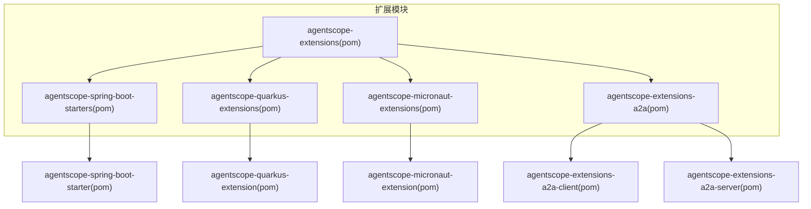
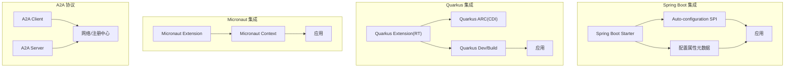
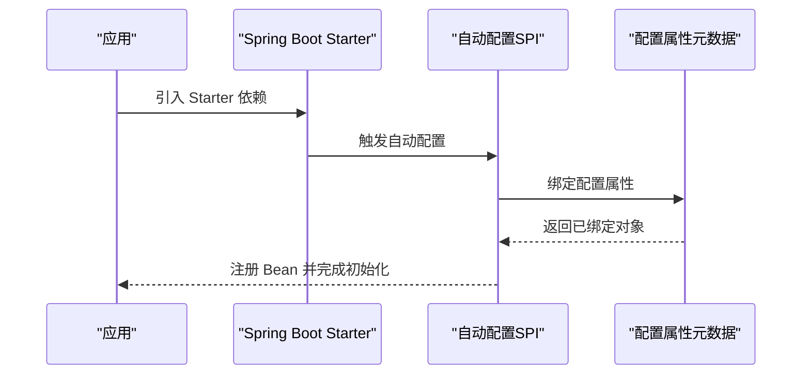
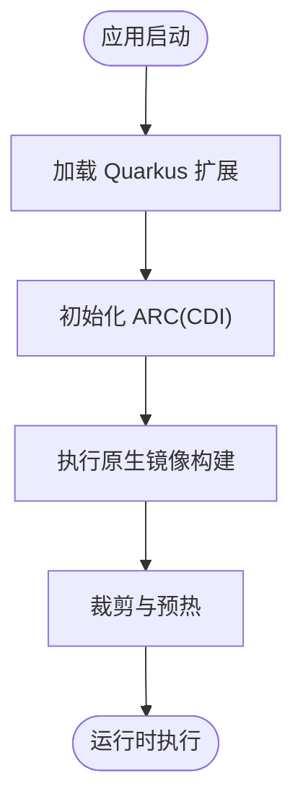
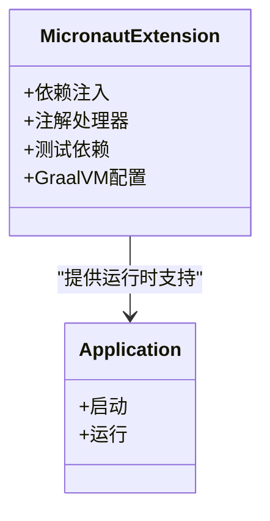
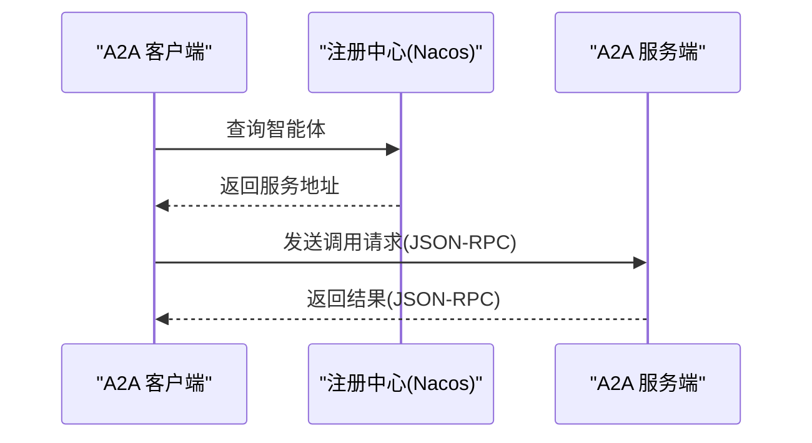
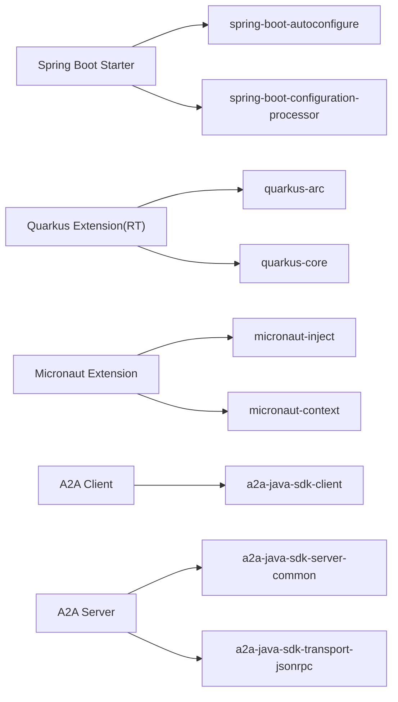

# 扩展与集成

<cite>
**本文引用的文件**
- [agentscope-extensions/pom.xml](file://agentscope-extensions/pom.xml)
- [agentscope-spring-boot-starters/pom.xml](file://agentscope-spring-boot-starters/pom.xml)
- [agentscope-spring-boot-starter/pom.xml](file://agentscope-spring-boot-starter/pom.xml)
- [agentscope-quarkus-extensions/pom.xml](file://agentscope-quarkus-extensions/pom.xml)
- [agentscope-quarkus-extension/pom.xml](file://agentscope-quarkus-extension/pom.xml)
- [agentscope-micronaut-extensions/pom.xml](file://agentscope-micronaut-extensions/pom.xml)
- [agentscope-micronaut-extension/pom.xml](file://agentscope-micronaut-extension/pom.xml)
- [agentscope-extensions-a2a/pom.xml](file://agentscope-extensions-a2a/pom.xml)
- [agentscope-extensions-a2a-client/pom.xml](file://agentscope-extensions-a2a-client/pom.xml)
- [agentscope-extensions-a2a-server/pom.xml](file://agentscope-extensions-a2a-server/pom.xml)
- [application.yml（A2A 示例）](file://agentscope-examples/a2a/src/main/resources/application.yml)
- [application.properties（Quarkus 示例）](file://agentscope-examples/quarkus/src/main/resources/application.properties)
</cite>

## 目录
1. [简介](#简介)
2. [项目结构](#项目结构)
3. [核心组件](#核心组件)
4. [架构总览](#架构总览)
5. [详细组件分析](#详细组件分析)
6. [依赖关系分析](#依赖关系分析)
7. [性能考量](#性能考量)
8. [故障排查指南](#故障排查指南)
9. [结论](#结论)
10. [附录](#附录)

## 简介
本文件面向企业级与云原生场景，系统性梳理 AgentScope Java 的扩展与集成体系，重点覆盖以下方面：
- Spring Boot Starter 的自动配置机制、依赖注入与配置属性处理
- Quarkus 与 Micronaut 扩展的原生镜像支持、运行时优化与无框架配置
- A2A 协议扩展的分布式协作能力与智能体发现机制
- 扩展模块选择指南与集成策略
- 完整配置示例与部署指南
- 微服务架构、容器化与云原生最佳实践

## 项目结构
AgentScope Java 的扩展与集成以 Maven 多模块组织，顶层在 extensions 模块下按框架与能力拆分：
- Spring Boot Starters：提供自动装配与配置属性元数据
- Quarkus 扩展：提供运行时与构建期插件、原生镜像支持
- Micronaut 扩展：提供依赖注入与注解处理器支持
- A2A 扩展：提供客户端与服务端能力，支撑跨进程/跨服务的智能体协作

**图表来源**
- [agentscope-extensions/pom.xml:33-61](file://agentscope-extensions/pom.xml#L33-L61)
- [agentscope-spring-boot-starters/pom.xml:39-45](file://agentscope-spring-boot-starters/pom.xml#L39-L45)
- [agentscope-quarkus-extensions/pom.xml:37-40](file://agentscope-quarkus-extensions/pom.xml#L37-L40)
- [agentscope-micronaut-extensions/pom.xml:34-36](file://agentscope-micronaut-extensions/pom.xml#L34-L36)
- [agentscope-extensions-a2a/pom.xml:33-36](file://agentscope-extensions-a2a/pom.xml#L33-L36)

**章节来源**
- [agentscope-extensions/pom.xml:33-61](file://agentscope-extensions/pom.xml#L33-L61)

## 核心组件
本节聚焦三大集成框架与 A2A 协议扩展的核心模块及其职责边界。

- Spring Boot Starter
  - 提供自动装配入口与配置属性元数据，简化依赖引入与默认配置
  - 通过 spring.factories 或条件化配置实现“开箱即用”
- Quarkus 扩展
  - 运行时依赖 AgentScope 核心与 Quarkus ARC，支持原生镜像构建
  - 构建期通过扩展描述符与注解处理器生成运行时所需资源
- Micronaut 扩展
  - 基于 Micronaut 注入与上下文，提供注解处理器与测试依赖
  - 支持 GraalVM 原生镜像配置参数
- A2A 协议扩展
  - 客户端：基于 SDK 调用远程智能体
  - 服务端：导出本地智能体为可被发现的服务，支持 JSON-RPC 传输

**章节来源**
- [agentscope-spring-boot-starter/pom.xml:38-73](file://agentscope-spring-boot-starter/pom.xml#L38-L73)
- [agentscope-quarkus-extension/pom.xml:31-84](file://agentscope-quarkus-extension/pom.xml#L31-L84)
- [agentscope-micronaut-extension/pom.xml:50-104](file://agentscope-micronaut-extension/pom.xml#L50-L104)
- [agentscope-extensions-a2a-client/pom.xml:32-44](file://agentscope-extensions-a2a-client/pom.xml#L32-L44)
- [agentscope-extensions-a2a-server/pom.xml:33-55](file://agentscope-extensions-a2a-server/pom.xml#L33-L55)

## 架构总览
下图展示三种主流框架的集成路径与关键构件交互：

**图表来源**
- [agentscope-spring-boot-starter/pom.xml:53-65](file://agentscope-spring-boot-starter/pom.xml#L53-L65)
- [agentscope-quarkus-extension/pom.xml:46-56](file://agentscope-quarkus-extension/pom.xml#L46-L56)
- [agentscope-micronaut-extension/pom.xml:65-77](file://agentscope-micronaut-extension/pom.xml#L65-L77)
- [agentscope-extensions-a2a-client/pom.xml:40-43](file://agentscope-extensions-a2a-client/pom.xml#L40-L43)
- [agentscope-extensions-a2a-server/pom.xml:47-54](file://agentscope-extensions-a2a-server/pom.xml#L47-L54)

## 详细组件分析

### Spring Boot Starter 自动配置与配置属性
- 自动装配机制
  - 通过引入自动配置依赖与配置处理器，实现条件化 Bean 注册与默认配置
  - 典型流程：应用启动 -> 加载自动配置 -> 条件判断 -> 注册 Bean -> 绑定配置属性
- 依赖注入与配置属性
  - 使用配置处理器生成元数据，IDE 友好提示与校验
  - 通过 @ConfigurationProperties 或 @Value 注入外部配置
- 典型使用路径
  - 在应用中引入 Starter 后，即可通过 application.yml 等配置文件进行开关与参数控制

**图表来源**
- [agentscope-spring-boot-starter/pom.xml:53-65](file://agentscope-spring-boot-starter/pom.xml#L53-L65)

**章节来源**
- [agentscope-spring-boot-starters/pom.xml:47-57](file://agentscope-spring-boot-starters/pom.xml#L47-L57)
- [agentscope-spring-boot-starter/pom.xml:38-73](file://agentscope-spring-boot-starter/pom.xml#L38-L73)

### Quarkus 扩展与原生镜像支持
- 运行时与构建期
  - 运行时依赖 AgentScope 核心与 Quarkus ARC，确保 CDI 注入可用
  - 构建期通过扩展描述符与注解处理器生成运行时资源
- 原生镜像优化
  - 通过 Quarkus 原生构建配置，减少启动时间与内存占用
  - 示例中提供 builder-image 配置项，便于 CI/CD 场景复现
- 无框架配置
  - 通过 application.properties 提供统一配置入口，避免硬编码

**图表来源**
- [agentscope-quarkus-extension/pom.xml:46-56](file://agentscope-quarkus-extension/pom.xml#L46-L56)
- [agentscope-quarkus-extension/pom.xml:86-117](file://agentscope-quarkus-extension/pom.xml#L86-L117)
- [application.properties（Quarkus 示例）:52-54](file://agentscope-examples/quarkus/src/main/resources/application.properties#L52-L54)

**章节来源**
- [agentscope-quarkus-extensions/pom.xml:37-52](file://agentscope-quarkus-extensions/pom.xml#L37-L52)
- [agentscope-quarkus-extension/pom.xml:31-84](file://agentscope-quarkus-extension/pom.xml#L31-L84)
- [application.properties（Quarkus 示例）:1-55](file://agentscope-examples/quarkus/src/main/resources/application.properties#L1-L55)

### Micronaut 扩展与注解处理
- 依赖注入与上下文
  - 基于 Micronaut inject 与 context，提供编译期与运行时支持
  - 通过注解处理器生成必要元数据，提升启动性能
- 原生镜像配置
  - 提供 GraalVM 版本等配置参数，便于与 Micronaut 原生特性协同
- 测试与验证
  - 提供测试依赖，便于在本地与 CI 中验证行为一致性

**图表来源**
- [agentscope-micronaut-extension/pom.xml:65-77](file://agentscope-micronaut-extension/pom.xml#L65-L77)
- [agentscope-micronaut-extension/pom.xml:106-122](file://agentscope-micronaut-extension/pom.xml#L106-L122)

**章节来源**
- [agentscope-micronaut-extensions/pom.xml:34-36](file://agentscope-micronaut-extensions/pom.xml#L34-L36)
- [agentscope-micronaut-extension/pom.xml:50-104](file://agentscope-micronaut-extension/pom.xml#L50-L104)

### A2A 协议扩展：分布式协作与智能体发现
- 分布式协作
  - 客户端通过 SDK 调用远端智能体，屏蔽网络与协议细节
  - 服务端将本地智能体导出为可被发现的服务，支持 JSON-RPC 传输
- 智能体发现机制
  - 示例中结合 Nacos 进行服务注册与发现，支持动态配置与高可用
  - 通过卡片信息（名称、描述、图标、技能列表等）对外暴露能力
- 配置要点
  - 服务端端口、Nacos 开关与地址、认证凭据等

**图表来源**
- [agentscope-extensions-a2a-client/pom.xml:40-43](file://agentscope-extensions-a2a-client/pom.xml#L40-L43)
- [agentscope-extensions-a2a-server/pom.xml:47-54](file://agentscope-extensions-a2a-server/pom.xml#L47-L54)
- [application.yml（A2A 示例）:60-65](file://agentscope-examples/a2a/src/main/resources/application.yml#L60-L65)

**章节来源**
- [agentscope-extensions-a2a/pom.xml:33-36](file://agentscope-extensions-a2a/pom.xml#L33-L36)
- [agentscope-extensions-a2a-client/pom.xml:32-44](file://agentscope-extensions-a2a-client/pom.xml#L32-L44)
- [agentscope-extensions-a2a-server/pom.xml:33-55](file://agentscope-extensions-a2a-server/pom.xml#L33-L55)
- [application.yml（A2A 示例）:15-65](file://agentscope-examples/a2a/src/main/resources/application.yml#L15-L65)

## 依赖关系分析
- 模块内聚与耦合
  - Spring Boot Starter 与 Quarkus/Micronaut 扩展均以“运行时库 + 框架适配”为主，耦合度低
  - A2A 扩展客户端与服务端通过公共协议解耦，便于独立演进
- 外部依赖管理
  - Spring Boot Starter 通过 dependencyManagement 导入 Spring Boot BOM
  - Quarkus 与 Micronaut 扩展分别导入各自平台 BOM，保证版本一致
- 关键依赖链
  - Spring Boot Starter 依赖自动配置与配置处理器
  - Quarkus 扩展依赖 ARC 与核心运行时
  - Micronaut 扩展依赖注入与上下文

**图表来源**
- [agentscope-spring-boot-starter/pom.xml:53-65](file://agentscope-spring-boot-starter/pom.xml#L53-L65)
- [agentscope-quarkus-extension/pom.xml:46-56](file://agentscope-quarkus-extension/pom.xml#L46-L56)
- [agentscope-micronaut-extension/pom.xml:65-77](file://agentscope-micronaut-extension/pom.xml#L65-L77)
- [agentscope-extensions-a2a-client/pom.xml:40-43](file://agentscope-extensions-a2a-client/pom.xml#L40-L43)
- [agentscope-extensions-a2a-server/pom.xml:47-54](file://agentscope-extensions-a2a-server/pom.xml#L47-L54)

**章节来源**
- [agentscope-spring-boot-starters/pom.xml:47-57](file://agentscope-spring-boot-starters/pom.xml#L47-L57)
- [agentscope-quarkus-extensions/pom.xml:42-52](file://agentscope-quarkus-extensions/pom.xml#L42-L52)
- [agentscope-micronaut-extensions/pom.xml:38-48](file://agentscope-micronaut-extensions/pom.xml#L38-L48)

## 性能考量
- 启动时间与内存占用
  - Spring Boot：通过自动配置与配置属性元数据减少运行时反射与校验成本
  - Quarkus：利用原生镜像与构建期优化，显著降低冷启动与内存占用
  - Micronaut：注解处理器与编译期元数据生成，有助于减少运行时开销
- 网络与序列化
  - A2A 服务端采用 JSON-RPC 传输，具备跨语言与跨平台优势；建议在高并发场景启用连接池与超时重试
- 资源与线程
  - 合理设置模型调用并发度与工具执行队列，避免阻塞主线程

## 故障排查指南
- 配置未生效
  - 检查是否正确引入 Starter 与配置处理器，确认配置文件命名与位置符合框架约定
- 原生镜像构建失败
  - 核对 builder-image 与 JDK 版本匹配，清理缓存后重试
- A2A 调用异常
  - 核对服务端端口与注册中心配置，检查 Nacos 凭据与网络连通性
- 日志级别与定位
  - 通过框架日志配置提高调试等级，定位自动配置或 Bean 初始化问题

## 结论
AgentScope Java 的扩展与集成体系以模块化设计为核心，围绕 Spring Boot、Quarkus、Micronaut 三大生态提供一致的开发体验，并通过 A2A 协议扩展实现跨进程/跨服务的智能体协作。结合本文的配置示例与部署建议，可在微服务与云原生环境中高效落地。

## 附录

### 配置示例与部署指南

- Spring Boot 应用
  - 引入 Starter 依赖，通过 application.yml 设置 AgentScope 与模型提供商参数
  - 参考路径：[agentscope-spring-boot-starter/pom.xml:38-73](file://agentscope-spring-boot-starter/pom.xml#L38-L73)
- Quarkus 应用
  - 在 application.properties 中设置模型提供商、API Key、端口与原生构建参数
  - 参考路径：[application.properties（Quarkus 示例）:1-55](file://agentscope-examples/quarkus/src/main/resources/application.properties#L1-L55)
- A2A 协议
  - 在 application.yml 中配置服务端端口、智能体卡片与 Nacos 发现参数
  - 参考路径：[application.yml（A2A 示例）:15-65](file://agentscope-examples/a2a/src/main/resources/application.yml#L15-L65)

### 企业级集成最佳实践
- 微服务架构
  - 将不同功能拆分为独立服务，A2A 作为服务间编排与协作的桥梁
- 容器化与云原生
  - 使用 Quarkus 原生镜像提升容器启动速度与资源效率；在 Kubernetes 中配合 HPA 与探针
- 配置治理
  - 使用集中式配置中心（如 Nacos）统一管理各环境参数，结合权限与灰度发布策略