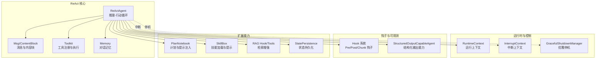
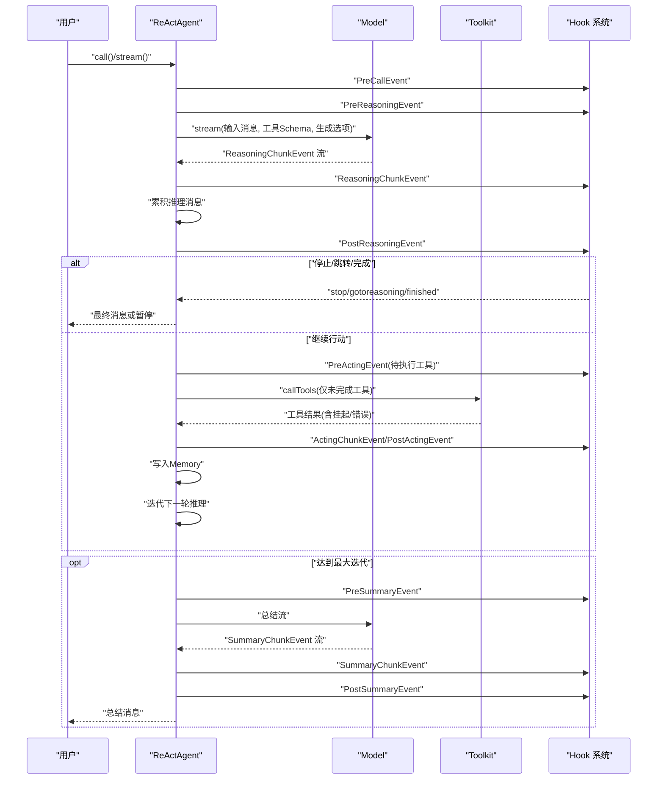
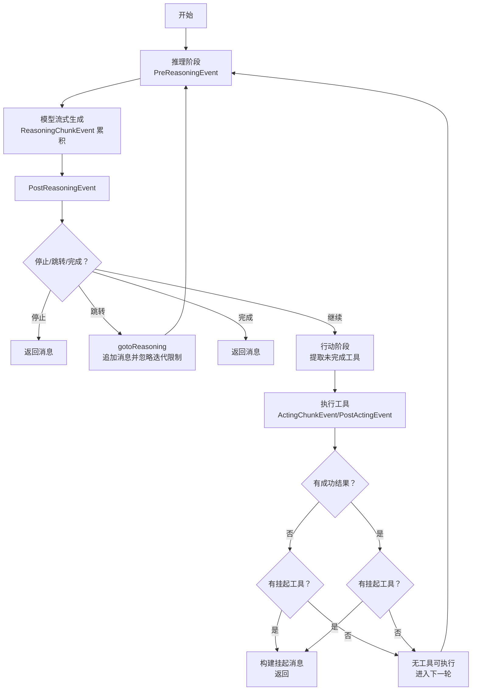
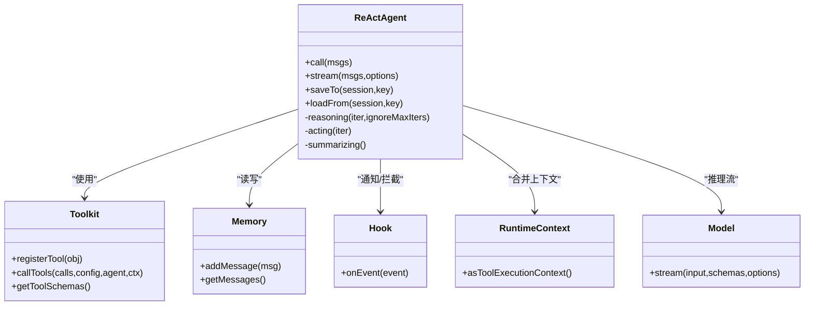

# ReAct 智能体

<cite>
**本文引用的文件**
- [ReActAgent.java](file://agentscope-core/src/main/java/io/agentscope/core/ReActAgent.java)
- [Msg.java](file://agentscope-core/src/main/java/io/agentscope/core/message/Msg.java)
- [ToolUseBlock.java](file://agentscope-core/src/main/java/io/agentscope/core/message/ToolUseBlock.java)
- [ToolResultBlock.java](file://agentscope-core/src/main/java/io/agentscope/core/message/ToolResultBlock.java)
- [ThinkingBlock.java](file://agentscope-core/src/main/java/io/agentscope/core/message/ThinkingBlock.java)
- [TextBlock.java](file://agentscope-core/src/main/java/io/agentscope/core/message/TextBlock.java)
- [Toolkit.java](file://agentscope-core/src/main/java/io/agentscope/core/tool/Toolkit.java)
- [ToolExecutionContext.java](file://agentscope-core/src/main/java/io/agentscope/core/tool/ToolExecutionContext.java)
- [ToolResultMessageBuilder.java](file://agentscope-core/src/main/java/io/agentscope/core/tool/ToolResultMessageBuilder.java)
- [Memory.java](file://agentscope-core/src/main/java/io/agentscope/core/memory/Memory.java)
- [InMemoryMemory.java](file://agentscope-core/src/main/java/io/agentscope/core/memory/InMemoryMemory.java)
- [PlanNotebook.java](file://agentscope-core/src/main/java/io/agentscope/core/plan/PlanNotebook.java)
- [SkillBox.java](file://agentscope-core/src/main/java/io/agentscope/core/skill/SkillBox.java)
- [Hook.java](file://agentscope-core/src/main/java/io/agentscope/core/hook/Hook.java)
- [PreReasoningEvent.java](file://agentscope-core/src/main/java/io/agentscope/core/hook/PreReasoningEvent.java)
- [PostReasoningEvent.java](file://agentscope-core/src/main/java/io/agentscope/core/hook/PostReasoningEvent.java)
- [PreActingEvent.java](file://agentscope-core/src/main/java/io/agentscope/core/hook/PreActingEvent.java)
- [PostActingEvent.java](file://agentscope-core/src/main/java/io/agentscope/core/hook/PostActingEvent.java)
- [ReasoningChunkEvent.java](file://agentscope-core/src/main/java/io/agentscope/core/hook/ReasoningChunkEvent.java)
- [ActingChunkEvent.java](file://agentscope-core/src/main/java/io/agentscope/core/hook/ActingChunkEvent.java)
- [PendingToolRecoveryHook.java](file://agentscope-core/src/main/java/io/agentscope/core/hook/PendingToolRecoveryHook.java)
- [StructuredOutputCapableAgent.java](file://agentscope-core/src/main/java/io/agentscope/core/agent/StructuredOutputCapableAgent.java)
- [RuntimeContext.java](file://agentscope-core/src/main/java/io/agentscope/core/agent/RuntimeContext.java)
- [InterruptContext.java](file://agentscope-core/src/main/java/io/agentscope/core/interruption/InterruptContext.java)
- [InterruptSource.java](file://agentscope-core/src/main/java/io/agentscope/core/interruption/InterruptSource.java)
- [GracefulShutdownManager.java](file://agentscope-core/src/main/java/io/agentscope/core/shutdown/GracefulShutdownManager.java)
- [AgentShuttingDownException.java](file://agentscope-core/src/main/java/io/agentscope/core/shutdown/AgentShuttingDownException.java)
- [StatePersistence.java](file://agentscope-core/src/main/java/io/agentscope/core/state/StatePersistence.java)
- [Session.java](file://agentscope-core/src/main/java/io/agentscope/core/session/Session.java)
- [SessionKey.java](file://agentscope-core/src/main/java/io/agentscope/core/state/SessionKey.java)
- [GenericRAGHook.java](file://agentscope-core/src/main/java/io/agentscope/core/rag/GenericRAGHook.java)
- [KnowledgeRetrievalTools.java](file://agentscope-core/src/main/java/io/agentscope/core/rag/KnowledgeRetrievalTools.java)
- [RAGMode.java](file://agentscope-core/src/main/java/io/agentscope/core/rag/RAGMode.java)
- [RetrieveConfig.java](file://agentscope-core/src/main/java/io/agentscope/core/rag/model/RetrieveConfig.java)
- [Knowledge.java](file://agentscope-core/src/main/java/io/agentscope/core/rag/Knowledge.java)
- [Document.java](file://agentscope-core/src/main/java/io/agentscope/core/rag/model/Document.java)
- [ExecutionConfig.java](file://agentscope-core/src/main/java/io/agentscope/core/model/ExecutionConfig.java)
- [GenerateOptions.java](file://agentscope-core/src/main/java/io/agentscope/core/model/GenerateOptions.java)
- [Model.java](file://agentscope-core/src/main/java/io/agentscope/core/model/Model.java)
- [StructuredOutputReminder.java](file://agentscope-core/src/main/java/io/agentscope/core/model/StructuredOutputReminder.java)
- [MessageUtils.java](file://agentscope-core/src/main/java/io/agentscope/core/util/MessageUtils.java)
- [ExceptionUtils.java](file://agentscope-core/src/main/java/io/agentscope/core/util/ExceptionUtils.java)
</cite>

## 目录
1. [引言](#引言)
2. [项目结构](#项目结构)
3. [核心组件](#核心组件)
4. [架构总览](#架构总览)
5. [详细组件分析](#详细组件分析)
6. [依赖关系分析](#依赖关系分析)
7. [性能考量](#性能考量)
8. [故障排查指南](#故障排查指南)
9. [结论](#结论)
10. [附录：API 参考](#附录api-参考)

## 引言
本文件面向需要在 AgentScope 中使用与扩展 ReAct 智能体的工程师与架构师，系统性阐述 ReAct 模式在框架中的实现原理与工程化细节。ReAct 将“推理（思考与规划）”与“行动（工具执行）”以迭代循环的形式结合，通过钩子系统、消息流与工具链路实现可观测、可中断、可恢复的智能体行为。本文将从架构、数据流、处理逻辑、生命周期与异常处理等维度进行深入解析，并提供 API 参考、流程图与时序图，帮助读者快速上手并安全地集成到生产环境。

## 项目结构
ReAct 智能体位于 agentscope-core 模块中，围绕 ReActAgent 核心类展开，配合消息模型、工具系统、内存与会话、钩子系统、计划与技能、RAG、执行配置与生成选项等模块协同工作。

图表来源
- [ReActAgent.java:140-1904](file://agentscope-core/src/main/java/io/agentscope/core/ReActAgent.java#L140-L1904)
- [Msg.java:500-654](file://agentscope-core/src/main/java/io/agentscope/core/message/Msg.java#L500-L654)
- [Toolkit.java](file://agentscope-core/src/main/java/io/agentscope/core/tool/Toolkit.java)
- [Memory.java](file://agentscope-core/src/main/java/io/agentscope/core/memory/Memory.java)
- [Hook.java](file://agentscope-core/src/main/java/io/agentscope/core/hook/Hook.java)
- [StructuredOutputCapableAgent.java](file://agentscope-core/src/main/java/io/agentscope/core/agent/StructuredOutputCapableAgent.java)
- [PlanNotebook.java](file://agentscope-core/src/main/java/io/agentscope/core/plan/PlanNotebook.java)
- [SkillBox.java](file://agentscope-core/src/main/java/io/agentscope/core/skill/SkillBox.java)
- [GenericRAGHook.java](file://agentscope-core/src/main/java/io/agentscope/core/rag/GenericRAGHook.java)
- [StatePersistence.java](file://agentscope-core/src/main/java/io/agentscope/core/state/StatePersistence.java)
- [RuntimeContext.java](file://agentscope-core/src/main/java/io/agentscope/core/agent/RuntimeContext.java)
- [InterruptContext.java](file://agentscope-core/src/main/java/io/agentscope/core/interruption/InterruptContext.java)
- [GracefulShutdownManager.java](file://agentscope-core/src/main/java/io/agentscope/core/shutdown/GracefulShutdownManager.java)

章节来源
- [ReActAgent.java:140-1904](file://agentscope-core/src/main/java/io/agentscope/core/ReActAgent.java#L140-L1904)

## 核心组件
- ReActAgent：实现推理-行动循环，负责消息流、工具调用、钩子通知、状态管理与生命周期控制。
- 消息与内容块：Msg、TextBlock、ThinkingBlock、ToolUseBlock、ToolResultBlock 构成多模态消息结构。
- 工具系统：Toolkit 负责工具注册、Schema 生成、执行与结果转换。
- 内存：Memory/InMemoryMemory 存储历史消息，支持恢复与会话绑定。
- 钩子系统：Hook 接口及 Pre/Post/Chunk 事件，支持人类在环（HITL）、结构化输出、RAG 注入、计划提示等。
- 运行时上下文：RuntimeContext 提供会话、用户、权限等元信息。
- 执行与生成：ExecutionConfig、GenerateOptions 控制模型与工具调用策略。
- 计划与技能：PlanNotebook、SkillBox 提供计划提示与技能加载。
- RAG：GenericRAGHook 或 KnowledgeRetrievalTools 提供检索增强。
- 状态持久化：StatePersistence 控制保存/加载哪些组件状态。
- 中断与停机：InterruptContext、GracefulShutdownManager、AgentShuttingDownException 支持优雅中断与恢复。

章节来源
- [ReActAgent.java:140-1904](file://agentscope-core/src/main/java/io/agentscope/core/ReActAgent.java#L140-L1904)
- [Msg.java:500-654](file://agentscope-core/src/main/java/io/agentscope/core/message/Msg.java#L500-L654)
- [Toolkit.java](file://agentscope-core/src/main/java/io/agentscope/core/tool/Toolkit.java)
- [Memory.java](file://agentscope-core/src/main/java/io/agentscope/core/memory/Memory.java)
- [Hook.java](file://agentscope-core/src/main/java/io/agentscope/core/hook/Hook.java)
- [RuntimeContext.java](file://agentscope-core/src/main/java/io/agentscope/core/agent/RuntimeContext.java)
- [ExecutionConfig.java](file://agentscope-core/src/main/java/io/agentscope/core/model/ExecutionConfig.java)
- [GenerateOptions.java](file://agentscope-core/src/main/java/io/agentscope/core/model/GenerateOptions.java)
- [PlanNotebook.java](file://agentscope-core/src/main/java/io/agentscope/core/plan/PlanNotebook.java)
- [SkillBox.java](file://agentscope-core/src/main/java/io/agentscope/core/skill/SkillBox.java)
- [GenericRAGHook.java](file://agentscope-core/src/main/java/io/agentscope/core/rag/GenericRAGHook.java)
- [StatePersistence.java](file://agentscope-core/src/main/java/io/agentscope/core/state/StatePersistence.java)

## 架构总览
ReActAgent 的核心是“推理-行动”双阶段的非阻塞流式执行，借助 Project Reactor 的 Mono/Flux 实现异步与背压。系统通过钩子贯穿各阶段，通过 RuntimeContext 传递元数据，通过 Memory 与 Session 实现状态持久化与恢复。

图表来源
- [ReActAgent.java:560-650](file://agentscope-core/src/main/java/io/agentscope/core/ReActAgent.java#L560-L650)
- [ReActAgent.java:669-731](file://agentscope-core/src/main/java/io/agentscope/core/ReActAgent.java#L669-L731)
- [ReActAgent.java:828-861](file://agentscope-core/src/main/java/io/agentscope/core/ReActAgent.java#L828-L861)
- [Hook.java](file://agentscope-core/src/main/java/io/agentscope/core/hook/Hook.java)
- [PreReasoningEvent.java](file://agentscope-core/src/main/java/io/agentscope/core/hook/PreReasoningEvent.java)
- [PostReasoningEvent.java](file://agentscope-core/src/main/java/io/agentscope/core/hook/PostReasoningEvent.java)
- [PreActingEvent.java](file://agentscope-core/src/main/java/io/agentscope/core/hook/PreActingEvent.java)
- [PostActingEvent.java](file://agentscope-core/src/main/java/io/agentscope/core/hook/PostActingEvent.java)
- [ReasoningChunkEvent.java](file://agentscope-core/src/main/java/io/agentscope/core/hook/ReasoningChunkEvent.java)
- [ActingChunkEvent.java](file://agentscope-core/src/main/java/io/agentscope/core/hook/ActingChunkEvent.java)

## 详细组件分析

### 推理-行动循环与消息流
- 推理阶段（reasoning）：从钩子接收输入消息与系统消息，拼接后调用模型流式生成；每产生一个推理块，即触发 ReasoningChunkEvent 并累积为完整消息；随后触发 PostReasoningEvent，依据事件决定是否停止、跳转到推理（如结构化输出重试）、或进入行动阶段。
- 行动阶段（acting）：提取“未完成工具”（即存在 ToolUseBlock 但无对应 ToolResultBlock），仅对这些工具执行；工具执行过程中通过 ActingChunkEvent 通知；成功结果经 PostActingEvent 处理后写入 Memory；若存在挂起工具则返回包含 ToolUseBlock 与 pending ToolResultBlock 的消息，等待用户或外部系统进一步处理。
- 总结阶段（summarizing）：当达到最大迭代次数时，构造“总结请求”消息，再次通过模型流式生成总结，期间持续发送 SummaryChunkEvent，最终由 PostSummaryEvent 完成收尾。

图表来源
- [ReActAgent.java:560-650](file://agentscope-core/src/main/java/io/agentscope/core/ReActAgent.java#L560-L650)
- [ReActAgent.java:669-731](file://agentscope-core/src/main/java/io/agentscope/core/ReActAgent.java#L669-L731)
- [ReActAgent.java:828-861](file://agentscope-core/src/main/java/io/agentscope/core/ReActAgent.java#L828-L861)

章节来源
- [ReActAgent.java:560-650](file://agentscope-core/src/main/java/io/agentscope/core/ReActAgent.java#L560-L650)
- [ReActAgent.java:669-731](file://agentscope-core/src/main/java/io/agentscope/core/ReActAgent.java#L669-L731)
- [ReActAgent.java:828-861](file://agentscope-core/src/main/java/io/agentscope/core/ReActAgent.java#L828-L861)

### 构建器模式与配置选项
ReActAgent.builder() 提供丰富的配置项，涵盖：
- 基础配置：name、description、sysPrompt、checkRunning
- 模型与工具：model、toolkit、memory、maxIters
- 执行与生成：modelExecutionConfig、toolExecutionConfig、generateOptions、structuredOutputReminder
- 钩子与扩展：hooks、enableMetaTool、enablePendingToolRecovery
- 计划与技能：planNotebook、skillBox
- 长期记忆：longTermMemory、longTermMemoryMode、longTermMemoryAsyncRecord
- 状态持久化：statePersistence
- RAG：knowledge/knowledges、ragMode、retrieveConfig
- 工具执行上下文：toolExecutionContext

构建时会：
- 深拷贝 Toolkit，避免实例间状态干扰；
- 注册钩子声明的工具；
- 可选启用元工具；
- 可选启用 PendingToolRecoveryHook；
- 配置长期记忆（静态/代理/两者）；
- 配置 RAG（Generic Hook 或 A2A 工具）；
- 绑定 PlanNotebook 与 SkillBox。

章节来源
- [ReActAgent.java:1207-1902](file://agentscope-core/src/main/java/io/agentscope/core/ReActAgent.java#L1207-L1902)

### 推理阶段实现要点
- 输入准备：prependSystemMsg 将当前系统消息前置到每次模型调用前，确保上下文一致；
- 生成选项：buildGenerateOptions 合并用户配置与模型执行配置；
- 钩子通知：PreReasoningEvent/ReasoningChunkEvent/PostReasoningEvent 形成闭环；
- 中断处理：checkInterruptedAsync 在每个流式片段插入检查，遇到系统中断按策略决定保留或丢弃已累积消息；
- 结束条件：isFinished 判断是否包含 ToolUseBlock，无工具调用即视为完成。

章节来源
- [ReActAgent.java:927-958](file://agentscope-core/src/main/java/io/agentscope/core/ReActAgent.java#L927-L958)
- [ReActAgent.java:990-1002](file://agentscope-core/src/main/java/io/agentscope/core/ReActAgent.java#L990-L1002)
- [ReActAgent.java:1017-1025](file://agentscope-core/src/main/java/io/agentscope/core/ReActAgent.java#L1017-L1025)
- [ReActAgent.java:1136-1153](file://agentscope-core/src/main/java/io/agentscope/core/ReActAgent.java#L1136-L1153)

### 行动阶段实现要点
- 待执行工具提取：extractPendingToolCalls 仅选择尚未有 ToolResultBlock 的 ToolUseBlock；
- 工具执行：executeToolCalls 通过 Toolkit 执行，失败时统一生成错误 ToolResultBlock，保证循环继续；
- 结果处理：成功结果经 ToolResultMessageBuilder 构造消息，触发 PostActingEvent，再写入 Memory；
- 挂起工具：若存在 ToolSuspendException，构建包含 ToolUseBlock 与 pending ToolResultBlock 的消息返回，等待后续继续。

章节来源
- [ReActAgent.java:977-987](file://agentscope-core/src/main/java/io/agentscope/core/ReActAgent.java#L977-L987)
- [ReActAgent.java:766-804](file://agentscope-core/src/main/java/io/agentscope/core/ReActAgent.java#L766-L804)
- [ReActAgent.java:809-823](file://agentscope-core/src/main/java/io/agentscope/core/ReActAgent.java#L809-L823)
- [ReActAgent.java:742-754](file://agentscope-core/src/main/java/io/agentscope/core/ReActAgent.java#L742-L754)

### 生命周期管理、异常处理与中断机制
- 生命周期：beforeAgentExecution/afterAgentExecution 绑定/解绑 RuntimeContext；saveTo/loadFrom 支持状态持久化与会话绑定；
- 异常处理：工具执行异常被转换为错误 ToolResultBlock，避免中断 ReAct 循环；模型/总结阶段的 InterruptedException 会被正确传播；
- 中断机制：handleInterrupt 根据中断源区分系统停机与人工中断，分别采取抛出 AgentShuttingDownException 或记录恢复消息；
- 优雅停机：GracefulShutdownManager 记录中断观察与会话绑定，支持策略性保留/丢弃部分推理结果。

章节来源
- [ReActAgent.java:198-230](file://agentscope-core/src/main/java/io/agentscope/core/ReActAgent.java#L198-L230)
- [ReActAgent.java:300-359](file://agentscope-core/src/main/java/io/agentscope/core/ReActAgent.java#L300-L359)
- [ReActAgent.java:1136-1153](file://agentscope-core/src/main/java/io/agentscope/core/ReActAgent.java#L1136-L1153)
- [GracefulShutdownManager.java](file://agentscope-core/src/main/java/io/agentscope/core/shutdown/GracefulShutdownManager.java)
- [AgentShuttingDownException.java](file://agentscope-core/src/main/java/io/agentscope/core/shutdown/AgentShuttingDownException.java)

### 消息模型与工具调用
- 消息结构：Msg 包含 id、name、role、content（多 ContentBlock）与 metadata；常用内容块包括 TextBlock、ThinkingBlock、ToolUseBlock、ToolResultBlock；
- 工具调用：ToolUseBlock 描述工具名、参数与唯一 id；ToolResultBlock 返回结果或错误；Toolkit 负责执行与结果转换；
- 结果消息：ToolResultMessageBuilder 将 ToolUseBlock 与 ToolResultBlock 组合为标准消息，便于钩子与 Memory 处理。

章节来源
- [Msg.java:500-654](file://agentscope-core/src/main/java/io/agentscope/core/message/Msg.java#L500-L654)
- [ToolUseBlock.java](file://agentscope-core/src/main/java/io/agentscope/core/message/ToolUseBlock.java)
- [ToolResultBlock.java](file://agentscope-core/src/main/java/io/agentscope/core/message/ToolResultBlock.java)
- [ThinkingBlock.java](file://agentscope-core/src/main/java/io/agentscope/core/message/ThinkingBlock.java)
- [TextBlock.java](file://agentscope-core/src/main/java/io/agentscope/core/message/TextBlock.java)
- [ToolResultMessageBuilder.java](file://agentscope-core/src/main/java/io/agentscope/core/tool/ToolResultMessageBuilder.java)

### 钩子系统与扩展点
- 钩子类型：Pre/Post Reasoning、Pre/Post Acting、Reasoning/Acting/Summary Chunk、结构化输出、计划提示、RAG 注入、技能注入、长期记忆静态控制、挂起工具恢复等；
- 事件交互：钩子可修改输入消息、生成选项、请求停止、请求跳转到推理、注入计划提示等；
- 优先级：钩子按优先级顺序执行，低数值优先。

章节来源
- [Hook.java](file://agentscope-core/src/main/java/io/agentscope/core/hook/Hook.java)
- [PreReasoningEvent.java](file://agentscope-core/src/main/java/io/agentscope/core/hook/PreReasoningEvent.java)
- [PostReasoningEvent.java](file://agentscope-core/src/main/java/io/agentscope/core/hook/PostReasoningEvent.java)
- [PreActingEvent.java](file://agentscope-core/src/main/java/io/agentscope/core/hook/PreActingEvent.java)
- [PostActingEvent.java](file://agentscope-core/src/main/java/io/agentscope/core/hook/PostActingEvent.java)
- [ReasoningChunkEvent.java](file://agentscope-core/src/main/java/io/agentscope/core/hook/ReasoningChunkEvent.java)
- [ActingChunkEvent.java](file://agentscope-core/src/main/java/io/agentscope/core/hook/ActingChunkEvent.java)
- [PendingToolRecoveryHook.java](file://agentscope-core/src/main/java/io/agentscope/core/hook/PendingToolRecoveryHook.java)

### 计划、技能与 RAG 集成
- 计划：PlanNotebook 注册计划管理工具并在 PreReasoningEvent 注入当前提示，形成“先计划再行动”的协作模式；
- 技能：SkillBox 自动注册技能加载工具与 Hook，在 PreCallEvent 注入技能提示并管理激活；
- RAG：GenericRAGHook 自动注入检索结果；A2A 模式下注册检索工具由模型显式调用。

章节来源
- [PlanNotebook.java](file://agentscope-core/src/main/java/io/agentscope/core/plan/PlanNotebook.java)
- [SkillBox.java](file://agentscope-core/src/main/java/io/agentscope/core/skill/SkillBox.java)
- [GenericRAGHook.java](file://agentscope-core/src/main/java/io/agentscope/core/rag/GenericRAGHook.java)
- [KnowledgeRetrievalTools.java](file://agentscope-core/src/main/java/io/agentscope/core/rag/KnowledgeRetrievalTools.java)

## 依赖关系分析
ReActAgent 与各模块的耦合度适中，通过接口与事件解耦，具备良好的可替换性与扩展性。

图表来源
- [ReActAgent.java:140-1904](file://agentscope-core/src/main/java/io/agentscope/core/ReActAgent.java#L140-L1904)
- [Toolkit.java](file://agentscope-core/src/main/java/io/agentscope/core/tool/Toolkit.java)
- [Memory.java](file://agentscope-core/src/main/java/io/agentscope/core/memory/Memory.java)
- [Hook.java](file://agentscope-core/src/main/java/io/agentscope/core/hook/Hook.java)
- [RuntimeContext.java](file://agentscope-core/src/main/java/io/agentscope/core/agent/RuntimeContext.java)
- [Model.java](file://agentscope-core/src/main/java/io/agentscope/core/model/Model.java)

章节来源
- [ReActAgent.java:140-1904](file://agentscope-core/src/main/java/io/agentscope/core/ReActAgent.java#L140-L1904)

## 性能考量
- 流式处理：推理与总结均采用模型流式输出，减少一次性缓冲，提升响应延迟；
- 工具并发：Toolkit 支持并发执行与自定义线程池，合理设置并行度与超时；
- 挂起工具：利用挂起机制避免阻塞，允许外部系统逐步执行并回传结果；
- 长期记忆异步：静态长期记忆可配置异步记录，降低主路径延迟；
- 生成选项：适度降低 maxTokens、合理温度与 topP，有助于稳定吞吐；
- 钩子开销：尽量减少复杂钩子逻辑，必要时异步化处理；
- 内存复用：合理使用 InMemoryMemory，避免过大历史导致内存压力。

## 故障排查指南
- “存在挂起工具但未提供结果”：确认是否启用 PendingToolRecoveryHook，或在输入中提供 ToolResultBlock；
- “部分工具结果不完整却包含文本”：该场景被严格禁止，需补齐所有工具结果或移除文本内容；
- “工具执行异常导致循环中断”：默认会生成错误 ToolResultBlock 继续循环，若出现 JVM 级异常（如 OutOfMemoryError）可能直接中断；
- “系统停机中断”：系统中断会根据策略保留或丢弃部分推理结果，必要时通过会话恢复；
- “结构化输出失败重试”：可通过 gotoReasoning 请求回到推理阶段，修正提示或参数后重试。

章节来源
- [ReActAgent.java:478-531](file://agentscope-core/src/main/java/io/agentscope/core/ReActAgent.java#L478-L531)
- [ReActAgent.java:774-804](file://agentscope-core/src/main/java/io/agentscope/core/ReActAgent.java#L774-L804)
- [ReActAgent.java:1136-1153](file://agentscope-core/src/main/java/io/agentscope/core/ReActAgent.java#L1136-L1153)

## 结论
ReAct 智能体通过清晰的推理-行动循环、完善的钩子系统与消息模型，实现了高可扩展、可观测、可中断的智能体行为。其构建器模式提供了灵活的配置能力，结合计划、技能与 RAG 等扩展，能够覆盖从简单问答到复杂任务编排的多种场景。遵循本文的最佳实践与故障排查建议，可在保证稳定性的同时获得更优的性能与用户体验。

## 附录：API 参考

- ReActAgent
  - 构造与构建
    - 构造函数：私有，通过 Builder 创建
    - 静态工厂：builder() 返回 Builder 实例
  - 调用接口
    - call(List<Msg>)：同步返回最终 Msg
    - call(List<Msg>, Class<?>)：结构化输出（类）
    - call(List<Msg>, JsonNode)：结构化输出（JSON Schema）
    - stream(List<Msg>, StreamOptions)：流式事件
    - stream(List<Msg>, StreamOptions, Class<?>)：流式+结构化
    - stream(List<Msg>, StreamOptions, JsonNode)：流式+结构化
    - call(List<Msg>, RuntimeContext)/stream(..., RuntimeContext)：带运行时上下文
  - 生命周期
    - saveTo(Session, SessionKey)：保存状态
    - loadFrom(Session, SessionKey)：加载状态
    - loadIfExists(...)：存在则加载
  - 配置访问
    - getMemory()/setMemory()：只读内存（不可替换）
    - getSysPrompt()/getModel()/getMaxIters()/getPlanNotebook()/getGenerateOptions()

- Builder
  - 基础：name、description、sysPrompt、checkRunning
  - 核心：model、toolkit、memory、maxIters
  - 执行与生成：modelExecutionConfig、toolExecutionConfig、generateOptions、structuredOutputReminder
  - 钩子与扩展：hook(s)、enableMetaTool、enablePendingToolRecovery、planNotebook、skillBox
  - 长期记忆：longTermMemory、longTermMemoryMode、longTermMemoryAsyncRecord
  - 状态持久化：statePersistence
  - RAG：knowledge(s)、ragMode、retrieveConfig
  - 工具执行上下文：toolExecutionContext
  - build()：构建 ReActAgent 实例

- 消息与内容块
  - Msg：消息主体，Builder 支持 id、name、role、content、metadata、timestamp
  - TextBlock：纯文本内容
  - ThinkingBlock：思考内容
  - ToolUseBlock：工具调用（id、name、input）
  - ToolResultBlock：工具结果（id、output）

- 工具系统
  - Toolkit：注册工具、生成 Schema、执行工具、设置内部 chunk 回调
  - ToolExecutionContext：工具执行上下文（用户、会话、权限等）
  - ToolResultMessageBuilder：构建工具结果消息

- 钩子与事件
  - Hook：onEvent 事件拦截
  - PreReasoningEvent/PostReasoningEvent：推理前后事件
  - PreActingEvent/PostActingEvent：行动前后事件
  - ReasoningChunkEvent/ActingChunkEvent/SummaryChunkEvent：流式分片事件
  - PendingToolRecoveryHook：挂起工具自动恢复

- 计划、技能与 RAG
  - PlanNotebook：计划管理与提示注入
  - SkillBox：技能加载与提示注入
  - GenericRAGHook/KnowledgeRetrievalTools：检索增强
  - Knowledge/RetrieveConfig/Document：知识库与检索配置

- 执行与生成
  - ExecutionConfig：模型/工具执行配置（超时、重试、退避）
  - GenerateOptions：生成参数（温度、topP、maxTokens 等）
  - StructuredOutputReminder：结构化输出提醒策略

- 生命周期与中断
  - RuntimeContext：会话、用户、权限等元信息
  - InterruptContext/InterruptSource：中断上下文与来源
  - GracefulShutdownManager/AgentShuttingDownException：优雅停机与异常

- 状态持久化
  - StatePersistence：控制保存/加载组件范围
  - Session/SessionKey：会话与键

章节来源
- [ReActAgent.java:1207-1902](file://agentscope-core/src/main/java/io/agentscope/core/ReActAgent.java#L1207-L1902)
- [Msg.java:500-654](file://agentscope-core/src/main/java/io/agentscope/core/message/Msg.java#L500-L654)
- [ToolUseBlock.java](file://agentscope-core/src/main/java/io/agentscope/core/message/ToolUseBlock.java)
- [ToolResultBlock.java](file://agentscope-core/src/main/java/io/agentscope/core/message/ToolResultBlock.java)
- [ThinkingBlock.java](file://agentscope-core/src/main/java/io/agentscope/core/message/ThinkingBlock.java)
- [TextBlock.java](file://agentscope-core/src/main/java/io/agentscope/core/message/TextBlock.java)
- [Toolkit.java](file://agentscope-core/src/main/java/io/agentscope/core/tool/Toolkit.java)
- [ToolExecutionContext.java](file://agentscope-core/src/main/java/io/agentscope/core/tool/ToolExecutionContext.java)
- [ToolResultMessageBuilder.java](file://agentscope-core/src/main/java/io/agentscope/core/tool/ToolResultMessageBuilder.java)
- [Hook.java](file://agentscope-core/src/main/java/io/agentscope/core/hook/Hook.java)
- [PreReasoningEvent.java](file://agentscope-core/src/main/java/io/agentscope/core/hook/PreReasoningEvent.java)
- [PostReasoningEvent.java](file://agentscope-core/src/main/java/io/agentscope/core/hook/PostReasoningEvent.java)
- [PreActingEvent.java](file://agentscope-core/src/main/java/io/agentscope/core/hook/PreActingEvent.java)
- [PostActingEvent.java](file://agentscope-core/src/main/java/io/agentscope/core/hook/PostActingEvent.java)
- [ReasoningChunkEvent.java](file://agentscope-core/src/main/java/io/agentscope/core/hook/ReasoningChunkEvent.java)
- [ActingChunkEvent.java](file://agentscope-core/src/main/java/io/agentscope/core/hook/ActingChunkEvent.java)
- [PendingToolRecoveryHook.java](file://agentscope-core/src/main/java/io/agentscope/core/hook/PendingToolRecoveryHook.java)
- [PlanNotebook.java](file://agentscope-core/src/main/java/io/agentscope/core/plan/PlanNotebook.java)
- [SkillBox.java](file://agentscope-core/src/main/java/io/agentscope/core/skill/SkillBox.java)
- [GenericRAGHook.java](file://agentscope-core/src/main/java/io/agentscope/core/rag/GenericRAGHook.java)
- [KnowledgeRetrievalTools.java](file://agentscope-core/src/main/java/io/agentscope/core/rag/KnowledgeRetrievalTools.java)
- [ExecutionConfig.java](file://agentscope-core/src/main/java/io/agentscope/core/model/ExecutionConfig.java)
- [GenerateOptions.java](file://agentscope-core/src/main/java/io/agentscope/core/model/GenerateOptions.java)
- [StructuredOutputReminder.java](file://agentscope-core/src/main/java/io/agentscope/core/model/StructuredOutputReminder.java)
- [RuntimeContext.java](file://agentscope-core/src/main/java/io/agentscope/core/agent/RuntimeContext.java)
- [InterruptContext.java](file://agentscope-core/src/main/java/io/agentscope/core/interruption/InterruptContext.java)
- [InterruptSource.java](file://agentscope-core/src/main/java/io/agentscope/core/interruption/InterruptSource.java)
- [GracefulShutdownManager.java](file://agentscope-core/src/main/java/io/agentscope/core/shutdown/GracefulShutdownManager.java)
- [AgentShuttingDownException.java](file://agentscope-core/src/main/java/io/agentscope/core/shutdown/AgentShuttingDownException.java)
- [StatePersistence.java](file://agentscope-core/src/main/java/io/agentscope/core/state/StatePersistence.java)
- [Session.java](file://agentscope-core/src/main/java/io/agentscope/core/session/Session.java)
- [SessionKey.java](file://agentscope-core/src/main/java/io/agentscope/core/state/SessionKey.java)
- [MessageUtils.java](file://agentscope-core/src/main/java/io/agentscope/core/util/MessageUtils.java)
- [ExceptionUtils.java](file://agentscope-core/src/main/java/io/agentscope/core/util/ExceptionUtils.java)