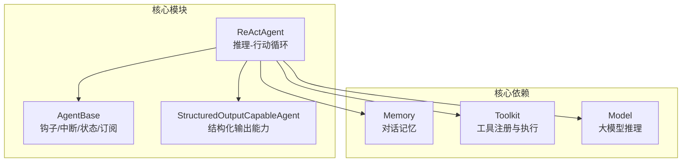
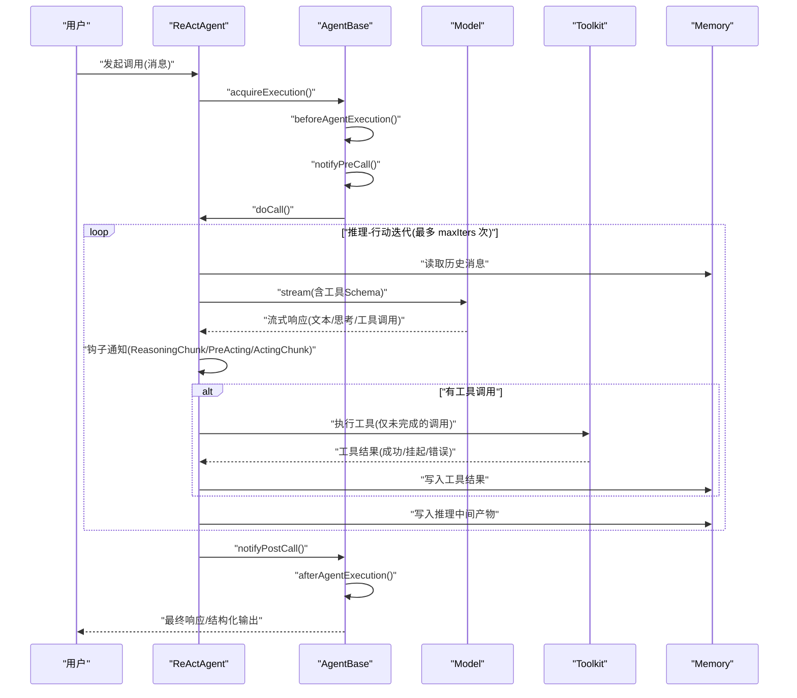
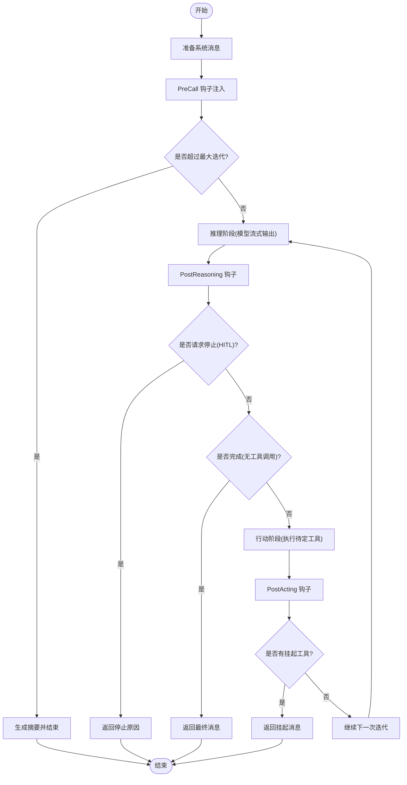
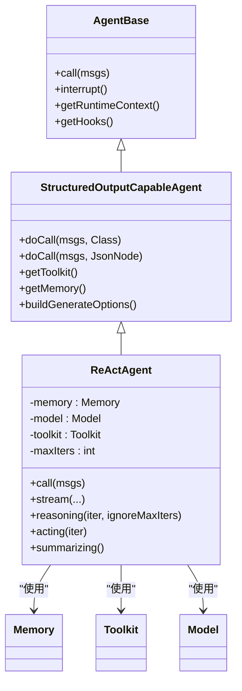

# ReAct 智能体概述

<cite>
**本文档引用的文件**
- [ReActAgent.java](file://agentscope-core/src/main/java/io/agentscope/core/ReActAgent.java)
- [AgentBase.java](file://agentscope-core/src/main/java/io/agentscope/core/agent/AgentBase.java)
- [StructuredOutputCapableAgent.java](file://agentscope-core/src/main/java/io/agentscope/core/agent/StructuredOutputCapableAgent.java)
- [RoutingByToolCallsExample.java](file://agentscope-examples/advanced/src/main/java/io/agentscope/examples/advanced/RoutingByToolCallsExample.java)
- [ReActAgentTest.java](file://agentscope-core/src/test/java/io/agentscope/core/agent/ReActAgentTest.java)
</cite>

## 目录
1. [引言](#引言)
2. [项目结构](#项目结构)
3. [核心组件](#核心组件)
4. [架构总览](#架构总览)
5. [详细组件分析](#详细组件分析)
6. [依赖关系分析](#依赖关系分析)
7. [性能考量](#性能考量)
8. [故障排查指南](#故障排查指南)
9. [结论](#结论)
10. [附录](#附录)

## 引言
本文件面向希望在 AgentScope 框架中使用 ReAct 智能体的开发者与产品人员，系统性介绍 ReAct 模式的理念、AgentScope 中 ReAct 智能体的设计与实现、整体架构与关键组件、生命周期与初始化流程、基础配置项、与其他核心组件（内存、工具、模型）的关系，并提供简洁的使用示例与最佳实践建议，同时给出性能与适用场景分析。

## 项目结构
ReAct 智能体位于 agentscope-core 模块中，采用分层与职责分离的设计：
- 核心智能体：ReActAgent 继承自支持结构化输出能力的抽象基类，组合内存、工具箱、模型等核心依赖。
- 基础框架：AgentBase 提供统一的钩子系统、中断机制、状态模块接口、消息广播等基础设施。
- 结构化输出：StructuredOutputCapableAgent 提供生成结构化输出的通用能力与工具注册逻辑。
- 示例与测试：examples 提供路由与工具调用示例；core/test 覆盖初始化、推理、工具调用、流式输出等关键路径。

图表来源
- [ReActAgent.java](file://agentscope-core/src/main/java/io/agentscope/core/ReActAgent.java)
- [AgentBase.java](file://agentscope-core/src/main/java/io/agentscope/core/agent/AgentBase.java)
- [StructuredOutputCapableAgent.java](file://agentscope-core/src/main/java/io/agentscope/core/agent/StructuredOutputCapableAgent.java)

章节来源
- [ReActAgent.java](file://agentscope-core/src/main/java/io/agentscope/core/ReActAgent.java)
- [AgentBase.java](file://agentscope-core/src/main/java/io/agentscope/core/agent/AgentBase.java)
- [StructuredOutputCapableAgent.java](file://agentscope-core/src/main/java/io/agentscope/core/agent/StructuredOutputCapableAgent.java)

## 核心组件
- ReActAgent：实现 ReAct 推理-行动迭代循环，负责与模型交互进行思考与计划，按需调用工具执行，并管理记忆、钩子、中断与会话状态持久化。
- AgentBase：提供统一的钩子通知链、运行时上下文绑定、中断检查点、错误处理与订阅广播等通用能力。
- StructuredOutputCapableAgent：为支持结构化输出的智能体提供工具注册、Schema 校验、结果提取与元数据合并等基础设施。
- Memory：存储对话历史，支持保存/加载到会话，参与 ReAct 循环输入构建。
- Toolkit：工具注册与执行入口，支持内部流式回调、挂起工具与错误结果生成。
- Model：大模型推理接口，支持流式输出与生成参数控制。

章节来源
- [ReActAgent.java](file://agentscope-core/src/main/java/io/agentscope/core/ReActAgent.java)
- [AgentBase.java](file://agentscope-core/src/main/java/io/agentscope/core/agent/AgentBase.java)
- [StructuredOutputCapableAgent.java](file://agentscope-core/src/main/java/io/agentscope/core/agent/StructuredOutputCapableAgent.java)

## 架构总览
ReAct 智能体以“推理-行动”双阶段循环为核心，结合钩子系统、中断机制与结构化输出能力，形成可扩展、可观测、可恢复的智能体架构。

图表来源
- [ReActAgent.java](file://agentscope-core/src/main/java/io/agentscope/core/ReActAgent.java)
- [AgentBase.java](file://agentscope-core/src/main/java/io/agentscope/core/agent/AgentBase.java)

## 详细组件分析

### ReActAgent 类与推理-行动循环
- 设计理念：ReAct 将“思考/规划”与“行动/执行”交替进行，直到任务完成或达到最大迭代次数。
- 关键特性：
  - 响应式流式执行：基于 Project Reactor，非阻塞地处理模型与工具调用。
  - 钩子系统：在推理、行动、摘要阶段提供细粒度事件钩子，支持人类在环(HITL)与可观测性。
  - 结构化输出：通过 StructuredOutputCapableAgent 能力，支持类型安全的结构化输出生成。
  - 中断与优雅停机：在关键检查点抛出中断异常，支持系统级与用户级中断策略。
- 生命周期：
  - 初始化：通过 Builder 注入名称、系统提示、模型、工具箱、内存、迭代上限等。
  - 运行：call()/stream() 触发，进入 AgentBase 的统一执行框架，随后进入 ReAct 循环。
  - 结束：完成条件满足、达到最大迭代、被中断或发生错误，最终返回响应或错误。

图表来源
- [ReActAgent.java](file://agentscope-core/src/main/java/io/agentscope/core/ReActAgent.java)

章节来源
- [ReActAgent.java](file://agentscope-core/src/main/java/io/agentscope/core/ReActAgent.java)

### AgentBase 基础设施
- 钩子系统：统一的事件通知链，支持 Pre/Post/Chunk 等多种事件类型，按优先级排序执行。
- 中断机制：在关键检查点检查中断标志，抛出 InterruptedException，由 AgentBase 统一捕获并调用 handleInterrupt。
- 运行时上下文：支持在单次调用期间绑定 RuntimeContext 到智能体与钩子，便于追踪与调试。
- 订阅与广播：支持多智能体协作场景的消息广播。

章节来源
- [AgentBase.java](file://agentscope-core/src/main/java/io/agentscope/core/agent/AgentBase.java)

### 结构化输出能力
- 工具注册：动态注册 generate_response 工具，用于最终生成结构化输出。
- Schema 校验：支持基于类或 JSON Schema 的结构化输出模式，确保结果符合预期。
- 元数据合并：将多次推理累积的用量与思考内容合并到最终消息中，便于审计与优化。

章节来源
- [StructuredOutputCapableAgent.java](file://agentscope-core/src/main/java/io/agentscope/core/agent/StructuredOutputCapableAgent.java)

### 内存、工具与模型集成
- 内存：作为消息存储与输入拼接的基础，支持保存/加载到会话，参与每次推理的上下文构建。
- 工具：仅对尚未有结果的工具调用进行执行，避免重复执行；支持挂起与错误结果生成，保证流程可恢复。
- 模型：统一的流式推理接口，支持在推理阶段注入工具 Schema，使模型具备工具调用能力。

章节来源
- [ReActAgent.java](file://agentscope-core/src/main/java/io/agentscope/core/ReActAgent.java)

## 依赖关系分析
ReActAgent 的核心依赖关系如下：

图表来源
- [AgentBase.java](file://agentscope-core/src/main/java/io/agentscope/core/agent/AgentBase.java)
- [StructuredOutputCapableAgent.java](file://agentscope-core/src/main/java/io/agentscope/core/agent/StructuredOutputCapableAgent.java)
- [ReActAgent.java](file://agentscope-core/src/main/java/io/agentscope/core/ReActAgent.java)

章节来源
- [ReActAgent.java](file://agentscope-core/src/main/java/io/agentscope/core/ReActAgent.java)
- [AgentBase.java](file://agentscope-core/src/main/java/io/agentscope/core/agent/AgentBase.java)
- [StructuredOutputCapableAgent.java](file://agentscope-core/src/main/java/io/agentscope/core/agent/StructuredOutputCapableAgent.java)

## 性能考量
- 流式处理：模型与工具均采用流式接口，降低首字节延迟，提升用户体验。
- 非阻塞执行：基于 Project Reactor 的 Mono/Flux 链式调用，充分利用异步并发能力。
- 最大迭代限制：通过 maxIters 控制推理-行动循环次数，避免长尾耗时与资源占用。
- 挂起工具处理：对挂起工具返回挂起消息，允许外部继续执行或人工介入，减少无效重试。
- 中断与优雅停机：在关键检查点响应中断，系统级中断可选择丢弃部分中间结果以快速退出。
- 生成参数与执行配置：通过 GenerateOptions 与 ExecutionConfig 精细化控制温度、采样策略与超时重试，平衡质量与性能。

## 故障排查指南
- 工具调用失败或超时：ReActAgent 会为所有待定工具生成错误结果，避免异常传播导致流程中断。若需要保留中断信号，请确保不吞掉 InterruptedException。
- 悬挂工具未处理：当存在挂起工具且未提供工具结果时，ReActAgent 会返回包含挂起工具与对应错误结果的消息，等待外部继续执行。
- 未提供工具结果却仍有待定调用：此时会抛出非法状态异常，提示启用 PendingToolRecoveryHook 或提供工具结果。
- 结构化输出异常：检查目标类/Schema 是否正确，确认 StructuredOutputHook 的提醒模式与模型能力匹配。
- 中断与恢复：若系统级中断触发，将根据策略决定是否保存中间结果；用户级中断会返回恢复消息，便于继续对话。

章节来源
- [ReActAgent.java](file://agentscope-core/src/main/java/io/agentscope/core/ReActAgent.java)

## 结论
ReAct 智能体在 AgentScope 中以清晰的职责划分与强大的基础设施支撑，实现了可观察、可扩展、可恢复的推理-行动闭环。通过与内存、工具与模型的深度集成，以及钩子系统与中断机制，它能够胜任复杂任务编排与人机协同场景。合理配置迭代上限、生成参数与执行配置，可在性能与效果之间取得良好平衡。

## 附录

### 使用示例与最佳实践
- 基本使用：参考示例中的路由与工具调用方式，构建 ReActAgent 并注册所需工具，调用 call() 获取响应。
- 结构化输出：通过 doCall(msgs, Class) 或 doCall(msgs, JsonNode) 启用结构化输出，自动注入生成工具与钩子。
- 钩子与可观测性：在推理、行动、摘要阶段添加钩子，记录中间结果与用量信息，便于审计与优化。
- 会话与状态：利用 saveTo()/loadFrom() 将智能体元数据、工具组与计划本状态持久化到会话，支持跨轮次恢复。
- 最佳实践：
  - 明确 maxIters，避免无限循环。
  - 合理设置 GenerateOptions 与 ExecutionConfig，关注成本与稳定性。
  - 对关键工具添加超时与重试策略，必要时启用 PendingToolRecoveryHook。
  - 在复杂场景中使用 PlanNotebook 与技能盒，提升任务组织与执行能力。

章节来源
- [RoutingByToolCallsExample.java](file://agentscope-examples/advanced/src/main/java/io/agentscope/examples/advanced/RoutingByToolCallsExample.java)
- [ReActAgentTest.java](file://agentscope-core/src/test/java/io/agentscope/core/agent/ReActAgentTest.java)