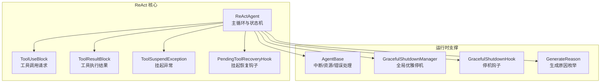
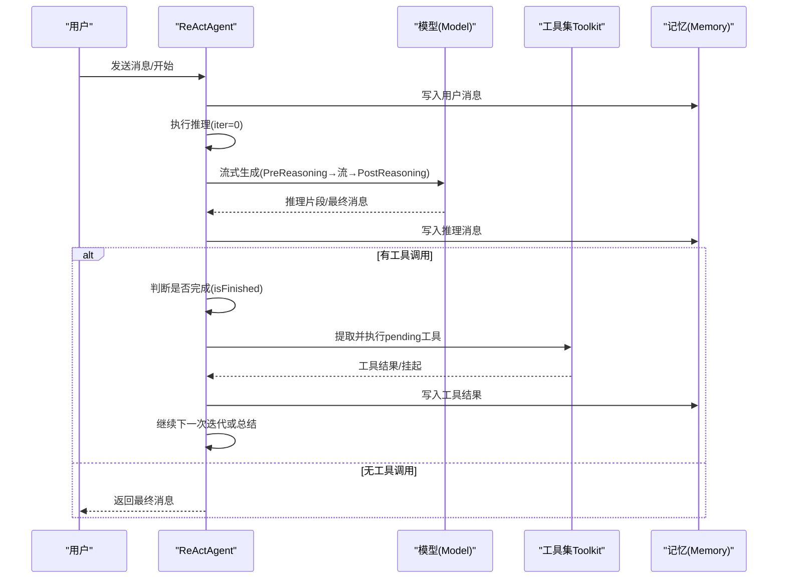
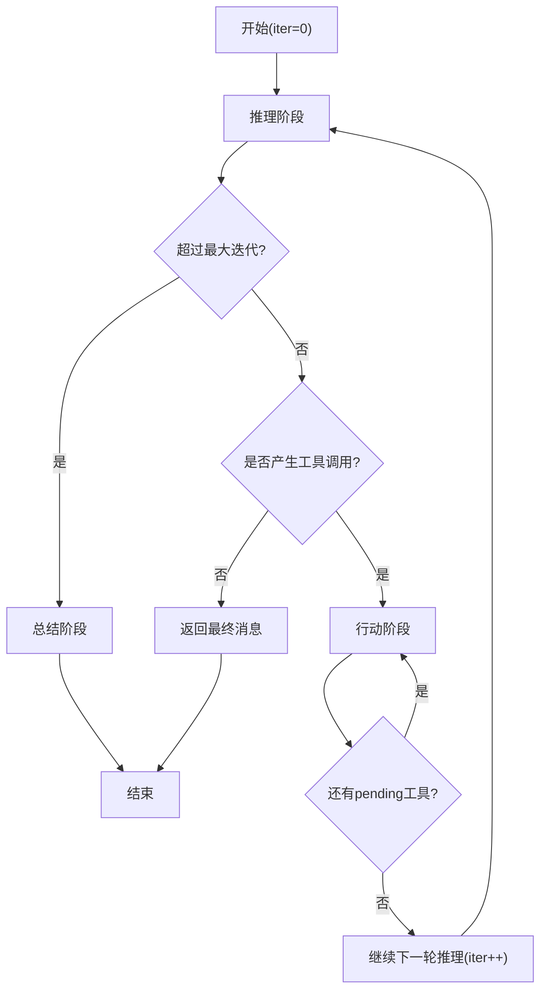
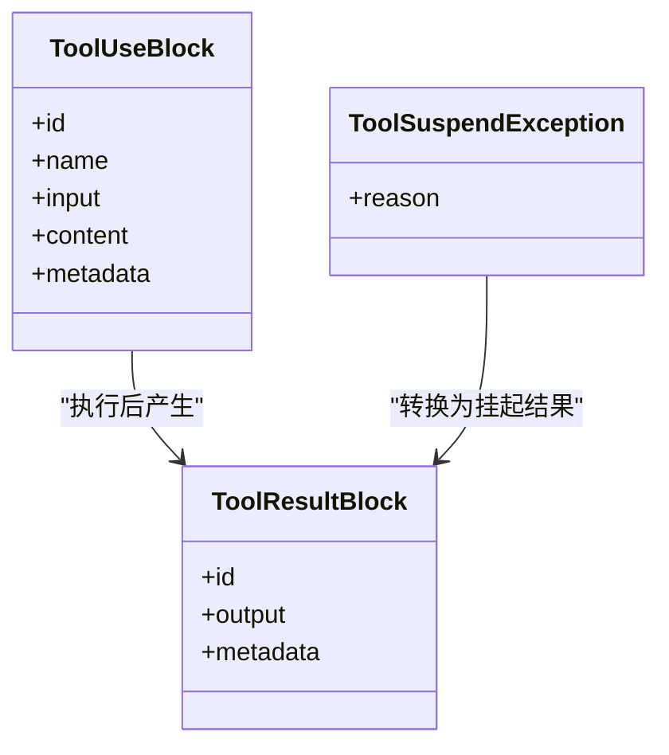
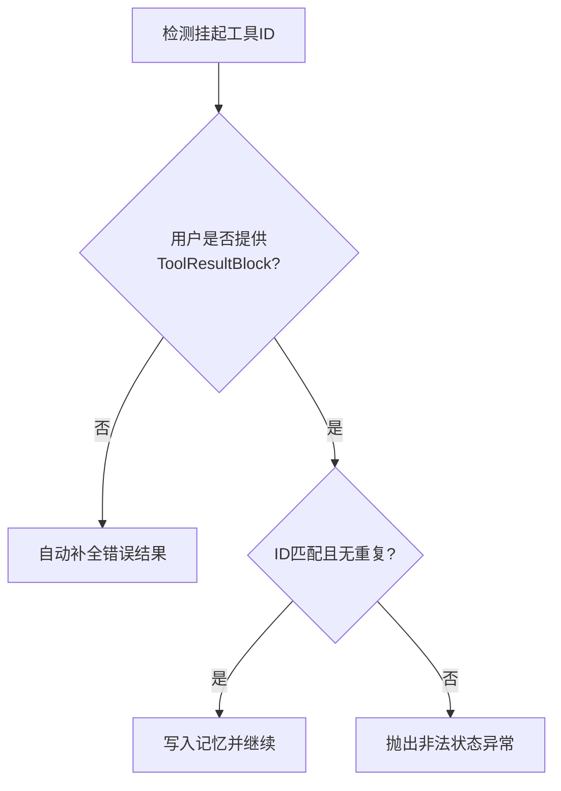
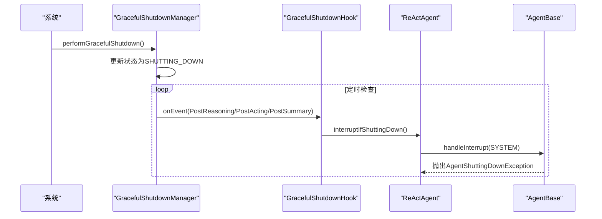
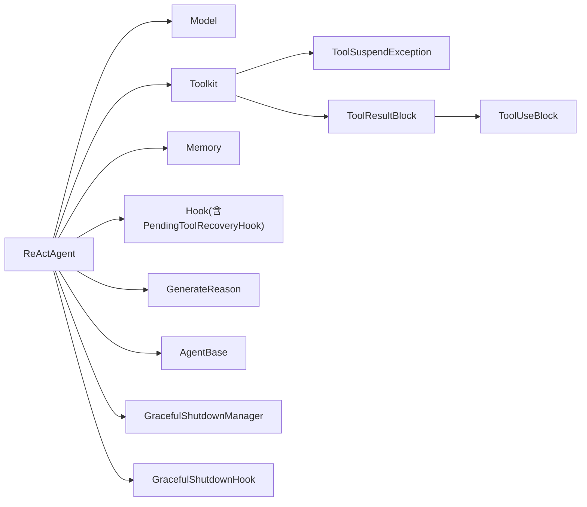

# 循环控制与状态管理

<cite>
**本文引用的文件**
- [ReActAgent.java](file://agentscope-core/src/main/java/io/agentscope/core/ReActAgent.java)
- [ToolUseBlock.java](file://agentscope-core/src/main/java/io/agentscope/core/message/ToolUseBlock.java)
- [ToolResultBlock.java](file://agentscope-core/src/main/java/io/agentscope/core/message/ToolResultBlock.java)
- [ToolSuspendException.java](file://agentscope-core/src/main/java/io/agentscope/core/tool/ToolSuspendException.java)
- [PendingToolRecoveryHook.java](file://agentscope-core/src/main/java/io/agentscope/core/hook/PendingToolRecoveryHook.java)
- [AgentBase.java](file://agentscope-core/src/main/java/io/agentscope/core/agent/AgentBase.java)
- [GracefulShutdownManager.java](file://agentscope-core/src/main/java/io/agentscope/core/shutdown/GracefulShutdownManager.java)
- [GracefulShutdownHook.java](file://agentscope-core/src/main/java/io/agentscope/core/shutdown/GracefulShutdownHook.java)
- [GenerateReason.java](file://agentscope-core/src/main/java/io/agentscope/core/message/GenerateReason.java)
- [ReActAgentTest.java](file://agentscope-core/src/test/java/io/agentscope/core/agent/ReActAgentTest.java)
</cite>

## 目录
1. [引言](#引言)
2. [项目结构](#项目结构)
3. [核心组件](#核心组件)
4. [架构总览](#架构总览)
5. [详细组件分析](#详细组件分析)
6. [依赖分析](#依赖分析)
7. [性能考虑](#性能考虑)
8. [故障排查指南](#故障排查指南)
9. [结论](#结论)
10. [附录：循环控制示例场景](#附录循环控制示例场景)

## 引言
本文件面向 ReAct 智能体的循环控制与状态管理，系统性阐述以下主题：
- 循环终止条件判断与迭代计数管理
- 状态转换逻辑与消息累积、上下文维护
- 工具调用状态跟踪（ToolUseBlock 与 ToolResultBlock 的配对与挂起状态）
- 中断处理策略、优雅退出机制与异常恢复流程
- 基于真实代码路径的状态机图与决策流程
- 实际场景示例：正常完成、手动停止、系统中断、异常终止等

## 项目结构
ReActAgent 位于 agentscope-core 模块的核心包中，围绕消息模型、工具执行、钩子系统与优雅停机管理构建。关键文件如下：
- ReActAgent：ReAct 主循环、状态机与消息流控制
- ToolUseBlock / ToolResultBlock：工具调用与结果的数据载体
- ToolSuspendException：工具外部执行挂起信号
- PendingToolRecoveryHook：自动修复挂起工具调用的钩子
- AgentBase：中断标志、错误处理与资源生命周期
- GracefulShutdownManager / GracefulShutdownHook：系统级优雅停机与请求中断
- GenerateReason：生成原因枚举，用于区分不同结束态

**图表来源**
- [ReActAgent.java:140-194](file://agentscope-core/src/main/java/io/agentscope/core/ReActAgent.java#L140-L194)
- [ToolUseBlock.java:34-97](file://agentscope-core/src/main/java/io/agentscope/core/message/ToolUseBlock.java#L34-L97)
- [ToolResultBlock.java:35-38](file://agentscope-core/src/main/java/io/agentscope/core/message/ToolResultBlock.java#L35-L38)
- [ToolSuspendException.java:40-69](file://agentscope-core/src/main/java/io/agentscope/core/tool/ToolSuspendException.java#L40-L69)
- [PendingToolRecoveryHook.java:58-76](file://agentscope-core/src/main/java/io/agentscope/core/hook/PendingToolRecoveryHook.java#L58-L76)
- [AgentBase.java:411-457](file://agentscope-core/src/main/java/io/agentscope/core/agent/AgentBase.java#L411-L457)
- [GracefulShutdownManager.java:41-75](file://agentscope-core/src/main/java/io/agentscope/core/shutdown/GracefulShutdownManager.java#L41-L75)
- [GracefulShutdownHook.java:64-81](file://agentscope-core/src/main/java/io/agentscope/core/shutdown/GracefulShutdownHook.java#L64-L81)
- [GenerateReason.java:36-61](file://agentscope-core/src/main/java/io/agentscope/core/message/GenerateReason.java#L36-L61)

**章节来源**
- [ReActAgent.java:140-194](file://agentscope-core/src/main/java/io/agentscope/core/ReActAgent.java#L140-L194)
- [ToolUseBlock.java:34-97](file://agentscope-core/src/main/java/io/agentscope/core/message/ToolUseBlock.java#L34-L97)
- [ToolResultBlock.java:35-38](file://agentscope-core/src/main/java/io/agentscope/core/message/ToolResultBlock.java#L35-L38)
- [ToolSuspendException.java:40-69](file://agentscope-core/src/main/java/io/agentscope/core/tool/ToolSuspendException.java#L40-L69)
- [PendingToolRecoveryHook.java:58-76](file://agentscope-core/src/main/java/io/agentscope/core/hook/PendingToolRecoveryHook.java#L58-L76)
- [AgentBase.java:411-457](file://agentscope-core/src/main/java/io/agentscope/core/agent/AgentBase.java#L411-L457)
- [GracefulShutdownManager.java:41-75](file://agentscope-core/src/main/java/io/agentscope/core/shutdown/GracefulShutdownManager.java#L41-L75)
- [GracefulShutdownHook.java:64-81](file://agentscope-core/src/main/java/io/agentscope/core/shutdown/GracefulShutdownHook.java#L64-L81)
- [GenerateReason.java:36-61](file://agentscope-core/src/main/java/io/agentscope/core/message/GenerateReason.java#L36-L61)

## 核心组件
- ReActAgent：实现 ReAct 迭代循环（推理-行动），负责：
  - 终止条件判断（最大迭代次数、是否产生工具调用）
  - 工具调用提取与去重（仅执行未完成的 pending 工具）
  - 工具结果与挂起状态处理（成功/挂起/失败）
  - 人类在回路（HITL）与结构化输出触发的跳转
  - 总结阶段（达到最大迭代后生成摘要）
- ToolUseBlock / ToolResultBlock：工具调用与结果的数据载体，支持挂起标记与元数据
- ToolSuspendException：工具抛出以表示需要外部执行的挂起信号
- PendingToolRecoveryHook：在用户未提供结果时自动补全错误结果，避免非法状态
- AgentBase：统一的中断标志、错误处理与资源生命周期管理
- GracefulShutdownManager / GracefulShutdownHook：系统停机时的请求中断与会话保存

**章节来源**
- [ReActAgent.java:546-731](file://agentscope-core/src/main/java/io/agentscope/core/ReActAgent.java#L546-L731)
- [ToolUseBlock.java:34-97](file://agentscope-core/src/main/java/io/agentscope/core/message/ToolUseBlock.java#L34-L97)
- [ToolResultBlock.java:35-38](file://agentscope-core/src/main/java/io/agentscope/core/message/ToolResultBlock.java#L35-L38)
- [ToolSuspendException.java:40-69](file://agentscope-core/src/main/java/io/agentscope/core/tool/ToolSuspendException.java#L40-L69)
- [PendingToolRecoveryHook.java:58-76](file://agentscope-core/src/main/java/io/agentscope/core/hook/PendingToolRecoveryHook.java#L58-L76)
- [AgentBase.java:411-457](file://agentscope-core/src/main/java/io/agentscope/core/agent/AgentBase.java#L411-L457)
- [GracefulShutdownManager.java:198-242](file://agentscope-core/src/main/java/io/agentscope/core/shutdown/GracefulShutdownManager.java#L198-L242)
- [GracefulShutdownHook.java:64-81](file://agentscope-core/src/main/java/io/agentscope/core/shutdown/GracefulShutdownHook.java#L64-L81)

## 架构总览
ReActAgent 将“推理-行动”两阶段以非阻塞方式串联，借助钩子系统与消息累积器实现可观察、可恢复的循环控制。

**图表来源**
- [ReActAgent.java:560-650](file://agentscope-core/src/main/java/io/agentscope/core/ReActAgent.java#L560-L650)
- [ReActAgent.java:669-731](file://agentscope-core/src/main/java/io/agentscope/core/ReActAgent.java#L669-L731)
- [ReActAgent.java:828-861](file://agentscope-core/src/main/java/io/agentscope/core/ReActAgent.java#L828-L861)

## 详细组件分析

### 1) 循环终止条件与迭代计数管理
- 最大迭代次数：推理阶段在超过 maxIters 时直接进入总结阶段
- 完成条件：若推理消息不含工具调用，则认为任务完成；否则进入行动阶段
- 结束原因：根据生成原因枚举区分不同结束态（如 MAX_ITERATIONS、MODEL_STOP、TOOL_SUSPENDED 等）

**图表来源**
- [ReActAgent.java:560-650](file://agentscope-core/src/main/java/io/agentscope/core/ReActAgent.java#L560-L650)
- [ReActAgent.java:947-958](file://agentscope-core/src/main/java/io/agentscope/core/ReActAgent.java#L947-L958)
- [GenerateReason.java:36-61](file://agentscope-core/src/main/java/io/agentscope/core/message/GenerateReason.java#L36-L61)

**章节来源**
- [ReActAgent.java:560-650](file://agentscope-core/src/main/java/io/agentscope/core/ReActAgent.java#L560-L650)
- [ReActAgent.java:947-958](file://agentscope-core/src/main/java/io/agentscope/core/ReActAgent.java#L947-L958)
- [GenerateReason.java:36-61](file://agentscope-core/src/main/java/io/agentscope/core/message/GenerateReason.java#L36-L61)

### 2) 工具调用状态跟踪与挂起管理
- 工具调用提取：从最近的助手消息中提取所有 ToolUseBlock，并过滤掉已有 ToolResultBlock 的 ID
- 工具执行：仅对 pending 工具进行执行，成功结果写入记忆，挂起结果由异常转换为 pending ToolResultBlock
- 挂起消息：当存在挂起工具时，构建包含 ToolUseBlock 与对应 pending ToolResultBlock 的消息，生成 TOOL_SUSPENDED

**图表来源**
- [ToolUseBlock.java:34-97](file://agentscope-core/src/main/java/io/agentscope/core/message/ToolUseBlock.java#L34-L97)
- [ToolResultBlock.java:35-38](file://agentscope-core/src/main/java/io/agentscope/core/message/ToolResultBlock.java#L35-L38)
- [ToolSuspendException.java:40-69](file://agentscope-core/src/main/java/io/agentscope/core/tool/ToolSuspendException.java#L40-L69)

**章节来源**
- [ReActAgent.java:977-987](file://agentscope-core/src/main/java/io/agentscope/core/ReActAgent.java#L977-L987)
- [ReActAgent.java:742-754](file://agentscope-core/src/main/java/io/agentscope/core/ReActAgent.java#L742-L754)
- [ToolSuspendException.java:40-69](file://agentscope-core/src/main/java/io/agentscope/core/tool/ToolSuspendException.java#L40-L69)

### 3) 工具结果验证与挂起恢复
- 用户输入校验：当存在挂起工具时，必须提供 ToolResultBlock；不允许部分结果+文本内容混杂
- 自动恢复：PendingToolRecoveryHook 在 PreCallEvent 阶段检测并为孤儿挂起工具生成错误结果，避免非法状态

**图表来源**
- [ReActAgent.java:478-531](file://agentscope-core/src/main/java/io/agentscope/core/ReActAgent.java#L478-L531)
- [PendingToolRecoveryHook.java:84-124](file://agentscope-core/src/main/java/io/agentscope/core/hook/PendingToolRecoveryHook.java#L84-L124)

**章节来源**
- [ReActAgent.java:478-531](file://agentscope-core/src/main/java/io/agentscope/core/ReActAgent.java#L478-L531)
- [PendingToolRecoveryHook.java:84-124](file://agentscope-core/src/main/java/io/agentscope/core/hook/PendingToolRecoveryHook.java#L84-L124)

### 4) 内存状态同步、消息累积与上下文维护
- 记忆写入：每次推理/行动阶段结束后，将中间消息写入记忆，保证历史可追溯
- 上下文累积：推理/摘要阶段使用 ReasoningContext 累积文本、思考与工具调用片段
- 系统消息：在每次模型调用前动态拼接当前系统消息，确保上下文一致性

**章节来源**
- [ReActAgent.java:615-617](file://agentscope-core/src/main/java/io/agentscope/core/ReActAgent.java#L615-L617)
- [ReActAgent.java:709-729](file://agentscope-core/src/main/java/io/agentscope/core/ReActAgent.java#L709-L729)
- [ReActAgent.java:867-877](file://agentscope-core/src/main/java/io/agentscope/core/ReActAgent.java#L867-L877)
- [ReActAgent.java:927-937](file://agentscope-core/src/main/java/io/agentscope/core/ReActAgent.java#L927-L937)

### 5) 中断处理策略与优雅退出
- 中断来源：USER（人工）、TOOL（工具）、SYSTEM（系统停机）
- 资源管理：AgentBase 在 call 生命周期内注册/注销请求，确保并发安全
- 优雅停机：GracefulShutdownManager 监控停机状态，必要时中断活动请求并保存会话

**图表来源**
- [GracefulShutdownManager.java:198-242](file://agentscope-core/src/main/java/io/agentscope/core/shutdown/GracefulShutdownManager.java#L198-L242)
- [GracefulShutdownHook.java:64-81](file://agentscope-core/src/main/java/io/agentscope/core/shutdown/GracefulShutdownHook.java#L64-L81)
- [AgentBase.java:449-457](file://agentscope-core/src/main/java/io/agentscope/core/agent/AgentBase.java#L449-L457)
- [ReActAgent.java:1136-1153](file://agentscope-core/src/main/java/io/agentscope/core/ReActAgent.java#L1136-L1153)

**章节来源**
- [AgentBase.java:411-457](file://agentscope-core/src/main/java/io/agentscope/core/agent/AgentBase.java#L411-L457)
- [GracefulShutdownManager.java:198-242](file://agentscope-core/src/main/java/io/agentscope/core/shutdown/GracefulShutdownManager.java#L198-L242)
- [GracefulShutdownHook.java:64-81](file://agentscope-core/src/main/java/io/agentscope/core/shutdown/GracefulShutdownHook.java#L64-L81)
- [ReActAgent.java:1136-1153](file://agentscope-core/src/main/java/io/agentscope/core/ReActAgent.java#L1136-L1153)

### 6) 异常恢复流程
- 工具执行异常：捕获 Exception（除致命错误外），为所有 pending 工具生成错误结果，保证循环继续
- 推理/摘要阶段中断：根据配置决定是否丢弃部分结果，其余写入记忆并抛出中断异常
- 错误消息：构造标准化错误 ToolResultBlock，便于后续处理与审计

**章节来源**
- [ReActAgent.java:774-803](file://agentscope-core/src/main/java/io/agentscope/core/ReActAgent.java#L774-L803)
- [ReActAgent.java:591-609](file://agentscope-core/src/main/java/io/agentscope/core/ReActAgent.java#L591-L609)
- [ReActAgent.java:897-917](file://agentscope-core/src/main/java/io/agentscope/core/ReActAgent.java#L897-L917)

## 依赖分析
ReActAgent 的内部耦合与外部依赖关系如下：

**图表来源**
- [ReActAgent.java:148-157](file://agentscope-core/src/main/java/io/agentscope/core/ReActAgent.java#L148-L157)
- [ToolSuspendException.java:40-69](file://agentscope-core/src/main/java/io/agentscope/core/tool/ToolSuspendException.java#L40-L69)
- [ToolResultBlock.java:35-38](file://agentscope-core/src/main/java/io/agentscope/core/message/ToolResultBlock.java#L35-L38)
- [ToolUseBlock.java:34-97](file://agentscope-core/src/main/java/io/agentscope/core/message/ToolUseBlock.java#L34-L97)
- [PendingToolRecoveryHook.java:58-76](file://agentscope-core/src/main/java/io/agentscope/core/hook/PendingToolRecoveryHook.java#L58-L76)
- [GracefulShutdownManager.java:41-75](file://agentscope-core/src/main/java/io/agentscope/core/shutdown/GracefulShutdownManager.java#L41-L75)
- [GracefulShutdownHook.java:64-81](file://agentscope-core/src/main/java/io/agentscope/core/shutdown/GracefulShutdownHook.java#L64-L81)

**章节来源**
- [ReActAgent.java:148-157](file://agentscope-core/src/main/java/io/agentscope/core/ReActAgent.java#L148-L157)
- [ToolSuspendException.java:40-69](file://agentscope-core/src/main/java/io/agentscope/core/tool/ToolSuspendException.java#L40-L69)
- [ToolResultBlock.java:35-38](file://agentscope-core/src/main/java/io/agentscope/core/message/ToolResultBlock.java#L35-L38)
- [ToolUseBlock.java:34-97](file://agentscope-core/src/main/java/io/agentscope/core/message/ToolUseBlock.java#L34-L97)
- [PendingToolRecoveryHook.java:58-76](file://agentscope-core/src/main/java/io/agentscope/core/hook/PendingToolRecoveryHook.java#L58-L76)
- [GracefulShutdownManager.java:41-75](file://agentscope-core/src/main/java/io/agentscope/core/shutdown/GracefulShutdownManager.java#L41-L75)
- [GracefulShutdownHook.java:64-81](file://agentscope-core/src/main/java/io/agentscope/core/shutdown/GracefulShutdownHook.java#L64-L81)

## 性能考虑
- 流式处理：推理与摘要阶段均采用流式累积，降低一次性内存占用
- 去重与幂等：pending 工具提取严格基于 ID 去重，避免重复执行
- 中断早停：在关键点检查中断，减少无效计算
- 会话绑定：优雅停机时保存会话，缩短恢复时间

[本节为通用指导，无需特定文件引用]

## 故障排查指南
- “存在挂起工具但未提供结果”：启用 PendingToolRecoveryHook 或显式提供 ToolResultBlock
- “部分工具结果+文本内容”：仅在全部工具完成后允许文本内容
- “工具执行失败”：框架自动生成错误结果，确保循环继续
- “系统停机导致中断”：遵循优雅停机流程，必要时丢弃部分推理或保留已写入的记忆

**章节来源**
- [ReActAgent.java:390-398](file://agentscope-core/src/main/java/io/agentscope/core/ReActAgent.java#L390-L398)
- [ReActAgent.java:478-531](file://agentscope-core/src/main/java/io/agentscope/core/ReActAgent.java#L478-L531)
- [ReActAgent.java:774-803](file://agentscope-core/src/main/java/io/agentscope/core/ReActAgent.java#L774-L803)
- [GracefulShutdownManager.java:198-242](file://agentscope-core/src/main/java/io/agentscope/core/shutdown/GracefulShutdownManager.java#L198-L242)

## 结论
ReActAgent 通过清晰的循环状态机、严格的工具调用配对与挂起管理、完善的中断与优雅停机机制，实现了高鲁棒性的智能体循环控制。结合消息累积与记忆同步，能够在复杂多轮交互中保持上下文一致与可观测性。

[本节为总结，无需特定文件引用]

## 附录：循环控制示例场景
- 正常完成：推理阶段无工具调用，直接返回 MODEL_STOP
- 手动停止：Hook 请求停止，返回 REASONING_STOP_REQUESTED 或 ACTING_STOP_REQUESTED
- 系统中断：SYSTEM 中断触发优雅停机，可能丢弃部分推理或保留记忆
- 异常终止：工具执行异常生成错误结果，循环继续；模型/摘要阶段中断抛出中断异常

**章节来源**
- [ReActAgentTest.java:460-498](file://agentscope-core/src/test/java/io/agentscope/core/agent/ReActAgentTest.java#L460-L498)
- [GenerateReason.java:36-61](file://agentscope-core/src/main/java/io/agentscope/core/message/GenerateReason.java#L36-L61)
- [ReActAgent.java:618-623](file://agentscope-core/src/main/java/io/agentscope/core/ReActAgent.java#L618-L623)
- [ReActAgent.java:1136-1153](file://agentscope-core/src/main/java/io/agentscope/core/ReActAgent.java#L1136-L1153)