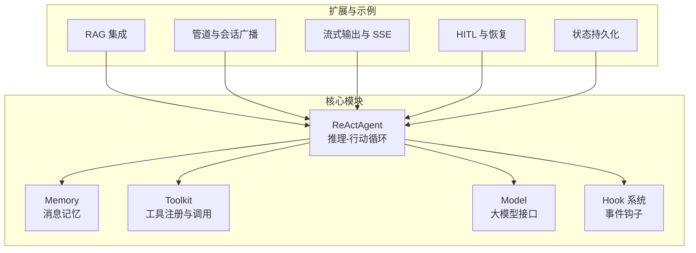
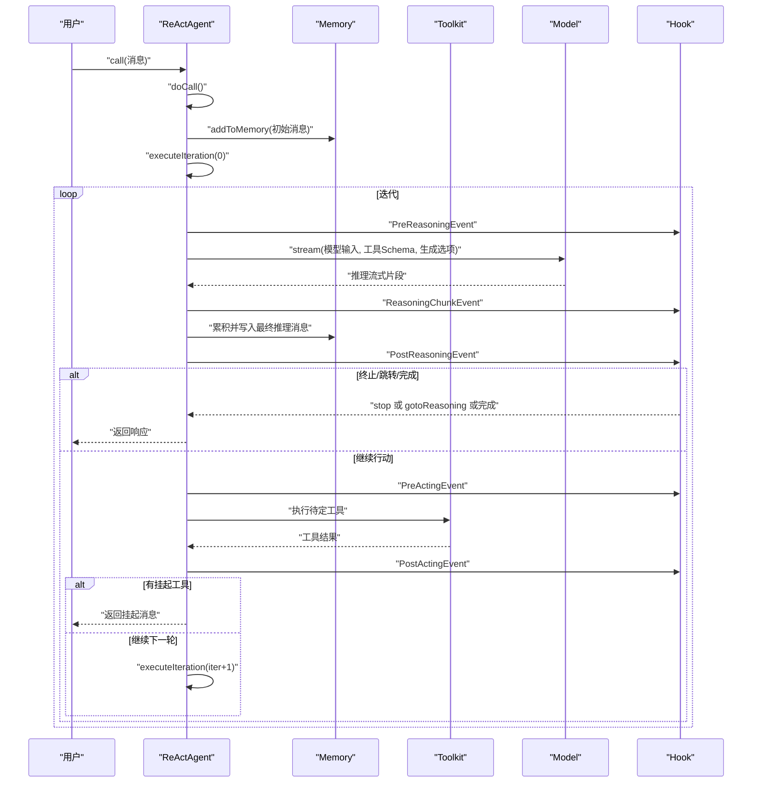
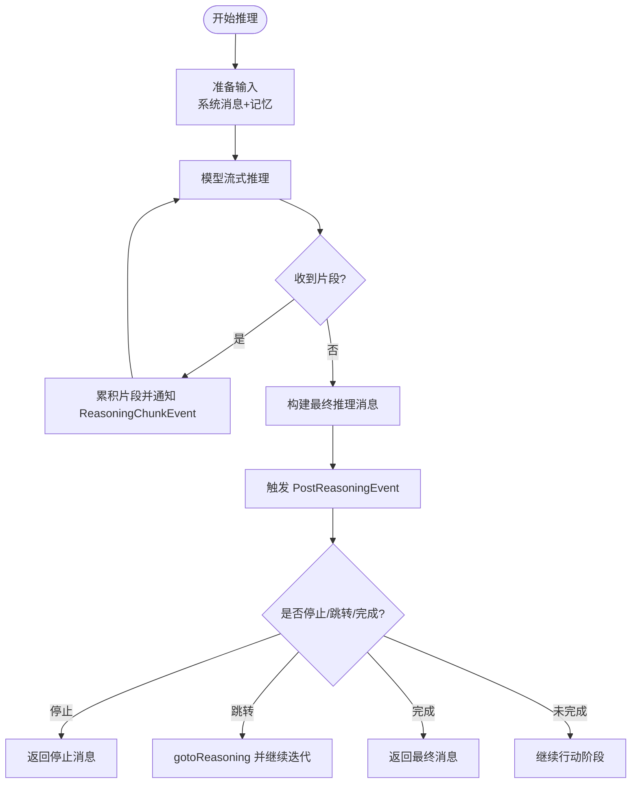
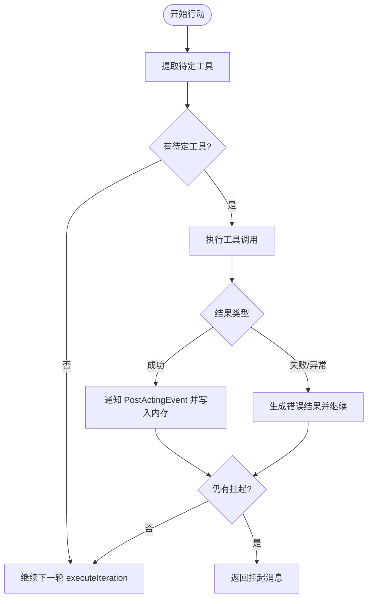
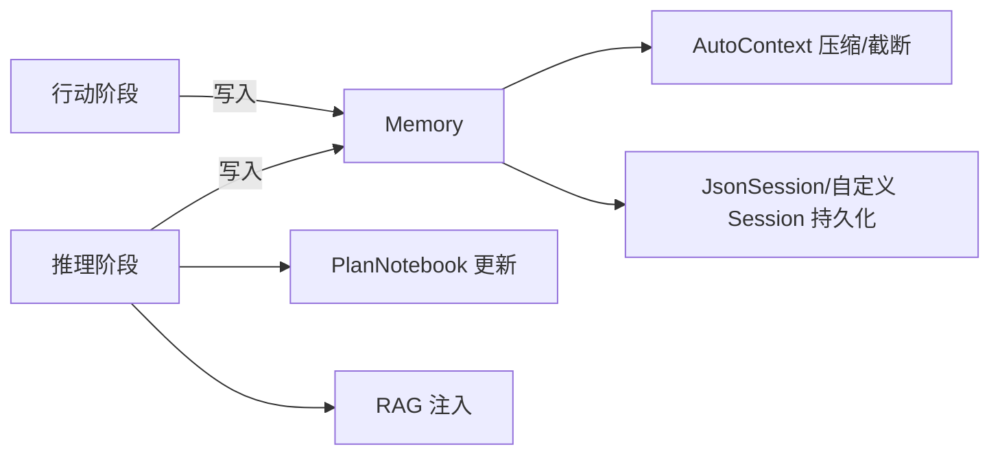
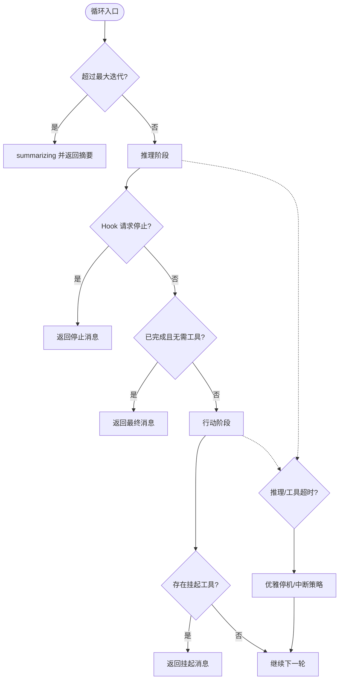
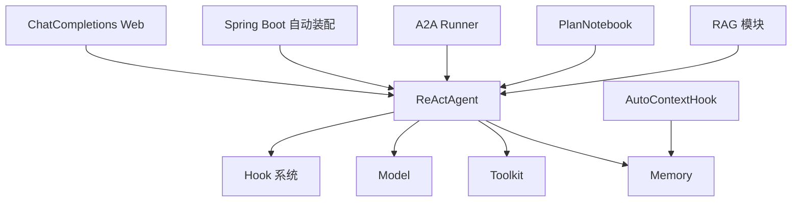

# 推理-行动循环

<cite>
**本文引用的文件**
- [ReActAgent.java](file://agentscope-core/src/main/java/io/agentscope/core/ReActAgent.java)
- [key-concepts.md](file://docs/en/quickstart/key-concepts.md)
- [ReActAgentTest.java](file://agentscope-core/src/test/java/io/agentscope/core/agent/ReActAgentTest.java)
- [HookStopAgentTest.java](file://agentscope-core/src/test/java/io/agentscope/core/hook/HookStopAgentTest.java)
- [ToolEmitterIntegrationTest.java](file://agentscope-core/src/test/java/io/agentscope/core/tool/ToolEmitterIntegrationTest.java)
- [ReActAgentRAGConfigTest.java](file://agentscope-core/src/test/java/io/agentscope/core/rag/ReActAgentRAGConfigTest.java)
- [PlanNotebookExample.java](file://agentscope-examples/quickstart/src/main/java/io/agentscope/examples/quickstart/PlanNotebookExample.java)
- [StreamingWebExample.java](file://agentscope-examples/quickstart/src/main/java/io/agentscope/examples/quickstart/StreamingWebExample.java)
- [StructuredOutputExample.java](file://agentscope-examples/quickstart/src/main/java/io/agentscope/examples/quickstart/StructuredOutputExample.java)
- [ReActAgentSystemMsgTest.java](file://agentscope-core/src/test/java/io/agentscope/core/hook/ReActAgentSystemMsgTest.java)
- [AutoContextHook.java](file://agentscope-extensions/agentscope-extensions-autocontext-memory/src/main/java/io/agentscope/core/memory/autocontext/AutoContextHook.java)
- [PendingToolRecoveryHook.java](file://agentscope-core/src/main/java/io/agentscope/core/hook/PendingToolRecoveryHook.java)
- [ReActAgentSummarizingTest.java](file://agentscope-core/src/test/java/io/agentscope/core/agent/ReActAgentSummarizingTest.java)
- [ReActAgentTimeoutTest.java](file://agentscope-core/src/test/java/io/agentscope/core/agent/ReActAgentTimeoutTest.java)
- [ReActAgentGenerateOptionsTest.java](file://agentscope-core/src/test/java/io/agentscope/core/agent/ReActAgentGenerateOptionsTest.java)
- [ReActAgentStateTest.java](file://agentscope-core/src/test/java/io/agentscope/core/agent/ReActAgentStateTest.java)
- [GracefulShutdownExample.java](file://agentscope-examples/graceful-shutdown/src/main/java/io/agentscope/examples/shutdown/smoke/GracefulShutdownExample.java)
- [MsgHubIntegrationTest.java](file://agentscope-core/src/test/java/io/agentscope/core/pipeline/MsgHubIntegrationTest.java)
- [PipelineE2ETest.java](file://agentscope-core/src/test/java/io/agentscope/core/e2e/PipelineE2ETest.java)
- [AgentService.java](file://agentscope-examples/hitl-chat/src/main/java/io/agentscope/examples/hitlchat/service/AgentService.java)
- [ChatCompletionsStreamingService.java](file://agentscope-extensions/agentscope-extensions-chat-completions-web/src/main/java/io/agentscope/core/chat/completions/streaming/ChatCompletionsStreamingService.java)
- [ChatCompletionsController.java](file://agentscope-extensions/agentscope-extensions-chat-completions-web/src/main/java/io/agentscope/spring/boot/chat/web/ChatCompletionsController.java)
- [AgentscopeAutoConfiguration.java](file://agentscope-extensions/agentscope-spring-boot-starters/agentscope-spring-boot-starter/src/main/java/io/agentscope/spring/boot/AgentscopeAutoConfiguration.java)
- [AgentscopeNacosReActAgentAutoConfiguration.java](file://agentscope-extensions/agentscope-spring-boot-starters/agentscope-nacos-spring-boot-starter/src/main/java/io/agentscope/spring/boot/nacos/AgentscopeNacosReActAgentAutoConfiguration.java)
- [ReActAgentWithBuilderRunner.java](file://agentscope-extensions/agentscope-extensions-a2a/agentscope-extensions-a2a-server/src/main/java/io/agentscope/core/a2a/server/executor/runner/ReActAgentWithBuilderRunner.java)
- [BaseReActAgentRunner.java](file://agentscope-extensions/agentscope-extensions-a2a/agentscope-extensions-a2a-server/src/main/java/io/agentscope/core/a2a/server/executor/runner/BaseReActAgentRunner.java)
- [ReActAgentStructuredOutputTest.java](file://agentscope-core/src/test/java/io/agentscope/core/agent/ReActAgentStructuredOutputTest.java)
- [ReActAgentThinkingCumulativeTest.java](file://agentscope-core/src/test/java/io/agentscope/core/agent/ReActAgentThinkingCumulativeTest.java)
- [ReActAgentLongTermMemoryConfigTest.java](file://agentscope-core/src/test/java/io/agentscope/core/agent/ReActAgentLongTermMemoryConfigTest.java)
- [ReActAgentRuntimeContextTest.java](file://agentscope-core/src/test/java/io/agentscope/core/agent/ReActAgentRuntimeContextTest.java)
- [ReActAgentPlanIntegrationTest.java](file://agentscope-core/src/test/java/io/agentscope/core/agent/ReActAgentPlanIntegrationTest.java)
- [ReActAgentStateTest.java](file://agentscope-core/src/test/java/io/agentscope/core/agent/ReActAgentStateTest.java)
- [ReActAgentSummarizingTest.java](file://agentscope-core/src/test/java/io/agentscope/core/agent/ReActAgentSummarizingTest.java)
- [ReActAgentTimeoutTest.java](file://agentscope-core/src/test/java/io/agentscope/core/agent/ReActAgentTimeoutTest.java)
- [ReActAgentGenerateOptionsTest.java](file://agentscope-core/src/test/java/io/agentscope/core/agent/ReActAgentGenerateOptionsTest.java)
- [ReActAgentSystemMsgTest.java](file://agentscope-core/src/test/java/io/agentscope/core/hook/ReActAgentSystemMsgTest.java)
- [ToolEmitterIntegrationTest.java](file://agentscope-core/src/test/java/io/agentscope/core/tool/ToolEmitterIntegrationTest.java)
- [HookStopAgentTest.java](file://agentscope-core/src/test/java/io/agentscope/core/hook/HookStopAgentTest.java)
- [ReActAgentRAGConfigTest.java](file://agentscope-core/src/test/java/io/agentscope/core/rag/ReActAgentRAGConfigTest.java)
- [PlanNotebookExample.java](file://agentscope-examples/quickstart/src/main/java/io/agentscope/examples/quickstart/PlanNotebookExample.java)
- [StreamingWebExample.java](file://agentscope-examples/quickstart/src/main/java/io/agentscope/examples/quickstart/StreamingWebExample.java)
- [StructuredOutputExample.java](file://agentscope-examples/quickstart/src/main/java/io/agentscope/examples/quickstart/StructuredOutputExample.java)
- [AutoContextHook.java](file://agentscope-extensions/agentscope-extensions-autocontext-memory/src/main/java/io/agentscope/core/memory/autocontext/AutoContextHook.java)
- [PendingToolRecoveryHook.java](file://agentscope-core/src/main/java/io/agentscope/core/hook/PendingToolRecoveryHook.java)
- [GracefulShutdownExample.java](file://agentscope-examples/graceful-shutdown/src/main/java/io/agentscope/examples/shutdown/smoke/GracefulShutdownExample.java)
- [MsgHubIntegrationTest.java](file://agentscope-core/src/test/java/io/agentscope/core/pipeline/MsgHubIntegrationTest.java)
- [PipelineE2ETest.java](file://agentscope-core/src/test/java/io/agentscope/core/e2e/PipelineE2ETest.java)
- [AgentService.java](file://agentscope-examples/hitl-chat/src/main/java/io/agentscope/examples/hitlchat/service/AgentService.java)
- [ChatCompletionsStreamingService.java](file://agentscope-extensions/agentscope-extensions-chat-completions-web/src/main/java/io/agentscope/core/chat/completions/streaming/ChatCompletionsStreamingService.java)
- [ChatCompletionsController.java](file://agentscope-extensions/agentscope-extensions-chat-completions-web/src/main/java/io/agentscope/spring/boot/chat/web/ChatCompletionsController.java)
- [AgentscopeAutoConfiguration.java](file://agentscope-extensions/agentscope-spring-boot-starters/agentscope-spring-boot-starter/src/main/java/io/agentscope/spring/boot/AgentscopeAutoConfiguration.java)
- [AgentscopeNacosReActAgentAutoConfiguration.java](file://agentscope-extensions/agentscope-spring-boot-starters/agentscope-nacos-spring-boot-starter/src/main/java/io/agentscope/spring/boot/nacos/AgentscopeNacosReActAgentAutoConfiguration.java)
- [ReActAgentWithBuilderRunner.java](file://agentscope-extensions/agentscope-extensions-a2a/agentscope-extensions-a2a-server/src/main/java/io/agentscope/core/a2a/server/executor/runner/ReActAgentWithBuilderRunner.java)
- [BaseReActAgentRunner.java](file://agentscope-extensions/agentscope-extensions-a2a/agentscope-extensions-a2a-server/src/main/java/io/agentscope/core/a2a/server/executor/runner/BaseReActAgentRunner.java)
</cite>

## 目录
1. [引言](#引言)
2. [项目结构](#项目结构)
3. [核心组件](#核心组件)
4. [架构总览](#架构总览)
5. [详细组件分析](#详细组件分析)
6. [依赖分析](#依赖分析)
7. [性能考虑](#性能考虑)
8. [故障排查指南](#故障排查指南)
9. [结论](#结论)
10. [附录](#附录)

## 引言
本文件围绕 ReAct 推理-行动循环进行深入技术解析，系统阐述循环工作机制、状态转换与数据流，详解推理阶段与行动阶段的实现细节，明确循环终止条件与异常处理策略，并提供性能优化建议与调试技巧。文档同时给出关键流程的可视化图示与真实代码示例路径，帮助读者快速掌握 ReActAgent 的内部运行逻辑。

## 项目结构
ReActAgent 位于 agentscope-core 模块中，是 AgentScope 的核心智能体实现，负责在“推理（Reasoning）—行动（Acting）”之间迭代执行，结合内存、工具箱、模型与钩子系统完成复杂任务。其上层示例与集成测试覆盖了多模态、RAG、会话持久化、流式输出、HITL（人机交互）等场景。

图表来源
- [ReActAgent.java:140-1903](file://agentscope-core/src/main/java/io/agentscope/core/ReActAgent.java#L140-L1903)
- [key-concepts.md:7-56](file://docs/en/quickstart/key-concepts.md#L7-L56)

章节来源
- [ReActAgent.java:140-1903](file://agentscope-core/src/main/java/io/agentscope/core/ReActAgent.java#L140-L1903)
- [key-concepts.md:7-56](file://docs/en/quickstart/key-concepts.md#L7-L56)

## 核心组件
- ReActAgent：循环主体，封装推理与行动两阶段，管理最大迭代次数、中断与恢复、结构化输出、RAG、计划书等能力。
- Memory：消息历史与上下文存储，支持增量保存与压缩。
- Toolkit：工具注册中心，统一调度工具调用与结果转换。
- Model：大模型抽象，支持流式与非流式推理。
- Hook：事件钩子系统，贯穿 call 生命周期，支持停止、继续、修改输入/输出、记录等。
- RAG：知识检索与注入，支持多种模式（GENERIC/AGENTIC/NONE）。
- PlanNotebook：计划书，用于多步任务的创建、执行与跟踪。
- 流式与 SSE：通过 stream API 输出事件流，适配 Web 前端。
- 会话与状态持久化：支持跨请求恢复与保存 agent 元数据、内存、工具组、计划书等。

章节来源
- [ReActAgent.java:140-1903](file://agentscope-core/src/main/java/io/agentscope/core/ReActAgent.java#L140-L1903)
- [ReActAgentRAGConfigTest.java:109-201](file://agentscope-core/src/test/java/io/agentscope/core/rag/ReActAgentRAGConfigTest.java#L109-L201)
- [PlanNotebookExample.java:146-229](file://agentscope-examples/quickstart/src/main/java/io/agentscope/examples/quickstart/PlanNotebookExample.java#L146-L229)
- [StreamingWebExample.java:91-136](file://agentscope-examples/quickstart/src/main/java/io/agentscope/examples/quickstart/StreamingWebExample.java#L91-L136)
- [ReActAgentStateTest.java:68-165](file://agentscope-core/src/test/java/io/agentscope/core/agent/ReActAgentStateTest.java#L68-L165)

## 架构总览
ReActAgent 的核心控制流由 doCall 触发，进入 executeIteration 后交替执行 reasoning 与 acting，直至满足终止条件或被中断。中间穿插 Hook 事件、工具调用、内存更新与流式事件通知。

图表来源
- [ReActAgent.java:364-730](file://agentscope-core/src/main/java/io/agentscope/core/ReActAgent.java#L364-L730)

章节来源
- [ReActAgent.java:364-730](file://agentscope-core/src/main/java/io/agentscope/core/ReActAgent.java#L364-L730)

## 详细组件分析

### 推理阶段（reasoning）
- 输入准备：合并系统消息与当前记忆，构建模型输入；根据 Hook 调整生成选项。
- 流式推理：调用 model.stream 获取 Thinking/文本/工具调用等片段，逐段累积。
- 钩子事件：每段推理触发 ReasoningChunkEvent；推理结束触发 PostReasoningEvent。
- 终止判定：
  - 达到最大迭代次数：进入 summarizing。
  - Hook 请求停止：返回带特定 GenerateReason 的消息。
  - 结构化输出钩子请求 gotoReasoning：可重定向至新的推理输入。
  - 模型输出完成且无需工具调用：直接返回最终消息。

图表来源
- [ReActAgent.java:560-650](file://agentscope-core/src/main/java/io/agentscope/core/ReActAgent.java#L560-L650)

章节来源
- [ReActAgent.java:560-650](file://agentscope-core/src/main/java/io/agentscope/core/ReActAgent.java#L560-L650)
- [ReActAgentGenerateOptionsTest.java:128-165](file://agentscope-core/src/test/java/io/agentscope/core/agent/ReActAgentGenerateOptionsTest.java#L128-L165)
- [ReActAgentThinkingCumulativeTest.java:63-117](file://agentscope-core/src/test/java/io/agentscope/core/agent/ReActAgentThinkingCumulativeTest.java#L63-L117)

### 行动阶段（acting）
- 提取待定工具：仅对尚未有结果的消息进行执行。
- 工具执行：通过 Toolkit 执行工具调用，捕获异常并生成错误结果以保证循环继续。
- 结果处理：成功结果经 PostActingEvent 钩子处理后写入内存；若存在挂起工具则返回挂起消息。
- 继续条件：无成功结果但有挂起结果时返回挂起消息；否则继续下一轮推理。

图表来源
- [ReActAgent.java:669-730](file://agentscope-core/src/main/java/io/agentscope/core/ReActAgent.java#L669-L730)
- [ToolEmitterIntegrationTest.java:273-319](file://agentscope-core/src/test/java/io/agentscope/core/tool/ToolEmitterIntegrationTest.java#L273-L319)

章节来源
- [ReActAgent.java:669-730](file://agentscope-core/src/main/java/io/agentscope/core/ReActAgent.java#L669-L730)
- [ToolEmitterIntegrationTest.java:273-319](file://agentscope-core/src/test/java/io/agentscope/core/tool/ToolEmitterIntegrationTest.java#L273-L319)

### 状态管理与数据流转
- 内存：每次推理/行动后将消息写入 Memory，支持压缩与增量保存。
- 计划书：可选的 PlanNotebook 用于多步任务的创建与执行。
- RAG：根据配置自动注入检索工具或知识库内容。
- 会话：支持 saveTo/loadFrom 将 agent 元数据、内存、工具组、计划书持久化。

图表来源
- [ReActAgent.java:300-360](file://agentscope-core/src/main/java/io/agentscope/core/ReActAgent.java#L300-L360)
- [AutoContextHook.java:214-284](file://agentscope-extensions/agentscope-extensions-autocontext-memory/src/main/java/io/agentscope/core/memory/autocontext/AutoContextHook.java#L214-L284)
- [ReActAgentStateTest.java:109-165](file://agentscope-core/src/test/java/io/agentscope/core/agent/ReActAgentStateTest.java#L109-L165)

章节来源
- [ReActAgent.java:300-360](file://agentscope-core/src/main/java/io/agentscope/core/ReActAgent.java#L300-L360)
- [AutoContextHook.java:214-284](file://agentscope-extensions/agentscope-extensions-autocontext-memory/src/main/java/io/agentscope/core/memory/autocontext/AutoContextHook.java#L214-L284)
- [ReActAgentStateTest.java:109-165](file://agentscope-core/src/test/java/io/agentscope/core/agent/ReActAgentStateTest.java#L109-L165)

### 终止条件与异常处理
- 终止条件
  - 最大迭代次数达到：进入 summarizing 并返回摘要消息。
  - Hook 请求停止：返回带特定 GenerateReason 的消息。
  - 结构化输出钩子请求 gotoReasoning：重定向至新输入继续推理。
  - 模型输出完成且无需工具调用：直接返回最终消息。
- 异常处理
  - 工具执行异常：捕获并生成错误结果，避免中断循环。
  - 中断信号：区分手动中断与系统中断，按策略决定是否保留部分推理结果。
  - 超时：工具执行超时或推理超时，结合执行配置与优雅停机策略处理。

图表来源
- [ReActAgent.java:560-730](file://agentscope-core/src/main/java/io/agentscope/core/ReActAgent.java#L560-L730)
- [ReActAgentTimeoutTest.java:54-126](file://agentscope-core/src/test/java/io/agentscope/core/agent/ReActAgentTimeoutTest.java#L54-L126)
- [GracefulShutdownExample.java:118-192](file://agentscope-examples/graceful-shutdown/src/main/java/io/agentscope/examples/shutdown/smoke/GracefulShutdownExample.java#L118-L192)

章节来源
- [ReActAgent.java:560-730](file://agentscope-core/src/main/java/io/agentscope/core/ReActAgent.java#L560-L730)
- [ReActAgentTimeoutTest.java:54-126](file://agentscope-core/src/test/java/io/agentscope/core/agent/ReActAgentTimeoutTest.java#L54-L126)
- [GracefulShutdownExample.java:118-192](file://agentscope-examples/graceful-shutdown/src/main/java/io/agentscope/examples/shutdown/smoke/GracefulShutdownExample.java#L118-L192)

### 循环不同执行路径示例
- 多轮对话与工具调用：参考工具系统端到端测试与多轮对话示例。
- 结构化输出：通过结构化输出钩子在推理完成后生成结构化结果。
- RAG 模式：GENERIC/AGENTIC/NONE 三种模式的配置与行为验证。
- 流式输出：通过 stream API 输出事件流，前端以 SSE 接收。

章节来源
- [ToolEmitterIntegrationTest.java:273-319](file://agentscope-core/src/test/java/io/agentscope/core/tool/ToolEmitterIntegrationTest.java#L273-L319)
- [StructuredOutputExample.java:123-154](file://agentscope-examples/quickstart/src/main/java/io/agentscope/examples/quickstart/StructuredOutputExample.java#L123-L154)
- [ReActAgentRAGConfigTest.java:109-201](file://agentscope-core/src/test/java/io/agentscope/core/rag/ReActAgentRAGConfigTest.java#L109-L201)
- [StreamingWebExample.java:91-136](file://agentscope-examples/quickstart/src/main/java/io/agentscope/examples/quickstart/StreamingWebExample.java#L91-L136)

## 依赖分析
ReActAgent 依赖于 Memory、Toolkit、Model、Hook 等核心组件，并通过多种扩展实现增强能力（RAG、计划书、自动上下文压缩、A2A 运行器、Spring Boot 自动装配等）。下图展示关键依赖关系：

图表来源
- [ReActAgent.java:140-1903](file://agentscope-core/src/main/java/io/agentscope/core/ReActAgent.java#L140-L1903)
- [AutoContextHook.java:214-284](file://agentscope-extensions/agentscope-extensions-autocontext-memory/src/main/java/io/agentscope/core/memory/autocontext/AutoContextHook.java#L214-L284)
- [AgentscopeAutoConfiguration.java:195-210](file://agentscope-extensions/agentscope-spring-boot-starters/agentscope-spring-boot-starter/src/main/java/io/agentscope/spring/boot/AgentscopeAutoConfiguration.java#L195-L210)
- [AgentscopeNacosReActAgentAutoConfiguration.java:64-107](file://agentscope-extensions/agentscope-spring-boot-starters/agentscope-nacos-spring-boot-starter/src/main/java/io/agentscope/spring/boot/nacos/AgentscopeNacosReActAgentAutoConfiguration.java#L64-L107)
- [BaseReActAgentRunner.java:51-61](file://agentscope-extensions/agentscope-extensions-a2a/agentscope-extensions-a2a-server/src/main/java/io/agentscope/core/a2a/server/executor/runner/BaseReActAgentRunner.java#L51-L61)
- [ChatCompletionsController.java:123-202](file://agentscope-extensions/agentscope-extensions-chat-completions-web/src/main/java/io/agentscope/spring/boot/chat/web/ChatCompletionsController.java#L123-L202)

章节来源
- [ReActAgent.java:140-1903](file://agentscope-core/src/main/java/io/agentscope/core/ReActAgent.java#L140-L1903)
- [AutoContextHook.java:214-284](file://agentscope-extensions/agentscope-extensions-autocontext-memory/src/main/java/io/agentscope/core/memory/autocontext/AutoContextHook.java#L214-L284)
- [AgentscopeAutoConfiguration.java:195-210](file://agentscope-extensions/agentscope-spring-boot-starters/agentscope-spring-boot-starter/src/main/java/io/agentscope/spring/boot/AgentscopeAutoConfiguration.java#L195-L210)
- [AgentscopeNacosReActAgentAutoConfiguration.java:64-107](file://agentscope-extensions/agentscope-spring-boot-starters/agentscope-nacos-spring-boot-starter/src/main/java/io/agentscope/spring/boot/nacos/AgentscopeNacosReActAgentAutoConfiguration.java#L64-L107)
- [BaseReActAgentRunner.java:51-61](file://agentscope-extensions/agentscope-extensions-a2a/agentscope-extensions-a2a-server/src/main/java/io/agentscope/core/a2a/server/executor/runner/BaseReActAgentRunner.java#L51-L61)
- [ChatCompletionsController.java:123-202](file://agentscope-extensions/agentscope-extensions-chat-completions-web/src/main/java/io/agentscope/spring/boot/chat/web/ChatCompletionsController.java#L123-L202)

## 性能考虑
- 流式推理与工具调用：优先使用流式接口，降低首字节延迟，提升用户体验。
- 内存压缩：启用 AutoContextHook 在推理前压缩历史，减少上下文长度与 token 消耗。
- 工具执行超时：合理设置工具执行配置，避免长时间阻塞导致资源浪费。
- 并发与调度：在流水线场景中使用并发执行与自定义调度器，提高吞吐量。
- 结构化输出：在需要时启用结构化输出钩子，减少无效重试与重复推理。

章节来源
- [ReActAgentThinkingCumulativeTest.java:119-168](file://agentscope-core/src/test/java/io/agentscope/core/agent/ReActAgentThinkingCumulativeTest.java#L119-L168)
- [AutoContextHook.java:214-284](file://agentscope-extensions/agentscope-extensions-autocontext-memory/src/main/java/io/agentscope/core/memory/autocontext/AutoContextHook.java#L214-L284)
- [ReActAgentTimeoutTest.java:54-126](file://agentscope-core/src/test/java/io/agentscope/core/agent/ReActAgentTimeoutTest.java#L54-L126)
- [PipelineE2ETest.java:144-192](file://agentscope-core/src/test/java/io/agentscope/core/e2e/PipelineE2ETest.java#L144-L192)

## 故障排查指南
- 循环卡住或无限循环
  - 检查最大迭代次数配置与是否被 Hook 请求停止。
  - 参考测试用例验证 maxIters 生效与模型调用次数上限。
- 工具执行异常
  - 工具异常会被捕获并生成错误结果，确保循环继续；检查工具参数与权限。
- 挂起工具无法继续
  - 确认是否提供 ToolResultBlock；必要时启用 PendingToolRecoveryHook。
- 中断与恢复
  - 使用 interrupt() 触发中断；结合优雅停机策略与会话保存/加载实现恢复。
- 系统消息与输入消息
  - 确保系统消息正确注入并在模型输入首位；避免在尾部注入 SYSTEM 消息。

章节来源
- [ReActAgentTest.java:469-498](file://agentscope-core/src/test/java/io/agentscope/core/agent/ReActAgentTest.java#L469-L498)
- [HookStopAgentTest.java:473-533](file://agentscope-core/src/test/java/io/agentscope/core/hook/HookStopAgentTest.java#L473-L533)
- [ToolEmitterIntegrationTest.java:273-319](file://agentscope-core/src/test/java/io/agentscope/core/tool/ToolEmitterIntegrationTest.java#L273-L319)
- [PendingToolRecoveryHook.java:84-124](file://agentscope-core/src/main/java/io/agentscope/core/hook/PendingToolRecoveryHook.java#L84-L124)
- [GracefulShutdownExample.java:242-315](file://agentscope-examples/graceful-shutdown/src/main/java/io/agentscope/examples/shutdown/smoke/GracefulShutdownExample.java#L242-L315)
- [ReActAgentSystemMsgTest.java:175-230](file://agentscope-core/src/test/java/io/agentscope/core/hook/ReActAgentSystemMsgTest.java#L175-L230)

## 结论
ReActAgent 通过清晰的推理-行动循环与完善的钩子、工具、内存与会话机制，实现了高扩展性与鲁棒性的智能体执行框架。借助流式接口、RAG、计划书与自动上下文压缩等特性，可在复杂任务中保持高效与可控。配合严格的异常处理与优雅停机策略，能够稳定地支撑生产级应用。

## 附录
- 关键实现路径
  - 推理阶段：[reasoning 方法:560-650](file://agentscope-core/src/main/java/io/agentscope/core/ReActAgent.java#L560-L650)
  - 行动阶段：[acting 方法:669-730](file://agentscope-core/src/main/java/io/agentscope/core/ReActAgent.java#L669-L730)
  - 循环入口与状态管理：[doCall/executeIteration:364-370](file://agentscope-core/src/main/java/io/agentscope/core/ReActAgent.java#L364-L370)
  - 结构化输出钩子：[StructuredOutputCapableAgent:65-373](file://agentscope-core/src/main/java/io/agentscope/core/agent/StructuredOutputCapableAgent.java#L65-L373)
  - 流式输出与 SSE：[ChatCompletionsStreamingService:79-84](file://agentscope-extensions/agentscope-extensions-chat-completions-web/src/main/java/io/agentscope/core/chat/completions/streaming/ChatCompletionsStreamingService.java#L79-L84)
  - Spring Boot 自动装配：[AgentscopeAutoConfiguration:195-210](file://agentscope-extensions/agentscope-spring-boot-starters/agentscope-spring-boot-starter/src/main/java/io/agentscope/spring/boot/AgentscopeAutoConfiguration.java#L195-L210)
  - A2A 运行器：[BaseReActAgentRunner:51-61](file://agentscope-extensions/agentscope-extensions-a2a/agentscope-extensions-a2a-server/src/main/java/io/agentscope/core/a2a/server/executor/runner/BaseReActAgentRunner.java#L51-L61)