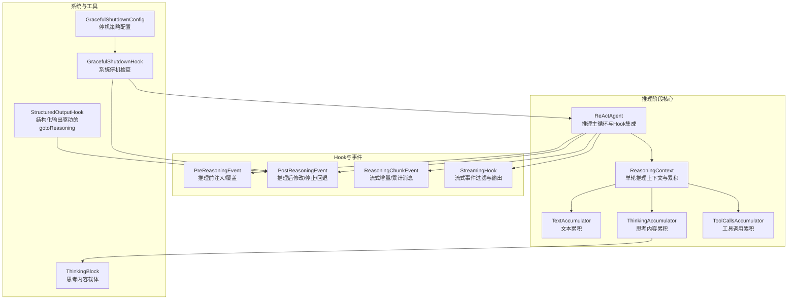
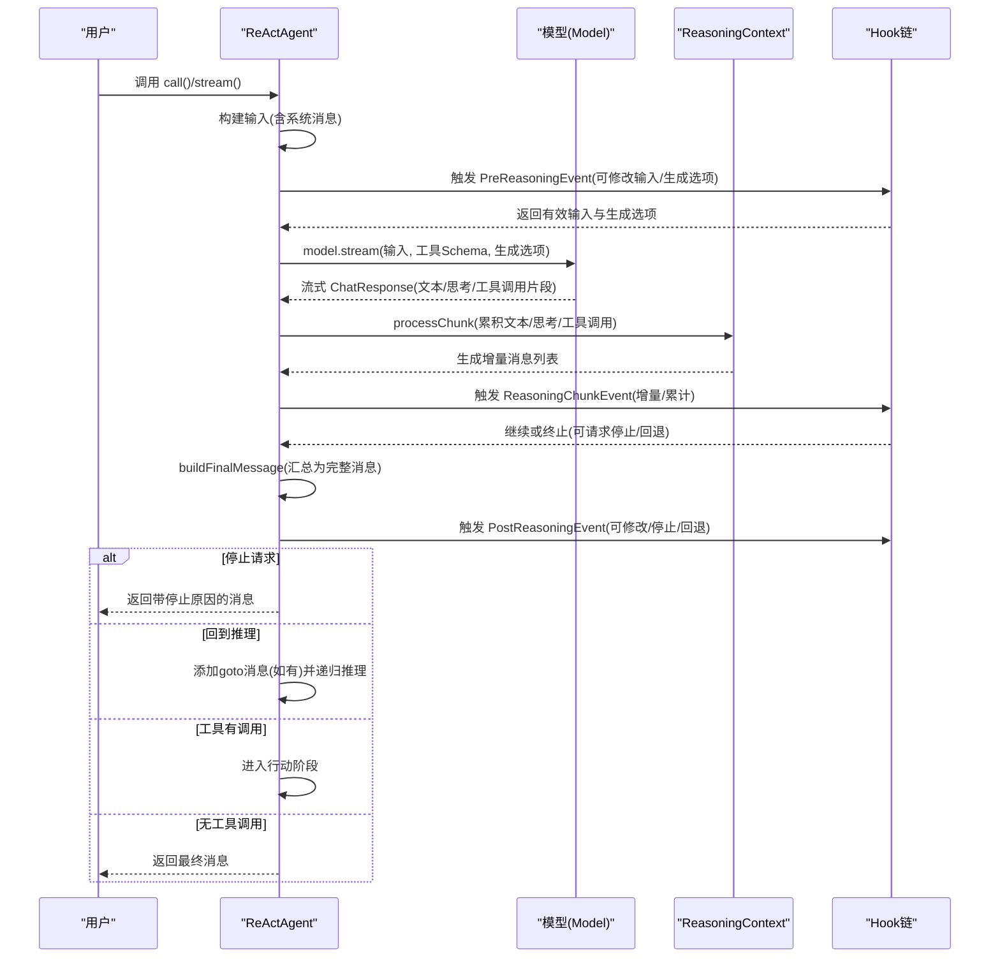
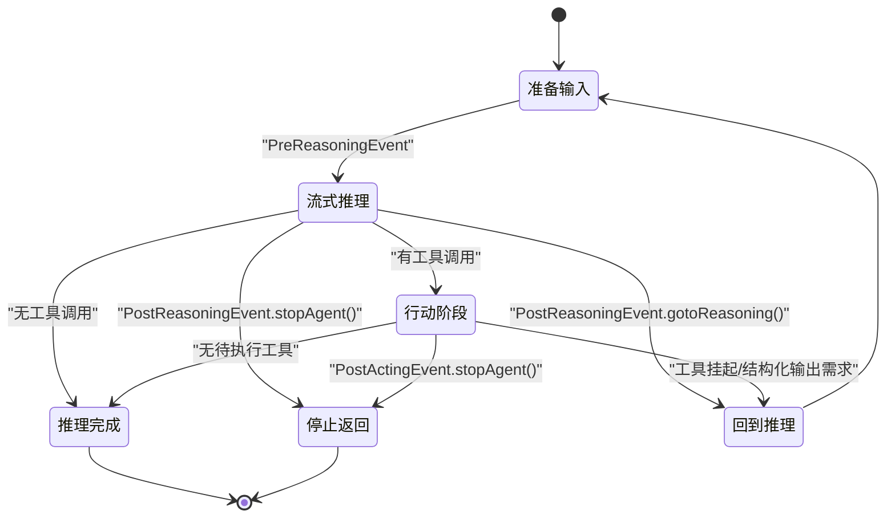
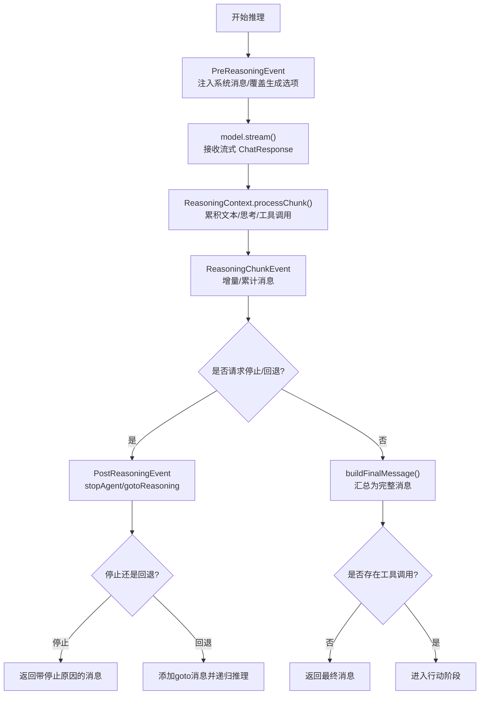
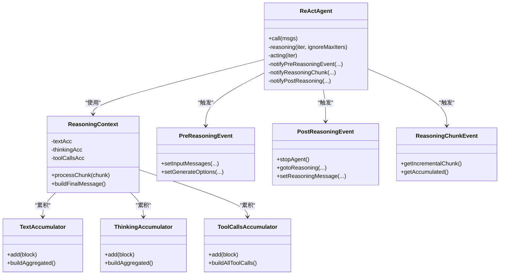
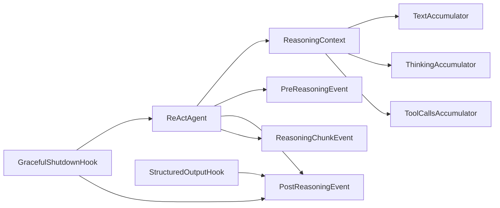

# 推理阶段

<cite>
**本文引用的文件**
- [ReActAgent.java](file://agentscope-core/src/main/java/io/agentscope/core/ReActAgent.java)
- [ReasoningContext.java](file://agentscope-core/src/main/java/io/agentscope/core/agent/accumulator/ReasoningContext.java)
- [TextAccumulator.java](file://agentscope-core/src/main/java/io/agentscope/core/agent/accumulator/TextAccumulator.java)
- [ThinkingAccumulator.java](file://agentscope-core/src/main/java/io/agentscope/core/agent/accumulator/ThinkingAccumulator.java)
- [ToolCallsAccumulator.java](file://agentscope-core/src/main/java/io/agentscope/core/agent/accumulator/ToolCallsAccumulator.java)
- [PreReasoningEvent.java](file://agentscope-core/src/main/java/io/agentscope/core/hook/PreReasoningEvent.java)
- [PostReasoningEvent.java](file://agentscope-core/src/main/java/io/agentscope/core/hook/PostReasoningEvent.java)
- [ReasoningChunkEvent.java](file://agentscope-core/src/main/java/io/agentscope/core/hook/ReasoningChunkEvent.java)
- [StreamingHook.java](file://agentscope-core/src/main/java/io/agentscope/core/agent/StreamingHook.java)
- [StructuredOutputHook.java](file://agentscope-core/src/main/java/io/agentscope/core/agent/StructuredOutputHook.java)
- [GracefulShutdownHook.java](file://agentscope-core/src/main/java/io/agentscope/core/shutdown/GracefulShutdownHook.java)
- [GracefulShutdownConfig.java](file://agentscope-core/src/main/java/io/agentscope/core/shutdown/GracefulShutdownConfig.java)
- [ThinkingBlock.java](file://agentscope-core/src/main/java/io/agentscope/core/message/ThinkingBlock.java)
- [ReActAgentThinkingCumulativeTest.java](file://agentscope-core/src/test/java/io/agentscope/core/agent/ReActAgentThinkingCumulativeTest.java)
</cite>

## 目录
1. [引言](#引言)
2. [项目结构](#项目结构)
3. [核心组件](#核心组件)
4. [架构总览](#架构总览)
5. [详细组件分析](#详细组件分析)
6. [依赖分析](#依赖分析)
7. [性能考虑](#性能考虑)
8. [故障排查指南](#故障排查指南)
9. [结论](#结论)
10. [附录](#附录)

## 引言
本文件聚焦 ReAct 智能体“推理阶段”的技术实现与运行机制，系统性阐述以下主题：
- 推理阶段的输入准备、系统消息注入、生成选项配置与模型交互流程
- 流式处理、思维内容累积、工具调用片段拼接与状态管理
- Hook 事件处理机制：PreReasoningEvent、PostReasoningEvent、ReasoningChunkEvent 的触发时机与作用
- 状态转换图与数据流转过程
- 中断处理、异常恢复与性能优化策略
- 实际代码示例路径与边界情况处理

## 项目结构
围绕推理阶段的关键代码主要位于 agentscope-core 模块中，涉及 ReActAgent、ReasoningContext 及其累加器、Hook 事件体系、流式钩子以及优雅停机策略等。

图表来源
- [ReActAgent.java:550-650](file://agentscope-core/src/main/java/io/agentscope/core/ReActAgent.java#L550-L650)
- [ReasoningContext.java:44-186](file://agentscope-core/src/main/java/io/agentscope/core/agent/accumulator/ReasoningContext.java#L44-L186)
- [PreReasoningEvent.java:47-116](file://agentscope-core/src/main/java/io/agentscope/core/hook/PreReasoningEvent.java#L47-L116)
- [PostReasoningEvent.java:51-172](file://agentscope-core/src/main/java/io/agentscope/core/hook/PostReasoningEvent.java#L51-L172)
- [ReasoningChunkEvent.java:60-106](file://agentscope-core/src/main/java/io/agentscope/core/hook/ReasoningChunkEvent.java#L60-L106)
- [StreamingHook.java:37-87](file://agentscope-core/src/main/java/io/agentscope/core/agent/StreamingHook.java#L37-L87)
- [StructuredOutputHook.java:87-106](file://agentscope-core/src/main/java/io/agentscope/core/agent/StructuredOutputHook.java#L87-L106)
- [GracefulShutdownHook.java:65-81](file://agentscope-core/src/main/java/io/agentscope/core/shutdown/GracefulShutdownHook.java#L65-L81)
- [GracefulShutdownConfig.java:63-69](file://agentscope-core/src/main/java/io/agentscope/core/shutdown/GracefulShutdownConfig.java#L63-L69)
- [ThinkingBlock.java:93-133](file://agentscope-core/src/main/java/io/agentscope/core/message/ThinkingBlock.java#L93-L133)

章节来源
- [ReActAgent.java:550-650](file://agentscope-core/src/main/java/io/agentscope/core/ReActAgent.java#L550-L650)
- [ReasoningContext.java:44-186](file://agentscope-core/src/main/java/io/agentscope/core/agent/accumulator/ReasoningContext.java#L44-L186)

## 核心组件
- ReActAgent 推理主循环：负责构建输入、调用模型流式接口、累积响应、触发 Hook、决定是否进入行动阶段或结束。
- ReasoningContext 单轮推理上下文：统一管理文本、思考、工具调用三类内容的累积，并在流式过程中生成增量与累计消息，最终汇总为完整消息。
- 累加器体系：
  - TextAccumulator：顺序拼接文本片段。
  - ThinkingAccumulator：顺序拼接思考片段，支持元数据保留。
  - ToolCallsAccumulator：多并行工具调用的参数合并、片段拼接与 JSON 完整性校验。
- Hook 事件：
  - PreReasoningEvent：推理前可修改输入消息与生成选项。
  - PostReasoningEvent：推理后可修改结果、请求停止、或回到推理（gotoReasoning）。
  - ReasoningChunkEvent：流式事件，提供增量与累计两种视图。
- 流式钩子 StreamingHook：根据 StreamOptions 过滤与输出推理事件，支持增量/累计模式切换。
- 结构化输出 Hook：通过 PostReasoning 阶段触发 gotoReasoning，驱动 ReAct 回到推理以满足结构化输出约束。
- 优雅停机 Hook：在关键节点检查系统停机状态，必要时中断当前执行。

章节来源
- [ReActAgent.java:550-650](file://agentscope-core/src/main/java/io/agentscope/core/ReActAgent.java#L550-L650)
- [ReasoningContext.java:44-186](file://agentscope-core/src/main/java/io/agentscope/core/agent/accumulator/ReasoningContext.java#L44-L186)
- [TextAccumulator.java:27-78](file://agentscope-core/src/main/java/io/agentscope/core/agent/accumulator/TextAccumulator.java#L27-L78)
- [ThinkingAccumulator.java:42-78](file://agentscope-core/src/main/java/io/agentscope/core/agent/accumulator/ThinkingAccumulator.java#L42-L78)
- [ToolCallsAccumulator.java:40-306](file://agentscope-core/src/main/java/io/agentscope/core/agent/accumulator/ToolCallsAccumulator.java#L40-L306)
- [PreReasoningEvent.java:47-116](file://agentscope-core/src/main/java/io/agentscope/core/hook/PreReasoningEvent.java#L47-L116)
- [PostReasoningEvent.java:51-172](file://agentscope-core/src/main/java/io/agentscope/core/hook/PostReasoningEvent.java#L51-L172)
- [ReasoningChunkEvent.java:60-106](file://agentscope-core/src/main/java/io/agentscope/core/hook/ReasoningChunkEvent.java#L60-L106)
- [StreamingHook.java:37-87](file://agentscope-core/src/main/java/io/agentscope/core/agent/StreamingHook.java#L37-L87)
- [StructuredOutputHook.java:87-106](file://agentscope-core/src/main/java/io/agentscope/core/agent/StructuredOutputHook.java#L87-L106)
- [GracefulShutdownHook.java:65-81](file://agentscope-core/src/main/java/io/agentscope/core/shutdown/GracefulShutdownHook.java#L65-L81)
- [GracefulShutdownConfig.java:63-69](file://agentscope-core/src/main/java/io/agentscope/core/shutdown/GracefulShutdownConfig.java#L63-L69)
- [ThinkingBlock.java:93-133](file://agentscope-core/src/main/java/io/agentscope/core/message/ThinkingBlock.java#L93-L133)

## 架构总览
推理阶段的端到端流程如下：

图表来源
- [ReActAgent.java:560-650](file://agentscope-core/src/main/java/io/agentscope/core/ReActAgent.java#L560-L650)
- [ReasoningContext.java:78-186](file://agentscope-core/src/main/java/io/agentscope/core/agent/accumulator/ReasoningContext.java#L78-L186)
- [PreReasoningEvent.java:47-116](file://agentscope-core/src/main/java/io/agentscope/core/hook/PreReasoningEvent.java#L47-L116)
- [PostReasoningEvent.java:51-172](file://agentscope-core/src/main/java/io/agentscope/core/hook/PostReasoningEvent.java#L51-L172)
- [ReasoningChunkEvent.java:60-106](file://agentscope-core/src/main/java/io/agentscope/core/hook/ReasoningChunkEvent.java#L60-L106)

## 详细组件分析

### 推理阶段输入准备与系统消息注入
- 输入构建：推理开始前，ReActAgent 会将当前系统消息与用户消息组合为最终输入列表；系统消息由 seedSystemMsg 生成并在 PreCall 阶段注入。
- 生成选项：PreReasoningEvent 允许 Hook 覆盖默认生成选项（如 tool_choice），从而影响模型行为。
- 最终输入：prependSystemMsg 将系统消息前置到每次模型流式调用的输入列表，确保不污染内存中的历史消息。

章节来源
- [ReActAgent.java:211-225](file://agentscope-core/src/main/java/io/agentscope/core/ReActAgent.java#L211-L225)
- [ReActAgent.java:927-937](file://agentscope-core/src/main/java/io/agentscope/core/ReActAgent.java#L927-L937)
- [PreReasoningEvent.java:61-116](file://agentscope-core/src/main/java/io/agentscope/core/hook/PreReasoningEvent.java#L61-L116)

### 流式处理与内容累积
- 流式响应处理：ReActAgent 在流式回调中逐片处理 ChatResponse，交由 ReasoningContext 累积文本、思考与工具调用。
- 增量与累计：ReasoningContext 为每一片段生成增量消息用于实时显示；同时维护累计消息供 Hook 使用。
- 工具调用片段拼接：ToolCallsAccumulator 支持多并行工具调用，自动识别占位名与空 ID 片段，基于当前工具调用键进行参数合并与 JSON 完整性校验。

章节来源
- [ReActAgent.java:582-589](file://agentscope-core/src/main/java/io/agentscope/core/ReActAgent.java#L582-L589)
- [ReasoningContext.java:78-125](file://agentscope-core/src/main/java/io/agentscope/core/agent/accumulator/ReasoningContext.java#L78-L125)
- [ToolCallsAccumulator.java:140-195](file://agentscope-core/src/main/java/io/agentscope/core/agent/accumulator/ToolCallsAccumulator.java#L140-L195)

### Hook 事件处理机制
- PreReasoningEvent：推理前拦截，允许修改输入消息与生成选项；常用于动态注入提示词或调整温度、工具选择等。
- ReasoningChunkEvent：推理流式阶段的增量/累计消息事件，支持 Hook 选择增量（追加）或累计（替换）两种展示方式。
- PostReasoningEvent：推理完成后拦截，允许：
  - 修改推理结果消息；
  - 请求停止（返回带停止原因的消息）；
  - 请求回到推理（gotoReasoning），并可附加 ToolResult 或提示消息；内部会进行 ToolResult 匹配校验。
- 结构化输出 Hook：在 PostReasoning 阶段根据需要触发 gotoReasoning，驱动 ReAct 回到推理以满足结构化输出约束。
- 优雅停机 Hook：在推理/行动/摘要阶段的关键节点检查系统停机状态，必要时中断当前执行。

章节来源
- [PreReasoningEvent.java:47-116](file://agentscope-core/src/main/java/io/agentscope/core/hook/PreReasoningEvent.java#L47-L116)
- [ReasoningChunkEvent.java:60-106](file://agentscope-core/src/main/java/io/agentscope/core/hook/ReasoningChunkEvent.java#L60-L106)
- [PostReasoningEvent.java:51-172](file://agentscope-core/src/main/java/io/agentscope/core/hook/PostReasoningEvent.java#L51-L172)
- [StructuredOutputHook.java:87-106](file://agentscope-core/src/main/java/io/agentscope/core/agent/StructuredOutputHook.java#L87-L106)
- [GracefulShutdownHook.java:65-81](file://agentscope-core/src/main/java/io/agentscope/core/shutdown/GracefulShutdownHook.java#L65-L81)

### 状态管理与完成条件
- 单轮状态：ReasoningContext 维护文本、思考、工具调用三类累积器，以及累计的用量信息；最终汇总为一条 Assistant 消息。
- 完成判断：若推理结果不含任何工具调用，则认为推理完成，直接返回；否则进入行动阶段执行工具。
- 中断与恢复：当捕获到中断异常时，根据系统停机策略决定是否保存部分推理结果；系统停机 Hook 会在关键节点触发中断。

章节来源
- [ReasoningContext.java:145-186](file://agentscope-core/src/main/java/io/agentscope/core/agent/accumulator/ReasoningContext.java#L145-L186)
- [ReActAgent.java:947-958](file://agentscope-core/src/main/java/io/agentscope/core/ReActAgent.java#L947-L958)
- [ReActAgent.java:591-609](file://agentscope-core/src/main/java/io/agentscope/core/ReActAgent.java#L591-L609)
- [GracefulShutdownHook.java:72-78](file://agentscope-core/src/main/java/io/agentscope/core/shutdown/GracefulShutdownHook.java#L72-L78)
- [GracefulShutdownConfig.java:63-69](file://agentscope-core/src/main/java/io/agentscope/core/shutdown/GracefulShutdownConfig.java#L63-L69)

### 推理阶段状态转换图

图表来源
- [ReActAgent.java:560-650](file://agentscope-core/src/main/java/io/agentscope/core/ReActAgent.java#L560-L650)
- [PostReasoningEvent.java:99-172](file://agentscope-core/src/main/java/io/agentscope/core/hook/PostReasoningEvent.java#L99-L172)

### 数据流转过程（代码级）

图表来源
- [ReActAgent.java:560-650](file://agentscope-core/src/main/java/io/agentscope/core/ReActAgent.java#L560-L650)
- [ReasoningContext.java:78-186](file://agentscope-core/src/main/java/io/agentscope/core/agent/accumulator/ReasoningContext.java#L78-L186)
- [PostReasoningEvent.java:99-172](file://agentscope-core/src/main/java/io/agentscope/core/hook/PostReasoningEvent.java#L99-L172)

### 类关系与数据模型

图表来源
- [ReActAgent.java:550-731](file://agentscope-core/src/main/java/io/agentscope/core/ReActAgent.java#L550-L731)
- [ReasoningContext.java:44-291](file://agentscope-core/src/main/java/io/agentscope/core/agent/accumulator/ReasoningContext.java#L44-L291)
- [TextAccumulator.java:27-78](file://agentscope-core/src/main/java/io/agentscope/core/agent/accumulator/TextAccumulator.java#L27-L78)
- [ThinkingAccumulator.java:42-78](file://agentscope-core/src/main/java/io/agentscope/core/agent/accumulator/ThinkingAccumulator.java#L42-L78)
- [ToolCallsAccumulator.java:40-306](file://agentscope-core/src/main/java/io/agentscope/core/agent/accumulator/ToolCallsAccumulator.java#L40-L306)
- [PreReasoningEvent.java:47-116](file://agentscope-core/src/main/java/io/agentscope/core/hook/PreReasoningEvent.java#L47-L116)
- [PostReasoningEvent.java:51-172](file://agentscope-core/src/main/java/io/agentscope/core/hook/PostReasoningEvent.java#L51-L172)
- [ReasoningChunkEvent.java:60-106](file://agentscope-core/src/main/java/io/agentscope/core/hook/ReasoningChunkEvent.java#L60-L106)

## 依赖分析
- ReActAgent 依赖 ReasoningContext 与各类累加器进行内容累积与消息构建。
- Hook 事件贯穿推理前后，Pre/PostReasoningEvent 提供可修改能力，ReasoningChunkEvent 提供流式展示能力。
- 结构化输出 Hook 通过 PostReasoningEvent 的 gotoReasoning 机制驱动 ReAct 回到推理。
- 优雅停机 Hook 在推理/行动/摘要阶段检查系统停机状态，必要时中断执行。

图表来源
- [ReActAgent.java:550-731](file://agentscope-core/src/main/java/io/agentscope/core/ReActAgent.java#L550-L731)
- [ReasoningContext.java:44-291](file://agentscope-core/src/main/java/io/agentscope/core/agent/accumulator/ReasoningContext.java#L44-L291)
- [PreReasoningEvent.java:47-116](file://agentscope-core/src/main/java/io/agentscope/core/hook/PreReasoningEvent.java#L47-L116)
- [PostReasoningEvent.java:51-172](file://agentscope-core/src/main/java/io/agentscope/core/hook/PostReasoningEvent.java#L51-L172)
- [ReasoningChunkEvent.java:60-106](file://agentscope-core/src/main/java/io/agentscope/core/hook/ReasoningChunkEvent.java#L60-L106)
- [StructuredOutputHook.java:87-106](file://agentscope-core/src/main/java/io/agentscope/core/agent/StructuredOutputHook.java#L87-L106)
- [GracefulShutdownHook.java:65-81](file://agentscope-core/src/main/java/io/agentscope/core/shutdown/GracefulShutdownHook.java#L65-L81)

章节来源
- [ReActAgent.java:550-731](file://agentscope-core/src/main/java/io/agentscope/core/ReActAgent.java#L550-L731)
- [StructuredOutputHook.java:87-106](file://agentscope-core/src/main/java/io/agentscope/core/agent/StructuredOutputHook.java#L87-L106)
- [GracefulShutdownHook.java:65-81](file://agentscope-core/src/main/java/io/agentscope/core/shutdown/GracefulShutdownHook.java#L65-L81)

## 性能考虑
- 流式处理与增量展示：通过 ReasoningChunkEvent 的增量/累计两种模式，减少前端重绘与内存占用。
- 多并行工具调用：ToolCallsAccumulator 支持并行工具调用的参数合并与 JSON 完整性校验，避免重复解析与碎片化。
- 用量统计：ReasoningContext 汇总 input/output tokens 与耗时，便于成本控制与性能分析。
- Hook 过滤：StreamingHook 根据 StreamOptions 过滤事件，降低不必要的事件传播开销。

章节来源
- [ReasoningContext.java:168-186](file://agentscope-core/src/main/java/io/agentscope/core/agent/accumulator/ReasoningContext.java#L168-L186)
- [ToolCallsAccumulator.java:231-233](file://agentscope-core/src/main/java/io/agentscope/core/agent/accumulator/ToolCallsAccumulator.java#L231-L233)
- [StreamingHook.java:62-87](file://agentscope-core/src/main/java/io/agentscope/core/agent/StreamingHook.java#L62-L87)

## 故障排查指南
- 推理中断与部分结果保存：
  - 当捕获到中断异常时，ReActAgent 会尝试保存已累积的部分消息；系统停机策略可通过 GracefulShutdownConfig 配置是否丢弃部分推理结果。
- 结构化输出回退：
  - 若 PostReasoningEvent 请求 gotoReasoning，需确保 ToolResult 与推理中的工具调用匹配；否则抛出非法状态异常。
- 工具结果验证：
  - 当存在未完成的工具调用时，用户提供的工具结果必须与待完成 ID 完全匹配且无重复；部分提供时禁止混入文本内容。
- 流式片段处理：
  - 对于占位名片段（如 __fragment__），需依赖当前工具调用键进行 ID 补全，确保用户侧正确拼接。

章节来源
- [ReActAgent.java:591-609](file://agentscope-core/src/main/java/io/agentscope/core/ReActAgent.java#L591-L609)
- [GracefulShutdownConfig.java:63-69](file://agentscope-core/src/main/java/io/agentscope/core/shutdown/GracefulShutdownConfig.java#L63-L69)
- [PostReasoningEvent.java:150-153](file://agentscope-core/src/main/java/io/agentscope/core/hook/PostReasoningEvent.java#L150-L153)
- [ReActAgent.java:478-531](file://agentscope-core/src/main/java/io/agentscope/core/ReActAgent.java#L478-L531)
- [ReasoningContext.java:211-231](file://agentscope-core/src/main/java/io/agentscope/core/agent/accumulator/ReasoningContext.java#L211-L231)

## 结论
ReAct 智能体的推理阶段通过“流式累积 + Hook 可插拔 + 状态机决策”实现了高扩展性与可控性。ReasoningContext 作为单轮推理的核心上下文，统一管理文本、思考与工具调用的累积与汇总；Pre/PostReasoningEvent 与 ReasoningChunkEvent 则提供了强大的可观测性与干预能力。结合结构化输出与优雅停机策略，推理阶段能够在复杂任务中保持稳健与可控。

## 附录
- 示例与边界情况参考：
  - 思考内容增量/累计流式展示：参见测试用例对 ReasoningChunkEvent 的使用。
  - 工具调用片段拼接与 ID 补全：参见 ToolCallsAccumulator 的片段处理逻辑。
  - 思考内容载体：ThinkingBlock 支持元数据存储，便于保留模型内部推理细节。

章节来源
- [ReActAgentThinkingCumulativeTest.java:63-168](file://agentscope-core/src/test/java/io/agentscope/core/agent/ReActAgentThinkingCumulativeTest.java#L63-L168)
- [ToolCallsAccumulator.java:140-195](file://agentscope-core/src/main/java/io/agentscope/core/agent/accumulator/ToolCallsAccumulator.java#L140-L195)
- [ThinkingBlock.java:93-133](file://agentscope-core/src/main/java/io/agentscope/core/message/ThinkingBlock.java#L93-L133)