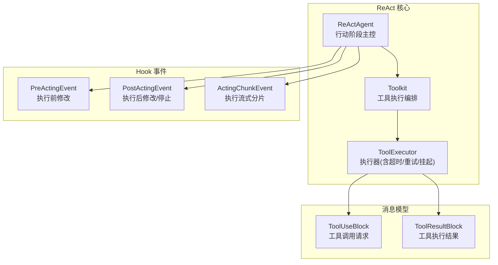
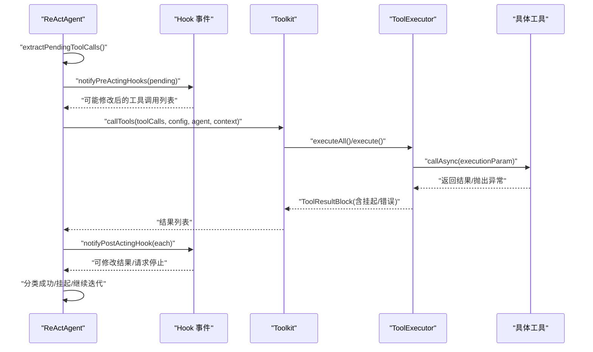
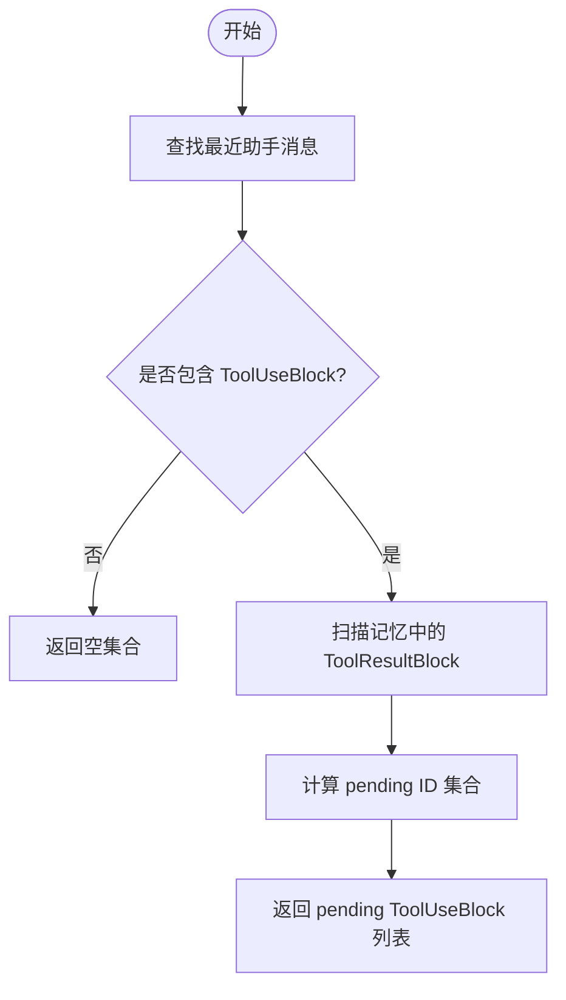
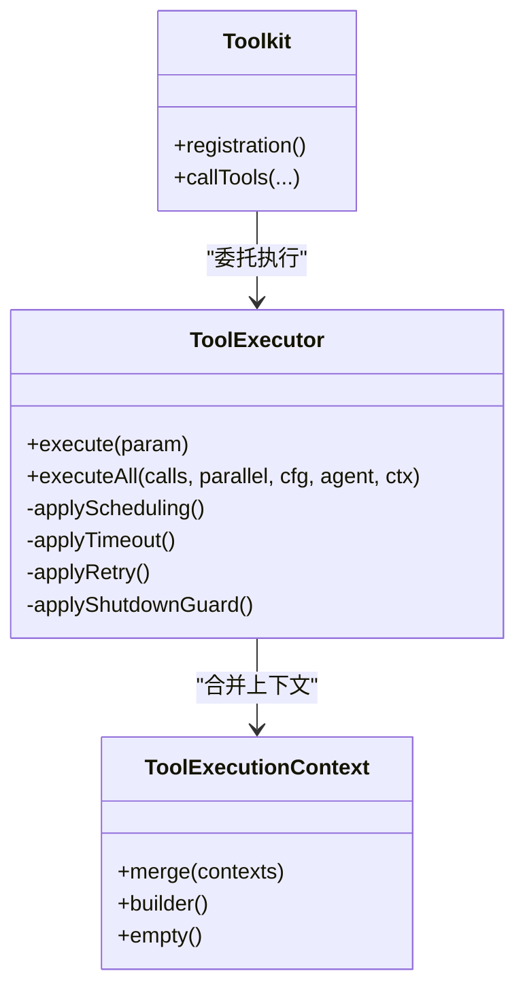
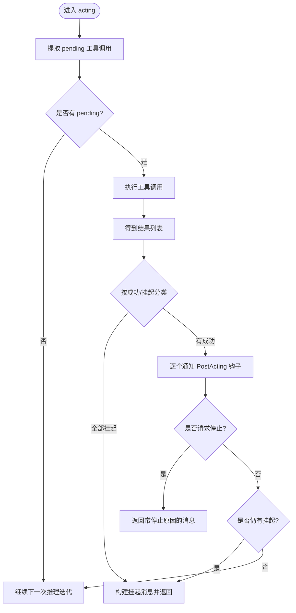
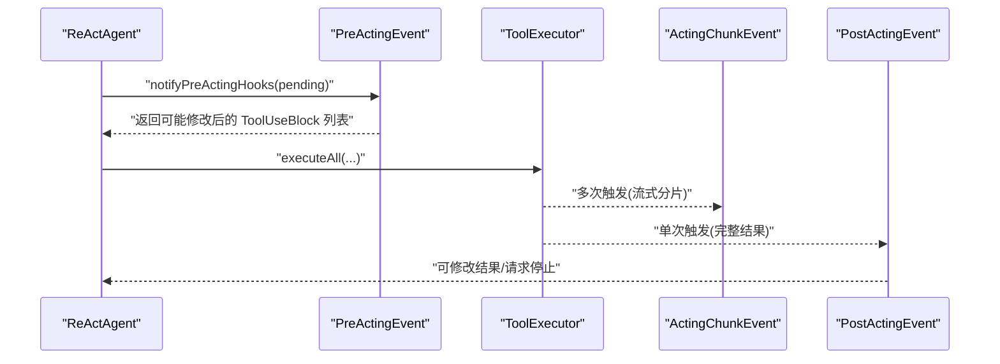
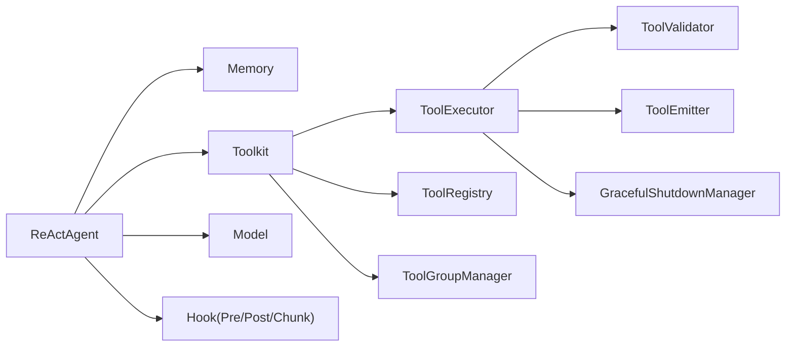

# 行动阶段

<cite>
**本文引用的文件**
- [ReActAgent.java](file://agentscope-core/src/main/java/io/agentscope/core/ReActAgent.java)
- [PreActingEvent.java](file://agentscope-core/src/main/java/io/agentscope/core/hook/PreActingEvent.java)
- [PostActingEvent.java](file://agentscope-core/src/main/java/io/agentscope/core/hook/PostActingEvent.java)
- [ActingChunkEvent.java](file://agentscope-core/src/main/java/io/agentscope/core/hook/ActingChunkEvent.java)
- [Toolkit.java](file://agentscope-core/src/main/java/io/agentscope/core/tool/Toolkit.java)
- [ToolExecutor.java](file://agentscope-core/src/main/java/io/agentscope/core/tool/ToolExecutor.java)
- [ToolExecutionContext.java](file://agentscope-core/src/main/java/io/agentscope/core/tool/ToolExecutionContext.java)
- [ToolUseBlock.java](file://agentscope-core/src/main/java/io/agentscope/core/message/ToolUseBlock.java)
- [ToolResultBlock.java](file://agentscope-core/src/main/java/io/agentscope/core/message/ToolResultBlock.java)
- [ToolSuspendException.java](file://agentscope-core/src/main/java/io/agentscope/core/tool/ToolSuspendException.java)
- [ToolResultMessageBuilder.java](file://agentscope-core/src/main/java/io/agentscope/core/tool/ToolResultMessageBuilder.java)
- [ReActAgentTest.java](file://agentscope-core/src/test/java/io/agentscope/core/agent/ReActAgentTest.java)
</cite>

## 目录
1. [引言](#引言)
2. [项目结构](#项目结构)
3. [核心组件](#核心组件)
4. [架构总览](#架构总览)
5. [详细组件分析](#详细组件分析)
6. [依赖分析](#依赖分析)
7. [性能考虑](#性能考虑)
8. [故障排查指南](#故障排查指南)
9. [结论](#结论)
10. [附录](#附录)

## 引言
本文件聚焦 ReAct 智能体“行动阶段”的技术实现与工作机制，系统性阐述以下主题：
- 工具调用提取：如何从上一轮推理产物中识别待执行的工具调用（pending tool calls）。
- 工具执行管理：工具执行上下文构建、执行配置、并发与重试、超时与挂起处理。
- 结果处理流程：成功结果、挂起结果与失败结果的分类与后续控制流。
- Hook 事件机制：PreActingEvent、PostActingEvent、ActingChunkEvent 的触发时机与作用。
- 错误处理与中断：工具执行错误的兜底策略、挂起工具的管理、系统中断与优雅停机。
- 实际执行路径示例：成功执行、挂起执行、失败处理等场景的代码级路径定位。

## 项目结构
ReAct 行动阶段位于 agentscope-core 模块中，核心类与关键文件如下：
- ReActAgent：ReAct 主流程控制器，负责推理与行动的迭代调度。
- Hook 事件：PreActingEvent、PostActingEvent、ActingChunkEvent，贯穿工具执行生命周期。
- Toolkit/ToolExecutor：工具注册、参数合并、执行调度、超时/重试/挂起/错误转换。
- 消息模型：ToolUseBlock、ToolResultBlock，承载工具调用与结果。
- 测试用例：ReActAgentTest 提供多种行动阶段行为的验证场景。

图表来源
- [ReActAgent.java](file://agentscope-core/src/main/java/io/agentscope/core/ReActAgent.java)
- [Toolkit.java](file://agentscope-core/src/main/java/io/agentscope/core/tool/Toolkit.java)
- [ToolExecutor.java](file://agentscope-core/src/main/java/io/agentscope/core/tool/ToolExecutor.java)
- [PreActingEvent.java](file://agentscope-core/src/main/java/io/agentscope/core/hook/PreActingEvent.java)
- [PostActingEvent.java](file://agentscope-core/src/main/java/io/agentscope/core/hook/PostActingEvent.java)
- [ActingChunkEvent.java](file://agentscope-core/src/main/java/io/agentscope/core/hook/ActingChunkEvent.java)
- [ToolUseBlock.java](file://agentscope-core/src/main/java/io/agentscope/core/message/ToolUseBlock.java)
- [ToolResultBlock.java](file://agentscope-core/src/main/java/io/agentscope/core/message/ToolResultBlock.java)

章节来源
- [ReActAgent.java](file://agentscope-core/src/main/java/io/agentscope/core/ReActAgent.java)
- [Toolkit.java](file://agentscope-core/src/main/java/io/agentscope/core/tool/Toolkit.java)
- [ToolExecutor.java](file://agentscope-core/src/main/java/io/agentscope/core/tool/ToolExecutor.java)

## 核心组件
- ReActAgent.acting：行动阶段入口，负责提取 pending 工具调用、执行、分类处理与后续控制流。
- Toolkit.callTools：统一入口，委托 ToolExecutor 执行单个或批量工具调用。
- ToolExecutor：执行基础设施（调度、超时、重试、挂起、错误转换），并支持用户/内部流式回调。
- Hook 事件：PreActingEvent（可修改工具调用）、PostActingEvent（可修改结果/请求停止）、ActingChunkEvent（流式分片通知）。
- 消息模型：ToolUseBlock 描述工具调用；ToolResultBlock 描述结果（含挂起标记）。

章节来源
- [ReActAgent.java](file://agentscope-core/src/main/java/io/agentscope/core/ReActAgent.java)
- [Toolkit.java](file://agentscope-core/src/main/java/io/agentscope/core/tool/Toolkit.java)
- [ToolExecutor.java](file://agentscope-core/src/main/java/io/agentscope/core/tool/ToolExecutor.java)
- [PreActingEvent.java](file://agentscope-core/src/main/java/io/agentscope/core/hook/PreActingEvent.java)
- [PostActingEvent.java](file://agentscope-core/src/main/java/io/agentscope/core/hook/PostActingEvent.java)
- [ActingChunkEvent.java](file://agentscope-core/src/main/java/io/agentscope/core/hook/ActingChunkEvent.java)
- [ToolUseBlock.java](file://agentscope-core/src/main/java/io/agentscope/core/message/ToolUseBlock.java)
- [ToolResultBlock.java](file://agentscope-core/src/main/java/io/agentscope/core/message/ToolResultBlock.java)

## 架构总览
ReAct 行动阶段在推理与行动之间循环推进，行动阶段仅处理“尚未有对应结果”的工具调用，并通过 Hook 与工具执行器协同完成执行、流式通知与结果归档。

图表来源
- [ReActAgent.java](file://agentscope-core/src/main/java/io/agentscope/core/ReActAgent.java)
- [Toolkit.java](file://agentscope-core/src/main/java/io/agentscope/core/tool/Toolkit.java)
- [ToolExecutor.java](file://agentscope-core/src/main/java/io/agentscope/core/tool/ToolExecutor.java)

## 详细组件分析

### 工具调用提取与过滤逻辑
- 提取范围：仅选择“上一轮助手消息中存在但当前记忆中尚无对应 ToolResultBlock”的 ToolUseBlock。
- 过滤规则：
  - 忽略已存在 ToolResultBlock 的 ToolUseBlock（避免重复执行）。
  - 若输入消息携带 ToolResultBlock，则进行 ID 校验、去重校验、部分结果与文本混杂校验。
- 关键方法：
  - ReActAgent.extractPendingToolCalls：从上一轮助手消息中提取 pending 调用。
  - ReActAgent.validateAndAddToolResults：当用户显式提供 ToolResultBlock 时进行严格校验。
  - ReActAgent.getPendingToolUseIds：计算 pending ID 集合。

图表来源
- [ReActAgent.java](file://agentscope-core/src/main/java/io/agentscope/core/ReActAgent.java)

章节来源
- [ReActAgent.java](file://agentscope-core/src/main/java/io/agentscope/core/ReActAgent.java)

### 工具执行上下文构建与执行配置
- 上下文合并优先级：
  - 调用层 RuntimeContext（通过 RuntimeContext.asToolExecutionContext()）
  - Agent 级 ToolExecutionContext（builder 中注入）
  - Toolkit 默认上下文（ToolkitConfig.defaultContext）
  - 合并策略：ToolExecutionContext.merge，前者优先。
- 执行配置：
  - ToolExecutor.applyScheduling：默认使用 boundedElastic，或自定义线程池。
  - applyTimeout/applyRetry：基于 ExecutionConfig 的超时与重试策略。
  - applyShutdownGuard：与全局优雅停机信号竞争，确保系统关闭时及时取消。
- 参数合并：
  - ToolExecutor.executeCore：合并 preset 参数与输入参数，preset 优先，保证框架侧参数不可被外部覆盖。

图表来源
- [ToolExecutionContext.java](file://agentscope-core/src/main/java/io/agentscope/core/tool/ToolExecutionContext.java)
- [Toolkit.java](file://agentscope-core/src/main/java/io/agentscope/core/tool/Toolkit.java)
- [ToolExecutor.java](file://agentscope-core/src/main/java/io/agentscope/core/tool/ToolExecutor.java)

章节来源
- [ToolExecutionContext.java](file://agentscope-core/src/main/java/io/agentscope/core/tool/ToolExecutionContext.java)
- [Toolkit.java](file://agentscope-core/src/main/java/io/agentscope/core/tool/Toolkit.java)
- [ToolExecutor.java](file://agentscope-core/src/main/java/io/agentscope/core/tool/ToolExecutor.java)

### 工具执行流程与结果分类处理
- 执行入口：ReActAgent.acting → Toolkit.callTools → ToolExecutor.executeAll/execute。
- 结果分类：
  - 成功：非挂起的 ToolResultBlock，进入 PostActing 钩子链路，允许修改与请求停止。
  - 挂起：ToolSuspendException 转换为 ToolResultBlock.suspended，返回 GenerateReason=TOOL_SUSPENDED 的消息，等待用户外部执行。
  - 失败：工具异常或超时，转换为错误 ToolResultBlock，不抛出异常以保证 Agent 继续运行。
- 控制流：
  - 若仅有挂起结果：返回挂起消息，等待用户提供结果后恢复。
  - 若既有成功又有挂起：先处理成功结果，再根据是否仍有挂起决定返回挂起或继续迭代。
  - 若无成功且有挂起：直接返回挂起消息。
  - 若无任何结果：继续下一次推理迭代。

图表来源
- [ReActAgent.java](file://agentscope-core/src/main/java/io/agentscope/core/ReActAgent.java)
- [ToolExecutor.java](file://agentscope-core/src/main/java/io/agentscope/core/tool/ToolExecutor.java)
- [ToolSuspendException.java](file://agentscope-core/src/main/java/io/agentscope/core/tool/ToolSuspendException.java)
- [ToolResultBlock.java](file://agentscope-core/src/main/java/io/agentscope/core/message/ToolResultBlock.java)

章节来源
- [ReActAgent.java](file://agentscope-core/src/main/java/io/agentscope/core/ReActAgent.java)
- [ToolExecutor.java](file://agentscope-core/src/main/java/io/agentscope/core/tool/ToolExecutor.java)
- [ToolSuspendException.java](file://agentscope-core/src/main/java/io/agentscope/core/tool/ToolSuspendException.java)
- [ToolResultBlock.java](file://agentscope-core/src/main/java/io/agentscope/core/message/ToolResultBlock.java)

### Hook 事件处理机制
- PreActingEvent
  - 触发时机：每个待执行工具调用在执行前触发。
  - 作用：允许钩子修改 ToolUseBlock（如参数调整、鉴权注入）。
  - 修改生效：ReActAgent 在执行前接收修改后的 ToolUseBlock 列表。
- PostActingEvent
  - 触发时机：每个工具调用完成后触发。
  - 作用：允许钩子修改 ToolResultBlock、设置工具结果消息、请求停止 Agent。
  - 停止语义：stopAgent() 将导致 Agent 返回当前消息而非继续迭代。
- ActingChunkEvent
  - 触发时机：工具执行过程中由 ToolEmitter 发出的流式分片。
  - 作用：用于进度展示、日志记录、长任务监控；不会发送给 LLM，仅框架内消费。
- 内部回调与用户回调
  - ReActAgent 在行动阶段设置 internal chunk 回调，避免覆盖用户回调。
  - ToolExecutor 支持用户与内部回调并存，分别标注来源类型。

图表来源
- [ReActAgent.java](file://agentscope-core/src/main/java/io/agentscope/core/ReActAgent.java)
- [PreActingEvent.java](file://agentscope-core/src/main/java/io/agentscope/core/hook/PreActingEvent.java)
- [ActingChunkEvent.java](file://agentscope-core/src/main/java/io/agentscope/core/hook/ActingChunkEvent.java)
- [PostActingEvent.java](file://agentscope-core/src/main/java/io/agentscope/core/hook/PostActingEvent.java)
- [ToolExecutor.java](file://agentscope-core/src/main/java/io/agentscope/core/tool/ToolExecutor.java)

章节来源
- [PreActingEvent.java](file://agentscope-core/src/main/java/io/agentscope/core/hook/PreActingEvent.java)
- [PostActingEvent.java](file://agentscope-core/src/main/java/io/agentscope/core/hook/PostActingEvent.java)
- [ActingChunkEvent.java](file://agentscope-core/src/main/java/io/agentscope/core/hook/ActingChunkEvent.java)
- [ToolExecutor.java](file://agentscope-core/src/main/java/io/agentscope/core/tool/ToolExecutor.java)
- [ReActAgent.java](file://agentscope-core/src/main/java/io/agentscope/core/ReActAgent.java)

### 工具执行错误处理、挂起工具管理与中断响应
- 错误处理
  - 工具执行异常：转换为 ToolResultBlock.error，不抛出到 Agent 层，保证继续推理。
  - 超时/重试：基于 ExecutionConfig 的超时与指数退避重试，失败转错误结果。
  - 优雅停机：与全局停机信号竞争，停机时取消执行并转为错误结果。
- 挂起工具管理
  - 工具抛出 ToolSuspendException：转换为 ToolResultBlock.suspended，返回 GenerateReason=TOOL_SUSPENDED 的消息，等待用户外部执行并回传 ToolResultBlock。
  - ReActAgent.buildSuspendedMsg：将挂起的 ToolUseBlock 与对应的 ToolResultBlock 组合返回。
- 中断响应
  - 推理/行动阶段均会检查中断状态；系统中断在特定策略下可丢弃部分推理内容，手动中断则保存已产出消息。

章节来源
- [ToolExecutor.java](file://agentscope-core/src/main/java/io/agentscope/core/tool/ToolExecutor.java)
- [ToolSuspendException.java](file://agentscope-core/src/main/java/io/agentscope/core/tool/ToolSuspendException.java)
- [ToolResultBlock.java](file://agentscope-core/src/main/java/io/agentscope/core/message/ToolResultBlock.java)
- [ReActAgent.java](file://agentscope-core/src/main/java/io/agentscope/core/ReActAgent.java)

### 实际执行路径示例（代码级定位）
- 成功执行
  - 入口：ReActAgent.acting → Toolkit.callTools → ToolExecutor.executeAll → ToolExecutor.executeCore → 工具返回成功结果 → PostActing 钩子处理 → 继续迭代。
  - 参考路径：[ReActAgent.java](file://agentscope-core/src/main/java/io/agentscope/core/ReActAgent.java)，[Toolkit.java](file://agentscope-core/src/main/java/io/agentscope/core/tool/Toolkit.java)，[ToolExecutor.java](file://agentscope-core/src/main/java/io/agentscope/core/tool/ToolExecutor.java)
- 挂起执行
  - 入口：工具抛出 ToolSuspendException → ToolExecutor.executeCore 转换为 ToolResultBlock.suspended → ReActAgent.buildSuspendedMsg → 返回挂起消息。
  - 参考路径：[ToolSuspendException.java](file://agentscope-core/src/main/java/io/agentscope/core/tool/ToolSuspendException.java)，[ToolResultBlock.java](file://agentscope-core/src/main/java/io/agentscope/core/message/ToolResultBlock.java)，[ReActAgent.java](file://agentscope-core/src/main/java/io/agentscope/core/ReActAgent.java)
- 失败处理
  - 入口：工具异常或超时 → ToolExecutor.executeCore.onErrorResume 转换为错误 ToolResultBlock → ReActAgent.acting 分类处理 → 继续迭代。
  - 参考路径：[ToolExecutor.java](file://agentscope-core/src/main/java/io/agentscope/core/tool/ToolExecutor.java)，[ReActAgent.java](file://agentscope-core/src/main/java/io/agentscope/core/ReActAgent.java)
- 用户提供部分结果的校验与恢复
  - 入口：ReActAgent.doCall → validateAndAddToolResults → 校验 ID、去重、部分结果与文本混杂限制 → 添加至记忆 → 继续行动。
  - 参考路径：[ReActAgent.java](file://agentscope-core/src/main/java/io/agentscope/core/ReActAgent.java)

章节来源
- [ReActAgent.java](file://agentscope-core/src/main/java/io/agentscope/core/ReActAgent.java)
- [Toolkit.java](file://agentscope-core/src/main/java/io/agentscope/core/tool/Toolkit.java)
- [ToolExecutor.java](file://agentscope-core/src/main/java/io/agentscope/core/tool/ToolExecutor.java)
- [ToolSuspendException.java](file://agentscope-core/src/main/java/io/agentscope/core/tool/ToolSuspendException.java)
- [ToolResultBlock.java](file://agentscope-core/src/main/java/io/agentscope/core/message/ToolResultBlock.java)

## 依赖分析
- ReActAgent 依赖：
  - Memory：存储对话历史与工具结果。
  - Toolkit：工具注册、检索与执行。
  - Model：推理生成工具调用。
  - Hook：PreActing/PostActing/ActingChunk 事件。
  - ToolExecutionContext：上下文合并。
- Toolkit 依赖：
  - ToolExecutor：执行基础设施。
  - ToolRegistry/ToolGroupManager：工具注册与组管理。
  - ToolSchemaProvider：工具模式生成。
- ToolExecutor 依赖：
  - ToolValidator：参数校验。
  - ToolEmitter：流式分片。
  - GracefulShutdownManager：停机保护。

图表来源
- [ReActAgent.java](file://agentscope-core/src/main/java/io/agentscope/core/ReActAgent.java)
- [Toolkit.java](file://agentscope-core/src/main/java/io/agentscope/core/tool/Toolkit.java)
- [ToolExecutor.java](file://agentscope-core/src/main/java/io/agentscope/core/tool/ToolExecutor.java)

章节来源
- [ReActAgent.java](file://agentscope-core/src/main/java/io/agentscope/core/ReActAgent.java)
- [Toolkit.java](file://agentscope-core/src/main/java/io/agentscope/core/tool/Toolkit.java)
- [ToolExecutor.java](file://agentscope-core/src/main/java/io/agentscope/core/tool/ToolExecutor.java)

## 性能考虑
- 并发执行：ToolExecutor.executeAll 支持并行/串行，合理设置并行度以平衡吞吐与资源占用。
- 超时与重试：为易抖动工具设置合理超时与重试，避免阻塞主线程。
- 流式回调：ActingChunkEvent 仅用于框架内观察，避免在回调中执行阻塞操作。
- 记忆压缩：工具结果写入记忆，注意长期运行下的历史压缩策略。

## 故障排查指南
- 工具未执行
  - 检查 ToolUseBlock 是否被正确提取（上一轮助手消息中 ToolUseBlock 与当前记忆中的 ToolResultBlock 匹配）。
  - 检查工具组激活状态与参数校验。
- 工具执行报错
  - 查看 ToolResultBlock 输出是否包含错误信息；确认 ExecutionConfig 的超时与重试配置。
- 工具挂起
  - 确认工具是否抛出 ToolSuspendException；检查 ReActAgent.buildSuspendedMsg 的返回消息是否被正确处理。
- 钩子修改无效
  - 确认 PreActingEvent/PostActingEvent 的修改是否在执行前/后生效；避免在钩子中抛出未捕获异常。
- 中断与优雅停机
  - 检查系统中断策略与部分推理保留策略；确认工具执行是否被停机信号提前取消。

章节来源
- [ReActAgent.java](file://agentscope-core/src/main/java/io/agentscope/core/ReActAgent.java)
- [ToolExecutor.java](file://agentscope-core/src/main/java/io/agentscope/core/tool/ToolExecutor.java)
- [ToolSuspendException.java](file://agentscope-core/src/main/java/io/agentscope/core/tool/ToolSuspendException.java)
- [PreActingEvent.java](file://agentscope-core/src/main/java/io/agentscope/core/hook/PreActingEvent.java)
- [PostActingEvent.java](file://agentscope-core/src/main/java/io/agentscope/core/hook/PostActingEvent.java)

## 结论
ReAct 行动阶段通过“提取—执行—分类—决策”的闭环，实现了对工具调用的精细化控制。借助 Hook 事件与工具执行器的基础设施，系统在保证稳定性的同时提供了强大的扩展能力。建议在生产环境中：
- 明确工具执行上下文与参数合并策略；
- 为关键工具配置合理的超时与重试；
- 使用 PostActing 钩子进行结果后处理与人类审核；
- 正确处理挂起与失败分支，确保 Agent 的鲁棒性。

## 附录
- 消息模型要点
  - ToolUseBlock：唯一 ID、名称、输入参数、元数据。
  - ToolResultBlock：输出内容块列表、元数据（含挂起标记）、可附加 ID/名称。
- 工具结果消息构建
  - ToolResultMessageBuilder：将 ToolResultBlock 与原始 ToolUseBlock 绑定，生成 Msg（角色 TOOL）。

章节来源
- [ToolUseBlock.java](file://agentscope-core/src/main/java/io/agentscope/core/message/ToolUseBlock.java)
- [ToolResultBlock.java](file://agentscope-core/src/main/java/io/agentscope/core/message/ToolResultBlock.java)
- [ToolResultMessageBuilder.java](file://agentscope-core/src/main/java/io/agentscope/core/tool/ToolResultMessageBuilder.java)