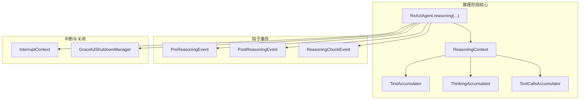
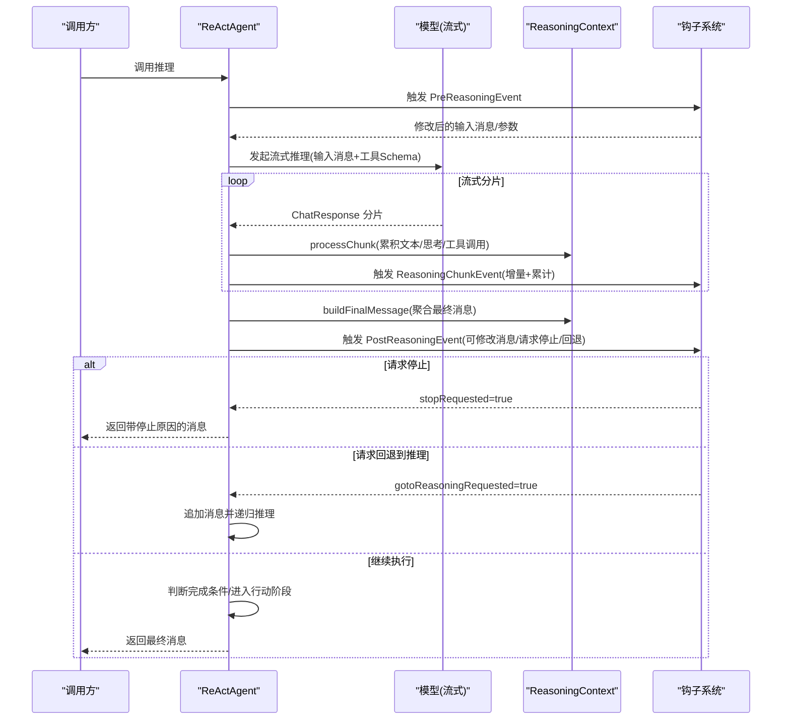
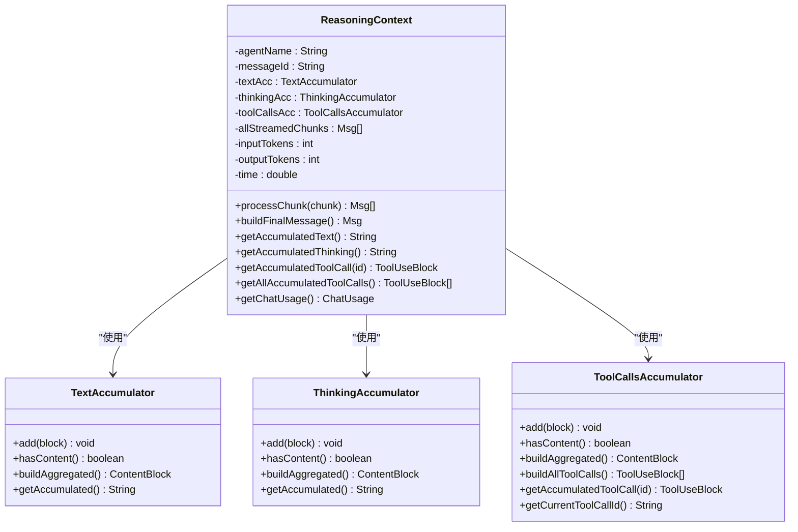
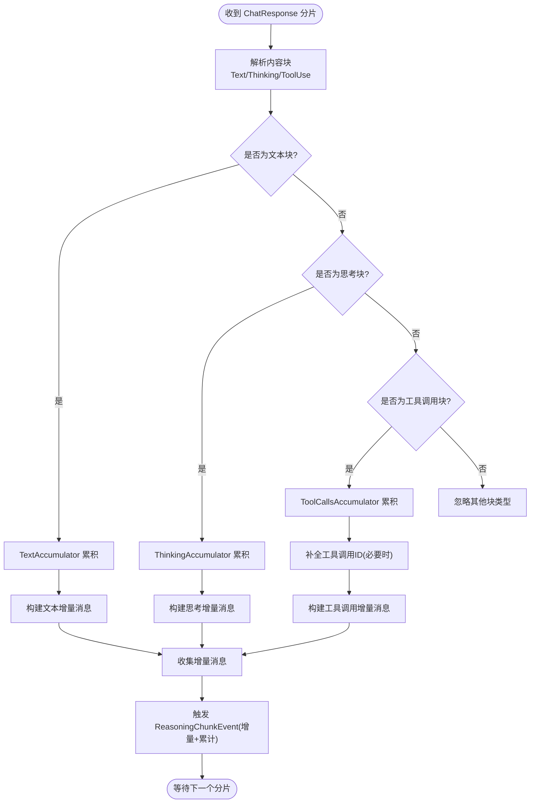
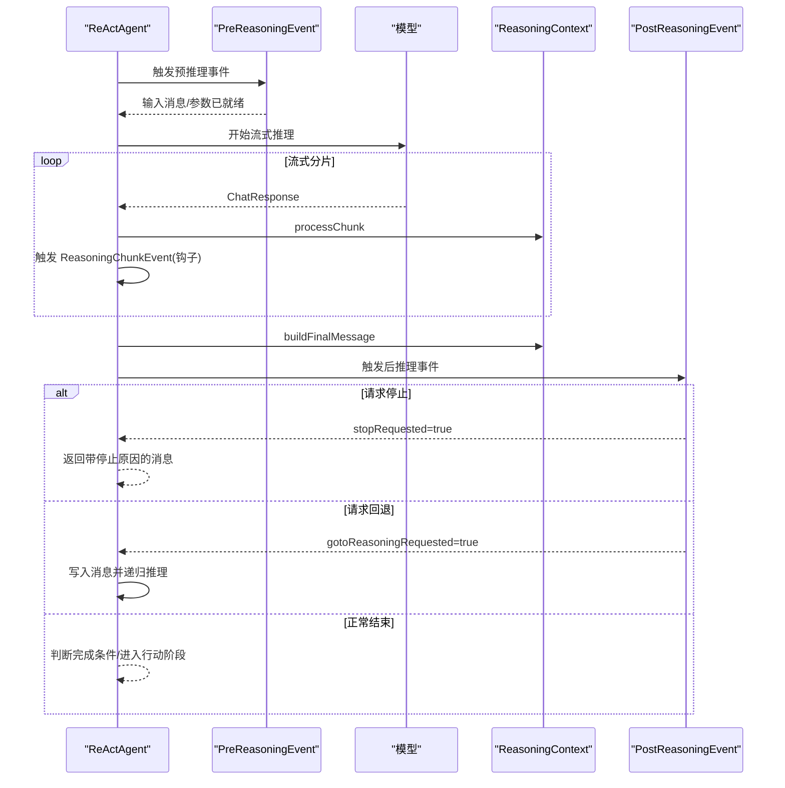
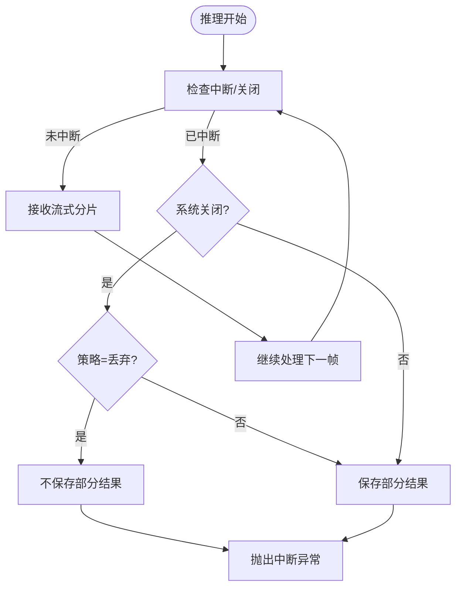
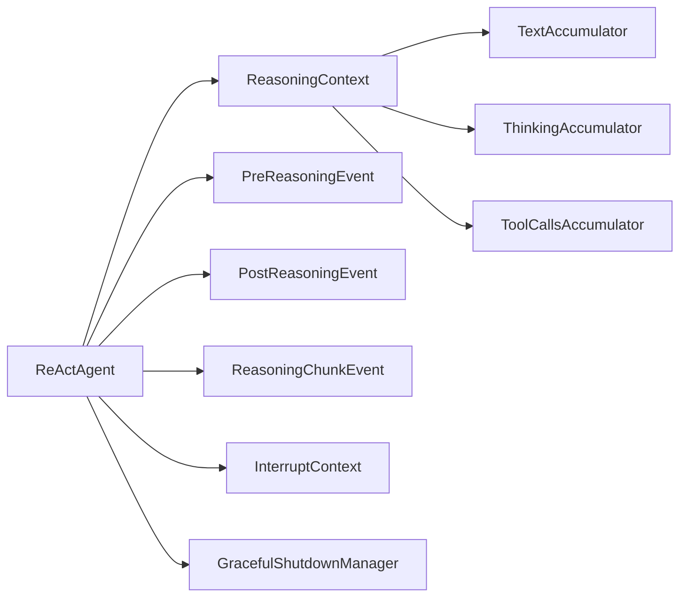

# 推理阶段实现

<cite>
**本文引用的文件**
- [ReActAgent.java](file://agentscope-core/src/main/java/io/agentscope/core/ReActAgent.java)
- [ReasoningContext.java](file://agentscope-core/src/main/java/io/agentscope/core/agent/accumulator/ReasoningContext.java)
- [TextAccumulator.java](file://agentscope-core/src/main/java/io/agentscope/core/agent/accumulator/TextAccumulator.java)
- [ThinkingAccumulator.java](file://agentscope-core/src/main/java/io/agentscope/core/agent/accumulator/ThinkingAccumulator.java)
- [ToolCallsAccumulator.java](file://agentscope-core/src/main/java/io/agentscope/core/agent/accumulator/ToolCallsAccumulator.java)
- [PreReasoningEvent.java](file://agentscope-core/src/main/java/io/agentscope/core/hook/PreReasoningEvent.java)
- [PostReasoningEvent.java](file://agentscope-core/src/main/java/io/agentscope/core/hook/PostReasoningEvent.java)
- [ReasoningChunkEvent.java](file://agentscope-core/src/main/java/io/agentscope/core/hook/ReasoningChunkEvent.java)
- [InterruptContext.java](file://agentscope-core/src/main/java/io/agentscope/core/interruption/InterruptContext.java)
- [GracefulShutdownManager.java](file://agentscope-core/src/main/java/io/agentscope/core/shutdown/GracefulShutdownManager.java)
- [AutoContextMemory.java](file://agentscope-extensions/agentscope-extensions-autocontext-memory/src/main/java/io/agentscope/core/memory/autocontext/AutoContextMemory.java)
</cite>

## 目录
1. [简介](#简介)
2. [项目结构](#项目结构)
3. [核心组件](#核心组件)
4. [架构总览](#架构总览)
5. [详细组件分析](#详细组件分析)
6. [依赖关系分析](#依赖关系分析)
7. [性能考虑](#性能考虑)
8. [故障排查指南](#故障排查指南)
9. [结论](#结论)

## 简介
本文件面向推理阶段（Reasoning Phase）的技术实现，系统性阐述以下主题：
- 消息构建：如何从模型流式响应中累积文本、思考与工具调用块，以及最终聚合消息的生成流程
- 模型调用：如何通过流式接口接收分片并进行中断检查与钩子通知
- 结果处理：如何在推理完成后对消息进行持久化、人类在环（HITL）停止与回退到推理等控制流
- ReasoningContext 的职责与数据累积过程：文本、思考、工具调用三类内容的累积器与最终消息构建
- 流式处理与事件通知机制：增量块与累计块的区分、ReasoningChunkEvent 的产生与传播
- 中断处理与优雅降级策略：用户中断、系统关闭、部分结果保存策略
- 配置选项与性能调优建议：生成参数、最大迭代次数、内存压缩等
- 常见问题排查与解决方案：空消息、工具调用校验失败、流式块拼接异常等

## 项目结构
推理阶段位于 agentscope-core 模块中，核心代码围绕 ReActAgent 的 reasoning 方法展开，配合 ReasoningContext 及其三大累积器完成消息累积与最终聚合；同时通过 PreReasoningEvent、PostReasoningEvent、ReasoningChunkEvent 等钩子事件实现可扩展的通知机制。

图表来源
- [ReActAgent.java:560-650](file://agentscope-core/src/main/java/io/agentscope/core/ReActAgent.java#L560-L650)
- [ReasoningContext.java:44-290](file://agentscope-core/src/main/java/io/agentscope/core/agent/accumulator/ReasoningContext.java#L44-L290)
- [TextAccumulator.java:27-78](file://agentscope-core/src/main/java/io/agentscope/core/agent/accumulator/TextAccumulator.java#L27-L78)
- [ThinkingAccumulator.java:28-79](file://agentscope-core/src/main/java/io/agentscope/core/agent/accumulator/ThinkingAccumulator.java#L28-L79)
- [ToolCallsAccumulator.java:40-306](file://agentscope-core/src/main/java/io/agentscope/core/agent/accumulator/ToolCallsAccumulator.java#L40-L306)
- [PreReasoningEvent.java:47-116](file://agentscope-core/src/main/java/io/agentscope/core/hook/PreReasoningEvent.java#L47-L116)
- [PostReasoningEvent.java:51-172](file://agentscope-core/src/main/java/io/agentscope/core/hook/PostReasoningEvent.java#L51-L172)
- [ReasoningChunkEvent.java:60-106](file://agentscope-core/src/main/java/io/agentscope/core/hook/ReasoningChunkEvent.java#L60-L106)
- [InterruptContext.java:40-190](file://agentscope-core/src/main/java/io/agentscope/core/interruption/InterruptContext.java#L40-L190)
- [GracefulShutdownManager.java:41-321](file://agentscope-core/src/main/java/io/agentscope/core/shutdown/GracefulShutdownManager.java#L41-L321)

章节来源
- [ReActAgent.java:560-650](file://agentscope-core/src/main/java/io/agentscope/core/ReActAgent.java#L560-L650)
- [ReasoningContext.java:44-290](file://agentscope-core/src/main/java/io/agentscope/core/agent/accumulator/ReasoningContext.java#L44-L290)

## 核心组件
- ReActAgent.reasoning：推理主流程，负责预推理事件通知、模型流式调用、分片处理、钩子通知、后推理事件、终止条件判断与后续阶段切换
- ReasoningContext：单轮推理的状态与累积容器，负责将 ChatResponse 分片转换为可立即通知的增量消息，并在结束时构建完整消息
- 三大累积器：
  - TextAccumulator：累积文本块，支持增量与累计两种模式
  - ThinkingAccumulator：累积思考块，支持增量与累计两种模式
  - ToolCallsAccumulator：累积工具调用块，支持多并发工具调用、片段合并、占位名处理与最终构建
- 钩子事件：
  - PreReasoningEvent：修改输入消息与生成参数
  - PostReasoningEvent：修改推理结果、请求停止或回退到推理
  - ReasoningChunkEvent：提供增量块与累计块，用于实时显示与进度监控

章节来源
- [ReActAgent.java:560-650](file://agentscope-core/src/main/java/io/agentscope/core/ReActAgent.java#L560-L650)
- [ReasoningContext.java:44-290](file://agentscope-core/src/main/java/io/agentscope/core/agent/accumulator/ReasoningContext.java#L44-L290)
- [TextAccumulator.java:27-78](file://agentscope-core/src/main/java/io/agentscope/core/agent/accumulator/TextAccumulator.java#L27-L78)
- [ThinkingAccumulator.java:28-79](file://agentscope-core/src/main/java/io/agentscope/core/agent/accumulator/ThinkingAccumulator.java#L28-L79)
- [ToolCallsAccumulator.java:40-306](file://agentscope-core/src/main/java/io/agentscope/core/agent/accumulator/ToolCallsAccumulator.java#L40-L306)
- [PreReasoningEvent.java:47-116](file://agentscope-core/src/main/java/io/agentscope/core/hook/PreReasoningEvent.java#L47-L116)
- [PostReasoningEvent.java:51-172](file://agentscope-core/src/main/java/io/agentscope/core/hook/PostReasoningEvent.java#L51-L172)
- [ReasoningChunkEvent.java:60-106](file://agentscope-core/src/main/java/io/agentscope/core/hook/ReasoningChunkEvent.java#L60-L106)

## 架构总览
推理阶段的控制流如下：

图表来源
- [ReActAgent.java:560-650](file://agentscope-core/src/main/java/io/agentscope/core/ReActAgent.java#L560-L650)
- [ReasoningContext.java:78-125](file://agentscope-core/src/main/java/io/agentscope/core/agent/accumulator/ReasoningContext.java#L78-L125)
- [PreReasoningEvent.java:47-116](file://agentscope-core/src/main/java/io/agentscope/core/hook/PreReasoningEvent.java#L47-L116)
- [PostReasoningEvent.java:51-172](file://agentscope-core/src/main/java/io/agentscope/core/hook/PostReasoningEvent.java#L51-L172)
- [ReasoningChunkEvent.java:60-106](file://agentscope-core/src/main/java/io/agentscope/core/hook/ReasoningChunkEvent.java#L60-L106)

## 详细组件分析

### ReasoningContext：状态与累积器
- 职责
  - 接收 ChatResponse 分片，按内容类型分别交给对应累积器
  - 生成增量消息用于实时通知（ReasoningChunkEvent）
  - 在推理结束时构建完整消息（包含文本、思考、工具调用块），并附带用量信息
- 数据累积过程
  - 文本/思考：直接拼接字符串，支持增量与累计两种模式
  - 工具调用：多并发支持，按 ID/名称/索引区分不同调用；片段合并与占位名处理；最终构建完整参数与内容
  - 用量统计：累计输入/输出 token 与耗时，随最终消息写入元数据
- 关键方法
  - processChunk：解析分片、更新累积器、生成增量消息列表
  - buildFinalMessage：聚合所有块，生成 Msg 并附带用量元数据
  - getAccumulatedText/getAccumulatedThinking/getAccumulatedToolCall：供钩子读取累计内容
  - enrichToolUseBlockWithId：修复片段块的工具调用 ID，便于正确拼接

图表来源
- [ReasoningContext.java:44-290](file://agentscope-core/src/main/java/io/agentscope/core/agent/accumulator/ReasoningContext.java#L44-L290)
- [TextAccumulator.java:27-78](file://agentscope-core/src/main/java/io/agentscope/core/agent/accumulator/TextAccumulator.java#L27-L78)
- [ThinkingAccumulator.java:28-79](file://agentscope-core/src/main/java/io/agentscope/core/agent/accumulator/ThinkingAccumulator.java#L28-L79)
- [ToolCallsAccumulator.java:40-306](file://agentscope-core/src/main/java/io/agentscope/core/agent/accumulator/ToolCallsAccumulator.java#L40-L306)

章节来源
- [ReasoningContext.java:44-290](file://agentscope-core/src/main/java/io/agentscope/core/agent/accumulator/ReasoningContext.java#L44-L290)
- [TextAccumulator.java:27-78](file://agentscope-core/src/main/java/io/agentscope/core/agent/accumulator/TextAccumulator.java#L27-L78)
- [ThinkingAccumulator.java:28-79](file://agentscope-core/src/main/java/io/agentscope/core/agent/accumulator/ThinkingAccumulator.java#L28-L79)
- [ToolCallsAccumulator.java:40-306](file://agentscope-core/src/main/java/io/agentscope/core/agent/accumulator/ToolCallsAccumulator.java#L40-L306)

### 流式处理与事件通知机制
- 增量块与累计块
  - 增量块：仅包含本次新增内容，适合追加式显示
  - 累计块：包含自推理开始以来的全部内容，适合替换式显示
- ReasoningChunkEvent
  - 提供 getIncrementalChunk 与 getAccumulated 两个访问器
  - 钩子可在实时 UI 中选择增量追加或累计替换
- 通知时机
  - 每个 ChatResponse 分片到达后，ReasoningContext 产出增量消息列表
  - ReActAgent 对每个增量消息触发 ReasoningChunkEvent 钩子

图表来源
- [ReActAgent.java:582-589](file://agentscope-core/src/main/java/io/agentscope/core/ReActAgent.java#L582-L589)
- [ReasoningContext.java:78-125](file://agentscope-core/src/main/java/io/agentscope/core/agent/accumulator/ReasoningContext.java#L78-L125)
- [ReasoningChunkEvent.java:60-106](file://agentscope-core/src/main/java/io/agentscope/core/hook/ReasoningChunkEvent.java#L60-L106)

章节来源
- [ReActAgent.java:582-589](file://agentscope-core/src/main/java/io/agentscope/core/ReActAgent.java#L582-L589)
- [ReasoningContext.java:78-125](file://agentscope-core/src/main/java/io/agentscope/core/agent/accumulator/ReasoningContext.java#L78-L125)
- [ReasoningChunkEvent.java:60-106](file://agentscope-core/src/main/java/io/agentscope/core/hook/ReasoningChunkEvent.java#L60-L106)

### 推理阶段主流程与结果处理
- 主流程要点
  - 预推理事件：允许钩子注入提示、修改输入消息与生成参数
  - 流式调用：concatMap 模式下每收到一个分片即进行中断检查
  - 分片处理：交由 ReasoningContext 累积并产出增量消息
  - 后推理事件：允许钩子修改最终消息、请求停止、或回退到推理
  - 终止条件：达到最大迭代次数、满足完成条件、或被请求停止
- 回退到推理（HITL）
  - PostReasoningEvent 支持 gotoReasoning 请求，携带 ToolResult 或提示消息
  - ReActAgent 校验 ToolResult 匹配后，将消息写入记忆并继续下一轮推理

图表来源
- [ReActAgent.java:560-650](file://agentscope-core/src/main/java/io/agentscope/core/ReActAgent.java#L560-L650)
- [PreReasoningEvent.java:47-116](file://agentscope-core/src/main/java/io/agentscope/core/hook/PreReasoningEvent.java#L47-L116)
- [PostReasoningEvent.java:51-172](file://agentscope-core/src/main/java/io/agentscope/core/hook/PostReasoningEvent.java#L51-L172)

章节来源
- [ReActAgent.java:560-650](file://agentscope-core/src/main/java/io/agentscope/core/ReActAgent.java#L560-L650)
- [PostReasoningEvent.java:51-172](file://agentscope-core/src/main/java/io/agentscope/core/hook/PostReasoningEvent.java#L51-L172)

### 中断处理与优雅降级策略
- 用户中断
  - ReActAgent 在每次分片处理前进行异步中断检查
  - 若捕获到 InterruptedException，根据系统关闭策略决定是否保存部分结果
- 系统关闭（优雅停机）
  - GracefulShutdownManager 全局管理关闭状态与超时信号
  - 在推理阶段捕获中断并根据配置策略（如 DISCARD）决定是否保存部分结果
  - 保存后重新抛出中断异常，确保上层正确处理

图表来源
- [ReActAgent.java:591-609](file://agentscope-core/src/main/java/io/agentscope/core/ReActAgent.java#L591-L609)
- [GracefulShutdownManager.java:180-266](file://agentscope-core/src/main/java/io/agentscope/core/shutdown/GracefulShutdownManager.java#L180-L266)
- [InterruptContext.java:40-190](file://agentscope-core/src/main/java/io/agentscope/core/interruption/InterruptContext.java#L40-L190)

章节来源
- [ReActAgent.java:591-609](file://agentscope-core/src/main/java/io/agentscope/core/ReActAgent.java#L591-L609)
- [GracefulShutdownManager.java:180-266](file://agentscope-core/src/main/java/io/agentscope/core/shutdown/GracefulShutdownManager.java#L180-L266)
- [InterruptContext.java:40-190](file://agentscope-core/src/main/java/io/agentscope/core/interruption/InterruptContext.java#L40-L190)

### 与自动上下文内存的集成
- AutoContextMemory 在大消息压缩场景中复用 ReasoningContext 的分片处理与最终消息构建能力
- 典型流程：构造压缩提示与消息列表 → 流式调用模型 → 使用 ReasoningContext 累积 → 构建压缩摘要消息

章节来源
- [AutoContextMemory.java:628-682](file://agentscope-extensions/agentscope-extensions-autocontext-memory/src/main/java/io/agentscope/core/memory/autocontext/AutoContextMemory.java#L628-L682)
- [AutoContextMemory.java:829-951](file://agentscope-extensions/agentscope-extensions-autocontext-memory/src/main/java/io/agentscope/core/memory/autocontext/AutoContextMemory.java#L829-L951)
- [AutoContextMemory.java:1722-1813](file://agentscope-extensions/agentscope-extensions-autocontext-memory/src/main/java/io/agentscope/core/memory/autocontext/AutoContextMemory.java#L1722-L1813)

## 依赖关系分析
- ReActAgent 依赖 ReasoningContext 完成消息累积与聚合
- ReasoningContext 依赖三大累积器完成不同内容类型的累积
- ReActAgent 通过钩子事件与外部系统解耦，支持扩展与观测
- 中断与关闭通过 InterruptContext 与 GracefulShutdownManager 实现全局统一管理

图表来源
- [ReActAgent.java:560-650](file://agentscope-core/src/main/java/io/agentscope/core/ReActAgent.java#L560-L650)
- [ReasoningContext.java:44-290](file://agentscope-core/src/main/java/io/agentscope/core/agent/accumulator/ReasoningContext.java#L44-L290)
- [TextAccumulator.java:27-78](file://agentscope-core/src/main/java/io/agentscope/core/agent/accumulator/TextAccumulator.java#L27-L78)
- [ThinkingAccumulator.java:28-79](file://agentscope-core/src/main/java/io/agentscope/core/agent/accumulator/ThinkingAccumulator.java#L28-L79)
- [ToolCallsAccumulator.java:40-306](file://agentscope-core/src/main/java/io/agentscope/core/agent/accumulator/ToolCallsAccumulator.java#L40-L306)
- [PreReasoningEvent.java:47-116](file://agentscope-core/src/main/java/io/agentscope/core/hook/PreReasoningEvent.java#L47-L116)
- [PostReasoningEvent.java:51-172](file://agentscope-core/src/main/java/io/agentscope/core/hook/PostReasoningEvent.java#L51-L172)
- [ReasoningChunkEvent.java:60-106](file://agentscope-core/src/main/java/io/agentscope/core/hook/ReasoningChunkEvent.java#L60-L106)
- [InterruptContext.java:40-190](file://agentscope-core/src/main/java/io/agentscope/core/interruption/InterruptContext.java#L40-L190)
- [GracefulShutdownManager.java:41-321](file://agentscope-core/src/main/java/io/agentscope/core/shutdown/GracefulShutdownManager.java#L41-L321)

## 性能考虑
- 流式处理
  - 使用 concatMap 保证顺序与中断点插入，避免阻塞主线程
  - ReasoningChunkEvent 的增量/累计双通道设计，减少 UI 重绘成本
- 工具调用累积
  - 多并发工具调用通过 ID/名称/索引区分，避免串扰
  - 片段合并与占位名处理提升拼接鲁棒性
- 记忆与压缩
  - AutoContextMemory 在压缩场景中复用 ReasoningContext，降低重复逻辑
  - 建议合理设置压缩比例与阈值，平衡吞吐与上下文保留
- 生成参数
  - 通过 PreReasoningEvent/PostReasoningEvent 动态调整生成参数（如 tool_choice），减少无效输出

## 故障排查指南
- 无消息返回
  - 检查 ReasoningContext 是否有内容（hasContent），若为空则 buildFinalMessage 返回 null
  - 确认模型确实返回了有效内容块
- 工具调用校验失败
  - PostReasoningEvent.gotoReasoning 会校验 ToolResult 与 ToolUse 的匹配
  - 若存在待执行工具调用，必须先提供匹配的 ToolResult 才能回退到推理
- 流式块拼接异常
  - 片段块可能缺少 ID，需通过 ReasoningContext.enrichToolUseBlockWithId 补全
  - 占位名（如 "__fragment__"）应正确映射到最后一次工具调用键
- 中断与关闭
  - 若系统关闭且策略为丢弃部分结果，需确认业务侧是否接受该行为
  - 检查 GracefulShutdownManager 的超时与强制中断逻辑

章节来源
- [PostReasoningEvent.java:150-153](file://agentscope-core/src/main/java/io/agentscope/core/hook/PostReasoningEvent.java#L150-L153)
- [ReasoningContext.java:211-231](file://agentscope-core/src/main/java/io/agentscope/core/agent/accumulator/ReasoningContext.java#L211-L231)
- [GracefulShutdownManager.java:232-266](file://agentscope-core/src/main/java/io/agentscope/core/shutdown/GracefulShutdownManager.java#L232-L266)

## 结论
推理阶段通过 ReasoningContext 将模型流式响应转化为可实时消费的消息，并在结束后聚合为完整消息。借助钩子事件体系，系统实现了高度可扩展的观测与控制能力；结合中断与优雅停机机制，保障了在复杂场景下的稳定性与可控性。通过合理的配置与调优，可在延迟、吞吐与上下文质量之间取得良好平衡。