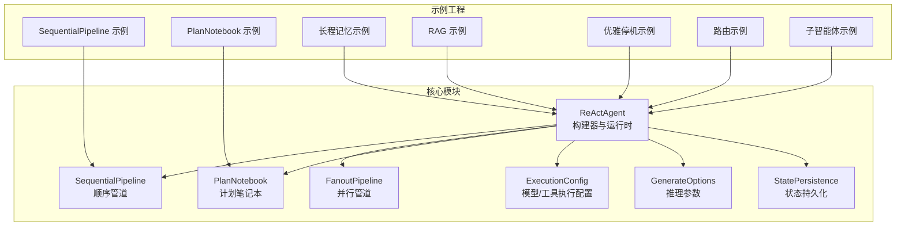
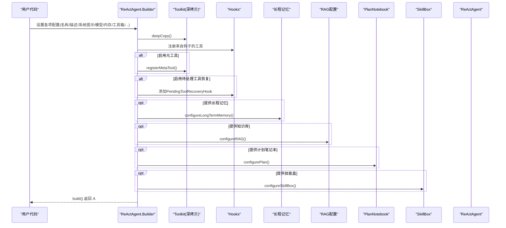
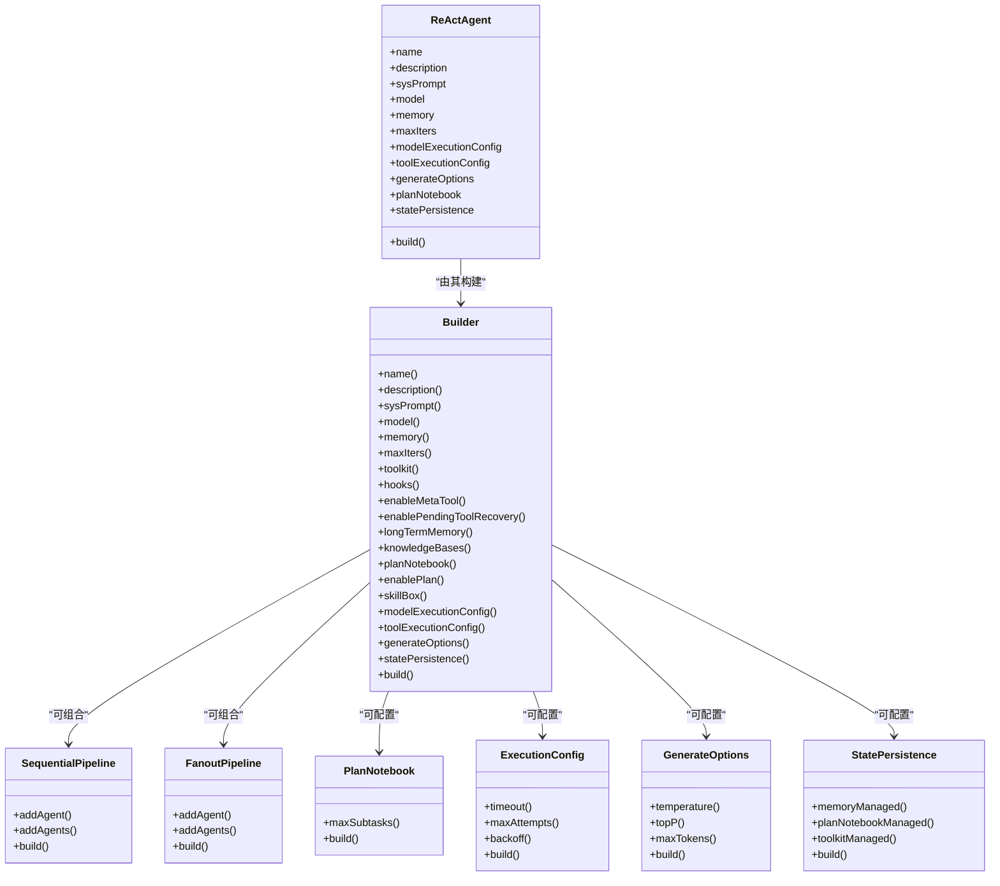
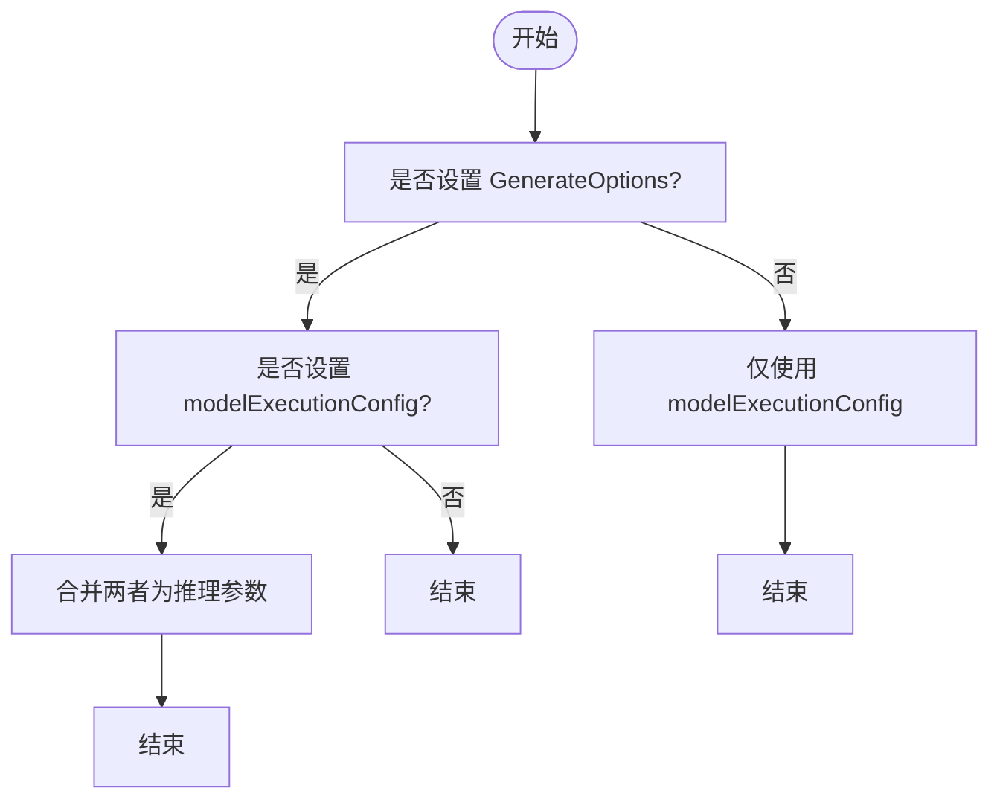
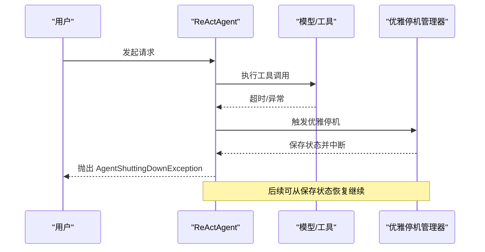
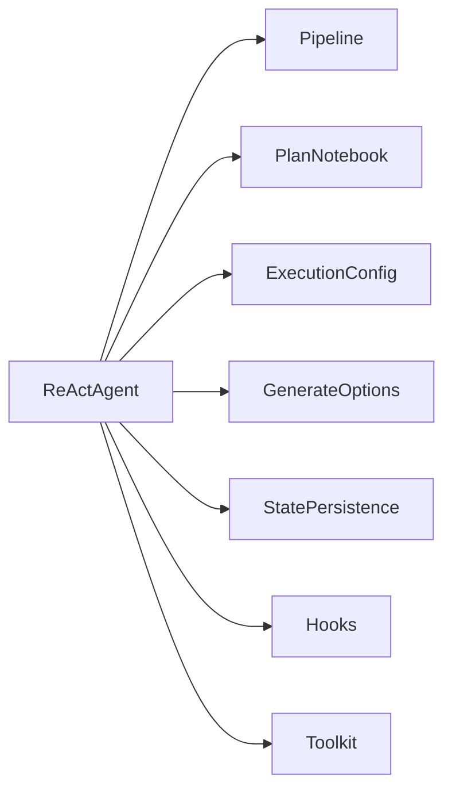

# 构建器模式与配置

<cite>
**本文引用的文件**
- [ReActAgent.java](file://agentscope-core/src/main/java/io/agentscope/core/ReActAgent.java)
- [agent-config.md](file://docs/en/task/agent-config.md)
- [SequentialPipeline.java](file://agentscope-core/src/main/java/io/agentscope/core/pipeline/SequentialPipeline.java)
- [FanoutPipeline.java](file://agentscope-core/src/main/java/io/agentscope/core/pipeline/FanoutPipeline.java)
- [PlanNotebook.java](file://agentscope-core/src/main/java/io/agentscope/core/plan/PlanNotebook.java)
- [ExecutionConfig.java](file://agentscope-core/src/main/java/io/agentscope/core/model/ExecutionConfig.java)
- [GenerateOptions.java](file://agentscope-core/src/main/java/io/agentscope/core/model/GenerateOptions.java)
- [StatePersistence.java](file://agentscope-core/src/main/java/io/agentscope/core/state/StatePersistence.java)
- [ReActAgentPlanIntegrationTest.java](file://agentscope-core/src/test/java/io/agentscope/core/agent/ReActAgentPlanIntegrationTest.java)
- [ReActAgentGenerateOptionsTest.java](file://agentscope-core/src/test/java/io/agentscope/core/agent/ReActAgentGenerateOptionsTest.java)
- [ReActAgentTimeoutTest.java](file://agentscope-core/src/test/java/io/agentscope/core/agent/ReActAgentTimeoutTest.java)
- [ReActAgentRuntimeContextTest.java](file://agentscope-core/src/test/java/io/agentscope/core/agent/ReActAgentRuntimeContextTest.java)
- [HookStopAgentTest.java](file://agentscope-core/src/test/java/io/agentscope/core/hook/HookStopAgentTest.java)
- [SequentialPipelineExample.java](file://agentscope-examples/quickstart/src/main/java/io/agentscope/examples/quickstart/SequentialPipelineExample.java)
- [PlanNotebookExample.java](file://agentscope-examples/quickstart/src/main/java/io/agentscope/examples/quickstart/PlanNotebookExample.java)
- [BailianMemoryExample.java](file://agentscope-examples/advanced/src/main/java/io/agentscope/examples/advanced/BailianMemoryExample.java)
- [GracefulShutdownExample.java](file://agentscope-examples/graceful-shutdown/src/main/java/io/agentscope/examples/shutdown/smoke/GracefulShutdownExample.java)
- [RoutingGraphConfig.java](file://agentscope-examples/multiagent-patterns/routing/src/main/java/io/agentscope/examples/routing/graph/RoutingGraphConfig.java)
- [ElasticsearchRAGExample.java](file://agentscope-examples/advanced/src/main/java/io/agentscope/examples/advanced/ElasticsearchRAGExample.java)
- [AgentScopeRunner.java](file://agentscope-examples/boba-tea-shop/business-sub-agent/src/main/java/io/agentscope/examples/bobatea/business/config/AgentScopeRunner.java)
- [SubAgentProvider.java](file://agentscope-core/src/main/java/io/agentscope/core/tool/subagent/SubAgentProvider.java)
- [SubAgentTool.java](file://agentscope-core/src/main/java/io/agentscope/core/tool/subagent/SubAgentTool.java)
- [HarnessAgent.java](file://agentscope-harness/src/main/java/io/agentscope/harness/agent/HarnessAgent.java)
- [AgentscopeAutoConfiguration.java](file://agentscope-extensions/agentscope-spring-boot-starters/agentscope-spring-boot-starter/src/main/java/io/agentscope/spring/boot/AgentscopeAutoConfiguration.java)
- [AgentscopeNacosReActAgentAutoConfiguration.java](file://agentscope-extensions/agentscope-spring-boot-starters/agentscope-nacos-spring-boot-starter/src/main/java/io/agentscope/spring/boot/nacos/AgentscopeNacosReActAgentAutoConfiguration.java)
- [BaseReActAgentRunner.java](file://agentscope-extensions/agentscope-extensions-a2a/agentscope-extensions-a2a-server/src/main/java/io/agentscope/core/a2a/server/executor/runner/BaseReActAgentRunner.java)
- [ReActAgentWithBuilderRunner.java](file://agentscope-extensions/agentscope-extensions-a2a/agentscope-extensions-a2a-server/src/main/java/io/agentscope/core/a2a/server/executor/runner/ReActAgentWithBuilderRunner.java)
</cite>

## 目录
1. [简介](#简介)
2. [项目结构](#项目结构)
3. [核心组件](#核心组件)
4. [架构总览](#架构总览)
5. [详细组件分析](#详细组件分析)
6. [依赖分析](#依赖分析)
7. [性能考虑](#性能考虑)
8. [故障排查指南](#故障排查指南)
9. [结论](#结论)
10. [附录](#附录)

## 简介
本文件围绕 ReAct 智能体的“构建器模式”进行系统化说明，重点阐述：
- 构建器模式在 ReActAgent 中的实现原理与使用方法
- 所有可配置项（名称、描述、系统提示、最大迭代次数、执行配置、工具执行配置、生成参数、计划管理、长程记忆、RAG、技能盒、状态持久化等）的语义、默认值、取值范围与相互约束
- 配置验证与错误处理机制
- 最佳实践与常见配置模式
- 通过序列图、类图、流程图展示关键调用链路与数据流

## 项目结构
ReActAgent 的构建器位于核心模块中，配合管道（SequentialPipeline、FanoutPipeline）、计划（PlanNotebook）、执行配置（ExecutionConfig、GenerateOptions）、状态持久化（StatePersistence）等组件协同工作；示例工程展示了多种典型配置场景。

图表来源
- [ReActAgent.java](file://agentscope-core/src/main/java/io/agentscope/core/ReActAgent.java)
- [SequentialPipeline.java](file://agentscope-core/src/main/java/io/agentscope/core/pipeline/SequentialPipeline.java)
- [FanoutPipeline.java](file://agentscope-core/src/main/java/io/agentscope/core/pipeline/FanoutPipeline.java)
- [PlanNotebook.java](file://agentscope-core/src/main/java/io/agentscope/core/plan/PlanNotebook.java)
- [ExecutionConfig.java](file://agentscope-core/src/main/java/io/agentscope/core/model/ExecutionConfig.java)
- [GenerateOptions.java](file://agentscope-core/src/main/java/io/agentscope/core/model/GenerateOptions.java)
- [StatePersistence.java](file://agentscope-core/src/main/java/io/agentscope/core/state/StatePersistence.java)
- [SequentialPipelineExample.java](file://agentscope-examples/quickstart/src/main/java/io/agentscope/examples/quickstart/SequentialPipelineExample.java)
- [PlanNotebookExample.java](file://agentscope-examples/quickstart/src/main/java/io/agentscope/examples/quickstart/PlanNotebookExample.java)
- [BailianMemoryExample.java](file://agentscope-examples/advanced/src/main/java/io/agentscope/examples/advanced/BailianMemoryExample.java)
- [ElasticsearchRAGExample.java](file://agentscope-examples/advanced/src/main/java/io/agentscope/examples/advanced/ElasticsearchRAGExample.java)
- [GracefulShutdownExample.java](file://agentscope-examples/graceful-shutdown/src/main/java/io/agentscope/examples/shutdown/smoke/GracefulShutdownExample.java)
- [RoutingGraphConfig.java](file://agentscope-examples/multiagent-patterns/routing/src/main/java/io/agentscope/examples/routing/graph/RoutingGraphConfig.java)

章节来源
- [ReActAgent.java](file://agentscope-core/src/main/java/io/agentscope/core/ReActAgent.java)
- [SequentialPipeline.java](file://agentscope-core/src/main/java/io/agentscope/core/pipeline/SequentialPipeline.java)
- [FanoutPipeline.java](file://agentscope-core/src/main/java/io/agentscope/core/pipeline/FanoutPipeline.java)

## 核心组件
- ReActAgent 构建器：提供 fluent API，支持链式配置并最终产出 ReActAgent 实例。构建过程中会深拷贝 Toolkit、注册钩子与工具、按需启用元工具、挂载长程记忆/RAG/计划/技能盒，并设置状态持久化策略。
- SequentialPipeline/FanoutPipeline：提供多智能体编排能力，支持顺序或并行执行，可自定义调度器。
- PlanNotebook：用于复杂任务的计划管理，支持子任务上限、自动注册计划相关工具等。
- ExecutionConfig/GenerateOptions：分别控制模型请求与工具调用的超时、重试、退避策略，以及推理阶段的温度、采样参数等。
- StatePersistence：控制保存/加载时对内存、计划笔记本、工具箱等组件的管理粒度。
- Hooks/工具系统：通过钩子扩展行为（如自动恢复待处理工具调用），通过工具注册实现能力扩展。

章节来源
- [ReActAgent.java](file://agentscope-core/src/main/java/io/agentscope/core/ReActAgent.java)
- [SequentialPipeline.java](file://agentscope-core/src/main/java/io/agentscope/core/pipeline/SequentialPipeline.java)
- [FanoutPipeline.java](file://agentscope-core/src/main/java/io/agentscope/core/pipeline/FanoutPipeline.java)
- [PlanNotebook.java](file://agentscope-core/src/main/java/io/agentscope/core/plan/PlanNotebook.java)
- [ExecutionConfig.java](file://agentscope-core/src/main/java/io/agentscope/core/model/ExecutionConfig.java)
- [GenerateOptions.java](file://agentscope-core/src/main/java/io/agentscope/core/model/GenerateOptions.java)
- [StatePersistence.java](file://agentscope-core/src/main/java/io/agentscope/core/state/StatePersistence.java)

## 架构总览
下图展示 ReActAgent 构建器的关键调用链与内部装配逻辑：

图表来源
- [ReActAgent.java](file://agentscope-core/src/main/java/io/agentscope/core/ReActAgent.java)

章节来源
- [ReActAgent.java](file://agentscope-core/src/main/java/io/agentscope/core/ReActAgent.java)

## 详细组件分析

### ReActAgent 构建器与配置项详解
- 基本属性
  - 名称：智能体标识，用于日志与会话管理
  - 描述：智能体用途说明
  - 系统提示：推理阶段注入的系统消息种子
  - 最大迭代次数：防止无限循环，超过阈值可触发总结
- 运行时组件
  - 模型：对话/推理后端
  - 内存：消息历史存储
  - 工具箱：工具注册与分组
  - 钩子：事件拦截与扩展点
  - 结构化输出提醒：控制结构化输出行为
- 执行配置
  - modelExecutionConfig：模型请求的超时、重试、退避策略
  - toolExecutionConfig：工具调用的超时、重试策略
  - generateOptions：推理阶段的温度、采样参数等
- 计划与技能
  - enablePlan()/planNotebook：启用计划功能并配置子任务上限等
  - skillBox：技能盒集成
- 长程记忆与检索增强
  - longTermMemory：接入外部长程记忆服务
  - knowledgeBases：知识库集合，自动配置 RAG
- 状态持久化
  - statePersistence：控制哪些组件参与保存/加载

章节来源
- [ReActAgent.java](file://agentscope-core/src/main/java/io/agentscope/core/ReActAgent.java)
- [agent-config.md](file://docs/en/task/agent-config.md)

### 配置项相互关系与约束
- 工具与钩子：钩子可动态注册工具到 Toolkit；若启用元工具，将在构建时统一注册
- 计划与技能：启用计划时会自动注册计划相关工具；技能盒与计划可并存
- 长程记忆与 RAG：二者独立配置；RAG 会根据知识库自动注入检索工具
- 超时与重试：模型与工具分别有独立的 ExecutionConfig；工具执行通常不重试以避免副作用
- 状态持久化：默认全量保存，可通过 StatePersistence 控制粒度

章节来源
- [ReActAgent.java](file://agentscope-core/src/main/java/io/agentscope/core/ReActAgent.java)
- [StatePersistence.java](file://agentscope-core/src/main/java/io/agentscope/core/state/StatePersistence.java)

### 配置验证与错误处理
- 构建期校验：构建器会在 build() 中完成工具复制、钩子注册、可选功能装配，必要时抛出异常
- 运行期校验：超时测试覆盖模型与工具执行超时；钩子测试覆盖停止与恢复逻辑
- 优雅停机：示例演示了在工具执行超时、推理超时等场景下的优雅停机与恢复

章节来源
- [ReActAgentTimeoutTest.java](file://agentscope-core/src/test/java/io/agentscope/core/agent/ReActAgentTimeoutTest.java)
- [HookStopAgentTest.java](file://agentscope-core/src/test/java/io/agentscope/core/hook/HookStopAgentTest.java)
- [GracefulShutdownExample.java](file://agentscope-examples/graceful-shutdown/src/main/java/io/agentscope/examples/shutdown/smoke/GracefulShutdownExample.java)

### 使用示例与最佳实践
- 基础聊天：最小配置仅需名称、模型与内存
- 多智能体编排：使用 SequentialPipeline 或 FanoutPipeline 组合多个 ReActAgent
- 计划管理：通过 enablePlan() 或自定义 PlanNotebook 管理复杂任务
- 长程记忆：结合 Bailian 等服务实现跨轮次记忆
- RAG：通过知识库自动注入检索工具，支持通用/代理两种模式
- 子智能体：通过 SubAgentProvider 在工具调用中按需创建新实例
- Spring Boot 自动装配：通过 Starter 与 Nacos Prompt 自动创建 ReActAgent
- A2A 服务：通过 Runner 将 Builder 产物暴露为远程服务

章节来源
- [SequentialPipelineExample.java](file://agentscope-examples/quickstart/src/main/java/io/agentscope/examples/quickstart/SequentialPipelineExample.java)
- [PlanNotebookExample.java](file://agentscope-examples/quickstart/src/main/java/io/agentscope/examples/quickstart/PlanNotebookExample.java)
- [BailianMemoryExample.java](file://agentscope-examples/advanced/src/main/java/io/agentscope/examples/advanced/BailianMemoryExample.java)
- [ElasticsearchRAGExample.java](file://agentscope-examples/advanced/src/main/java/io/agentscope/examples/advanced/ElasticsearchRAGExample.java)
- [RoutingGraphConfig.java](file://agentscope-examples/multiagent-patterns/routing/src/main/java/io/agentscope/examples/routing/graph/RoutingGraphConfig.java)
- [SubAgentProvider.java](file://agentscope-core/src/main/java/io/agentscope/core/tool/subagent/SubAgentProvider.java)
- [AgentscopeAutoConfiguration.java](file://agentscope-extensions/agentscope-spring-boot-starters/agentscope-spring-boot-starter/src/main/java/io/agentscope/spring/boot/AgentscopeAutoConfiguration.java)
- [AgentscopeNacosReActAgentAutoConfiguration.java](file://agentscope-extensions/agentscope-spring-boot-starters/agentscope-nacos-spring-boot-starter/src/main/java/io/agentscope/spring/boot/nacos/AgentscopeNacosReActAgentAutoConfiguration.java)
- [BaseReActAgentRunner.java](file://agentscope-extensions/agentscope-extensions-a2a/agentscope-extensions-a2a-server/src/main/java/io/agentscope/core/a2a/server/executor/runner/BaseReActAgentRunner.java)
- [ReActAgentWithBuilderRunner.java](file://agentscope-extensions/agentscope-extensions-a2a/agentscope-extensions-a2a-server/src/main/java/io/agentscope/core/a2a/server/executor/runner/ReActAgentWithBuilderRunner.java)

### 类图：ReActAgent 构建器与关键依赖

图表来源
- [ReActAgent.java](file://agentscope-core/src/main/java/io/agentscope/core/ReActAgent.java)
- [SequentialPipeline.java](file://agentscope-core/src/main/java/io/agentscope/core/pipeline/SequentialPipeline.java)
- [FanoutPipeline.java](file://agentscope-core/src/main/java/io/agentscope/core/pipeline/FanoutPipeline.java)
- [PlanNotebook.java](file://agentscope-core/src/main/java/io/agentscope/core/plan/PlanNotebook.java)
- [ExecutionConfig.java](file://agentscope-core/src/main/java/io/agentscope/core/model/ExecutionConfig.java)
- [GenerateOptions.java](file://agentscope-core/src/main/java/io/agentscope/core/model/GenerateOptions.java)
- [StatePersistence.java](file://agentscope-core/src/main/java/io/agentscope/core/state/StatePersistence.java)

### 流程图：推理阶段参数合并与注入

图表来源
- [ReActAgent.java](file://agentscope-core/src/main/java/io/agentscope/core/ReActAgent.java)
- [agent-config.md](file://docs/en/task/agent-config.md)

### 序列图：工具执行超时与优雅停机

图表来源
- [GracefulShutdownExample.java](file://agentscope-examples/graceful-shutdown/src/main/java/io/agentscope/examples/shutdown/smoke/GracefulShutdownExample.java)

## 依赖分析
- ReActAgent 与管道：通过 SequentialPipeline/FanoutPipeline 组合多个 ReActAgent，实现多智能体协作
- ReActAgent 与计划：PlanNotebook 提供计划工具与子任务管理
- ReActAgent 与执行配置：ExecutionConfig 控制模型与工具调用的超时与重试
- ReActAgent 与状态持久化：StatePersistence 控制保存/加载的组件范围
- ReActAgent 与钩子/工具：钩子可动态注册工具，工具可触发子智能体创建

图表来源
- [ReActAgent.java](file://agentscope-core/src/main/java/io/agentscope/core/ReActAgent.java)
- [SequentialPipeline.java](file://agentscope-core/src/main/java/io/agentscope/core/pipeline/SequentialPipeline.java)
- [FanoutPipeline.java](file://agentscope-core/src/main/java/io/agentscope/core/pipeline/FanoutPipeline.java)
- [PlanNotebook.java](file://agentscope-core/src/main/java/io/agentscope/core/plan/PlanNotebook.java)
- [ExecutionConfig.java](file://agentscope-core/src/main/java/io/agentscope/core/model/ExecutionConfig.java)
- [GenerateOptions.java](file://agentscope-core/src/main/java/io/agentscope/core/model/GenerateOptions.java)
- [StatePersistence.java](file://agentscope-core/src/main/java/io/agentscope/core/state/StatePersistence.java)

章节来源
- [ReActAgent.java](file://agentscope-core/src/main/java/io/agentscope/core/ReActAgent.java)
- [SequentialPipeline.java](file://agentscope-core/src/main/java/io/agentscope/core/pipeline/SequentialPipeline.java)
- [FanoutPipeline.java](file://agentscope-core/src/main/java/io/agentscope/core/pipeline/FanoutPipeline.java)

## 性能考虑
- 并行执行：FanoutPipeline 支持并发执行多个 ReActAgent，提高吞吐
- 超时与重试：合理设置 modelExecutionConfig 与 toolExecutionConfig，避免阻塞与资源浪费
- 计划与压缩：结合 AutoContextMemory 等机制减少上下文长度，提升响应速度
- 状态持久化：选择合适的 StatePersistence，平衡保存开销与恢复能力

## 故障排查指南
- 构建失败：检查必填项（模型、内存、工具箱）是否正确设置
- 工具执行超时：调整 toolExecutionConfig.timeout；确认工具本身耗时特性
- 推理超时：调整 modelExecutionConfig.timeout；检查网络与后端稳定性
- 待处理工具恢复：启用 enablePendingToolRecovery，确保在异常情况下自动清理并恢复
- 优雅停机异常：捕获 AgentShuttingDownException 并从保存状态恢复

章节来源
- [ReActAgentTimeoutTest.java](file://agentscope-core/src/test/java/io/agentscope/core/agent/ReActAgentTimeoutTest.java)
- [HookStopAgentTest.java](file://agentscope-core/src/test/java/io/agentscope/core/hook/HookStopAgentTest.java)
- [GracefulShutdownExample.java](file://agentscope-examples/graceful-shutdown/src/main/java/io/agentscope/examples/shutdown/smoke/GracefulShutdownExample.java)

## 结论
ReActAgent 的构建器模式提供了清晰、可组合的配置方式，配合管道、计划、执行配置、状态持久化等组件，能够覆盖从简单聊天到复杂多智能体协作的广泛场景。通过合理的配置与最佳实践，可在保证稳定性的同时获得良好的性能与可维护性。

## 附录
- 常见配置模式
  - 基础聊天：仅设置名称、模型、内存
  - 多智能体编排：SequentialPipeline/FanoutPipeline 组合
  - 计划管理：enablePlan()/planNotebook
  - 长程记忆：longTermMemory + LongTermMemoryMode
  - RAG：knowledgeBases + 检索工具
  - 子智能体：SubAgentProvider + 工具调用
  - Spring Boot/Nacos：自动装配与提示注入
  - A2A 服务：Runner 包装构建器产物

章节来源
- [SequentialPipelineExample.java](file://agentscope-examples/quickstart/src/main/java/io/agentscope/examples/quickstart/SequentialPipelineExample.java)
- [PlanNotebookExample.java](file://agentscope-examples/quickstart/src/main/java/io/agentscope/examples/quickstart/PlanNotebookExample.java)
- [BailianMemoryExample.java](file://agentscope-examples/advanced/src/main/java/io/agentscope/examples/advanced/BailianMemoryExample.java)
- [ElasticsearchRAGExample.java](file://agentscope-examples/advanced/src/main/java/io/agentscope/examples/advanced/ElasticsearchRAGExample.java)
- [RoutingGraphConfig.java](file://agentscope-examples/multiagent-patterns/routing/src/main/java/io/agentscope/examples/routing/graph/RoutingGraphConfig.java)
- [SubAgentProvider.java](file://agentscope-core/src/main/java/io/agentscope/core/tool/subagent/SubAgentProvider.java)
- [AgentscopeAutoConfiguration.java](file://agentscope-extensions/agentscope-spring-boot-starters/agentscope-spring-boot-starter/src/main/java/io/agentscope/spring/boot/AgentscopeAutoConfiguration.java)
- [AgentscopeNacosReActAgentAutoConfiguration.java](file://agentscope-extensions/agentscope-spring-boot-starters/agentscope-nacos-spring-boot-starter/src/main/java/io/agentscope/spring/boot/nacos/AgentscopeNacosReActAgentAutoConfiguration.java)
- [BaseReActAgentRunner.java](file://agentscope-extensions/agentscope-extensions-a2a/agentscope-extensions-a2a-server/src/main/java/io/agentscope/core/a2a/server/executor/runner/BaseReActAgentRunner.java)
- [ReActAgentWithBuilderRunner.java](file://agentscope-extensions/agentscope-extensions-a2a/agentscope-extensions-a2a-server/src/main/java/io/agentscope/core/a2a/server/executor/runner/ReActAgentWithBuilderRunner.java)