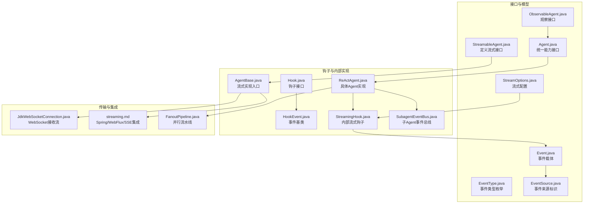
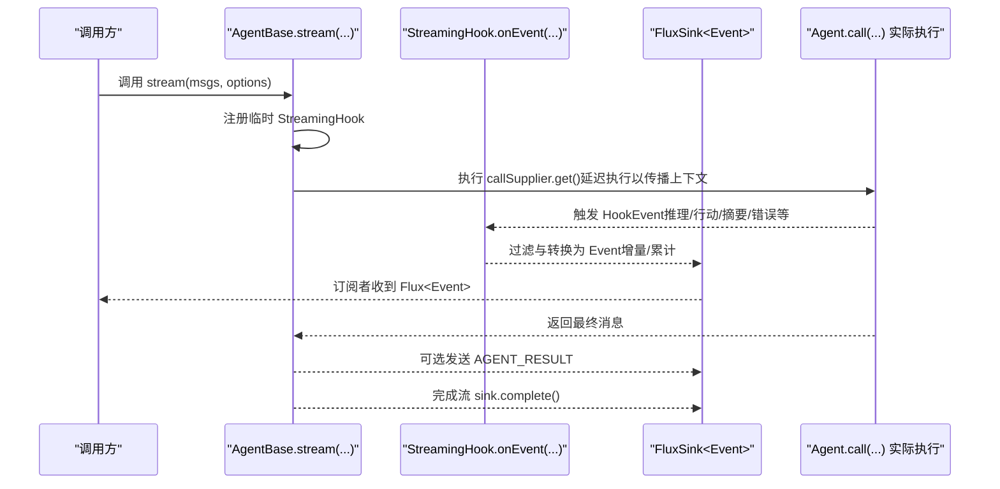
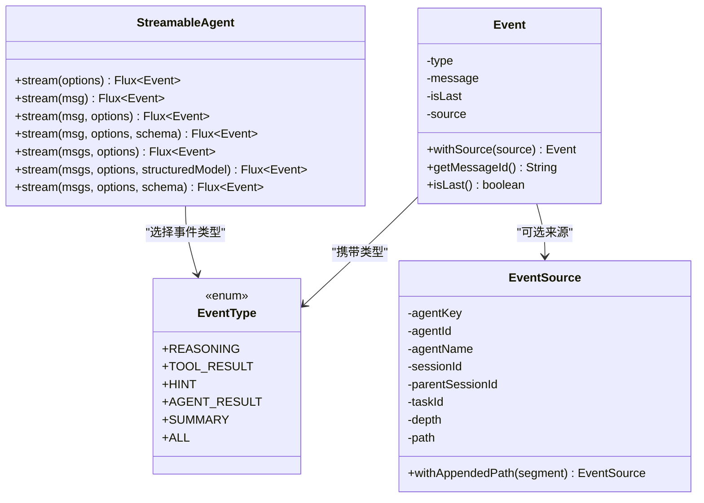
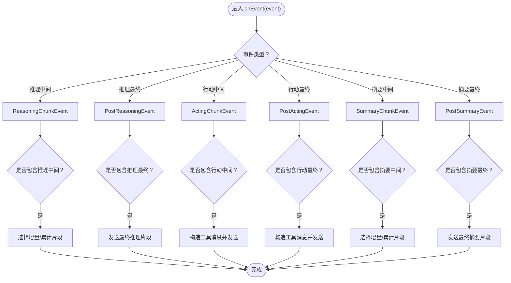
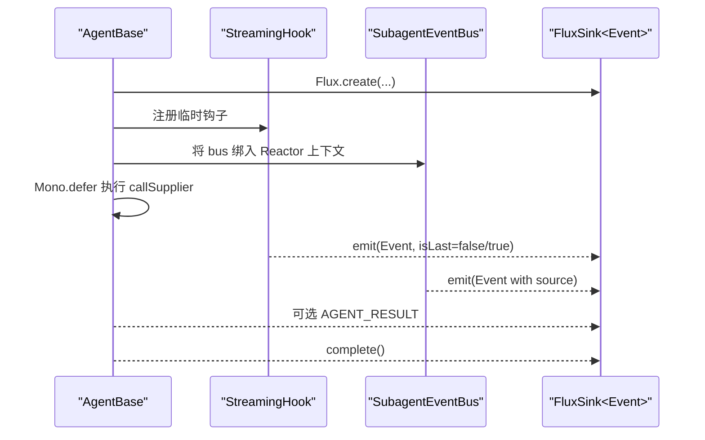
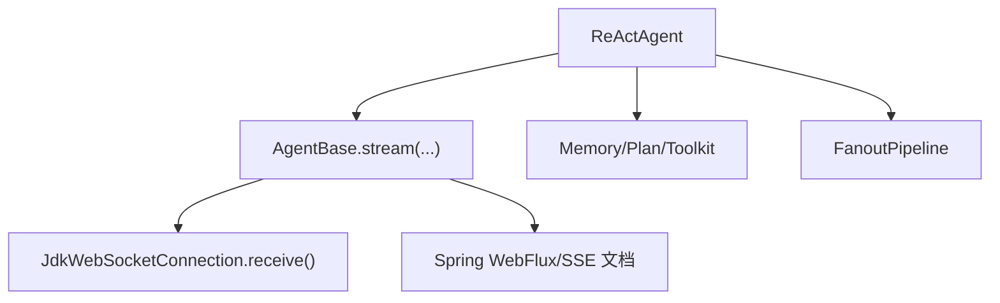
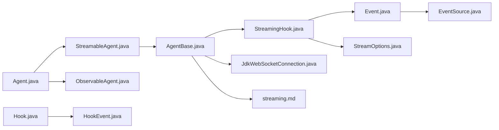

# 流式处理与事件

<cite>
**本文引用的文件**
- [StreamableAgent.java](file://agentscope-core/src/main/java/io/agentscope/core/agent/StreamableAgent.java)
- [StreamingHook.java](file://agentscope-core/src/main/java/io/agentscope/core/agent/StreamingHook.java)
- [Event.java](file://agentscope-core/src/main/java/io/agentscope/core/agent/Event.java)
- [EventType.java](file://agentscope-core/src/main/java/io/agentscope/core/agent/EventType.java)
- [ObservableAgent.java](file://agentscope-core/src/main/java/io/agentscope/core/agent/ObservableAgent.java)
- [StreamOptions.java](file://agentscope-core/src/main/java/io/agentscope/core/agent/StreamOptions.java)
- [EventSource.java](file://agentscope-core/src/main/java/io/agentscope/core/agent/EventSource.java)
- [Hook.java](file://agentscope-core/src/main/java/io/agentscope/core/hook/Hook.java)
- [HookEvent.java](file://agentscope-core/src/main/java/io/agentscope/core/hook/HookEvent.java)
- [Agent.java](file://agentscope-core/src/main/java/io/agentscope/core/agent/Agent.java)
- [AgentBase.java](file://agentscope-core/src/main/java/io/agentscope/core/agent/AgentBase.java)
- [ReActAgent.java](file://agentscope-core/src/main/java/io/agentscope/core/ReActAgent.java)
- [SubagentEventBus.java](file://agentscope-core/src/main/java/io/agentscope/core/agent/SubagentEventBus.java)
- [FanoutPipeline.java](file://agentscope-core/src/main/java/io/agentscope/core/pipeline/FanoutPipeline.java)
- [JdkWebSocketConnection.java](file://agentscope-core/src/main/java/io/agentscope/core/model/transport/websocket/JdkWebSocketConnection.java)
- [streaming.md](file://docs/zh/task/streaming.md)
</cite>

## 目录
1. [引言](#引言)
2. [项目结构](#项目结构)
3. [核心组件](#核心组件)
4. [架构总览](#架构总览)
5. [详细组件分析](#详细组件分析)
6. [依赖分析](#依赖分析)
7. [性能考虑](#性能考虑)
8. [故障排查指南](#故障排查指南)
9. [结论](#结论)
10. [附录](#附录)

## 引言
本文件面向流式处理与事件系统，聚焦于基于 Project Reactor 的实时事件流、事件类型与触发时机、事件累积与分发策略、事件监听与回调机制，并提供性能优化、内存管理、调试与监控建议及典型应用场景示例。读者无需深入源码即可理解系统如何在多智能体协作中实现“边推理、边行动、边输出”的实时可观测与可控流。

## 项目结构
围绕流式处理与事件的核心代码主要位于 agentscope-core 模块的 agent 与 hook 包中，配合 ReActAgent 的具体实现，以及与 Spring WebFlux/SSE 的集成文档。下图给出与流式事件相关的关键文件与职责概览：

图表来源
- [StreamableAgent.java:36-152](file://agentscope-core/src/main/java/io/agentscope/core/agent/StreamableAgent.java#L36-L152)
- [ObservableAgent.java:36-53](file://agentscope-core/src/main/java/io/agentscope/core/agent/ObservableAgent.java#L36-L53)
- [Agent.java:41-82](file://agentscope-core/src/main/java/io/agentscope/core/agent/Agent.java#L41-L82)
- [EventType.java:24-94](file://agentscope-core/src/main/java/io/agentscope/core/agent/EventType.java#L24-L94)
- [Event.java:51-210](file://agentscope-core/src/main/java/io/agentscope/core/agent/Event.java#L51-L210)
- [EventSource.java:106-266](file://agentscope-core/src/main/java/io/agentscope/core/agent/EventSource.java#L106-L266)
- [StreamOptions.java:62-370](file://agentscope-core/src/main/java/io/agentscope/core/agent/StreamOptions.java#L62-L370)
- [Hook.java:117-186](file://agentscope-core/src/main/java/io/agentscope/core/hook/Hook.java#L117-L186)
- [HookEvent.java:74-205](file://agentscope-core/src/main/java/io/agentscope/core/hook/HookEvent.java#L74-L205)
- [StreamingHook.java:43-163](file://agentscope-core/src/main/java/io/agentscope/core/agent/StreamingHook.java#L43-L163)
- [AgentBase.java:900-954](file://agentscope-core/src/main/java/io/agentscope/core/agent/AgentBase.java#L900-L954)
- [ReActAgent.java:140-1904](file://agentscope-core/src/main/java/io/agentscope/core/ReActAgent.java#L140-L1904)
- [SubagentEventBus.java:45-69](file://agentscope-core/src/main/java/io/agentscope/core/agent/SubagentEventBus.java#L45-L69)
- [JdkWebSocketConnection.java:231-241](file://agentscope-core/src/main/java/io/agentscope/core/model/transport/websocket/JdkWebSocketConnection.java#L231-L241)
- [streaming.md:114-172](file://docs/zh/task/streaming.md#L114-L172)
- [FanoutPipeline.java:1-29](file://agentscope-core/src/main/java/io/agentscope/core/pipeline/FanoutPipeline.java#L1-L29)

章节来源
- [StreamableAgent.java:23-152](file://agentscope-core/src/main/java/io/agentscope/core/agent/StreamableAgent.java#L23-L152)
- [AgentBase.java:900-954](file://agentscope-core/src/main/java/io/agentscope/core/agent/AgentBase.java#L900-L954)

## 核心组件
- 流式接口：定义多种重载的 stream(...) 方法，支持单消息、多消息、结构化输出（类或JSON Schema）等调用方式，返回 Flux<Event>。
- 事件类型：EventType 枚举定义 REASONING、TOOL_RESULT、HINT、AGENT_RESULT、SUMMARY 等，用于区分不同阶段与用途。
- 事件载体：Event 封装事件类型、消息体、是否最终片段、来源标识等；EventSource 提供子Agent路径与深度等信息。
- 流式配置：StreamOptions 控制事件类型过滤、增量/累计模式、各类子事件（推理/摘要/工具）的中间结果与最终结果的包含策略。
- 钩子系统：Hook 接口统一拦截 HookEvent 生命周期事件，StreamingHook 将其转换为 Event 并写入 FluxSink。
- Agent 实现：AgentBase 在 stream(...) 中注入临时 StreamingHook，完成事件累积与分发；ReActAgent 作为典型实现承载推理-行动循环。

章节来源
- [StreamableAgent.java:36-152](file://agentscope-core/src/main/java/io/agentscope/core/agent/StreamableAgent.java#L36-L152)
- [EventType.java:24-94](file://agentscope-core/src/main/java/io/agentscope/core/agent/EventType.java#L24-L94)
- [Event.java:51-210](file://agentscope-core/src/main/java/io/agentscope/core/agent/Event.java#L51-L210)
- [EventSource.java:106-266](file://agentscope-core/src/main/java/io/agentscope/core/agent/EventSource.java#L106-L266)
- [StreamOptions.java:62-370](file://agentscope-core/src/main/java/io/agentscope/core/agent/StreamOptions.java#L62-L370)
- [Hook.java:117-186](file://agentscope-core/src/main/java/io/agentscope/core/hook/Hook.java#L117-L186)
- [HookEvent.java:74-205](file://agentscope-core/src/main/java/io/agentscope/core/hook/HookEvent.java#L74-L205)
- [StreamingHook.java:43-163](file://agentscope-core/src/main/java/io/agentscope/core/agent/StreamingHook.java#L43-L163)
- [AgentBase.java:900-954](file://agentscope-core/src/main/java/io/agentscope/core/agent/AgentBase.java#L900-L954)
- [ReActAgent.java:140-1904](file://agentscope-core/src/main/java/io/agentscope/core/ReActAgent.java#L140-L1904)

## 架构总览
下图展示从调用到事件流产出的端到端流程，包括钩子拦截、事件转换、累积/分发与完成信号。

图表来源
- [AgentBase.java:900-954](file://agentscope-core/src/main/java/io/agentscope/core/agent/AgentBase.java#L900-L954)
- [StreamingHook.java:62-121](file://agentscope-core/src/main/java/io/agentscope/core/agent/StreamingHook.java#L62-L121)
- [Hook.java:117-147](file://agentscope-core/src/main/java/io/agentscope/core/hook/Hook.java#L117-L147)

章节来源
- [AgentBase.java:900-954](file://agentscope-core/src/main/java/io/agentscope/core/agent/AgentBase.java#L900-L954)
- [StreamingHook.java:43-163](file://agentscope-core/src/main/java/io/agentscope/core/agent/StreamingHook.java#L43-L163)
- [Hook.java:117-186](file://agentscope-core/src/main/java/io/agentscope/core/hook/Hook.java#L117-L186)

## 详细组件分析

### 组件A：流式接口与事件类型
- StreamableAgent 定义了丰富的 stream(...) 重载，覆盖单/多消息、结构化输出（类或JSON Schema）、默认选项与自定义选项组合。
- EventType 明确划分推理、工具结果、提示、最终结果、摘要等事件类型及其角色与内容特征。
- Event 与 EventSource 提供事件载体与来源标识，便于前端/UI按来源路由与渲染。

图表来源
- [StreamableAgent.java:36-152](file://agentscope-core/src/main/java/io/agentscope/core/agent/StreamableAgent.java#L36-L152)
- [EventType.java:24-94](file://agentscope-core/src/main/java/io/agentscope/core/agent/EventType.java#L24-L94)
- [Event.java:51-210](file://agentscope-core/src/main/java/io/agentscope/core/agent/Event.java#L51-L210)
- [EventSource.java:106-266](file://agentscope-core/src/main/java/io/agentscope/core/agent/EventSource.java#L106-L266)

章节来源
- [StreamableAgent.java:36-152](file://agentscope-core/src/main/java/io/agentscope/core/agent/StreamableAgent.java#L36-L152)
- [EventType.java:24-94](file://agentscope-core/src/main/java/io/agentscope/core/agent/EventType.java#L24-L94)
- [Event.java:51-210](file://agentscope-core/src/main/java/io/agentscope/core/agent/Event.java#L51-L210)
- [EventSource.java:106-266](file://agentscope-core/src/main/java/io/agentscope/core/agent/EventSource.java#L106-L266)

### 组件B：事件监听与回调机制（钩子）
- Hook 接口统一拦截 HookEvent 生命周期事件，支持优先级与工具注册。
- HookEvent 是密封类，提供统一的 systemMsg 管理与时间戳等上下文。
- StreamingHook 将推理/行动/摘要等 HookEvent 转换为 Event，并根据 StreamOptions 决定增量/累计与中间/最终片段的包含策略。

图表来源
- [StreamingHook.java:62-121](file://agentscope-core/src/main/java/io/agentscope/core/agent/StreamingHook.java#L62-L121)
- [StreamOptions.java:226-251](file://agentscope-core/src/main/java/io/agentscope/core/agent/StreamOptions.java#L226-L251)

章节来源
- [Hook.java:117-186](file://agentscope-core/src/main/java/io/agentscope/core/hook/Hook.java#L117-L186)
- [HookEvent.java:74-205](file://agentscope-core/src/main/java/io/agentscope/core/hook/HookEvent.java#L74-L205)
- [StreamingHook.java:43-163](file://agentscope-core/src/main/java/io/agentscope/core/agent/StreamingHook.java#L43-L163)
- [StreamOptions.java:62-370](file://agentscope-core/src/main/java/io/agentscope/core/agent/StreamOptions.java#L62-L370)

### 组件C：流式数据的累积与分发策略
- AgentBase 在 stream(...) 中创建 FluxSink，并注入临时 StreamingHook；执行完成后可选择发送 AGENT_RESULT 片段并完成流。
- StreamingHook 维护增量模式下的前一个片段内容映射，用于后续增量/累计决策。
- SubagentEventBus 支持子Agent事件直接注入父流，避免额外Flux层叠，保证事件顺序与来源可追踪。

图表来源
- [AgentBase.java:900-954](file://agentscope-core/src/main/java/io/agentscope/core/agent/AgentBase.java#L900-L954)
- [StreamingHook.java:146-162](file://agentscope-core/src/main/java/io/agentscope/core/agent/StreamingHook.java#L146-L162)
- [SubagentEventBus.java:45-69](file://agentscope-core/src/main/java/io/agentscope/core/agent/SubagentEventBus.java#L45-L69)

章节来源
- [AgentBase.java:900-954](file://agentscope-core/src/main/java/io/agentscope/core/agent/AgentBase.java#L900-L954)
- [StreamingHook.java:43-163](file://agentscope-core/src/main/java/io/agentscope/core/agent/StreamingHook.java#L43-L163)
- [SubagentEventBus.java:45-69](file://agentscope-core/src/main/java/io/agentscope/core/agent/SubagentEventBus.java#L45-L69)

### 组件D：ReActAgent 的流式执行与状态管理
- ReActAgent 作为典型 Agent 实现，承载推理-行动循环、记忆、计划、工具执行等能力，并通过 AgentBase 的流式机制对外暴露事件流。
- 其他模块如 WebSocket、Spring WebFlux/SSE、并行流水线等与流式事件对接。

图表来源
- [ReActAgent.java:140-1904](file://agentscope-core/src/main/java/io/agentscope/core/ReActAgent.java#L140-L1904)
- [AgentBase.java:900-954](file://agentscope-core/src/main/java/io/agentscope/core/agent/AgentBase.java#L900-L954)
- [FanoutPipeline.java:1-29](file://agentscope-core/src/main/java/io/agentscope/core/pipeline/FanoutPipeline.java#L1-L29)
- [JdkWebSocketConnection.java:231-241](file://agentscope-core/src/main/java/io/agentscope/core/model/transport/websocket/JdkWebSocketConnection.java#L231-L241)
- [streaming.md:114-172](file://docs/zh/task/streaming.md#L114-L172)

章节来源
- [ReActAgent.java:140-1904](file://agentscope-core/src/main/java/io/agentscope/core/ReActAgent.java#L140-L1904)
- [FanoutPipeline.java:1-29](file://agentscope-core/src/main/java/io/agentscope/core/pipeline/FanoutPipeline.java#L1-L29)
- [JdkWebSocketConnection.java:231-241](file://agentscope-core/src/main/java/io/agentscope/core/model/transport/websocket/JdkWebSocketConnection.java#L231-L241)
- [streaming.md:114-172](file://docs/zh/task/streaming.md#L114-L172)

## 依赖分析
- 接口耦合：Agent 统一继承 CallableAgent、StreamableAgent、ObservableAgent，形成“可调用+可流式+可观察”的能力组合。
- 配置解耦：StreamOptions 通过枚举集与布尔位控制事件过滤与增量/累计策略，降低分支复杂度。
- 钩子扩展：Hook 提供统一拦截点，StreamingHook 仅负责事件到流的转换，保持职责单一。
- 传输解耦：WebSocket 与 WebFlux/SSE 通过 Flux<Event> 直接桥接，不改变核心事件模型。

图表来源
- [Agent.java:41-82](file://agentscope-core/src/main/java/io/agentscope/core/agent/Agent.java#L41-L82)
- [StreamableAgent.java:36-152](file://agentscope-core/src/main/java/io/agentscope/core/agent/StreamableAgent.java#L36-L152)
- [ObservableAgent.java:36-53](file://agentscope-core/src/main/java/io/agentscope/core/agent/ObservableAgent.java#L36-L53)
- [AgentBase.java:900-954](file://agentscope-core/src/main/java/io/agentscope/core/agent/AgentBase.java#L900-L954)
- [StreamingHook.java:43-163](file://agentscope-core/src/main/java/io/agentscope/core/agent/StreamingHook.java#L43-L163)
- [Event.java:51-210](file://agentscope-core/src/main/java/io/agentscope/core/agent/Event.java#L51-L210)
- [EventSource.java:106-266](file://agentscope-core/src/main/java/io/agentscope/core/agent/EventSource.java#L106-L266)
- [StreamOptions.java:62-370](file://agentscope-core/src/main/java/io/agentscope/core/agent/StreamOptions.java#L62-L370)
- [Hook.java:117-186](file://agentscope-core/src/main/java/io/agentscope/core/hook/Hook.java#L117-L186)
- [HookEvent.java:74-205](file://agentscope-core/src/main/java/io/agentscope/core/hook/HookEvent.java#L74-L205)
- [JdkWebSocketConnection.java:231-241](file://agentscope-core/src/main/java/io/agentscope/core/model/transport/websocket/JdkWebSocketConnection.java#L231-L241)
- [streaming.md:114-172](file://docs/zh/task/streaming.md#L114-L172)

章节来源
- [Agent.java:41-82](file://agentscope-core/src/main/java/io/agentscope/core/agent/Agent.java#L41-L82)
- [AgentBase.java:900-954](file://agentscope-core/src/main/java/io/agentscope/core/agent/AgentBase.java#L900-L954)
- [StreamingHook.java:43-163](file://agentscope-core/src/main/java/io/agentscope/core/agent/StreamingHook.java#L43-L163)
- [Hook.java:117-186](file://agentscope-core/src/main/java/io/agentscope/core/hook/Hook.java#L117-L186)

## 性能考虑
- 背压与缓冲：FluxSink 使用 BUFFER 策略，避免订阅端阻塞导致的背压丢失；在高吞吐场景建议结合合适的调度器与限速策略。
- 增量 vs 累计：合理设置 StreamOptions.incremetal 与包含策略，减少重复内容传输与UI抖动。
- 上下文传播：通过 Mono.defer 与 Reactor 上下文确保 trace 与子Agent事件总线正确传递，避免额外线程切换开销。
- 工具执行错误隔离：工具执行失败会转为错误文本事件而非中断流，有助于前端持续渲染与用户感知。
- 传输层优化：WebSocket 接收端对异常进行包装与映射，便于上层统一处理。

章节来源
- [AgentBase.java:900-954](file://agentscope-core/src/main/java/io/agentscope/core/agent/AgentBase.java#L900-L954)
- [StreamOptions.java:62-370](file://agentscope-core/src/main/java/io/agentscope/core/agent/StreamOptions.java#L62-L370)
- [JdkWebSocketConnection.java:231-241](file://agentscope-core/src/main/java/io/agentscope/core/model/transport/websocket/JdkWebSocketConnection.java#L231-L241)
- [streaming.md:114-172](file://docs/zh/task/streaming.md#L114-L172)

## 故障排查指南
- 错误处理：遵循 Reactor 语义，使用 onErrorResume 捕获并降级为空流，避免中断父流。
- 工具错误：工具执行失败将转化为 TOOL_RESULT 错误文本，不会触发 onError，确保流稳定。
- SSE 集成：将 Flux<Event> 映射为 ServerSentEvent，事件名对应 EventType，数据为消息文本内容。
- 事件来源：若使用 HarnessAgent，需序列化 event.getSource() 以便前端识别子Agent来源。

章节来源
- [streaming.md:114-172](file://docs/zh/task/streaming.md#L114-L172)

## 结论
该流式处理与事件系统以 Project Reactor 为核心，通过 Hook 事件拦截与 StreamingHook 转换，实现了对推理、行动、摘要等阶段的细粒度可观测与可控流。StreamOptions 提供灵活的过滤与模式选择，Event/EventSource 保障事件语义与来源可追溯。配合 WebSocket 与 WebFlux/SSE 的无缝集成，可在多Agent协作与交互式应用中实现低延迟、高可靠、可诊断的实时事件流。

## 附录
- 实际应用场景示例（参考文档与示例工程）
  - 与 Spring WebFlux/SSE 集成：将 Flux<Event> 直接映射为 ServerSentEvent，事件名为 EventType 名称，数据为消息文本内容。
  - 子Agent事件来源：在前端渲染时可依据 EventSource.path 与 depth 进行层级化展示。
  - 并行流水线：通过 FanoutPipeline 对多个 Agent 并行执行并汇聚事件流。
  - WebSocket 接收：JdkWebSocketConnection.receive() 将底层消息转换为 Flux<T>，便于与 Agent 流式接口对接。

章节来源
- [streaming.md:114-172](file://docs/zh/task/streaming.md#L114-L172)
- [FanoutPipeline.java:1-29](file://agentscope-core/src/main/java/io/agentscope/core/pipeline/FanoutPipeline.java#L1-L29)
- [JdkWebSocketConnection.java:231-241](file://agentscope-core/src/main/java/io/agentscope/core/model/transport/websocket/JdkWebSocketConnection.java#L231-L241)