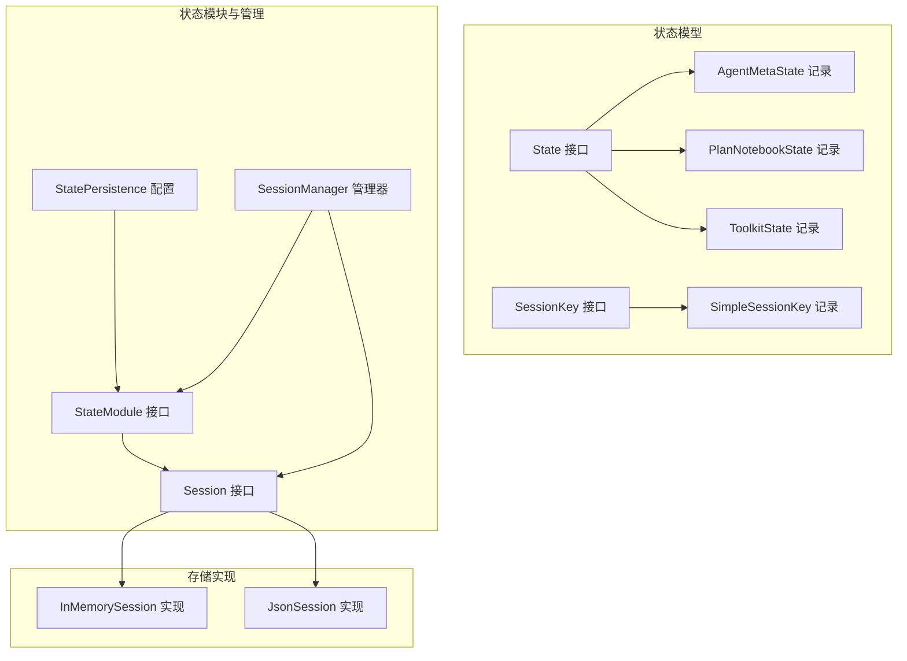
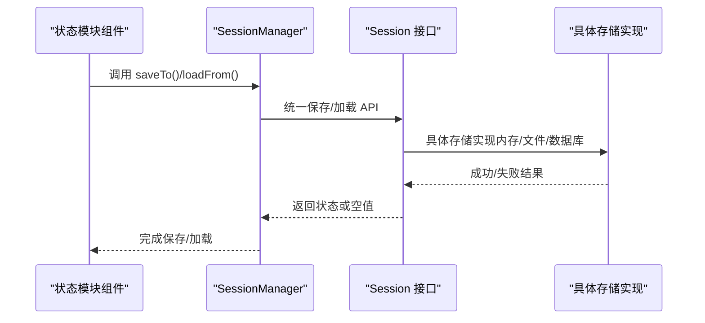
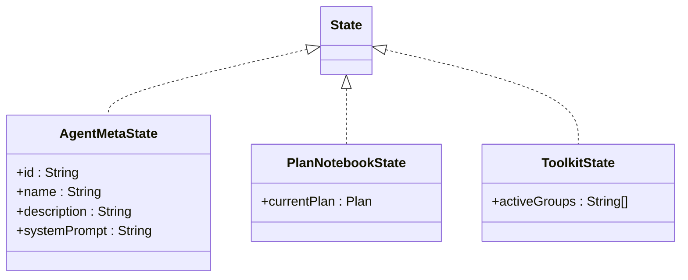
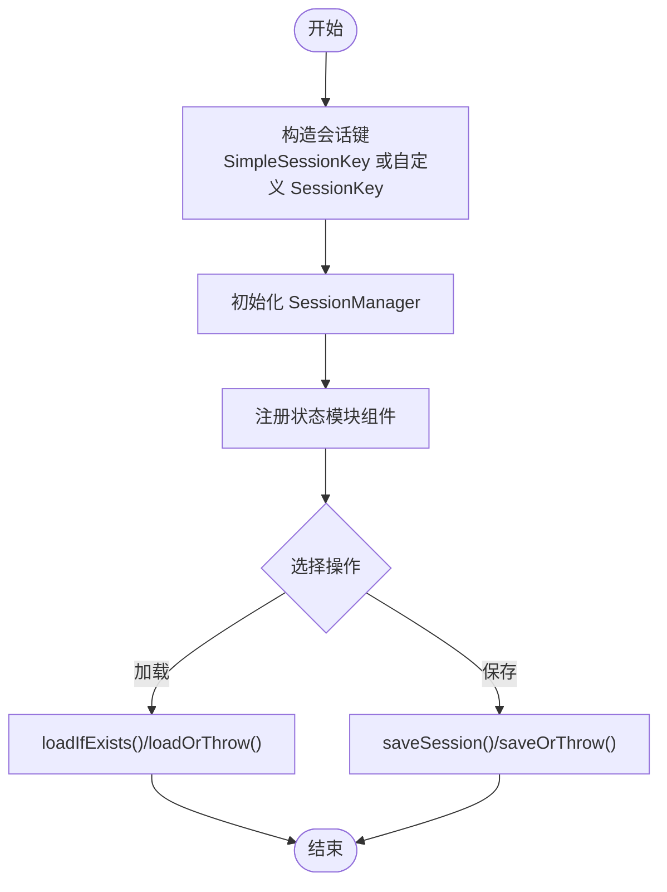
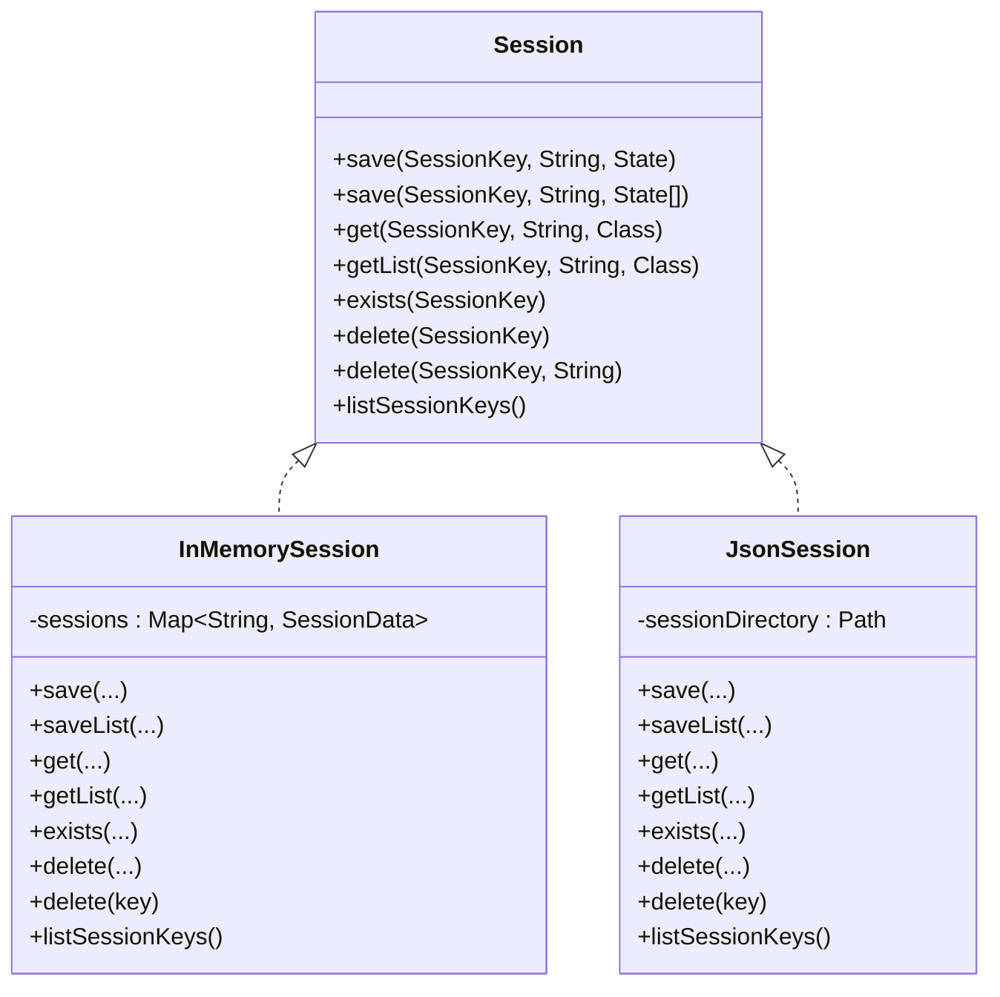
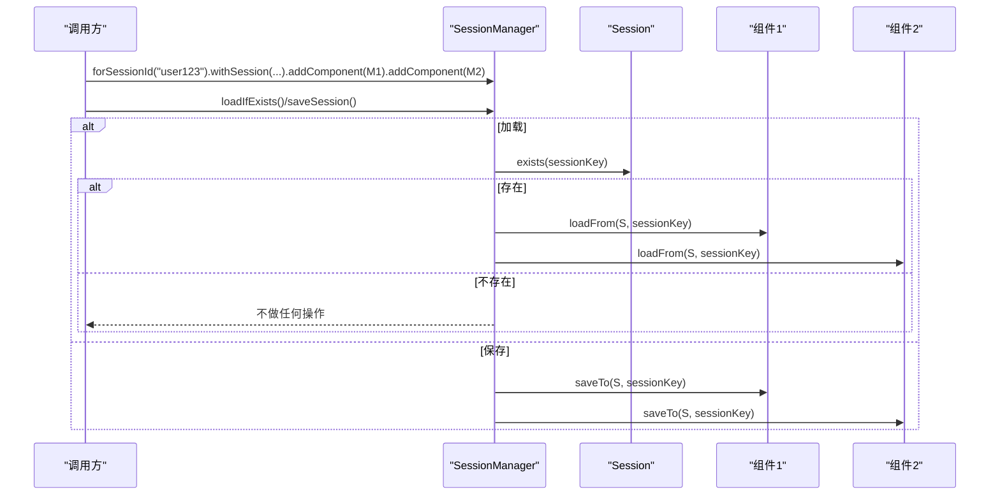
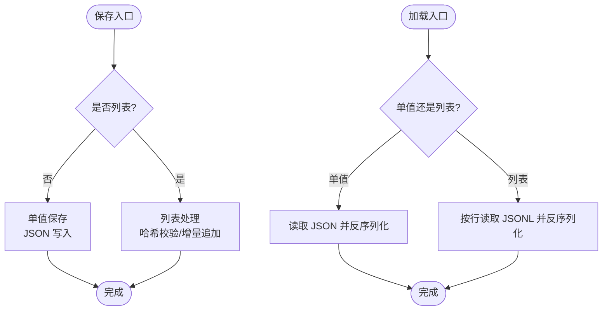
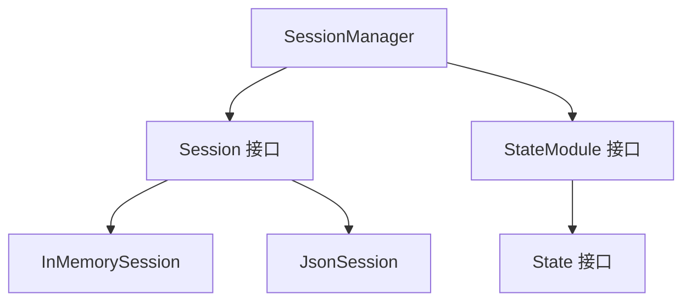

# 状态管理与持久化

<cite>
**本文引用的文件**
- [State.java](file://agentscope-core/src/main/java/io/agentscope/core/state/State.java)
- [StateModule.java](file://agentscope-core/src/main/java/io/agentscope/core/state/StateModule.java)
- [StatePersistence.java](file://agentscope-core/src/main/java/io/agentscope/core/state/StatePersistence.java)
- [SessionKey.java](file://agentscope-core/src/main/java/io/agentscope/core/state/SessionKey.java)
- [SimpleSessionKey.java](file://agentscope-core/src/main/java/io/agentscope/core/state/SimpleSessionKey.java)
- [AgentMetaState.java](file://agentscope-core/src/main/java/io/agentscope/core/state/AgentMetaState.java)
- [PlanNotebookState.java](file://agentscope-core/src/main/java/io/agentscope/core/state/PlanNotebookState.java)
- [ToolkitState.java](file://agentscope-core/src/main/java/io/agentscope/core/state/ToolkitState.java)
- [Session.java](file://agentscope-core/src/main/java/io/agentscope/core/session/Session.java)
- [SessionManager.java](file://agentscope-core/src/main/java/io/agentscope/core/session/SessionManager.java)
- [InMemorySession.java](file://agentscope-core/src/main/java/io/agentscope/core/session/InMemorySession.java)
- [JsonSession.java](file://agentscope-core/src/main/java/io/agentscope/core/session/JsonSession.java)
- [StatePersistenceTest.java](file://agentscope-core/src/test/java/io/agentscope/core/state/StatePersistenceTest.java)
</cite>

## 目录
1. [引言](#引言)
2. [项目结构](#项目结构)
3. [核心组件](#核心组件)
4. [架构总览](#架构总览)
5. [详细组件分析](#详细组件分析)
6. [依赖分析](#依赖分析)
7. [性能考量](#性能考量)
8. [故障排查指南](#故障排查指南)
9. [结论](#结论)
10. [附录](#附录)

## 引言
本技术文档围绕智能体状态的组成、管理机制、持久化实现与存储策略、会话绑定与状态恢复流程、状态序列化与反序列化处理、配置选项与自定义策略、最佳实践与性能考虑，以及状态迁移与版本兼容性处理进行系统化阐述。目标是帮助开发者在 AgentScope 中高效、安全地实现跨会话的状态管理与持久化。

## 项目结构
状态管理与持久化相关的核心代码位于 agentscope-core 模块的 state 与 session 包中，并通过扩展模块提供多种存储后端（内存、JSON 文件、Redis、MySQL 等）。整体采用接口抽象 + 多实现的模式，确保可插拔与可扩展。



图表来源
- [State.java:18-47](file://agentscope-core/src/main/java/io/agentscope/core/state/State.java#L18-L47)
- [AgentMetaState.java:18-42](file://agentscope-core/src/main/java/io/agentscope/core/state/AgentMetaState.java#L18-L42)
- [PlanNotebookState.java:18-44](file://agentscope-core/src/main/java/io/agentscope/core/state/PlanNotebookState.java#L18-L44)
- [ToolkitState.java:18-42](file://agentscope-core/src/main/java/io/agentscope/core/state/ToolkitState.java#L18-L42)
- [SessionKey.java:18-61](file://agentscope-core/src/main/java/io/agentscope/core/state/SessionKey.java#L18-L61)
- [SimpleSessionKey.java:18-69](file://agentscope-core/src/main/java/io/agentscope/core/state/SimpleSessionKey.java#L18-L69)
- [StateModule.java:20-120](file://agentscope-core/src/main/java/io/agentscope/core/state/StateModule.java#L20-L120)
- [StatePersistence.java:70-98](file://agentscope-core/src/main/java/io/agentscope/core/state/StatePersistence.java#L70-L98)
- [Session.java:24-144](file://agentscope-core/src/main/java/io/agentscope/core/session/Session.java#L24-L144)
- [SessionManager.java:24-260](file://agentscope-core/src/main/java/io/agentscope/core/session/SessionManager.java#L24-L260)
- [InMemorySession.java:28-248](file://agentscope-core/src/main/java/io/agentscope/core/session/InMemorySession.java#L28-L248)
- [JsonSession.java:42-508](file://agentscope-core/src/main/java/io/agentscope/core/session/JsonSession.java#L42-L508)

章节来源
- [State.java:18-47](file://agentscope-core/src/main/java/io/agentscope/core/state/State.java#L18-L47)
- [Session.java:24-144](file://agentscope-core/src/main/java/io/agentscope/core/session/Session.java#L24-L144)

## 核心组件
- 状态标记接口：用于标识可被持久化的状态对象，推荐使用 Java Records 表达不可变状态，便于序列化与并发安全。
- 状态模块接口：为具备状态的组件提供统一的保存/加载能力，支持基于字符串或复杂键的会话操作。
- 会话键接口：抽象会话标识符，支持简单字符串与多租户等复杂结构；默认 JSON 序列化，也可自定义优化可读性。
- 状态持久化配置：以记录形式描述 ReActAgent 对各子组件（记忆、工具箱、计划笔记本、有状态工具）的状态管理策略，支持全量、仅记忆、禁用等预设与构建器定制。
- 会话接口与管理器：定义统一的存取 API，SessionManager 提供链式 API，简化批量加载/保存与错误处理。
- 存储实现：InMemorySession 适合单进程内存场景；JsonSession 基于文件系统，支持增量追加与哈希校验，兼顾性能与可靠性。

章节来源
- [State.java:18-47](file://agentscope-core/src/main/java/io/agentscope/core/state/State.java#L18-L47)
- [StateModule.java:20-120](file://agentscope-core/src/main/java/io/agentscope/core/state/StateModule.java#L20-L120)
- [SessionKey.java:18-61](file://agentscope-core/src/main/java/io/agentscope/core/state/SessionKey.java#L18-L61)
- [SimpleSessionKey.java:18-69](file://agentscope-core/src/main/java/io/agentscope/core/state/SimpleSessionKey.java#L18-L69)
- [StatePersistence.java:70-98](file://agentscope-core/src/main/java/io/agentscope/core/state/StatePersistence.java#L70-L98)
- [Session.java:24-144](file://agentscope-core/src/main/java/io/agentscope/core/session/Session.java#L24-L144)
- [SessionManager.java:24-260](file://agentscope-core/src/main/java/io/agentscope/core/session/SessionManager.java#L24-L260)
- [InMemorySession.java:28-248](file://agentscope-core/src/main/java/io/agentscope/core/session/InMemorySession.java#L28-L248)
- [JsonSession.java:42-508](file://agentscope-core/src/main/java/io/agentscope/core/session/JsonSession.java#L42-L508)

## 架构总览
下图展示从组件到会话再到存储实现的整体交互路径，体现“状态模块”如何通过“会话管理器”与“会话接口”对接不同存储后端。



图表来源
- [StateModule.java:46-120](file://agentscope-core/src/main/java/io/agentscope/core/state/StateModule.java#L46-L120)
- [SessionManager.java:122-202](file://agentscope-core/src/main/java/io/agentscope/core/session/SessionManager.java#L122-L202)
- [Session.java:53-145](file://agentscope-core/src/main/java/io/agentscope/core/session/Session.java#L53-L145)
- [InMemorySession.java:58-248](file://agentscope-core/src/main/java/io/agentscope/core/session/InMemorySession.java#L58-L248)
- [JsonSession.java:58-508](file://agentscope-core/src/main/java/io/agentscope/core/session/JsonSession.java#L58-L508)

## 详细组件分析

### 状态模型与记录
- State 接口作为可持久化状态的标记，建议使用不可变记录表达状态，避免并发修改带来的不一致。
- AgentMetaState：封装智能体元数据（ID、名称、描述、系统提示），便于跨会话恢复。
- PlanNotebookState：封装当前活动计划，支持恢复执行上下文。
- ToolkitState：封装工具组激活状态，使工具选择策略可持久化。



图表来源
- [State.java:18-47](file://agentscope-core/src/main/java/io/agentscope/core/state/State.java#L18-L47)
- [AgentMetaState.java:18-42](file://agentscope-core/src/main/java/io/agentscope/core/state/AgentMetaState.java#L18-L42)
- [PlanNotebookState.java:18-44](file://agentscope-core/src/main/java/io/agentscope/core/state/PlanNotebookState.java#L18-L44)
- [ToolkitState.java:18-42](file://agentscope-core/src/main/java/io/agentscope/core/state/ToolkitState.java#L18-L42)

章节来源
- [AgentMetaState.java:18-42](file://agentscope-core/src/main/java/io/agentscope/core/state/AgentMetaState.java#L18-L42)
- [PlanNotebookState.java:18-44](file://agentscope-core/src/main/java/io/agentscope/core/state/PlanNotebookState.java#L18-L44)
- [ToolkitState.java:18-42](file://agentscope-core/src/main/java/io/agentscope/core/state/ToolkitState.java#L18-L42)

### 会话键与会话管理
- SessionKey：抽象会话标识符，默认 JSON 序列化；SimpleSessionKey 提供字符串键的强类型封装与校验。
- Session：定义统一的保存/加载 API，支持单值与列表两种持久化形态；提供存在性检查、删除、枚举等能力。
- SessionManager：提供链式 API，简化批量组件的加载/保存与错误处理；内部通过 SimpleSessionKey 封装字符串会话 ID。



图表来源
- [SessionKey.java:18-61](file://agentscope-core/src/main/java/io/agentscope/core/state/SessionKey.java#L18-L61)
- [SimpleSessionKey.java:18-69](file://agentscope-core/src/main/java/io/agentscope/core/state/SimpleSessionKey.java#L18-L69)
- [Session.java:53-145](file://agentscope-core/src/main/java/io/agentscope/core/session/Session.java#L53-L145)
- [SessionManager.java:61-260](file://agentscope-core/src/main/java/io/agentscope/core/session/SessionManager.java#L61-L260)

章节来源
- [SessionKey.java:18-61](file://agentscope-core/src/main/java/io/agentscope/core/state/SessionKey.java#L18-L61)
- [SimpleSessionKey.java:18-69](file://agentscope-core/src/main/java/io/agentscope/core/state/SimpleSessionKey.java#L18-L69)
- [Session.java:53-145](file://agentscope-core/src/main/java/io/agentscope/core/session/Session.java#L53-L145)
- [SessionManager.java:61-260](file://agentscope-core/src/main/java/io/agentscope/core/session/SessionManager.java#L61-L260)

### 状态持久化配置与策略
- StatePersistence：以记录形式描述对各组件的状态管理策略，支持全量管理、仅记忆、禁用等预设，以及 Builder 自定义组合。
- 使用场景：ReActAgent 可根据该配置决定是否接管记忆、工具箱、计划笔记本与有状态工具的状态管理，用户也可完全自管。

```mermaid
flowchart TD
CfgStart(["配置入口"]) --> Preset{"选择预设"}
Preset --> |all()| All["启用所有组件管理"]
Preset --> |none()| None["禁用所有组件管理"]
Preset --> |memoryOnly()| MemOnly["仅管理记忆"]
Preset --> |Builder| Build["按需设置各组件开关"]
All --> Apply["应用到 ReActAgent"]
None --> Apply
MemOnly --> Apply
Build --> Apply
Apply --> Done(["完成"])
```

图表来源
- [StatePersistence.java:70-98](file://agentscope-core/src/main/java/io/agentscope/core/state/StatePersistence.java#L70-L98)
- [StatePersistence.java:100-161](file://agentscope-core/src/main/java/io/agentscope/core/state/StatePersistence.java#L100-L161)

章节来源
- [StatePersistence.java:70-98](file://agentscope-core/src/main/java/io/agentscope/core/state/StatePersistence.java#L70-L98)
- [StatePersistenceTest.java:26-177](file://agentscope-core/src/test/java/io/agentscope/core/state/StatePersistenceTest.java#L26-L177)

### 存储实现：内存与 JSON 文件
- InMemorySession：线程安全的内存存储，适合单进程、临时状态；列表保存采用替换策略，注意调用方需传入完整列表。
- JsonSession：基于文件系统的 JSON/JSONL 存储，支持增量追加与哈希校验，自动处理目录创建、文件删除与枚举；提供安全文件名编码与 UTF-8 编码。



图表来源
- [Session.java:53-145](file://agentscope-core/src/main/java/io/agentscope/core/session/Session.java#L53-L145)
- [InMemorySession.java:58-248](file://agentscope-core/src/main/java/io/agentscope/core/session/InMemorySession.java#L58-L248)
- [JsonSession.java:58-508](file://agentscope-core/src/main/java/io/agentscope/core/session/JsonSession.java#L58-L508)

章节来源
- [InMemorySession.java:28-248](file://agentscope-core/src/main/java/io/agentscope/core/session/InMemorySession.java#L28-L248)
- [JsonSession.java:42-508](file://agentscope-core/src/main/java/io/agentscope/core/session/JsonSession.java#L42-L508)

### 会话绑定与状态恢复流程
- 会话绑定：通过 SessionManager.forSessionId(...) 创建管理器，注入 Session 实现与多个 StateModule 组件。
- 加载流程：若会话存在，则逐个调用组件的 loadFrom(...) 从 Session 中恢复状态。
- 保存流程：逐个调用组件的 saveTo(...) 将当前状态写入 Session；JsonSession 支持增量追加，InMemorySession 替换存储。



图表来源
- [SessionManager.java:122-202](file://agentscope-core/src/main/java/io/agentscope/core/session/SessionManager.java#L122-L202)
- [StateModule.java:46-120](file://agentscope-core/src/main/java/io/agentscope/core/state/StateModule.java#L46-L120)
- [Session.java:53-145](file://agentscope-core/src/main/java/io/agentscope/core/session/Session.java#L53-L145)

章节来源
- [SessionManager.java:122-202](file://agentscope-core/src/main/java/io/agentscope/core/session/SessionManager.java#L122-L202)
- [StateModule.java:46-120](file://agentscope-core/src/main/java/io/agentscope/core/state/StateModule.java#L46-L120)

### 状态序列化与反序列化
- 单值保存：Session.save(sessionKey, key, state) 将状态对象序列化为 JSON 并写入文件或内存映射。
- 列表保存：Session.save(sessionKey, key, List) 在 JsonSession 中采用哈希校验与增量追加策略；InMemorySession 直接替换。
- 加载：Session.get(...) 与 Session.getList(...) 从存储中读取并反序列化为指定类型。



图表来源
- [Session.java:53-145](file://agentscope-core/src/main/java/io/agentscope/core/session/Session.java#L53-L145)
- [JsonSession.java:98-274](file://agentscope-core/src/main/java/io/agentscope/core/session/JsonSession.java#L98-L274)
- [InMemorySession.java:70-148](file://agentscope-core/src/main/java/io/agentscope/core/session/InMemorySession.java#L70-L148)

章节来源
- [JsonSession.java:98-274](file://agentscope-core/src/main/java/io/agentscope/core/session/JsonSession.java#L98-L274)
- [InMemorySession.java:70-148](file://agentscope-core/src/main/java/io/agentscope/core/session/InMemorySession.java#L70-L148)

### 配置选项与自定义策略
- 会话键：默认 SimpleSessionKey；复杂场景可实现自定义 SessionKey，覆盖 toIdentifier() 以适配存储后端命名规范。
- 状态持久化：通过 StatePersistence 的静态工厂与 Builder 控制 ReActAgent 对各组件的状态管理范围。
- 存储后端：可注入任意 Session 实现；JsonSession 支持自定义存储目录；InMemorySession 适合测试与临时场景。

章节来源
- [SessionKey.java:18-61](file://agentscope-core/src/main/java/io/agentscope/core/state/SessionKey.java#L18-L61)
- [SimpleSessionKey.java:18-69](file://agentscope-core/src/main/java/io/agentscope/core/state/SimpleSessionKey.java#L18-L69)
- [StatePersistence.java:70-98](file://agentscope-core/src/main/java/io/agentscope/core/state/StatePersistence.java#L70-L98)
- [JsonSession.java:68-87](file://agentscope-core/src/main/java/io/agentscope/core/session/JsonSession.java#L68-L87)

## 依赖分析
- 松耦合设计：StateModule 仅依赖 Session 接口；SessionManager 依赖 Session 与 StateModule；存储实现独立于业务组件。
- 可扩展性：新增存储后端只需实现 Session 接口；自定义会话键只需实现 SessionKey 接口。
- 循环依赖：未发现直接循环依赖；组件间通过接口交互，避免编译期耦合。



图表来源
- [SessionManager.java:61-120](file://agentscope-core/src/main/java/io/agentscope/core/session/SessionManager.java#L61-L120)
- [Session.java:53-145](file://agentscope-core/src/main/java/io/agentscope/core/session/Session.java#L53-L145)
- [InMemorySession.java:58-248](file://agentscope-core/src/main/java/io/agentscope/core/session/InMemorySession.java#L58-L248)
- [JsonSession.java:58-508](file://agentscope-core/src/main/java/io/agentscope/core/session/JsonSession.java#L58-L508)
- [StateModule.java:45-120](file://agentscope-core/src/main/java/io/agentscope/core/state/StateModule.java#L45-L120)
- [State.java:18-47](file://agentscope-core/src/main/java/io/agentscope/core/state/State.java#L18-L47)

## 性能考量
- 列表持久化策略
  - JsonSession：通过哈希校验判断是否需要全量重写，append-only 场景仅追加新项，减少 IO；列表收缩或变更时触发全量重写。
  - InMemorySession：直接替换，适合频繁更新但无需持久化的场景。
- 文件系统与并发
  - JsonSession：使用 UTF-8 编码与安全文件名；递归删除采用逆序遍历保证目录清理顺序；提供异步清理任务。
  - InMemorySession：ConcurrentHashMap 保证线程安全；防御性复制避免外部修改影响存储。
- 序列化开销
  - 建议使用不可变记录表达状态，减少序列化与并发控制成本；避免在状态中包含大对象或频繁变化的数据。

章节来源
- [JsonSession.java:127-162](file://agentscope-core/src/main/java/io/agentscope/core/session/JsonSession.java#L127-L162)
- [JsonSession.java:452-471](file://agentscope-core/src/main/java/io/agentscope/core/session/JsonSession.java#L452-L471)
- [InMemorySession.java:224-248](file://agentscope-core/src/main/java/io/agentscope/core/session/InMemorySession.java#L224-L248)

## 故障排查指南
- 会话未配置
  - 现象：抛出未配置会话异常。
  - 处理：确保先调用 withSession(...) 注入 Session 实例。
- 会话不存在
  - 现象：loadOrThrow 抛出参数异常；deleteOrThrow 抛出参数异常。
  - 处理：先检查 exists，或使用 loadIfExists/saveIfExists 进行条件操作。
- 类型不匹配
  - 现象：get(...) 读取时抛出类型转换异常。
  - 处理：确认保存与加载时使用的类型一致，避免混用不同状态记录。
- 存储后端问题
  - JsonSession：检查存储目录权限与磁盘空间；确认文件名编码与安全字符集。
  - InMemorySession：关注内存占用与 JVM 退出导致的状态丢失。

章节来源
- [SessionManager.java:145-153](file://agentscope-core/src/main/java/io/agentscope/core/session/SessionManager.java#L145-L153)
- [SessionManager.java:246-251](file://agentscope-core/src/main/java/io/agentscope/core/session/SessionManager.java#L246-L251)
- [InMemorySession.java:114-123](file://agentscope-core/src/main/java/io/agentscope/core/session/InMemorySession.java#L114-L123)
- [JsonSession.java:342-353](file://agentscope-core/src/main/java/io/agentscope/core/session/JsonSession.java#L342-L353)

## 结论
AgentScope 的状态管理与持久化体系以接口抽象为核心，结合可插拔的会话实现与灵活的配置策略，既满足单机内存场景的快速开发，也支持文件系统与分布式存储的生产需求。通过不可变状态记录、增量持久化与类型安全的序列化机制，系统在易用性与性能之间取得良好平衡。建议在实际项目中根据部署环境选择合适的存储后端，并遵循记录化状态与最小化持久化的原则，提升可维护性与稳定性。

## 附录
- 最佳实践
  - 使用不可变记录表达状态，避免并发修改。
  - 明确区分单值与列表状态，合理选择存储策略。
  - 在分布式或多实例环境中优先选择文件系统或数据库后端。
  - 对大体量列表采用分页或分片策略，避免一次性加载。
- 版本兼容与迁移
  - 新增字段时保持向后兼容，旧字段保留读取逻辑。
  - 使用版本号字段或前缀区分不同版本状态，迁移时进行转换。
  - 对于 JSON 文件，建议在迁移脚本中进行一次全量重写，确保一致性。