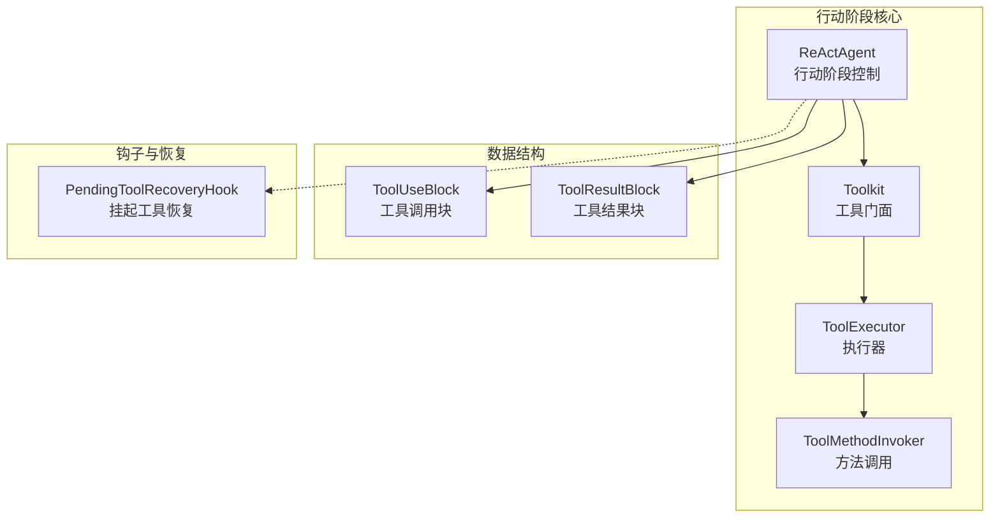
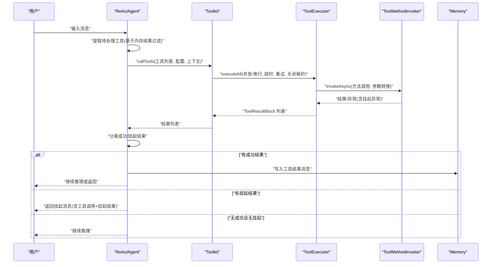
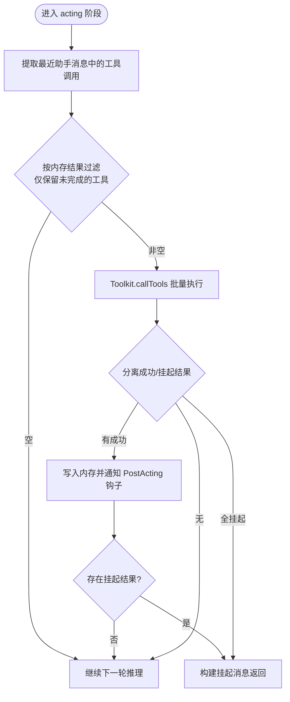
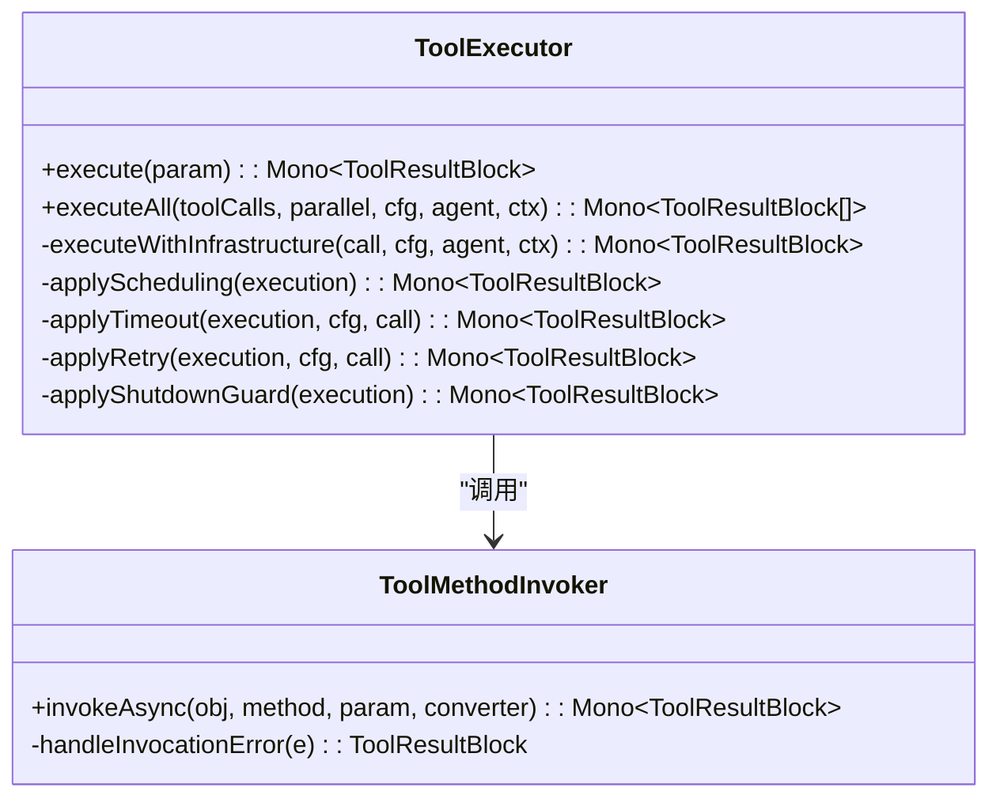
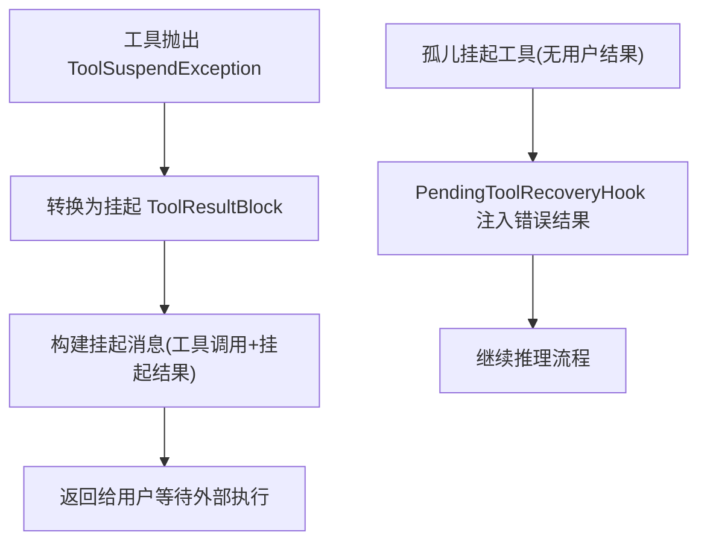
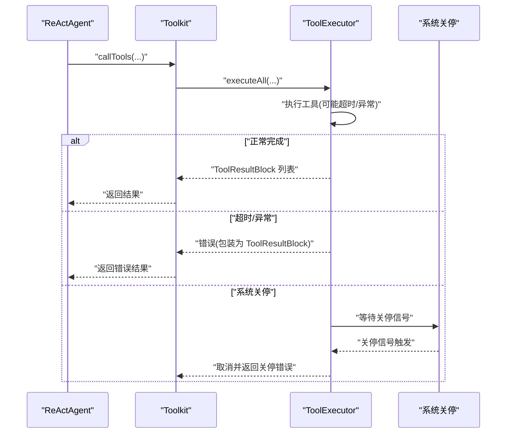
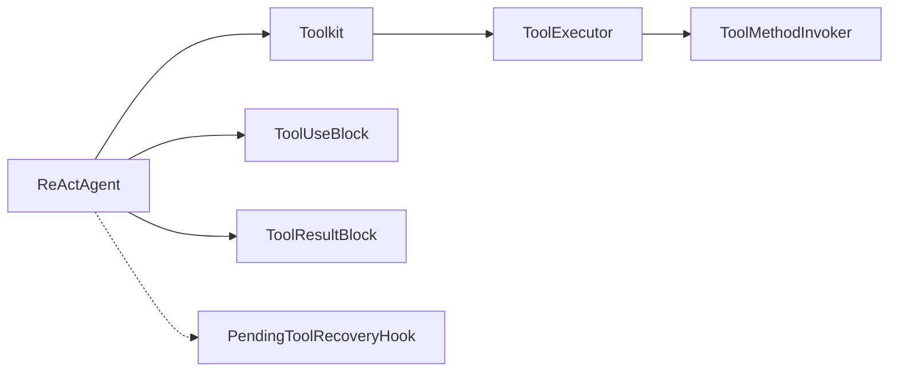

# 行动阶段实现

<cite>
**本文引用的文件**
- [ReActAgent.java](file://agentscope-core/src/main/java/io/agentscope/core/ReActAgent.java)
- [ToolExecutor.java](file://agentscope-core/src/main/java/io/agentscope/core/tool/ToolExecutor.java)
- [Toolkit.java](file://agentscope-core/src/main/java/io/agentscope/core/tool/Toolkit.java)
- [PendingToolRecoveryHook.java](file://agentscope-core/src/main/java/io/agentscope/core/hook/PendingToolRecoveryHook.java)
- [ToolUseBlock.java](file://agentscope-core/src/main/java/io/agentscope/core/message/ToolUseBlock.java)
- [ToolResultBlock.java](file://agentscope-core/src/main/java/io/agentscope/core/message/ToolResultBlock.java)
- [ToolSuspendException.java](file://agentscope-core/src/main/java/io/agentscope/core/tool/ToolSuspendException.java)
- [ToolMethodInvoker.java](file://agentscope-core/src/main/java/io/agentscope/core/tool/ToolMethodInvoker.java)
- [AgentBase.java](file://agentscope-core/src/main/java/io/agentscope/core/agent/AgentBase.java)
</cite>

## 目录
1. [简介](#简介)
2. [项目结构](#项目结构)
3. [核心组件](#核心组件)
4. [架构总览](#架构总览)
5. [详细组件分析](#详细组件分析)
6. [依赖分析](#依赖分析)
7. [性能考虑](#性能考虑)
8. [故障排查指南](#故障排查指南)
9. [结论](#结论)

## 简介
本文件聚焦于 AgentScopeJava 中“行动阶段”的实现与工作机制，系统性阐述以下主题：
- 工具调用机制与执行流程
- 待处理工具的提取与过滤逻辑
- 并发策略与结果聚合过程
- 挂起工具的处理机制与恢复策略
- 错误处理与异常恢复
- 监控与调试方法
- 性能优化与资源管理建议

行动阶段是 ReActAgent 在推理与行动循环中的关键环节：当模型输出工具调用请求后，行动阶段负责解析并执行这些工具，处理成功结果、挂起状态与错误情况，并决定是否继续下一轮推理或返回最终结果。

## 项目结构
行动阶段相关代码主要分布在以下模块：
- ReActAgent：行动阶段主流程控制、待处理工具提取、结果处理与恢复策略
- Toolkit/ToolExecutor：统一的工具注册、调度、并发执行与基础设施（超时、重试、关闭保护）
- Message：工具调用与结果的数据结构（ToolUseBlock、ToolResultBlock）
- Hook：自动恢复挂起工具的钩子（PendingToolRecoveryHook）
- ToolMethodInvoker：方法调用与异常转换（含挂起异常）

**图表来源**
- [ReActAgent.java](file://agentscope-core/src/main/java/io/agentscope/core/ReActAgent.java)
- [Toolkit.java](file://agentscope-core/src/main/java/io/agentscope/core/tool/Toolkit.java)
- [ToolExecutor.java](file://agentscope-core/src/main/java/io/agentscope/core/tool/ToolExecutor.java)
- [ToolMethodInvoker.java](file://agentscope-core/src/main/java/io/agentscope/core/tool/ToolMethodInvoker.java)
- [ToolUseBlock.java](file://agentscope-core/src/main/java/io/agentscope/core/message/ToolUseBlock.java)
- [ToolResultBlock.java](file://agentscope-core/src/main/java/io/agentscope/core/message/ToolResultBlock.java)
- [PendingToolRecoveryHook.java](file://agentscope-core/src/main/java/io/agentscope/core/hook/PendingToolRecoveryHook.java)

**章节来源**
- [ReActAgent.java](file://agentscope-core/src/main/java/io/agentscope/core/ReActAgent.java)
- [Toolkit.java](file://agentscope-core/src/main/java/io/agentscope/core/tool/Toolkit.java)
- [ToolExecutor.java](file://agentscope-core/src/main/java/io/agentscope/core/tool/ToolExecutor.java)
- [ToolMethodInvoker.java](file://agentscope-core/src/main/java/io/agentscope/core/tool/ToolMethodInvoker.java)
- [ToolUseBlock.java](file://agentscope-core/src/main/java/io/agentscope/core/message/ToolUseBlock.java)
- [ToolResultBlock.java](file://agentscope-core/src/main/java/io/agentscope/core/message/ToolResultBlock.java)
- [PendingToolRecoveryHook.java](file://agentscope-core/src/main/java/io/agentscope/core/hook/PendingToolRecoveryHook.java)

## 核心组件
- ReActAgent 行动阶段
  - 提取待处理工具：从最近助手消息中提取所有工具调用，并基于内存中的结果进行过滤，仅保留未完成的工具调用
  - 执行工具：通过 Toolkit 调用工具，支持并发/串行、超时、重试与关闭保护
  - 结果处理：区分成功结果与挂起结果；成功结果写入内存并通过 PostActing 钩子通知；若存在挂起结果则构建挂起消息返回
  - 异常恢复：工具执行失败时生成错误结果以保证流程继续；挂起工具由钩子自动恢复或用户手动提供结果
- Toolkit/ToolExecutor
  - 统一入口：callTools 对批量工具调用进行并发控制与配置合并
  - 基础设施：调度（boundedElastic 或自定义线程池）、超时、指数退避重试、优雅关停保护
  - 参数与上下文：参数合并（preset + 输入）、上下文合并、Schema 校验
- 数据结构
  - ToolUseBlock：工具调用请求（含 id/name/input/content/metadata）
  - ToolResultBlock：工具执行结果（含 id/name/output/metadata），支持挂起标记
- 钩子与恢复
  - PendingToolRecoveryHook：在 PreCall 阶段检测孤儿挂起工具并注入错误结果，避免非法状态

**章节来源**
- [ReActAgent.java](file://agentscope-core/src/main/java/io/agentscope/core/ReActAgent.java)
- [Toolkit.java](file://agentscope-core/src/main/java/io/agentscope/core/tool/Toolkit.java)
- [ToolExecutor.java](file://agentscope-core/src/main/java/io/agentscope/core/tool/ToolExecutor.java)
- [ToolUseBlock.java](file://agentscope-core/src/main/java/io/agentscope/core/message/ToolUseBlock.java)
- [ToolResultBlock.java](file://agentscope-core/src/main/java/io/agentscope/core/message/ToolResultBlock.java)
- [PendingToolRecoveryHook.java](file://agentscope-core/src/main/java/io/agentscope/core/hook/PendingToolRecoveryHook.java)

## 架构总览
行动阶段的端到端流程如下：

**图表来源**
- [ReActAgent.java](file://agentscope-core/src/main/java/io/agentscope/core/ReActAgent.java)
- [Toolkit.java](file://agentscope-core/src/main/java/io/agentscope/core/tool/Toolkit.java)
- [ToolExecutor.java](file://agentscope-core/src/main/java/io/agentscope/core/tool/ToolExecutor.java)
- [ToolMethodInvoker.java](file://agentscope-core/src/main/java/io/agentscope/core/tool/ToolMethodInvoker.java)

## 详细组件分析

### 行动阶段主流程与待处理工具提取
- 待处理工具提取
  - 从最近一次助手消息中提取所有 ToolUseBlock
  - 基于内存中已存在的 ToolResultBlock 的 id 过滤，仅保留尚未产生结果的工具调用
- 执行前钩子
  - 注册内部 chunk 回调，将工具流式结果转发给 ActingChunkEvent 钩子
- 工具执行
  - 通过 Toolkit.callTools 触发批量执行，内部委托 ToolExecutor.executeAll
- 结果分流
  - 成功结果：写入内存并通过 PostActing 钩子通知
  - 挂起结果：构建挂起消息返回给用户，等待外部执行
  - 无成功也无挂起：继续下一轮推理

**图表来源**
- [ReActAgent.java](file://agentscope-core/src/main/java/io/agentscope/core/ReActAgent.java)
- [Toolkit.java](file://agentscope-core/src/main/java/io/agentscope/core/tool/Toolkit.java)

**章节来源**
- [ReActAgent.java](file://agentscope-core/src/main/java/io/agentscope/core/ReActAgent.java)

### 工具执行器与并发策略
- 单工具执行
  - 核心流程：查找工具、组激活校验、参数合并与上下文合并、Schema 校验、调用工具方法、异常转换（挂起/失败）
- 批量执行
  - 将每个 ToolUseBlock 映射为 Mono，支持两种模式：
    - 并行：Flux.mergeSequential 收集结果
    - 串行：Flux.concat 收集结果
- 基础设施层
  - 调度：默认使用 Reactor Schedulers.boundedElastic；可注入自定义线程池
  - 超时：基于 ExecutionConfig 的 timeout 设置
  - 重试：指数退避 backoff，支持自定义最大尝试次数与过滤条件
  - 关闭保护：与全局优雅关停信号竞争，确保系统关停时及时取消并返回错误

**图表来源**
- [ToolExecutor.java](file://agentscope-core/src/main/java/io/agentscope/core/tool/ToolExecutor.java)
- [ToolMethodInvoker.java](file://agentscope-core/src/main/java/io/agentscope/core/tool/ToolMethodInvoker.java)

**章节来源**
- [ToolExecutor.java](file://agentscope-core/src/main/java/io/agentscope/core/tool/ToolExecutor.java)
- [ToolMethodInvoker.java](file://agentscope-core/src/main/java/io/agentscope/core/tool/ToolMethodInvoker.java)

### 挂起工具的处理机制与恢复策略
- 挂起机制
  - 工具抛出 ToolSuspendException 时，框架将其转换为带有挂起标记的 ToolResultBlock
  - 行动阶段将挂起结果与对应 ToolUseBlock 组合，构建挂起消息返回给用户
- 自动恢复
  - PendingToolRecoveryHook 在 PreCall 阶段检测孤儿挂起工具（用户未提供结果且存在挂起），自动注入错误结果，避免非法状态
- 用户恢复
  - 用户可在后续输入中提供 ToolResultBlock，ReActAgent 校验并写入内存，随后继续推理

**图表来源**
- [ToolSuspendException.java](file://agentscope-core/src/main/java/io/agentscope/core/tool/ToolSuspendException.java)
- [ToolResultBlock.java](file://agentscope-core/src/main/java/io/agentscope/core/message/ToolResultBlock.java)
- [PendingToolRecoveryHook.java](file://agentscope-core/src/main/java/io/agentscope/core/hook/PendingToolRecoveryHook.java)
- [ReActAgent.java](file://agentscope-core/src/main/java/io/agentscope/core/ReActAgent.java)

**章节来源**
- [ToolSuspendException.java](file://agentscope-core/src/main/java/io/agentscope/core/tool/ToolSuspendException.java)
- [ToolResultBlock.java](file://agentscope-core/src/main/java/io/agentscope/core/message/ToolResultBlock.java)
- [PendingToolRecoveryHook.java](file://agentscope-core/src/main/java/io/agentscope/core/hook/PendingToolRecoveryHook.java)
- [ReActAgent.java](file://agentscope-core/src/main/java/io/agentscope/core/ReActAgent.java)

### 错误处理与异常恢复
- 工具执行失败
  - Toolkit.callTools 内部捕获异常（除中断外），对所有待处理工具生成错误 ToolResultBlock，保证流程继续
- 中断处理
  - 行为遵循 AgentBase 的中断策略：InterruptedException 交由 handleInterrupt 处理，其他错误通过钩子链路传播
- 优雅关停
  - ToolExecutor.applyShutdownGuard 与全局关停信号竞争，确保关停时及时取消并返回错误

**图表来源**
- [ReActAgent.java](file://agentscope-core/src/main/java/io/agentscope/core/ReActAgent.java)
- [Toolkit.java](file://agentscope-core/src/main/java/io/agentscope/core/tool/Toolkit.java)
- [ToolExecutor.java](file://agentscope-core/src/main/java/io/agentscope/core/tool/ToolExecutor.java)
- [AgentBase.java](file://agentscope-core/src/main/java/io/agentscope/core/agent/AgentBase.java)

**章节来源**
- [ReActAgent.java](file://agentscope-core/src/main/java/io/agentscope/core/ReActAgent.java)
- [Toolkit.java](file://agentscope-core/src/main/java/io/agentscope/core/tool/Toolkit.java)
- [ToolExecutor.java](file://agentscope-core/src/main/java/io/agentscope/core/tool/ToolExecutor.java)
- [AgentBase.java](file://agentscope-core/src/main/java/io/agentscope/core/agent/AgentBase.java)

## 依赖分析
- 组件耦合
  - ReActAgent 依赖 Toolkit 进行工具调用；Toolkit 再依赖 ToolExecutor 完成执行；ToolExecutor 依赖 ToolMethodInvoker 完成方法调用与异常转换
  - 数据结构 ToolUseBlock/ToolResultBlock 在 ReActAgent 与 Toolkit 之间传递
  - 钩子 PendingToolRecoveryHook 与 ReActAgent 协作，实现挂起工具的自动恢复
- 并发与资源
  - ToolExecutor 默认使用 boundedElastic 线程池，适合 I/O 密集型工具；可通过配置注入自定义线程池
  - 并发模式由 ToolkitConfig 控制，批量执行采用 mergeSequential/concat 聚合

**图表来源**
- [ReActAgent.java](file://agentscope-core/src/main/java/io/agentscope/core/ReActAgent.java)
- [Toolkit.java](file://agentscope-core/src/main/java/io/agentscope/core/tool/Toolkit.java)
- [ToolExecutor.java](file://agentscope-core/src/main/java/io/agentscope/core/tool/ToolExecutor.java)
- [ToolMethodInvoker.java](file://agentscope-core/src/main/java/io/agentscope/core/tool/ToolMethodInvoker.java)
- [ToolUseBlock.java](file://agentscope-core/src/main/java/io/agentscope/core/message/ToolUseBlock.java)
- [ToolResultBlock.java](file://agentscope-core/src/main/java/io/agentscope/core/message/ToolResultBlock.java)
- [PendingToolRecoveryHook.java](file://agentscope-core/src/main/java/io/agentscope/core/hook/PendingToolRecoveryHook.java)

**章节来源**
- [ReActAgent.java](file://agentscope-core/src/main/java/io/agentscope/core/ReActAgent.java)
- [Toolkit.java](file://agentscope-core/src/main/java/io/agentscope/core/tool/Toolkit.java)
- [ToolExecutor.java](file://agentscope-core/src/main/java/io/agentscope/core/tool/ToolExecutor.java)
- [ToolMethodInvoker.java](file://agentscope-core/src/main/java/io/agentscope/core/tool/ToolMethodInvoker.java)
- [ToolUseBlock.java](file://agentscope-core/src/main/java/io/agentscope/core/message/ToolUseBlock.java)
- [ToolResultBlock.java](file://agentscope-core/src/main/java/io/agentscope/core/message/ToolResultBlock.java)
- [PendingToolRecoveryHook.java](file://agentscope-core/src/main/java/io/agentscope/core/hook/PendingToolRecoveryHook.java)

## 性能考虑
- 并发策略
  - I/O 密集型工具建议开启并行执行（parallel=true），以提升吞吐；CPU 密集型工具谨慎开启并行，避免线程争用
  - 使用 boundedElastic 线程池可避免阻塞事件线程；如需更细粒度控制，注入自定义线程池
- 超时与重试
  - 合理设置 ExecutionConfig 的 timeout 与重试参数，避免长时间阻塞；对易失败的外部服务适当增加重试次数与退避时间
- 结果聚合
  - 并行模式下使用 mergeSequential，串行模式下使用 concat；两者在不同场景下各有优势，应根据工具数量与延迟特征选择
- 资源管理
  - 避免在 chunk 回调中执行阻塞操作，防止回调阻塞导致整体性能下降
  - 对长耗时工具建议使用挂起机制，将外部执行与框架解耦，提高整体响应性

[本节为通用指导，无需特定文件引用]

## 故障排查指南
- 现象：工具执行超时
  - 排查：检查 ExecutionConfig.timeout 是否过短；查看日志中“Applied timeout”记录
  - 处理：增大超时或优化工具实现
- 现象：工具执行频繁失败
  - 排查：查看重试日志与 backoff 策略；确认外部依赖可用性
  - 处理：调整重试次数与退避参数；必要时降级为串行执行
- 现象：出现孤儿挂起工具导致非法状态
  - 排查：确认 PendingToolRecoveryHook 是否启用；检查用户输入是否包含 ToolResultBlock
  - 处理：启用自动恢复；或在后续输入中提供结果
- 现象：中断导致流程异常
  - 排查：关注 InterruptedException 的处理路径；确认系统关停策略
  - 处理：遵循 handleInterrupt 的恢复逻辑；在关停前保存必要状态

**章节来源**
- [ToolExecutor.java](file://agentscope-core/src/main/java/io/agentscope/core/tool/ToolExecutor.java)
- [ReActAgent.java](file://agentscope-core/src/main/java/io/agentscope/core/ReActAgent.java)
- [PendingToolRecoveryHook.java](file://agentscope-core/src/main/java/io/agentscope/core/hook/PendingToolRecoveryHook.java)
- [AgentBase.java](file://agentscope-core/src/main/java/io/agentscope/core/agent/AgentBase.java)

## 结论
行动阶段通过“待处理工具提取—并发执行—结果分流—异常与挂起恢复”的闭环设计，实现了高可靠、可观测、可扩展的工具调用能力。配合 Toolkit 的基础设施与钩子体系，能够在复杂场景下保持稳定运行，并为用户提供灵活的交互与恢复机制。建议在生产环境中结合业务特性合理配置并发与超时策略，并充分利用挂起与自动恢复能力提升用户体验与系统韧性。