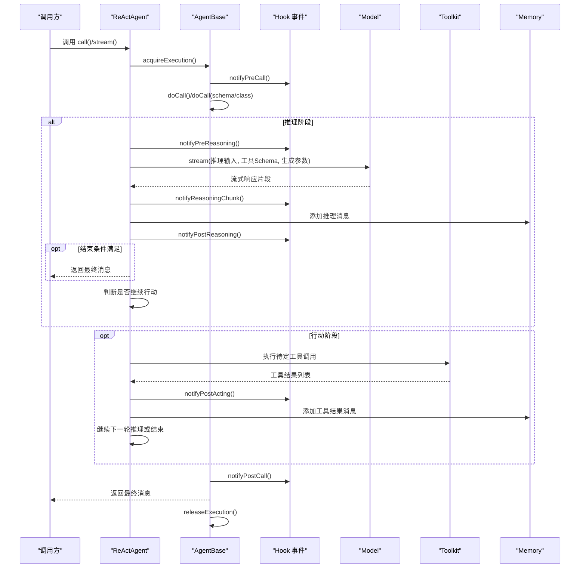
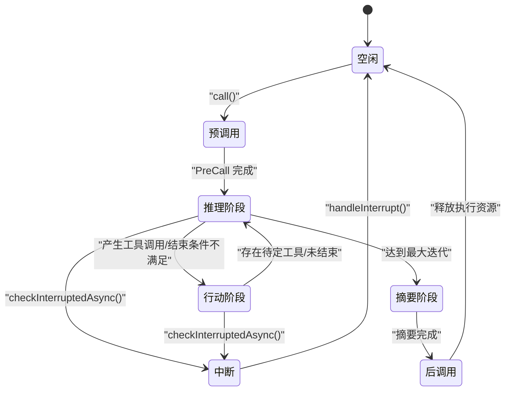
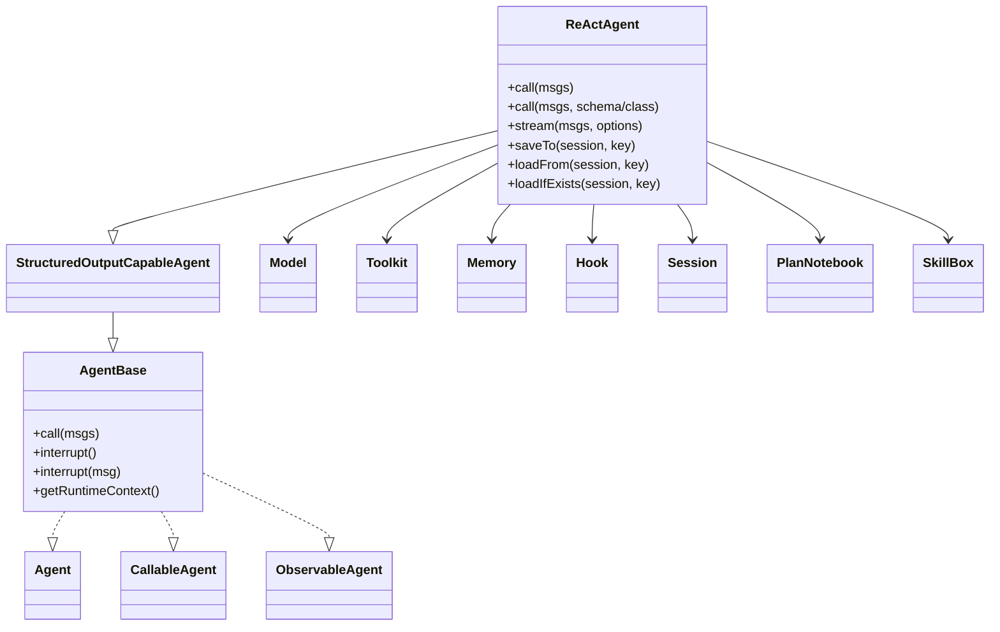

# 智能体引擎

<cite>
**本文引用的文件**
- [ReActAgent.java](file://agentscope-core/src/main/java/io/agentscope/core/ReActAgent.java)
- [AgentBase.java](file://agentscope-core/src/main/java/io/agentscope/core/agent/AgentBase.java)
- [Agent.java](file://agentscope-core/src/main/java/io/agentscope/core/agent/Agent.java)
- [CallableAgent.java](file://agentscope-core/src/main/java/io/agentscope/core/agent/CallableAgent.java)
- [ObservableAgent.java](file://agentscope-core/src/main/java/io/agentscope/core/agent/ObservableAgent.java)
- [StructuredOutputCapableAgent.java](file://agentscope-core/src/main/java/io/agentscope/core/agent/StructuredOutputCapableAgent.java)
- [StreamableAgent.java](file://agentscope-core/src/main/java/io/agentscope/core/agent/StreamableAgent.java)
- [StreamOptions.java](file://agentscope-core/src/main/java/io/agentscope/core/agent/StreamOptions.java)
- [Event.java](file://agentscope-core/src/main/java/io/agentscope/core/agent/Event.java)
- [EventType.java](file://agentscope-core/src/main/java/io/agentscope/core/agent/EventType.java)
- [RuntimeContext.java](file://agentscope-core/src/main/java/io/agentscope/core/agent/RuntimeContext.java)
- [Toolkit.java](file://agentscope-core/src/main/java/io/agentscope/core/tool/Toolkit.java)
- [Tool.java](file://agentscope-core/src/main/java/io/agentscope/core/tool/Tool.java)
- [ToolExecutionContext.java](file://agentscope-core/src/main/java/io/agentscope/core/tool/ToolExecutionContext.java)
- [ToolResultMessageBuilder.java](file://agentscope-core/src/main/java/io/agentscope/core/tool/ToolResultMessageBuilder.java)
- [ToolSuspendException.java](file://agentscope-core/src/main/java/io/agentscope/core/tool/ToolSuspendException.java)
- [Memory.java](file://agentscope-core/src/main/java/io/agentscope/core/memory/Memory.java)
- [InMemoryMemory.java](file://agentscope-core/src/main/java/io/agentscope/core/memory/InMemoryMemory.java)
- [PlanNotebook.java](file://agentscope-core/src/main/java/io/agentscope/core/plan/PlanNotebook.java)
- [SkillBox.java](file://agentscope-core/src/main/java/io/agentscope/core/skill/SkillBox.java)
- [Hook.java](file://agentscope-core/src/main/java/io/agentscope/core/hook/Hook.java)
- [HookEvent.java](file://agentscope-core/src/main/java/io/agentscope/core/hook/HookEvent.java)
- [PreReasoningEvent.java](file://agentscope-core/src/main/java/io/agentscope/core/hook/PreReasoningEvent.java)
- [PostReasoningEvent.java](file://agentscope-core/src/main/java/io/agentscope/core/hook/PostReasoningEvent.java)
- [PreActingEvent.java](file://agentscope-core/src/main/java/io/agentscope/core/hook/PreActingEvent.java)
- [PostActingEvent.java](file://agentscope-core/src/main/java/io/agentscope/core/hook/PostActingEvent.java)
- [ReasoningChunkEvent.java](file://agentscope-core/src/main/java/io/agentscope/core/hook/ReasoningChunkEvent.java)
- [ActingChunkEvent.java](file://agentscope-core/src/main/java/io/agentscope/core/hook/ActingChunkEvent.java)
- [SummaryChunkEvent.java](file://agentscope-core/src/main/java/io/agentscope/core/hook/SummaryChunkEvent.java)
- [PreSummaryEvent.java](file://agentscope-core/src/main/java/io/agentscope/core/hook/PreSummaryEvent.java)
- [PostSummaryEvent.java](file://agentscope-core/src/main/java/io/agentscope/core/hook/PostSummaryEvent.java)
- [ErrorEvent.java](file://agentscope-core/src/main/java/io/agentscope/core/hook/ErrorEvent.java)
- [InterruptContext.java](file://agentscope-core/src/main/java/io/agentscope/core/interruption/InterruptContext.java)
- [InterruptSource.java](file://agentscope-core/src/main/java/io/agentscope/core/interruption/InterruptSource.java)
- [GracefulShutdownManager.java](file://agentscope-core/src/main/java/io/agentscope/core/shutdown/GracefulShutdownManager.java)
- [GracefulShutdownHook.java](file://agentscope-core/src/main/java/io/agentscope/core/shutdown/GracefulShutdownHook.java)
- [ShutdownState.java](file://agentscope-core/src/main/java/io/agentscope/core/shutdown/ShutdownState.java)
- [AgentShuttingDownException.java](file://agentscope-core/src/main/java/io/agentscope/core/shutdown/AgentShuttingDownException.java)
- [StatePersistence.java](file://agentscope-core/src/main/java/io/agentscope/core/state/StatePersistence.java)
- [Session.java](file://agentscope-core/src/main/java/io/agentscope/core/session/Session.java)
- [SessionKey.java](file://agentscope-core/src/main/java/io/agentscope/core/state/SessionKey.java)
- [SimpleSessionKey.java](file://agentscope-core/src/main/java/io/agentscope/core/state/SimpleSessionKey.java)
- [Msg.java](file://agentscope-core/src/main/java/io/agentscope/core/message/Msg.java)
- [TextBlock.java](file://agentscope-core/src/main/java/io/agentscope/core/message/TextBlock.java)
- [ThinkingBlock.java](file://agentscope-core/src/main/java/io/agentscope/core/message/ThinkingBlock.java)
- [ToolUseBlock.java](file://agentscope-core/src/main/java/io/agentscope/core/message/ToolUseBlock.java)
- [ToolResultBlock.java](file://agentscope-core/src/main/java/io/agentscope/core/message/ToolResultBlock.java)
- [GenerateReason.java](file://agentscope-core/src/main/java/io/agentscope/core/message/GenerateReason.java)
- [Model.java](file://agentscope-core/src/main/java/io/agentscope/core/model/Model.java)
- [GenerateOptions.java](file://agentscope-core/src/main/java/io/agentscope/core/model/GenerateOptions.java)
- [ExecutionConfig.java](file://agentscope-core/src/main/java/io/agentscope/core/model/ExecutionConfig.java)
- [StructuredOutputReminder.java](file://agentscope-core/src/main/java/io/agentscope/core/model/StructuredOutputReminder.java)
- [ReasoningContext.java](file://agentscope-core/src/main/java/io/agentscope/core/agent/accumulator/ReasoningContext.java)
- [MessageUtils.java](file://agentscope-core/src/main/java/io/agentscope/core/util/MessageUtils.java)
- [ExceptionUtils.java](file://agentscope-core/src/main/java/io/agentscope/core/util/ExceptionUtils.java)
- [agent.md](file://docs/en/quickstart/agent.md)
- [agent-config.md](file://docs/en/task/agent-config.md)
- [structured-output.md](file://docs/en/task/structured-output.md)
- [key-concepts.md](file://docs/en/quickstart/key-concepts.md)
</cite>

## 目录
1. [简介](#简介)
2. [项目结构](#项目结构)
3. [核心组件](#核心组件)
4. [架构总览](#架构总览)
5. [详细组件分析](#详细组件分析)
6. [依赖关系分析](#依赖关系分析)
7. [性能考虑](#性能考虑)
8. [故障排查指南](#故障排查指南)
9. [结论](#结论)
10. [附录](#附录)

## 简介
本技术文档围绕 AgentScope Java 智能体引擎中的 ReActAgent 进行系统化解析，目标是帮助读者深入理解其设计原理、配置选项、使用模式与最佳实践。文档同时覆盖智能体生命周期管理、状态转换与异常处理机制，并对不同类型的智能体（UserAgent、CallableAgent、ObservableAgent）进行对比说明。此外，文档还提供了完整的 API 参考、构建器模式与链式配置说明、参数校验策略、性能优化建议与典型使用示例路径。

## 项目结构
AgentScope 采用模块化分层设计，核心智能体能力集中在 agentscope-core 模块中，ReActAgent 作为主要的“推理+行动”型智能体，位于核心包 io.agentscope.core 下；其上层接口与基础抽象分布在 io.agentscope.core.agent 包中；工具、消息、模型、Hook、内存、会话、状态持久化等子系统分别在各自包内组织。

```mermaid
graph TB
subgraph "核心智能体"
RA["ReActAgent<br/>推理+行动循环"]
AB["AgentBase<br/>统一执行框架"]
AG["Agent 接口<br/>可调用/可观测/可流式"]
CA["CallableAgent 接口"]
OA["ObservableAgent 接口"]
SOCA["StructuredOutputCapableAgent<br/>结构化输出能力"]
SA["StreamableAgent 接口"]
EO["Event/EventType<br/>事件模型"]
RC["RuntimeContext<br/>运行时上下文"]
end
subgraph "工具与执行"
TK["Toolkit<br/>工具注册与执行"]
TEC["ToolExecutionContext<br/>工具执行上下文"]
TRMB["ToolResultMessageBuilder<br/>工具结果消息构建"]
TSX["ToolSuspendException<br/>工具挂起异常"]
end
subgraph "消息与模型"
MSG["Msg/ContentBlock<br/>消息与内容块"]
MOD["Model<br/>模型接口"]
GO["GenerateOptions<br/>生成参数"]
EC["ExecutionConfig<br/>执行配置"]
SOR["StructuredOutputReminder<br/>结构化提醒策略"]
end
subgraph "Hook 与中断"
HK["Hook/HookEvent<br/>钩子事件体系"]
PR["PreReasoning/PostReasoning"]
PA["PreActing/PostActing"]
RCHE["ReasoningChunk/ActingChunk/SummaryChunk"]
PS["PreSummary/PostSummary"]
ERR["ErrorEvent"]
INT["InterruptContext/InterruptSource"]
GSD["GracefulShutdownManager"]
end
subgraph "状态与会话"
MEM["Memory/InMemoryMemory<br/>内存记忆"]
PN["PlanNotebook<br/>计划笔记本"]
SB["SkillBox<br/>技能盒"]
STP["StatePersistence<br/>状态持久化"]
SES["Session/SessionKey<br/>会话与键"]
end
RA --> AB
AB --> AG
AG --> CA
AG --> OA
AG --> SA
RA --> SOCA
RA --> TK
RA --> MEM
RA --> MOD
RA --> HK
RA --> INT
RA --> SES
RA --> STP
RA --> PN
RA --> SB
TK --> TEC
TRMB --> MSG
MSG --> MOD
HK --> EO
HK --> PR
HK --> PA
HK --> RCHE
HK --> PS
HK --> ERR
INT --> GSD
```

图示来源
- [ReActAgent.java](file://agentscope-core/src/main/java/io/agentscope/core/ReActAgent.java)
- [AgentBase.java](file://agentscope-core/src/main/java/io/agentscope/core/agent/AgentBase.java)
- [Agent.java](file://agentscope-core/src/main/java/io/agentscope/core/agent/Agent.java)
- [Toolkit.java](file://agentscope-core/src/main/java/io/agentscope/core/tool/Toolkit.java)
- [Memory.java](file://agentscope-core/src/main/java/io/agentscope/core/memory/Memory.java)
- [Model.java](file://agentscope-core/src/main/java/io/agentscope/core/model/Model.java)
- [Hook.java](file://agentscope-core/src/main/java/io/agentscope/core/hook/Hook.java)
- [Session.java](file://agentscope-core/src/main/java/io/agentscope/core/session/Session.java)

章节来源
- [ReActAgent.java](file://agentscope-core/src/main/java/io/agentscope/core/ReActAgent.java)
- [AgentBase.java](file://agentscope-core/src/main/java/io/agentscope/core/agent/AgentBase.java)
- [Agent.java](file://agentscope-core/src/main/java/io/agentscope/core/agent/Agent.java)

## 核心组件
- ReActAgent：基于“推理-行动”循环的通用智能体，支持迭代推理、工具调用、结构化输出、Hook 扩展、长/短记忆、计划与技能集成等。
- AgentBase：所有智能体的抽象基类，提供统一的执行框架、Hook 系统、中断机制、状态模块化、订阅广播等基础设施。
- Agent 接口：统一的可调用/可观测/可流式智能体契约。
- CallableAgent/ObservableAgent/StreamableAgent：分别定义调用、观察与流式能力的最小集合。
- StructuredOutputCapableAgent：提供结构化输出能力的抽象。
- Toolkit/Tool/ToolExecutionContext：工具注册、执行与上下文注入。
- Memory/InMemoryMemory：消息记忆与会话历史。
- Model/GenerateOptions/ExecutionConfig：模型调用与生成参数控制。
- Hook/HookEvent：事件驱动的扩展点，贯穿推理、行动、摘要阶段。
- InterruptContext/InterruptSource/GracefulShutdownManager：中断与优雅停机机制。
- PlanNotebook/SkillBox：计划与技能管理。
- StatePersistence/Session/SessionKey：状态持久化与会话绑定。

章节来源
- [ReActAgent.java](file://agentscope-core/src/main/java/io/agentscope/core/ReActAgent.java)
- [AgentBase.java](file://agentscope-core/src/main/java/io/agentscope/core/agent/AgentBase.java)
- [Agent.java](file://agentscope-core/src/main/java/io/agentscope/core/agent/Agent.java)
- [CallableAgent.java](file://agentscope-core/src/main/java/io/agentscope/core/agent/CallableAgent.java)
- [ObservableAgent.java](file://agentscope-core/src/main/java/io/agentscope/core/agent/ObservableAgent.java)
- [Toolkit.java](file://agentscope-core/src/main/java/io/agentscope/core/tool/Toolkit.java)
- [Tool.java](file://agentscope-core/src/main/java/io/agentscope/core/tool/Tool.java)
- [ToolExecutionContext.java](file://agentscope-core/src/main/java/io/agentscope/core/tool/ToolExecutionContext.java)
- [Memory.java](file://agentscope-core/src/main/java/io/agentscope/core/memory/Memory.java)
- [InMemoryMemory.java](file://agentscope-core/src/main/java/io/agentscope/core/memory/InMemoryMemory.java)
- [Model.java](file://agentscope-core/src/main/java/io/agentscope/core/model/Model.java)
- [GenerateOptions.java](file://agentscope-core/src/main/java/io/agentscope/core/model/GenerateOptions.java)
- [ExecutionConfig.java](file://agentscope-core/src/main/java/io/agentscope/core/model/ExecutionConfig.java)
- [Hook.java](file://agentscope-core/src/main/java/io/agentscope/core/hook/Hook.java)
- [HookEvent.java](file://agentscope-core/src/main/java/io/agentscope/core/hook/HookEvent.java)
- [InterruptContext.java](file://agentscope-core/src/main/java/io/agentscope/core/interruption/InterruptContext.java)
- [InterruptSource.java](file://agentscope-core/src/main/java/io/agentscope/core/interruption/InterruptSource.java)
- [GracefulShutdownManager.java](file://agentscope-core/src/main/java/io/agentscope/core/shutdown/GracefulShutdownManager.java)
- [PlanNotebook.java](file://agentscope-core/src/main/java/io/agentscope/core/plan/PlanNotebook.java)
- [SkillBox.java](file://agentscope-core/src/main/java/io/agentscope/core/skill/SkillBox.java)
- [StatePersistence.java](file://agentscope-core/src/main/java/io/agentscope/core/state/StatePersistence.java)
- [Session.java](file://agentscope-core/src/main/java/io/agentscope/core/session/Session.java)
- [SessionKey.java](file://agentscope-core/src/main/java/io/agentscope/core/state/SessionKey.java)

## 架构总览
ReActAgent 的核心执行流程遵循“推理-行动”的迭代循环，配合 Hook 事件系统与工具执行上下文，形成可扩展、可观测、可恢复的智能体架构。下图展示了 ReActAgent 的关键交互与数据流：

图示来源
- [ReActAgent.java](file://agentscope-core/src/main/java/io/agentscope/core/ReActAgent.java)
- [AgentBase.java](file://agentscope-core/src/main/java/io/agentscope/core/agent/AgentBase.java)
- [Hook.java](file://agentscope-core/src/main/java/io/agentscope/core/hook/Hook.java)
- [Model.java](file://agentscope-core/src/main/java/io/agentscope/core/model/Model.java)
- [Toolkit.java](file://agentscope-core/src/main/java/io/agentscope/core/tool/Toolkit.java)
- [Memory.java](file://agentscope-core/src/main/java/io/agentscope/core/memory/Memory.java)

## 详细组件分析

### ReActAgent 实现原理与生命周期
- 生命周期管理
  - 单实例并发保护：AgentBase 在 call() 开始时通过 compareAndSet 控制并发，避免多线程同时执行。
  - 执行资源获取/释放：acquireExecution()/releaseExecution() 确保每次调用前后正确绑定/解绑运行时上下文与注册请求。
  - 中断机制：checkInterruptedAsync() 在关键检查点抛出 InterruptedException，AgentBase 捕获后委托 handleInterrupt() 并通知错误 Hook。
  - 优雅停机：GracefulShutdownManager 绑定会话并在系统级中断时保存状态并抛出 AgentShuttingDownException。
- 推理-行动循环
  - 推理阶段：prependSystemMsg + model.stream() + ReasoningContext 累积 + Hook 事件通知 + 结束条件判断。
  - 行动阶段：提取待定工具调用（未被结果消息覆盖）→ 执行工具 → 通知 PostActing 事件 → 写入 Memory → 继续迭代或结束。
  - 摘要阶段：达到最大迭代次数时，构造摘要消息并流式累积，最终写入 Memory 并返回。
- 状态转换
  - 从 PreCall 到推理/摘要，再到 PostCall；中间穿插 PreReasoning/PostReasoning、PreActing/PostActing、ReasoningChunk、ActingChunk、SummaryChunk 等事件。
  - 生成原因（GenerateReason）贯穿始终，反映当前阶段与终止原因（如 TOOL_SUSPENDED、MAX_ITERATIONS、STRUCTURED_OUTPUT 等）。
- 异常处理
  - 工具执行失败：捕获非 JVM 致命异常，生成错误工具结果以保证回路继续。
  - 中断：区分用户中断与系统中断（优雅停机），分别走不同的恢复逻辑。
  - Hook 错误：统一通过 notifyError() 传播给所有 Hook。

图示来源
- [ReActAgent.java](file://agentscope-core/src/main/java/io/agentscope/core/ReActAgent.java)
- [AgentBase.java](file://agentscope-core/src/main/java/io/agentscope/core/agent/AgentBase.java)

章节来源
- [ReActAgent.java](file://agentscope-core/src/main/java/io/agentscope/core/ReActAgent.java)
- [AgentBase.java](file://agentscope-core/src/main/java/io/agentscope/core/agent/AgentBase.java)
- [GracefulShutdownManager.java](file://agentscope-core/src/main/java/io/agentscope/core/shutdown/GracefulShutdownManager.java)
- [AgentShuttingDownException.java](file://agentscope-core/src/main/java/io/agentscope/core/shutdown/AgentShuttingDownException.java)

### 配置选项与构建器模式
- 构建器（Builder）支持的关键配置
  - 基础：name、description、checkRunning
  - 模型与推理：model、sysPrompt、generateOptions、modelExecutionConfig、maxIters
  - 工具与执行：toolkit、toolExecutionConfig、toolExecutionContext
  - 记忆：memory（默认 InMemoryMemory）
  - 钩子：hooks（可多次添加，按优先级排序）
  - 结构化输出：structuredOutputReminder（默认 TOOL_CHOICE）
  - 计划与技能：planNotebook、skillBox
  - 长期记忆：longTermMemory、longTermMemoryMode、longTermMemoryAsyncRecord
  - 状态持久化：statePersistence
  - 待定工具恢复：enablePendingToolRecovery（自动注册 PendingToolRecoveryHook）
- 参数校验与约束
  - model、toolkit 必填；maxIters 必须为正数；generateOptions 与 modelExecutionConfig 合并生成最终选项。
  - 钩子优先级：数值越小优先级越高；同优先级保持注册顺序。
  - 工具执行上下文：通过 ToolExecutionContext 注入业务上下文，避免泄露给 LLM。
- 链式配置与参数验证
  - 所有 setter 方法返回 this，支持链式调用；
  - 构建前进行必要参数校验（如空值、范围、模式），构建后生成不可变实例。

章节来源
- [ReActAgent.java](file://agentscope-core/src/main/java/io/agentscope/core/ReActAgent.java)
- [GenerateOptions.java](file://agentscope-core/src/main/java/io/agentscope/core/model/GenerateOptions.java)
- [ExecutionConfig.java](file://agentscope-core/src/main/java/io/agentscope/core/model/ExecutionConfig.java)
- [StructuredOutputReminder.java](file://agentscope-core/src/main/java/io/agentscope/core/model/StructuredOutputReminder.java)
- [StatePersistence.java](file://agentscope-core/src/main/java/io/agentscope/core/state/StatePersistence.java)

### 不同类型智能体的特点与适用场景
- ReActAgent（推荐）
  - 特点：推理-行动循环、工具调用、结构化输出、Hook 扩展、计划与技能集成、长短期记忆。
  - 适用：需要工具调用的复杂任务、多轮对话、需要推理能力的问题解决。
- UserAgent
  - 特点：接收外部输入（命令行/Web UI），无内部推理与工具调用。
  - 适用：命令行交互、Web UI 集成、人机协作场景。
- CallableAgent/ObservableAgent
  - 特点：CallableAgent 提供 call() 能力；ObservableAgent 提供 observe() 能力（不生成回复）。
  - 适用：多智能体协作、被动监听、共享上下文。

章节来源
- [Agent.java](file://agentscope-core/src/main/java/io/agentscope/core/agent/Agent.java)
- [CallableAgent.java](file://agentscope-core/src/main/java/io/agentscope/core/agent/CallableAgent.java)
- [ObservableAgent.java](file://agentscope-core/src/main/java/io/agentscope/core/agent/ObservableAgent.java)
- [agent.md](file://docs/en/quickstart/agent.md)

### API 参考（方法签名、参数说明、返回值）
- ReActAgent.call(...)
  - 重载形式：call(List<Msg>)、call(List<Msg>, Class)、call(List<Msg>, JsonNode)、call(List<Msg>, RuntimeContext)、call(List<Msg>, Class, RuntimeContext)、call(List<Msg>, JsonNode, RuntimeContext)
  - 参数：msgs 输入消息；structuredOutputClass/JsonNode 结构化输出类型；RuntimeContext 运行时上下文
  - 返回：Mono<Msg> 响应消息
- ReActAgent.stream(...)
  - 重载形式：stream(List<Msg>, StreamOptions)、stream(List<Msg>, StreamOptions, Class)、stream(List<Msg>, StreamOptions, JsonNode)、stream(List<Msg>, StreamOptions, RuntimeContext)、stream(List<Msg>, StreamOptions, Class, RuntimeContext)、stream(List<Msg>, StreamOptions, JsonNode, RuntimeContext)
  - 返回：Flux<Event> 事件流
- ReActAgent.saveTo/loadFrom/loadIfExists
  - 作用：保存/加载智能体状态到会话，受 StatePersistence 控制
- ReActAgent.getters
  - getMemory()/getModel()/getMaxIters()/getPlanNotebook()/getGenerateOptions()

章节来源
- [ReActAgent.java](file://agentscope-core/src/main/java/io/agentscope/core/ReActAgent.java)
- [StreamOptions.java](file://agentscope-core/src/main/java/io/agentscope/core/agent/StreamOptions.java)
- [Event.java](file://agentscope-core/src/main/java/io/agentscope/core/agent/Event.java)
- [EventType.java](file://agentscope-core/src/main/java/io/agentscope/core/agent/EventType.java)

### 使用模式与示例路径
- 基础配置与执行控制：参见 [agent.md](file://docs/en/quickstart/agent.md)
- 完整配置示例（含工具、执行策略、Hook、技能、结构化输出等）：参见 [agent-config.md](file://docs/en/task/agent-config.md)
- 结构化输出：参见 [structured-output.md](file://docs/en/task/structured-output.md)
- 关键概念与消息类型：参见 [key-concepts.md](file://docs/en/quickstart/key-concepts.md)

章节来源
- [agent.md](file://docs/en/quickstart/agent.md)
- [agent-config.md](file://docs/en/task/agent-config.md)
- [structured-output.md](file://docs/en/task/structured-output.md)
- [key-concepts.md](file://docs/en/quickstart/key-concepts.md)

## 依赖关系分析
- ReActAgent 依赖关系
  - 继承关系：ReActAgent -> StructuredOutputCapableAgent -> AgentBase -> Agent
  - 组合关系：Model、Toolkit、Memory、PlanNotebook、SkillBox、StatePersistence、Session、Hook、InterruptContext、GracefulShutdownManager
  - 事件体系：HookEvent 子类贯穿推理、行动、摘要各阶段
- 耦合与内聚
  - ReActAgent 将“推理-行动”逻辑与基础设施解耦，通过 Hook 与工具上下文实现高扩展性。
  - 与模型、工具、记忆的耦合通过接口抽象降低，便于替换实现。
- 外部依赖与集成点
  - 模型：Model 接口，支持多种厂商与格式化器
  - 工具：Toolkit 统一注册与执行，支持挂起与结果转换
  - 会话：Session/SessionKey 支持跨进程/跨会话的状态恢复
  - Hook：事件驱动扩展，支持日志、Studio、RAG、技能等

图示来源
- [ReActAgent.java](file://agentscope-core/src/main/java/io/agentscope/core/ReActAgent.java)
- [AgentBase.java](file://agentscope-core/src/main/java/io/agentscope/core/agent/AgentBase.java)
- [Agent.java](file://agentscope-core/src/main/java/io/agentscope/core/agent/Agent.java)
- [CallableAgent.java](file://agentscope-core/src/main/java/io/agentscope/core/agent/CallableAgent.java)
- [ObservableAgent.java](file://agentscope-core/src/main/java/io/agentscope/core/agent/ObservableAgent.java)
- [StructuredOutputCapableAgent.java](file://agentscope-core/src/main/java/io/agentscope/core/agent/StructuredOutputCapableAgent.java)
- [Model.java](file://agentscope-core/src/main/java/io/agentscope/core/model/Model.java)
- [Toolkit.java](file://agentscope-core/src/main/java/io/agentscope/core/tool/Toolkit.java)
- [Memory.java](file://agentscope-core/src/main/java/io/agentscope/core/memory/Memory.java)
- [Hook.java](file://agentscope-core/src/main/java/io/agentscope/core/hook/Hook.java)
- [Session.java](file://agentscope-core/src/main/java/io/agentscope/core/session/Session.java)
- [PlanNotebook.java](file://agentscope-core/src/main/java/io/agentscope/core/plan/PlanNotebook.java)
- [SkillBox.java](file://agentscope-core/src/main/java/io/agentscope/core/skill/SkillBox.java)

## 性能考虑
- 非阻塞编程
  - 严禁在智能体逻辑中使用 block()，应使用 Mono/Flux 链式组合，避免破坏响应式链与造成线程阻塞。
- 超时与重试
  - modelExecutionConfig/toolExecutionConfig 分别控制模型与工具的超时、重试与退避策略，建议根据场景调整。
- 流式处理
  - 推理与摘要阶段均采用流式累积，减少一次性聚合带来的内存压力。
- 工具执行上下文
  - 通过 ToolExecutionContext 注入业务上下文，避免在消息中携带敏感信息，提升安全性与性能。
- Hook 数量与优先级
  - 合理设置 Hook 数量与优先级，避免过深的事件链影响延迟。
- 记忆与会话
  - InMemoryMemory 适合开发测试；生产环境建议使用持久化记忆与异步记录（longTermMemoryAsyncRecord）以平衡延迟与可靠性。

章节来源
- [SKILL.md](file://SKILL.md)
- [agent-config.md](file://docs/en/task/agent-config.md)

## 故障排查指南
- 常见异常与处理
  - 工具执行失败：自动生成错误工具结果，确保回路继续；可通过 Hook 记录与上报。
  - 中断：区分用户中断与系统中断（优雅停机），前者返回恢复消息，后者抛出 AgentShuttingDownException。
  - 待定工具状态：启用 enablePendingToolRecovery 自动修复；否则需手动提供工具结果或通过 HITL 暂停。
- 日志与可观测性
  - Hook 事件（Pre/Post Reasoning/Acting/Summary、ReasoningChunk、ActingChunk、SummaryChunk、ErrorEvent）可用于定位问题。
  - 生成原因（GenerateReason）帮助识别阶段与终止原因。
- 会话与状态
  - 使用 saveTo/loadFrom/loadIfExists 检查状态一致性；确认 StatePersistence 配置是否覆盖所需组件。

章节来源
- [ReActAgent.java](file://agentscope-core/src/main/java/io/agentscope/core/ReActAgent.java)
- [Hook.java](file://agentscope-core/src/main/java/io/agentscope/core/hook/Hook.java)
- [ErrorEvent.java](file://agentscope-core/src/main/java/io/agentscope/core/hook/ErrorEvent.java)
- [GenerateReason.java](file://agentscope-core/src/main/java/io/agentscope/core/message/GenerateReason.java)

## 结论
ReActAgent 通过“推理-行动”循环与 Hook 事件体系，实现了高度可扩展、可观测且具备结构化输出能力的智能体。借助工具上下文、计划与技能集成、长短期记忆与会话状态持久化，ReActAgent 能够胜任复杂的多轮对话与工具驱动任务。遵循非阻塞编程、合理配置超时与重试、谨慎选择 Hook 与状态持久化策略，是获得稳定性能与良好可维护性的关键。

## 附录
- 示例参考
  - 基础配置与执行控制：[agent.md](file://docs/en/quickstart/agent.md)
  - 完整配置示例：[agent-config.md](file://docs/en/task/agent-config.md)
  - 结构化输出：[structured-output.md](file://docs/en/task/structured-output.md)
  - 关键概念与消息类型：[key-concepts.md](file://docs/en/quickstart/key-concepts.md)