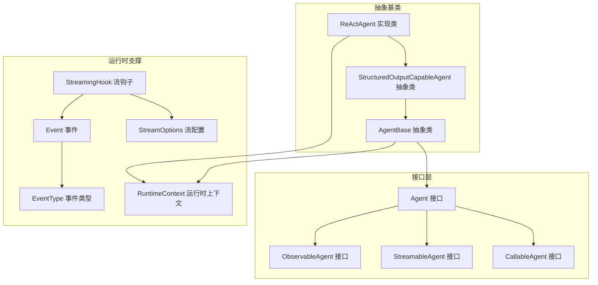
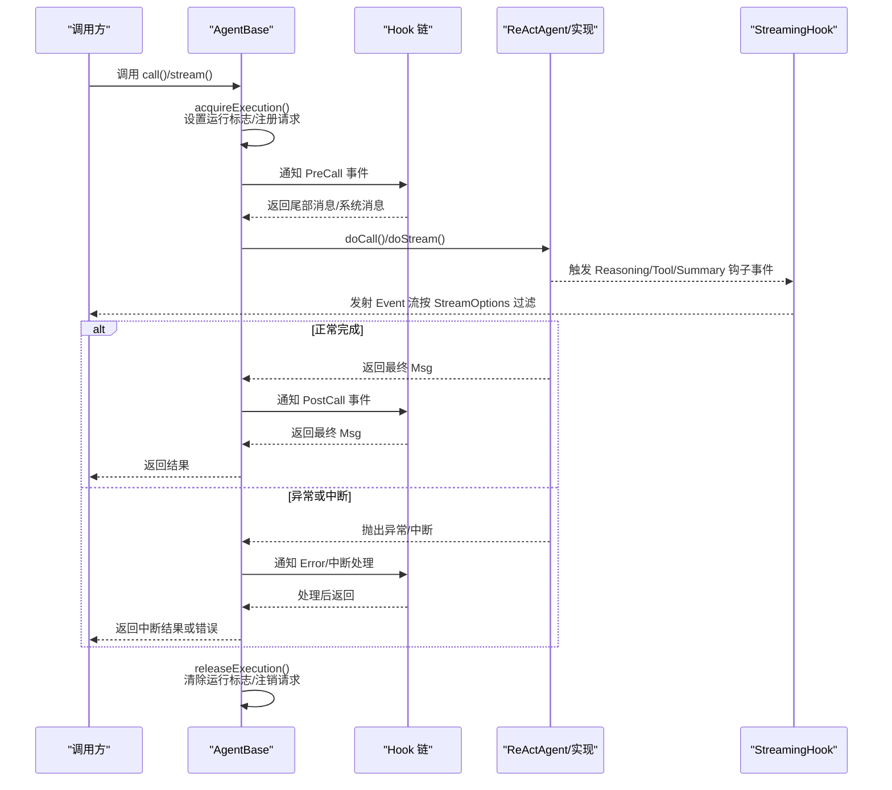
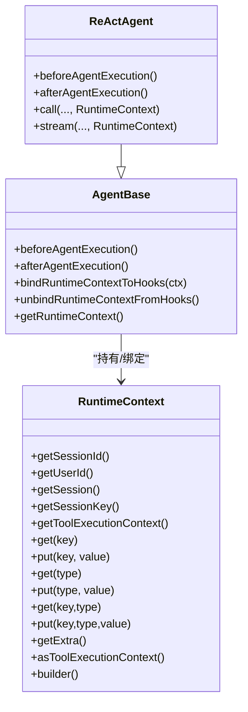
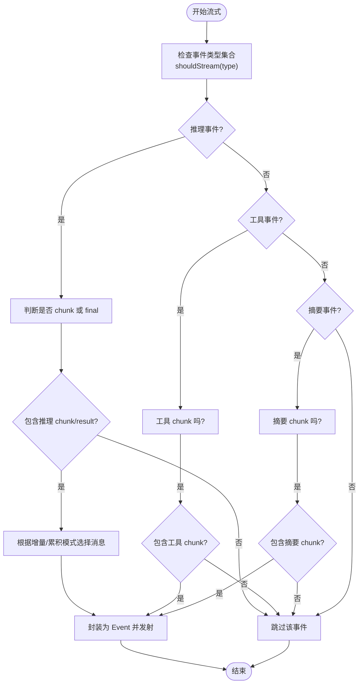
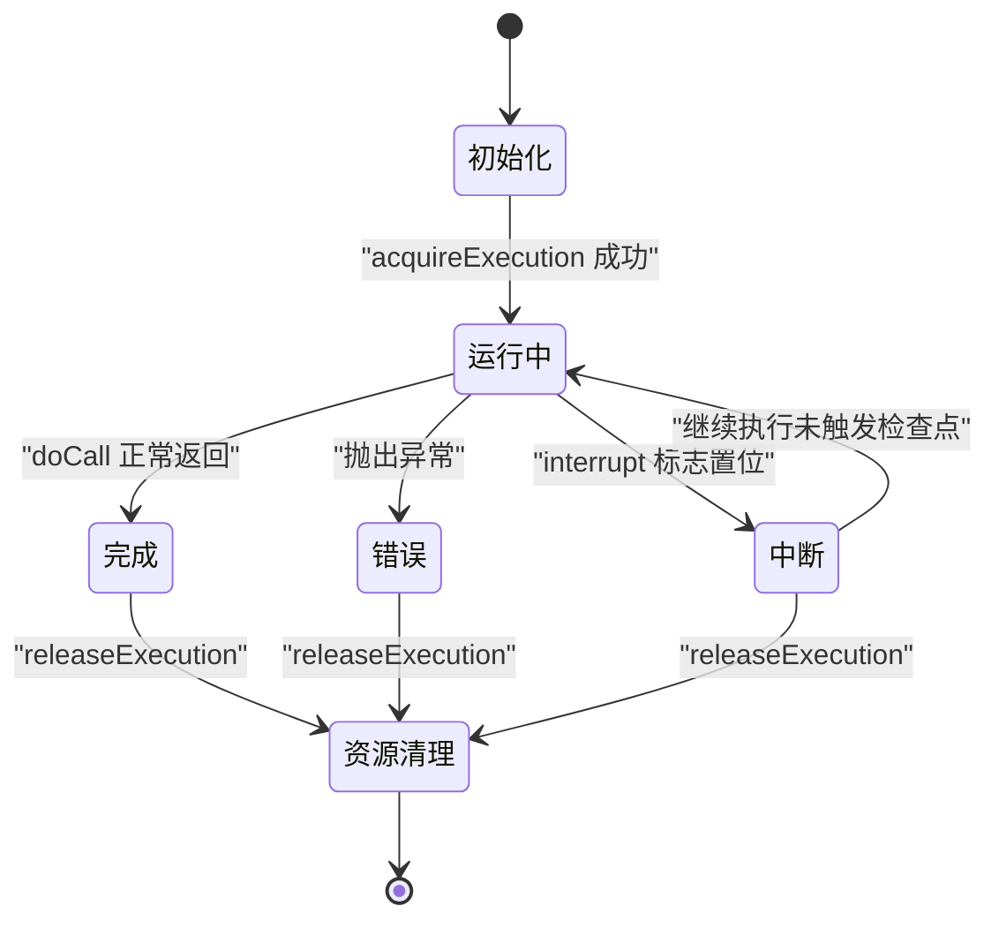
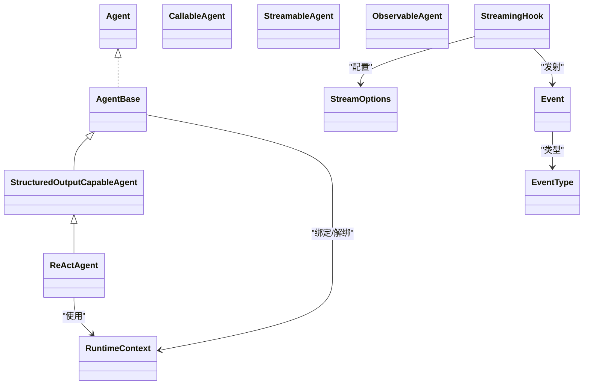

# 智能体生命周期

<cite>
**本文引用的文件**
- [RuntimeContext.java](file://agentscope-core/src/main/java/io/agentscope/core/agent/RuntimeContext.java)
- [StreamOptions.java](file://agentscope-core/src/main/java/io/agentscope/core/agent/StreamOptions.java)
- [Agent.java](file://agentscope-core/src/main/java/io/agentscope/core/agent/Agent.java)
- [AgentBase.java](file://agentscope-core/src/main/java/io/agentscope/core/agent/AgentBase.java)
- [ObservableAgent.java](file://agentscope-core/src/main/java/io/agentscope/core/agent/ObservableAgent.java)
- [StreamableAgent.java](file://agentscope-core/src/main/java/io/agentscope/core/agent/StreamableAgent.java)
- [CallableAgent.java](file://agentscope-core/src/main/java/io/agentscope/core/agent/CallableAgent.java)
- [EventType.java](file://agentscope-core/src/main/java/io/agentscope/core/agent/EventType.java)
- [Event.java](file://agentscope-core/src/main/java/io/agentscope/core/agent/Event.java)
- [StreamingHook.java](file://agentscope-core/src/main/java/io/agentscope/core/agent/StreamingHook.java)
- [StructuredOutputCapableAgent.java](file://agentscope-core/src/main/java/io/agentscope/core/agent/StructuredOutputCapableAgent.java)
- [ReActAgent.java](file://agentscope-core/src/main/java/io/agentscope/core/ReActAgent.java)
</cite>

## 目录
1. [简介](#简介)
2. [项目结构](#项目结构)
3. [核心组件](#核心组件)
4. [架构总览](#架构总览)
5. [详细组件分析](#详细组件分析)
6. [依赖关系分析](#依赖关系分析)
7. [性能考量](#性能考量)
8. [故障排查指南](#故障排查指南)
9. [结论](#结论)
10. [附录：生命周期 API 参考与示例](#附录生命周期-api-参考与示例)

## 简介
本文件系统性阐述 AgentScope Java 中“智能体生命周期”的设计与实现，覆盖从创建、初始化、运行、中断、暂停/恢复（通过中断与优雅停机）、终止到资源清理的全过程；详解 RuntimeContext 的作用与管理方式（上下文绑定、状态传递、资源清理）；解释流式处理的实现机制（StreamOptions 配置与事件流管理）；总结状态转换规则、异常处理策略与资源管理最佳实践，并提供完整的生命周期 API 参考与使用示例路径。

## 项目结构
围绕智能体生命周期的关键代码位于 agentscope-core 模块的 agent 包中，主要由接口层（Agent、CallableAgent、StreamableAgent、ObservableAgent）、抽象基类（AgentBase、StructuredOutputCapableAgent、ReActAgent）以及运行时支撑（RuntimeContext、StreamOptions、Event、EventType、StreamingHook）构成。

图示来源
- [Agent.java:41-82](file://agentscope-core/src/main/java/io/agentscope/core/agent/Agent.java#L41-L82)
- [CallableAgent.java:35-139](file://agentscope-core/src/main/java/io/agentscope/core/agent/CallableAgent.java#L35-L139)
- [StreamableAgent.java:36-152](file://agentscope-core/src/main/java/io/agentscope/core/agent/StreamableAgent.java#L36-L152)
- [ObservableAgent.java:36-53](file://agentscope-core/src/main/java/io/agentscope/core/agent/ObservableAgent.java#L36-L53)
- [AgentBase.java:93-920](file://agentscope-core/src/main/java/io/agentscope/core/agent/AgentBase.java#L93-L920)
- [StructuredOutputCapableAgent.java:65-200](file://agentscope-core/src/main/java/io/agentscope/core/agent/StructuredOutputCapableAgent.java#L65-L200)
- [ReActAgent.java:140-394](file://agentscope-core/src/main/java/io/agentscope/core/ReActAgent.java#L140-L394)
- [RuntimeContext.java:34-361](file://agentscope-core/src/main/java/io/agentscope/core/agent/RuntimeContext.java#L34-L361)
- [StreamOptions.java:62-371](file://agentscope-core/src/main/java/io/agentscope/core/agent/StreamOptions.java#L62-L371)
- [Event.java:51-211](file://agentscope-core/src/main/java/io/agentscope/core/agent/Event.java#L51-L211)
- [EventType.java:24-94](file://agentscope-core/src/main/java/io/agentscope/core/agent/EventType.java#L24-L94)
- [StreamingHook.java:43-164](file://agentscope-core/src/main/java/io/agentscope/core/agent/StreamingHook.java#L43-L164)

章节来源
- [Agent.java:20-82](file://agentscope-core/src/main/java/io/agentscope/core/agent/Agent.java#L20-L82)
- [AgentBase.java:49-92](file://agentscope-core/src/main/java/io/agentscope/core/agent/AgentBase.java#L49-L92)

## 核心组件
- Agent 接口：统一能力契约，组合可调用、可流式、可观察能力，并提供中断能力。
- AgentBase 抽象类：提供钩子集成、消息 Hub 订阅管理、中断处理、追踪、状态模块化等基础设施，不包含内存管理。
- StructuredOutputCapableAgent 抽象类：面向结构化输出的通用能力，注册生成工具、控制流钩子、内存压缩与提醒模式。
- ReActAgent 实现类：具体智能体实现，结合记忆、工具、计划、RAG、长短期记忆等，支持迭代推理-行动循环。
- RuntimeContext 运行时上下文：单次调用级元数据容器，线程安全属性袋，可合并为工具执行上下文。
- StreamOptions 流配置：控制事件类型过滤、增量/累积模式及各类细分事件的包含策略。
- Event/EventType：事件模型与类型枚举，用于流式传输中间态与最终态。
- StreamingHook：内部钩子，拦截 Hook 事件并转换为 Event 流，负责增量/累积与过滤。

章节来源
- [Agent.java:20-82](file://agentscope-core/src/main/java/io/agentscope/core/agent/Agent.java#L20-L82)
- [AgentBase.java:93-920](file://agentscope-core/src/main/java/io/agentscope/core/agent/AgentBase.java#L93-L920)
- [StructuredOutputCapableAgent.java:65-200](file://agentscope-core/src/main/java/io/agentscope/core/agent/StructuredOutputCapableAgent.java#L65-L200)
- [ReActAgent.java:140-394](file://agentscope-core/src/main/java/io/agentscope/core/ReActAgent.java#L140-L394)
- [RuntimeContext.java:34-361](file://agentscope-core/src/main/java/io/agentscope/core/agent/RuntimeContext.java#L34-L361)
- [StreamOptions.java:62-371](file://agentscope-core/src/main/java/io/agentscope/core/agent/StreamOptions.java#L62-L371)
- [Event.java:51-211](file://agentscope-core/src/main/java/io/agentscope/core/agent/Event.java#L51-L211)
- [EventType.java:24-94](file://agentscope-core/src/main/java/io/agentscope/core/agent/EventType.java#L24-L94)
- [StreamingHook.java:43-164](file://agentscope-core/src/main/java/io/agentscope/core/agent/StreamingHook.java#L43-L164)

## 架构总览
下图展示一次典型调用的生命周期流程，涵盖初始化、钩子通知、执行、流式事件发射、错误处理与资源释放。

图示来源
- [AgentBase.java:182-201](file://agentscope-core/src/main/java/io/agentscope/core/agent/AgentBase.java#L182-L201)
- [AgentBase.java:661-741](file://agentscope-core/src/main/java/io/agentscope/core/agent/AgentBase.java#L661-L741)
- [AgentBase.java:449-457](file://agentscope-core/src/main/java/io/agentscope/core/agent/AgentBase.java#L449-L457)
- [AgentBase.java:411-439](file://agentscope-core/src/main/java/io/agentscope/core/agent/AgentBase.java#L411-L439)
- [StreamingHook.java:62-121](file://agentscope-core/src/main/java/io/agentscope/core/agent/StreamingHook.java#L62-L121)
- [ReActAgent.java:364-394](file://agentscope-core/src/main/java/io/agentscope/core/ReActAgent.java#L364-L394)

## 详细组件分析

### RuntimeContext：上下文绑定、状态传递与资源清理
- 作用与特性
  - 单次调用级会话范围字段与线程安全属性存储（字符串键与类型化键分层），支持合并为工具执行上下文。
  - 提供浅拷贝视图与默认键访问，便于在钩子与工具间共享状态。
- 绑定与解绑
  - 在 AgentBase.beforeAgentExecution 与 afterAgentExecution 期间，ReActAgent 将 RuntimeContext 绑定至所有实现了 RuntimeContextAware 的钩子，并在执行结束后解除绑定。
- 工具上下文合并
  - asToolExecutionContext 将 RuntimeContext 作为最高优先级存储合并入工具执行上下文，确保运行期属性优先于构建期注入。
- 最佳实践
  - 使用 Builder 注入会话信息、用户标识与工具执行上下文；避免在属性中持久化非临时数据；在钩子结束时及时清理。

图示来源
- [RuntimeContext.java:34-361](file://agentscope-core/src/main/java/io/agentscope/core/agent/RuntimeContext.java#L34-L361)
- [AgentBase.java:517-556](file://agentscope-core/src/main/java/io/agentscope/core/agent/AgentBase.java#L517-L556)
- [ReActAgent.java:198-230](file://agentscope-core/src/main/java/io/agentscope/core/ReActAgent.java#L198-L230)

章节来源
- [RuntimeContext.java:34-361](file://agentscope-core/src/main/java/io/agentscope/core/agent/RuntimeContext.java#L34-L361)
- [AgentBase.java:517-556](file://agentscope-core/src/main/java/io/agentscope/core/agent/AgentBase.java#L517-L556)
- [ReActAgent.java:198-230](file://agentscope-core/src/main/java/io/agentscope/core/ReActAgent.java#L198-L230)

### 流式处理：StreamOptions 与事件流管理
- StreamOptions
  - 控制事件类型集合、增量/累积模式、以及各类细分事件（推理、行动、摘要）的包含策略。
  - 提供便捷方法判断是否应包含某类型事件与推理/摘要的 chunk/result。
- 事件模型
  - Event 封装事件类型、消息体与是否为最后一条（isLast），支持携带来源（子智能体）。
  - EventType 定义 REASONING、TOOL_RESULT、HINT、AGENT_RESULT、SUMMARY 等类型。
- 流钩子
  - StreamingHook 拦截 ReasoningChunk/PostReasoning、ActingChunk/PostActing、SummaryChunk/PostSummary 等事件，依据 StreamOptions 过滤与选择增量/累积消息，最终发射 Event 到下游。

图示来源
- [StreamOptions.java:147-251](file://agentscope-core/src/main/java/io/agentscope/core/agent/StreamOptions.java#L147-L251)
- [EventType.java:24-94](file://agentscope-core/src/main/java/io/agentscope/core/agent/EventType.java#L24-L94)
- [Event.java:51-211](file://agentscope-core/src/main/java/io/agentscope/core/agent/Event.java#L51-L211)
- [StreamingHook.java:62-121](file://agentscope-core/src/main/java/io/agentscope/core/agent/StreamingHook.java#L62-L121)

章节来源
- [StreamOptions.java:62-371](file://agentscope-core/src/main/java/io/agentscope/core/agent/StreamOptions.java#L62-L371)
- [EventType.java:24-94](file://agentscope-core/src/main/java/io/agentscope/core/agent/EventType.java#L24-L94)
- [Event.java:51-211](file://agentscope-core/src/main/java/io/agentscope/core/agent/Event.java#L51-L211)
- [StreamingHook.java:43-164](file://agentscope-core/src/main/java/io/agentscope/core/agent/StreamingHook.java#L43-L164)

### 生命周期阶段与状态转换
- 初始化
  - 构造 AgentBase 时注册系统钩子与自定义钩子，排序后绑定 RuntimeContextAware 钩子。
  - ReActAgent 在 beforeAgentExecution 中绑定 RuntimeContext，并初始化当前系统消息引用。
- 运行
  - call() 使用 Mono.using 确保 acquireExecution/releaseExecution 成功配对；PreCall/PostCall 钩子贯穿执行前后。
  - doCall/doStream 由具体实现（如 ReActAgent）提供，内部可多次检查中断点。
- 中断/暂停/恢复
  - 通过 interrupt()/interrupt(Msg)/interrupt(InterruptSource) 设置中断标志；在关键检查点调用 checkInterruptedAsync() 触发 InterruptedException。
  - AgentBase 捕获中断并调用 handleInterrupt，交由具体实现恢复或生成中断响应。
- 终止与资源清理
  - releaseExecution 清理运行状态、注销请求；afterAgentExecution 解绑 RuntimeContext；钩子动态增删避免泄漏。
- 结束
  - 正常完成：PostCall 通知并广播消息；错误或中断：Error 通知与中断处理。

图示来源
- [AgentBase.java:411-439](file://agentscope-core/src/main/java/io/agentscope/core/agent/AgentBase.java#L411-L439)
- [AgentBase.java:449-457](file://agentscope-core/src/main/java/io/agentscope/core/agent/AgentBase.java#L449-L457)
- [AgentBase.java:517-556](file://agentscope-core/src/main/java/io/agentscope/core/agent/AgentBase.java#L517-L556)

章节来源
- [AgentBase.java:93-920](file://agentscope-core/src/main/java/io/agentscope/core/agent/AgentBase.java#L93-L920)
- [ReActAgent.java:198-230](file://agentscope-core/src/main/java/io/agentscope/core/ReActAgent.java#L198-L230)

### 异常处理策略与资源管理最佳实践
- 异常处理
  - 统一在 createErrorHandler 中捕获 InterruptedException（含 cause）并委派 handleInterrupt；其他错误通过 notifyError 通知钩子后重新抛出。
- 资源管理
  - 使用 Mono.using 确保 acquireExecution/releaseExecution 成对调用；钩子动态增删并排序；RuntimeContext 在执行前后正确绑定/解绑。
- 最佳实践
  - 在复杂智能体的关键节点（每轮迭代、推理前后、工具执行前后、流式 chunk）调用 checkInterruptedAsync。
  - 避免在钩子中注入 SYSTEM 类型消息到尾部输入（ReActAgent 有校验）。
  - 使用 RuntimeContext 传递运行期参数而非全局状态；使用 asToolExecutionContext 合并工具上下文。

章节来源
- [AgentBase.java:449-457](file://agentscope-core/src/main/java/io/agentscope/core/agent/AgentBase.java#L449-L457)
- [AgentBase.java:661-741](file://agentscope-core/src/main/java/io/agentscope/core/agent/AgentBase.java#L661-L741)
- [AgentBase.java:582-609](file://agentscope-core/src/main/java/io/agentscope/core/agent/AgentBase.java#L582-L609)

## 依赖关系分析
- 接口与实现
  - Agent 组合 Callable/Streamable/Observable；AgentBase 实现 Agent 并扩展基础设施；StructuredOutputCapableAgent 扩展 AgentBase 并引入结构化输出能力；ReActAgent 扩展 StructuredOutputCapableAgent 并实现具体推理-行动循环。
- 运行时依赖
  - ReActAgent 依赖 Memory、Toolkit、Model、StatePersistence 等；AgentBase 依赖 Hook、TracerRegistry、GracefulShutdownManager；StreamingHook 依赖 HookEvent 族与 Event。
- 上下文与工具
  - RuntimeContext 可被合并为 ToolExecutionContext，供工具栈读取；ReActAgent 在 beforeAgentExecution 绑定上下文，afterAgentExecution 解绑。

图示来源
- [Agent.java:41-82](file://agentscope-core/src/main/java/io/agentscope/core/agent/Agent.java#L41-L82)
- [CallableAgent.java:35-139](file://agentscope-core/src/main/java/io/agentscope/core/agent/CallableAgent.java#L35-L139)
- [StreamableAgent.java:36-152](file://agentscope-core/src/main/java/io/agentscope/core/agent/StreamableAgent.java#L36-L152)
- [ObservableAgent.java:36-53](file://agentscope-core/src/main/java/io/agentscope/core/agent/ObservableAgent.java#L36-L53)
- [AgentBase.java:93-920](file://agentscope-core/src/main/java/io/agentscope/core/agent/AgentBase.java#L93-L920)
- [StructuredOutputCapableAgent.java:65-200](file://agentscope-core/src/main/java/io/agentscope/core/agent/StructuredOutputCapableAgent.java#L65-L200)
- [ReActAgent.java:140-394](file://agentscope-core/src/main/java/io/agentscope/core/ReActAgent.java#L140-L394)
- [RuntimeContext.java:34-361](file://agentscope-core/src/main/java/io/agentscope/core/agent/RuntimeContext.java#L34-L361)
- [StreamOptions.java:62-371](file://agentscope-core/src/main/java/io/agentscope/core/agent/StreamOptions.java#L62-L371)
- [Event.java:51-211](file://agentscope-core/src/main/java/io/agentscope/core/agent/Event.java#L51-L211)
- [EventType.java:24-94](file://agentscope-core/src/main/java/io/agentscope/core/agent/EventType.java#L24-L94)
- [StreamingHook.java:43-164](file://agentscope-core/src/main/java/io/agentscope/core/agent/StreamingHook.java#L43-L164)

章节来源
- [AgentBase.java:93-920](file://agentscope-core/src/main/java/io/agentscope/core/agent/AgentBase.java#L93-L920)
- [ReActAgent.java:140-394](file://agentscope-core/src/main/java/io/agentscope/core/ReActAgent.java#L140-L394)

## 性能考量
- 响应式与并发
  - 使用 Reactor Mono/Flux 非阻塞执行；单实例单次调用内串行执行，避免多线程竞争。
- 中断与优雅停机
  - 在关键检查点调用 checkInterruptedAsync，减少无效计算；GracefulShutdownManager 管理请求注册与注销，避免资源泄漏。
- 流式开销
  - 合理配置 StreamOptions，避免不必要的事件发射与消息拼接；增量模式减少重复内容传输。
- 内存与状态
  - RuntimeContext 仅保存临时属性；结构化输出完成后移除临时钩子与工具，避免内存泄漏。

## 故障排查指南
- 常见问题
  - 多线程并发调用同一 Agent 实例：AgentBase 明确不支持并发执行，需串行调用。
  - 钩子注入 SYSTEM 消息：ReActAgent 在 PreCall 阶段会校验并抛出异常，应改用 setSystemMessage 或 appendSystemContent。
  - 中断未生效：确认在合适检查点调用 checkInterruptedAsync，并在 doCall 链路中传播。
  - 流式事件过多/过少：调整 StreamOptions 的事件类型集合与增量/累积模式。
- 定位手段
  - 使用 TracerRegistry 记录调用轨迹；在钩子链中插入日志；检查 GracefulShutdownManager 的注册/注销状态。

章节来源
- [AgentBase.java:68-91](file://agentscope-core/src/main/java/io/agentscope/core/agent/AgentBase.java#L68-L91)
- [AgentBase.java:706-716](file://agentscope-core/src/main/java/io/agentscope/core/agent/AgentBase.java#L706-L716)
- [AgentBase.java:372-379](file://agentscope-core/src/main/java/io/agentscope/core/agent/AgentBase.java#L372-L379)

## 结论
AgentScope Java 的智能体生命周期以 AgentBase 为核心基础设施，结合 ReActAgent 的具体实现，形成“初始化—运行—中断/异常—终止—资源清理”的闭环。RuntimeContext 提供了轻量、线程安全且可合并的运行期上下文，StreamingHook 将钩子事件映射为标准化 Event 流，StreamOptions 则精细控制事件粒度与交付模式。遵循本文的异常处理与资源管理最佳实践，可获得稳定、可观测、可扩展的智能体生命周期体验。

## 附录：生命周期 API 参考与示例

### 生命周期 API 参考
- Agent 接口
  - 获取标识、名称、描述与中断能力
  - 参考路径：[Agent.java:41-82](file://agentscope-core/src/main/java/io/agentscope/core/agent/Agent.java#L41-L82)
- AgentBase 抽象类
  - call()/call(..., structuredModel)/call(..., schema)：同步调用与结构化输出
  - interrupt()/interrupt(Msg)/interrupt(InterruptSource)：中断控制
  - beforeAgentExecution()/afterAgentExecution()：执行前后钩子
  - getRuntimeContext()/bind/unbindRuntimeContextToHooks()：上下文绑定
  - 参考路径：[AgentBase.java:182-263](file://agentscope-core/src/main/java/io/agentscope/core/agent/AgentBase.java#L182-L263)、[AgentBase.java:316-345](file://agentscope-core/src/main/java/io/agentscope/core/agent/AgentBase.java#L316-L345)、[AgentBase.java:517-556](file://agentscope-core/src/main/java/io/agentscope/core/agent/AgentBase.java#L517-L556)
- ReActAgent 实现类
  - 支持 RuntimeContext 注入的 call/stream 重载
  - beforeAgentExecution/afterAgentExecution 绑定/解绑 RuntimeContext
  - 参考路径：[ReActAgent.java:246-279](file://agentscope-core/src/main/java/io/agentscope/core/ReActAgent.java#L246-L279)、[ReActAgent.java:198-230](file://agentscope-core/src/main/java/io/agentscope/core/ReActAgent.java#L198-L230)
- StructuredOutputCapableAgent 抽象类
  - 结构化输出工具注册与钩子控制流
  - 参考路径：[StructuredOutputCapableAgent.java:126-196](file://agentscope-core/src/main/java/io/agentscope/core/agent/StructuredOutputCapableAgent.java#L126-L196)
- RuntimeContext 运行时上下文
  - 会话信息、用户标识、工具上下文合并、类型化/字符串键访问
  - 参考路径：[RuntimeContext.java:34-361](file://agentscope-core/src/main/java/io/agentscope/core/agent/RuntimeContext.java#L34-L361)
- StreamOptions 流配置
  - 事件类型集合、增量/累积模式、推理/行动/摘要包含策略
  - 参考路径：[StreamOptions.java:62-371](file://agentscope-core/src/main/java/io/agentscope/core/agent/StreamOptions.java#L62-L371)
- Event/EventType 事件模型
  - 事件类型、消息体、是否为最后一条、来源标识
  - 参考路径：[Event.java:51-211](file://agentscope-core/src/main/java/io/agentscope/core/agent/Event.java#L51-L211)、[EventType.java:24-94](file://agentscope-core/src/main/java/io/agentscope/core/agent/EventType.java#L24-L94)
- StreamingHook 流钩子
  - 将 Reasoning/Tool/Summary 钩子事件映射为 Event 流
  - 参考路径：[StreamingHook.java:43-164](file://agentscope-core/src/main/java/io/agentscope/core/agent/StreamingHook.java#L43-L164)

### 使用示例（路径指引）
- 创建并调用智能体（含结构化输出）
  - 示例路径：[ReActAgent.java:108-136](file://agentscope-core/src/main/java/io/agentscope/core/ReActAgent.java#L108-L136)
- 使用 RuntimeContext 注入上下文
  - 示例路径：[ReActAgent.java:246-279](file://agentscope-core/src/main/java/io/agentscope/core/ReActAgent.java#L246-L279)
- 配置流式选项与订阅事件
  - 示例路径：[StreamOptions.java:38-60](file://agentscope-core/src/main/java/io/agentscope/core/agent/StreamOptions.java#L38-L60)
- 自定义钩子参与流式事件
  - 示例路径：[StreamingHook.java:62-121](file://agentscope-core/src/main/java/io/agentscope/core/agent/StreamingHook.java#L62-L121)