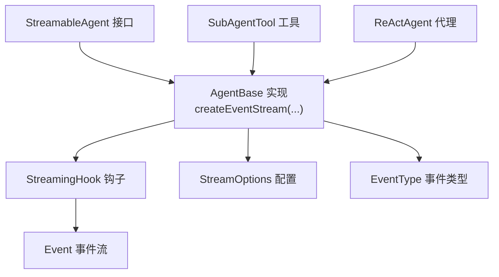
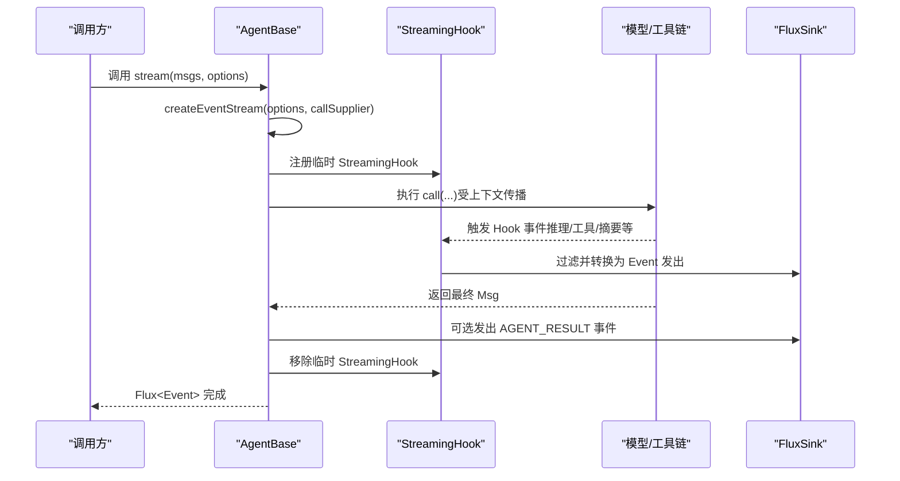
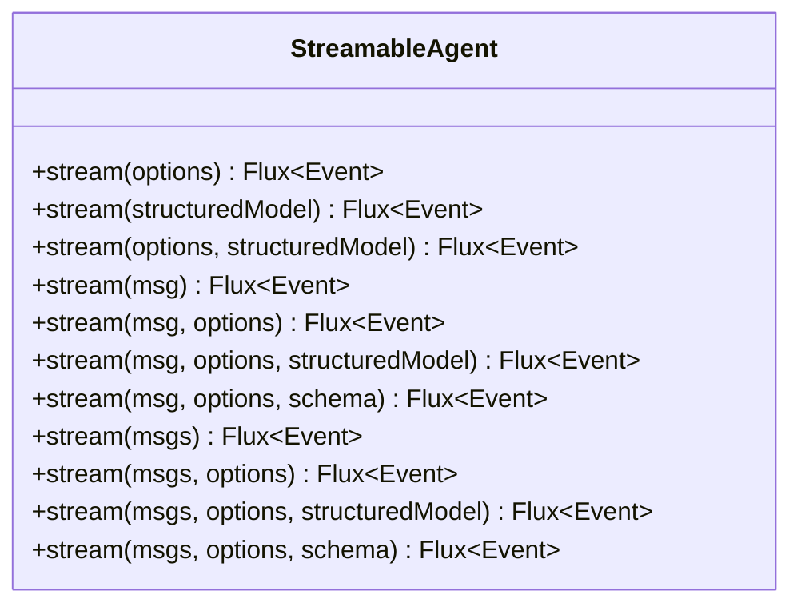
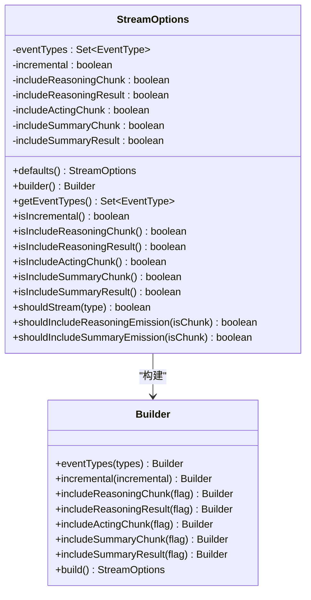
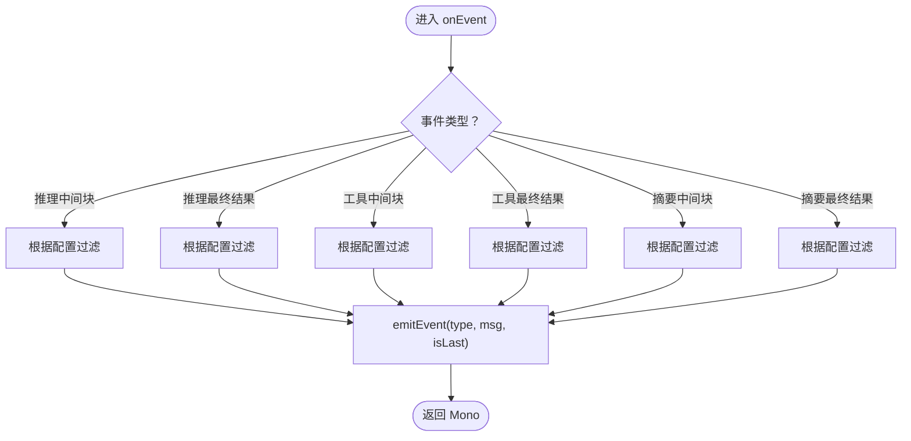
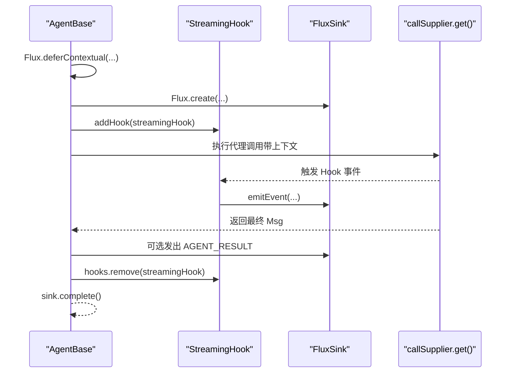
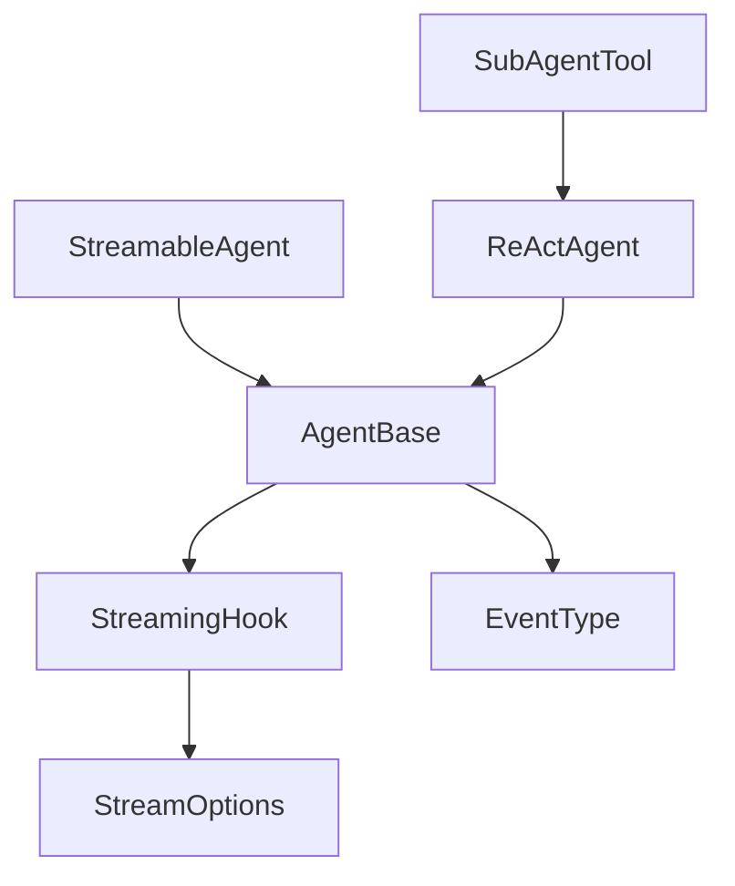

# 可流式代理（StreamableAgent）

<cite>
**本文引用的文件**
- [StreamableAgent.java](file://agentscope-core/src/main/java/io/agentscope/core/agent/StreamableAgent.java)
- [StreamOptions.java](file://agentscope-core/src/main/java/io/agentscope/core/agent/StreamOptions.java)
- [StreamingHook.java](file://agentscope-core/src/main/java/io/agentscope/core/agent/StreamingHook.java)
- [AgentBase.java](file://agentscope-core/src/main/java/io/agentscope/core/agent/AgentBase.java)
- [EventType.java](file://agentscope-core/src/main/java/io/agentscope/core/agent/EventType.java)
- [SubAgentTool.java](file://agentscope-core/src/main/java/io/agentscope/core/tool/subagent/SubAgentTool.java)
- [ReActAgent.java](file://agentscope-core/src/main/java/io/agentscope/core/ReActAgent.java)
- [StreamingBehaviorE2ETest.java](file://agentscope-core/src/test/java/io/agentscope/core/e2e/StreamingBehaviorE2ETest.java)
</cite>

## 目录
1. [引言](#引言)
2. [项目结构](#项目结构)
3. [核心组件](#核心组件)
4. [架构总览](#架构总览)
5. [详细组件分析](#详细组件分析)
6. [依赖分析](#依赖分析)
7. [性能考虑](#性能考虑)
8. [故障排查指南](#故障排查指南)
9. [结论](#结论)
10. [附录：实现示例与最佳实践](#附录实现示例与最佳实践)

## 引言
本文件系统性阐述 AgentScope Java 中“可流式代理”（StreamableAgent）的设计理念、接口定义与实现机制，重点解释其在实时事件传输与增量响应生成方面的能力，以及在用户体验与性能层面的优势。文档同时提供事件监听与处理机制的实现路径、常见问题与最佳实践，帮助开发者快速上手并稳定集成。

## 项目结构
围绕可流式代理的相关代码主要位于 agentscope-core 模块的 agent 包中，核心文件包括：
- StreamableAgent 接口：定义统一的流式调用入口与多种重载形式
- StreamOptions 配置：控制事件类型过滤、增量/累积模式及各类子事件的包含策略
- StreamingHook 内部钩子：将内部 Hook 事件转换为对外的 Event 流
- AgentBase 抽象基类：实现 createEventStream 以统一管理钩子生命周期与最终结果事件
- EventType 枚举：定义可被流式传输的事件类型
- SubAgentTool 与 ReActAgent：展示如何在工具链与具体代理中使用流式能力

图表来源
- [StreamableAgent.java:36-152](file://agentscope-core/src/main/java/io/agentscope/core/agent/StreamableAgent.java#L36-L152)
- [AgentBase.java:850-947](file://agentscope-core/src/main/java/io/agentscope/core/agent/AgentBase.java#L850-L947)
- [StreamingHook.java:43-163](file://agentscope-core/src/main/java/io/agentscope/core/agent/StreamingHook.java#L43-L163)
- [StreamOptions.java:62-371](file://agentscope-core/src/main/java/io/agentscope/core/agent/StreamOptions.java#L62-L371)
- [EventType.java:24-94](file://agentscope-core/src/main/java/io/agentscope/core/agent/EventType.java#L24-L94)
- [SubAgentTool.java:321-348](file://agentscope-core/src/main/java/io/agentscope/core/tool/subagent/SubAgentTool.java#L321-L348)
- [ReActAgent.java:140](file://agentscope-core/src/main/java/io/agentscope/core/ReActAgent.java#L140)

章节来源
- [StreamableAgent.java:36-152](file://agentscope-core/src/main/java/io/agentscope/core/agent/StreamableAgent.java#L36-L152)
- [AgentBase.java:850-947](file://agentscope-core/src/main/java/io/agentscope/core/agent/AgentBase.java#L850-L947)

## 核心组件
- StreamableAgent 接口：提供多重重载的 stream(...) 方法，支持单消息、多消息、带结构化输出（类或 JSON Schema）等场景；默认实现通过将输入消息列表化后委托到核心方法，便于扩展与统一处理。
- StreamOptions 配置：控制事件类型集合、是否增量传输、以及各类子事件（推理、工具执行、摘要）的中间块与最终结果的包含策略；提供 Builder 模式以灵活组合。
- StreamingHook 内部钩子：拦截 Hook 事件回调，按配置过滤并转换为 Event，支持增量/累积两种内容交付方式；维护消息 ID 对应的前一时刻内容，用于后续处理。
- AgentBase 抽象基类：统一实现 createEventStream(...)，负责：
  - 创建临时 StreamingHook 并注册到当前代理
  - 在上下文传播下执行 call(...) 逻辑
  - 在 finally 阶段移除临时钩子
  - 可选地将最终结果作为 AGENT_RESULT 事件发出
  - 使用调度线程池 publishOn(boundedElastic)，保证非阻塞
- EventType 事件类型：定义 REASONING、TOOL_RESULT、HINT、AGENT_RESULT、SUMMARY 等类型，明确各阶段的消息角色与内容特征
- SubAgentTool 与 ReActAgent：展示在子代理工具链中如何复用父代理的流式能力，以及在 ReActAgent 中如何注入钩子以启用流式

章节来源
- [StreamableAgent.java:36-152](file://agentscope-core/src/main/java/io/agentscope/core/agent/StreamableAgent.java#L36-L152)
- [StreamOptions.java:62-371](file://agentscope-core/src/main/java/io/agentscope/core/agent/StreamOptions.java#L62-L371)
- [StreamingHook.java:43-163](file://agentscope-core/src/main/java/io/agentscope/core/agent/StreamingHook.java#L43-L163)
- [AgentBase.java:850-947](file://agentscope-core/src/main/java/io/agentscope/core/agent/AgentBase.java#L850-L947)
- [EventType.java:24-94](file://agentscope-core/src/main/java/io/agentscope/core/agent/EventType.java#L24-L94)
- [SubAgentTool.java:321-348](file://agentscope-core/src/main/java/io/agentscope/core/tool/subagent/SubAgentTool.java#L321-L348)
- [ReActAgent.java:140](file://agentscope-core/src/main/java/io/agentscope/core/ReActAgent.java#L140)

## 架构总览
下图展示了从调用方到代理内部、再到事件流的完整链路，以及关键对象之间的交互关系。

图表来源
- [AgentBase.java:897-947](file://agentscope-core/src/main/java/io/agentscope/core/agent/AgentBase.java#L897-L947)
- [StreamingHook.java:62-121](file://agentscope-core/src/main/java/io/agentscope/core/agent/StreamingHook.java#L62-L121)

章节来源
- [AgentBase.java:897-947](file://agentscope-core/src/main/java/io/agentscope/core/agent/AgentBase.java#L897-L947)
- [StreamingHook.java:62-121](file://agentscope-core/src/main/java/io/agentscope/core/agent/StreamingHook.java#L62-L121)

## 详细组件分析

### 组件A：StreamableAgent 接口
- 设计理念
  - 将“流式事件”抽象为统一的 Flux<Event>，屏蔽底层实现细节
  - 提供多种重载以适配不同输入形态（单消息、多消息、结构化输出）
  - 默认实现将所有重载归一到 List<Msg> + StreamOptions 的核心签名，降低实现复杂度
- 关键点
  - 增量/累积模式由 StreamOptions 控制
  - 结构化输出可通过 Class<?> 或 JsonNode 指定
  - 事件类型过滤由 EventType 集合与 shouldStream(...) 协同完成

图表来源
- [StreamableAgent.java:36-152](file://agentscope-core/src/main/java/io/agentscope/core/agent/StreamableAgent.java#L36-L152)

章节来源
- [StreamableAgent.java:36-152](file://agentscope-core/src/main/java/io/agentscope/core/agent/StreamableAgent.java#L36-L152)

### 组件B：StreamOptions 配置
- 功能要点
  - 事件类型集合：支持 EventType.ALL 与具体类型组合
  - 增量/累积模式：isIncremental 控制每次发射的新内容或累计内容
  - 子事件包含策略：分别针对推理、工具执行、摘要的中间块与最终结果进行细粒度控制
  - Builder 模式：提供 fluent API，便于组合与扩展
- 使用建议
  - 默认配置保留所有事件与增量模式，确保兼容性
  - 在需要减少网络负载时，可关闭中间块仅保留最终结果

图表来源
- [StreamOptions.java:62-371](file://agentscope-core/src/main/java/io/agentscope/core/agent/StreamOptions.java#L62-L371)

章节来源
- [StreamOptions.java:62-371](file://agentscope-core/src/main/java/io/agentscope/core/agent/StreamOptions.java#L62-L371)

### 组件C：StreamingHook 内部钩子
- 处理流程
  - 拦截推理、工具执行、摘要三类事件的中间块与最终结果
  - 根据 StreamOptions 的过滤规则决定是否发射
  - 在增量模式下直接使用增量块，在累积模式下使用累计消息
  - 维护消息 ID 到前一时刻内容的映射，便于后续处理
- 关键行为
  - 推理事件：区分中间块与最终结果，按配置选择包含
  - 工具事件：将工具结果封装为 TOOL 角色消息
  - 摘要事件：与推理类似，支持中间块与最终结果

图表来源
- [StreamingHook.java:62-121](file://agentscope-core/src/main/java/io/agentscope/core/agent/StreamingHook.java#L62-L121)
- [StreamingHook.java:146-162](file://agentscope-core/src/main/java/io/agentscope/core/agent/StreamingHook.java#L146-L162)

章节来源
- [StreamingHook.java:43-163](file://agentscope-core/src/main/java/io/agentscope/core/agent/StreamingHook.java#L43-L163)

### 组件D：AgentBase 的 createEventStream
- 生命周期管理
  - 使用 Flux.deferContextual 与 Mono.defer 确保上下文传播与钩子注册时机正确
  - 通过 FluxSink 的 BUFFER 策略缓冲事件，避免背压问题
  - 在 finally 阶段移除临时 StreamingHook，防止泄漏
- 结果事件
  - 可选将最终 Msg 作为 AGENT_RESULT 事件发出，避免与返回值重复
- 性能与并发
  - 使用 boundedElastic 线程池发布事件，避免阻塞主线程

图表来源
- [AgentBase.java:897-947](file://agentscope-core/src/main/java/io/agentscope/core/agent/AgentBase.java#L897-L947)

章节来源
- [AgentBase.java:897-947](file://agentscope-core/src/main/java/io/agentscope/core/agent/AgentBase.java#L897-L947)

### 组件E：事件类型与内容语义
- EventType
  - REASONING：推理过程，支持中间块与最终结果
  - TOOL_RESULT：工具执行结果，通常携带 ToolResultBlock
  - HINT：提示信息（如检索/记忆），一般为完整消息
  - AGENT_RESULT：最终结果，通常不参与流式（避免重复）
  - SUMMARY：摘要生成，支持中间块与最终结果
- 内容角色
  - REASONING 与 SUMMARY 默认 ASSISTANT 角色
  - TOOL_RESULT 默认 TOOL 角色
  - HINT 可为 USER 或 SYSTEM 角色

章节来源
- [EventType.java:24-94](file://agentscope-core/src/main/java/io/agentscope/core/agent/EventType.java#L24-L94)

### 组件F：子代理工具链中的流式复用
- SubAgentTool 在调用子代理时，若运行时上下文存在且子代理为 ReActAgent，则直接复用其流式能力，否则回退到通用 stream(...) 调用
- 这种设计保证了在复杂工作流中，父代理能够承接子代理产生的事件流

章节来源
- [SubAgentTool.java:321-348](file://agentscope-core/src/main/java/io/agentscope/core/tool/subagent/SubAgentTool.java#L321-L348)

## 依赖分析
- 耦合关系
  - StreamableAgent 与 AgentBase：接口与实现分离，AgentBase 提供统一的流式实现
  - StreamingHook 与 StreamOptions：前者按后者配置进行事件过滤与内容选择
  - AgentBase 与 EventType：事件类型枚举驱动事件分类与内容语义
  - SubAgentTool 与 ReActAgent：工具链对具体代理类型的流式能力复用
- 外部依赖
  - Reactor Flux/FluxSink：事件流与背压处理
  - Jackson JsonNode：JSON Schema 支持

图表来源
- [StreamableAgent.java:36-152](file://agentscope-core/src/main/java/io/agentscope/core/agent/StreamableAgent.java#L36-L152)
- [AgentBase.java:850-947](file://agentscope-core/src/main/java/io/agentscope/core/agent/AgentBase.java#L850-L947)
- [StreamingHook.java:43-163](file://agentscope-core/src/main/java/io/agentscope/core/agent/StreamingHook.java#L43-L163)
- [StreamOptions.java:62-371](file://agentscope-core/src/main/java/io/agentscope/core/agent/StreamOptions.java#L62-L371)
- [EventType.java:24-94](file://agentscope-core/src/main/java/io/agentscope/core/agent/EventType.java#L24-L94)
- [SubAgentTool.java:321-348](file://agentscope-core/src/main/java/io/agentscope/core/tool/subagent/SubAgentTool.java#L321-L348)
- [ReActAgent.java:140](file://agentscope-core/src/main/java/io/agentscope/core/ReActAgent.java#L140)

章节来源
- [StreamableAgent.java:36-152](file://agentscope-core/src/main/java/io/agentscope/core/agent/StreamableAgent.java#L36-L152)
- [AgentBase.java:850-947](file://agentscope-core/src/main/java/io/agentscope/core/agent/AgentBase.java#L850-L947)

## 性能考虑
- 增量模式 vs 累积模式
  - 增量模式减少每次传输的数据量，适合长文本与实时渲染
  - 累积模式简化前端拼接逻辑，但会增加带宽与内存占用
- 事件过滤
  - 合理关闭中间块仅保留最终结果，可显著降低事件数量
  - 仅启用必要的 EventType，避免无关事件干扰
- 线程与背压
  - 使用 boundedElastic 发布事件，避免阻塞调用线程
  - FluxSink 使用 BUFFER 策略，注意下游订阅者的背压处理
- 上下文传播
  - 通过 deferContextual 与 defer 确保追踪与运行时上下文正确传递，避免额外线程切换开销

## 故障排查指南
- 事件未到达
  - 检查 StreamOptions 是否启用了对应 EventType
  - 确认 shouldStream(...) 与 shouldIncludeReasoningEmission(...) 的过滤条件
- 事件重复
  - AGENT_RESULT 默认不参与流式，避免与返回值重复；如需接收请显式开启
- 子代理事件丢失
  - 确保在工具链中正确传递运行时上下文，使 SubAgentTool 能够复用 ReActAgent 的流式能力
- 内存与资源泄漏
  - 确保临时钩子在 finally 阶段被移除；检查订阅者是否及时取消订阅
- E2E 行为验证
  - 参考端到端测试对流式内存一致性与事件过滤的验证方式，确保配置与预期一致

章节来源
- [AgentBase.java:897-947](file://agentscope-core/src/main/java/io/agentscope/core/agent/AgentBase.java#L897-L947)
- [StreamingBehaviorE2ETest.java:264-274](file://agentscope-core/src/test/java/io/agentscope/core/e2e/StreamingBehaviorE2ETest.java#L264-L274)

## 结论
StreamableAgent 通过统一的接口与可配置的流式选项，为代理在推理、工具执行与摘要生成等阶段提供了强大的实时事件传输能力。结合 AgentBase 的生命周期管理与 StreamingHook 的事件转换，开发者可以以最小成本实现高性能、低延迟的增量响应体验。配合合理的配置与最佳实践，可在复杂工作流中稳定复用流式能力。

## 附录：实现示例与最佳实践
- 实现示例（路径参考）
  - 在 ReActAgent 中注入 StreamingHook 并调用 stream(...)，参考示例路径：
    - [ReActAgent 示例（含 hook 注入）:929-937](file://agentscope-core/src/main/java/io/agentscope/core/ReActAgent.java#L929-L937)
  - 子代理工具链中复用流式能力：
    - [SubAgentTool 复用 streamWithContext:321-327](file://agentscope-core/src/main/java/io/agentscope/core/tool/subagent/SubAgentTool.java#L321-L327)
- 最佳实践
  - 默认使用 StreamOptions.defaults() 保持兼容性，再按需收紧过滤与模式
  - 在前端侧优先采用增量模式以提升感知速度
  - 明确区分中间块与最终结果，避免重复渲染
  - 在复杂工作流中确保上下文透传，以便子代理复用父代理的流式钩子
  - 订阅者侧做好背压与取消处理，避免资源泄漏