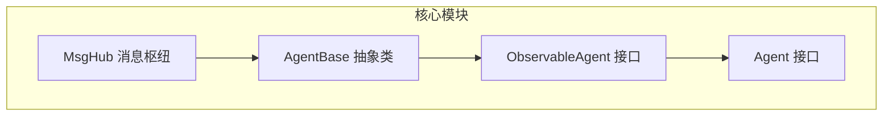
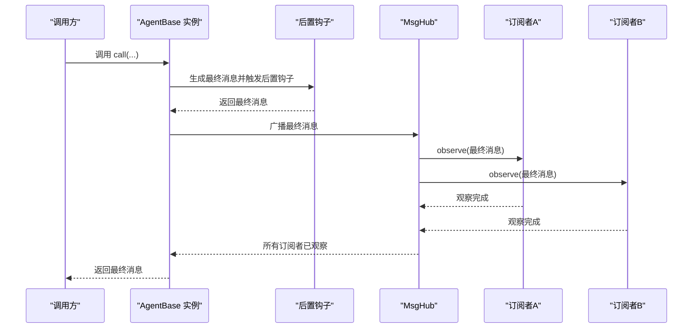
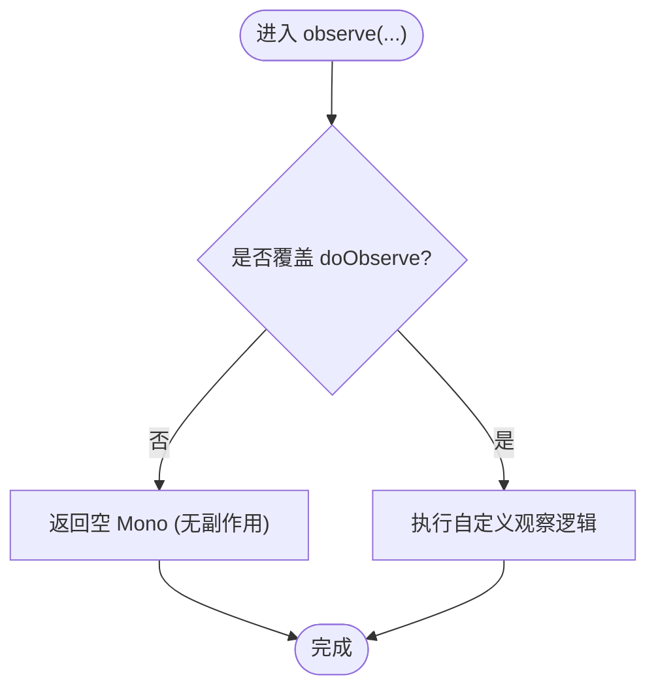
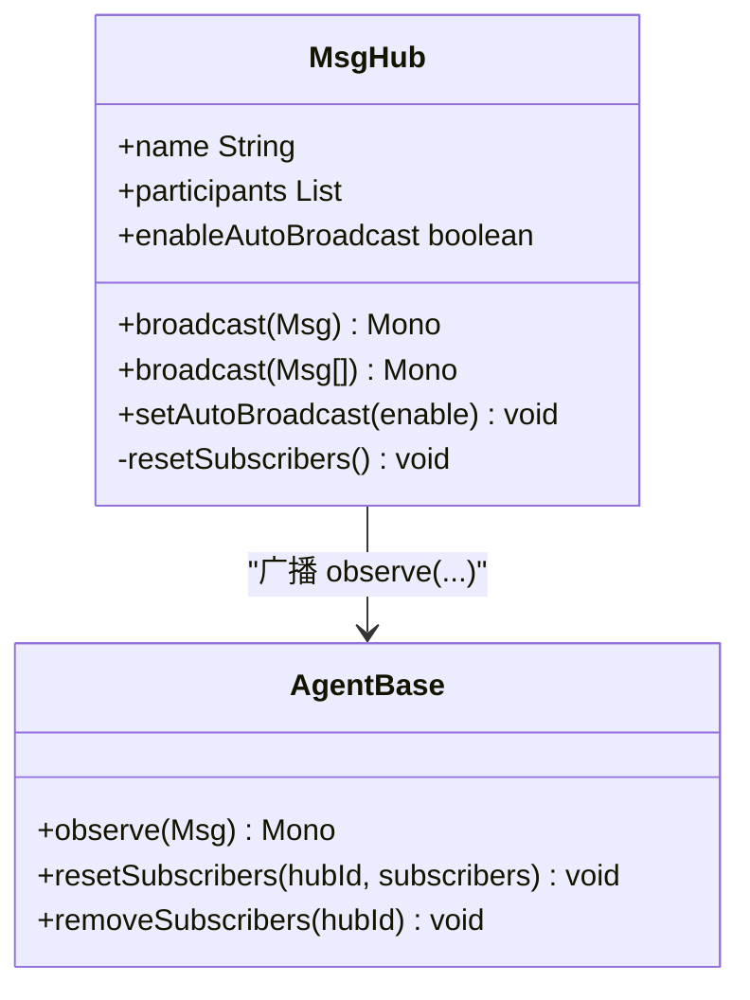
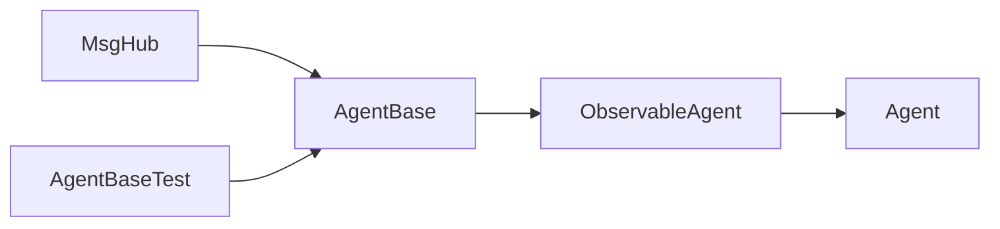

# 可观察代理 (ObservableAgent)

<cite>
**本文引用的文件**
- [ObservableAgent.java](file://agentscope-core/src/main/java/io/agentscope/core/agent/ObservableAgent.java)
- [Agent.java](file://agentscope-core/src/main/java/io/agentscope/core/agent/Agent.java)
- [AgentBase.java](file://agentscope-core/src/main/java/io/agentscope/core/agent/AgentBase.java)
- [MsgHub.java](file://agentscope-core/src/main/java/io/agentscope/core/pipeline/MsgHub.java)
- [AgentBaseTest.java](file://agentscope-core/src/test/java/io/agentscope/core/agent/AgentBaseTest.java)
- [A2aExampleApplication.java](file://agentscope-examples/a2a/src/main/java/io/agentscope/examples/a2a/A2aExampleApplication.java)
</cite>

## 目录
1. [简介](#简介)
2. [项目结构](#项目结构)
3. [核心组件](#核心组件)
4. [架构总览](#架构总览)
5. [详细组件分析](#详细组件分析)
6. [依赖分析](#依赖分析)
7. [性能考虑](#性能考虑)
8. [故障排查指南](#故障排查指南)
9. [结论](#结论)
10. [附录](#附录)

## 简介
本文件面向 AgentScope Java 的可观察代理（ObservableAgent），系统性阐述其接口设计目标、观察者模式在智能体系统中的应用方式，以及在多智能体协作场景中“仅接收不回复”的消息感知能力。文档同时给出基于仓库现有实现的消息订阅与事件处理机制说明，并总结多智能体协作的最佳实践与设计模式。

## 项目结构
与可观察代理直接相关的核心模块位于 agentscope-core 模块中，关键文件如下：
- 接口定义：ObservableAgent.java
- 组合接口：Agent.java（继承 ObservableAgent）
- 抽象基类：AgentBase.java（提供 observe 的默认实现与广播逻辑）
- 消息枢纽：MsgHub.java（负责自动广播与订阅管理）
- 测试用例：AgentBaseTest.java（验证 observe 行为）
- 示例应用：A2aExampleApplication.java（展示 A2A 协议与工具注册）

图表来源
- [ObservableAgent.java:36-53](file://agentscope-core/src/main/java/io/agentscope/core/agent/ObservableAgent.java#L36-L53)
- [Agent.java:41](file://agentscope-core/src/main/java/io/agentscope/core/agent/Agent.java#L41)
- [AgentBase.java:494](file://agentscope-core/src/main/java/io/agentscope/core/agent/AgentBase.java#L494)
- [MsgHub.java:282](file://agentscope-core/src/main/java/io/agentscope/core/pipeline/MsgHub.java#L282)

章节来源
- [ObservableAgent.java:1-54](file://agentscope-core/src/main/java/io/agentscope/core/agent/ObservableAgent.java#L1-L54)
- [Agent.java:1-83](file://agentscope-core/src/main/java/io/agentscope/core/agent/Agent.java#L1-L83)
- [AgentBase.java:479-826](file://agentscope-core/src/main/java/io/agentscope/core/agent/AgentBase.java#L479-L826)
- [MsgHub.java:275-435](file://agentscope-core/src/main/java/io/agentscope/core/pipeline/MsgHub.java#L275-L435)

## 核心组件
- ObservableAgent 接口：定义“仅观察不回复”的消息感知能力，支持单条与批量消息观察。
- Agent 接口：组合了可调用、可流式、可观察三种能力，是框架内所有智能体的标准契约。
- AgentBase 抽象类：提供 observe 的默认空实现（doObserve），并在执行后通过广播机制通知订阅者。
- MsgHub：负责参与者之间的自动广播，将每个智能体的最终消息自动推送给其他订阅者，形成“观察者”链路。

章节来源
- [ObservableAgent.java:36-53](file://agentscope-core/src/main/java/io/agentscope/core/agent/ObservableAgent.java#L36-L53)
- [Agent.java:41](file://agentscope-core/src/main/java/io/agentscope/core/agent/Agent.java#L41)
- [AgentBase.java:494](file://agentscope-core/src/main/java/io/agentscope/core/agent/AgentBase.java#L494)
- [AgentBase.java:806-814](file://agentscope-core/src/main/java/io/agentscope/core/agent/AgentBase.java#L806-L814)
- [MsgHub.java:282](file://agentscope-core/src/main/java/io/agentscope/core/pipeline/MsgHub.java#L282)

## 架构总览
下图展示了从智能体调用到消息广播的端到端流程，体现 ObservableAgent 在观察者模式中的位置与职责。

图表来源
- [AgentBase.java:729-741](file://agentscope-core/src/main/java/io/agentscope/core/agent/AgentBase.java#L729-L741)
- [AgentBase.java:806-814](file://agentscope-core/src/main/java/io/agentscope/core/agent/AgentBase.java#L806-L814)
- [MsgHub.java:282](file://agentscope-core/src/main/java/io/agentscope/core/pipeline/MsgHub.java#L282)

## 详细组件分析

### ObservableAgent 接口设计
- 设计目的：为智能体提供“被动感知”能力，无需对消息进行回复即可参与多智能体协作。
- 方法语义：
  - 单条消息观察：observe(Msg) 返回完成信号，表示观察结束。
  - 批量消息观察：observe(List<Msg>) 逐条传递给单条观察方法，保证顺序与一致性。
- 使用场景：
  - 会话流监控（被动）
  - 多智能体共享上下文构建
  - 管道中的观察者模式实现

章节来源
- [ObservableAgent.java:22-35](file://agentscope-core/src/main/java/io/agentscope/core/agent/ObservableAgent.java#L22-L35)
- [ObservableAgent.java:36-53](file://agentscope-core/src/main/java/io/agentscope/core/agent/ObservableAgent.java#L36-L53)

### AgentBase 中的观察与广播
- 默认实现：doObserve(Msg) 返回空的 Mono，即默认不执行任何副作用或状态更新。
- 广播机制：在每次调用完成后，通过 notifyPostCall 获取最终消息，并调用 broadcastToSubscribers 将消息推送给所有订阅者。
- 订阅管理：resetSubscribers/removeSubscribers 控制订阅拓扑；hasSubscribers/getSubscriberCount 提供可观测性。

图表来源
- [AgentBase.java:479-496](file://agentscope-core/src/main/java/io/agentscope/core/agent/AgentBase.java#L479-L496)

章节来源
- [AgentBase.java:479-496](file://agentscope-core/src/main/java/io/agentscope/core/agent/AgentBase.java#L479-L496)
- [AgentBase.java:729-741](file://agentscope-core/src/main/java/io/agentscope/core/agent/AgentBase.java#L729-L741)
- [AgentBase.java:806-814](file://agentscope-core/src/main/java/io/agentscope/core/agent/AgentBase.java#L806-L814)

### MsgHub 的自动广播与订阅
- 自动广播：当启用时，MsgHub 在参与者调用后自动将最终消息广播给其他参与者。
- 订阅拓扑：resetSubscribers 为每个参与者建立“除自己以外”的订阅列表；setAutoBroadcast(false) 可移除订阅。
- 广播 API：broadcast(Msg) 与 broadcast(List<Msg>) 保证所有参与者均收到消息。

图表来源
- [MsgHub.java:282](file://agentscope-core/src/main/java/io/agentscope/core/pipeline/MsgHub.java#L282)
- [MsgHub.java:305-333](file://agentscope-core/src/main/java/io/agentscope/core/pipeline/MsgHub.java#L305-L333)
- [AgentBase.java:773](file://agentscope-core/src/main/java/io/agentscope/core/agent/AgentBase.java#L773-L775)

章节来源
- [MsgHub.java:275-435](file://agentscope-core/src/main/java/io/agentscope/core/pipeline/MsgHub.java#L275-L435)
- [AgentBase.java:755-796](file://agentscope-core/src/main/java/io/agentscope/core/agent/AgentBase.java#L755-L796)

### 观察者模式在智能体系统中的作用与优势
- 解耦：发送方（调用智能体）与接收方（订阅者）通过 observe 接口解耦，便于扩展与替换。
- 可观测性：通过订阅者集合统计与广播，增强系统可观测性与调试能力。
- 协作效率：在多智能体协作中，无需显式传递消息，即可实现“旁观者”式的上下文同步。

章节来源
- [AgentBase.java:788-796](file://agentscope-core/src/main/java/io/agentscope/core/agent/AgentBase.java#L788-L796)
- [MsgHub.java:92-99](file://agentscope-core/src/main/java/io/agentscope/core/pipeline/MsgHub.java#L92-L99)

### 实现示例与最佳实践
- 基础实现路径
  - 单条消息观察：参考 [AgentBase.java:479-496](file://agentscope-core/src/main/java/io/agentscope/core/agent/AgentBase.java#L479-L496) 的默认实现。
  - 批量消息观察：参考 [ObservableAgent.java:46-52](file://agentscope-core/src/main/java/io/agentscope/core/agent/ObservableAgent.java#L46-L52) 的签名与语义。
- 验证与测试
  - 单消息观察测试：参考 [AgentBaseTest.java:211-216](file://agentscope-core/src/test/java/io/agentscope/core/agent/AgentBaseTest.java#L211-L216)
  - 多消息观察测试：参考 [AgentBaseTest.java:218-229](file://agentscope-core/src/test/java/io/agentscope/core/agent/AgentBaseTest.java#L218-L229)
- 多智能体协作示例
  - A2A 协议示例应用：参考 [A2aExampleApplication.java:25-75](file://agentscope-examples/a2a/src/main/java/io/agentscope/examples/a2a/A2aExampleApplication.java#L25-L75)，展示智能体暴露与工具注册，便于在多智能体场景中集成。

章节来源
- [AgentBase.java:479-496](file://agentscope-core/src/main/java/io/agentscope/core/agent/AgentBase.java#L479-L496)
- [ObservableAgent.java:46-52](file://agentscope-core/src/main/java/io/agentscope/core/agent/ObservableAgent.java#L46-L52)
- [AgentBaseTest.java:211-229](file://agentscope-core/src/test/java/io/agentscope/core/agent/AgentBaseTest.java#L211-L229)
- [A2aExampleApplication.java:25-75](file://agentscope-examples/a2a/src/main/java/io/agentscope/examples/a2a/A2aExampleApplication.java#L25-L75)

## 依赖分析
- ObservableAgent 是 Agent 接口的组成部分，AgentBase 提供 observe 的默认实现。
- MsgHub 通过调用 AgentBase 的 observe 方法实现自动广播。
- 测试用例验证 observe 的行为与异常路径。

图表来源
- [Agent.java:41](file://agentscope-core/src/main/java/io/agentscope/core/agent/Agent.java#L41)
- [ObservableAgent.java:36-53](file://agentscope-core/src/main/java/io/agentscope/core/agent/ObservableAgent.java#L36-L53)
- [AgentBase.java:494](file://agentscope-core/src/main/java/io/agentscope/core/agent/AgentBase.java#L494)
- [MsgHub.java:282](file://agentscope-core/src/main/java/io/agentscope/core/pipeline/MsgHub.java#L282)
- [AgentBaseTest.java:211-229](file://agentscope-core/src/test/java/io/agentscope/core/agent/AgentBaseTest.java#L211-L229)

章节来源
- [Agent.java:41](file://agentscope-core/src/main/java/io/agentscope/core/agent/Agent.java#L41)
- [AgentBase.java:494](file://agentscope-core/src/main/java/io/agentscope/core/agent/AgentBase.java#L494)
- [MsgHub.java:282](file://agentscope-core/src/main/java/io/agentscope/core/pipeline/MsgHub.java#L282)
- [AgentBaseTest.java:211-229](file://agentscope-core/src/test/java/io/agentscope/core/agent/AgentBaseTest.java#L211-L229)

## 性能考虑
- 异步模型：observe 返回 Mono<Void>，采用响应式模型避免阻塞，适合高并发与长链路场景。
- 广播开销：在大型 MsgHub 中，广播会按订阅者数量线性扩展；建议合理控制订阅规模与拓扑。
- 默认实现成本：默认 doObserve 返回空 Mono，零副作用，适合“旁观者”型智能体；若需状态持久化，应谨慎选择存储策略与序列化方式。

## 故障排查指南
- 观察未生效
  - 检查是否正确实现 doObserve 或依赖默认空实现。
  - 确认订阅关系是否建立：参见 resetSubscribers/removeSubscribers。
- 广播异常
  - 检查 notifyPostCall 是否被调用（应在每次 call 结束后）。
  - 确认 MsgHub 的自动广播开关状态与订阅拓扑。
- 测试验证
  - 使用单消息与多消息观察测试用例作为回归检查点。

章节来源
- [AgentBase.java:729-741](file://agentscope-core/src/main/java/io/agentscope/core/agent/AgentBase.java#L729-L741)
- [AgentBase.java:773](file://agentscope-core/src/main/java/io/agentscope/core/agent/AgentBase.java#L773-L775)
- [AgentBaseTest.java:211-229](file://agentscope-core/src/test/java/io/agentscope/core/agent/AgentBaseTest.java#L211-L229)

## 结论
ObservableAgent 通过“仅观察不回复”的契约，为多智能体协作提供了轻量级、可扩展的观察者机制。结合 AgentBase 的默认实现与 MsgHub 的自动广播，开发者可以快速构建具备旁观者能力的智能体，实现会话流监控、共享上下文与协作编排等场景。在实践中，建议遵循最小实现原则，默认空实现，按需扩展观察逻辑，并通过测试用例保障行为一致性。

## 附录
- 相关示例应用：A2A 协议示例展示了智能体暴露与工具注册，便于在多智能体协作中集成可观察代理能力。

章节来源
- [A2aExampleApplication.java:25-75](file://agentscope-examples/a2a/src/main/java/io/agentscope/examples/a2a/A2aExampleApplication.java#L25-L75)