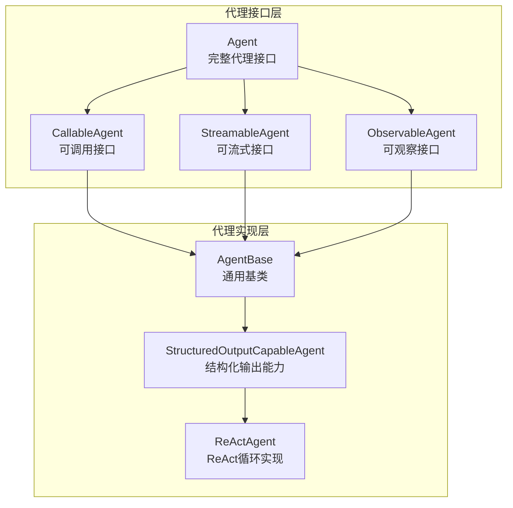
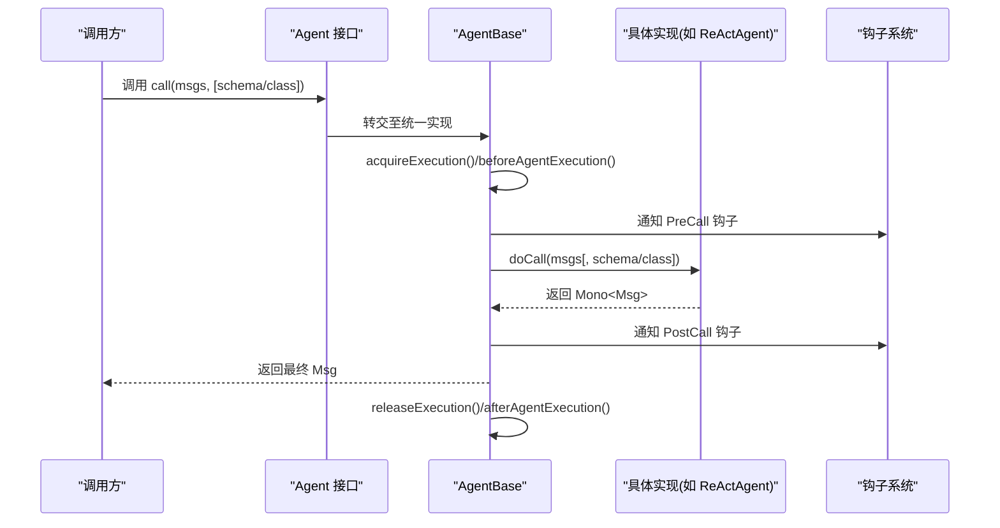
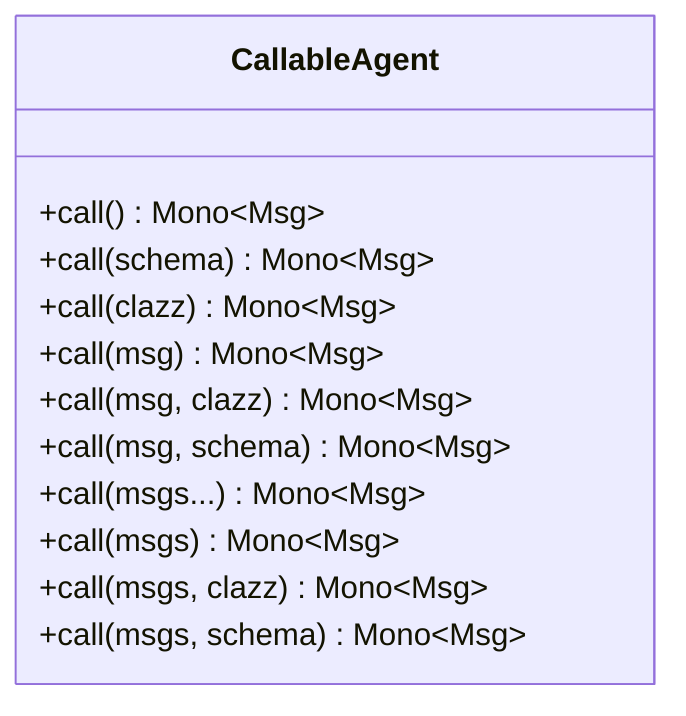
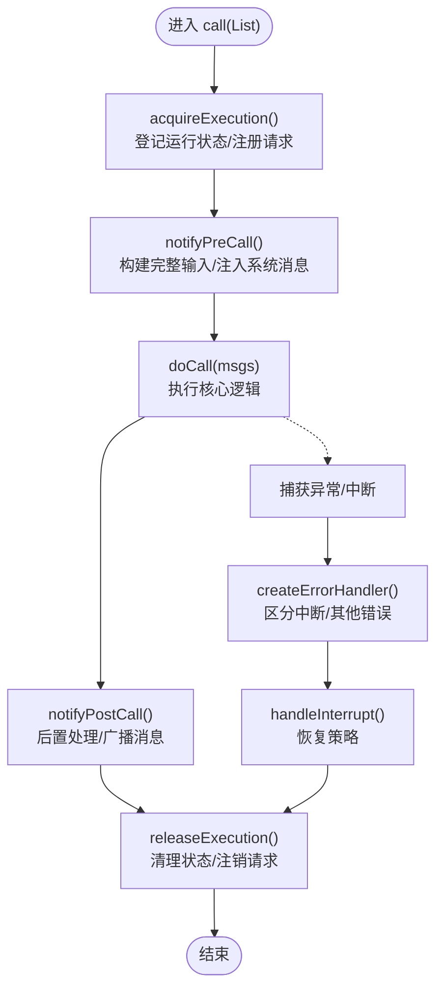
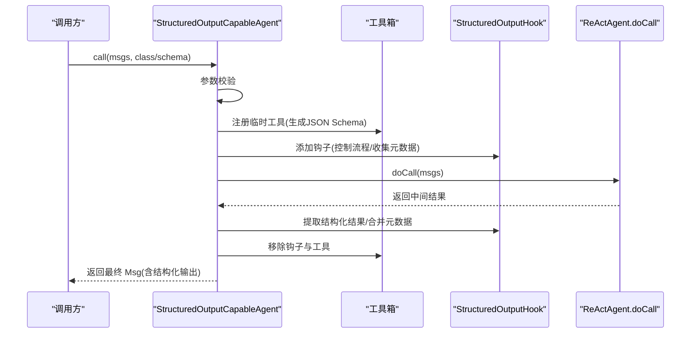
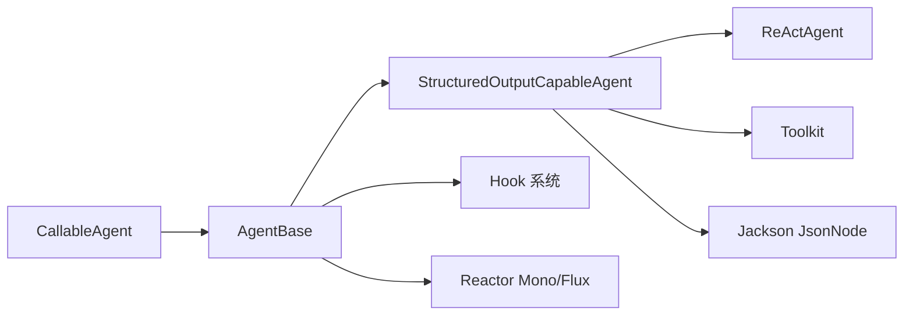

# 可调用代理 (CallableAgent)

<cite>
**本文档引用的文件**
- [CallableAgent.java](file://agentscope-core/src/main/java/io/agentscope/core/agent/CallableAgent.java)
- [Agent.java](file://agentscope-core/src/main/java/io/agentscope/core/agent/Agent.java)
- [AgentBase.java](file://agentscope-core/src/main/java/io/agentscope/core/agent/AgentBase.java)
- [StreamableAgent.java](file://agentscope-core/src/main/java/io/agentscope/core/agent/StreamableAgent.java)
- [ObservableAgent.java](file://agentscope-core/src/main/java/io/agentscope/core/agent/ObservableAgent.java)
- [StructuredOutputCapableAgent.java](file://agentscope-core/src/main/java/io/agentscope/core/agent/StructuredOutputCapableAgent.java)
- [ReActAgent.java](file://agentscope-core/src/main/java/io/agentscope/core/ReActAgent.java)
</cite>

## 目录
1. [简介](#简介)
2. [项目结构](#项目结构)
3. [核心组件](#核心组件)
4. [架构总览](#架构总览)
5. [详细组件分析](#详细组件分析)
6. [依赖分析](#依赖分析)
7. [性能考虑](#性能考虑)
8. [故障排查指南](#故障排查指南)
9. [结论](#结论)

## 简介
CallableAgent 是 AgentScope Java 框架中“可调用”的核心抽象，定义了智能体对外暴露的消息处理与响应生成能力。它通过统一的异步调用接口，支持单条或多条消息输入、流式输出（由 StreamableAgent 提供）、观察模式（由 ObservableAgent 提供），并为结构化输出提供扩展能力（由 StructuredOutputCapableAgent 提供）。该接口是所有 Agent 的最小可用契约，确保上层应用可以以一致的方式与不同类型的智能体进行交互。

## 项目结构
本节聚焦于与 CallableAgent 直接相关的核心文件及其职责分工：
- CallableAgent：定义可调用代理的统一方法族，覆盖从空输入到结构化输出的多种调用形态。
- Agent：完整代理接口，组合了 CallableAgent、StreamableAgent、ObservableAgent 的全部能力。
- AgentBase：所有代理的通用基类，封装钩子系统、中断机制、运行状态管理等横切关注点，并实现 CallableAgent 的统一调用流程。
- StreamableAgent：提供执行事件的流式输出能力，便于实时展示推理过程或工具调用结果。
- ObservableAgent：提供被动观察消息的能力，用于多智能体协作或旁路感知。
- StructuredOutputCapableAgent：在 AgentBase 基础上扩展结构化输出能力，通过临时工具与钩子实现可控的结构化生成。
- ReActAgent：典型复杂智能体实现，继承 StructuredOutputCapableAgent，实现 ReAct 循环（推理-行动）并提供结构化输出支持。

图表来源
- [CallableAgent.java:35-139](file://agentscope-core/src/main/java/io/agentscope/core/agent/CallableAgent.java#L35-L139)
- [Agent.java:41-82](file://agentscope-core/src/main/java/io/agentscope/core/agent/Agent.java#L41-L82)
- [AgentBase.java:93-302](file://agentscope-core/src/main/java/io/agentscope/core/agent/AgentBase.java#L93-L302)
- [StreamableAgent.java:36-152](file://agentscope-core/src/main/java/io/agentscope/core/agent/StreamableAgent.java#L36-L152)
- [ObservableAgent.java:36-53](file://agentscope-core/src/main/java/io/agentscope/core/agent/ObservableAgent.java#L36-L53)
- [StructuredOutputCapableAgent.java:65-134](file://agentscope-core/src/main/java/io/agentscope/core/agent/StructuredOutputCapableAgent.java#L65-L134)
- [ReActAgent.java:140-140](file://agentscope-core/src/main/java/io/agentscope/core/ReActAgent.java#L140-L140)

章节来源
- [CallableAgent.java:35-139](file://agentscope-core/src/main/java/io/agentscope/core/agent/CallableAgent.java#L35-L139)
- [Agent.java:41-82](file://agentscope-core/src/main/java/io/agentscope/core/agent/Agent.java#L41-L82)
- [AgentBase.java:93-302](file://agentscope-core/src/main/java/io/agentscope/core/agent/AgentBase.java#L93-L302)
- [StreamableAgent.java:36-152](file://agentscope-core/src/main/java/io/agentscope/core/agent/StreamableAgent.java#L36-L152)
- [ObservableAgent.java:36-53](file://agentscope-core/src/main/java/io/agentscope/core/agent/ObservableAgent.java#L36-L53)
- [StructuredOutputCapableAgent.java:65-134](file://agentscope-core/src/main/java/io/agentscope/core/agent/StructuredOutputCapableAgent.java#L65-L134)
- [ReActAgent.java:140-140](file://agentscope-core/src/main/java/io/agentscope/core/ReActAgent.java#L140-L140)

## 核心组件
- CallableAgent 接口
  - 定义了统一的异步调用入口，返回类型为 Mono<Msg>，保证非阻塞与链式组合。
  - 提供多种便捷重载：空输入、单消息、变长消息、列表输入；同时支持结构化输出（类定义或 JSON Schema）两种形态。
  - 默认方法对核心 call(List<Msg>) 进行委托，简化实现者负担。
- Agent 接口
  - 组合三类能力：可调用、可流式、可观察，形成“完整代理”契约。
- AgentBase 抽象类
  - 实现 CallableAgent 的统一调用流程，包含钩子通知（PreCall/PostCall/Error）、运行状态与中断管理、订阅广播等。
  - 对 doCall(...) 抽象方法进行分发，具体逻辑由子类实现。
- StructuredOutputCapableAgent
  - 在 AgentBase 基础上扩展结构化输出能力，通过临时注册工具与钩子控制生成流程，并在完成后提取结构化数据写入消息元数据。
- ReActAgent
  - 典型复杂智能体，继承 StructuredOutputCapableAgent，实现 ReAct 循环（推理-行动），支持中断、流式事件、工具调用与记忆管理。

章节来源
- [CallableAgent.java:35-139](file://agentscope-core/src/main/java/io/agentscope/core/agent/CallableAgent.java#L35-L139)
- [Agent.java:41-82](file://agentscope-core/src/main/java/io/agentscope/core/agent/Agent.java#L41-L82)
- [AgentBase.java:182-302](file://agentscope-core/src/main/java/io/agentscope/core/agent/AgentBase.java#L182-L302)
- [StructuredOutputCapableAgent.java:126-197](file://agentscope-core/src/main/java/io/agentscope/core/agent/StructuredOutputCapableAgent.java#L126-L197)
- [ReActAgent.java:364-398](file://agentscope-core/src/main/java/io/agentscope/core/ReActAgent.java#L364-L398)

## 架构总览
CallableAgent 作为统一入口，贯穿以下调用路径：
- 外部调用方通过 Agent 接口的 call(...) 发起请求。
- AgentBase 封装执行生命周期：资源获取、钩子前置通知、doCall(...) 执行、钩子后置通知、错误处理与中断恢复。
- 结构化输出代理（如 ReActAgent）在 doCall(...) 中根据参数选择普通生成或结构化输出流程。
- 流式代理（由 StreamableAgent 提供）与可观察代理（由 ObservableAgent 提供）分别在不同维度增强交互体验。

图表来源
- [Agent.java:41](file://agentscope-core/src/main/java/io/agentscope/core/agent/Agent.java#L41)
- [AgentBase.java:182-201](file://agentscope-core/src/main/java/io/agentscope/core/agent/AgentBase.java#L182-L201)
- [AgentBase.java:661-741](file://agentscope-core/src/main/java/io/agentscope/core/agent/AgentBase.java#L661-L741)
- [StructuredOutputCapableAgent.java:126-134](file://agentscope-core/src/main/java/io/agentscope/core/agent/StructuredOutputCapableAgent.java#L126-L134)
- [ReActAgent.java:364-398](file://agentscope-core/src/main/java/io/agentscope/core/ReActAgent.java#L364-L398)

## 详细组件分析

### CallableAgent 接口设计与方法族
- 设计目标
  - 提供统一的“消息输入-响应输出”能力，屏蔽底层实现差异。
  - 支持结构化输出，便于上层业务对结果进行强类型解析。
- 方法族概览
  - call(): 无输入，基于当前状态继续生成。
  - call(JsonNode): 基于 JSON Schema 的结构化输出。
  - call(Class<?>): 基于类定义的结构化输出。
  - call(Msg): 单条消息输入。
  - call(Msg, Class/JsonNode): 单条消息+结构化输出。
  - call(Msg...): 变长消息输入。
  - call(List<Msg>): 核心方法，所有其他重载均委托至此。
  - call(List<Msg>, Class/JsonNode): 列表输入+结构化输出。
- 异同点与使用场景
  - 同：均返回 Mono<Msg>，遵循异步非阻塞模型。
  - 异：结构化输出通过额外参数约束输出格式；便捷重载用于快速接入常见场景。
  - 使用场景：简单问答可直接使用 call(); 需要强类型结果时使用带 schema/class 的重载; 多轮对话使用 List<Msg>。

图表来源
- [CallableAgent.java:35-139](file://agentscope-core/src/main/java/io/agentscope/core/agent/CallableAgent.java#L35-L139)

章节来源
- [CallableAgent.java:35-139](file://agentscope-core/src/main/java/io/agentscope/core/agent/CallableAgent.java#L35-L139)

### AgentBase 统一调用流程
- 生命周期管理
  - acquireExecution()/releaseExecution()：确保单实例并发安全，登记/注销请求，防止重复执行。
  - beforeAgentExecution()/afterAgentExecution()：在钩子前后注入上下文，绑定/解绑运行时上下文。
- 钩子系统
  - PreCall：构建完整输入（内存快照+调用参数），允许注入系统消息与追加消息。
  - PostCall：对最终消息进行二次加工与广播。
  - Error：统一错误通知与传播。
- 中断机制
  - checkInterruptedAsync()：在关键检查点抛出 InterruptedException，由 createErrorHandler() 捕获并转为 handleInterrupt()。
  - handleInterrupt()：由具体实现提供恢复策略（如摘要、挂起工具、中断确认等）。

图表来源
- [AgentBase.java:182-201](file://agentscope-core/src/main/java/io/agentscope/core/agent/AgentBase.java#L182-L201)
- [AgentBase.java:449-457](file://agentscope-core/src/main/java/io/agentscope/core/agent/AgentBase.java#L449-L457)
- [AgentBase.java:514](file://agentscope-core/src/main/java/io/agentscope/core/agent/AgentBase.java#L514)
- [AgentBase.java:661-741](file://agentscope-core/src/main/java/io/agentscope/core/agent/AgentBase.java#L661-L741)

章节来源
- [AgentBase.java:182-302](file://agentscope-core/src/main/java/io/agentscope/core/agent/AgentBase.java#L182-L302)
- [AgentBase.java:449-457](file://agentscope-core/src/main/java/io/agentscope/core/agent/AgentBase.java#L449-L457)
- [AgentBase.java:514](file://agentscope-core/src/main/java/io/agentscope/core/agent/AgentBase.java#L514)
- [AgentBase.java:661-741](file://agentscope-core/src/main/java/io/agentscope/core/agent/AgentBase.java#L661-L741)

### 结构化输出与 ReActAgent
- 结构化输出流程
  - 参数校验：仅允许提供类定义或 JSON Schema 其中之一。
  - 动态注册工具：生成对应 JSON Schema 的临时工具，用于最终生成结构化响应。
  - 注册钩子：StructuredOutputHook 控制流程并在完成后提取结构化结果。
  - 清理收尾：移除钩子与工具，合并使用量与思考内容等元数据。
- ReActAgent 的集成
  - 继承 StructuredOutputCapableAgent，复用统一的结构化输出实现。
  - 在 doCall(...) 中根据参数走普通生成或结构化输出分支，保持与 AgentBase 的一致性。

图表来源
- [StructuredOutputCapableAgent.java:126-197](file://agentscope-core/src/main/java/io/agentscope/core/agent/StructuredOutputCapableAgent.java#L126-L197)
- [StructuredOutputCapableAgent.java:202-280](file://agentscope-core/src/main/java/io/agentscope/core/agent/StructuredOutputCapableAgent.java#L202-L280)
- [StructuredOutputCapableAgent.java:285-355](file://agentscope-core/src/main/java/io/agentscope/core/agent/StructuredOutputCapableAgent.java#L285-L355)
- [ReActAgent.java:364-398](file://agentscope-core/src/main/java/io/agentscope/core/ReActAgent.java#L364-L398)

章节来源
- [StructuredOutputCapableAgent.java:126-197](file://agentscope-core/src/main/java/io/agentscope/core/agent/StructuredOutputCapableAgent.java#L126-L197)
- [StructuredOutputCapableAgent.java:202-280](file://agentscope-core/src/main/java/io/agentscope/core/agent/StructuredOutputCapableAgent.java#L202-L280)
- [StructuredOutputCapableAgent.java:285-355](file://agentscope-core/src/main/java/io/agentscope/core/agent/StructuredOutputCapableAgent.java#L285-L355)
- [ReActAgent.java:364-398](file://agentscope-core/src/main/java/io/agentscope/core/ReActAgent.java#L364-L398)

### 与其他代理类型的协同
- 与 StreamableAgent 协作
  - 当需要实时展示推理/工具调用过程时，优先使用 Agent 接口的 stream(...)；当仅需一次性结果时，使用 call(...)。
- 与 ObservableAgent 协作
  - 在多智能体协作场景中，部分代理仅需观察消息而不必回复，可通过 observe(...) 接入共享上下文。
- 与 Agent 接口的关系
  - Agent = CallableAgent + StreamableAgent + ObservableAgent，统一对外暴露能力，便于上层以相同方式编排不同类型的智能体。

章节来源
- [Agent.java:41-82](file://agentscope-core/src/main/java/io/agentscope/core/agent/Agent.java#L41-L82)
- [StreamableAgent.java:36-152](file://agentscope-core/src/main/java/io/agentscope/core/agent/StreamableAgent.java#L36-L152)
- [ObservableAgent.java:36-53](file://agentscope-core/src/main/java/io/agentscope/core/agent/ObservableAgent.java#L36-L53)

## 依赖分析
- 接口耦合
  - CallableAgent 与 AgentBase 之间为实现与抽象的依赖关系；AgentBase 通过模板方法模式将 doCall(...) 委托给子类。
  - StructuredOutputCapableAgent 依赖 Toolkit 与 Hook，以实现结构化输出的动态工具注册与流程控制。
- 外部依赖
  - Reactor（Mono/Flux）用于非阻塞异步编程模型。
  - Jackson（JsonNode）用于 JSON Schema 的传递与处理。
- 潜在风险
  - 钩子与订阅管理在单实例并发下需谨慎，避免竞态条件；AgentBase 已通过运行状态与钩子排序降低风险。
  - 结构化输出代理需在完成后及时清理钩子与工具，防止内存泄漏。

图表来源
- [AgentBase.java:93-302](file://agentscope-core/src/main/java/io/agentscope/core/agent/AgentBase.java#L93-L302)
- [StructuredOutputCapableAgent.java:65-134](file://agentscope-core/src/main/java/io/agentscope/core/agent/StructuredOutputCapableAgent.java#L65-L134)
- [ReActAgent.java:140-140](file://agentscope-core/src/main/java/io/agentscope/core/ReActAgent.java#L140-L140)

章节来源
- [AgentBase.java:93-302](file://agentscope-core/src/main/java/io/agentscope/core/agent/AgentBase.java#L93-L302)
- [StructuredOutputCapableAgent.java:65-134](file://agentscope-core/src/main/java/io/agentscope/core/agent/StructuredOutputCapableAgent.java#L65-L134)
- [ReActAgent.java:140-140](file://agentscope-core/src/main/java/io/agentscope/core/ReActAgent.java#L140-L140)

## 性能考虑
- 异步非阻塞
  - 使用 Mono/Flux 串联调用，避免线程阻塞，提升吞吐与延迟表现。
- 资源管理
  - 通过 acquireExecution()/releaseExecution() 严格控制并发与生命周期，减少上下文切换开销。
- 钩子与订阅
  - 钩子按优先级排序执行，尽量将轻量逻辑置于高优先级；避免在钩子中执行耗时操作。
- 结构化输出
  - 临时工具与钩子在完成后立即移除，避免长期持有对象导致 GC 压力。
- 中断与优雅停机
  - 在关键检查点调用 checkInterruptedAsync()，结合 GracefulShutdownManager 管理请求生命周期，降低中断成本。

## 故障排查指南
- 常见问题
  - 并发调用冲突：同一 Agent 实例不应被多个线程同时调用，否则会触发“正在运行”的状态异常。
  - 中断未生效：需在合适的关键检查点调用 checkInterruptedAsync()，并在 doCall 中正确传播。
  - 结构化输出失败：确认仅提供类定义或 JSON Schema 其中之一；确保钩子与工具在完成后被移除。
- 定位手段
  - 查看 PreCall/PostCall/Error 钩子链路，定位异常发生阶段。
  - 检查运行时上下文绑定与解绑是否匹配，避免上下文泄漏。
  - 关注工具注册与移除时机，确保临时工具不会残留。

章节来源
- [AgentBase.java:411-439](file://agentscope-core/src/main/java/io/agentscope/core/agent/AgentBase.java#L411-L439)
- [AgentBase.java:372-379](file://agentscope-core/src/main/java/io/agentscope/core/agent/AgentBase.java#L372-L379)
- [StructuredOutputCapableAgent.java:190-196](file://agentscope-core/src/main/java/io/agentscope/core/agent/StructuredOutputCapableAgent.java#L190-L196)

## 结论
CallableAgent 以简洁而强大的方法族，统一了智能体的消息处理与响应生成能力；配合 AgentBase 的生命周期与钩子系统、ReActAgent 的复杂推理-行动循环，以及结构化输出能力，形成了从简单到复杂的完整可调用代理体系。通过合理的并发控制、钩子与订阅管理、以及中断与优雅停机机制，可在保证稳定性的同时获得良好的性能与可观测性。