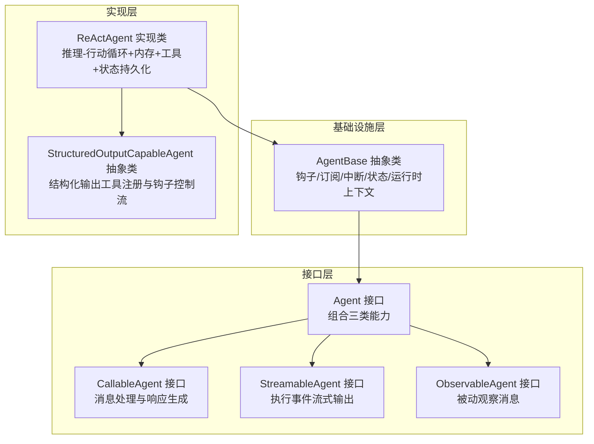
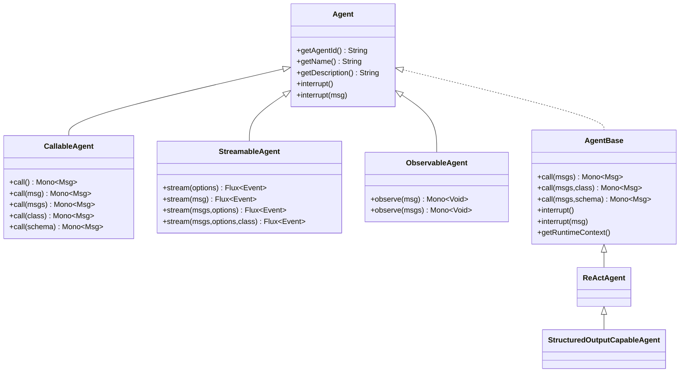
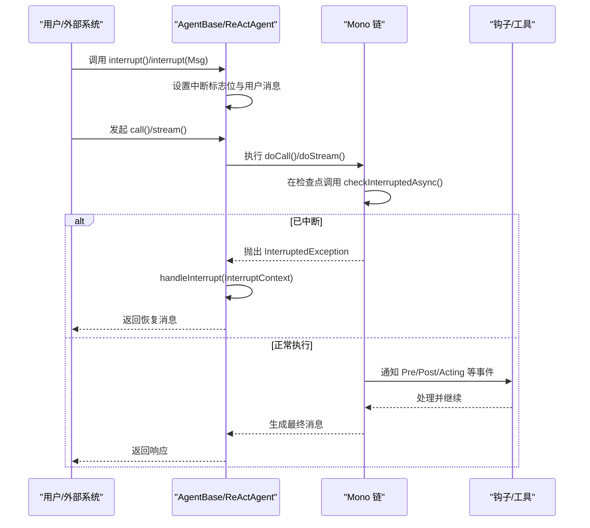
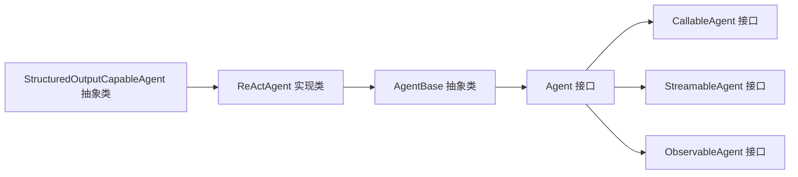

# 基础 Agent 接口

<cite>
**本文引用的文件**
- [Agent.java](file://agentscope-core/src/main/java/io/agentscope/core/agent/Agent.java)
- [CallableAgent.java](file://agentscope-core/src/main/java/io/agentscope/core/agent/CallableAgent.java)
- [StreamableAgent.java](file://agentscope-core/src/main/java/io/agentscope/core/agent/StreamableAgent.java)
- [ObservableAgent.java](file://agentscope-core/src/main/java/io/agentscope/core/agent/ObservableAgent.java)
- [AgentBase.java](file://agentscope-core/src/main/java/io/agentscope/core/agent/AgentBase.java)
- [StructuredOutputCapableAgent.java](file://agentscope-core/src/main/java/io/agentscope/core/agent/StructuredOutputCapableAgent.java)
- [ReActAgent.java](file://agentscope-core/src/main/java/io/agentscope/core/ReActAgent.java)
- [InterruptionExample.java](file://agentscope-examples/quickstart/src/main/java/io/agentscope/examples/quickstart/InterruptionExample.java)
- [StructuredOutputExample.java](file://agentscope-examples/quickstart/src/main/java/io/agentscope/examples/quickstart/StructuredOutputExample.java)
</cite>

## 目录
1. [简介](#简介)
2. [项目结构](#项目结构)
3. [核心组件](#核心组件)
4. [架构总览](#架构总览)
5. [详细组件分析](#详细组件分析)
6. [依赖分析](#依赖分析)
7. [性能考虑](#性能考虑)
8. [故障排查指南](#故障排查指南)
9. [结论](#结论)
10. [附录](#附录)

## 简介
本文件系统性阐述 AgentScope Java 中“基础 Agent 接口”的设计理念与实现要点，重点覆盖以下方面：
- Agent 接口如何通过组合 CallableAgent、StreamableAgent 与 ObservableAgent，形成统一的智能体能力契约；
- 核心方法（如 getAgentId、getName、getDescription、interrupt）的职责与使用方式；
- Agent 在框架中的核心地位，以及为何将“内存管理”和“结构化输出”设计为可选或由具体实现承担；
- 结合示例与最佳实践，帮助读者快速上手并正确使用该接口。

## 项目结构
Agent 接口位于 agentscope-core 模块的 agent 包中，围绕该接口构建了分层抽象：接口层（Agent 及其子接口）、基础设施层（AgentBase）、具体实现层（如 ReActAgent），以及支持能力的辅助类（如 StructuredOutputCapableAgent）。

图表来源
- [Agent.java:20-41](file://agentscope-core/src/main/java/io/agentscope/core/agent/Agent.java#L20-L41)
- [CallableAgent.java:23-35](file://agentscope-core/src/main/java/io/agentscope/core/agent/CallableAgent.java#L23-L35)
- [StreamableAgent.java:23-36](file://agentscope-core/src/main/java/io/agentscope/core/agent/StreamableAgent.java#L23-L36)
- [ObservableAgent.java:22-36](file://agentscope-core/src/main/java/io/agentscope/core/agent/ObservableAgent.java#L22-L36)
- [AgentBase.java:49-93](file://agentscope-core/src/main/java/io/agentscope/core/agent/AgentBase.java#L49-L93)
- [StructuredOutputCapableAgent.java:44-65](file://agentscope-core/src/main/java/io/agentscope/core/agent/StructuredOutputCapableAgent.java#L44-L65)
- [ReActAgent.java:93-140](file://agentscope-core/src/main/java/io/agentscope/core/ReActAgent.java#L93-L140)

章节来源
- [Agent.java:20-82](file://agentscope-core/src/main/java/io/agentscope/core/agent/Agent.java#L20-L82)
- [AgentBase.java:49-93](file://agentscope-core/src/main/java/io/agentscope/core/agent/AgentBase.java#L49-L93)

## 核心组件
- Agent 接口：统一的智能体能力契约，组合三类能力，并提供标识、名称、描述与中断等通用能力。
- CallableAgent：定义消息调用与响应生成的统一入口，支持普通调用与结构化输出两种模式。
- StreamableAgent：定义流式执行事件输出，便于实时展示推理过程、工具调用与最终结果。
- ObservableAgent：定义被动观察消息的能力，用于多智能体协作与共享上下文。
- AgentBase：Agent 的基础设施实现，负责钩子通知、订阅广播、中断机制、运行时上下文绑定与状态模块集成。
- StructuredOutputCapableAgent：结构化输出能力的基础设施，通过临时工具与钩子控制流实现类型安全的结构化输出。
- ReActAgent：典型实现，结合推理-行动循环、内存、工具、状态持久化与结构化输出能力。

章节来源
- [Agent.java:20-82](file://agentscope-core/src/main/java/io/agentscope/core/agent/Agent.java#L20-L82)
- [CallableAgent.java:23-139](file://agentscope-core/src/main/java/io/agentscope/core/agent/CallableAgent.java#L23-L139)
- [StreamableAgent.java:23-152](file://agentscope-core/src/main/java/io/agentscope/core/agent/StreamableAgent.java#L23-L152)
- [ObservableAgent.java:22-53](file://agentscope-core/src/main/java/io/agentscope/core/agent/ObservableAgent.java#L22-L53)
- [AgentBase.java:49-93](file://agentscope-core/src/main/java/io/agentscope/core/agent/AgentBase.java#L49-L93)
- [StructuredOutputCapableAgent.java:44-65](file://agentscope-core/src/main/java/io/agentscope/core/agent/StructuredOutputCapableAgent.java#L44-L65)
- [ReActAgent.java:93-140](file://agentscope-core/src/main/java/io/agentscope/core/ReActAgent.java#L93-L140)

## 架构总览
Agent 接口作为框架核心契约，向上承接业务场景，向下由 AgentBase 提供通用基础设施，ReActAgent 等具体实现承载领域逻辑。结构化输出与内存管理以可插拔方式融入，避免对核心接口产生耦合。

图表来源
- [Agent.java:41](file://agentscope-core/src/main/java/io/agentscope/core/agent/Agent.java#L41)
- [CallableAgent.java:35](file://agentscope-core/src/main/java/io/agentscope/core/agent/CallableAgent.java#L35)
- [StreamableAgent.java:36](file://agentscope-core/src/main/java/io/agentscope/core/agent/StreamableAgent.java#L36)
- [ObservableAgent.java:36](file://agentscope-core/src/main/java/io/agentscope/core/agent/ObservableAgent.java#L36)
- [AgentBase.java:93](file://agentscope-core/src/main/java/io/agentscope/core/agent/AgentBase.java#L93)
- [StructuredOutputCapableAgent.java:65](file://agentscope-core/src/main/java/io/agentscope/core/agent/StructuredOutputCapableAgent.java#L65)
- [ReActAgent.java:140](file://agentscope-core/src/main/java/io/agentscope/core/ReActAgent.java#L140)

## 详细组件分析

### Agent 接口设计与职责
- 设计理念
  - 组合优先：通过继承 CallableAgent、StreamableAgent、ObservableAgent，统一对外能力边界。
  - 职责分离：内存管理、结构化输出等能力下沉到具体实现，保持核心接口简洁稳定。
  - 观察模式：支持被动接收消息，便于多智能体协作与共享上下文。
- 核心方法
  - getAgentId：返回唯一标识，便于追踪与日志关联。
  - getName：返回人类可读名称，用于 UI 展示与调试。
  - getDescription：默认基于 ID 与名称生成描述；可在实现中覆盖以提供更丰富信息。
  - interrupt：用户级中断入口，设置中断标志并在合适检查点生效；支持带用户消息的中断版本。

章节来源
- [Agent.java:20-82](file://agentscope-core/src/main/java/io/agentscope/core/agent/Agent.java#L20-L82)

### CallableAgent：消息处理与响应生成
- 能力范围
  - 支持单条或多条消息输入，统一返回响应消息。
  - 支持结构化输出：通过类类型或 JSON Schema 定义期望结构，结果存储于响应消息元数据中。
- 方法族
  - call() 多重重载：支持空参、单参、变长参数与列表参数，内部委托至核心 call(List<Msg>)。
  - 结构化输出重载：call(List<Msg>, Class) 与 call(List<Msg>, JsonNode) 将结构化数据写入元数据。

章节来源
- [CallableAgent.java:23-139](file://agentscope-core/src/main/java/io/agentscope/core/agent/CallableAgent.java#L23-L139)

### StreamableAgent：流式事件输出
- 能力范围
  - 在执行过程中实时输出事件流，便于前端交互、进度展示与可观测性。
  - 支持结构化输出与 JSON Schema 的流式版本。
- 方法族
  - stream() 多重重载：覆盖从当前状态继续、单消息、多消息、带选项与结构化参数等场景。

章节来源
- [StreamableAgent.java:23-152](file://agentscope-core/src/main/java/io/agentscope/core/agent/StreamableAgent.java#L23-L152)

### ObservableAgent：被动观察消息
- 能力范围
  - 接收消息但不生成回复，常用于多智能体协作、共享上下文与监听其他智能体动作。
- 使用场景
  - 订阅消息总线、记录共享状态、触发副作用等。

章节来源
- [ObservableAgent.java:22-53](file://agentscope-core/src/main/java/io/agentscope/core/agent/ObservableAgent.java#L22-L53)

### AgentBase：基础设施与中断机制
- 关键特性
  - 钩子系统：PreCall/PostCall/Error 等事件贯穿执行生命周期，支持动态增删钩子。
  - 运行时上下文：支持在一次调用内绑定/解绑 RuntimeContext，供钩子与工具使用。
  - 中断机制：原子标志位与用户消息关联，配合 Reactive 检查点在 Mono 链中传播 InterruptedException。
  - 订阅广播：自动向订阅者广播最终消息，支持多 Hub 场景。
- 与 Agent 接口的关系
  - AgentBase 实现 Agent 接口，提供统一的 call 与 interrupt 入口，内部委派给 doCall/doObserve 并注入钩子与中断处理。

章节来源
- [AgentBase.java:49-93](file://agentscope-core/src/main/java/io/agentscope/core/agent/AgentBase.java#L49-L93)
- [AgentBase.java:182-201](file://agentscope-core/src/main/java/io/agentscope/core/agent/AgentBase.java#L182-L201)
- [AgentBase.java:312-335](file://agentscope-core/src/main/java/io/agentscope/core/agent/AgentBase.java#L312-L335)
- [AgentBase.java:494-496](file://agentscope-core/src/main/java/io/agentscope/core/agent/AgentBase.java#L494-L496)

### StructuredOutputCapableAgent：结构化输出基础设施
- 设计目标
  - 通过临时工具与钩子控制流，实现类型安全的结构化输出，避免对核心接口的侵入。
- 关键流程
  - 参数校验：确保仅提供类类型或 JSON Schema 之一。
  - 工具注册：动态注册 generate_response 工具，Schema 来源于类或 JSON。
  - 钩子控制：StructuredOutputHook 协调模型生成与结果提取，合并用量与思考块元数据。
  - 清理回收：完成后移除钩子与工具，避免泄漏。

章节来源
- [StructuredOutputCapableAgent.java:126-197](file://agentscope-core/src/main/java/io/agentscope/core/agent/StructuredOutputCapableAgent.java#L126-L197)
- [StructuredOutputCapableAgent.java:202-280](file://agentscope-core/src/main/java/io/agentscope/core/agent/StructuredOutputCapableAgent.java#L202-L280)
- [StructuredOutputCapableAgent.java:285-355](file://agentscope-core/src/main/java/io/agentscope/core/agent/StructuredOutputCapableAgent.java#L285-L355)

### ReActAgent：典型实现与最佳实践
- 能力矩阵
  - 推理-行动循环：在最大迭代次数内交替进行推理与工具执行。
  - 内存管理：内置 InMemoryMemory 与长程记忆工具，支持检索增强与压缩。
  - 工具生态：Toolkit 集成工具注册、执行与结果转换。
  - 结构化输出：继承 StructuredOutputCapableAgent，支持类型安全输出。
  - 状态持久化：实现 StateModule，支持会话保存/加载。
- 使用建议
  - 明确 sysPrompt 与 GenerateOptions，合理配置思维预算与最大迭代次数。
  - 对长耗时工具使用中断与挂起机制，保证用户体验与可观测性。
  - 利用钩子扩展监控、追踪与 HUMAN-IN-THE-LOOP 场景。

章节来源
- [ReActAgent.java:93-140](file://agentscope-core/src/main/java/io/agentscope/core/ReActAgent.java#L93-L140)
- [ReActAgent.java:364-398](file://agentscope-core/src/main/java/io/agentscope/core/ReActAgent.java#L364-L398)
- [ReActAgent.java:560-650](file://agentscope-core/src/main/java/io/agentscope/core/ReActAgent.java#L560-L650)
- [ReActAgent.java:669-731](file://agentscope-core/src/main/java/io/agentscope/core/ReActAgent.java#L669-L731)

### 中断机制序列图

图表来源
- [AgentBase.java:312-335](file://agentscope-core/src/main/java/io/agentscope/core/agent/AgentBase.java#L312-L335)
- [AgentBase.java:372-379](file://agentscope-core/src/main/java/io/agentscope/core/agent/AgentBase.java#L372-L379)
- [AgentBase.java:449-457](file://agentscope-core/src/main/java/io/agentscope/core/agent/AgentBase.java#L449-L457)
- [AgentBase.java:514](file://agentscope-core/src/main/java/io/agentscope/core/agent/AgentBase.java#L514)

## 依赖分析
- 接口组合关系
  - Agent 组合 CallableAgent、StreamableAgent、ObservableAgent，形成统一能力边界。
- 基础设施与实现
  - AgentBase 实现 Agent 接口，提供通用钩子、订阅、中断与运行时上下文能力。
  - ReActAgent 继承 StructuredOutputCapableAgent 并进一步继承 AgentBase，成为完整实现。
- 外部依赖
  - Reactor Flux/Mono 用于非阻塞流式与响应式链路。
  - Jackson JsonNode 用于 JSON Schema 支持。
  - 日志与工具链（Toolkit、Model、Memory、Hook 等）由具体实现注入。

图表来源
- [Agent.java:41](file://agentscope-core/src/main/java/io/agentscope/core/agent/Agent.java#L41)
- [AgentBase.java:93](file://agentscope-core/src/main/java/io/agentscope/core/agent/AgentBase.java#L93)
- [ReActAgent.java:140](file://agentscope-core/src/main/java/io/agentscope/core/ReActAgent.java#L140)
- [StructuredOutputCapableAgent.java:65](file://agentscope-core/src/main/java/io/agentscope/core/agent/StructuredOutputCapableAgent.java#L65)

章节来源
- [Agent.java:41](file://agentscope-core/src/main/java/io/agentscope/core/agent/Agent.java#L41)
- [AgentBase.java:93](file://agentscope-core/src/main/java/io/agentscope/core/agent/AgentBase.java#L93)
- [ReActAgent.java:140](file://agentscope-core/src/main/java/io/agentscope/core/ReActAgent.java#L140)
- [StructuredOutputCapableAgent.java:65](file://agentscope-core/src/main/java/io/agentscope/core/agent/StructuredOutputCapableAgent.java#L65)

## 性能考虑
- 流式输出
  - 合理使用 StreamableAgent 的流式能力，避免一次性生成大量中间事件导致内存压力。
- 中断与检查点
  - 在工具调用前后、推理阶段与每次迭代间设置检查点，确保中断及时生效且开销可控。
- 钩子数量与优先级
  - 控制钩子数量与优先级，避免在热路径上引入过多同步或阻塞操作。
- 内存与状态
  - 对于需要长期记忆的场景，谨慎选择内存策略与压缩策略，避免频繁全量拷贝。

## 故障排查指南
- 中断未生效
  - 确认在关键节点调用了中断检查方法，并在 Mono 链中传播异常。
  - 检查是否在合适的执行阶段设置了中断源与用户消息。
- 结构化输出未返回预期格式
  - 确认传入的类类型或 JSON Schema 是否有效，钩子是否正确注册与清理。
- 观察消息未被处理
  - 确认 doObserve 的实现是否为空实现，必要时在子类中添加状态更新或副作用逻辑。
- 示例参考
  - 中断示例展示了如何在外部线程中断正在执行的智能体，并通过钩子观察工具结果与错误事件。

章节来源
- [AgentBase.java:372-379](file://agentscope-core/src/main/java/io/agentscope/core/agent/AgentBase.java#L372-L379)
- [AgentBase.java:449-457](file://agentscope-core/src/main/java/io/agentscope/core/agent/AgentBase.java#L449-L457)
- [StructuredOutputCapableAgent.java:126-197](file://agentscope-core/src/main/java/io/agentscope/core/agent/StructuredOutputCapableAgent.java#L126-L197)
- [InterruptionExample.java:161-200](file://agentscope-examples/quickstart/src/main/java/io/agentscope/examples/quickstart/InterruptionExample.java#L161-L200)

## 结论
Agent 接口通过“组合优于继承”的设计，将消息处理、流式输出与被动观察三大能力统一到一个契约下，同时将内存管理与结构化输出等复杂能力下沉至具体实现，既保证了核心接口的简洁稳定，又为不同场景提供了灵活扩展空间。借助 AgentBase 的钩子、中断与运行时上下文能力，ReActAgent 等实现能够高效地支撑多智能体协作、结构化输出与可观测性需求。

## 附录

### 接口使用示例与最佳实践
- 基本调用与结构化输出
  - 使用 ReActAgent.builder 构建智能体，调用 call(msg, Class) 获取结构化输出。
  - 参考：[StructuredOutputExample.java:84-120](file://agentscope-examples/quickstart/src/main/java/io/agentscope/examples/quickstart/StructuredOutputExample.java#L84-L120)
- 中断机制
  - 在外部线程中调用 agent.interrupt(msg) 触发中断，钩子捕获工具结果与错误事件。
  - 参考：[InterruptionExample.java:104-159](file://agentscope-examples/quickstart/src/main/java/io/agentscope/examples/quickstart/InterruptionExample.java#L104-L159)
- 最佳实践清单
  - 明确 sysPrompt 与 GenerateOptions，合理配置最大迭代次数与思维预算。
  - 在工具调用前后设置中断检查点，确保长任务可中断。
  - 使用钩子记录关键事件，便于问题定位与审计。
  - 对结构化输出使用类型安全的类或 JSON Schema，避免运行期解析错误。
  - 对需要持久化的状态，使用 StateModule 的保存/加载 API。