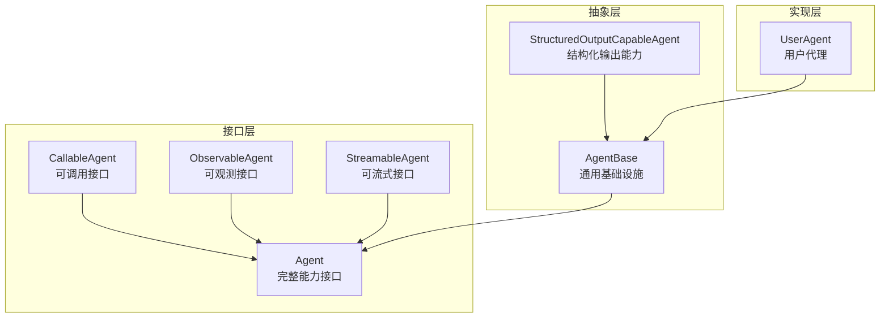
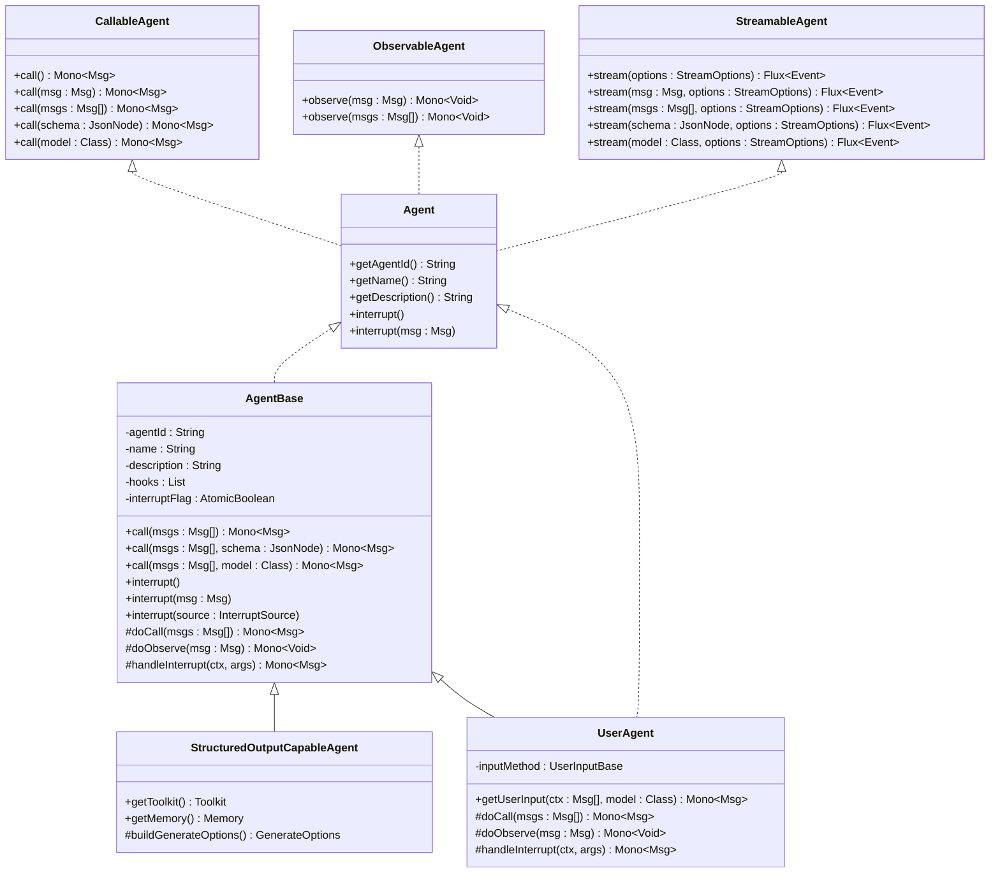
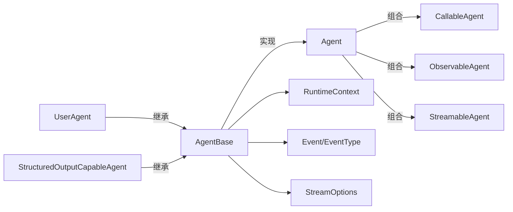

# 智能体类型

<cite>
**本文引用的文件**
- [Agent.java](file://agentscope-core/src/main/java/io/agentscope/core/agent/Agent.java)
- [AgentBase.java](file://agentscope-core/src/main/java/io/agentscope/core/agent/AgentBase.java)
- [CallableAgent.java](file://agentscope-core/src/main/java/io/agentscope/core/agent/CallableAgent.java)
- [ObservableAgent.java](file://agentscope-core/src/main/java/io/agentscope/core/agent/ObservableAgent.java)
- [StreamableAgent.java](file://agentscope-core/src/main/java/io/agentscope/core/agent/StreamableAgent.java)
- [StructuredOutputCapableAgent.java](file://agentscope-core/src/main/java/io/agentscope/core/agent/StructuredOutputCapableAgent.java)
- [UserAgent.java](file://agentscope-core/src/main/java/io/agentscope/core/agent/user/UserAgent.java)
- [Event.java](file://agentscope-core/src/main/java/io/agentscope/core/agent/Event.java)
- [EventType.java](file://agentscope-core/src/main/java/io/agentscope/core/agent/EventType.java)
- [RuntimeContext.java](file://agentscope-core/src/main/java/io/agentscope/core/agent/RuntimeContext.java)
- [StreamOptions.java](file://agentscope-core/src/main/java/io/agentscope/core/agent/StreamOptions.java)
- [UserAgentTest.java](file://agentscope-core/src/test/java/io/agentscope/core/agent/user/UserAgentTest.java)
</cite>

## 目录
1. [简介](#简介)
2. [项目结构](#项目结构)
3. [核心组件](#核心组件)
4. [架构总览](#架构总览)
5. [详细组件分析](#详细组件分析)
6. [依赖分析](#依赖分析)
7. [性能考虑](#性能考虑)
8. [故障排查指南](#故障排查指南)
9. [结论](#结论)
10. [附录：API 参考与示例](#附录api-参考与示例)

## 简介
本文件系统性梳理 AgentScope Java 框架中的智能体类型体系，重点覆盖以下内容：
- 基础接口与抽象基类：Agent、AgentBase、CallableAgent、ObservableAgent、StreamableAgent
- 特化实现：UserAgent（用户代理）、StructuredOutputCapableAgent（结构化输出能力）
- 继承关系、功能差异与使用限制
- 生命周期管理、状态转换与异常处理机制
- 完整 API 参考与使用示例
- 性能考量与最佳实践

## 项目结构
围绕“智能体类型”的核心代码主要位于 agentscope-core 模块的 agent 包中，采用“接口 + 抽象基类 + 具体实现”的分层设计：
- 接口层：定义最小职责集合（可调用、可观测、可流式）
- 抽象层：统一基础设施（钩子、订阅、中断、运行时上下文、状态模块）
- 实现层：面向场景的具体智能体（用户交互、结构化输出等）

图示来源
- [Agent.java:41-82](file://agentscope-core/src/main/java/io/agentscope/core/agent/Agent.java#L41-L82)
- [AgentBase.java:93-93](file://agentscope-core/src/main/java/io/agentscope/core/agent/AgentBase.java#L93-L93)
- [CallableAgent.java:35-139](file://agentscope-core/src/main/java/io/agentscope/core/agent/CallableAgent.java#L35-L139)
- [ObservableAgent.java:36-53](file://agentscope-core/src/main/java/io/agentscope/core/agent/ObservableAgent.java#L36-L53)
- [StreamableAgent.java:36-151](file://agentscope-core/src/main/java/io/agentscope/core/agent/StreamableAgent.java#L36-L151)
- [StructuredOutputCapableAgent.java:65-65](file://agentscope-core/src/main/java/io/agentscope/core/agent/StructuredOutputCapableAgent.java#L65-L65)
- [UserAgent.java:68-68](file://agentscope-core/src/main/java/io/agentscope/core/agent/user/UserAgent.java#L68-L68)

章节来源
- [Agent.java:20-82](file://agentscope-core/src/main/java/io/agentscope/core/agent/Agent.java#L20-L82)
- [AgentBase.java:49-92](file://agentscope-core/src/main/java/io/agentscope/core/agent/AgentBase.java#L49-L92)

## 核心组件
- Agent：完整能力接口，同时组合可调用、可流式、可观测三大能力，并提供统一的中断能力与标识元数据。
- AgentBase：所有智能体的通用基础设施，负责钩子集成、订阅管理、中断处理、运行时上下文绑定、状态模块化、执行资源生命周期管理。
- CallableAgent：定义 call(...) 的多种变体，支持消息列表、单消息、带结构化输出（类或 JSON Schema）。
- ObservableAgent：定义 observe(...)，用于接收消息而不生成回复，常用于多智能体协作与共享上下文。
- StreamableAgent：定义 stream(...)，在执行过程中实时发出事件（Reasoning、ToolResult、Hint、AgentResult、Summary），并支持增量/累积模式与过滤策略。
- StructuredOutputCapableAgent：具备结构化输出能力的抽象基类，通过临时工具与 Hook 流程控制实现结构化结果产出。
- UserAgent：用户交互代理，桥接各类用户输入源（控制台、Web 等）到消息系统，不参与内存管理。

章节来源
- [Agent.java:20-82](file://agentscope-core/src/main/java/io/agentscope/core/agent/Agent.java#L20-L82)
- [AgentBase.java:49-92](file://agentscope-core/src/main/java/io/agentscope/core/agent/AgentBase.java#L49-L92)
- [CallableAgent.java:23-139](file://agentscope-core/src/main/java/io/agentscope/core/agent/CallableAgent.java#L23-L139)
- [ObservableAgent.java:22-53](file://agentscope-core/src/main/java/io/agentscope/core/agent/ObservableAgent.java#L22-L53)
- [StreamableAgent.java:23-151](file://agentscope-core/src/main/java/io/agentscope/core/agent/StreamableAgent.java#L23-L151)
- [StructuredOutputCapableAgent.java:44-65](file://agentscope-core/src/main/java/io/agentscope/core/agent/StructuredOutputCapableAgent.java#L44-L65)
- [UserAgent.java:32-67](file://agentscope-core/src/main/java/io/agentscope/core/agent/user/UserAgent.java#L32-L67)

## 架构总览
AgentBase 将“钩子、订阅、中断、运行时上下文、状态模块”等横切关注点集中管理；具体智能体通过覆写 doCall/doObserve 等方法实现领域逻辑。结构化输出能力通过临时注册工具与 Hook 协作完成。

图示来源
- [Agent.java:41-82](file://agentscope-core/src/main/java/io/agentscope/core/agent/Agent.java#L41-L82)
- [AgentBase.java:93-93](file://agentscope-core/src/main/java/io/agentscope/core/agent/AgentBase.java#L93-L93)
- [CallableAgent.java:35-139](file://agentscope-core/src/main/java/io/agentscope/core/agent/CallableAgent.java#L35-L139)
- [ObservableAgent.java:36-53](file://agentscope-core/src/main/java/io/agentscope/core/agent/ObservableAgent.java#L36-L53)
- [StreamableAgent.java:36-151](file://agentscope-core/src/main/java/io/agentscope/core/agent/StreamableAgent.java#L36-L151)
- [StructuredOutputCapableAgent.java:65-65](file://agentscope-core/src/main/java/io/agentscope/core/agent/StructuredOutputCapableAgent.java#L65-L65)
- [UserAgent.java:68-68](file://agentscope-core/src/main/java/io/agentscope/core/agent/user/UserAgent.java#L68-L68)

## 详细组件分析

### Agent 接口
- 能力组合：可调用、可流式、可观测三者合一，统一中断能力与标识元数据。
- 设计要点：
  - 不包含记忆管理与结构化输出，这些由具体实现承担。
  - 观察模式允许接收消息但不生成回复，便于多智能体协作。
- 使用限制：
  - 必须实现 doCall 与 handleInterrupt。
  - 若需要结构化输出，需配合 StructuredOutputCapableAgent 或自定义 Hook。

章节来源
- [Agent.java:20-82](file://agentscope-core/src/main/java/io/agentscope/core/agent/Agent.java#L20-L82)

### AgentBase 抽象类
- 基础设施：
  - 钩子集成：PreCall/PostCall/Error 事件链路，支持动态增删 Hook。
  - 订阅管理：MsgHub 订阅者列表，支持广播消息给订阅者。
  - 中断机制：原子标志位 + 用户消息关联，检查点采用响应式 Mono.defer 错误传播。
  - 运行时上下文：RuntimeContext 绑定与解绑，支持 RuntimeContextAware 钩子。
  - 执行生命周期：Mono.using 资源获取/释放，确保异常/取消场景也能清理。
- 关键流程：
  - call(List<Msg>) → acquireExecution → TracerRegistry.callAgent → notifyPreCall → doCall → notifyPostCall → releaseExecution。
  - 错误处理：InterruptedException 特判并交由 handleInterrupt，其他错误通知 ErrorEvent 钩子。
- 线程安全与并发：
  - 单实例非并发执行（单线程调用 call/stream），钩子列表为 CopyOnWriteArrayList，适合动态增删。

章节来源
- [AgentBase.java:49-92](file://agentscope-core/src/main/java/io/agentscope/core/agent/AgentBase.java#L49-L92)
- [AgentBase.java:182-201](file://agentscope-core/src/main/java/io/agentscope/core/agent/AgentBase.java#L182-L201)
- [AgentBase.java:312-379](file://agentscope-core/src/main/java/io/agentscope/core/agent/AgentBase.java#L312-L379)
- [AgentBase.java:449-457](file://agentscope-core/src/main/java/io/agentscope/core/agent/AgentBase.java#L449-L457)
- [AgentBase.java:661-720](file://agentscope-core/src/main/java/io/agentscope/core/agent/AgentBase.java#L661-L720)
- [AgentBase.java:729-752](file://agentscope-core/src/main/java/io/agentscope/core/agent/AgentBase.java#L729-L752)

### CallableAgent 接口
- 多种 call(...) 变体，覆盖无参、单参、多参、结构化输出（类或 JSON Schema）。
- 默认实现将便捷方法委托至核心 call(List<Msg>)。

章节来源
- [CallableAgent.java:23-139](file://agentscope-core/src/main/java/io/agentscope/core/agent/CallableAgent.java#L23-L139)

### ObservableAgent 接口
- observe(...) 支持单条或多条消息，返回 Mono<Void> 表示观察完成。
- 适用于被动监控、构建共享上下文、多智能体协作。

章节来源
- [ObservableAgent.java:22-53](file://agentscope-core/src/main/java/io/agentscope/core/agent/ObservableAgent.java#L22-L53)

### StreamableAgent 接口
- stream(...) 提供事件流，事件类型由 EventType 定义。
- StreamOptions 控制事件类型过滤、增量/累积模式以及推理/总结过程的细分粒度。

章节来源
- [StreamableAgent.java:23-151](file://agentscope-core/src/main/java/io/agentscope/core/agent/StreamableAgent.java#L23-L151)
- [EventType.java:24-94](file://agentscope-core/src/main/java/io/agentscope/core/agent/EventType.java#L24-L94)
- [Event.java:24-211](file://agentscope-core/src/main/java/io/agentscope/core/agent/Event.java#L24-L211)
- [StreamOptions.java:23-371](file://agentscope-core/src/main/java/io/agentscope/core/agent/StreamOptions.java#L23-L371)

### StructuredOutputCapableAgent 抽象类
- 结构化输出实现机制：
  - 生成 JSON Schema（类或 JSON Node）并注册临时工具 generate_response。
  - 注册 StructuredOutputHook 控制流程，收集中间元数据（用量、思考块）并合并到最终消息。
  - 执行完成后移除 Hook 与工具，避免泄漏。
- 子类要求：
  - 提供 Toolkit、Memory、GenerateOptions 构建逻辑。

章节来源
- [StructuredOutputCapableAgent.java:44-65](file://agentscope-core/src/main/java/io/agentscope/core/agent/StructuredOutputCapableAgent.java#L44-L65)
- [StructuredOutputCapableAgent.java:126-197](file://agentscope-core/src/main/java/io/agentscope/core/agent/StructuredOutputCapableAgent.java#L126-L197)
- [StructuredOutputCapableAgent.java:202-280](file://agentscope-core/src/main/java/io/agentscope/core/agent/StructuredOutputCapableAgent.java#L202-L280)
- [StructuredOutputCapableAgent.java:285-355](file://agentscope-core/src/main/java/io/agentscope/core/agent/StructuredOutputCapableAgent.java#L285-L355)

### UserAgent 用户代理
- 职责：
  - 作为用户输入与消息系统的桥梁，支持插件化输入方法（默认控制台）。
  - 不管理记忆，仅捕获用户输入并转换为消息（含结构化数据元数据）。
- 关键点：
  - getUserInput(...) 将输入数据映射为 Msg（USER 角色），结构化数据放入元数据。
  - observe(...) 为空操作（no-op），因为用户代理通常不需要观察其他智能体的消息。
  - handleInterrupt(...) 返回中断确认消息。
  - Builder 支持设置名称、描述、输入方法、钩子、运行状态检查开关。

章节来源
- [UserAgent.java:32-67](file://agentscope-core/src/main/java/io/agentscope/core/agent/user/UserAgent.java#L32-L67)
- [UserAgent.java:100-133](file://agentscope-core/src/main/java/io/agentscope/core/agent/user/UserAgent.java#L100-L133)
- [UserAgent.java:237-269](file://agentscope-core/src/main/java/io/agentscope/core/agent/user/UserAgent.java#L237-L269)
- [UserAgent.java:277-354](file://agentscope-core/src/main/java/io/agentscope/core/agent/user/UserAgent.java#L277-L354)

## 依赖分析
- 继承与组合关系：
  - AgentBase 实现 StateModule 与 Agent；UserAgent、StructuredOutputCapableAgent 继承 AgentBase。
  - Agent 组合 CallableAgent、StreamableAgent、ObservableAgent。
- 关键外部依赖：
  - Reactor（Mono/Flux）用于响应式执行与流式事件。
  - Hook 体系（PreCall/PostCall/Error 等）贯穿 call 流程。
  - RuntimeContext 为工具栈与钩子提供运行期上下文。
  - Message/MsgRole/ContentBlock 等消息模型支撑多模态内容。

图示来源
- [Agent.java:41-82](file://agentscope-core/src/main/java/io/agentscope/core/agent/Agent.java#L41-L82)
- [AgentBase.java:93-93](file://agentscope-core/src/main/java/io/agentscope/core/agent/AgentBase.java#L93-L93)
- [UserAgent.java:68-68](file://agentscope-core/src/main/java/io/agentscope/core/agent/user/UserAgent.java#L68-L68)
- [StructuredOutputCapableAgent.java:65-65](file://agentscope-core/src/main/java/io/agentscope/core/agent/StructuredOutputCapableAgent.java#L65-L65)
- [EventType.java:24-94](file://agentscope-core/src/main/java/io/agentscope/core/agent/EventType.java#L24-L94)
- [Event.java:24-211](file://agentscope-core/src/main/java/io/agentscope/core/agent/Event.java#L24-L211)
- [StreamOptions.java:23-371](file://agentscope-core/src/main/java/io/agentscope/core/agent/StreamOptions.java#L23-L371)
- [RuntimeContext.java:27-361](file://agentscope-core/src/main/java/io/agentscope/core/agent/RuntimeContext.java#L27-L361)

## 性能考虑
- 响应式执行与背压：使用 Mono/Flux 在长链路中保持低延迟与高吞吐，注意在复杂推理/工具调用中合理插入 checkInterruptedAsync() 检查点。
- 钩子排序与数量：Hook 按优先级排序，过多钩子会增加链路开销；建议按需动态添加/移除。
- 结构化输出成本：Schema 生成与 Hook 协同会引入额外开销，仅在必要时启用。
- 广播与订阅：订阅者列表为并发安全容器，但大量订阅者广播会带来网络/IO 压力，建议按需订阅。
- 内存与状态：AgentBase 不管理记忆，避免在单实例上并发调用；复杂智能体应谨慎使用内存压缩与状态持久化。

## 故障排查指南
- 中断未生效：
  - 确认在关键检查点调用 checkInterruptedAsync()，并在 doCall 链中传播。
  - 检查是否正确设置中断源（USER/SYSTEM）与用户消息。
- call 返回空消息：
  - AgentBase 会在 notifyPostCall 后校验 finalMsg 非空，若为空会抛出异常；检查 doCall 是否正确构造消息。
- 结构化输出异常：
  - 参数必须二选一（类或 JSON Schema），且不能同时提供；确保 Schema 正确生成并与模型兼容。
- 观察模式无效：
  - UserAgent 的 doObserve 为空实现，如需行为请在自定义智能体中覆写。
- Hook 修改消息失败：
  - 确保在 PostCall 钩子中修改 FinalMessage 并返回事件对象。

章节来源
- [AgentBase.java:372-379](file://agentscope-core/src/main/java/io/agentscope/core/agent/AgentBase.java#L372-L379)
- [AgentBase.java:729-741](file://agentscope-core/src/main/java/io/agentscope/core/agent/AgentBase.java#L729-L741)
- [StructuredOutputCapableAgent.java:142-151](file://agentscope-core/src/main/java/io/agentscope/core/agent/StructuredOutputCapableAgent.java#L142-L151)
- [UserAgent.java:245-249](file://agentscope-core/src/main/java/io/agentscope/core/agent/user/UserAgent.java#L245-L249)

## 结论
AgentScope Java 的智能体类型体系以“接口 + 抽象基类 + 具体实现”清晰分层：AgentBase 提供统一的横切能力，UserAgent 专注用户交互，StructuredOutputCapableAgent 提供结构化输出能力。通过 Hook、事件流与运行时上下文，框架既保证了灵活性，又提供了可观测与可控的执行路径。遵循单实例单线程调用、合理设置检查点与按需启用特性，是获得稳定性能的关键。

## 附录：API 参考与示例

### API 参考（核心接口与方法）
- Agent
  - getAgentId()/getName()/getDescription()
  - interrupt()/interrupt(Msg)
- AgentBase
  - call(List<Msg>)/call(List<Msg>, Class)/call(List<Msg>, JsonNode)
  - interrupt()/interrupt(Msg)/interrupt(InterruptSource)
  - getHooks()/addHook()/removeHook()
  - getRuntimeContext()/bindRuntimeContextToHooks()/unbindRuntimeContextFromHooks()
- CallableAgent
  - call()/call(Msg)/call(List<Msg>)
  - call(Class)/call(JsonNode)
- ObservableAgent
  - observe(Msg)/observe(List<Msg>)
- StreamableAgent
  - stream(..., StreamOptions)
  - EventType（REASONING/TOOL_RESULT/HINT/AGENT_RESULT/SUMMARY/ALL）
  - Event（type/message/isLast/source）
  - StreamOptions（eventTypes/incremental/推理/总结/行动片段过滤）
- StructuredOutputCapableAgent
  - getToolkit()/getMemory()/buildGenerateOptions()
  - doCall(..., Class/JsonNode) 由内部流程驱动
- UserAgent
  - getUserInput(context, model)
  - Builder.name/description/checkRunning/inputMethod/hooks/build()

章节来源
- [Agent.java:41-82](file://agentscope-core/src/main/java/io/agentscope/core/agent/Agent.java#L41-L82)
- [AgentBase.java:182-263](file://agentscope-core/src/main/java/io/agentscope/core/agent/AgentBase.java#L182-L263)
- [CallableAgent.java:35-139](file://agentscope-core/src/main/java/io/agentscope/core/agent/CallableAgent.java#L35-L139)
- [ObservableAgent.java:36-53](file://agentscope-core/src/main/java/io/agentscope/core/agent/ObservableAgent.java#L36-L53)
- [StreamableAgent.java:36-151](file://agentscope-core/src/main/java/io/agentscope/core/agent/StreamableAgent.java#L36-L151)
- [EventType.java:24-94](file://agentscope-core/src/main/java/io/agentscope/core/agent/EventType.java#L24-L94)
- [Event.java:51-211](file://agentscope-core/src/main/java/io/agentscope/core/agent/Event.java#L51-L211)
- [StreamOptions.java:62-371](file://agentscope-core/src/main/java/io/agentscope/core/agent/StreamOptions.java#L62-L371)
- [StructuredOutputCapableAgent.java:126-197](file://agentscope-core/src/main/java/io/agentscope/core/agent/StructuredOutputCapableAgent.java#L126-L197)
- [UserAgent.java:128-269](file://agentscope-core/src/main/java/io/agentscope/core/agent/user/UserAgent.java#L128-L269)
- [UserAgent.java:277-354](file://agentscope-core/src/main/java/io/agentscope/core/agent/user/UserAgent.java#L277-L354)

### 使用示例（基于测试与实现）
- 创建并使用 UserAgent：
  - 使用 Builder 设置名称与输入方法，调用 call() 获取用户输入消息。
  - 支持结构化输出：call(TaskPlan.class) 将结构化数据写入消息元数据。
  - 可注入 Hook，在 PostCall 钩子中修改最终消息。
- 结构化输出：
  - 通过 StructuredOutputCapableAgent 的 doCall(List<Msg>, Class/JsonNode) 自动注册工具与 Hook，完成后自动提取并合并元数据。
- 事件流：
  - 使用 StreamOptions 指定事件类型与增量模式，订阅 Flux<Event> 实时渲染。

章节来源
- [UserAgentTest.java:116-210](file://agentscope-core/src/test/java/io/agentscope/core/agent/user/UserAgentTest.java#L116-L210)
- [UserAgentTest.java:214-381](file://agentscope-core/src/test/java/io/agentscope/core/agent/user/UserAgentTest.java#L214-L381)
- [UserAgentTest.java:440-518](file://agentscope-core/src/test/java/io/agentscope/core/agent/user/UserAgentTest.java#L440-L518)
- [UserAgentTest.java:521-596](file://agentscope-core/src/test/java/io/agentscope/core/agent/user/UserAgentTest.java#L521-L596)
- [UserAgentTest.java:642-685](file://agentscope-core/src/test/java/io/agentscope/core/agent/user/UserAgentTest.java#L642-L685)