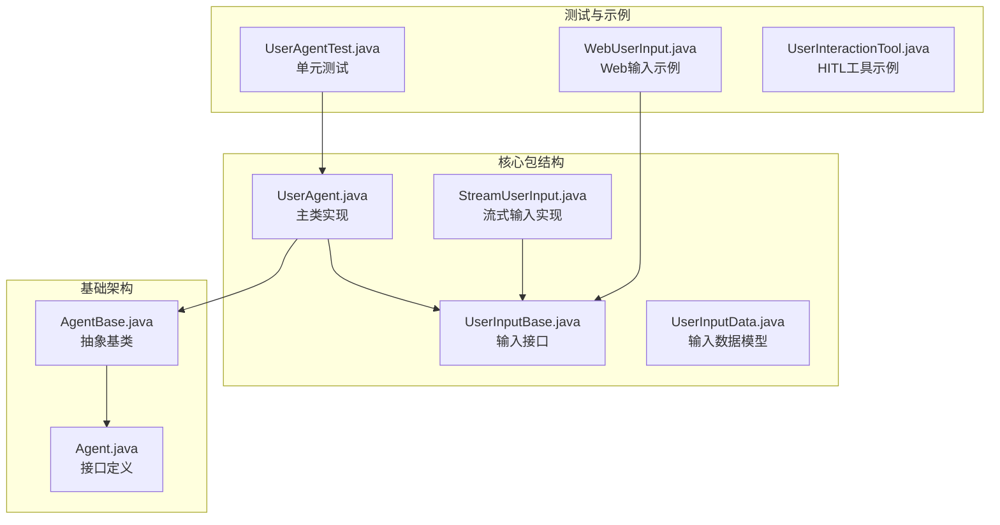
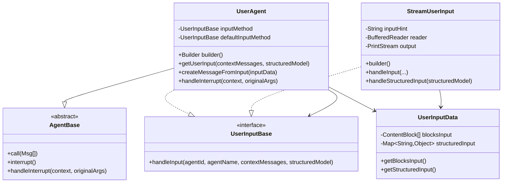
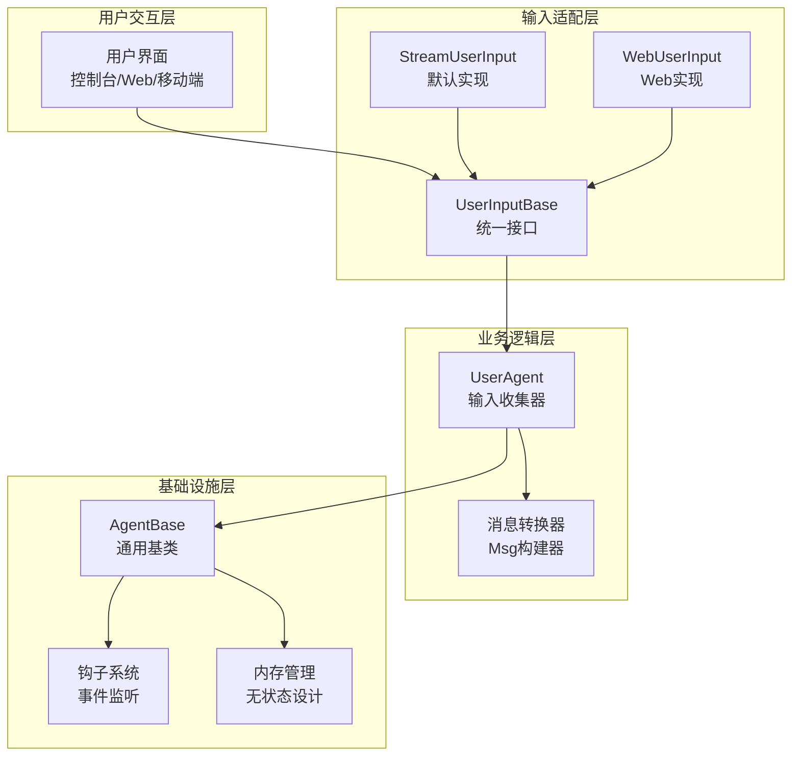
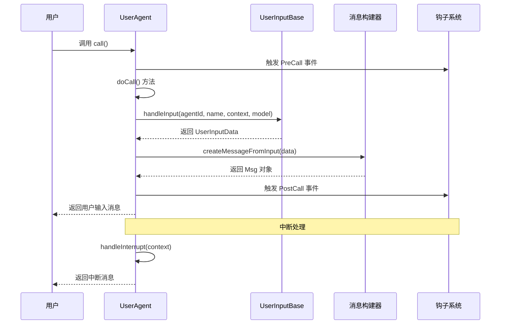
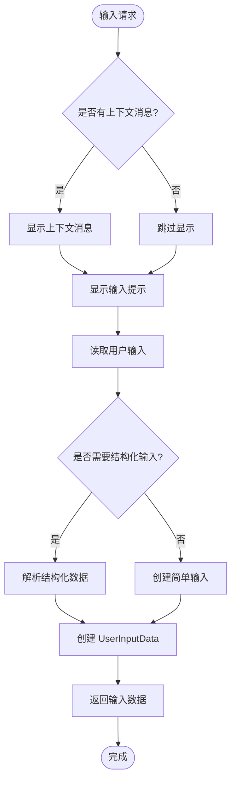
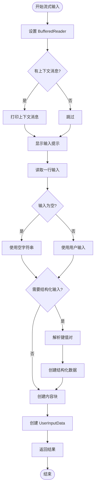
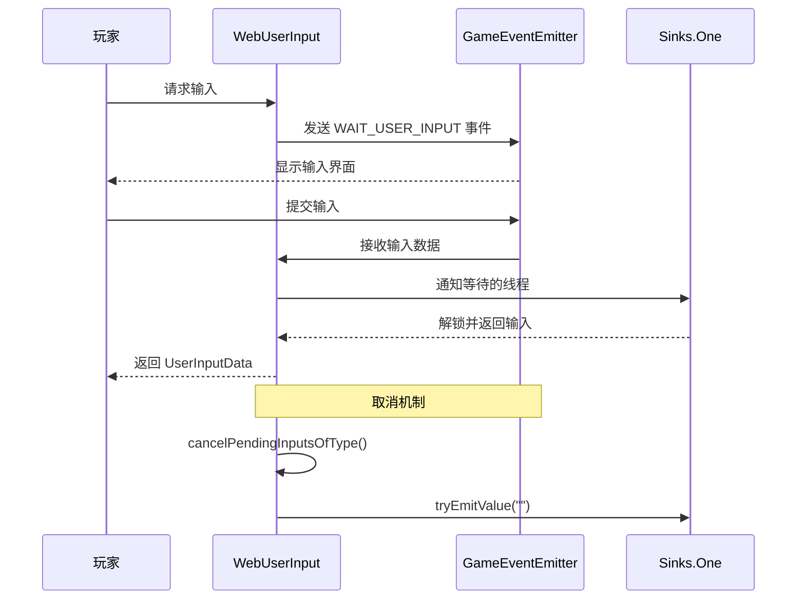
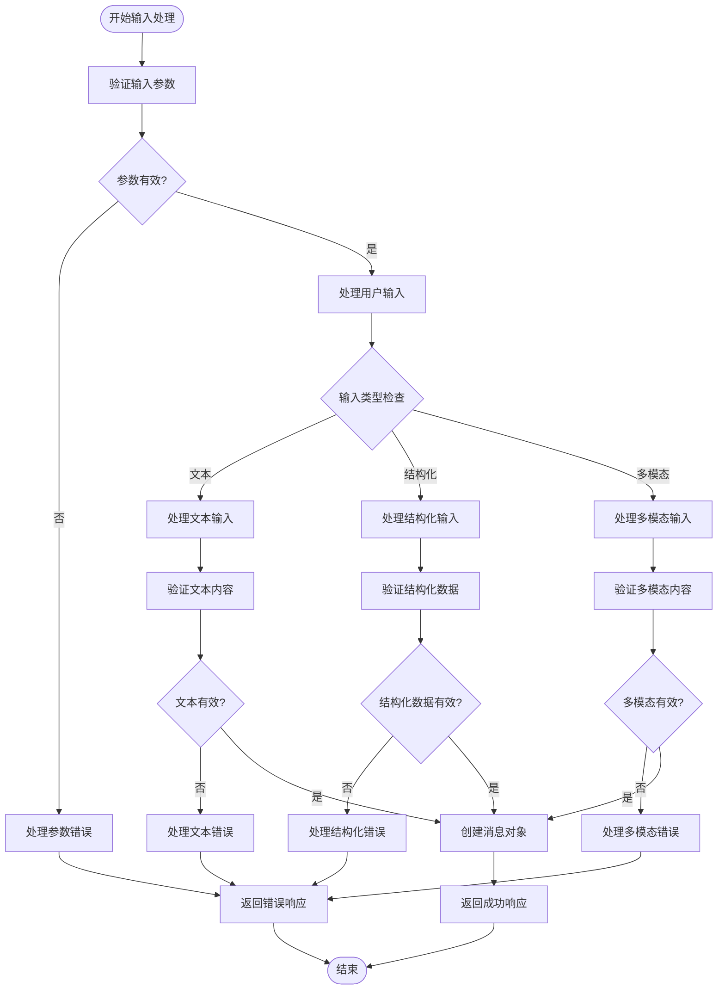
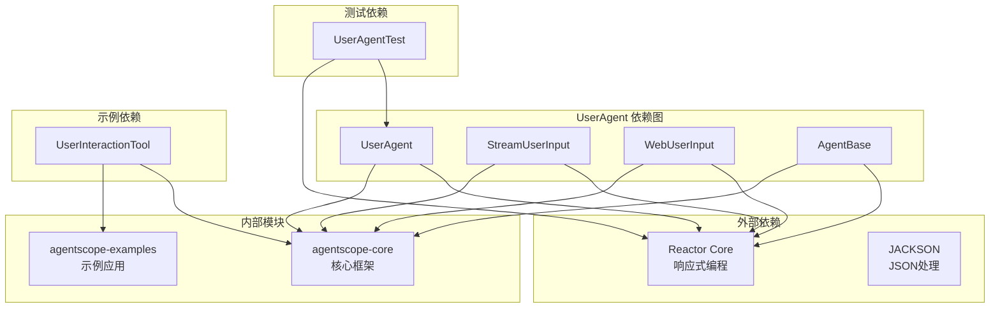
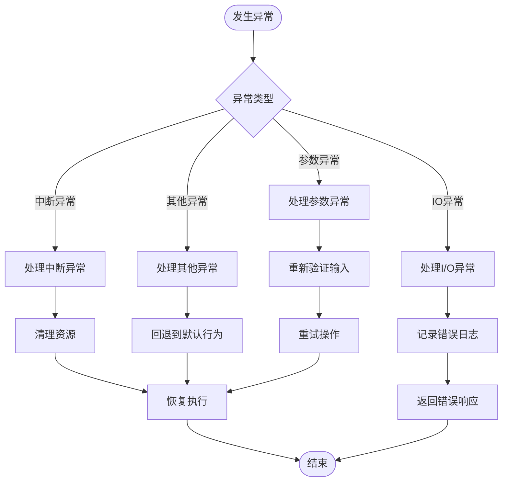

# 用户代理 (UserAgent)

<cite>
**本文档引用的文件**
- [UserAgent.java](file://agentscope-core/src/main/java/io/agentscope/core/agent/user/UserAgent.java)
- [UserInputBase.java](file://agentscope-core/src/main/java/io/agentscope/core/agent/user/UserInputBase.java)
- [StreamUserInput.java](file://agentscope-core/src/main/java/io/agentscope/core/agent/user/StreamUserInput.java)
- [UserInputData.java](file://agentscope-core/src/main/java/io/agentscope/core/agent/user/UserInputData.java)
- [AgentBase.java](file://agentscope-core/src/main/java/io/agentscope/core/agent/AgentBase.java)
- [Agent.java](file://agentscope-core/src/main/java/io/agentscope/core/agent/Agent.java)
- [UserAgentTest.java](file://agentscope-core/src/test/java/io/agentscope/core/agent/user/UserAgentTest.java)
- [WebUserInput.java](file://agentscope-examples/werewolf-hitl/src/main/java/io/agentscope/examples/werewolf/web/WebUserInput.java)
- [UserInteractionTool.java](file://agentscope-examples/advanced/src/main/java/io/agentscope/examples/advanced/hitl/UserInteractionTool.java)
</cite>

## 目录
1. [简介](#简介)
2. [项目结构](#项目结构)
3. [核心组件](#核心组件)
4. [架构概览](#架构概览)
5. [详细组件分析](#详细组件分析)
6. [依赖关系分析](#依赖关系分析)
7. [性能考虑](#性能考虑)
8. [故障排除指南](#故障排除指南)
9. [结论](#结论)
10. [附录](#附录)

## 简介
UserAgent 是 AgentScope Java 框架中的特殊智能体类型，专门负责处理用户输入和人机交互。与其他智能体不同，UserAgent 不执行推理或工具调用，而是充当用户与系统其他智能体之间的桥梁。

### 核心特性
- **用户输入收集**: 支持多种输入方式（控制台、Web界面等）
- **消息转换**: 将用户输入转换为框架标准消息格式
- **插件化设计**: 通过 UserInputBase 接口支持可扩展的输入方法
- **无状态设计**: 不管理记忆或状态，专注于输入收集
- **钩子集成**: 支持框架级钩子进行监控和扩展

## 项目结构
UserAgent 相关代码主要位于 agentscope-core 模块的 agent.user 包中：



**图表来源**
- [UserAgent.java:1-356](file://agentscope-core/src/main/java/io/agentscope/core/agent/user/UserAgent.java#L1-L356)
- [UserInputBase.java:1-43](file://agentscope-core/src/main/java/io/agentscope/core/agent/user/UserInputBase.java#L1-L43)
- [StreamUserInput.java:1-256](file://agentscope-core/src/main/java/io/agentscope/core/agent/user/StreamUserInput.java#L1-L256)

**章节来源**
- [UserAgent.java:1-356](file://agentscope-core/src/main/java/io/agentscope/core/agent/user/UserAgent.java#L1-L356)
- [AgentBase.java:1-954](file://agentscope-core/src/main/java/io/agentscope/core/agent/AgentBase.java#L1-L954)

## 核心组件
UserAgent 由以下核心组件构成：

### 主要组件关系


**图表来源**
- [UserAgent.java:68-356](file://agentscope-core/src/main/java/io/agentscope/core/agent/user/UserAgent.java#L68-L356)
- [UserInputBase.java:22-43](file://agentscope-core/src/main/java/io/agentscope/core/agent/user/UserInputBase.java#L22-L43)
- [StreamUserInput.java:55-256](file://agentscope-core/src/main/java/io/agentscope/core/agent/user/StreamUserInput.java#L55-L256)
- [UserInputData.java:22-68](file://agentscope-core/src/main/java/io/agentscope/core/agent/user/UserInputData.java#L22-L68)

### 组件职责分工
- **UserAgent**: 用户输入收集和消息生成的核心逻辑
- **UserInputBase**: 定义统一的用户输入接口规范
- **StreamUserInput**: 默认的流式输入实现（控制台）
- **UserInputData**: 输入数据的统一表示模型

**章节来源**
- [UserAgent.java:32-67](file://agentscope-core/src/main/java/io/agentscope/core/agent/user/UserAgent.java#L32-L67)
- [UserInputBase.java:22-43](file://agentscope-core/src/main/java/io/agentscope/core/agent/user/UserInputBase.java#L22-L43)

## 架构概览
UserAgent 采用分层架构设计，通过插件化接口实现高度可扩展性：



**图表来源**
- [UserAgent.java:68-133](file://agentscope-core/src/main/java/io/agentscope/core/agent/user/UserAgent.java#L68-L133)
- [AgentBase.java:93-201](file://agentscope-core/src/main/java/io/agentscope/core/agent/AgentBase.java#L93-L201)

### 设计哲学
- **单一职责**: UserAgent 专注于用户输入，不参与推理或决策
- **插件化**: 通过接口抽象支持多种输入源
- **无状态**: 不维护对话历史，避免状态污染
- **可观察**: 支持钩子系统进行监控和调试

## 详细组件分析

### UserAgent 核心实现
UserAgent 是用户交互的核心实现，负责将用户输入转换为框架标准消息：

#### 核心方法流程


**图表来源**
- [UserAgent.java:100-133](file://agentscope-core/src/main/java/io/agentscope/core/agent/user/UserAgent.java#L100-L133)
- [AgentBase.java:182-232](file://agentscope-core/src/main/java/io/agentscope/core/agent/AgentBase.java#L182-L232)

#### 输入处理机制
UserAgent 支持两种主要输入模式：

1. **简单文本输入**: 直接捕获用户文本内容
2. **结构化输入**: 支持键值对格式的数据收集

**章节来源**
- [UserAgent.java:100-133](file://agentscope-core/src/main/java/io/agentscope/core/agent/user/UserAgent.java#L100-L133)
- [UserAgent.java:128-165](file://agentscope-core/src/main/java/io/agentscope/core/agent/user/UserAgent.java#L128-L165)

### UserInputBase 接口设计
UserInputBase 定义了统一的用户输入接口，确保不同输入源的一致性：

#### 接口规范


**图表来源**
- [UserInputBase.java:30-42](file://agentscope-core/src/main/java/io/agentscope/core/agent/user/UserInputBase.java#L30-L42)

**章节来源**
- [UserInputBase.java:22-43](file://agentscope-core/src/main/java/io/agentscope/core/agent/user/UserInputBase.java#L22-L43)

### StreamUserInput 流式输入实现
StreamUserInput 提供了基于流的默认输入实现，支持阻塞 I/O 操作：

#### 流式处理流程


**图表来源**
- [StreamUserInput.java:94-131](file://agentscope-core/src/main/java/io/agentscope/core/agent/user/StreamUserInput.java#L94-L131)

**章节来源**
- [StreamUserInput.java:34-54](file://agentscope-core/src/main/java/io/agentscope/core/agent/user/StreamUserInput.java#L34-L54)
- [StreamUserInput.java:94-131](file://agentscope-core/src/main/java/io/agentscope/core/agent/user/StreamUserInput.java#L94-L131)

### WebUserInput Web 输入实现
WebUserInput 展示了如何扩展 UserInputBase 接口以支持 Web 界面输入：

#### Web 交互流程


**图表来源**
- [WebUserInput.java:83-95](file://agentscope-examples/werewolf-hitl/src/main/java/io/agentscope/examples/werewolf/web/WebUserInput.java#L83-L95)

**章节来源**
- [WebUserInput.java:27-39](file://agentscope-examples/werewolf-hitl/src/main/java/io/agentscope/examples/werewolf/web/WebUserInput.java#L27-L39)

### 用户输入类型与处理机制

#### 多种输入类型的处理
UserAgent 支持以下输入类型：

1. **纯文本输入**: 最简单的用户输入形式
2. **结构化表单输入**: 键值对格式的数据收集
3. **多模态输入**: 文本、图片、音频等内容块
4. **Web 表单输入**: 通过浏览器界面提交的数据

#### 输入验证和错误处理


**图表来源**
- [UserAgent.java:143-165](file://agentscope-core/src/main/java/io/agentscope/core/agent/user/UserAgent.java#L143-L165)
- [StreamUserInput.java:169-192](file://agentscope-core/src/main/java/io/agentscope/core/agent/user/StreamUserInput.java#L169-L192)

**章节来源**
- [UserInputData.java:22-68](file://agentscope-core/src/main/java/io/agentscope/core/agent/user/UserInputData.java#L22-L68)

## 依赖关系分析

### 组件间依赖关系


**图表来源**
- [UserAgent.java:18-30](file://agentscope-core/src/main/java/io/agentscope/core/agent/user/UserAgent.java#L18-L30)
- [AgentBase.java:44-47](file://agentscope-core/src/main/java/io/agentscope/core/agent/AgentBase.java#L44-L47)

### 关键依赖说明
- **Reactor Core**: 提供响应式编程支持，用于异步输入处理
- **Jackson**: 用于 JSON 数据的序列化和反序列化
- **JUnit**: 单元测试框架，用于验证 UserAgent 功能

**章节来源**
- [UserAgent.java:18-30](file://agentscope-core/src/main/java/io/agentscope/core/agent/user/UserAgent.java#L18-L30)
- [AgentBase.java:44-47](file://agentscope-core/src/main/java/io/agentscope/core/agent/AgentBase.java#L44-L47)

## 性能考虑

### 性能优化策略
1. **异步处理**: 使用 Reactor 的响应式编程模型避免阻塞
2. **资源管理**: 合理管理输入输出流，防止资源泄漏
3. **缓存机制**: 对频繁使用的输入方法进行缓存
4. **并发安全**: 确保多线程环境下的输入处理安全性

### 内存使用优化
- **无状态设计**: UserAgent 不维护会话状态，减少内存占用
- **流式处理**: 大文件输入采用流式处理，避免内存峰值
- **及时释放**: 输入完成后及时释放相关资源

## 故障排除指南

### 常见问题及解决方案

#### 输入处理问题
1. **输入超时**: 检查网络连接和输入源可用性
2. **编码问题**: 确保输入输出流使用正确的字符编码
3. **格式错误**: 验证结构化输入的格式正确性

#### 异常处理


**图表来源**
- [UserAgent.java:259-269](file://agentscope-core/src/main/java/io/agentscope/core/agent/user/UserAgent.java#L259-L269)

**章节来源**
- [UserAgentTest.java:49-66](file://agentscope-core/src/test/java/io/agentscope/core/agent/user/UserAgentTest.java#L49-L66)

### 调试技巧
1. **启用详细日志**: 查看输入输出的完整流程
2. **使用钩子系统**: 监控输入处理过程中的关键事件
3. **单元测试**: 编写针对性的测试用例验证功能

## 结论
UserAgent 作为 AgentScope Java 框架中的用户交互核心组件，通过其插件化设计和无状态架构，为智能体系统提供了灵活且可扩展的用户输入处理能力。其设计充分体现了单一职责原则，专注于用户输入收集而不参与业务逻辑处理，这种分离使得系统更加清晰和易于维护。

通过支持多种输入方式（控制台、Web界面、程序化输入）和结构化数据处理，UserAgent 能够适应各种应用场景的需求。同时，其与框架其他组件的良好集成（钩子系统、消息系统、内存管理）确保了在整个智能体生态系统中的协调运作。

## 附录

### 配置和使用示例

#### 基本使用
```java
// 创建默认的 UserAgent（控制台输入）
UserAgent user = UserAgent.builder()
    .name("User")
    .build();

// 获取用户输入
Msg userInput = user.call().block();
```

#### 自定义输入方法
```java
// 创建自定义输入方法
UserInputBase customInput = new UserInputBase() {
    @Override
    public Mono<UserInputData> handleInput(String agentId, String agentName, 
                                       List<Msg> contextMessages, Class<?> structuredModel) {
        // 自定义输入逻辑
        return Mono.just(new UserInputData(...));
    }
};

UserAgent user = UserAgent.builder()
    .name("CustomUser")
    .inputMethod(customInput)
    .build();
```

#### 结构化输入处理
```java
// 定义结构化输入模型
public class UserInfo {
    private String name;
    private int age;
    private String email;
}

UserAgent user = UserAgent.builder()
    .name("StructuredUser")
    .build();

// 获取结构化输入
Msg structuredInput = user.call(userInfoModel).block();
```

### 最佳实践和用户体验优化建议

#### 人机交互最佳实践
1. **明确的输入提示**: 提供清晰的输入指导和示例
2. **适当的反馈机制**: 及时确认用户的操作和输入
3. **错误处理友好**: 以用户友好的方式处理输入错误
4. **进度指示**: 对于长时间操作提供进度反馈

#### 性能优化建议
1. **异步处理**: 使用非阻塞 I/O 操作提升响应性
2. **资源池管理**: 复用输入输出流减少创建开销
3. **缓存策略**: 对静态内容和配置信息进行缓存
4. **连接复用**: 在网络通信中复用连接

#### 安全性考虑
1. **输入验证**: 对所有用户输入进行严格的验证
2. **权限控制**: 确保用户只能访问授权的功能
3. **数据保护**: 对敏感信息进行适当的保护和加密
4. **审计日志**: 记录重要的用户交互事件用于审计