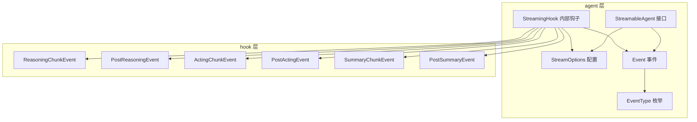
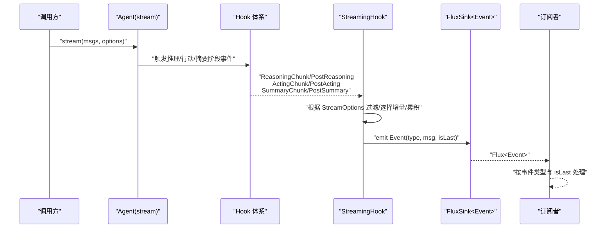
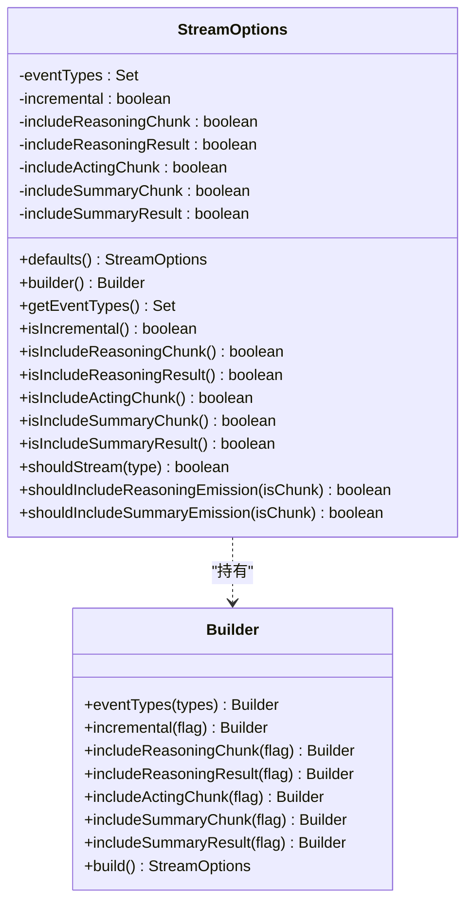
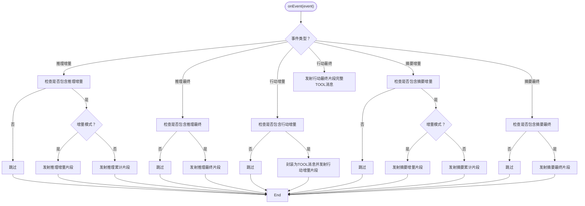
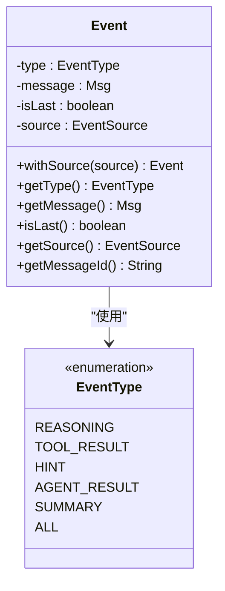
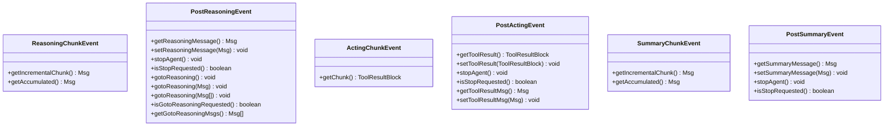
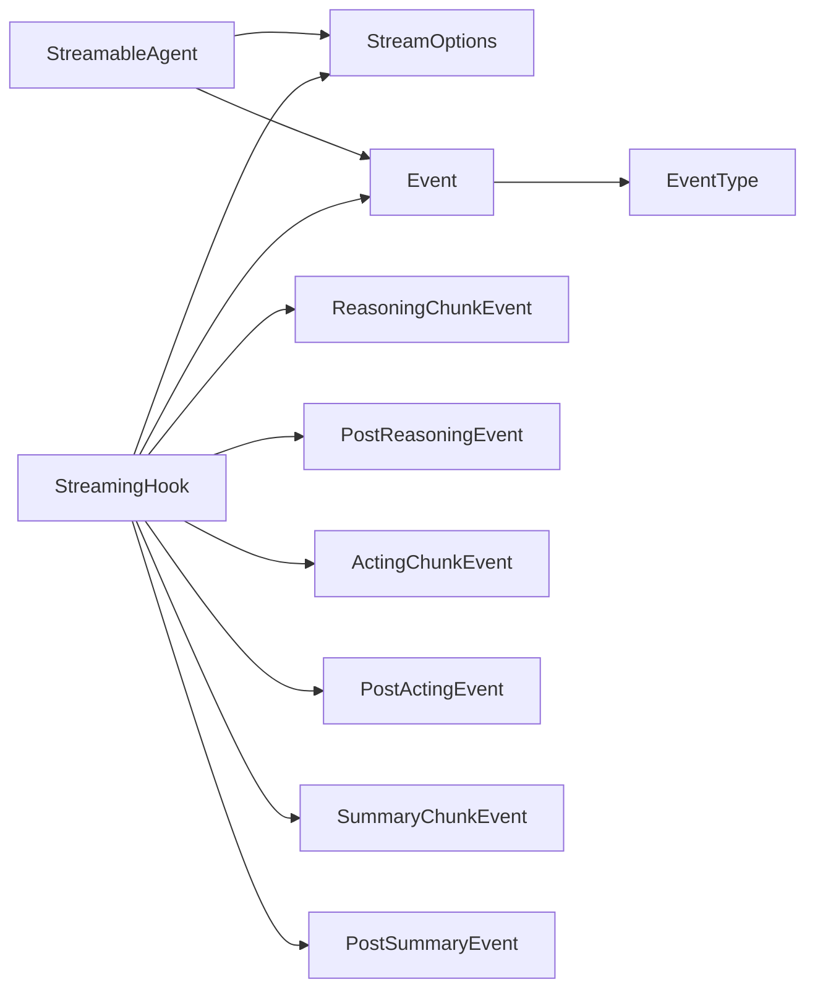

# 流式处理

<cite>
**本文引用的文件**
- [StreamOptions.java](file://agentscope-core/src/main/java/io/agentscope/core/agent/StreamOptions.java)
- [StreamingHook.java](file://agentscope-core/src/main/java/io/agentscope/core/agent/StreamingHook.java)
- [Event.java](file://agentscope-core/src/main/java/io/agentscope/core/agent/Event.java)
- [EventType.java](file://agentscope-core/src/main/java/io/agentscope/core/agent/EventType.java)
- [StreamableAgent.java](file://agentscope-core/src/main/java/io/agentscope/core/agent/StreamableAgent.java)
- [ReasoningChunkEvent.java](file://agentscope-core/src/main/java/io/agentscope/core/hook/ReasoningChunkEvent.java)
- [PostReasoningEvent.java](file://agentscope-core/src/main/java/io/agentscope/core/hook/PostReasoningEvent.java)
- [ActingChunkEvent.java](file://agentscope-core/src/main/java/io/agentscope/core/hook/ActingChunkEvent.java)
- [PostActingEvent.java](file://agentscope-core/src/main/java/io/agentscope/core/hook/PostActingEvent.java)
- [SummaryChunkEvent.java](file://agentscope-core/src/main/java/io/agentscope/core/hook/SummaryChunkEvent.java)
- [PostSummaryEvent.java](file://agentscope-core/src/main/java/io/agentscope/core/hook/PostSummaryEvent.java)
</cite>

## 目录
1. [简介](#简介)
2. [项目结构](#项目结构)
3. [核心组件](#核心组件)
4. [架构总览](#架构总览)
5. [详细组件分析](#详细组件分析)
6. [依赖关系分析](#依赖关系分析)
7. [性能考量](#性能考量)
8. [故障排查指南](#故障排查指南)
9. [结论](#结论)
10. [附录：API 参考与最佳实践](#附录api-参考与最佳实践)

## 简介
本文件面向 AgentScope Java 的智能体流式处理能力，系统性阐述响应式编程模型与事件驱动架构在流式执行中的应用，详解 StreamOptions 的配置项与使用方式，解析 StreamingHook 的事件拦截、过滤与分发机制，并梳理 Event 与 EventType 的分类体系（推理、行动、摘要等）。文末提供完整的流式处理 API 参考、使用示例与性能优化建议。

## 项目结构
围绕流式处理的核心代码位于 agentscope-core 模块的 agent 与 hook 包中：
- agent 层：定义流式接口、事件载体与配置选项
- hook 层：定义推理、行动、摘要阶段的增量事件与最终事件

**图表来源**
- [StreamableAgent.java:36-152](file://agentscope-core/src/main/java/io/agentscope/core/agent/StreamableAgent.java#L36-L152)
- [StreamOptions.java:62-371](file://agentscope-core/src/main/java/io/agentscope/core/agent/StreamOptions.java#L62-L371)
- [Event.java:51-211](file://agentscope-core/src/main/java/io/agentscope/core/agent/Event.java#L51-L211)
- [EventType.java:24-95](file://agentscope-core/src/main/java/io/agentscope/core/agent/EventType.java#L24-L95)
- [StreamingHook.java:43-164](file://agentscope-core/src/main/java/io/agentscope/core/agent/StreamingHook.java#L43-L164)
- [ReasoningChunkEvent.java:60-107](file://agentscope-core/src/main/java/io/agentscope/core/hook/ReasoningChunkEvent.java#L60-L107)
- [PostReasoningEvent.java:51-173](file://agentscope-core/src/main/java/io/agentscope/core/hook/PostReasoningEvent.java#L51-L173)
- [ActingChunkEvent.java:49-77](file://agentscope-core/src/main/java/io/agentscope/core/hook/ActingChunkEvent.java#L49-L77)
- [PostActingEvent.java:50-129](file://agentscope-core/src/main/java/io/agentscope/core/hook/PostActingEvent.java#L50-L129)
- [SummaryChunkEvent.java:60-107](file://agentscope-core/src/main/java/io/agentscope/core/hook/SummaryChunkEvent.java#L60-L107)
- [PostSummaryEvent.java:47-104](file://agentscope-core/src/main/java/io/agentscope/core/hook/PostSummaryEvent.java#L47-L104)

**章节来源**
- [StreamableAgent.java:23-152](file://agentscope-core/src/main/java/io/agentscope/core/agent/StreamableAgent.java#L23-L152)
- [StreamOptions.java:23-371](file://agentscope-core/src/main/java/io/agentscope/core/agent/StreamOptions.java#L23-L371)
- [Event.java:24-211](file://agentscope-core/src/main/java/io/agentscope/core/agent/Event.java#L24-L211)
- [EventType.java:18-95](file://agentscope-core/src/main/java/io/agentscope/core/agent/EventType.java#L18-L95)
- [StreamingHook.java:37-164](file://agentscope-core/src/main/java/io/agentscope/core/agent/StreamingHook.java#L37-L164)

## 核心组件
- StreamableAgent：定义多重重载的 stream(...) 方法，统一暴露“消息列表 + 配置 + 结构化输出”三要素的流式执行入口。
- StreamOptions：集中管理事件类型过滤、增量/累积模式以及各类事件子类型的包含策略（推理增量/结果、行动增量、摘要增量/结果）。
- Event：流式事件载体，携带类型、消息内容与是否为最终片段的标记；支持附加来源标识以区分子智能体。
- EventType：事件类型枚举，覆盖推理、工具结果、提示、最终结果、摘要与全量聚合。
- StreamingHook：内部钩子，拦截 HookEvent 并转换为 Event，负责过滤、增量/累积选择与最终片段标记。

**章节来源**
- [StreamableAgent.java:36-152](file://agentscope-core/src/main/java/io/agentscope/core/agent/StreamableAgent.java#L36-L152)
- [StreamOptions.java:62-371](file://agentscope-core/src/main/java/io/agentscope/core/agent/StreamOptions.java#L62-L371)
- [Event.java:51-211](file://agentscope-core/src/main/java/io/agentscope/core/agent/Event.java#L51-L211)
- [EventType.java:24-95](file://agentscope-core/src/main/java/io/agentscope/core/agent/EventType.java#L24-L95)
- [StreamingHook.java:43-164](file://agentscope-core/src/main/java/io/agentscope/core/agent/StreamingHook.java#L43-L164)

## 架构总览
AgentScope 的流式处理采用“事件驱动 + 响应式发布”的架构：
- 顶层 Agent 调用 stream(...) 后，内部通过 Hook 体系产生推理/行动/摘要阶段的增量与最终事件。
- StreamingHook 将这些 HookEvent 过滤并映射为 Event，按 StreamOptions 的策略决定是否发出增量或最终片段。
- 外层以 Reactor Flux 形式对外发布 Event，订阅者可按事件类型与 isLast 标记进行实时渲染或持久化。

**图表来源**
- [StreamableAgent.java:131-152](file://agentscope-core/src/main/java/io/agentscope/core/agent/StreamableAgent.java#L131-L152)
- [StreamingHook.java:62-121](file://agentscope-core/src/main/java/io/agentscope/core/agent/StreamingHook.java#L62-L121)
- [ReasoningChunkEvent.java:60-107](file://agentscope-core/src/main/java/io/agentscope/core/hook/ReasoningChunkEvent.java#L60-L107)
- [PostReasoningEvent.java:51-173](file://agentscope-core/src/main/java/io/agentscope/core/hook/PostReasoningEvent.java#L51-L173)
- [ActingChunkEvent.java:49-77](file://agentscope-core/src/main/java/io/agentscope/core/hook/ActingChunkEvent.java#L49-L77)
- [PostActingEvent.java:50-129](file://agentscope-core/src/main/java/io/agentscope/core/hook/PostActingEvent.java#L50-L129)
- [SummaryChunkEvent.java:60-107](file://agentscope-core/src/main/java/io/agentscope/core/hook/SummaryChunkEvent.java#L60-L107)
- [PostSummaryEvent.java:47-104](file://agentscope-core/src/main/java/io/agentscope/core/hook/PostSummaryEvent.java#L47-L104)

## 详细组件分析

### StreamOptions：流式配置与过滤
- 事件类型集合：支持指定具体类型或使用 ALL 聚合；shouldStream(...) 判断是否允许某类型进入流。
- 增量/累积模式：isIncremental 控制每次发射是“仅新增片段”还是“累计全文”。
- 推理事件细分：可分别控制是否包含“推理增量片段”与“推理最终结果”，避免重复或噪声。
- 行动事件细分：可控制“行动增量片段”是否出现在流中。
- 摘要事件细分：可控制“摘要增量片段”与“摘要最终结果”的包含策略。
- 构建器模式：提供链式配置，便于组合不同粒度的过滤与展示需求。

**图表来源**
- [StreamOptions.java:62-371](file://agentscope-core/src/main/java/io/agentscope/core/agent/StreamOptions.java#L62-L371)

**章节来源**
- [StreamOptions.java:23-371](file://agentscope-core/src/main/java/io/agentscope/core/agent/StreamOptions.java#L23-L371)

### StreamingHook：事件拦截、过滤与分发
- 责任边界：接收 HookEvent，转换为 Event 并写入 FluxSink。
- 过滤逻辑：依据 StreamOptions 的 shouldStream 与各子类型包含策略决定是否发射。
- 增量/累积选择：在增量模式下使用增量片段，在累积模式下使用累计片段。
- 工具结果封装：将 ToolResultBlock 封装为 Msg（角色 TOOL）后发射。
- 最终片段标记：对 Post* 事件与非增量场景标记 isLast=true，便于订阅端安全落库或结束渲染。

**图表来源**
- [StreamingHook.java:62-121](file://agentscope-core/src/main/java/io/agentscope/core/agent/StreamingHook.java#L62-L121)

**章节来源**
- [StreamingHook.java:37-164](file://agentscope-core/src/main/java/io/agentscope/core/agent/StreamingHook.java#L37-L164)

### Event 与 EventType：事件分类与语义
- Event：统一的流式事件载体，包含类型、消息与是否最终片段标记；支持附加来源信息以便区分子智能体。
- EventType：定义推理、工具结果、提示、最终结果、摘要与全量聚合等类型，明确每种事件的消息角色、内容构成与是否支持流式。

**图表来源**
- [Event.java:51-211](file://agentscope-core/src/main/java/io/agentscope/core/agent/Event.java#L51-L211)
- [EventType.java:24-95](file://agentscope-core/src/main/java/io/agentscope/core/agent/EventType.java#L24-L95)

**章节来源**
- [Event.java:24-211](file://agentscope-core/src/main/java/io/agentscope/core/agent/Event.java#L24-L211)
- [EventType.java:18-95](file://agentscope-core/src/main/java/io/agentscope/core/agent/EventType.java#L18-L95)

### Hook 事件族：推理、行动、摘要的增量与最终
- 推理事件：ReasoningChunkEvent 提供增量片段与累计片段；PostReasoningEvent 提供最终结果并支持修改与回退到推理阶段的能力。
- 行动事件：ActingChunkEvent 提供工具执行过程中的增量片段；PostActingEvent 提供最终结果并支持修改与中断。
- 摘要事件：SummaryChunkEvent 提供增量片段与累计片段；PostSummaryEvent 提供最终结果并支持修改与中断。

**图表来源**
- [ReasoningChunkEvent.java:60-107](file://agentscope-core/src/main/java/io/agentscope/core/hook/ReasoningChunkEvent.java#L60-L107)
- [PostReasoningEvent.java:51-173](file://agentscope-core/src/main/java/io/agentscope/core/hook/PostReasoningEvent.java#L51-L173)
- [ActingChunkEvent.java:49-77](file://agentscope-core/src/main/java/io/agentscope/core/hook/ActingChunkEvent.java#L49-L77)
- [PostActingEvent.java:50-129](file://agentscope-core/src/main/java/io/agentscope/core/hook/PostActingEvent.java#L50-L129)
- [SummaryChunkEvent.java:60-107](file://agentscope-core/src/main/java/io/agentscope/core/hook/SummaryChunkEvent.java#L60-L107)
- [PostSummaryEvent.java:47-104](file://agentscope-core/src/main/java/io/agentscope/core/hook/PostSummaryEvent.java#L47-L104)

**章节来源**
- [ReasoningChunkEvent.java:23-107](file://agentscope-core/src/main/java/io/agentscope/core/hook/ReasoningChunkEvent.java#L23-L107)
- [PostReasoningEvent.java:25-173](file://agentscope-core/src/main/java/io/agentscope/core/hook/PostReasoningEvent.java#L25-L173)
- [ActingChunkEvent.java:24-77](file://agentscope-core/src/main/java/io/agentscope/core/hook/ActingChunkEvent.java#L24-L77)
- [PostActingEvent.java:24-129](file://agentscope-core/src/main/java/io/agentscope/core/hook/PostActingEvent.java#L24-L129)
- [SummaryChunkEvent.java:23-107](file://agentscope-core/src/main/java/io/agentscope/core/hook/SummaryChunkEvent.java#L23-L107)
- [PostSummaryEvent.java:22-104](file://agentscope-core/src/main/java/io/agentscope/core/hook/PostSummaryEvent.java#L22-L104)

## 依赖关系分析
- StreamableAgent 依赖 StreamOptions 与 Event；对外暴露统一的流式 API。
- StreamingHook 依赖 StreamOptions、Event 与各类 HookEvent，负责将 Hook 世界转换为 Event 世界。
- Event 依赖 EventType 与 Msg；EventType 定义事件语义，Msg 承载内容。
- Hook 事件族（推理/行动/摘要）作为中间桥接，由具体模型或工具在执行过程中产生。

**图表来源**
- [StreamableAgent.java:36-152](file://agentscope-core/src/main/java/io/agentscope/core/agent/StreamableAgent.java#L36-L152)
- [StreamOptions.java:62-371](file://agentscope-core/src/main/java/io/agentscope/core/agent/StreamOptions.java#L62-L371)
- [Event.java:51-211](file://agentscope-core/src/main/java/io/agentscope/core/agent/Event.java#L51-L211)
- [EventType.java:24-95](file://agentscope-core/src/main/java/io/agentscope/core/agent/EventType.java#L24-L95)
- [StreamingHook.java:43-164](file://agentscope-core/src/main/java/io/agentscope/core/agent/StreamingHook.java#L43-L164)

**章节来源**
- [StreamableAgent.java:36-152](file://agentscope-core/src/main/java/io/agentscope/core/agent/StreamableAgent.java#L36-L152)
- [StreamOptions.java:62-371](file://agentscope-core/src/main/java/io/agentscope/core/agent/StreamOptions.java#L62-L371)
- [Event.java:51-211](file://agentscope-core/src/main/java/io/agentscope/core/agent/Event.java#L51-L211)
- [EventType.java:24-95](file://agentscope-core/src/main/java/io/agentscope/core/agent/EventType.java#L24-L95)
- [StreamingHook.java:43-164](file://agentscope-core/src/main/java/io/agentscope/core/agent/StreamingHook.java#L43-L164)

## 性能考量
- 增量模式优先：在高频流式输出场景下启用增量模式，减少文本拼接与传输开销。
- 粒度过滤：仅订阅必要事件类型（如仅 REASONING 或仅 TOOL_RESULT），降低事件生成与序列化成本。
- 合理使用“仅最终结果”策略：当 UI 不需要中间片段时，关闭增量片段可减少订阅端处理压力。
- 订阅端背压：结合 Reactor 的背压策略与线程池配置，避免内存峰值与丢帧。
- 序列化与网络：Event 中的 Msg 可能包含多媒体块，注意压缩与分片策略（如适用）。

## 故障排查指南
- 未收到事件：确认 StreamOptions 中是否包含对应 EventType，或是否误用了 ALL 但被其他过滤条件屏蔽。
- 重复或缺失片段：检查 isIncremental 与包含策略组合，确保推理/摘要的增量与最终片段开关符合预期。
- 工具结果未显示：确认是否启用了 TOOL_RESULT 类型且未关闭行动增量片段。
- 最终片段判断：订阅端应以 isLast 为准进行落库或结束渲染，避免在中间片段即持久化。
- 回退与中断：若需在推理/行动/摘要阶段回退或中断，使用相应事件提供的 API 并配合日志定位。

**章节来源**
- [StreamOptions.java:226-251](file://agentscope-core/src/main/java/io/agentscope/core/agent/StreamOptions.java#L226-L251)
- [Event.java:130-172](file://agentscope-core/src/main/java/io/agentscope/core/agent/Event.java#L130-L172)
- [PostReasoningEvent.java:99-153](file://agentscope-core/src/main/java/io/agentscope/core/hook/PostReasoningEvent.java#L99-L153)
- [PostActingEvent.java:98-127](file://agentscope-core/src/main/java/io/agentscope/core/hook/PostActingEvent.java#L98-L127)
- [PostSummaryEvent.java:91-102](file://agentscope-core/src/main/java/io/agentscope/core/hook/PostSummaryEvent.java#L91-L102)

## 结论
AgentScope 的流式处理以 StreamOptions 为核心配置点，通过 StreamingHook 将 Hook 事件映射为标准化 Event，结合 Reactor Flux 实现事件驱动的实时可观测与交互体验。合理配置事件类型、增量/累积模式与片段包含策略，可在保证用户体验的同时兼顾性能与可维护性。

## 附录：API 参考与最佳实践

### API 参考
- StreamableAgent.stream(...)
  - 支持多种重载：单消息、消息列表、带结构化输出（类或 JSON Schema）、带默认配置或自定义 StreamOptions。
  - 返回值：Flux<Event>，订阅后按事件类型与 isLast 标记处理。
- StreamOptions
  - 关键字段：eventTypes、incremental、includeReasoningChunk、includeReasoningResult、includeActingChunk、includeSummaryChunk、includeSummaryResult。
  - 关键方法：defaults()、builder()、shouldStream(...)、shouldIncludeReasoningEmission(...)、shouldIncludeSummaryEmission(...)。
- Event
  - 字段：type、message、isLast、source；方法：withSource(...)、getType()、getMessage()、isLast()、getSource()、getMessageId()。
- EventType
  - 枚举值：REASONING、TOOL_RESULT、HINT、AGENT_RESULT、SUMMARY、ALL。

**章节来源**
- [StreamableAgent.java:36-152](file://agentscope-core/src/main/java/io/agentscope/core/agent/StreamableAgent.java#L36-L152)
- [StreamOptions.java:62-371](file://agentscope-core/src/main/java/io/agentscope/core/agent/StreamOptions.java#L62-L371)
- [Event.java:51-211](file://agentscope-core/src/main/java/io/agentscope/core/agent/Event.java#L51-L211)
- [EventType.java:24-95](file://agentscope-core/src/main/java/io/agentscope/core/agent/EventType.java#L24-L95)

### 使用示例（步骤说明）
- 示例一：仅推理增量流
  - 步骤：构建 StreamOptions，指定事件类型为 REASONING，开启增量模式；调用 agent.stream(msg, options) 订阅 Flux<Event>；在订阅中根据 isLast 决定是否持久化。
- 示例二：推理最终结果 + 工具结果
  - 步骤：构建 StreamOptions，包含 REASONING 与 TOOL_RESULT，关闭推理增量片段；订阅后按类型分支处理。
- 示例三：摘要增量流
  - 步骤：构建 StreamOptions，包含 SUMMARY，开启增量模式；订阅后按增量片段逐步渲染，isLast 时完成收尾。

**章节来源**
- [StreamOptions.java:38-60](file://agentscope-core/src/main/java/io/agentscope/core/agent/StreamOptions.java#L38-L60)
- [StreamableAgent.java:86-112](file://agentscope-core/src/main/java/io/agentscope/core/agent/StreamableAgent.java#L86-L112)

### 最佳实践
- 明确业务目标：UI 实时预览选增量，后台批处理选最终结果。
- 事件最小化：仅启用必要的 EventType，避免无谓的序列化与传输。
- 订阅端幂等：对 isLast 片段进行幂等落库，避免重复写入。
- 错误隔离：在 StreamingHook 之外增加异常兜底，确保流不断。
- 结构化输出：结合结构化模型或 JSON Schema，使流式输出具备稳定格式，便于下游解析。