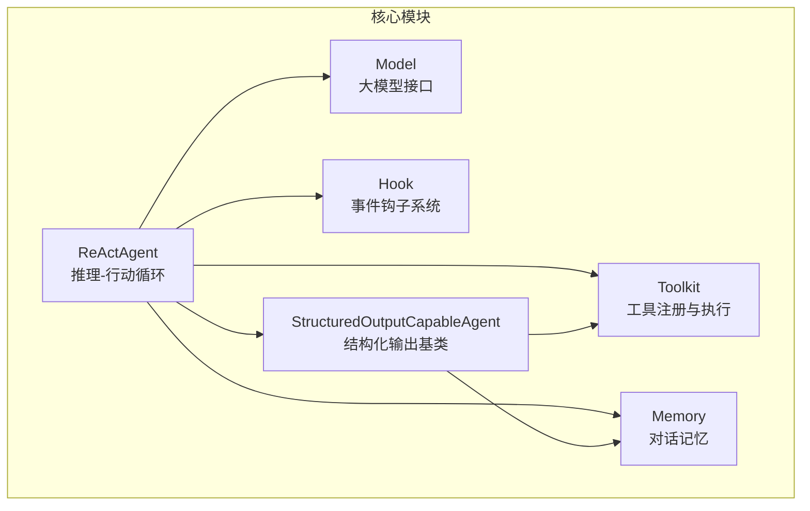
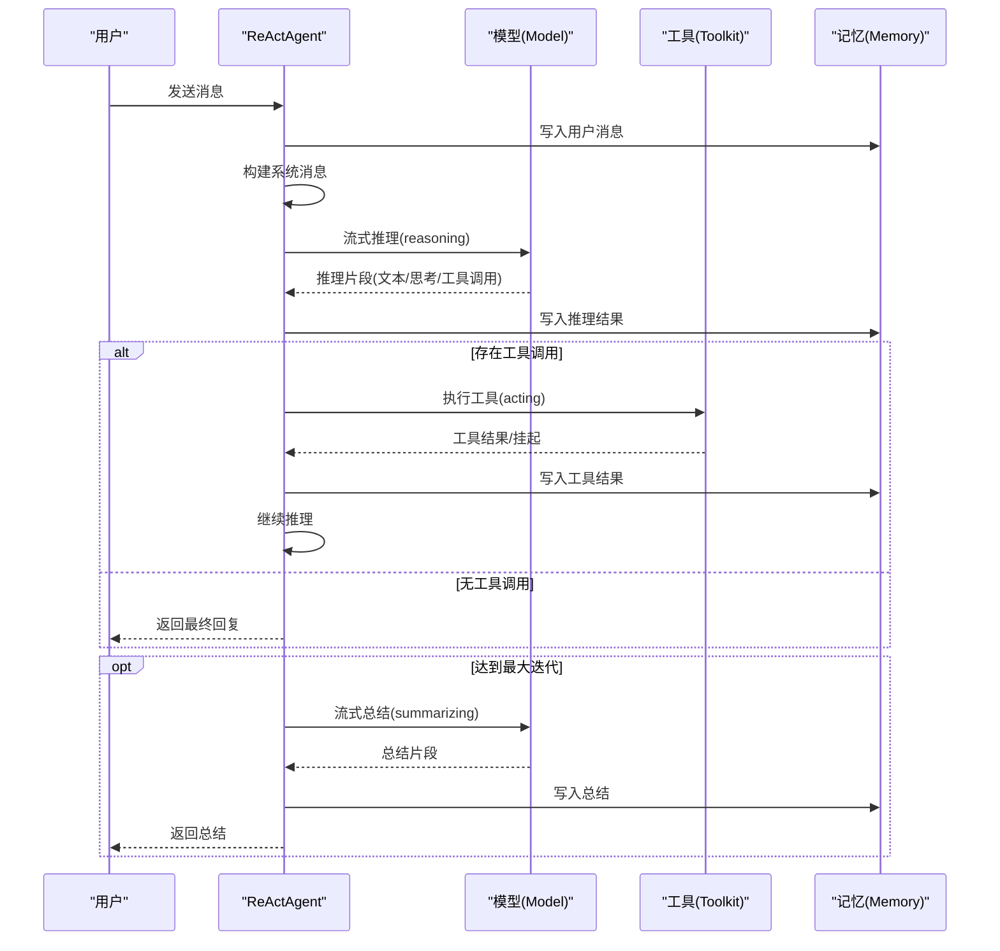
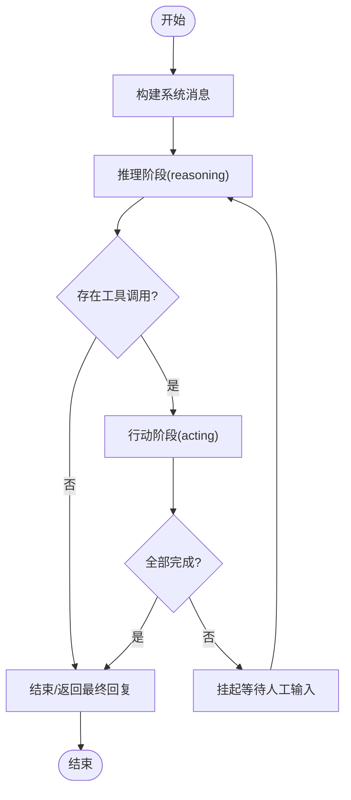
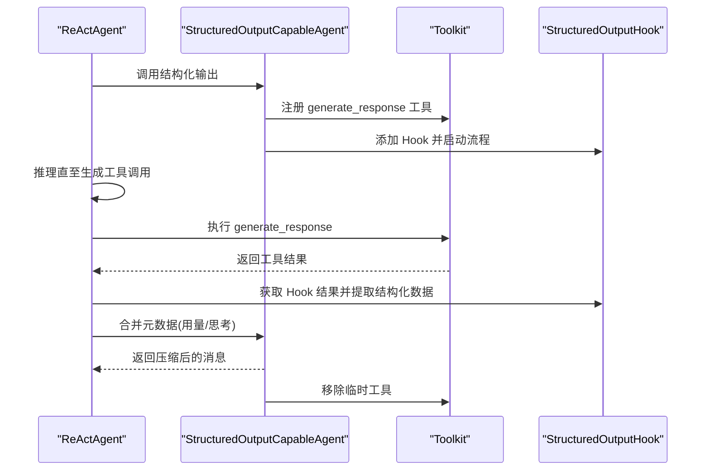
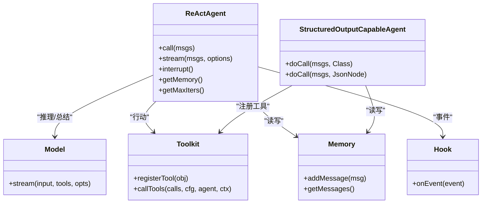

# ReAct 推理范式

<cite>
**本文档引用的文件**
- [ReActAgent.java](file://agentscope-core/src/main/java/io/agentscope/core/ReActAgent.java)
- [StructuredOutputCapableAgent.java](file://agentscope-core/src/main/java/io/agentscope/core/agent/StructuredOutputCapableAgent.java)
- [ReActAgentTest.java](file://agentscope-core/src/test/java/io/agentscope/core/agent/ReActAgentTest.java)
- [ReActAgentStructuredOutputTest.java](file://agentscope-core/src/test/java/io/agentscope/core/agent/ReActAgentStructuredOutputTest.java)
- [agent.md](file://docs/en/quickstart/agent.md)
- [agent-config.md](file://docs/en/task/agent-config.md)
- [SKILL.md](file://SKILL.md)
</cite>

## 目录
1. [简介](#简介)
2. [项目结构](#项目结构)
3. [核心组件](#核心组件)
4. [架构总览](#架构总览)
5. [详细组件分析](#详细组件分析)
6. [依赖关系分析](#依赖关系分析)
7. [性能考虑](#性能考虑)
8. [故障排查指南](#故障排查指南)
9. [结论](#结论)
10. [附录](#附录)

## 简介
本文件系统性阐述 ReAct（推理-行动）范式的实现与使用，围绕 ReActAgent 的设计思想、推理-行动循环、中断与恢复、结构化输出能力展开，结合源码与测试用例，帮助开发者正确配置与扩展 ReAct 推理流程。

## 项目结构
ReAct 推理范式主要由以下模块构成：
- ReActAgent：核心推理-行动循环执行器，负责构建系统消息、驱动模型推理、调度工具调用、管理记忆与钩子事件。
- StructuredOutputCapableAgent：结构化输出能力基类，通过 generate_response 工具与 StructuredOutputHook 协作，实现类型安全的结构化输出。
- 测试与示例：提供丰富的单元测试与示例文档，覆盖工具调用、流式响应、最大迭代限制、中断处理、结构化输出等场景。

图示来源
- [ReActAgent.java](file://agentscope-core/src/main/java/io/agentscope/core/ReActAgent.java)
- [StructuredOutputCapableAgent.java](file://agentscope-core/src/main/java/io/agentscope/core/agent/StructuredOutputCapableAgent.java)

章节来源
- [ReActAgent.java](file://agentscope-core/src/main/java/io/agentscope/core/ReActAgent.java)
- [StructuredOutputCapableAgent.java](file://agentscope-core/src/main/java/io/agentscope/core/agent/StructuredOutputCapableAgent.java)

## 核心组件
- ReActAgent：继承自结构化输出能力基类，提供完整的 ReAct 循环，包含推理阶段（reasoning）、行动阶段（acting）、总结阶段（summarizing），支持最大迭代限制、中断处理、流式事件通知。
- StructuredOutputCapableAgent：抽象基类，提供 generate_response 工具注册、Schema 验证、内存压缩与元数据合并等能力，支撑结构化输出流程。
- Toolkit：工具注册中心，负责工具发现、参数校验、并发与错误处理、工具回调分发。
- Memory：消息存储与检索，维护历史对话，支持长短期记忆集成。
- Hook：事件钩子系统，贯穿推理、行动、总结全过程，支持流式增量事件与后处理。

章节来源
- [ReActAgent.java](file://agentscope-core/src/main/java/io/agentscope/core/ReActAgent.java)
- [StructuredOutputCapableAgent.java](file://agentscope-core/src/main/java/io/agentscope/core/agent/StructuredOutputCapableAgent.java)

## 架构总览
ReActAgent 的执行路径分为三个阶段：
- 推理阶段（reasoning）：构建输入消息列表（含系统消息），调用模型进行流式生成，累积文本与思考块，决定是否继续行动或结束。
- 行动阶段（acting）：提取待执行工具调用，调用工具执行，处理成功/挂起/失败结果，写入记忆，决定是否继续推理。
- 总结阶段（summarizing）：达到最大迭代时，基于当前记忆生成总结性回复。

图示来源
- [ReActAgent.java](file://agentscope-core/src/main/java/io/agentscope/core/ReActAgent.java)

章节来源
- [ReActAgent.java](file://agentscope-core/src/main/java/io/agentscope/core/ReActAgent.java)

## 详细组件分析

### ReActAgent 推理-行动循环
- 最大迭代限制：通过 maxIters 控制循环次数，超过后进入总结阶段。
- 中断处理：支持用户中断与系统关闭中断，区分丢弃或保留部分推理内容。
- 流式处理：通过 ReasoningChunkEvent/SummaryChunkEvent/ActingChunkEvent 提供增量事件，便于前端实时渲染与可观测性。
- 挂起工具：当工具抛出特定异常时，生成挂起结果，等待后续人工或外部输入补充结果后再继续。

图示来源
- [ReActAgent.java](file://agentscope-core/src/main/java/io/agentscope/core/ReActAgent.java)

章节来源
- [ReActAgent.java](file://agentscope-core/src/main/java/io/agentscope/core/ReActAgent.java)
- [ReActAgentTest.java](file://agentscope-core/src/test/java/io/agentscope/core/agent/ReActAgentTest.java)

### 结构化输出能力（StructuredOutputCapableAgent）
- 工具注册：动态注册 generate_response 工具，Schema 来源于目标类或 JSON Schema。
- Hook 协作：通过 StructuredOutputHook 控制生成流程，必要时触发 gotoReasoning 进行重推理。
- 元数据合并：将多轮推理的思考块与用量信息合并到最终消息中，保持上下文完整性。
- 内存压缩：在结构化输出完成后，将中间消息压缩为最终消息，保留关键元数据。

图示来源
- [StructuredOutputCapableAgent.java](file://agentscope-core/src/main/java/io/agentscope/core/agent/StructuredOutputCapableAgent.java)
- [ReActAgent.java](file://agentscope-core/src/main/java/io/agentscope/core/ReActAgent.java)

章节来源
- [StructuredOutputCapableAgent.java](file://agentscope-core/src/main/java/io/agentscope/core/agent/StructuredOutputCapableAgent.java)
- [ReActAgentStructuredOutputTest.java](file://agentscope-core/src/test/java/io/agentscope/core/agent/ReActAgentStructuredOutputTest.java)

### 使用示例与最佳实践
- 基本配置：设置系统提示、模型、工具集、记忆、最大迭代数、执行配置与钩子。
- 消息传递：通过 Msg 对象携带文本、工具调用与工具结果；ReActAgent 自动维护消息历史。
- 结果处理：可直接获取文本回复，也可启用结构化输出以获得强类型数据对象。
- 示例参考：
  - 快速入门与配置：[agent.md](file://docs/en/quickstart/agent.md)
  - 完整配置示例与工具上下文注入：[agent-config.md](file://docs/en/task/agent-config.md)
  - 示例演示与流式钩子：[SKILL.md](file://SKILL.md)

章节来源
- [agent.md](file://docs/en/quickstart/agent.md)
- [agent-config.md](file://docs/en/task/agent-config.md)
- [SKILL.md](file://SKILL.md)

## 依赖关系分析
ReActAgent 的关键依赖与耦合关系如下：
- 低耦合：通过接口与抽象（Model、Toolkit、Memory、Hook）解耦具体实现。
- 钩子系统：贯穿推理、行动、总结全过程，事件类型丰富，便于扩展。
- 工具执行：统一通过 Toolkit 调度，支持同步/异步、流式响应、并行调用与挂起恢复。
- 记忆管理：InMemoryMemory 与长短期记忆集成，支持静态控制与代理控制两种模式。

图示来源
- [ReActAgent.java](file://agentscope-core/src/main/java/io/agentscope/core/ReActAgent.java)
- [StructuredOutputCapableAgent.java](file://agentscope-core/src/main/java/io/agentscope/core/agent/StructuredOutputCapableAgent.java)

章节来源
- [ReActAgent.java](file://agentscope-core/src/main/java/io/agentscope/core/ReActAgent.java)
- [StructuredOutputCapableAgent.java](file://agentscope-core/src/main/java/io/agentscope/core/agent/StructuredOutputCapableAgent.java)

## 性能考虑
- 流式生成：模型与工具均支持流式输出，前端可实时渲染，降低感知延迟。
- 超时与重试：通过 ExecutionConfig 控制模型与工具的超时、重试与退避策略，提升稳定性。
- 最大迭代限制：避免无限循环，保障资源占用可控。
- 钩子优先级：合理设置钩子优先级，避免高开销操作阻塞主流程。
- 长期记忆：静态控制模式可异步记录，减少响应延迟但不保证持久性；代理控制模式更可靠但可能增加延迟。

## 故障排查指南
- 工具调用错误：工具执行异常会被转换为错误结果写入记忆，模型可据此继续推理。若出现“缺少工具结果”错误，请检查 PendingToolRecoveryHook 是否启用或手动补充工具结果。
- 最大迭代限制：达到上限会触发总结阶段，生成 MAX_ITERATIONS 原因的消息。可通过增加 maxIters 或优化提示词调整策略。
- 中断处理：用户中断会在合适时机保存恢复消息；系统关闭中断会根据配置决定是否丢弃部分推理内容。
- 结构化输出：确保 generate_response 工具被正确注册与移除，避免并发竞态导致的异常；如遇竞态问题，建议串行化调用或使用隔离的 Toolkit 实例。

章节来源
- [ReActAgent.java](file://agentscope-core/src/main/java/io/agentscope/core/ReActAgent.java)
- [ReActAgentTest.java](file://agentscope-core/src/test/java/io/agentscope/core/agent/ReActAgentTest.java)
- [ReActAgentStructuredOutputTest.java](file://agentscope-core/src/test/java/io/agentscope/core/agent/ReActAgentStructuredOutputTest.java)

## 结论
ReActAgent 将“推理-行动”范式工程化落地，具备完善的事件钩子、流式处理、中断与恢复、结构化输出等能力。通过合理的配置与工具编排，可在复杂任务中稳定地完成多轮交互与工具调用，满足多样化的业务需求。

## 附录
- 参考示例与文档
  - 快速开始与基础配置：[agent.md](file://docs/en/quickstart/agent.md)
  - 完整配置与工具上下文：[agent-config.md](file://docs/en/task/agent-config.md)
  - 示例演示与流式钩子：[SKILL.md](file://SKILL.md)
- 关键实现要点
  - 推理-行动循环与最大迭代限制：[ReActAgent.java](file://agentscope-core/src/main/java/io/agentscope/core/ReActAgent.java)
  - 结构化输出工具与 Hook 协作：[StructuredOutputCapableAgent.java](file://agentscope-core/src/main/java/io/agentscope/core/agent/StructuredOutputCapableAgent.java)
  - 行为验证与回归测试：[ReActAgentTest.java](file://agentscope-core/src/test/java/io/agentscope/core/agent/ReActAgentTest.java)、[ReActAgentStructuredOutputTest.java](file://agentscope-core/src/test/java/io/agentscope/core/agent/ReActAgentStructuredOutputTest.java)