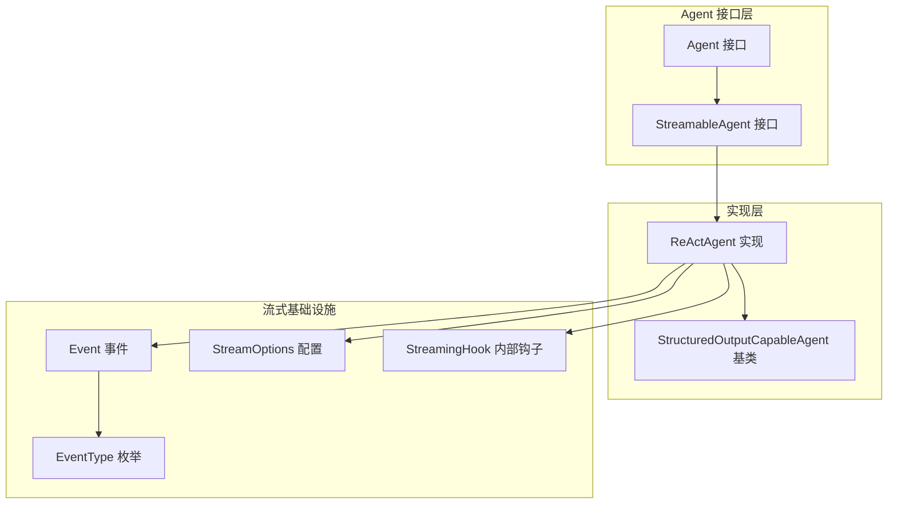
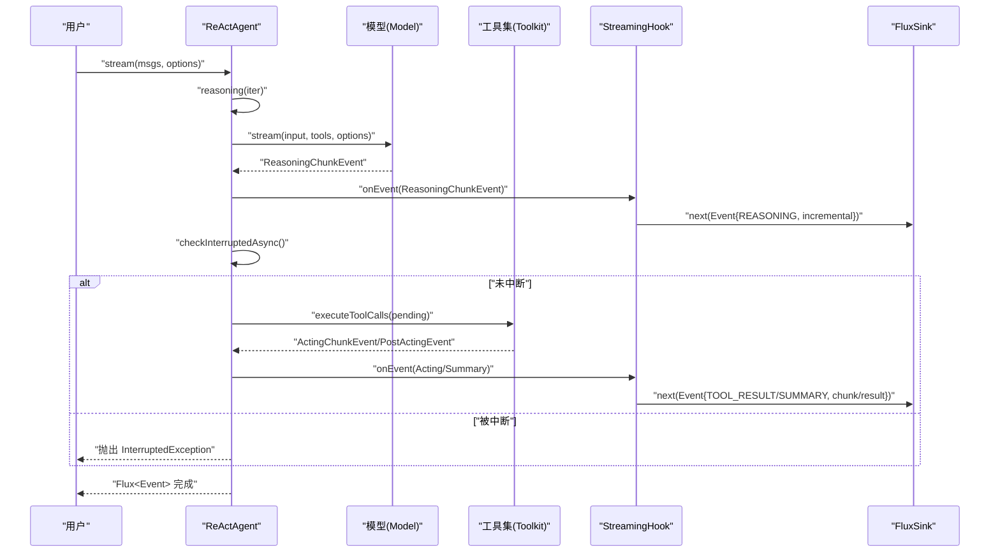
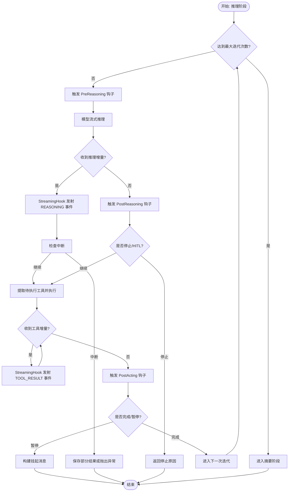
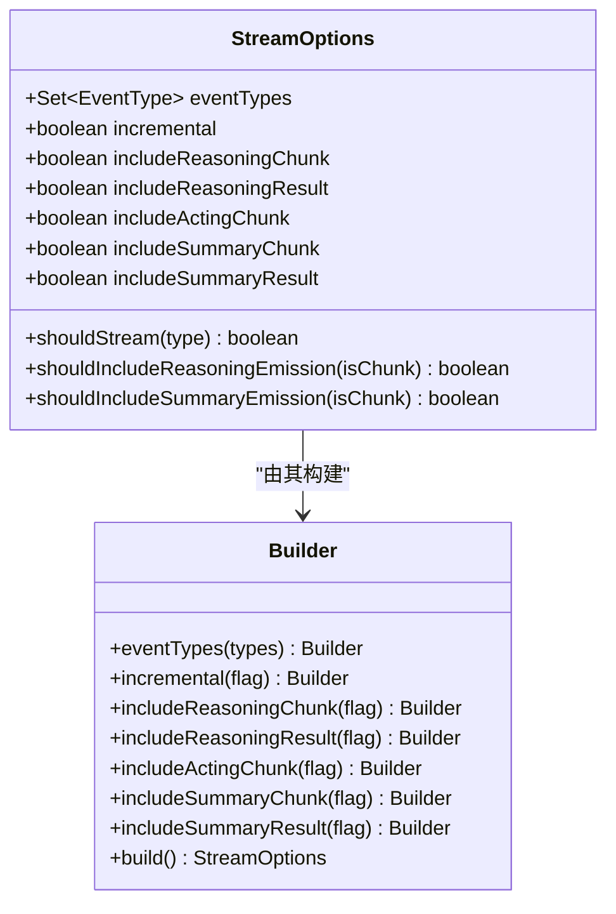
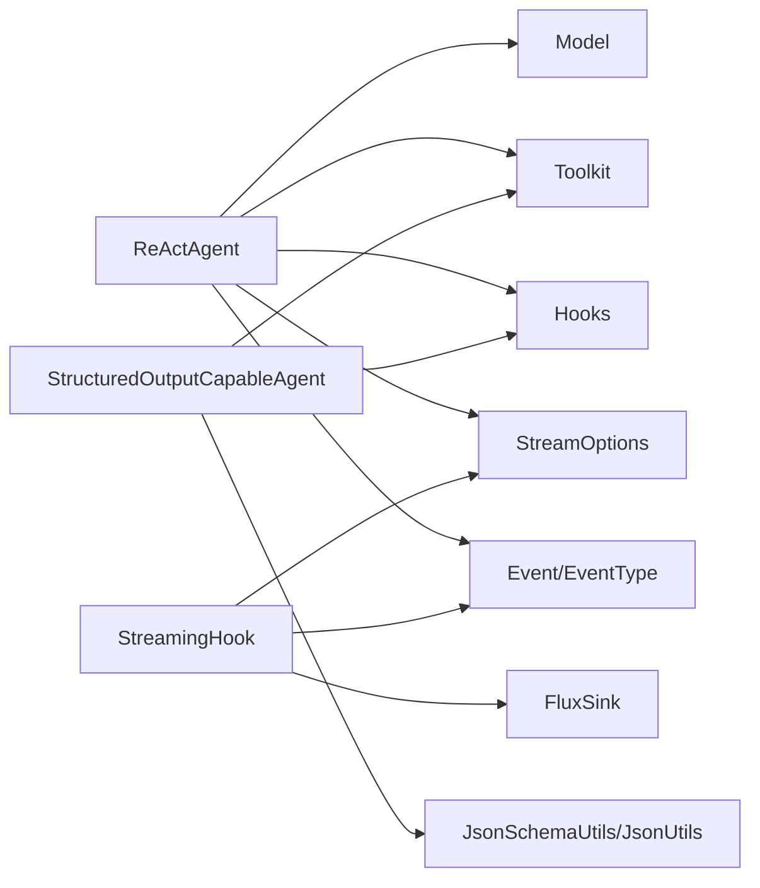

# 响应式编程基础

<cite>
**本文引用的文件**   
- [ReActAgent.java](file://agentscope-core/src/main/java/io/agentscope/core/ReActAgent.java)
- [StreamOptions.java](file://agentscope-core/src/main/java/io/agentscope/core/agent/StreamOptions.java)
- [StreamableAgent.java](file://agentscope-core/src/main/java/io/agentscope/core/agent/StreamableAgent.java)
- [StreamingHook.java](file://agentscope-core/src/main/java/io/agentscope/core/agent/StreamingHook.java)
- [StructuredOutputCapableAgent.java](file://agentscope-core/src/main/java/io/agentscope/core/agent/StructuredOutputCapableAgent.java)
- [Event.java](file://agentscope-core/src/main/java/io/agentscope/core/agent/Event.java)
- [EventType.java](file://agentscope-core/src/main/java/io/agentscope/core/agent/EventType.java)
- [Agent.java](file://agentscope-core/src/main/java/io/agentscope/core/agent/Agent.java)
</cite>

## 目录
1. [引言](#引言)
2. [项目结构](#项目结构)
3. [核心组件](#核心组件)
4. [架构总览](#架构总览)
5. [详细组件分析](#详细组件分析)
6. [依赖关系分析](#依赖关系分析)
7. [性能考量](#性能考量)
8. [故障排查指南](#故障排查指南)
9. [结论](#结论)
10. [附录](#附录)

## 引言
本文件面向希望理解并应用响应式编程（Reactive Programming）于智能体系统的读者，重点围绕 AgentScope 框架中 Project Reactor 的使用与实践展开。内容涵盖：
- 响应式编程优势：非阻塞执行、背压处理、异步流处理
- ReActAgent 如何基于 Mono/Flux 实现流式推理与工具执行
- 流式钩子系统与实时事件处理
- 流式选项（StreamOptions）的配置与策略选择
- 错误处理、背压管理与资源清理
- 将传统同步代码转换为响应式模式的方法与示例路径

## 项目结构
AgentScope 的响应式能力主要集中在 agentscope-core 模块的 agent 子包与 ReActAgent 核心类中。关键文件如下：
- ReActAgent：实现 ReAct 推理-行动循环，使用 Mono/Flux 进行非阻塞与流式处理
- StreamOptions：控制流式事件类型与增量/累积输出策略
- StreamableAgent：声明式流式接口，统一多消息输入与结构化输出支持
- StreamingHook：内部钩子，将事件过滤、增量/累积处理后通过 FluxSink 发射
- StructuredOutputCapableAgent：结构化输出能力基类，结合 Mono 实现生成流程
- Event/EventType：事件模型与事件类型枚举，支撑流式观测与 UI 更新
- Agent：聚合调用、流式与观察能力的顶层接口

**图表来源**
- [Agent.java:1-83](file://agentscope-core/src/main/java/io/agentscope/core/agent/Agent.java#L1-L83)
- [StreamableAgent.java:1-153](file://agentscope-core/src/main/java/io/agentscope/core/agent/StreamableAgent.java#L1-L153)
- [ReActAgent.java:140-1904](file://agentscope-core/src/main/java/io/agentscope/core/ReActAgent.java#L140-L1904)
- [StructuredOutputCapableAgent.java:1-374](file://agentscope-core/src/main/java/io/agentscope/core/agent/StructuredOutputCapableAgent.java#L1-L374)
- [Event.java:1-211](file://agentscope-core/src/main/java/io/agentscope/core/agent/Event.java#L1-L211)
- [EventType.java:1-95](file://agentscope-core/src/main/java/io/agentscope/core/agent/EventType.java#L1-L95)
- [StreamOptions.java:1-371](file://agentscope-core/src/main/java/io/agentscope/core/agent/StreamOptions.java#L1-L371)
- [StreamingHook.java:1-164](file://agentscope-core/src/main/java/io/agentscope/core/agent/StreamingHook.java#L1-L164)

**章节来源**
- [Agent.java:1-83](file://agentscope-core/src/main/java/io/agentscope/core/agent/Agent.java#L1-L83)
- [StreamableAgent.java:1-153](file://agentscope-core/src/main/java/io/agentscope/core/agent/StreamableAgent.java#L1-L153)
- [ReActAgent.java:140-1904](file://agentscope-core/src/main/java/io/agentscope/core/ReActAgent.java#L140-L1904)
- [StructuredOutputCapableAgent.java:1-374](file://agentscope-core/src/main/java/io/agentscope/core/agent/StructuredOutputCapableAgent.java#L1-L374)
- [Event.java:1-211](file://agentscope-core/src/main/java/io/agentscope/core/agent/Event.java#L1-L211)
- [EventType.java:1-95](file://agentscope-core/src/main/java/io/agentscope/core/agent/EventType.java#L1-L95)
- [StreamOptions.java:1-371](file://agentscope-core/src/main/java/io/agentscope/core/agent/StreamOptions.java#L1-L371)
- [StreamingHook.java:1-164](file://agentscope-core/src/main/java/io/agentscope/core/agent/StreamingHook.java#L1-L164)

## 核心组件
- ReActAgent：以 Mono/Flux 为核心，实现“推理-行动”迭代循环的非阻塞与流式处理；通过钩子系统在每个阶段发射事件，支持人类在环（HITL）中断与结构化输出。
- StreamOptions：用于精确控制事件类型、增量/累积输出、推理/摘要的中间结果与最终结果是否包含等。
- StreamableAgent：统一的流式接口，支持单条或多条消息、结构化输出（类或 JSON Schema）三种调用变体。
- StreamingHook：内部钩子，负责事件过滤、增量/累积消息选择，并通过 FluxSink 发出 Event。
- StructuredOutputCapableAgent：提供结构化输出能力，借助 Mono 管道与 Hook 协作完成生成与提取。
- Event/EventType：事件模型与类型枚举，支撑 UI 实时更新与持久化策略。

**章节来源**
- [ReActAgent.java:90-140](file://agentscope-core/src/main/java/io/agentscope/core/ReActAgent.java#L90-L140)
- [StreamOptions.java:62-120](file://agentscope-core/src/main/java/io/agentscope/core/agent/StreamOptions.java#L62-L120)
- [StreamableAgent.java:36-152](file://agentscope-core/src/main/java/io/agentscope/core/agent/StreamableAgent.java#L36-L152)
- [StreamingHook.java:43-121](file://agentscope-core/src/main/java/io/agentscope/core/agent/StreamingHook.java#L43-L121)
- [StructuredOutputCapableAgent.java:65-123](file://agentscope-core/src/main/java/io/agentscope/core/agent/StructuredOutputCapableAgent.java#L65-L123)
- [Event.java:51-93](file://agentscope-core/src/main/java/io/agentscope/core/agent/Event.java#L51-L93)
- [EventType.java:24-94](file://agentscope-core/src/main/java/io/agentscope/core/agent/EventType.java#L24-L94)

## 架构总览
ReActAgent 的响应式执行链路由“推理阶段（Mono）+ 工具执行（Flux）+ 钩子事件（FluxSink）”构成，整体呈现“非阻塞 + 流式 + 可中断”的特性。

**图表来源**
- [ReActAgent.java:560-650](file://agentscope-core/src/main/java/io/agentscope/core/ReActAgent.java#L560-L650)
- [ReActAgent.java:669-731](file://agentscope-core/src/main/java/io/agentscope/core/ReActAgent.java#L669-L731)
- [StreamingHook.java:62-121](file://agentscope-core/src/main/java/io/agentscope/core/agent/StreamingHook.java#L62-L121)

**章节来源**
- [ReActAgent.java:546-731](file://agentscope-core/src/main/java/io/agentscope/core/ReActAgent.java#L546-L731)
- [StreamingHook.java:43-121](file://agentscope-core/src/main/java/io/agentscope/core/agent/StreamingHook.java#L43-L121)

## 详细组件分析

### ReActAgent：响应式推理-行动循环
- 使用 Mono 包裹推理阶段，确保非阻塞与可中断；在工具执行阶段使用 Flux 支持长耗时工具的增量输出。
- 通过钩子系统在推理、行动、摘要各阶段发射事件，StreamingHook 负责根据 StreamOptions 过滤与选择增量/累积消息。
- 支持人类在环（HITL）中断：在关键检查点检查中断信号，必要时保存部分推理结果或直接抛出异常。
- 结构化输出：委托给 StructuredOutputCapableAgent，借助 Mono 管道与 Hook 控制生成流程。

**图表来源**
- [ReActAgent.java:546-731](file://agentscope-core/src/main/java/io/agentscope/core/ReActAgent.java#L546-L731)
- [StreamingHook.java:62-121](file://agentscope-core/src/main/java/io/agentscope/core/agent/StreamingHook.java#L62-L121)

**章节来源**
- [ReActAgent.java:546-731](file://agentscope-core/src/main/java/io/agentscope/core/ReActAgent.java#L546-L731)
- [ReActAgent.java:766-800](file://agentscope-core/src/main/java/io/agentscope/core/ReActAgent.java#L766-L800)

### 流式选项（StreamOptions）：策略与配置
- 事件类型过滤：支持仅接收 REASONING、TOOL_RESULT、SUMMARY 等特定类型，或 ALL 全量。
- 增量/累积模式：控制每次发射仅包含新增内容（增量）或累计全量内容（累积）。
- 细粒度开关：分别控制推理/摘要的中间增量与最终结果是否包含，避免重复或冗余事件。
- 默认策略：默认包含所有事件类型与中间增量，保持向后兼容。

**图表来源**
- [StreamOptions.java:62-371](file://agentscope-core/src/main/java/io/agentscope/core/agent/StreamOptions.java#L62-L371)

**章节来源**
- [StreamOptions.java:62-252](file://agentscope-core/src/main/java/io/agentscope/core/agent/StreamOptions.java#L62-L252)
- [StreamOptions.java:254-371](file://agentscope-core/src/main/java/io/agentscope/core/agent/StreamOptions.java#L254-L371)

### 流式接口（StreamableAgent）：统一调用
- 提供多种重载：单消息、多消息、带结构化输出（类或 JSON Schema）等。
- 默认使用 StreamOptions.defaults()，确保开箱即用的完整事件流。
- 返回 Flux<Event>，便于订阅端进行 UI 实时渲染与持久化策略控制。

**章节来源**
- [StreamableAgent.java:36-152](file://agentscope-core/src/main/java/io/agentscope/core/agent/StreamableAgent.java#L36-L152)

### 流式钩子（StreamingHook）：事件过滤与增量处理
- 根据 StreamOptions 过滤事件类型与推理/摘要的中间与最终结果。
- 对增量模式，直接使用 ReasoningChunkEvent/SummaryChunkEvent 提供的增量消息；对累积模式，使用累积消息。
- 维护消息 ID 到内容的映射，区分中间增量与最终完整消息，保证订阅端正确拼接与落库。

**章节来源**
- [StreamingHook.java:43-164](file://agentscope-core/src/main/java/io/agentscope/core/agent/StreamingHook.java#L43-L164)

### 结构化输出（StructuredOutputCapableAgent）：Mono 管道与 Hook 协作
- 注册临时工具 generate_response，结合 StructuredOutputHook 控制生成流程。
- 使用 Mono.defer 包裹执行，确保参数校验与资源清理（Hook 移除、工具卸载）。
- 合并思考块与用量统计到最终消息元数据，便于后续处理与追踪。

**章节来源**
- [StructuredOutputCapableAgent.java:126-197](file://agentscope-core/src/main/java/io/agentscope/core/agent/StructuredOutputCapableAgent.java#L126-L197)
- [StructuredOutputCapableAgent.java:202-322](file://agentscope-core/src/main/java/io/agentscope/core/agent/StructuredOutputCapableAgent.java#L202-L322)

### 事件模型（Event/EventType）：类型与状态
- Event 封装事件类型、消息与是否为最终消息（isLast），支持来源标识（子代理）。
- EventType 定义 REASONING、TOOL_RESULT、HINT、AGENT_RESULT、SUMMARY 与 ALL，明确各阶段的消息角色与内容特征。

**章节来源**
- [Event.java:51-172](file://agentscope-core/src/main/java/io/agentscope/core/agent/Event.java#L51-L172)
- [EventType.java:24-94](file://agentscope-core/src/main/java/io/agentscope/core/agent/EventType.java#L24-L94)

## 依赖关系分析
- ReActAgent 依赖：
  - Model：提供流式推理能力（Mono/Flux）
  - Toolkit：提供工具执行（Flux）与内部增量回调
  - Hooks：Pre/Post Reasoning/Acting/Summary 与 StructuredOutputHook
  - StreamOptions：控制事件过滤与增量/累积
- StreamingHook 依赖：
  - FluxSink：事件发射
  - Event/EventType：事件封装与类型判断
- StructuredOutputCapableAgent 依赖：
  - Toolkit：注册临时工具
  - Hook：控制生成流程
  - JsonSchemaUtils/JsonUtils：结构化输出的模式生成与序列化

**图表来源**
- [ReActAgent.java:140-1904](file://agentscope-core/src/main/java/io/agentscope/core/ReActAgent.java#L140-L1904)
- [StreamingHook.java:43-164](file://agentscope-core/src/main/java/io/agentscope/core/agent/StreamingHook.java#L43-L164)
- [StructuredOutputCapableAgent.java:126-197](file://agentscope-core/src/main/java/io/agentscope/core/agent/StructuredOutputCapableAgent.java#L126-L197)

**章节来源**
- [ReActAgent.java:140-1904](file://agentscope-core/src/main/java/io/agentscope/core/ReActAgent.java#L140-L1904)
- [StreamingHook.java:43-164](file://agentscope-core/src/main/java/io/agentscope/core/agent/StreamingHook.java#L43-L164)
- [StructuredOutputCapableAgent.java:126-197](file://agentscope-core/src/main/java/io/agentscope/core/agent/StructuredOutputCapableAgent.java#L126-L197)

## 性能考量
- 非阻塞执行：使用 Mono/Flux 避免线程阻塞，提升吞吐与资源利用率。
- 背压处理：通过下游订阅者的请求速率控制上游发射节奏，避免内存压力；在工具执行与模型流式输出中尤为关键。
- 增量输出：启用增量模式减少 UI 渲染与网络传输开销，同时降低首字节延迟。
- 资源清理：在 doFinally 或钩子移除阶段确保工具与 Hook 的释放，防止泄漏。
- 中断策略：在关键检查点（如模型流式、工具执行）插入中断检查，保障系统可控性与优雅停机。

[本节为通用指导，不直接分析具体文件]

## 故障排查指南
- 工具执行失败：
  - 行为：捕获异常并为所有待执行工具生成错误结果，避免传播致命异常。
  - 影响：保证 ReAct 循环继续运行，模型获得错误反馈。
  - 参考路径：[ReActAgent.java:766-800](file://agentscope-core/src/main/java/io/agentscope/core/ReActAgent.java#L766-L800)
- 推理被中断：
  - 行为：在 onErrorResume 中根据中断来源决定是否保存部分推理结果。
  - 参考路径：[ReActAgent.java:591-610](file://agentscope-core/src/main/java/io/agentscope/core/ReActAgent.java#L591-L610)
- 结构化输出异常：
  - 行为：参数校验失败时立即返回错误；执行完成后合并元数据并提取响应数据。
  - 参考路径：[StructuredOutputCapableAgent.java:126-197](file://agentscope-core/src/main/java/io/agentscope/core/agent/StructuredOutputCapableAgent.java#L126-L197)
- 事件过滤不当：
  - 行为：确认 StreamOptions 的事件类型与增量/累积设置，避免遗漏关键事件或产生冗余。
  - 参考路径：[StreamOptions.java:226-251](file://agentscope-core/src/main/java/io/agentscope/core/agent/StreamOptions.java#L226-L251)

**章节来源**
- [ReActAgent.java:591-610](file://agentscope-core/src/main/java/io/agentscope/core/ReActAgent.java#L591-L610)
- [ReActAgent.java:766-800](file://agentscope-core/src/main/java/io/agentscope/core/ReActAgent.java#L766-L800)
- [StructuredOutputCapableAgent.java:126-197](file://agentscope-core/src/main/java/io/agentscope/core/agent/StructuredOutputCapableAgent.java#L126-L197)
- [StreamOptions.java:226-251](file://agentscope-core/src/main/java/io/agentscope/core/agent/StreamOptions.java#L226-L251)

## 结论
AgentScope 通过 Project Reactor 将 ReActAgent 的推理-行动循环改造为非阻塞、可观测、可中断的流式系统。借助 StreamOptions 的细粒度控制与 StreamingHook 的事件过滤，开发者可以在不同场景下选择合适的流式策略，兼顾用户体验与系统性能。配合结构化输出与钩子系统，AgentScope 为复杂智能体提供了稳健的响应式编程基础。

[本节为总结性内容，不直接分析具体文件]

## 附录

### 响应式编程优势与实践要点
- 非阻塞执行：使用 Mono/Flux 替代阻塞 I/O，提高并发与吞吐。
- 背压处理：通过下游请求速率控制上游发射，避免过载。
- 异步流处理：将模型推理、工具执行、钩子事件统一为事件流，便于实时渲染与持久化。

[本节为概念性内容，不直接分析具体文件]

### 将同步代码转换为响应式模式（示例路径）
- 将阻塞调用包装为 Mono.defer 或 Mono.fromCallable，确保惰性与可取消性。
  - 示例路径：[StructuredOutputCapableAgent.java:153-196](file://agentscope-core/src/main/java/io/agentscope/core/agent/StructuredOutputCapableAgent.java#L153-L196)
- 将长耗时任务拆分为增量事件，使用 Flux 发射中间结果。
  - 示例路径：[ReActAgent.java:570-590](file://agentscope-core/src/main/java/io/agentscope/core/ReActAgent.java#L570-L590)
- 在关键节点插入中断检查，确保可中断性。
  - 示例路径：[ReActAgent.java:568-581](file://agentscope-core/src/main/java/io/agentscope/core/ReActAgent.java#L568-L581)

**章节来源**
- [StructuredOutputCapableAgent.java:153-196](file://agentscope-core/src/main/java/io/agentscope/core/agent/StructuredOutputCapableAgent.java#L153-L196)
- [ReActAgent.java:568-590](file://agentscope-core/src/main/java/io/agentscope/core/ReActAgent.java#L568-L590)