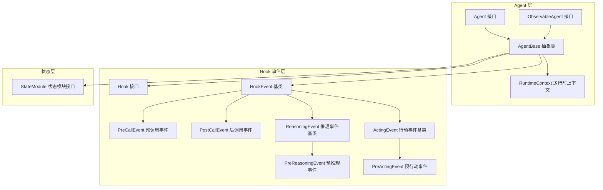
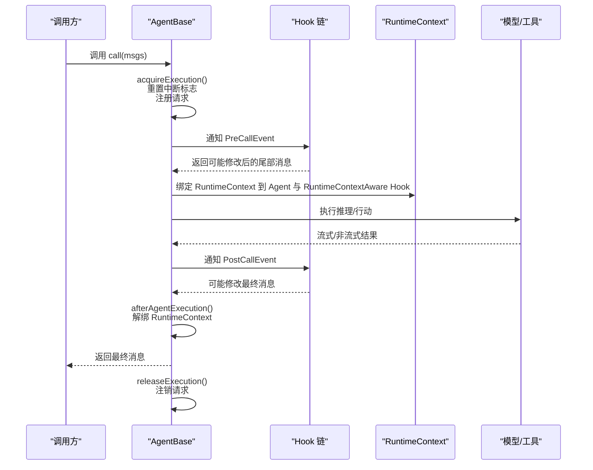
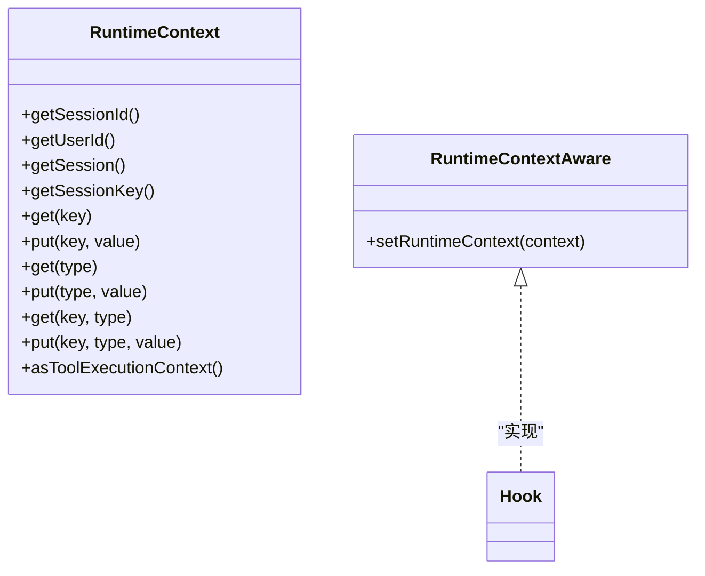
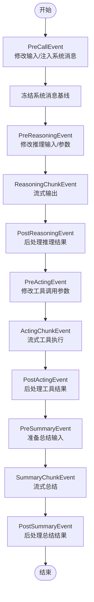
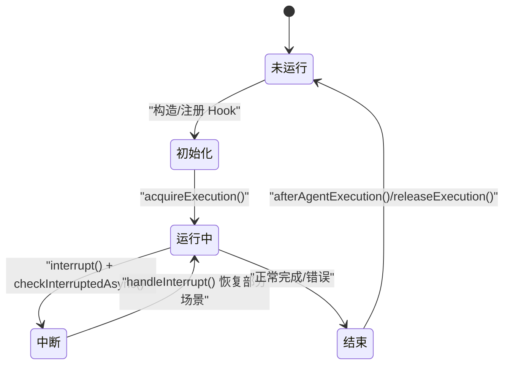
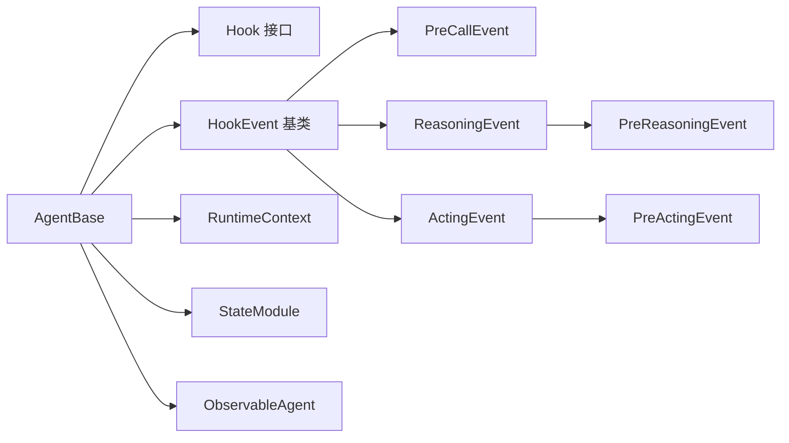

# 智能体生命周期

<cite>
**本文引用的文件**
- [RuntimeContext.java](file://agentscope-core/src/main/java/io/agentscope/core/agent/RuntimeContext.java)
- [Agent.java](file://agentscope-core/src/main/java/io/agentscope/core/agent/Agent.java)
- [AgentBase.java](file://agentscope-core/src/main/java/io/agentscope/core/agent/AgentBase.java)
- [ObservableAgent.java](file://agentscope-core/src/main/java/io/agentscope/core/agent/ObservableAgent.java)
- [StateModule.java](file://agentscope-core/src/main/java/io/agentscope/core/state/StateModule.java)
- [Hook.java](file://agentscope-core/src/main/java/io/agentscope/core/hook/Hook.java)
- [HookEvent.java](file://agentscope-core/src/main/java/io/agentscope/core/hook/HookEvent.java)
- [PreCallEvent.java](file://agentscope-core/src/main/java/io/agentscope/core/hook/PreCallEvent.java)
- [PostCallEvent.java](file://agentscope-core/src/main/java/io/agentscope/core/hook/PostCallEvent.java)
- [ReasoningEvent.java](file://agentscope-core/src/main/java/io/agentscope/core/hook/ReasoningEvent.java)
- [PreReasoningEvent.java](file://agentscope-core/src/main/java/io/agentscope/core/hook/PreReasoningEvent.java)
- [ActingEvent.java](file://agentscope-core/src/main/java/io/agentscope/core/hook/ActingEvent.java)
- [PreActingEvent.java](file://agentscope-core/src/main/java/io/agentscope/core/hook/PreActingEvent.java)
- [RuntimeContextAware.java](file://agentscope-core/src/main/java/io/agentscope/core/hook/RuntimeContextAware.java)
</cite>

## 目录
1. [简介](#简介)
2. [项目结构](#项目结构)
3. [核心组件](#核心组件)
4. [架构总览](#架构总览)
5. [详细组件分析](#详细组件分析)
6. [依赖分析](#依赖分析)
7. [性能考虑](#性能考虑)
8. [故障排查指南](#故障排查指南)
9. [结论](#结论)
10. [附录](#附录)

## 简介
本文件围绕智能体生命周期进行系统化说明，覆盖从创建到销毁的完整流程：初始化、运行、中断（可视为“暂停/恢复”的一种特殊形态）、终止与资源清理。重点阐述 RuntimeContext 的职责与管理方式（上下文数据的传递与持久化边界），事件系统的触发时序（预处理、推理、行动、总结与错误事件），以及状态模块（内存、工具、计划）的保存与恢复策略。同时提供 Hook 插入点与扩展实践，帮助读者在不同阶段安全地注入监控、校验、记录等横切能力。

## 项目结构
AgentScope 的核心位于 agentscope-core 模块，关键目录与职责如下：
- agent：定义智能体接口与基础抽象（Agent、AgentBase、ObservableAgent），以及运行时上下文 RuntimeContext
- hook：统一的 Hook 接口与事件体系（Hook、HookEvent 及其子类）
- state：状态模块接口 StateModule，用于会话级状态的保存与加载
- message、memory、tool、plan、model 等：支撑智能体行为的消息、记忆、工具、规划与模型层

图表来源
- [Agent.java:1-83](file://agentscope-core/src/main/java/io/agentscope/core/agent/Agent.java#L1-L83)
- [AgentBase.java:1-954](file://agentscope-core/src/main/java/io/agentscope/core/agent/AgentBase.java#L1-L954)
- [ObservableAgent.java:1-54](file://agentscope-core/src/main/java/io/agentscope/core/agent/ObservableAgent.java#L1-L54)
- [RuntimeContext.java:1-361](file://agentscope-core/src/main/java/io/agentscope/core/agent/RuntimeContext.java#L1-L361)
- [Hook.java:1-187](file://agentscope-core/src/main/java/io/agentscope/core/hook/Hook.java#L1-L187)
- [HookEvent.java:1-206](file://agentscope-core/src/main/java/io/agentscope/core/hook/HookEvent.java#L1-L206)
- [PreCallEvent.java:1-81](file://agentscope-core/src/main/java/io/agentscope/core/hook/PreCallEvent.java#L1-L81)
- [PostCallEvent.java:1-77](file://agentscope-core/src/main/java/io/agentscope/core/hook/PostCallEvent.java#L1-L77)
- [ReasoningEvent.java:1-83](file://agentscope-core/src/main/java/io/agentscope/core/hook/ReasoningEvent.java#L1-L83)
- [PreReasoningEvent.java:1-117](file://agentscope-core/src/main/java/io/agentscope/core/hook/PreReasoningEvent.java#L1-L117)
- [ActingEvent.java:1-80](file://agentscope-core/src/main/java/io/agentscope/core/hook/ActingEvent.java#L1-L80)
- [PreActingEvent.java:1-71](file://agentscope-core/src/main/java/io/agentscope/core/hook/PreActingEvent.java#L1-L71)
- [StateModule.java:1-121](file://agentscope-core/src/main/java/io/agentscope/core/state/StateModule.java#L1-L121)

章节来源
- [Agent.java:1-83](file://agentscope-core/src/main/java/io/agentscope/core/agent/Agent.java#L1-L83)
- [AgentBase.java:1-954](file://agentscope-core/src/main/java/io/agentscope/core/agent/AgentBase.java#L1-L954)
- [RuntimeContext.java:1-361](file://agentscope-core/src/main/java/io/agentscope/core/agent/RuntimeContext.java#L1-L361)
- [Hook.java:1-187](file://agentscope-core/src/main/java/io/agentscope/core/hook/Hook.java#L1-L187)
- [HookEvent.java:1-206](file://agentscope-core/src/main/java/io/agentscope/core/hook/HookEvent.java#L1-L206)
- [StateModule.java:1-121](file://agentscope-core/src/main/java/io/agentscope/core/state/StateModule.java#L1-L121)

## 核心组件
- Agent 与 AgentBase：定义智能体能力与执行框架，提供 call/observe/stream 等入口，并内置 Hook 通知、中断处理、订阅广播与状态模块集成
- RuntimeContext：单次调用的运行时上下文，承载会话信息、用户信息、会话键、可变属性与工具执行上下文桥接
- Hook 与 HookEvent：统一的事件模型，贯穿预处理、推理、行动、总结与错误阶段，支持修改与只读两类事件
- StateModule：状态持久化接口，配合会话系统实现内存、工具、计划等状态的保存与恢复

章节来源
- [Agent.java:1-83](file://agentscope-core/src/main/java/io/agentscope/core/agent/Agent.java#L1-L83)
- [AgentBase.java:1-954](file://agentscope-core/src/main/java/io/agentscope/core/agent/AgentBase.java#L1-L954)
- [RuntimeContext.java:1-361](file://agentscope-core/src/main/java/io/agentscope/core/agent/RuntimeContext.java#L1-L361)
- [Hook.java:1-187](file://agentscope-core/src/main/java/io/agentscope/core/hook/Hook.java#L1-L187)
- [HookEvent.java:1-206](file://agentscope-core/src/main/java/io/agentscope/core/hook/HookEvent.java#L1-L206)
- [StateModule.java:1-121](file://agentscope-core/src/main/java/io/agentscope/core/state/StateModule.java#L1-L121)

## 架构总览
下图展示了智能体一次调用的生命周期与事件流，以及 RuntimeContext 在其中的绑定与解绑过程。

图表来源
- [AgentBase.java:182-201](file://agentscope-core/src/main/java/io/agentscope/core/agent/AgentBase.java#L182-L201)
- [AgentBase.java:661-720](file://agentscope-core/src/main/java/io/agentscope/core/agent/AgentBase.java#L661-L720)
- [AgentBase.java:729-741](file://agentscope-core/src/main/java/io/agentscope/core/agent/AgentBase.java#L729-L741)
- [AgentBase.java:541-556](file://agentscope-core/src/main/java/io/agentscope/core/agent/AgentBase.java#L541-L556)
- [RuntimeContext.java:222-233](file://agentscope-core/src/main/java/io/agentscope/core/agent/RuntimeContext.java#L222-L233)

章节来源
- [AgentBase.java:182-201](file://agentscope-core/src/main/java/io/agentscope/core/agent/AgentBase.java#L182-L201)
- [AgentBase.java:661-720](file://agentscope-core/src/main/java/io/agentscope/core/agent/AgentBase.java#L661-L720)
- [AgentBase.java:729-741](file://agentscope-core/src/main/java/io/agentscope/core/agent/AgentBase.java#L729-L741)
- [AgentBase.java:541-556](file://agentscope-core/src/main/java/io/agentscope/core/agent/AgentBase.java#L541-L556)
- [RuntimeContext.java:222-233](file://agentscope-core/src/main/java/io/agentscope/core/agent/RuntimeContext.java#L222-L233)

## 详细组件分析

### RuntimeContext：运行时上下文与工具桥接
- 作用与范围
  - 会话级字段：sessionId、userId、Session、SessionKey
  - 属性存储：字符串键值与类型化键值（按类型+键名）两级映射，线程安全并发容器
  - 工具上下文桥接：通过 asToolExecutionContext 将自身与嵌套的 ToolExecutionContext 合并，优先级由高到低依次为：当前 RuntimeContext、ContextStore、嵌套 ToolExecutionContext
- 数据持久化边界
  - 属性为内存态，不参与持久化；持久化应通过 StateModule 与会话系统完成
- 与 Hook 的协作
  - 支持 RuntimeContextAware Hook，在单次调用期间注入/清空 RuntimeContext 引用，便于跨 Hook/工具共享状态

图表来源
- [RuntimeContext.java:34-361](file://agentscope-core/src/main/java/io/agentscope/core/agent/RuntimeContext.java#L34-L361)
- [RuntimeContextAware.java:1-40](file://agentscope-core/src/main/java/io/agentscope/core/hook/RuntimeContextAware.java#L1-L40)

章节来源
- [RuntimeContext.java:34-361](file://agentscope-core/src/main/java/io/agentscope/core/agent/RuntimeContext.java#L34-L361)
- [RuntimeContextAware.java:1-40](file://agentscope-core/src/main/java/io/agentscope/core/hook/RuntimeContextAware.java#L1-L40)

### 事件系统：生命周期事件与触发时机
- 事件类型与职责
  - 预调用事件（PreCallEvent）：在 Agent 开始处理前，允许修改输入消息与注入系统消息
  - 推理事件（PreReasoningEvent/ReasoningChunkEvent/PostReasoningEvent）：围绕 LLM 推理的前后与流式阶段
  - 行动事件（PreActingEvent/ActingChunkEvent/PostActingEvent）：围绕工具调用的前后与流式阶段
  - 总结事件（PreSummaryEvent/SummaryChunkEvent/PostSummaryEvent）：围绕总结生成的前后与流式阶段
  - 错误事件（ErrorEvent）：捕获执行期异常
- 触发顺序与约束
  - 预处理阶段：PreCallEvent → 预推理（PreReasoningEvent）→ 推理流（ReasoningChunkEvent）→ 推理后（PostReasoningEvent）→ 预行动（PreActingEvent）→ 行动流（ActingChunkEvent）→ 行动后（PostActingEvent）→ 总结（Pre/SummaryChunk/Post）
  - 系统消息生命周期：在 PreCallEvent 之前由 sysPrompt 种子生成；PreCallEvent 完成后冻结；每次进入 PreReasoningEvent/PreSummaryEvent 时注入同一基线副本，避免累积
  - 输入消息注入限制：禁止在尾部直接注入 SYSTEM 消息，需使用 setSystemMessage 或 appendSystemContent

图表来源
- [HookEvent.java:44-67](file://agentscope-core/src/main/java/io/agentscope/core/hook/HookEvent.java#L44-L67)
- [PreCallEvent.java:25-43](file://agentscope-core/src/main/java/io/agentscope/core/hook/PreCallEvent.java#L25-L43)
- [ReasoningEvent.java:23-41](file://agentscope-core/src/main/java/io/agentscope/core/hook/ReasoningEvent.java#L23-L41)
- [PreReasoningEvent.java:26-46](file://agentscope-core/src/main/java/io/agentscope/core/hook/PreReasoningEvent.java#L26-L46)
- [ActingEvent.java:23-41](file://agentscope-core/src/main/java/io/agentscope/core/hook/ActingEvent.java#L23-L41)
- [PreActingEvent.java:24-39](file://agentscope-core/src/main/java/io/agentscope/core/hook/PreActingEvent.java#L24-L39)

章节来源
- [HookEvent.java:44-67](file://agentscope-core/src/main/java/io/agentscope/core/hook/HookEvent.java#L44-L67)
- [PreCallEvent.java:25-43](file://agentscope-core/src/main/java/io/agentscope/core/hook/PreCallEvent.java#L25-L43)
- [ReasoningEvent.java:23-41](file://agentscope-core/src/main/java/io/agentscope/core/hook/ReasoningEvent.java#L23-L41)
- [PreReasoningEvent.java:26-46](file://agentscope-core/src/main/java/io/agentscope/core/hook/PreReasoningEvent.java#L26-L46)
- [ActingEvent.java:23-41](file://agentscope-core/src/main/java/io/agentscope/core/hook/ActingEvent.java#L23-L41)
- [PreActingEvent.java:24-39](file://agentscope-core/src/main/java/io/agentscope/core/hook/PreActingEvent.java#L24-L39)

### 智能体生命周期阶段与控制流
- 初始化
  - 构造 AgentBase 时注册系统 Hook，构建钩子列表并排序；初始化中断状态与订阅者映射
- 运行
  - 调用 call(msgs)：acquireExecution() 保证单实例串行执行，重置中断标志，注册请求；通知 PreCallEvent，执行 doCall，通知 PostCallEvent，广播给订阅者
- 中断（暂停/恢复）
  - 外部 interrupt() 设置中断标志；在执行关键检查点调用 checkInterruptedAsync()，抛出 InterruptedException；AgentBase 捕获并调用 handleInterrupt() 生成中断响应
- 终止与资源清理
  - afterAgentExecution()/releaseExecution() 清理运行状态、注销请求；解绑 RuntimeContext；确保资源回收

图表来源
- [AgentBase.java:411-439](file://agentscope-core/src/main/java/io/agentscope/core/agent/AgentBase.java#L411-L439)
- [AgentBase.java:372-389](file://agentscope-core/src/main/java/io/agentscope/core/agent/AgentBase.java#L372-L389)
- [AgentBase.java:449-457](file://agentscope-core/src/main/java/io/agentscope/core/agent/AgentBase.java#L449-L457)

章节来源
- [AgentBase.java:411-439](file://agentscope-core/src/main/java/io/agentscope/core/agent/AgentBase.java#L411-L439)
- [AgentBase.java:372-389](file://agentscope-core/src/main/java/io/agentscope/core/agent/AgentBase.java#L372-L389)
- [AgentBase.java:449-457](file://agentscope-core/src/main/java/io/agentscope/core/agent/AgentBase.java#L449-L457)

### 状态管理：内存、工具、计划的保存与恢复
- StateModule 接口提供 saveTo/loadFrom/loadIfExists 等方法，组件可按需实现状态序列化与反序列化
- 与会话系统结合，使用 Session 与 SessionKey 实现跨进程/重启的状态恢复
- 典型状态模块包括：
  - 内存状态：如 InMemoryMemory、LongTermMemory
  - 工具状态：如 ToolkitState
  - 计划状态：如 PlanNotebookState
- 注意：RuntimeContext 的属性为内存态，不参与持久化；如需跨会话保留，应在 StateModule 中显式保存

章节来源
- [StateModule.java:45-121](file://agentscope-core/src/main/java/io/agentscope/core/state/StateModule.java#L45-L121)

### Hook 扩展点与最佳实践
- Hook 优先级与执行顺序：数值越小优先级越高；同优先级按注册顺序执行
- 修改型事件：PreCallEvent、PreReasoningEvent、PreActingEvent、PostCallEvent 等提供 setter，可在链路中修改输入/参数/结果
- 只读事件：ReasoningChunkEvent、ActingChunkEvent、ErrorEvent 等仅用于观察与记录
- RuntimeContextAware：在单次调用期间注入 RuntimeContext，便于跨 Hook/工具共享上下文
- 动态增删 Hook：支持在运行时动态添加/移除 Hook，注意避免内存泄漏与竞态

章节来源
- [Hook.java:117-187](file://agentscope-core/src/main/java/io/agentscope/core/hook/Hook.java#L117-L187)
- [HookEvent.java:74-206](file://agentscope-core/src/main/java/io/agentscope/core/hook/HookEvent.java#L74-L206)
- [RuntimeContextAware.java:20-40](file://agentscope-core/src/main/java/io/agentscope/core/hook/RuntimeContextAware.java#L20-L40)

## 依赖分析
- AgentBase 依赖
  - Hook 事件链：PreCallEvent → Reasoning/Acting/Summary 链路 → PostCallEvent/错误事件
  - RuntimeContext：作为工具上下文桥接与 RuntimeContextAware 的载体
  - StateModule：状态持久化接口
  - ObservableAgent：观察模式支持
- 事件依赖
  - HookEvent 为密封类，限定事件类型，确保 switch 模式匹配完备性
  - ReasoningEvent/ActingEvent 作为基类，派生具体阶段事件

图表来源
- [AgentBase.java:1-954](file://agentscope-core/src/main/java/io/agentscope/core/agent/AgentBase.java#L1-L954)
- [Hook.java:1-187](file://agentscope-core/src/main/java/io/agentscope/core/hook/Hook.java#L1-L187)
- [HookEvent.java:1-206](file://agentscope-core/src/main/java/io/agentscope/core/hook/HookEvent.java#L1-L206)
- [RuntimeContext.java:1-361](file://agentscope-core/src/main/java/io/agentscope/core/agent/RuntimeContext.java#L1-L361)
- [StateModule.java:1-121](file://agentscope-core/src/main/java/io/agentscope/core/state/StateModule.java#L1-L121)
- [ObservableAgent.java:1-54](file://agentscope-core/src/main/java/io/agentscope/core/agent/ObservableAgent.java#L1-L54)

章节来源
- [AgentBase.java:1-954](file://agentscope-core/src/main/java/io/agentscope/core/agent/AgentBase.java#L1-L954)
- [Hook.java:1-187](file://agentscope-core/src/main/java/io/agentscope/core/hook/Hook.java#L1-L187)
- [HookEvent.java:1-206](file://agentscope-core/src/main/java/io/agentscope/core/hook/HookEvent.java#L1-L206)
- [RuntimeContext.java:1-361](file://agentscope-core/src/main/java/io/agentscope/core/agent/RuntimeContext.java#L1-L361)
- [StateModule.java:1-121](file://agentscope-core/src/main/java/io/agentscope/core/state/StateModule.java#L1-L121)
- [ObservableAgent.java:1-54](file://agentscope-core/src/main/java/io/agentscope/core/agent/ObservableAgent.java#L1-L54)

## 性能考虑
- 单实例串行执行：AgentBase 使用 running 标志防止并发调用，避免锁竞争但限制吞吐
- Hook 排序与数量：Hook 数量与优先级影响整体延迟；建议按需启用，避免冗余 Hook
- 流式事件：ReasoningChunkEvent/ActingChunkEvent/SummaryChunkEvent 为流式输出，注意下游处理的背压与缓冲
- 工具上下文桥接：asToolExecutionContext 合并多层 ContextStore，注意属性规模与查找成本

## 故障排查指南
- 中断异常
  - 症状：执行过程中抛出 InterruptedException
  - 处理：在关键检查点调用 checkInterruptedAsync()；AgentBase 捕获后调用 handleInterrupt() 生成中断响应
- 空消息返回
  - 症状：PostCallEvent 通知时报错提示返回空消息
  - 处理：确保 doCall() 正常生成 Msg；必要时在 Hook 中修正最终消息
- 系统消息注入违规
  - 症状：在尾部注入 SYSTEM 消息导致非法状态异常
  - 处理：使用 setSystemMessage 或 appendSystemContent 注入系统消息
- 资源未释放
  - 症状：长时间运行后资源占用上升
  - 处理：确认 afterAgentExecution()/releaseExecution() 被调用；检查自定义 Hook 是否持有长生命周期引用

章节来源
- [AgentBase.java:449-457](file://agentscope-core/src/main/java/io/agentscope/core/agent/AgentBase.java#L449-L457)
- [AgentBase.java:729-741](file://agentscope-core/src/main/java/io/agentscope/core/agent/AgentBase.java#L729-L741)
- [HookEvent.java:706-716](file://agentscope-core/src/main/java/io/agentscope/core/hook/HookEvent.java#L706-L716)

## 结论
AgentScope 通过统一的 Hook 事件模型与 RuntimeContext 上下文桥接，实现了对智能体生命周期的精细化控制与可观测性。借助 StateModule，开发者可以在会话维度持久化关键状态；通过 Hook 的优先级与动态注册，可在不侵入业务逻辑的前提下扩展监控、校验与记录能力。遵循系统消息注入规范与流式事件处理原则，可有效避免常见陷阱，提升稳定性与可维护性。

## 附录
- 代码示例路径（以路径代替具体代码内容）
  - 监控智能体生命周期：[AgentBase.java:182-201](file://agentscope-core/src/main/java/io/agentscope/core/agent/AgentBase.java#L182-L201)
  - 处理异常与中断：[AgentBase.java:449-457](file://agentscope-core/src/main/java/io/agentscope/core/agent/AgentBase.java#L449-L457)
  - 插入 Hook 扩展功能：[Hook.java:117-187](file://agentscope-core/src/main/java/io/agentscope/core/hook/Hook.java#L117-L187)
  - 系统消息生命周期与注入：[HookEvent.java:44-67](file://agentscope-core/src/main/java/io/agentscope/core/hook/HookEvent.java#L44-L67)
  - 工具上下文桥接与合并：[RuntimeContext.java:222-233](file://agentscope-core/src/main/java/io/agentscope/core/agent/RuntimeContext.java#L222-L233)