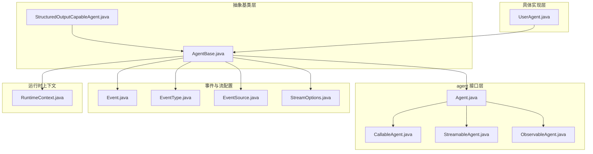
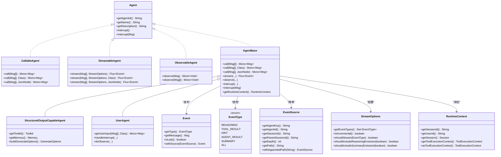
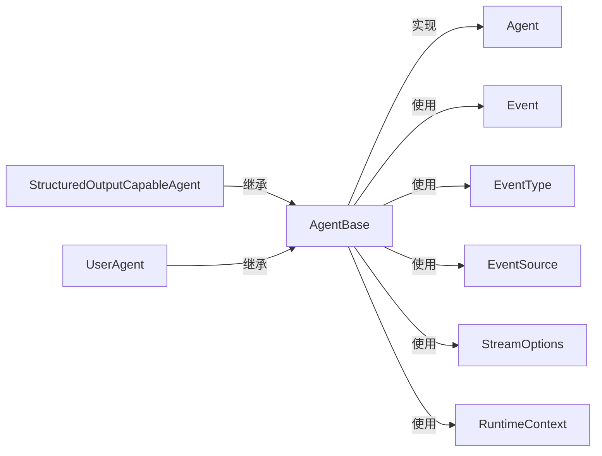

# 智能体类型与继承体系

<cite>
**本文引用的文件**
- [Agent.java](file://agentscope-core/src/main/java/io/agentscope/core/agent/Agent.java)
- [AgentBase.java](file://agentscope-core/src/main/java/io/agentscope/core/agent/AgentBase.java)
- [CallableAgent.java](file://agentscope-core/src/main/java/io/agentscope/core/agent/CallableAgent.java)
- [ObservableAgent.java](file://agentscope-core/src/main/java/io/agentscope/core/agent/ObservableAgent.java)
- [StreamableAgent.java](file://agentscope-core/src/main/java/io/agentscope/core/agent/StreamableAgent.java)
- [StructuredOutputCapableAgent.java](file://agentscope-core/src/main/java/io/agentscope/core/agent/StructuredOutputCapableAgent.java)
- [UserAgent.java](file://agentscope-core/src/main/java/io/agentscope/core/agent/user/UserAgent.java)
- [Event.java](file://agentscope-core/src/main/java/io/agentscope/core/agent/Event.java)
- [EventType.java](file://agentscope-core/src/main/java/io/agentscope/core/agent/EventType.java)
- [EventSource.java](file://agentscope-core/src/main/java/io/agentscope/core/agent/EventSource.java)
- [StreamOptions.java](file://agentscope-core/src/main/java/io/agentscope/core/agent/StreamOptions.java)
- [RuntimeContext.java](file://agentscope-core/src/main/java/io/agentscope/core/agent/RuntimeContext.java)
</cite>

## 目录
1. [引言](#引言)
2. [项目结构](#项目结构)
3. [核心组件](#核心组件)
4. [架构总览](#架构总览)
5. [详细组件分析](#详细组件分析)
6. [依赖分析](#依赖分析)
7. [性能考虑](#性能考虑)
8. [故障排查指南](#故障排查指南)
9. [结论](#结论)
10. [附录](#附录)

## 引言
本文件系统性梳理 AgentScope 框架中的智能体类型与继承体系，围绕以下目标展开：
- 解释 Agent 接口的设计理念与核心职责，明确 call() 方法的定义与返回值规范
- 详解 AgentBase 抽象类提供的通用能力：生命周期管理、Hook 系统集成、中断机制、订阅广播、运行时上下文绑定等
- 阐述不同智能体类型的适用场景：UserAgent 用于用户交互；CallableAgent 支持直接调用；ObservableAgent 提供事件观察能力
- 解释智能体的继承关系与组合模式，以及如何通过装饰器式 Hook 扩展智能体功能
- 提供可定位的代码示例路径，帮助读者快速上手各类智能体的创建与使用

## 项目结构
AgentScope 的智能体相关代码主要位于 agentscope-core 模块的 io.agentscope.core.agent 包中，包含接口、抽象基类、具体实现与配套工具类（事件、流配置、运行时上下文等）。下图给出与本文相关的文件组织概览。

图表来源
- [Agent.java:1-83](file://agentscope-core/src/main/java/io/agentscope/core/agent/Agent.java#L1-L83)
- [AgentBase.java:1-954](file://agentscope-core/src/main/java/io/agentscope/core/agent/AgentBase.java#L1-L954)
- [CallableAgent.java:1-140](file://agentscope-core/src/main/java/io/agentscope/core/agent/CallableAgent.java#L1-L140)
- [StreamableAgent.java:1-153](file://agentscope-core/src/main/java/io/agentscope/core/agent/StreamableAgent.java#L1-L153)
- [ObservableAgent.java:1-54](file://agentscope-core/src/main/java/io/agentscope/core/agent/ObservableAgent.java#L1-L54)
- [StructuredOutputCapableAgent.java:1-374](file://agentscope-core/src/main/java/io/agentscope/core/agent/StructuredOutputCapableAgent.java#L1-L374)
- [UserAgent.java:1-356](file://agentscope-core/src/main/java/io/agentscope/core/agent/user/UserAgent.java#L1-L356)
- [Event.java:1-211](file://agentscope-core/src/main/java/io/agentscope/core/agent/Event.java#L1-L211)
- [EventType.java:1-95](file://agentscope-core/src/main/java/io/agentscope/core/agent/EventType.java#L1-L95)
- [EventSource.java:1-267](file://agentscope-core/src/main/java/io/agentscope/core/agent/EventSource.java#L1-L267)
- [StreamOptions.java:1-371](file://agentscope-core/src/main/java/io/agentscope/core/agent/StreamOptions.java#L1-L371)
- [RuntimeContext.java:1-361](file://agentscope-core/src/main/java/io/agentscope/core/agent/RuntimeContext.java#L1-L361)

章节来源
- [Agent.java:1-83](file://agentscope-core/src/main/java/io/agentscope/core/agent/Agent.java#L1-L83)
- [AgentBase.java:1-954](file://agentscope-core/src/main/java/io/agentscope/core/agent/AgentBase.java#L1-L954)

## 核心组件
本节聚焦于智能体体系的核心契约与基础设施，帮助读者把握“接口-抽象类-具体实现”的分层设计。

- Agent 接口
  - 定义了智能体的完整能力集合：可调用（CallableAgent）、可流式（StreamableAgent）、可观测（ObservableAgent）
  - 规范了标识与描述信息、中断能力（interrupt），并强调内存管理不在核心接口职责范围内
  - 参考路径：[Agent.java:20-83](file://agentscope-core/src/main/java/io/agentscope/core/agent/Agent.java#L20-L83)

- CallableAgent 接口
  - 统一 call() 能力，支持多种入参形式（单消息、列表、带结构化输出约束）
  - 返回值为响应消息（Mono<Msg>），便于链式处理与错误恢复
  - 参考路径：[CallableAgent.java:23-140](file://agentscope-core/src/main/java/io/agentscope/core/agent/CallableAgent.java#L23-L140)

- StreamableAgent 接口
  - 提供 stream() 能力，支持事件流（Flux<Event>）与结构化输出
  - 通过 StreamOptions 控制事件类型过滤与增量/累积模式
  - 参考路径：[StreamableAgent.java:23-153](file://agentscope-core/src/main/java/io/agentscope/core/agent/StreamableAgent.java#L23-L153)，[StreamOptions.java:62-371](file://agentscope-core/src/main/java/io/agentscope/core/agent/StreamOptions.java#L62-L371)

- ObservableAgent 接口
  - 提供 observe() 能力，允许智能体接收消息而不生成回复，常用于多智能体协作
  - 参考路径：[ObservableAgent.java:22-54](file://agentscope-core/src/main/java/io/agentscope/core/agent/ObservableAgent.java#L22-L54)

- AgentBase 抽象类
  - 提供统一的执行生命周期（acquire/release）、Hook 通知（PreCall/PostCall/Error）、中断检查与恢复、订阅广播、运行时上下文绑定等
  - 通过 Mono.using 确保资源回收与清理，保证线程安全与幂等
  - 参考路径：[AgentBase.java:93-954](file://agentscope-core/src/main/java/io/agentscope/core/agent/AgentBase.java#L93-L954)

- StructuredOutputCapableAgent 抽象类
  - 在 AgentBase 基础上，提供结构化输出能力：注册临时工具、注入 StructuredOutputHook、聚合元数据与用量统计
  - 子类需提供 Toolkit、Memory 与 GenerateOptions
  - 参考路径：[StructuredOutputCapableAgent.java:44-374](file://agentscope-core/src/main/java/io/agentscope/core/agent/StructuredOutputCapableAgent.java#L44-L374)

- UserAgent 具体实现
  - 作为用户交互入口，通过可插拔的输入方法收集用户输入并转换为消息
  - 不参与内存管理，支持结构化输入与钩子扩展
  - 参考路径：[UserAgent.java:32-356](file://agentscope-core/src/main/java/io/agentscope/core/agent/user/UserAgent.java#L32-L356)

章节来源
- [Agent.java:20-83](file://agentscope-core/src/main/java/io/agentscope/core/agent/Agent.java#L20-L83)
- [CallableAgent.java:23-140](file://agentscope-core/src/main/java/io/agentscope/core/agent/CallableAgent.java#L23-L140)
- [StreamableAgent.java:23-153](file://agentscope-core/src/main/java/io/agentscope/core/agent/StreamableAgent.java#L23-L153)
- [ObservableAgent.java:22-54](file://agentscope-core/src/main/java/io/agentscope/core/agent/ObservableAgent.java#L22-L54)
- [AgentBase.java:93-954](file://agentscope-core/src/main/java/io/agentscope/core/agent/AgentBase.java#L93-L954)
- [StructuredOutputCapableAgent.java:44-374](file://agentscope-core/src/main/java/io/agentscope/core/agent/StructuredOutputCapableAgent.java#L44-L374)
- [UserAgent.java:32-356](file://agentscope-core/src/main/java/io/agentscope/core/agent/user/UserAgent.java#L32-L356)

## 架构总览
下图展示了智能体接口、抽象基类与具体实现之间的继承与组合关系，以及事件流与 Hook 的集成位置。

图表来源
- [Agent.java:20-83](file://agentscope-core/src/main/java/io/agentscope/core/agent/Agent.java#L20-L83)
- [AgentBase.java:93-954](file://agentscope-core/src/main/java/io/agentscope/core/agent/AgentBase.java#L93-L954)
- [StructuredOutputCapableAgent.java:65-374](file://agentscope-core/src/main/java/io/agentscope/core/agent/StructuredOutputCapableAgent.java#L65-L374)
- [UserAgent.java:68-356](file://agentscope-core/src/main/java/io/agentscope/core/agent/user/UserAgent.java#L68-L356)
- [Event.java:49-211](file://agentscope-core/src/main/java/io/agentscope/core/agent/Event.java#L49-L211)
- [EventType.java:24-95](file://agentscope-core/src/main/java/io/agentscope/core/agent/EventType.java#L24-L95)
- [EventSource.java:106-267](file://agentscope-core/src/main/java/io/agentscope/core/agent/EventSource.java#L106-L267)
- [StreamOptions.java:62-371](file://agentscope-core/src/main/java/io/agentscope/core/agent/StreamOptions.java#L62-L371)
- [RuntimeContext.java:34-361](file://agentscope-core/src/main/java/io/agentscope/core/agent/RuntimeContext.java#L34-L361)

## 详细组件分析

### Agent 接口与 call() 方法规范
- 设计理念
  - 将“可调用”“可流式”“可观测”三大能力聚合为单一契约，避免碎片化接口
  - 明确内存管理不属于核心接口职责，由具体实现（如 ReActAgent）承担
- call() 方法族
  - 单消息/多消息/带结构化输出（类或 JSON Schema）三种重载
  - 返回值为 Mono<Msg>，表示异步响应；结构化输出结果会写入消息元数据
- 中断语义
  - 提供 interrupt() 与 interrupt(Msg) 两种中断方式，用于外部触发与携带用户消息
- 示例路径
  - [Agent.java:41-82](file://agentscope-core/src/main/java/io/agentscope/core/agent/Agent.java#L41-L82)
  - [CallableAgent.java:114-138](file://agentscope-core/src/main/java/io/agentscope/core/agent/CallableAgent.java#L114-L138)

章节来源
- [Agent.java:20-83](file://agentscope-core/src/main/java/io/agentscope/core/agent/Agent.java#L20-L83)
- [CallableAgent.java:23-140](file://agentscope-core/src/main/java/io/agentscope/core/agent/CallableAgent.java#L23-L140)

### AgentBase 生命周期与 Hook 集成
- 生命周期管理
  - 使用 Mono.using(acquire, doCall, release) 确保资源获取与释放
  - 运行状态原子标记，防止并发调用；优雅停机钩子参与请求登记与注销
- Hook 通知链
  - PreCall → doCall → PostCall → 错误处理（ErrorEvent）
  - 支持动态增删 Hook，按优先级排序，运行时上下文感知 Hook 自动绑定
- 中断机制
  - 外部 interrupt() 设置标志位；内部 checkInterruptedAsync() 在 Mono 链路中传播 InterruptedException
  - handleInterrupt() 由子类实现，负责中断后的恢复消息构造
- 订阅广播
  - 支持 MsgHub 订阅者管理，call() 结束后自动广播最终消息
- 示例路径
  - [AgentBase.java:182-201](file://agentscope-core/src/main/java/io/agentscope/core/agent/AgentBase.java#L182-L201)
  - [AgentBase.java:661-720](file://agentscope-core/src/main/java/io/agentscope/core/agent/AgentBase.java#L661-L720)
  - [AgentBase.java:729-741](file://agentscope-core/src/main/java/io/agentscope/core/agent/AgentBase.java#L729-L741)
  - [AgentBase.java:316-345](file://agentscope-core/src/main/java/io/agentscope/core/agent/AgentBase.java#L316-L345)
  - [AgentBase.java:372-379](file://agentscope-core/src/main/java/io/agentscope/core/agent/AgentBase.java#L372-L379)

章节来源
- [AgentBase.java:93-954](file://agentscope-core/src/main/java/io/agentscope/core/agent/AgentBase.java#L93-L954)

### StructuredOutputCapableAgent：结构化输出能力
- 能力概述
  - 注册临时工具 generate_response，结合 StructuredOutputHook 控制流
  - 参数校验：仅允许二选一（类或 JSON Schema）
  - 结果提取与元数据合并（用量、思考内容等）
- 使用要点
  - 子类必须提供 Toolkit、Memory 与 GenerateOptions
  - 流程结束后自动移除 Hook 与工具，避免泄漏
- 示例路径
  - [StructuredOutputCapableAgent.java:126-197](file://agentscope-core/src/main/java/io/agentscope/core/agent/StructuredOutputCapableAgent.java#L126-L197)
  - [StructuredOutputCapableAgent.java:202-280](file://agentscope-core/src/main/java/io/agentscope/core/agent/StructuredOutputCapableAgent.java#L202-L280)
  - [StructuredOutputCapableAgent.java:305-355](file://agentscope-core/src/main/java/io/agentscope/core/agent/StructuredOutputCapableAgent.java#L305-L355)

章节来源
- [StructuredOutputCapableAgent.java:44-374](file://agentscope-core/src/main/java/io/agentscope/core/agent/StructuredOutputCapableAgent.java#L44-L374)

### UserAgent：用户交互智能体
- 能力概述
  - 通过可插拔输入方法（默认控制台）收集用户输入，转换为消息
  - 支持结构化输入与钩子扩展；不参与内存管理
- 典型用法
  - builder().name("User").build() 创建实例
  - call()/getUserInput() 获取用户输入
- 示例路径
  - [UserAgent.java:68-134](file://agentscope-core/src/main/java/io/agentscope/core/agent/user/UserAgent.java#L68-L134)
  - [UserAgent.java:259-269](file://agentscope-core/src/main/java/io/agentscope/core/agent/user/UserAgent.java#L259-L269)

章节来源
- [UserAgent.java:32-356](file://agentscope-core/src/main/java/io/agentscope/core/agent/user/UserAgent.java#L32-L356)

### 事件模型与流配置
- 事件类型（EventType）
  - REASONING、TOOL_RESULT、HINT、AGENT_RESULT、SUMMARY、ALL
  - 通过 isLast() 区分中间片段与最终消息
- 事件源（EventSource）
  - 标识子智能体来源，支持路径与深度追踪
- 流配置（StreamOptions）
  - 控制事件类型集合、增量/累积模式、推理/摘要片段包含策略
- 示例路径
  - [EventType.java:24-95](file://agentscope-core/src/main/java/io/agentscope/core/agent/EventType.java#L24-L95)
  - [Event.java:49-211](file://agentscope-core/src/main/java/io/agentscope/core/agent/Event.java#L49-L211)
  - [EventSource.java:106-267](file://agentscope-core/src/main/java/io/agentscope/core/agent/EventSource.java#L106-L267)
  - [StreamOptions.java:62-371](file://agentscope-core/src/main/java/io/agentscope/core/agent/StreamOptions.java#L62-L371)

章节来源
- [EventType.java:1-95](file://agentscope-core/src/main/java/io/agentscope/core/agent/EventType.java#L1-L95)
- [Event.java:1-211](file://agentscope-core/src/main/java/io/agentscope/core/agent/Event.java#L1-L211)
- [EventSource.java:1-267](file://agentscope-core/src/main/java/io/agentscope/core/agent/EventSource.java#L1-L267)
- [StreamOptions.java:1-371](file://agentscope-core/src/main/java/io/agentscope/core/agent/StreamOptions.java#L1-L371)

### 运行时上下文（RuntimeContext）
- 职责
  - 一次调用内的会话级元数据与属性存储，支持字符串键与类型化键访问
  - 与工具执行上下文桥接，便于在工具栈中读取运行时数据
- 关键点
  - 属性非持久化，仅在 call 生命周期内有效
  - 支持 Typed/字符串双层存取，避免类型不匹配
- 示例路径
  - [RuntimeContext.java:34-361](file://agentscope-core/src/main/java/io/agentscope/core/agent/RuntimeContext.java#L34-L361)

章节来源
- [RuntimeContext.java:1-361](file://agentscope-core/src/main/java/io/agentscope/core/agent/RuntimeContext.java#L1-L361)

## 依赖分析
- 继承关系
  - AgentBase 实现 Agent 并扩展生命周期、Hook、中断、订阅与运行时上下文
  - StructuredOutputCapableAgent 继承 AgentBase，叠加结构化输出能力
  - UserAgent 继承 AgentBase，实现用户输入采集
- 组合关系
  - AgentBase 与 Event/EventType/EventSource/StreamOptions/RuntimeContext 紧密耦合，共同构成事件驱动与流式执行框架
- 外部依赖
  - Reactor（Mono/Flux）用于响应式编程
  - Jackson（JsonNode/JsonSchemaUtils）用于结构化输出与元数据处理
- 示例路径
  - [AgentBase.java:93-954](file://agentscope-core/src/main/java/io/agentscope/core/agent/AgentBase.java#L93-L954)
  - [StructuredOutputCapableAgent.java:65-374](file://agentscope-core/src/main/java/io/agentscope/core/agent/StructuredOutputCapableAgent.java#L65-L374)
  - [UserAgent.java:68-356](file://agentscope-core/src/main/java/io/agentscope/core/agent/user/UserAgent.java#L68-L356)

图表来源
- [Agent.java:20-83](file://agentscope-core/src/main/java/io/agentscope/core/agent/Agent.java#L20-L83)
- [AgentBase.java:93-954](file://agentscope-core/src/main/java/io/agentscope/core/agent/AgentBase.java#L93-L954)
- [StructuredOutputCapableAgent.java:65-374](file://agentscope-core/src/main/java/io/agentscope/core/agent/StructuredOutputCapableAgent.java#L65-L374)
- [UserAgent.java:68-356](file://agentscope-core/src/main/java/io/agentscope/core/agent/user/UserAgent.java#L68-L356)
- [Event.java:49-211](file://agentscope-core/src/main/java/io/agentscope/core/agent/Event.java#L49-L211)
- [EventType.java:24-95](file://agentscope-core/src/main/java/io/agentscope/core/agent/EventType.java#L24-L95)
- [EventSource.java:106-267](file://agentscope-core/src/main/java/io/agentscope/core/agent/EventSource.java#L106-L267)
- [StreamOptions.java:62-371](file://agentscope-core/src/main/java/io/agentscope/core/agent/StreamOptions.java#L62-L371)
- [RuntimeContext.java:34-361](file://agentscope-core/src/main/java/io/agentscope/core/agent/RuntimeContext.java#L34-L361)

## 性能考虑
- 响应式执行
  - 使用 Mono.using 确保资源回收，避免阻塞主线程
  - Hook 顺序与数量影响整体延迟，建议按需添加与排序
- 中断与取消
  - checkInterruptedAsync() 在关键检查点抛出异常，减少无效计算
  - 取消订阅不会触发中断，需显式调用 interrupt()
- 流式输出
  - 合理设置 StreamOptions，避免过多中间片段导致 UI 或下游处理压力
- 内存与状态
  - 内存管理交由具体实现（如 ReActAgent），避免在 AgentBase 中引入额外负担

## 故障排查指南
- 常见问题
  - 并发调用异常：AgentBase 默认不支持并发执行，确保单实例串行调用
  - 中断未生效：确认在合适的位置调用 checkInterruptedAsync()，并在 Mono 链中传播
  - Hook 注入错误：PreCall 钩子不得向尾部注入 SYSTEM 类型消息（ReActAgent 限制）
  - 结构化输出失败：确保仅提供类或 JSON Schema 其一，且参数校验通过
- 定位手段
  - 利用 ErrorEvent 与日志，查看 Hook 链路中的异常
  - 使用 RuntimeContext 记录关键中间态，辅助调试
- 示例路径
  - [AgentBase.java:449-457](file://agentscope-core/src/main/java/io/agentscope/core/agent/AgentBase.java#L449-L457)
  - [AgentBase.java:706-716](file://agentscope-core/src/main/java/io/agentscope/core/agent/AgentBase.java#L706-L716)
  - [StructuredOutputCapableAgent.java:142-151](file://agentscope-core/src/main/java/io/agentscope/core/agent/StructuredOutputCapableAgent.java#L142-L151)

章节来源
- [AgentBase.java:449-457](file://agentscope-core/src/main/java/io/agentscope/core/agent/AgentBase.java#L449-L457)
- [AgentBase.java:706-716](file://agentscope-core/src/main/java/io/agentscope/core/agent/AgentBase.java#L706-L716)
- [StructuredOutputCapableAgent.java:142-151](file://agentscope-core/src/main/java/io/agentscope/core/agent/StructuredOutputCapableAgent.java#L142-L151)

## 结论
AgentScope 的智能体体系以清晰的接口分层与强大的抽象基类为核心，既保证了通用能力的一致性，又允许通过 Hook 与组合模式灵活扩展。UserAgent、StructuredOutputCapableAgent 与 AgentBase 分别覆盖了用户交互、结构化输出与基础设施三类关键场景，形成从契约到实现的完整闭环。

## 附录
- 快速上手示例（路径指引）
  - 创建并使用 UserAgent
    - [UserAgent.java:88-90](file://agentscope-core/src/main/java/io/agentscope/core/agent/user/UserAgent.java#L88-L90)
    - [UserAgent.java:348-353](file://agentscope-core/src/main/java/io/agentscope/core/agent/user/UserAgent.java#L348-L353)
  - 调用智能体（基础与结构化输出）
    - [CallableAgent.java:114-138](file://agentscope-core/src/main/java/io/agentscope/core/agent/CallableAgent.java#L114-L138)
    - [StructuredOutputCapableAgent.java:126-134](file://agentscope-core/src/main/java/io/agentscope/core/agent/StructuredOutputCapableAgent.java#L126-L134)
  - 流式执行与事件过滤
    - [StreamableAgent.java:131-151](file://agentscope-core/src/main/java/io/agentscope/core/agent/StreamableAgent.java#L131-L151)
    - [StreamOptions.java:274-277](file://agentscope-core/src/main/java/io/agentscope/core/agent/StreamOptions.java#L274-L277)
  - 订阅与广播
    - [AgentBase.java:761-796](file://agentscope-core/src/main/java/io/agentscope/core/agent/AgentBase.java#L761-L796)
  - 中断与恢复
    - [AgentBase.java:316-345](file://agentscope-core/src/main/java/io/agentscope/core/agent/AgentBase.java#L316-L345)
    - [AgentBase.java:514](file://agentscope-core/src/main/java/io/agentscope/core/agent/AgentBase.java#L514)