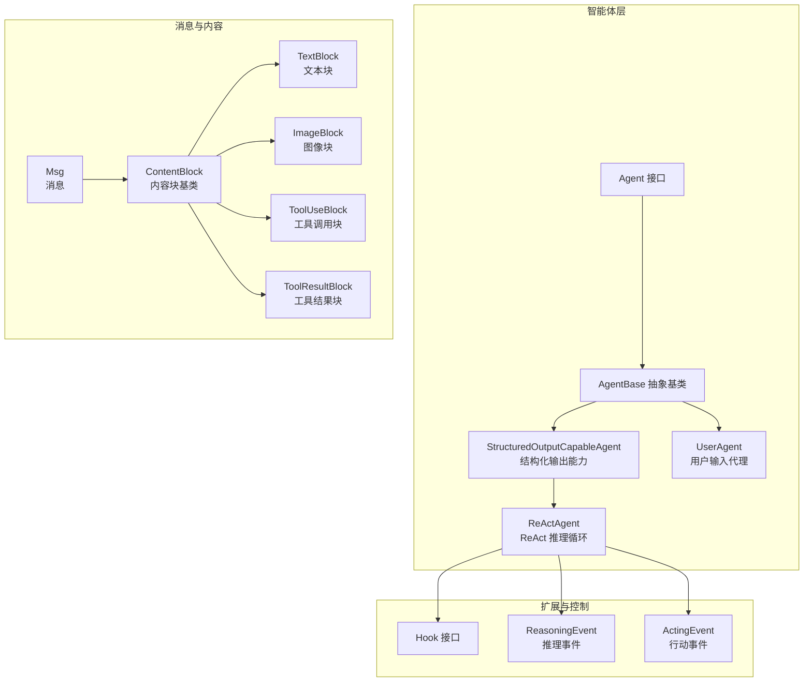
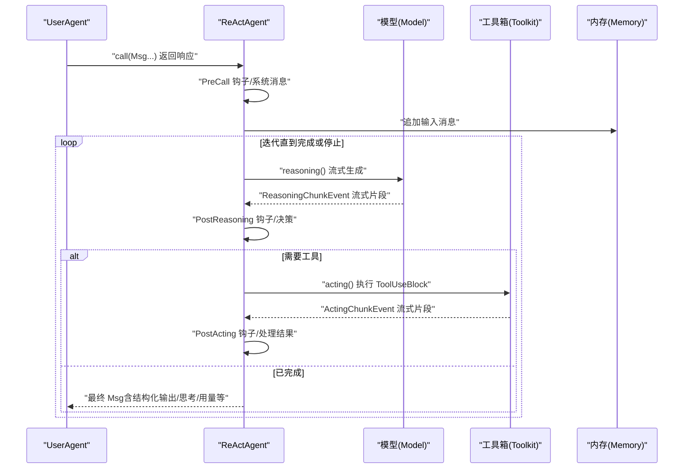
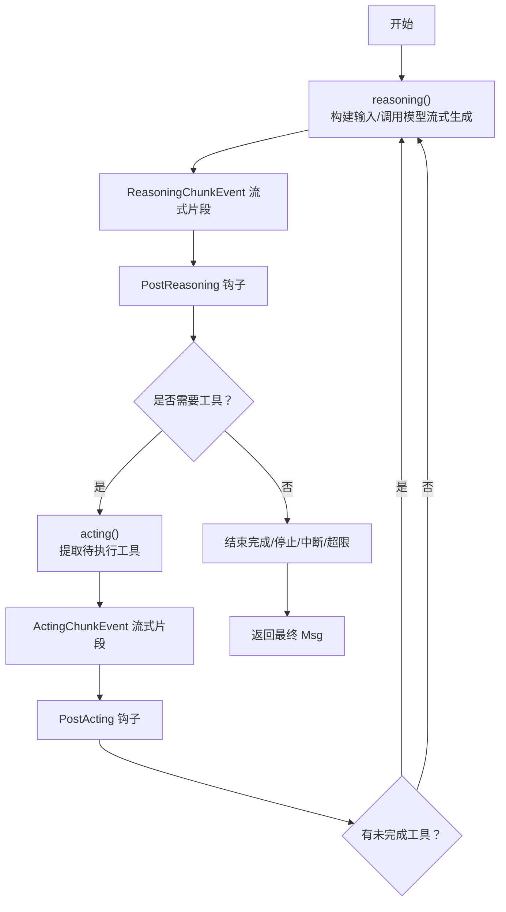
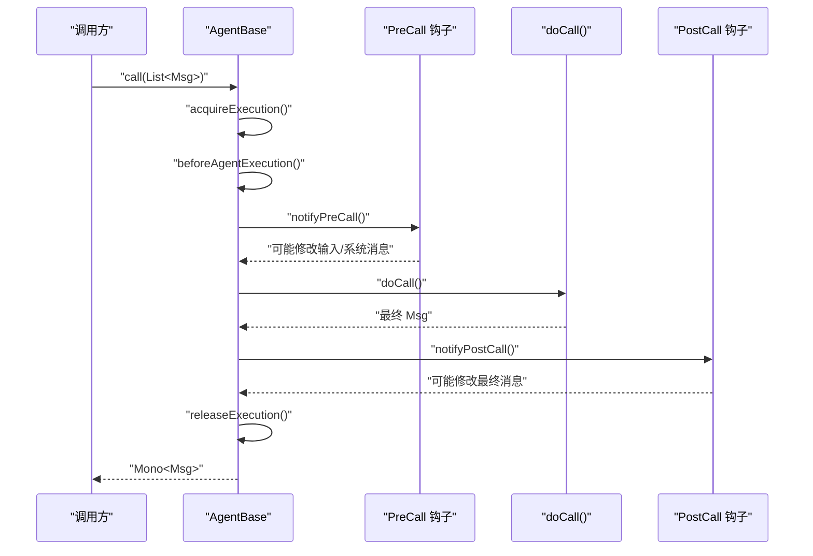
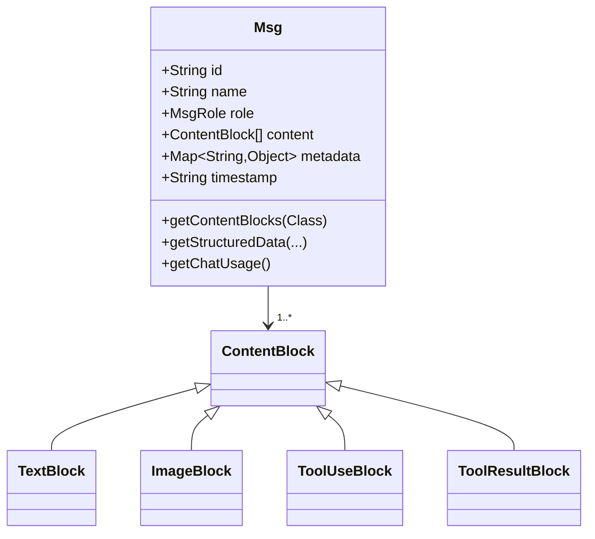
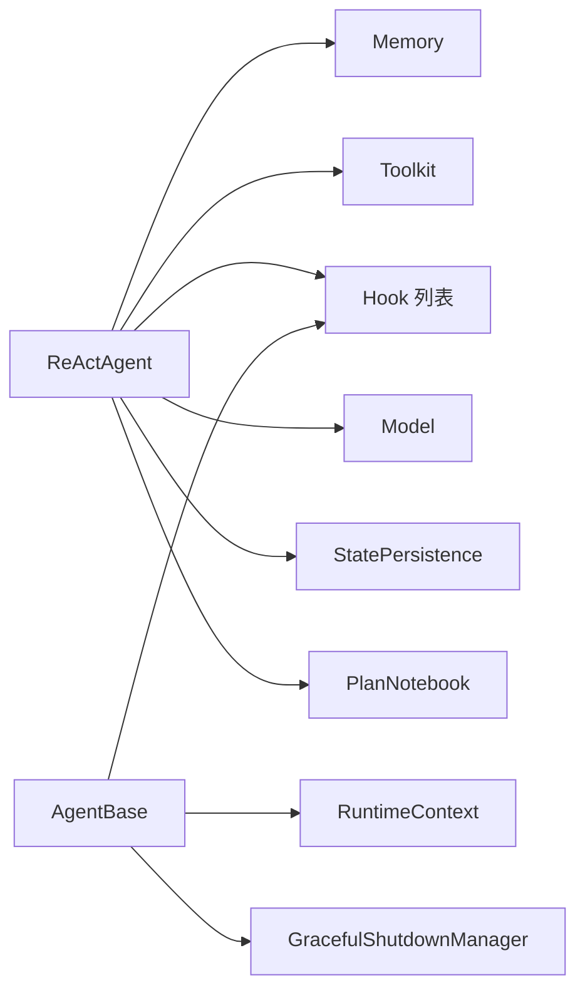

# 核心概念

<cite>
**本文引用的文件**   
- [ReActAgent.java](file://agentscope-core/src/main/java/io/agentscope/core/ReActAgent.java)
- [Agent.java](file://agentscope-core/src/main/java/io/agentscope/core/agent/Agent.java)
- [AgentBase.java](file://agentscope-core/src/main/java/io/agentscope/core/agent/AgentBase.java)
- [StructuredOutputCapableAgent.java](file://agentscope-core/src/main/java/io/agentscope/core/agent/StructuredOutputCapableAgent.java)
- [UserAgent.java](file://agentscope-core/src/main/java/io/agentscope/core/agent/user/UserAgent.java)
- [Msg.java](file://agentscope-core/src/main/java/io/agentscope/core/message/Msg.java)
- [ContentBlock.java](file://agentscope-core/src/main/java/io/agentscope/core/message/ContentBlock.java)
- [TextBlock.java](file://agentscope-core/src/main/java/io/agentscope/core/message/TextBlock.java)
- [ImageBlock.java](file://agentscope-core/src/main/java/io/agentscope/core/message/ImageBlock.java)
- [ToolUseBlock.java](file://agentscope-core/src/main/java/io/agentscope/core/message/ToolUseBlock.java)
- [ToolResultBlock.java](file://agentscope-core/src/main/java/io/agentscope/core/message/ToolResultBlock.java)
- [Hook.java](file://agentscope-core/src/main/java/io/agentscope/core/hook/Hook.java)
- [ReasoningEvent.java](file://agentscope-core/src/main/java/io/agentscope/core/hook/ReasoningEvent.java)
- [ActingEvent.java](file://agentscope-core/src/main/java/io/agentscope/core/hook/ActingEvent.java)
</cite>

## 目录
1. [引言](#引言)
2. [项目结构](#项目结构)
3. [核心组件](#核心组件)
4. [架构总览](#架构总览)
5. [详细组件分析](#详细组件分析)
6. [依赖关系分析](#依赖关系分析)
7. [性能考量](#性能考量)
8. [故障排查指南](#故障排查指南)
9. [结论](#结论)

## 引言
本文件面向希望在 AgentScope Java 中构建与使用智能体的开发者，系统性阐述 ReAct 推理范式的核心思想与实现机制，详解智能体生命周期、消息传递与响应式编程基础，并对 Agent、ReActAgent、UserAgent 等核心类进行设计解读。同时，我们将深入解析消息对象 Msg 及其内容块（ContentBlock）体系，覆盖文本、图像、工具调用与结果等多模态内容，帮助读者从理论到实践全面掌握 AgentScope 的关键概念。

## 项目结构
AgentScope Java 将“智能体”“消息”“钩子（Hook）”“工具（Tool）”“模型（Model）”“内存（Memory）”等能力模块化组织。ReActAgent 作为核心执行器，结合 StructuredOutputCapableAgent 提供结构化输出能力；UserAgent 负责用户输入桥接；Msg/ContentBlock 定义统一的消息与内容模型；Hook 提供可插拔的事件拦截与扩展点。

图示来源
- [Agent.java:41-82](file://agentscope-core/src/main/java/io/agentscope/core/agent/Agent.java#L41-L82)
- [AgentBase.java:93-156](file://agentscope-core/src/main/java/io/agentscope/core/agent/AgentBase.java#L93-L156)
- [StructuredOutputCapableAgent.java:65-103](file://agentscope-core/src/main/java/io/agentscope/core/agent/StructuredOutputCapableAgent.java#L65-L103)
- [ReActAgent.java:140-194](file://agentscope-core/src/main/java/io/agentscope/core/ReActAgent.java#L140-L194)
- [UserAgent.java:68-81](file://agentscope-core/src/main/java/io/agentscope/core/agent/user/UserAgent.java#L68-L81)
- [Msg.java:53-110](file://agentscope-core/src/main/java/io/agentscope/core/message/Msg.java#L53-L110)
- [ContentBlock.java:54-61](file://agentscope-core/src/main/java/io/agentscope/core/message/ContentBlock.java#L54-L61)
- [Hook.java:117-186](file://agentscope-core/src/main/java/io/agentscope/core/hook/Hook.java#L117-L186)
- [ReasoningEvent.java:42-82](file://agentscope-core/src/main/java/io/agentscope/core/hook/ReasoningEvent.java#L42-L82)
- [ActingEvent.java:42-79](file://agentscope-core/src/main/java/io/agentscope/core/hook/ActingEvent.java#L42-L79)

章节来源
- [Agent.java:20-82](file://agentscope-core/src/main/java/io/agentscope/core/agent/Agent.java#L20-L82)
- [AgentBase.java:49-92](file://agentscope-core/src/main/java/io/agentscope/core/agent/AgentBase.java#L49-L92)

## 核心组件
- 智能体接口与基类
  - Agent：统一定义可调用、可流式、可观测的能力边界。
  - AgentBase：提供钩子集成、订阅管理、中断处理、状态持久化等基础设施。
  - StructuredOutputCapableAgent：为支持结构化输出的智能体提供通用工具注册、模式校验与元数据合并能力。
- ReActAgent：实现 ReAct 推理-行动循环，具备记忆、工具执行、钩子通知、人类在环（HITL）等特性。
- UserAgent：负责收集用户输入，转换为 Msg 并参与会话或 Hub 分发。
- 消息与内容块
  - Msg：统一的消息载体，包含角色、内容块列表、元数据与时间戳。
  - ContentBlock 及其实现：TextBlock、ImageBlock、ToolUseBlock、ToolResultBlock 等，支持多模态内容表达。
- 钩子与事件
  - Hook：统一事件入口，按优先级顺序执行，可修改事件或注入工具。
  - ReasoningEvent/ActingEvent：推理与行动阶段的事件抽象，贯穿 ReAct 循环。

章节来源
- [Agent.java:20-82](file://agentscope-core/src/main/java/io/agentscope/core/agent/Agent.java#L20-L82)
- [AgentBase.java:93-156](file://agentscope-core/src/main/java/io/agentscope/core/agent/AgentBase.java#L93-L156)
- [StructuredOutputCapableAgent.java:65-123](file://agentscope-core/src/main/java/io/agentscope/core/agent/StructuredOutputCapableAgent.java#L65-L123)
- [ReActAgent.java:140-194](file://agentscope-core/src/main/java/io/agentscope/core/ReActAgent.java#L140-L194)
- [UserAgent.java:68-81](file://agentscope-core/src/main/java/io/agentscope/core/agent/user/UserAgent.java#L68-L81)
- [Msg.java:53-110](file://agentscope-core/src/main/java/io/agentscope/core/message/Msg.java#L53-L110)
- [ContentBlock.java:54-61](file://agentscope-core/src/main/java/io/agentscope/core/message/ContentBlock.java#L54-L61)
- [Hook.java:117-186](file://agentscope-core/src/main/java/io/agentscope/core/hook/Hook.java#L117-L186)

## 架构总览
ReActAgent 将“推理（Reasoning）—行动（Acting）”循环以响应式方式串联，借助 Hook 在关键节点注入行为，通过 Msg/ContentBlock 统一承载多模态内容，配合 Memory 实现上下文累积与恢复。

图示来源
- [ReActAgent.java:560-650](file://agentscope-core/src/main/java/io/agentscope/core/ReActAgent.java#L560-L650)
- [AgentBase.java:661-741](file://agentscope-core/src/main/java/io/agentscope/core/agent/AgentBase.java#L661-L741)
- [Hook.java:147-147](file://agentscope-core/src/main/java/io/agentscope/core/hook/Hook.java#L147-L147)

## 详细组件分析

### ReAct 推理范式与 ReActAgent
- 核心思想
  - ReAct 将“推理（思考+计划）”与“行动（工具调用）”交替进行，直至任务完成或达到最大迭代次数。
  - 响应式流式执行：使用 Project Reactor 在每个阶段产生增量消息，便于 Hook 观察与干预。
- 关键流程
  - reasoning：构建输入、调用模型流式生成、累积片段、触发 ReasoningChunkEvent、根据 PostReasoning 决策是否继续 acting 或结束。
  - acting：提取待执行工具（无对应 ToolResult 的 ToolUseBlock）、执行工具、分发 ActingChunkEvent、处理成功/挂起结果、决定是否继续下一轮。
  - 结束条件：完成（isFinished）、HITL 停止、中断、最大迭代。
- 设计要点
  - 支持结构化输出：通过 StructuredOutputCapableAgent 注入 generate_response 工具与 StructuredOutputHook 控制流。
  - 记忆与状态：通过 Memory 累积消息；通过 StatePersistence 与 Session 支持保存/加载。
  - 钩子系统：Pre/Post Reasoning/Acting/Call/Error 等事件贯穿全流程，支持人类在环与可观测性。

图示来源
- [ReActAgent.java:560-650](file://agentscope-core/src/main/java/io/agentscope/core/ReActAgent.java#L560-L650)
- [ReActAgent.java:669-731](file://agentscope-core/src/main/java/io/agentscope/core/ReActAgent.java#L669-L731)
- [ReasoningEvent.java:42-82](file://agentscope-core/src/main/java/io/agentscope/core/hook/ReasoningEvent.java#L42-L82)
- [ActingEvent.java:42-79](file://agentscope-core/src/main/java/io/agentscope/core/hook/ActingEvent.java#L42-L79)

章节来源
- [ReActAgent.java:93-139](file://agentscope-core/src/main/java/io/agentscope/core/ReActAgent.java#L93-L139)
- [ReActAgent.java:546-650](file://agentscope-core/src/main/java/io/agentscope/core/ReActAgent.java#L546-L650)
- [ReActAgent.java:669-731](file://agentscope-core/src/main/java/io/agentscope/core/ReActAgent.java#L669-L731)
- [StructuredOutputCapableAgent.java:126-197](file://agentscope-core/src/main/java/io/agentscope/core/agent/StructuredOutputCapableAgent.java#L126-L197)

### 智能体生命周期与响应式编程
- 生命周期
  - call() 入口：acquireExecution → beforeAgentExecution → PreCall 钩子 → doCall → PostCall 钩子 → releaseExecution。
  - 中断：checkInterruptedAsync 在关键检查点抛出 InterruptedException，由 createErrorHandler 统一处理为 handleInterrupt。
  - 观察：doObserve 支持接收但不回复的消息，用于协作或多智能体广播。
- 响应式基础
  - 使用 Mono/Flux 表达非阻塞、可组合的异步流程；在 ReActAgent 中贯穿 reasoning/acting/工具执行。
  - 钩子链：Hook 按优先级顺序执行，支持修改事件与注入工具，形成可插拔控制面。

图示来源
- [AgentBase.java:182-201](file://agentscope-core/src/main/java/io/agentscope/core/agent/AgentBase.java#L182-L201)
- [AgentBase.java:661-741](file://agentscope-core/src/main/java/io/agentscope/core/agent/AgentBase.java#L661-L741)

章节来源
- [AgentBase.java:182-201](file://agentscope-core/src/main/java/io/agentscope/core/agent/AgentBase.java#L182-L201)
- [AgentBase.java:372-379](file://agentscope-core/src/main/java/io/agentscope/core/agent/AgentBase.java#L372-L379)
- [AgentBase.java:494-514](file://agentscope-core/src/main/java/io/agentscope/core/agent/AgentBase.java#L494-L514)

### 消息与内容块：Msg 与 ContentBlock 体系
- Msg
  - 角色（用户/助手/系统/工具）、内容块列表、元数据、时间戳；支持结构化数据提取与用量统计查询。
  - 提供 Builder 与多种便捷构造方法，保证不可变性与线程安全。
- ContentBlock 及其子类
  - TextBlock：纯文本内容。
  - ImageBlock：支持 URL/Base64 源与像素阈值配置。
  - ToolUseBlock：工具调用请求，包含 id/name/input/content/metadata。
  - ToolResultBlock：工具执行结果，支持 suspended 标记与错误包装。
- 多模态与类型安全
  - 通过 ContentBlock 多态序列化/反序列化，Jackson 基于 type 字段识别具体类型。
  - Msg 提供类型安全的过滤与提取方法，避免运行时类型判断。

图示来源
- [Msg.java:53-110](file://agentscope-core/src/main/java/io/agentscope/core/message/Msg.java#L53-L110)
- [ContentBlock.java:54-61](file://agentscope-core/src/main/java/io/agentscope/core/message/ContentBlock.java#L54-L61)
- [TextBlock.java:31-96](file://agentscope-core/src/main/java/io/agentscope/core/message/TextBlock.java#L31-L96)
- [ImageBlock.java:37-164](file://agentscope-core/src/main/java/io/agentscope/core/message/ImageBlock.java#L37-L164)
- [ToolUseBlock.java:34-234](file://agentscope-core/src/main/java/io/agentscope/core/message/ToolUseBlock.java#L34-L234)
- [ToolResultBlock.java:35-375](file://agentscope-core/src/main/java/io/agentscope/core/message/ToolResultBlock.java#L35-L375)

章节来源
- [Msg.java:175-291](file://agentscope-core/src/main/java/io/agentscope/core/message/Msg.java#L175-L291)
- [ContentBlock.java:22-61](file://agentscope-core/src/main/java/io/agentscope/core/message/ContentBlock.java#L22-L61)
- [TextBlock.java:21-96](file://agentscope-core/src/main/java/io/agentscope/core/message/TextBlock.java#L21-L96)
- [ImageBlock.java:23-164](file://agentscope-core/src/main/java/io/agentscope/core/message/ImageBlock.java#L23-L164)
- [ToolUseBlock.java:24-234](file://agentscope-core/src/main/java/io/agentscope/core/message/ToolUseBlock.java#L24-L234)
- [ToolResultBlock.java:26-375](file://agentscope-core/src/main/java/io/agentscope/core/message/ToolResultBlock.java#L26-L375)

### 钩子与事件：扩展点与可观测性
- Hook
  - 单一 onEvent 方法接收所有事件类型；priority 控制执行顺序；tools() 可动态注入工具。
- 事件类型
  - ReasoningEvent：推理阶段（Pre/Post/Chunk）。
  - ActingEvent：行动阶段（Pre/Post/Chunk）。
  - 其他：PreCall/PostCall/Error 等贯穿整个 call 生命周期。
- 应用场景
  - 日志与指标采集、鉴权前置、提示词增强、人类在环（HITL）暂停、结构化输出控制等。

章节来源
- [Hook.java:117-186](file://agentscope-core/src/main/java/io/agentscope/core/hook/Hook.java#L117-L186)
- [ReasoningEvent.java:42-82](file://agentscope-core/src/main/java/io/agentscope/core/hook/ReasoningEvent.java#L42-L82)
- [ActingEvent.java:42-79](file://agentscope-core/src/main/java/io/agentscope/core/hook/ActingEvent.java#L42-L79)

### Agent、ReActAgent、UserAgent 的设计理念与使用场景
- Agent 接口
  - 统一可调用、可流式、可观测三类能力；强调“职责分离”，如内存管理不在核心接口中。
- AgentBase
  - 提供钩子、订阅、中断、状态持久化等基础设施；单实例并发执行保护。
- StructuredOutputCapableAgent
  - 为需要结构化输出的智能体提供 generate_response 工具与 Hook 控制流，自动合并元数据。
- ReActAgent
  - 实现 ReAct 循环，支持记忆、工具、钩子、结构化输出、HITL、中断与优雅停机。
  - 适合复杂任务编排、多轮对话、工具驱动的智能体。
- UserAgent
  - 负责从不同输入源（控制台/网页/流）收集用户输入，转换为 Msg；支持结构化输入与钩子。
  - 适合人机交互、演示与快速原型。

章节来源
- [Agent.java:20-82](file://agentscope-core/src/main/java/io/agentscope/core/agent/Agent.java#L20-L82)
- [AgentBase.java:49-92](file://agentscope-core/src/main/java/io/agentscope/core/agent/AgentBase.java#L49-L92)
- [StructuredOutputCapableAgent.java:44-64](file://agentscope-core/src/main/java/io/agentscope/core/agent/StructuredOutputCapableAgent.java#L44-L64)
- [ReActAgent.java:93-139](file://agentscope-core/src/main/java/io/agentscope/core/ReActAgent.java#L93-L139)
- [UserAgent.java:32-67](file://agentscope-core/src/main/java/io/agentscope/core/agent/user/UserAgent.java#L32-L67)

## 依赖关系分析
- 组件耦合
  - ReActAgent 依赖 Memory、Model、Toolkit、Hook、StatePersistence、PlanNotebook 等；通过组合而非继承实现高内聚低耦合。
  - AgentBase 与 Hook 解耦：Hook 仅通过事件接口接入，不直接依赖具体智能体实现。
- 数据流
  - 输入消息经 PreCall 钩子后进入 reasoning；推理产物进入 acting；工具结果回写至 Memory，再驱动下一轮推理。
- 循环与收敛
  - 通过 isFinished、HITL、中断与最大迭代限制保障循环收敛。

图示来源
- [ReActAgent.java:148-194](file://agentscope-core/src/main/java/io/agentscope/core/ReActAgent.java#L148-L194)
- [AgentBase.java:100-156](file://agentscope-core/src/main/java/io/agentscope/core/agent/AgentBase.java#L100-L156)

章节来源
- [ReActAgent.java:148-194](file://agentscope-core/src/main/java/io/agentscope/core/ReActAgent.java#L148-L194)
- [AgentBase.java:100-156](file://agentscope-core/src/main/java/io/agentscope/core/agent/AgentBase.java#L100-L156)

## 性能考量
- 流式处理
  - 使用 Mono/Flux 降低阻塞与内存占用；在 reasoning/acting/工具执行中均采用 concatMap/doOnNext 等策略保持顺序与可观测性。
- 钩子优先级
  - 合理设置 Hook priority，避免高频钩子影响延迟；必要时将昂贵逻辑异步化。
- 工具执行
  - 对工具异常进行兜底（生成错误结果），避免中断 ReAct 循环；对 Suspended 结果及时反馈给用户。
- 记忆与状态
  - 合理配置 StatePersistence，避免频繁序列化/反序列化；必要时启用压缩或分页。

## 故障排查指南
- 常见问题
  - 工具调用未返回结果：检查 pending tool ids 是否匹配、是否存在重复 ID、是否混入非 ToolResultBlock 文本内容。
  - 中断导致推理片段丢失：根据 PartialReasoningPolicy 决定是否丢弃或保留部分推理。
  - 结构化输出未生效：确认 StructuredOutputHook 是否正确注册、generate_response 工具是否可用、Schema 是否有效。
- 定位手段
  - 使用 ReasoningChunkEvent/ActingChunkEvent 观察流式片段。
  - 通过 Msg.getChatUsage()/getGenerateReason() 获取用量与生成原因。
  - 通过 ErrorEvent 捕获异常并记录堆栈。

章节来源
- [ReActAgent.java:478-531](file://agentscope-core/src/main/java/io/agentscope/core/ReActAgent.java#L478-L531)
- [AgentBase.java:449-457](file://agentscope-core/src/main/java/io/agentscope/core/agent/AgentBase.java#L449-L457)
- [Msg.java:411-483](file://agentscope-core/src/main/java/io/agentscope/core/message/Msg.java#L411-L483)

## 结论
AgentScope Java 以 ReAct 为核心范式，结合响应式流式执行、可插拔钩子与统一的消息/内容模型，提供了从简单用户交互到复杂工具驱动智能体的完整能力谱系。理解 ReAct 循环、消息与内容块、钩子与事件、以及智能体生命周期，是高效使用与扩展 AgentScope 的关键。建议在实际工程中：
- 明确任务形态选择合适智能体（UserAgent/ReActAgent/自定义）；
- 通过 Hook 实现业务横切关注点（鉴权、日志、结构化输出）；
- 用 Msg/ContentBlock 表达多模态内容，确保类型安全与可维护性；
- 善用中断与 HITL，提升可控性与用户体验。