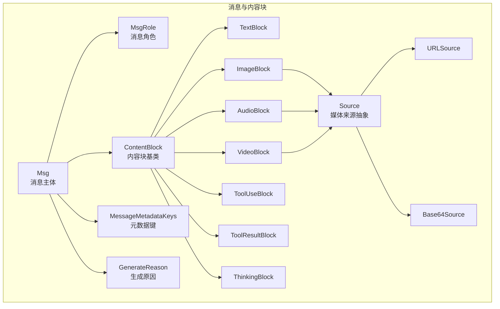
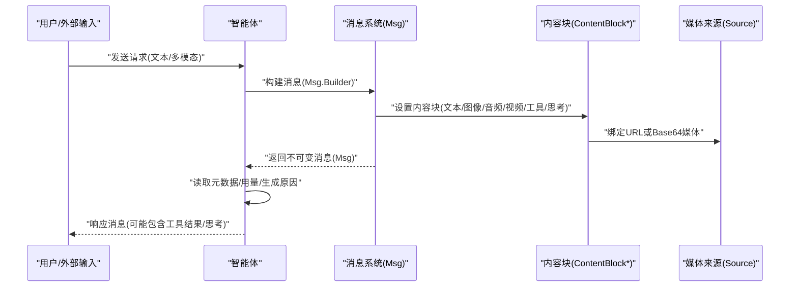
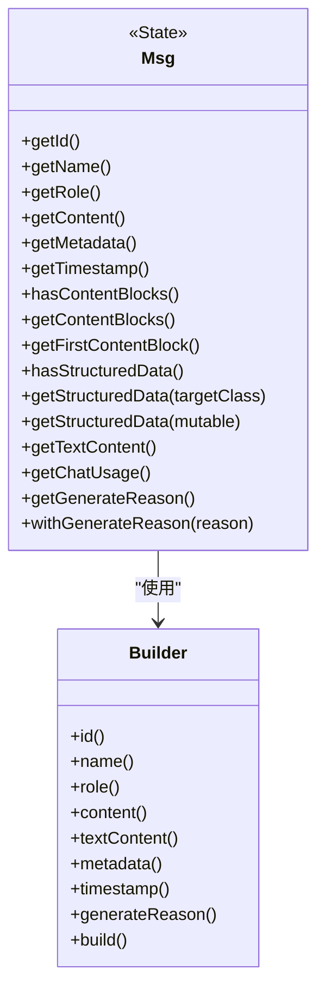
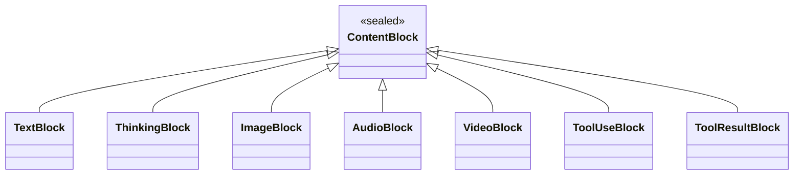
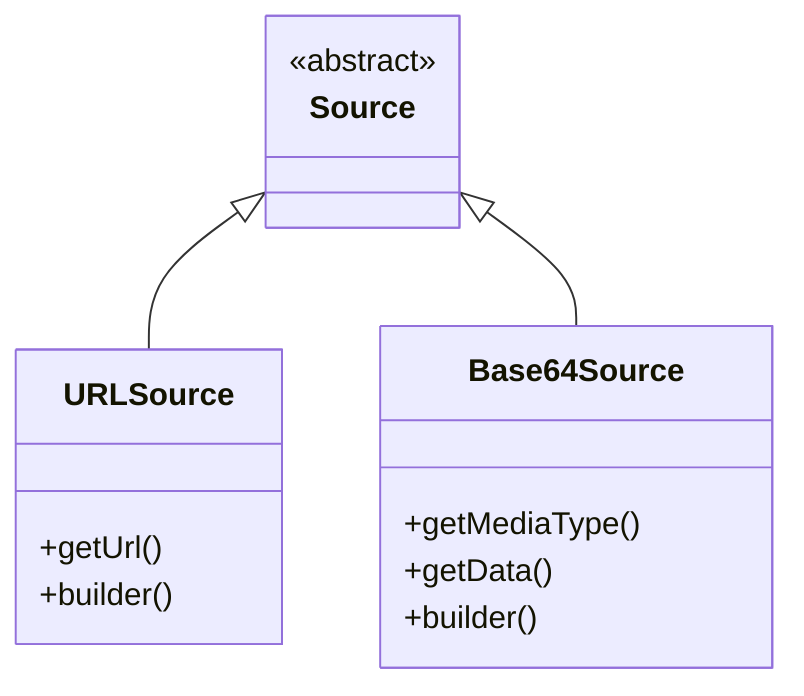
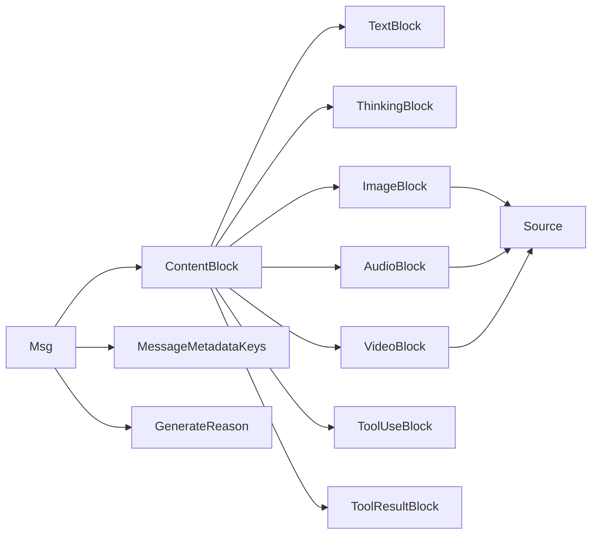
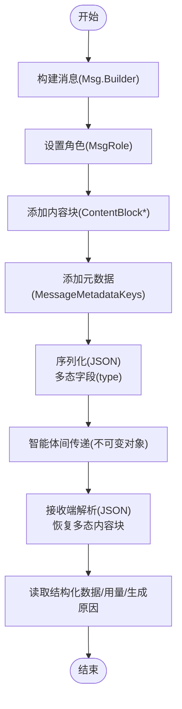

# 消息系统与内容块

<cite>
**本文引用的文件**
- [Msg.java](file://agentscope-core/src/main/java/io/agentscope/core/message/Msg.java)
- [ContentBlock.java](file://agentscope-core/src/main/java/io/agentscope/core/message/ContentBlock.java)
- [MsgRole.java](file://agentscope-core/src/main/java/io/agentscope/core/message/MsgRole.java)
- [TextBlock.java](file://agentscope-core/src/main/java/io/agentscope/core/message/TextBlock.java)
- [ImageBlock.java](file://agentscope-core/src/main/java/io/agentscope/core/message/ImageBlock.java)
- [AudioBlock.java](file://agentscope-core/src/main/java/io/agentscope/core/message/AudioBlock.java)
- [VideoBlock.java](file://agentscope-core/src/main/java/io/agentscope/core/message/VideoBlock.java)
- [ToolResultBlock.java](file://agentscope-core/src/main/java/io/agentscope/core/message/ToolResultBlock.java)
- [ThinkingBlock.java](file://agentscope-core/src/main/java/io/agentscope/core/message/ThinkingBlock.java)
- [ToolUseBlock.java](file://agentscope-core/src/main/java/io/agentscope/core/message/ToolUseBlock.java)
- [Source.java](file://agentscope-core/src/main/java/io/agentscope/core/message/Source.java)
- [Base64Source.java](file://agentscope-core/src/main/java/io/agentscope/core/message/Base64Source.java)
- [URLSource.java](file://agentscope-core/src/main/java/io/agentscope/core/message/URLSource.java)
- [MessageMetadataKeys.java](file://agentscope-core/src/main/java/io/agentscope/core/message/MessageMetadataKeys.java)
- [GenerateReason.java](file://agentscope-core/src/main/java/io/agentscope/core/message/GenerateReason.java)
</cite>

## 目录
1. [简介](#简介)
2. [项目结构](#项目结构)
3. [核心组件](#核心组件)
4. [架构总览](#架构总览)
5. [详细组件分析](#详细组件分析)
6. [依赖关系分析](#依赖关系分析)
7. [性能考量](#性能考量)
8. [故障排查指南](#故障排查指南)
9. [结论](#结论)
10. [附录](#附录)

## 简介
本文件系统性地介绍 AgentScope 框架中的消息系统与内容块设计，重点覆盖以下方面：
- Msg 类的设计与消息传递机制：消息的角色、元数据管理、内容块组织与不可变性保证。
- 内容块基类 ContentBlock 及其多态实现：文本、图像、音频、视频、工具调用与结果、思考内容等。
- 多模态内容处理：统一的 Source 抽象（URL 与 Base64）支持图片、音频、视频等媒体资源。
- 构建模式、序列化机制与跨组件传递：Builder 模式、Jackson 多态序列化、不可变对象与线程安全。
- 具体使用场景：消息创建、修改、传递与智能体间交换。

## 项目结构
消息系统与内容块位于 agentscope-core 模块的 io.agentscope.core.message 包中，采用“按职责分层 + 多态抽象”的组织方式：
- 核心消息：Msg
- 角色枚举：MsgRole
- 内容块基类与实现：ContentBlock 及其子类
- 媒体来源：Source 抽象及 URLSource、Base64Source
- 元数据键常量：MessageMetadataKeys
- 生成原因：GenerateReason

**图示来源**
- [Msg.java:53-654](file://agentscope-core/src/main/java/io/agentscope/core/message/Msg.java#L53-L654)
- [MsgRole.java:35-67](file://agentscope-core/src/main/java/io/agentscope/core/message/MsgRole.java#L35-L67)
- [ContentBlock.java:54-61](file://agentscope-core/src/main/java/io/agentscope/core/message/ContentBlock.java#L54-L61)
- [TextBlock.java:31-95](file://agentscope-core/src/main/java/io/agentscope/core/message/TextBlock.java#L31-L95)
- [ImageBlock.java:37-163](file://agentscope-core/src/main/java/io/agentscope/core/message/ImageBlock.java#L37-L163)
- [AudioBlock.java:35-96](file://agentscope-core/src/main/java/io/agentscope/core/message/AudioBlock.java#L35-L96)
- [VideoBlock.java:36-239](file://agentscope-core/src/main/java/io/agentscope/core/message/VideoBlock.java#L36-L239)
- [ToolUseBlock.java:34-233](file://agentscope-core/src/main/java/io/agentscope/core/message/ToolUseBlock.java#L34-L233)
- [ToolResultBlock.java:35-374](file://agentscope-core/src/main/java/io/agentscope/core/message/ToolResultBlock.java#L35-L374)
- [ThinkingBlock.java:37-133](file://agentscope-core/src/main/java/io/agentscope/core/message/ThinkingBlock.java#L37-L133)
- [Source.java:27-32](file://agentscope-core/src/main/java/io/agentscope/core/message/Source.java#L27-L32)
- [URLSource.java:39-100](file://agentscope-core/src/main/java/io/agentscope/core/message/URLSource.java#L39-L100)
- [Base64Source.java:39-128](file://agentscope-core/src/main/java/io/agentscope/core/message/Base64Source.java#L39-L128)
- [MessageMetadataKeys.java:24-134](file://agentscope-core/src/main/java/io/agentscope/core/message/MessageMetadataKeys.java#L24-L134)
- [GenerateReason.java:36-61](file://agentscope-core/src/main/java/io/agentscope/core/message/GenerateReason.java#L36-L61)

**章节来源**
- [Msg.java:38-51](file://agentscope-core/src/main/java/io/agentscope/core/message/Msg.java#L38-L51)
- [ContentBlock.java:22-43](file://agentscope-core/src/main/java/io/agentscope/core/message/ContentBlock.java#L22-L43)

## 核心组件
- Msg：消息主体，包含唯一 ID、可选名称、角色、不可变内容块列表、元数据与时间戳；提供类型安全的内容块筛选、结构化数据提取、文本拼接、用量统计与生成原因查询等能力。
- ContentBlock：内容块基类，通过 Jackson 多态注解定义“type”字段进行序列化/反序列化，密封类限制子类集合，确保类型安全与可扩展性。
- Source：媒体来源抽象，支持 URLSource 与 Base64Source，统一图片、音频、视频等多模态资源的引用与内嵌方式。
- 元数据键：MessageMetadataKeys 定义了历史合并绕过、结构化输出提醒、聊天用量、结构化输出数据、缓存控制等标准键位，避免魔法字符串。
- 生成原因：GenerateReason 提供模型正常停止、工具调用、结构化输出完成、工具挂起、人工介入、中断、达到最大迭代等状态语义。

**章节来源**
- [Msg.java:53-173](file://agentscope-core/src/main/java/io/agentscope/core/message/Msg.java#L53-L173)
- [ContentBlock.java:44-61](file://agentscope-core/src/main/java/io/agentscope/core/message/ContentBlock.java#L44-L61)
- [Source.java:27-32](file://agentscope-core/src/main/java/io/agentscope/core/message/Source.java#L27-L32)
- [MessageMetadataKeys.java:24-134](file://agentscope-core/src/main/java/io/agentscope/core/message/MessageMetadataKeys.java#L24-L134)
- [GenerateReason.java:36-61](file://agentscope-core/src/main/java/io/agentscope/core/message/GenerateReason.java#L36-L61)

## 架构总览
消息系统围绕“不可变消息 + 多态内容块 + 统一媒体来源”的设计展开，通过 Builder 模式与 Jackson 注解实现易用且可扩展的消息构造与序列化。消息在智能体之间以不可变对象形式传递，确保线程安全与一致性。

**图示来源**
- [Msg.java:500-654](file://agentscope-core/src/main/java/io/agentscope/core/message/Msg.java#L500-L654)
- [ContentBlock.java:44-61](file://agentscope-core/src/main/java/io/agentscope/core/message/ContentBlock.java#L44-L61)
- [Source.java:27-32](file://agentscope-core/src/main/java/io/agentscope/core/message/Source.java#L27-L32)

## 详细组件分析

### Msg 类：消息主体与构建模式
- 不可变性：内容块与元数据均以不可变集合存储，线程安全；通过 Builder 创建新实例，避免共享可变状态。
- 角色与元数据：支持角色枚举与标准元数据键，便于格式化器、钩子与工具链识别与处理。
- 结构化数据：提供结构化输出的读取与转换接口，支持强类型 POJO 与动态 Map。
- 文本聚合：可从所有文本块拼接得到纯文本内容。
- 用量与生成原因：支持从元数据读取 ChatUsage 并解析生成原因，辅助成本与流程控制。
- Builder：提供 id、name、role、content、metadata、timestamp、generateReason 等配置项，支持单个/多个内容块与纯文本便捷设置。

**图示来源**
- [Msg.java:53-654](file://agentscope-core/src/main/java/io/agentscope/core/message/Msg.java#L53-L654)

**章节来源**
- [Msg.java:83-110](file://agentscope-core/src/main/java/io/agentscope/core/message/Msg.java#L83-L110)
- [Msg.java:117-119](file://agentscope-core/src/main/java/io/agentscope/core/message/Msg.java#L117-L119)
- [Msg.java:182-230](file://agentscope-core/src/main/java/io/agentscope/core/message/Msg.java#L182-L230)
- [Msg.java:267-291](file://agentscope-core/src/main/java/io/agentscope/core/message/Msg.java#L267-L291)
- [Msg.java:344-370](file://agentscope-core/src/main/java/io/agentscope/core/message/Msg.java#L344-L370)
- [Msg.java:382-388](file://agentscope-core/src/main/java/io/agentscope/core/message/Msg.java#L382-L388)
- [Msg.java:413-434](file://agentscope-core/src/main/java/io/agentscope/core/message/Msg.java#L413-L434)
- [Msg.java:467-498](file://agentscope-core/src/main/java/io/agentscope/core/message/Msg.java#L467-L498)
- [Msg.java:500-654](file://agentscope-core/src/main/java/io/agentscope/core/message/Msg.java#L500-L654)

### ContentBlock 基类与多态序列化
- 多态序列化：通过 @JsonTypeInfo 与 @JsonSubTypes 在 JSON 中以“type”字段区分具体类型，支持 TextBlock、ThinkingBlock、ImageBlock、AudioBlock、VideoBlock、ToolUseBlock、ToolResultBlock。
- 密封类：ContentBlock 使用密封类语法限制子类集合，确保新增类型时的显式覆盖与编译期检查。
- 不可变性：各实现类均以不可变字段保存内容，避免外部修改。

**图示来源**
- [ContentBlock.java:44-61](file://agentscope-core/src/main/java/io/agentscope/core/message/ContentBlock.java#L44-L61)

**章节来源**
- [ContentBlock.java:44-61](file://agentscope-core/src/main/java/io/agentscope/core/message/ContentBlock.java#L44-L61)

### 文本内容块 TextBlock
- 用途：承载纯文本内容，作为消息中最基础的内容单元。
- 特性：Builder 模式，空文本自动转为空串；toString 返回文本内容，便于直接打印或日志记录。

**章节来源**
- [TextBlock.java:31-95](file://agentscope-core/src/main/java/io/agentscope/core/message/TextBlock.java#L31-L95)

### 图像内容块 ImageBlock
- 用途：承载图像内容，支持 URL 或 Base64 两种来源。
- 关键属性：最小/最大像素阈值，用于输入图像的尺寸约束。
- Builder：支持 source、minPixels、maxPixels 设置。

**章节来源**
- [ImageBlock.java:37-163](file://agentscope-core/src/main/java/io/agentscope/core/message/ImageBlock.java#L37-L163)

### 音频内容块 AudioBlock
- 用途：承载音频内容，支持 URL 或 Base64 两种来源。
- 特性：Builder 模式，空源校验防止空指针。

**章节来源**
- [AudioBlock.java:35-96](file://agentscope-core/src/main/java/io/agentscope/core/message/AudioBlock.java#L35-L96)

### 视频内容块 VideoBlock
- 用途：承载视频内容，支持 URL 或 Base64 两种来源。
- 关键属性：帧率、最大帧数、每帧最小/最大像素、总像素限制，用于视频抽帧与体积控制。
- Builder：支持 source、fps、maxFrames、minPixels、maxPixels、totalPixels 设置。

**章节来源**
- [VideoBlock.java:36-239](file://agentscope-core/src/main/java/io/agentscope/core/message/VideoBlock.java#L36-L239)

### 工具调用内容块 ToolUseBlock
- 用途：表示一次工具调用请求，包含工具名、唯一 ID、输入参数与可选原始内容（流式工具调用）。
- 元数据：支持提供商特定元数据，如 Gemini 思考签名键。
- 不可变性：输入与元数据进行防御式拷贝，防止外部修改。

**章节来源**
- [ToolUseBlock.java:34-233](file://agentscope-core/src/main/java/io/agentscope/core/message/ToolUseBlock.java#L34-L233)

### 工具结果内容块 ToolResultBlock
- 用途：表示一次工具执行的结果，支持返回值、多内容块输出与元数据。
- 挂起结果：当工具抛出挂起异常时，可生成挂起结果，提示外部执行。
- 工厂方法：提供多种便捷构造方法，支持纯文本、错误信息、单/多内容块输出与带元数据的组合。
- Builder：支持 id、name、output、metadata 设置。

**章节来源**
- [ToolResultBlock.java:35-374](file://agentscope-core/src/main/java/io/agentscope/core/message/ToolResultBlock.java#L35-L374)

### 思考内容块 ThinkingBlock
- 用途：记录智能体的内部推理过程，便于调试与可解释性。
- 元数据：支持存储额外推理细节（如 OpenRouter/Gemini 的 reasoningDetails），并在格式化回 API 时保留。

**章节来源**
- [ThinkingBlock.java:37-133](file://agentscope-core/src/main/java/io/agentscope/core/message/ThinkingBlock.java#L37-L133)

### 媒体来源 Source 与具体实现
- Source：抽象媒体来源，通过多态序列化区分 URL 与 Base64。
- URLSource：支持远程 HTTP/HTTPS 与本地 file 协议 URL。
- Base64Source：以 MIME 类型与 Base64 数据形式内嵌媒体，适合小文件或需要内联传输的场景。

**图示来源**
- [Source.java:27-32](file://agentscope-core/src/main/java/io/agentscope/core/message/Source.java#L27-L32)
- [URLSource.java:39-100](file://agentscope-core/src/main/java/io/agentscope/core/message/URLSource.java#L39-L100)
- [Base64Source.java:39-128](file://agentscope-core/src/main/java/io/agentscope/core/message/Base64Source.java#L39-L128)

**章节来源**
- [Source.java:27-32](file://agentscope-core/src/main/java/io/agentscope/core/message/Source.java#L27-L32)
- [URLSource.java:49-61](file://agentscope-core/src/main/java/io/agentscope/core/message/URLSource.java#L49-L61)
- [Base64Source.java:54-76](file://agentscope-core/src/main/java/io/agentscope/core/message/Base64Source.java#L54-L76)

### 元数据键与生成原因
- 元数据键：标准化键位，包括历史合并绕过、结构化输出提醒、聊天用量、结构化输出数据、缓存控制等，避免魔法字符串并提升一致性。
- 生成原因：枚举类型，涵盖模型正常停止、工具调用、结构化输出完成、工具挂起、人工介入、中断、达到最大迭代等，便于上层流程控制与用户体验提示。

**章节来源**
- [MessageMetadataKeys.java:24-134](file://agentscope-core/src/main/java/io/agentscope/core/message/MessageMetadataKeys.java#L24-L134)
- [GenerateReason.java:36-61](file://agentscope-core/src/main/java/io/agentscope/core/message/GenerateReason.java#L36-L61)

## 依赖关系分析
- 消息与内容块：Msg 聚合 ContentBlock 列表，不同内容块类型通过多态序列化在 JSON 中区分。
- 媒体来源：ImageBlock、AudioBlock、VideoBlock 均依赖 Source 抽象，统一 URL 与 Base64 两种媒体来源。
- 元数据：Msg 通过 Map<String,Object> 存储元数据，结合 MessageMetadataKeys 提供的标准键位。
- 生成原因：Msg 提供读取与设置生成原因的能力，配合 GenerateReason 枚举使用。

**图示来源**
- [Msg.java:67-69](file://agentscope-core/src/main/java/io/agentscope/core/message/Msg.java#L67-L69)
- [ContentBlock.java:44-61](file://agentscope-core/src/main/java/io/agentscope/core/message/ContentBlock.java#L44-L61)
- [ImageBlock.java:39-43](file://agentscope-core/src/main/java/io/agentscope/core/message/ImageBlock.java#L39-L43)
- [AudioBlock.java:37-39](file://agentscope-core/src/main/java/io/agentscope/core/message/AudioBlock.java#L37-L39)
- [VideoBlock.java:38-42](file://agentscope-core/src/main/java/io/agentscope/core/message/VideoBlock.java#L38-L42)
- [MessageMetadataKeys.java:91-92](file://agentscope-core/src/main/java/io/agentscope/core/message/MessageMetadataKeys.java#L91-L92)
- [GenerateReason.java:36-61](file://agentscope-core/src/main/java/io/agentscope/core/message/GenerateReason.java#L36-L61)

**章节来源**
- [Msg.java:67-69](file://agentscope-core/src/main/java/io/agentscope/core/message/Msg.java#L67-L69)
- [ContentBlock.java:44-61](file://agentscope-core/src/main/java/io/agentscope/core/message/ContentBlock.java#L44-L61)

## 性能考量
- 不可变性与线程安全：Msg 与各内容块均为不可变对象，避免锁开销与并发问题，适合在多线程与分布式环境中传递。
- 序列化成本：ContentBlock 与 Source 通过 Jackson 多态序列化，JSON 中携带类型标识，便于跨组件解析，但会增加少量序列化体积。
- 媒体来源选择：大文件建议使用 URLSource，减少内存占用与网络传输压力；小文件或需要内联的场景可用 Base64Source。
- 视频处理：VideoBlock 支持帧率、最大帧数与像素限制，有助于控制视频抽帧与总像素，降低计算与传输成本。
- 结构化数据：通过元数据键隔离结构化输出，避免频繁转换带来的性能损耗。

[本节为通用指导，不直接分析具体文件]

## 故障排查指南
- 结构化数据读取失败
  - 现象：调用结构化数据读取方法抛出异常。
  - 排查：确认消息是否包含结构化输出元数据键；确认目标类型与元数据结构匹配；优先使用强类型 POJO 读取。
  - 参考路径：[Msg.java:267-291](file://agentscope-core/src/main/java/io/agentscope/core/message/Msg.java#L267-L291)、[MessageMetadataKeys.java:95-107](file://agentscope-core/src/main/java/io/agentscope/core/message/MessageMetadataKeys.java#L95-L107)
- 生成原因解析异常
  - 现象：生成原因无法正确识别或默认为模型停止。
  - 排查：确认元数据中生成原因键值是否为枚举名称；若为字符串需确保大小写一致。
  - 参考路径：[Msg.java:467-498](file://agentscope-core/src/main/java/io/agentscope/core/message/Msg.java#L467-L498)、[GenerateReason.java:36-61](file://agentscope-core/src/main/java/io/agentscope/core/message/GenerateReason.java#L36-L61)
- 工具结果挂起
  - 现象：工具执行被挂起，等待外部处理。
  - 排查：检查工具结果元数据中挂起标志；根据挂起原因提示进行外部执行或补充输入。
  - 参考路径：[ToolResultBlock.java:115-159](file://agentscope-core/src/main/java/io/agentscope/core/message/ToolResultBlock.java#L115-L159)
- 媒体来源为空
  - 现象：图像/音频/视频内容块抛出空指针异常。
  - 排查：确保 Source 初始化时非空；URLSource 与 Base64Source 的 URL 与数据字段均不能为空。
  - 参考路径：[ImageBlock.java:64-71](file://agentscope-core/src/main/java/io/agentscope/core/message/ImageBlock.java#L64-L71)、[URLSource.java:49-52](file://agentscope-core/src/main/java/io/agentscope/core/message/URLSource.java#L49-L52)、[Base64Source.java:54-58](file://agentscope-core/src/main/java/io/agentscope/core/message/Base64Source.java#L54-L58)

**章节来源**
- [Msg.java:267-291](file://agentscope-core/src/main/java/io/agentscope/core/message/Msg.java#L267-L291)
- [Msg.java:467-498](file://agentscope-core/src/main/java/io/agentscope/core/message/Msg.java#L467-L498)
- [ToolResultBlock.java:115-159](file://agentscope-core/src/main/java/io/agentscope/core/message/ToolResultBlock.java#L115-L159)
- [ImageBlock.java:64-71](file://agentscope-core/src/main/java/io/agentscope/core/message/ImageBlock.java#L64-L71)
- [URLSource.java:49-52](file://agentscope-core/src/main/java/io/agentscope/core/message/URLSource.java#L49-L52)
- [Base64Source.java:54-58](file://agentscope-core/src/main/java/io/agentscope/core/message/Base64Source.java#L54-L58)

## 结论
消息系统与内容块通过“不可变消息 + 多态内容块 + 统一媒体来源”的设计，在保证线程安全与跨组件兼容的同时，提供了强大的多模态表达能力与灵活的构建模式。借助标准元数据键与生成原因枚举，系统能够清晰地表达消息状态与上下文，便于上层流程控制与可观测性增强。推荐在实际应用中：
- 优先使用 Builder 模式创建消息，确保不可变性与可读性；
- 对于大文件媒体，优先使用 URLSource；
- 明确使用结构化输出与生成原因键位，提升系统一致性与可维护性。

[本节为总结性内容，不直接分析具体文件]

## 附录

### 多模态内容处理要点
- 文本：TextBlock 直接承载纯文本。
- 图像：ImageBlock 支持 URL 与 Base64，可设置像素阈值。
- 音频：AudioBlock 支持 URL 与 Base64。
- 视频：VideoBlock 支持 URL 与 Base64，并提供帧率、帧数与像素限制。
- 工具：ToolUseBlock 描述调用请求，ToolResultBlock 描述执行结果。
- 思考：ThinkingBlock 记录推理过程，支持额外元数据。

**章节来源**
- [TextBlock.java:31-95](file://agentscope-core/src/main/java/io/agentscope/core/message/TextBlock.java#L31-L95)
- [ImageBlock.java:37-163](file://agentscope-core/src/main/java/io/agentscope/core/message/ImageBlock.java#L37-L163)
- [AudioBlock.java:35-96](file://agentscope-core/src/main/java/io/agentscope/core/message/AudioBlock.java#L35-L96)
- [VideoBlock.java:36-239](file://agentscope-core/src/main/java/io/agentscope/core/message/VideoBlock.java#L36-L239)
- [ToolUseBlock.java:34-233](file://agentscope-core/src/main/java/io/agentscope/core/message/ToolUseBlock.java#L34-L233)
- [ToolResultBlock.java:35-374](file://agentscope-core/src/main/java/io/agentscope/core/message/ToolResultBlock.java#L35-L374)
- [ThinkingBlock.java:37-133](file://agentscope-core/src/main/java/io/agentscope/core/message/ThinkingBlock.java#L37-L133)

### 智能体间消息交换流程

**图示来源**
- [Msg.java:500-654](file://agentscope-core/src/main/java/io/agentscope/core/message/Msg.java#L500-L654)
- [ContentBlock.java:44-61](file://agentscope-core/src/main/java/io/agentscope/core/message/ContentBlock.java#L44-L61)
- [MessageMetadataKeys.java:91-107](file://agentscope-core/src/main/java/io/agentscope/core/message/MessageMetadataKeys.java#L91-L107)