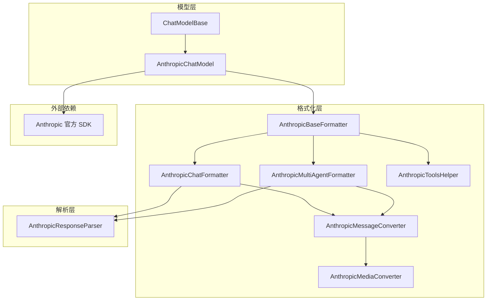
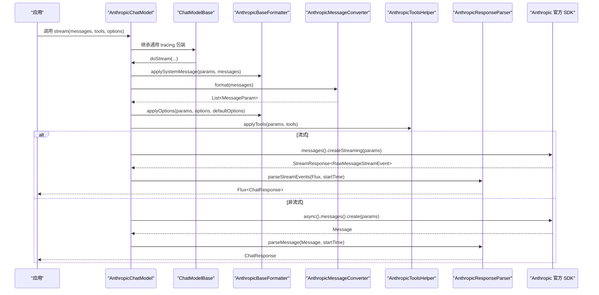
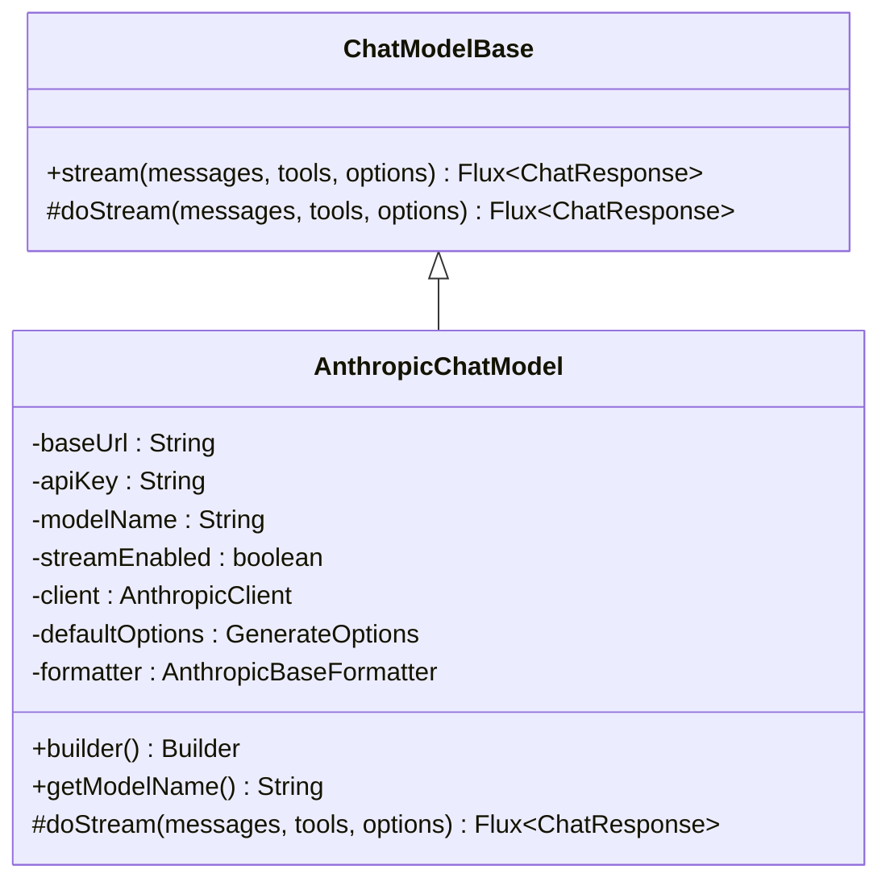
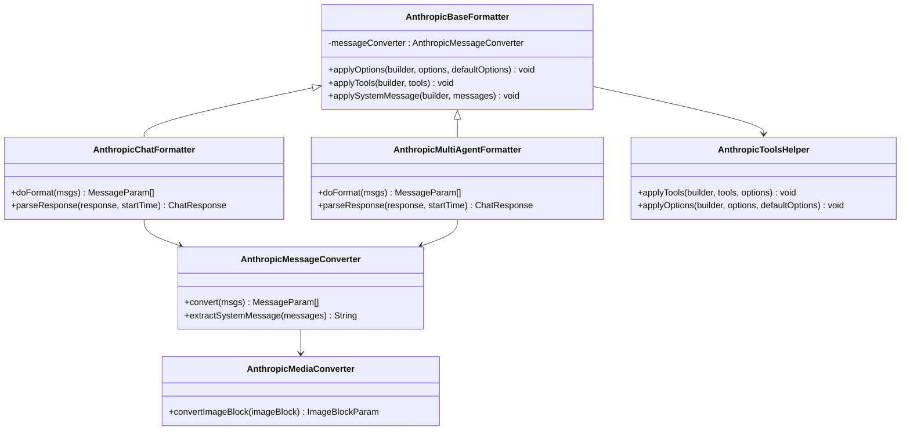
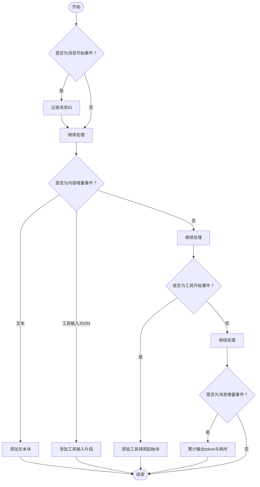
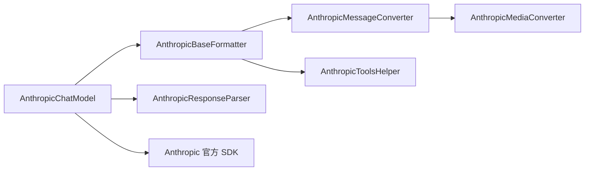

# Anthropic Claude 集成

<cite>
**本文档引用的文件**
- [AnthropicChatModel.java](file://agentscope-core/src/main/java/io/agentscope/core/model/AnthropicChatModel.java)
- [ChatModelBase.java](file://agentscope-core/src/main/java/io/agentscope/core/model/ChatModelBase.java)
- [AnthropicBaseFormatter.java](file://agentscope-core/src/main/java/io/agentscope/core/formatter/anthropic/AnthropicBaseFormatter.java)
- [AnthropicChatFormatter.java](file://agentscope-core/src/main/java/io/agentscope/core/formatter/anthropic/AnthropicChatFormatter.java)
- [AnthropicMultiAgentFormatter.java](file://agentscope-core/src/main/java/io/agentscope/core/formatter/anthropic/AnthropicMultiAgentFormatter.java)
- [AnthropicResponseParser.java](file://agentscope-core/src/main/java/io/agentscope/core/formatter/anthropic/AnthropicResponseParser.java)
- [AnthropicMessageConverter.java](file://agentscope-core/src/main/java/io/agentscope/core/formatter/anthropic/AnthropicMessageConverter.java)
- [AnthropicToolsHelper.java](file://agentscope-core/src/main/java/io/agentscope/core/formatter/anthropic/AnthropicToolsHelper.java)
- [AnthropicMediaConverter.java](file://agentscope-core/src/main/java/io/agentscope/core/formatter/anthropic/AnthropicMediaConverter.java)
- [AnthropicChatModelTest.java](file://agentscope-core/src/test/java/io/agentscope/core/model/AnthropicChatModelTest.java)
- [AnthropicProvider.java](file://agentscope-core/src/test/java/io/agentscope/core/e2e/providers/AnthropicProvider.java)
</cite>

## 目录
1. [简介](#简介)
2. [项目结构](#项目结构)
3. [核心组件](#核心组件)
4. [架构总览](#架构总览)
5. [详细组件分析](#详细组件分析)
6. [依赖关系分析](#依赖关系分析)
7. [性能考虑](#性能考虑)
8. [故障排除指南](#故障排除指南)
9. [结论](#结论)
10. [附录：完整配置与使用示例](#附录完整配置与使用示例)

## 简介
本文件面向需要在 AgentScope 中集成 Anthropic Claude 模型提供商的开发者，系统性阐述 AnthropicChatModel 的实现架构与工作流程，涵盖以下关键主题：
- Claude API 集成方式与官方 SDK 使用
- 认证机制、API 密钥管理与环境变量支持
- Claude 特有的提示格式、工具调用与消息历史管理
- 流式传输、内容解析与错误处理
- 配置示例（API 版本选择、模型参数、安全设置）
- 成本控制、性能优化与最佳实践

## 项目结构
Anthropic 集成位于 agentscope-core 模块中，采用“模型 + 格式化器 + 解析器”的分层设计：
- 模型层：AnthropicChatModel 继承自通用 ChatModelBase，负责请求构建、调用与超时重试
- 格式化层：AnthropicBaseFormatter 及其子类负责将 AgentScope 的 Msg 对象转换为 Anthropic SDK 的 MessageParam，并应用工具与选项
- 解析层：AnthropicResponseParser 负责将非流式与流式响应解析为统一的 ChatResponse 结构
- 媒体与工具辅助：AnthropicMediaConverter、AnthropicToolsHelper 提供媒体与工具注册能力

图表来源
- [AnthropicChatModel.java:53-105](file://agentscope-core/src/main/java/io/agentscope/core/model/AnthropicChatModel.java#L53-L105)
- [ChatModelBase.java:29-61](file://agentscope-core/src/main/java/io/agentscope/core/model/ChatModelBase.java#L29-L61)
- [AnthropicBaseFormatter.java:37-106](file://agentscope-core/src/main/java/io/agentscope/core/formatter/anthropic/AnthropicBaseFormatter.java#L37-L106)
- [AnthropicChatFormatter.java:37-52](file://agentscope-core/src/main/java/io/agentscope/core/formatter/anthropic/AnthropicChatFormatter.java#L37-L52)
- [AnthropicMultiAgentFormatter.java:47-95](file://agentscope-core/src/main/java/io/agentscope/core/formatter/anthropic/AnthropicMultiAgentFormatter.java#L47-L95)
- [AnthropicResponseParser.java:42-210](file://agentscope-core/src/main/java/io/agentscope/core/formatter/anthropic/AnthropicResponseParser.java#L42-L210)
- [AnthropicMessageConverter.java:50-277](file://agentscope-core/src/main/java/io/agentscope/core/formatter/anthropic/AnthropicMessageConverter.java#L50-L277)
- [AnthropicToolsHelper.java:41-215](file://agentscope-core/src/main/java/io/agentscope/core/formatter/anthropic/AnthropicToolsHelper.java#L41-L215)
- [AnthropicMediaConverter.java:30-82](file://agentscope-core/src/main/java/io/agentscope/core/formatter/anthropic/AnthropicMediaConverter.java#L30-L82)

章节来源
- [AnthropicChatModel.java:1-318](file://agentscope-core/src/main/java/io/agentscope/core/model/AnthropicChatModel.java#L1-L318)
- [ChatModelBase.java:1-62](file://agentscope-core/src/main/java/io/agentscope/core/model/ChatModelBase.java#L1-L62)

## 核心组件
- AnthropicChatModel：基于官方 Anthropic OkHttp 客户端，封装 Messages API 调用；支持流式与非流式模式、默认生成选项、工具调用与系统消息提取。
- AnthropicBaseFormatter 及其实现：统一处理系统消息、工具选择与生成选项应用；子类分别适配单智能体与多智能体对话。
- AnthropicResponseParser：将非流式 Message 与流式 RawMessageStreamEvent 转换为统一 ChatResponse，支持文本、工具调用、思考块与用量统计。
- AnthropicMessageConverter：负责 Msg 到 MessageParam 的转换，处理角色映射、多模态内容与工具结果拆分。
- AnthropicToolsHelper：注册工具、应用工具选择策略（Auto/None/Specific），并将额外头部/查询/请求体参数透传到 SDK。
- AnthropicMediaConverter：将本地文件或远程 URL 的图片转换为 Anthropic 所需的 Base64 或 URL 源。

章节来源
- [AnthropicChatModel.java:53-318](file://agentscope-core/src/main/java/io/agentscope/core/model/AnthropicChatModel.java#L53-L318)
- [AnthropicBaseFormatter.java:37-106](file://agentscope-core/src/main/java/io/agentscope/core/formatter/anthropic/AnthropicBaseFormatter.java#L37-L106)
- [AnthropicChatFormatter.java:37-52](file://agentscope-core/src/main/java/io/agentscope/core/formatter/anthropic/AnthropicChatFormatter.java#L37-L52)
- [AnthropicMultiAgentFormatter.java:47-219](file://agentscope-core/src/main/java/io/agentscope/core/formatter/anthropic/AnthropicMultiAgentFormatter.java#L47-L219)
- [AnthropicResponseParser.java:42-210](file://agentscope-core/src/main/java/io/agentscope/core/formatter/anthropic/AnthropicResponseParser.java#L42-L210)
- [AnthropicMessageConverter.java:50-277](file://agentscope-core/src/main/java/io/agentscope/core/formatter/anthropic/AnthropicMessageConverter.java#L50-L277)
- [AnthropicToolsHelper.java:41-215](file://agentscope-core/src/main/java/io/agentscope/core/formatter/anthropic/AnthropicToolsHelper.java#L41-L215)
- [AnthropicMediaConverter.java:30-82](file://agentscope-core/src/main/java/io/agentscope/core/formatter/anthropic/AnthropicMediaConverter.java#L30-L82)

## 架构总览
下图展示从 AgentScope 消息到 Anthropic API 请求再到响应解析的整体流程：

图表来源
- [AnthropicChatModel.java:124-211](file://agentscope-core/src/main/java/io/agentscope/core/model/AnthropicChatModel.java#L124-L211)
- [ChatModelBase.java:42-48](file://agentscope-core/src/main/java/io/agentscope/core/model/ChatModelBase.java#L42-L48)
- [AnthropicBaseFormatter.java:56-88](file://agentscope-core/src/main/java/io/agentscope/core/formatter/anthropic/AnthropicBaseFormatter.java#L56-L88)
- [AnthropicMessageConverter.java:74-116](file://agentscope-core/src/main/java/io/agentscope/core/formatter/anthropic/AnthropicMessageConverter.java#L74-L116)
- [AnthropicToolsHelper.java:52-74](file://agentscope-core/src/main/java/io/agentscope/core/formatter/anthropic/AnthropicToolsHelper.java#L52-L74)
- [AnthropicResponseParser.java:103-190](file://agentscope-core/src/main/java/io/agentscope/core/formatter/anthropic/AnthropicResponseParser.java#L103-L190)

## 详细组件分析

### AnthropicChatModel：模型实现与调用链
- 初始化与客户端：根据 baseUrl 与 apiKey 构建 AnthropicOkHttpClient；apiKey 为空时可由 SDK 从环境变量加载。
- 请求构建：设置 model、maxTokens，提取系统消息，格式化消息列表，应用生成选项与工具，再决定流式或非流式调用。
- 流式处理：将 SDK 的 Stream 转为 Reactor Flux，解析事件流，关闭资源；非流式通过异步 Future 获取 Message 并解析。
- 超时与重试：委托 ModelUtils.applyTimeoutAndRetry 应用统一的超时与重试策略。

图表来源
- [ChatModelBase.java:29-61](file://agentscope-core/src/main/java/io/agentscope/core/model/ChatModelBase.java#L29-L61)
- [AnthropicChatModel.java:53-105](file://agentscope-core/src/main/java/io/agentscope/core/model/AnthropicChatModel.java#L53-L105)

章节来源
- [AnthropicChatModel.java:78-211](file://agentscope-core/src/main/java/io/agentscope/core/model/AnthropicChatModel.java#L78-L211)

### 格式化器体系：消息转换与工具应用
- AnthropicBaseFormatter：保存当前生成选项至线程局部存储，以便 applyTools 时读取；提供 applySystemMessage 将首条系统消息抽取为 system 参数。
- AnthropicChatFormatter：直接将格式化后的 MessageParam 列表提交给 SDK；解析非流式响应。
- AnthropicMultiAgentFormatter：按组聚合消息（系统、工具序列、代理对话），对代理对话使用历史标记合并，便于多智能体协作。
- AnthropicMessageConverter：处理角色映射（首条系统消息作为 USER）、多模态内容（文本/图像/思考块/工具调用）、工具结果拆分为独立用户消息。
- AnthropicToolsHelper：注册工具、应用工具选择策略（Auto/None/Specific），并透传额外头部/查询/请求体参数。
- AnthropicMediaConverter：将本地文件转为 Base64，远程 URL 直接使用，确保媒体类型正确。

图表来源
- [AnthropicBaseFormatter.java:37-106](file://agentscope-core/src/main/java/io/agentscope/core/formatter/anthropic/AnthropicBaseFormatter.java#L37-L106)
- [AnthropicChatFormatter.java:37-52](file://agentscope-core/src/main/java/io/agentscope/core/formatter/anthropic/AnthropicChatFormatter.java#L37-L52)
- [AnthropicMultiAgentFormatter.java:47-219](file://agentscope-core/src/main/java/io/agentscope/core/formatter/anthropic/AnthropicMultiAgentFormatter.java#L47-L219)
- [AnthropicMessageConverter.java:50-277](file://agentscope-core/src/main/java/io/agentscope/core/formatter/anthropic/AnthropicMessageConverter.java#L50-L277)
- [AnthropicToolsHelper.java:41-215](file://agentscope-core/src/main/java/io/agentscope/core/formatter/anthropic/AnthropicToolsHelper.java#L41-L215)
- [AnthropicMediaConverter.java:30-82](file://agentscope-core/src/main/java/io/agentscope/core/formatter/anthropic/AnthropicMediaConverter.java#L30-L82)

章节来源
- [AnthropicBaseFormatter.java:56-105](file://agentscope-core/src/main/java/io/agentscope/core/formatter/anthropic/AnthropicBaseFormatter.java#L56-L105)
- [AnthropicChatFormatter.java:39-51](file://agentscope-core/src/main/java/io/agentscope/core/formatter/anthropic/AnthropicChatFormatter.java#L39-L51)
- [AnthropicMultiAgentFormatter.java:75-94](file://agentscope-core/src/main/java/io/agentscope/core/formatter/anthropic/AnthropicMultiAgentFormatter.java#L75-L94)
- [AnthropicMessageConverter.java:74-116](file://agentscope-core/src/main/java/io/agentscope/core/formatter/anthropic/AnthropicMessageConverter.java#L74-L116)
- [AnthropicToolsHelper.java:52-110](file://agentscope-core/src/main/java/io/agentscope/core/formatter/anthropic/AnthropicToolsHelper.java#L52-L110)
- [AnthropicMediaConverter.java:36-81](file://agentscope-core/src/main/java/io/agentscope/core/formatter/anthropic/AnthropicMediaConverter.java#L36-L81)

### 响应解析：流式与非流式
- 非流式：遍历内容块，识别文本、工具调用与思考块，构造 ChatResponse；统计输入/输出 token 与耗时。
- 流式：逐个事件解析，支持文本增量与工具输入 JSON 片段累积；在消息结束时汇总用量信息。

图表来源
- [AnthropicResponseParser.java:103-190](file://agentscope-core/src/main/java/io/agentscope/core/formatter/anthropic/AnthropicResponseParser.java#L103-L190)

章节来源
- [AnthropicResponseParser.java:49-98](file://agentscope-core/src/main/java/io/agentscope/core/formatter/anthropic/AnthropicResponseParser.java#L49-L98)
- [AnthropicResponseParser.java:103-190](file://agentscope-core/src/main/java/io/agentscope/core/formatter/anthropic/AnthropicResponseParser.java#L103-L190)

### 工具调用与消息历史管理
- 工具注册：将 ToolSchema 转换为 Anthropic Tool 并注册到请求；工具选择策略映射到 Anthropic 的 Auto/Any/Tool。
- 工具结果：工具执行结果必须以独立用户消息形式提交，转换器会将混合内容拆分为常规内容与工具结果消息。
- 多智能体历史：多代理格式化器将对话历史以特殊标记包裹，首次组添加历史提示，后续组仅传递最新上下文，减少 token 消耗。

章节来源
- [AnthropicToolsHelper.java:52-110](file://agentscope-core/src/main/java/io/agentscope/core/formatter/anthropic/AnthropicToolsHelper.java#L52-L110)
- [AnthropicMessageConverter.java:82-113](file://agentscope-core/src/main/java/io/agentscope/core/formatter/anthropic/AnthropicMessageConverter.java#L82-L113)
- [AnthropicMultiAgentFormatter.java:182-218](file://agentscope-core/src/main/java/io/agentscope/core/formatter/anthropic/AnthropicMultiAgentFormatter.java#L182-L218)

## 依赖关系分析
- 模型层依赖格式化器与解析器，不直接耦合具体 SDK；通过 Formatter 抽象屏蔽 SDK 差异。
- 格式化器内部依赖消息转换器与媒体转换器，工具帮助器提供工具注册与选项应用。
- 流式处理依赖 Reactor，非流式通过 SDK 异步接口返回 Future，最终统一为 Flux/ChatResponse。

图表来源
- [AnthropicChatModel.java:53-105](file://agentscope-core/src/main/java/io/agentscope/core/model/AnthropicChatModel.java#L53-L105)
- [AnthropicBaseFormatter.java:37-106](file://agentscope-core/src/main/java/io/agentscope/core/formatter/anthropic/AnthropicBaseFormatter.java#L37-L106)
- [AnthropicMessageConverter.java:50-277](file://agentscope-core/src/main/java/io/agentscope/core/formatter/anthropic/AnthropicMessageConverter.java#L50-L277)
- [AnthropicToolsHelper.java:41-215](file://agentscope-core/src/main/java/io/agentscope/core/formatter/anthropic/AnthropicToolsHelper.java#L41-L215)
- [AnthropicMediaConverter.java:30-82](file://agentscope-core/src/main/java/io/agentscope/core/formatter/anthropic/AnthropicMediaConverter.java#L30-L82)
- [AnthropicResponseParser.java:42-210](file://agentscope-core/src/main/java/io/agentscope/core/formatter/anthropic/AnthropicResponseParser.java#L42-L210)

章节来源
- [AnthropicChatModel.java:124-211](file://agentscope-core/src/main/java/io/agentscope/core/model/AnthropicChatModel.java#L124-L211)
- [AnthropicBaseFormatter.java:56-88](file://agentscope-core/src/main/java/io/agentscope/core/formatter/anthropic/AnthropicBaseFormatter.java#L56-L88)

## 性能考虑
- 流式优先：在长对话与实时交互场景启用流式传输，降低首字节延迟并提升用户体验。
- 合理设置 maxTokens：避免过大的 maxTokens 导致 token 消耗过高与响应时间延长。
- 工具调用批量化：将多个工具调用合并为一次请求，减少往返次数。
- 多模态优化：本地图片尽量压缩后再转 Base64，远程图片直接使用 URL，减少编码开销。
- 缓存与复用：Formatter 与 Converter 为无状态对象，可在多请求间复用；注意线程局部存储的清理。
- 超时与重试：结合 ModelUtils 的超时与重试策略，平衡稳定性与资源占用。

## 故障排除指南
- API 密钥问题：当 apiKey 为空时，SDK 会尝试从环境变量加载；请确认环境变量已正确设置。
- 工具调用失败：检查工具 schema 的参数结构是否可序列化为 JsonValue；必要时在工具注册前进行参数校验。
- 图片上传异常：确保图片 URL 后缀合法或本地文件路径有效；媒体转换器会对不支持的源类型抛出异常。
- 流式解析错误：解析器对单个事件异常会记录警告并跳过，不影响整体流；如出现大量丢弃，请检查事件格式与网络稳定性。
- 多智能体历史缺失：确认多代理格式化器是否正确包裹历史标记，且首次组包含历史提示。

章节来源
- [AnthropicChatModel.java:94-104](file://agentscope-core/src/main/java/io/agentscope/core/model/AnthropicChatModel.java#L94-L104)
- [AnthropicToolsHelper.java:79-86](file://agentscope-core/src/main/java/io/agentscope/core/formatter/anthropic/AnthropicToolsHelper.java#L79-L86)
- [AnthropicMediaConverter.java:36-81](file://agentscope-core/src/main/java/io/agentscope/core/formatter/anthropic/AnthropicMediaConverter.java#L36-L81)
- [AnthropicResponseParser.java:110-114](file://agentscope-core/src/main/java/io/agentscope/core/formatter/anthropic/AnthropicResponseParser.java#L110-L114)
- [AnthropicMultiAgentFormatter.java:182-218](file://agentscope-core/src/main/java/io/agentscope/core/formatter/anthropic/AnthropicMultiAgentFormatter.java#L182-L218)

## 结论
AnthropicChatModel 通过清晰的分层设计与标准化的格式化/解析流程，实现了对 Claude Messages API 的完整覆盖。其特性包括：
- 支持流式与非流式调用，满足不同场景需求
- 原生支持工具调用与思考块，便于复杂推理与工具编排
- 多智能体对话的历史管理与标记化组织，提升可维护性
- 统一的错误处理与超时重试机制，保障生产可用性

建议在生产环境中结合超时重试、合理 maxTokens 与媒体优化策略，持续监控 token 使用与延迟指标，以实现成本与性能的最佳平衡。

## 附录：完整配置与使用示例
以下示例基于单元测试与端到端提供者配置，展示常见配置项与行为验证要点。为避免泄露密钥，示例中使用占位符与环境变量加载。

- 基础模型创建与默认参数
  - 默认模型名称：claude-sonnet-4-5-20250929
  - 默认启用流式传输
  - 默认生成选项为空，使用 SDK 默认值
  - 参考：[AnthropicChatModelTest.java:55-77](file://agentscope-core/src/test/java/io/agentscope/core/model/AnthropicChatModelTest.java#L55-L77)

- 自定义基础 URL 与 API 密钥
  - 支持自定义 baseUrl；apiKey 为空时从环境变量加载
  - 参考：[AnthropicChatModelTest.java:167-176](file://agentscope-core/src/test/java/io/agentscope/core/model/AnthropicChatModelTest.java#L167-L176)

- 不同 Claude 版本模型
  - 支持 claude-3-5-sonnet、claude-3-opus、claude-3-haiku 等版本名称
  - 参考：[AnthropicChatModelTest.java:82-108](file://agentscope-core/src/test/java/io/agentscope/core/model/AnthropicChatModelTest.java#L82-L108)

- 流式与非流式切换
  - 通过 stream(true/false) 控制
  - 参考：[AnthropicChatModelTest.java:111-132](file://agentscope-core/src/test/java/io/agentscope/core/model/AnthropicChatModelTest.java#L111-L132)

- 工具调用配置
  - 在构建时传入工具 schema 列表，Formatter 会在请求中注册工具并应用工具选择策略
  - 参考：[AnthropicChatModelTest.java:144-163](file://agentscope-core/src/test/java/io/agentscope/core/model/AnthropicChatModelTest.java#L144-L163)，[AnthropicToolsHelper.java:52-110](file://agentscope-core/src/main/java/io/agentscope/core/formatter/anthropic/AnthropicToolsHelper.java#L52-L110)

- 生成选项与默认选项
  - 通过 defaultOptions 设置温度、topP、maxTokens 等；也可在每次调用时覆盖
  - 参考：[AnthropicChatModelTest.java:179-195](file://agentscope-core/src/test/java/io/agentscope/core/model/AnthropicChatModelTest.java#L179-L195)

- 多智能体格式化器
  - 使用 AnthropicMultiAgentFormatter 以历史标记组织多轮对话
  - 参考：[AnthropicChatModelTest.java:248-261](file://agentscope-core/src/test/java/io/agentscope/core/model/AnthropicChatModelTest.java#L248-L261)，[AnthropicMultiAgentFormatter.java:75-94](file://agentscope-core/src/main/java/io/agentscope/core/formatter/anthropic/AnthropicMultiAgentFormatter.java#L75-L94)

- 端到端提供者配置（环境变量）
  - 通过环境变量 ANTHROPIC_API_KEY 与可选 ANTHROPIC_BASE_URL 进行配置
  - 参考：[AnthropicProvider.java:41-46](file://agentscope-core/src/test/java/io/agentscope/core/e2e/providers/AnthropicProvider.java#L41-L46)，[AnthropicProvider.java:50-61](file://agentscope-core/src/test/java/io/agentscope/core/e2e/providers/AnthropicProvider.java#L50-L61)

- 关键实现参考路径
  - 模型初始化与客户端构建：[AnthropicChatModel.java:78-105](file://agentscope-core/src/main/java/io/agentscope/core/model/AnthropicChatModel.java#L78-L105)
  - 流式/非流式调用与解析：[AnthropicChatModel.java:124-211](file://agentscope-core/src/main/java/io/agentscope/core/model/AnthropicChatModel.java#L124-L211)，[AnthropicResponseParser.java:103-190](file://agentscope-core/src/main/java/io/agentscope/core/formatter/anthropic/AnthropicResponseParser.java#L103-L190)
  - 消息格式化与系统消息抽取：[AnthropicBaseFormatter.java:100-105](file://agentscope-core/src/main/java/io/agentscope/core/formatter/anthropic/AnthropicBaseFormatter.java#L100-L105)，[AnthropicMessageConverter.java:256-276](file://agentscope-core/src/main/java/io/agentscope/core/formatter/anthropic/AnthropicMessageConverter.java#L256-L276)
  - 工具注册与选择策略：[AnthropicToolsHelper.java:52-110](file://agentscope-core/src/main/java/io/agentscope/core/formatter/anthropic/AnthropicToolsHelper.java#L52-L110)
  - 多模态媒体转换：[AnthropicMediaConverter.java:36-81](file://agentscope-core/src/main/java/io/agentscope/core/formatter/anthropic/AnthropicMediaConverter.java#L36-L81)