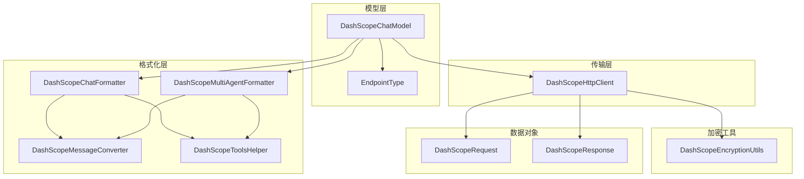
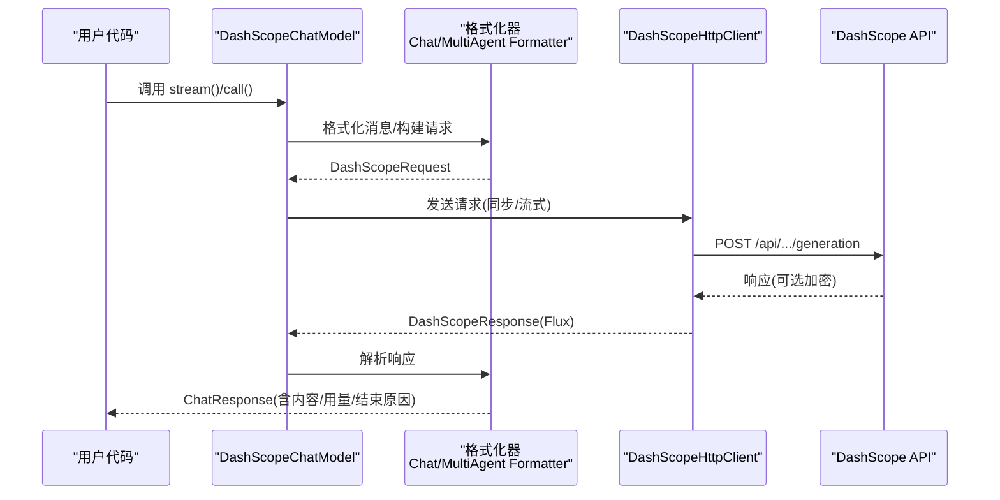
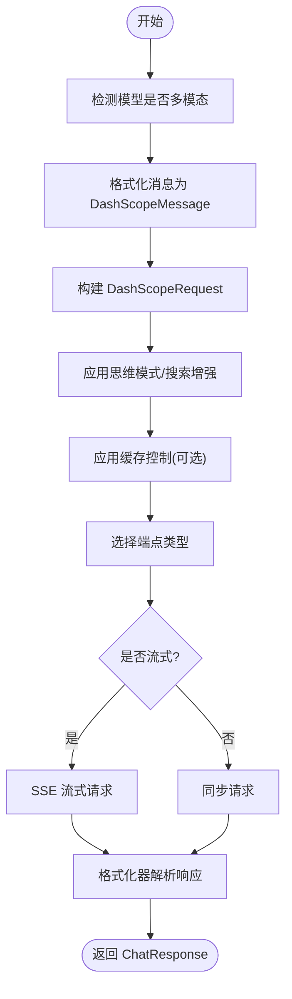
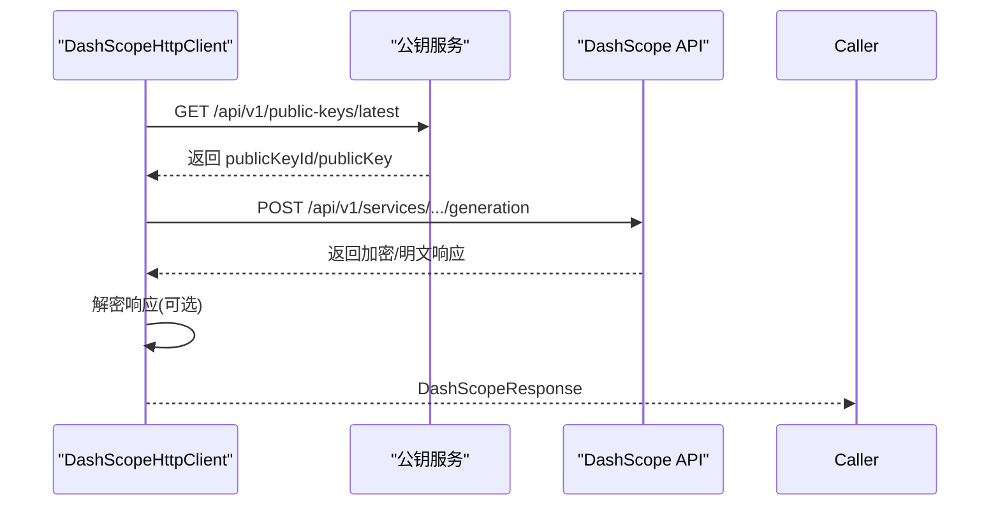
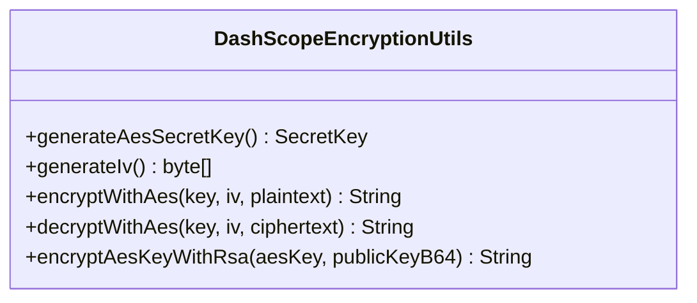
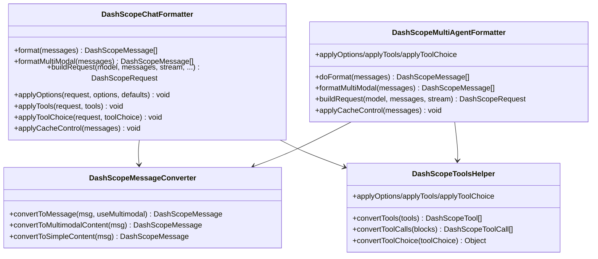
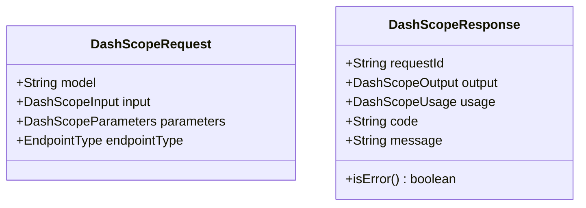
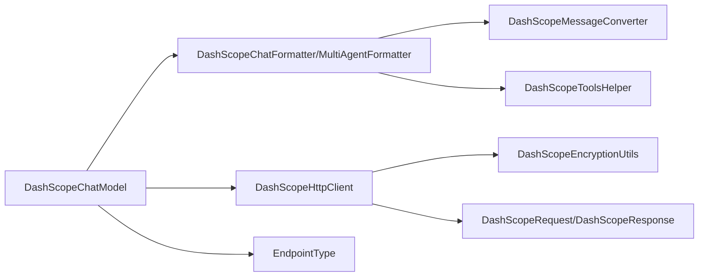

# DashScope 集成

<cite>
**本文档引用的文件**
- [DashScopeChatModel.java](file://agentscope-core/src/main/java/io/agentscope/core/model/DashScopeChatModel.java)
- [DashScopeHttpClient.java](file://agentscope-core/src/main/java/io/agentscope/core/model/DashScopeHttpClient.java)
- [DashScopeEncryptionUtils.java](file://agentscope-core/src/main/java/io/agentscope/core/model/DashScopeEncryptionUtils.java)
- [DashScopeChatFormatter.java](file://agentscope-core/src/main/java/io/agentscope/core/formatter/dashscope/DashScopeChatFormatter.java)
- [DashScopeMultiAgentFormatter.java](file://agentscope-core/src/main/java/io/agentscope/core/formatter/dashscope/DashScopeMultiAgentFormatter.java)
- [DashScopeMessageConverter.java](file://agentscope-core/src/main/java/io/agentscope/core/formatter/dashscope/DashScopeMessageConverter.java)
- [DashScopeToolsHelper.java](file://agentscope-core/src/main/java/io/agentscope/core/formatter/dashscope/DashScopeToolsHelper.java)
- [DashScopeRequest.java](file://agentscope-core/src/main/java/io/agentscope/core/formatter/dashscope/dto/DashScopeRequest.java)
- [DashScopeResponse.java](file://agentscope-core/src/main/java/io/agentscope/core/formatter/dashscope/dto/DashScopeResponse.java)
- [EndpointType.java](file://agentscope-core/src/main/java/io/agentscope/core/model/EndpointType.java)
- [ChatModelBase.java](file://agentscope-core/src/main/java/io/agentscope/core/model/ChatModelBase.java)
- [DashScopeResponseParserTest.java](file://agentscope-core/src/test/java/io/agentscope/core/formatter/dashscope/DashScopeResponseParserTest.java)
- [DashScopeToolsHelperToolChoiceTest.java](file://agentscope-core/src/test/java/io/agentscope/core/formatter/dashscope/DashScopeToolsHelperToolChoiceTest.java)
</cite>

## 目录
1. [简介](#简介)
2. [项目结构](#项目结构)
3. [核心组件](#核心组件)
4. [架构总览](#架构总览)
5. [详细组件分析](#详细组件分析)
6. [依赖关系分析](#依赖关系分析)
7. [性能考虑](#性能考虑)
8. [故障排查指南](#故障排查指南)
9. [结论](#结论)
10. [附录：完整配置与使用示例](#附录完整配置与使用示例)

## 简介
本文件面向需要在 AgentScope 框架中集成 DashScope（阿里云百炼平台）模型的开发者，系统性讲解 DashScopeChatModel 的实现细节与使用方法。内容涵盖：
- 与 DashScope API 的直接 HTTP 集成方式
- 认证机制、加密处理与请求格式
- 多模态支持与多智能体协作格式化器
- 流式传输、工具调用格式与响应解析
- 配置示例（API Key、区域与端点）
- 性能优化、错误处理与故障排查

## 项目结构
DashScope 集成位于 agentscope-core 模块中，主要由以下层次构成：
- 模型层：DashScopeChatModel 负责对外暴露统一的聊天模型接口，并协调格式化器与 HTTP 客户端
- 格式化层：DashScopeChatFormatter 与 DashScopeMultiAgentFormatter 将 AgentScope 的消息转换为 DashScope 请求/响应格式
- 传输层：DashScopeHttpClient 封装 HTTP 请求、SSE 流式解析、参数合并与可选加密
- 工具与媒体：DashScopeToolsHelper 提供工具注册与工具调用格式转换；DashScopeMessageConverter 负责文本/多模态内容转换
- 加密工具：DashScopeEncryptionUtils 实现 AES-GCM 与 RSA 密钥交换的加密流程
- 数据传输对象：DashScopeRequest/DashScopeResponse 定义请求/响应结构

图表来源
- [DashScopeChatModel.java:52-167](file://agentscope-core/src/main/java/io/agentscope/core/model/DashScopeChatModel.java#L52-L167)
- [DashScopeHttpClient.java:62-141](file://agentscope-core/src/main/java/io/agentscope/core/model/DashScopeHttpClient.java#L62-L141)
- [DashScopeChatFormatter.java:42-55](file://agentscope-core/src/main/java/io/agentscope/core/formatter/dashscope/DashScopeChatFormatter.java#L42-L55)
- [DashScopeMultiAgentFormatter.java:46-78](file://agentscope-core/src/main/java/io/agentscope/core/formatter/dashscope/DashScopeMultiAgentFormatter.java#L46-L78)
- [DashScopeMessageConverter.java:43-55](file://agentscope-core/src/main/java/io/agentscope/core/formatter/dashscope/DashScopeMessageConverter.java#L43-L55)
- [DashScopeToolsHelper.java:41-45](file://agentscope-core/src/main/java/io/agentscope/core/formatter/dashscope/DashScopeToolsHelper.java#L41-L45)
- [DashScopeEncryptionUtils.java:42-55](file://agentscope-core/src/main/java/io/agentscope/core/model/DashScopeEncryptionUtils.java#L42-L55)
- [DashScopeRequest.java:43-75](file://agentscope-core/src/main/java/io/agentscope/core/formatter/dashscope/dto/DashScopeRequest.java#L43-L75)
- [DashScopeResponse.java:48-72](file://agentscope-core/src/main/java/io/agentscope/core/formatter/dashscope/dto/DashScopeResponse.java#L48-L72)

章节来源
- [DashScopeChatModel.java:52-167](file://agentscope-core/src/main/java/io/agentscope/core/model/DashScopeChatModel.java#L52-L167)
- [DashScopeHttpClient.java:62-141](file://agentscope-core/src/main/java/io/agentscope/core/model/DashScopeHttpClient.java#L62-L141)

## 核心组件
- DashScopeChatModel：模型入口，负责消息格式化、请求构建、流式/非流式调用、超时与重试、思维模式与搜索增强开关、缓存控制等
- DashScopeHttpClient：HTTP 客户端，封装文本/多模态 API 选择、SSE 流式解析、请求头与查询参数合并、可选加密上下文、公钥获取
- DashScopeChatFormatter / DashScopeMultiAgentFormatter：消息格式化器，分别面向单智能体与多智能体场景，支持多模态内容、工具调用、缓存控制
- DashScopeToolsHelper：工具注册与工具调用格式转换，支持温度、采样参数、并行工具调用、工具选择策略
- DashScopeMessageConverter：统一的消息内容转换器，支持文本、图像、音频、视频与工具结果的多模态转换
- DashScopeEncryptionUtils：加密工具，实现 AES-GCM 对称加密与 RSA 公钥加密的密钥交换
- EndpointType：端点类型枚举，支持自动、强制文本、强制多模态三种模式

章节来源
- [DashScopeChatModel.java:52-167](file://agentscope-core/src/main/java/io/agentscope/core/model/DashScopeChatModel.java#L52-L167)
- [DashScopeHttpClient.java:62-141](file://agentscope-core/src/main/java/io/agentscope/core/model/DashScopeHttpClient.java#L62-L141)
- [DashScopeChatFormatter.java:42-55](file://agentscope-core/src/main/java/io/agentscope/core/formatter/dashscope/DashScopeChatFormatter.java#L42-L55)
- [DashScopeMultiAgentFormatter.java:46-78](file://agentscope-core/src/main/java/io/agentscope/core/formatter/dashscope/DashScopeMultiAgentFormatter.java#L46-L78)
- [DashScopeMessageConverter.java:43-55](file://agentscope-core/src/main/java/io/agentscope/core/formatter/dashscope/DashScopeMessageConverter.java#L43-L55)
- [DashScopeToolsHelper.java:41-45](file://agentscope-core/src/main/java/io/agentscope/core/formatter/dashscope/DashScopeToolsHelper.java#L41-L45)
- [DashScopeEncryptionUtils.java:42-55](file://agentscope-core/src/main/java/io/agentscope/core/model/DashScopeEncryptionUtils.java#L42-L55)
- [EndpointType.java:33-52](file://agentscope-core/src/main/java/io/agentscope/core/model/EndpointType.java#L33-L52)

## 架构总览
DashScopeChatModel 通过格式化器将 AgentScope 的消息转换为 DashScope 请求，再交由 DashScopeHttpClient 发送 HTTP 请求或建立 SSE 流。若启用加密，客户端会在请求前对 input 字段进行 AES-GCM 加密，并通过 X-DashScope-EncryptionKey 头传递 RSA 加密后的 AES Key 与 IV；响应同样可能被解密。

图表来源
- [DashScopeChatModel.java:194-315](file://agentscope-core/src/main/java/io/agentscope/core/model/DashScopeChatModel.java#L194-L315)
- [DashScopeHttpClient.java:165-307](file://agentscope-core/src/main/java/io/agentscope/core/model/DashScopeHttpClient.java#L165-L307)
- [DashScopeChatFormatter.java:71-73](file://agentscope-core/src/main/java/io/agentscope/core/formatter/dashscope/DashScopeChatFormatter.java#L71-L73)
- [DashScopeMultiAgentFormatter.java:121-123](file://agentscope-core/src/main/java/io/agentscope/core/formatter/dashscope/DashScopeMultiAgentFormatter.java#L121-L123)

## 详细组件分析

### DashScopeChatModel 组件分析
- 功能要点
  - 自动端点路由：根据模型名或显式 EndpointType 判断使用文本生成或多模态生成 API
  - 流式/非流式：默认开启增量输出；思维模式强制流式
  - 工具调用：通过格式化器与工具助手注入工具定义与工具选择策略
  - 缓存控制：支持为系统消息与最后一条消息添加临时缓存标记
  - 超时与重试：基于通用工具应用超时与重试策略
  - 加密：Builder 支持自动拉取公钥并启用端到端加密
- 关键流程
  - doStream → streamWithHttpClient → 格式化 → 构建请求 → 发送请求 → 解析响应
  - applyThinkingMode：校验预算与开关一致性，设置 enable_thinking 与 thinking_budget
  - applyCacheControl：为系统消息与最后一条消息添加缓存控制

图表来源
- [DashScopeChatModel.java:194-315](file://agentscope-core/src/main/java/io/agentscope/core/model/DashScopeChatModel.java#L194-L315)
- [DashScopeChatFormatter.java:119-173](file://agentscope-core/src/main/java/io/agentscope/core/formatter/dashscope/DashScopeChatFormatter.java#L119-L173)
- [DashScopeMultiAgentFormatter.java:168-227](file://agentscope-core/src/main/java/io/agentscope/core/formatter/dashscope/DashScopeMultiAgentFormatter.java#L168-L227)

章节来源
- [DashScopeChatModel.java:194-345](file://agentscope-core/src/main/java/io/agentscope/core/model/DashScopeChatModel.java#L194-L345)

### DashScopeHttpClient 组件分析
- 功能要点
  - 端点选择：根据模型名或 EndpointType 返回文本/多模态 API 路径
  - 同步与流式：支持标准 POST 与 SSE 流式解析
  - 参数合并：支持额外头部、请求体参数、查询参数的合并
  - 加密：在请求体中对 input 字段加密，通过 X-DashScope-EncryptionKey 头传递密钥信息；响应输出解密
  - 公钥获取：从 /api/v1/public-keys/latest 拉取最新公钥与公钥 ID
- 关键流程
  - call/stream → 选择端点 → 构建 URL/请求头 → 可选加密 → 执行请求 → 解析/解密 → 返回响应

图表来源
- [DashScopeHttpClient.java:436-484](file://agentscope-core/src/main/java/io/agentscope/core/model/DashScopeHttpClient.java#L436-L484)
- [DashScopeHttpClient.java:165-307](file://agentscope-core/src/main/java/io/agentscope/core/model/DashScopeHttpClient.java#L165-L307)

章节来源
- [DashScopeHttpClient.java:165-307](file://agentscope-core/src/main/java/io/agentscope/core/model/DashScopeHttpClient.java#L165-L307)

### DashScopeEncryptionUtils 组件分析
- 功能要点
  - AES-GCM 对称加密/解密：生成随机 AES 密钥与 IV，按 12 字节 IV 与 128 位标签长度规范执行
  - RSA 公钥加密 AES 密钥：使用 Base64 编码的 RSA 公钥对 AES 密钥进行加密
  - 异常封装：统一抛出 EncryptionException
- 使用场景
  - DashScopeHttpClient 在请求前对 input 字段加密，并在响应后解密 output 字段

图表来源
- [DashScopeEncryptionUtils.java:42-182](file://agentscope-core/src/main/java/io/agentscope/core/model/DashScopeEncryptionUtils.java#L42-L182)

章节来源
- [DashScopeEncryptionUtils.java:42-182](file://agentscope-core/src/main/java/io/agentscope/core/model/DashScopeEncryptionUtils.java#L42-L182)

### DashScopeChatFormatter 与 DashScopeMultiAgentFormatter 组件分析
- 功能要点
  - 单智能体：将 AgentScope 消息转换为 DashScopeMessage，支持多模态内容、工具调用、缓存控制
  - 多智能体：将多智能体对话历史折叠为单条用户消息，保留工具序列，过滤 ThinkingBlock
  - 工具调用：将 ToolUseBlock 转换为 DashScopeToolCall，将工具 Schema 转换为 DashScopeTool
  - 缓存控制：为系统消息与最后一条消息添加临时缓存标记
- 关键流程
  - doFormat → convertToMessage → applyCacheControlFromMetadata
  - buildRequest → applyOptions/applyTools/applyToolChoice

图表来源
- [DashScopeChatFormatter.java:42-208](file://agentscope-core/src/main/java/io/agentscope/core/formatter/dashscope/DashScopeChatFormatter.java#L42-L208)
- [DashScopeMultiAgentFormatter.java:46-392](file://agentscope-core/src/main/java/io/agentscope/core/formatter/dashscope/DashScopeMultiAgentFormatter.java#L46-L392)
- [DashScopeMessageConverter.java:43-330](file://agentscope-core/src/main/java/io/agentscope/core/formatter/dashscope/DashScopeMessageConverter.java#L43-L330)
- [DashScopeToolsHelper.java:41-331](file://agentscope-core/src/main/java/io/agentscope/core/formatter/dashscope/DashScopeToolsHelper.java#L41-L331)

章节来源
- [DashScopeChatFormatter.java:57-173](file://agentscope-core/src/main/java/io/agentscope/core/formatter/dashscope/DashScopeChatFormatter.java#L57-L173)
- [DashScopeMultiAgentFormatter.java:80-227](file://agentscope-core/src/main/java/io/agentscope/core/formatter/dashscope/DashScopeMultiAgentFormatter.java#L80-L227)
- [DashScopeMessageConverter.java:67-236](file://agentscope-core/src/main/java/io/agentscope/core/formatter/dashscope/DashScopeMessageConverter.java#L67-L236)
- [DashScopeToolsHelper.java:54-225](file://agentscope-core/src/main/java/io/agentscope/core/formatter/dashscope/DashScopeToolsHelper.java#L54-L225)

### 请求/响应数据模型
- DashScopeRequest：顶层请求对象，包含 model、input、parameters 与 endpointType（内部字段）
- DashScopeResponse：顶层响应对象，包含 request_id、output、usage、code/message；支持自定义反序列化处理加密输出

图表来源
- [DashScopeRequest.java:43-162](file://agentscope-core/src/main/java/io/agentscope/core/formatter/dashscope/dto/DashScopeRequest.java#L43-L162)
- [DashScopeResponse.java:48-164](file://agentscope-core/src/main/java/io/agentscope/core/formatter/dashscope/dto/DashScopeResponse.java#L48-L164)

章节来源
- [DashScopeRequest.java:43-162](file://agentscope-core/src/main/java/io/agentscope/core/formatter/dashscope/dto/DashScopeRequest.java#L43-L162)
- [DashScopeResponse.java:48-164](file://agentscope-core/src/main/java/io/agentscope/core/formatter/dashscope/dto/DashScopeResponse.java#L48-L164)

## 依赖关系分析
- 模型层依赖格式化层与传输层
- 格式化层依赖消息转换器与工具助手
- 传输层依赖加密工具与数据对象
- 端点类型枚举影响端点选择逻辑

图表来源
- [DashScopeChatModel.java:52-167](file://agentscope-core/src/main/java/io/agentscope/core/model/DashScopeChatModel.java#L52-L167)
- [DashScopeHttpClient.java:62-141](file://agentscope-core/src/main/java/io/agentscope/core/model/DashScopeHttpClient.java#L62-L141)
- [DashScopeChatFormatter.java:42-55](file://agentscope-core/src/main/java/io/agentscope/core/formatter/dashscope/DashScopeChatFormatter.java#L42-L55)
- [DashScopeMultiAgentFormatter.java:46-78](file://agentscope-core/src/main/java/io/agentscope/core/formatter/dashscope/DashScopeMultiAgentFormatter.java#L46-L78)
- [DashScopeMessageConverter.java:43-55](file://agentscope-core/src/main/java/io/agentscope/core/formatter/dashscope/DashScopeMessageConverter.java#L43-L55)
- [DashScopeToolsHelper.java:41-45](file://agentscope-core/src/main/java/io/agentscope/core/formatter/dashscope/DashScopeToolsHelper.java#L41-L45)
- [DashScopeEncryptionUtils.java:42-55](file://agentscope-core/src/main/java/io/agentscope/core/model/DashScopeEncryptionUtils.java#L42-L55)
- [DashScopeRequest.java:43-75](file://agentscope-core/src/main/java/io/agentscope/core/formatter/dashscope/dto/DashScopeRequest.java#L43-L75)
- [DashScopeResponse.java:48-72](file://agentscope-core/src/main/java/io/agentscope/core/formatter/dashscope/dto/DashScopeResponse.java#L48-L72)
- [EndpointType.java:33-52](file://agentscope-core/src/main/java/io/agentscope/core/model/EndpointType.java#L33-L52)

章节来源
- [DashScopeChatModel.java:52-167](file://agentscope-core/src/main/java/io/agentscope/core/model/DashScopeChatModel.java#L52-L167)
- [DashScopeHttpClient.java:62-141](file://agentscope-core/src/main/java/io/agentscope/core/model/DashScopeHttpClient.java#L62-L141)

## 性能考虑
- 连接复用与传输共享：通过 HttpTransportFactory 获取默认传输实例，可在多个模型间共享以降低连接开销
- 流式传输：开启流式可显著降低首字延迟，适合实时交互
- 增量输出：DashScope 参数中默认启用增量输出，确保流式体验
- 加密成本：启用加密会增加一次对 input 的 AES-GCM 加密与一次对响应 output 的解密，建议仅在需要安全合规的场景启用
- 参数合并：通过合并默认与显式选项减少重复构造

[本节为通用指导，无需列出具体文件来源]

## 故障排查指南
- 常见错误与定位
  - HTTP 状态码异常：检查 Authorization、Content-Type、User-Agent 等请求头是否正确设置
  - SSE 流解析失败：关注日志中的 SSE 数据解析警告，确认响应体 JSON 结构
  - 加密失败：确认公钥获取成功且 X-DashScope-EncryptionKey 头正确；检查响应解密逻辑
  - 工具调用格式不匹配：核对工具 Schema 与工具选择策略，确保 DashScope API 支持的格式
- 单元测试参考
  - 响应解析测试：验证文本、思维内容、工具调用、用量统计、空响应等边界情况
  - 工具选择策略测试：验证 Auto/None/Specific 等策略映射

章节来源
- [DashScopeResponseParserTest.java:55-457](file://agentscope-core/src/test/java/io/agentscope/core/formatter/dashscope/DashScopeResponseParserTest.java#L55-L457)
- [DashScopeToolsHelperToolChoiceTest.java:40-171](file://agentscope-core/src/test/java/io/agentscope/core/formatter/dashscope/DashScopeToolsHelperToolChoiceTest.java#L40-L171)

## 结论
DashScopeChatModel 通过清晰的分层设计实现了与阿里云百炼平台的稳定集成：格式化器负责消息与工具的跨模型适配，HTTP 客户端负责端点选择、流式传输与可选加密，模型层则提供统一的调用接口与配置能力。配合多模态与多智能体格式化器，能够满足复杂场景下的对话与工具调用需求。

[本节为总结性内容，无需列出具体文件来源]

## 附录：完整配置与使用示例
以下为常见配置项与使用路径，便于快速集成与排错：

- 基础配置
  - API Key：通过 DashScopeChatModel.Builder.apiKey(...) 设置
  - 模型名：通过 modelName(...) 指定，如 qwen-plus、qwen-vl-plus、qwen3.5-plus 等
  - 是否流式：通过 stream(...) 控制；思维模式会强制启用流式
  - 思维模式：通过 enableThinking(true) 开启；可结合 thinkingBudget 设置预算
  - 搜索增强：通过 enableSearch(true) 开启
  - 端点类型：通过 endpointType(...) 显式指定 AUTO/TEXT/MULTIMODAL
  - 默认生成选项：通过 defaultOptions(...) 设置温度、采样、最大令牌数等
  - 自定义基础 URL：通过 baseUrl(...) 指定企业内网或特定区域地址
  - 自定义传输：通过 httpTransport(...) 共享连接池
  - 加密：通过 enableEncrypt(true) 自动拉取公钥并启用端到端加密

- 多模态与多智能体
  - 多模态：当模型名匹配多模态规则或显式 MULTIMODAL 时，使用多模态 API；格式化器会将图片/音频/视频转换为内容片段
  - 多智能体：使用 DashScopeMultiAgentFormatter 将历史对话折叠为单条消息，保留工具序列与名称

- 工具调用
  - 注册工具：通过 applyTools 注入工具 Schema
  - 工具选择：支持 Auto/None/Specific；Required 会回退为 Auto
  - 并行工具调用：通过参数控制

- 流式传输
  - 自动启用增量输出；SSE 流式解析逐条返回响应片段
  - 非流式模式下，等待完整响应后一次性返回

- 错误处理
  - HTTP 层：状态码异常与传输异常会被包装为 DashScopeHttpException
  - 加密层：请求体加密与响应解密失败会记录日志并降级处理
  - 响应层：DashScopeResponse.isError() 用于判断错误码

章节来源
- [DashScopeChatModel.java:357-587](file://agentscope-core/src/main/java/io/agentscope/core/model/DashScopeChatModel.java#L357-L587)
- [DashScopeHttpClient.java:436-484](file://agentscope-core/src/main/java/io/agentscope/core/model/DashScopeHttpClient.java#L436-L484)
- [DashScopeChatFormatter.java:119-173](file://agentscope-core/src/main/java/io/agentscope/core/formatter/dashscope/DashScopeChatFormatter.java#L119-L173)
- [DashScopeMultiAgentFormatter.java:168-227](file://agentscope-core/src/main/java/io/agentscope/core/formatter/dashscope/DashScopeMultiAgentFormatter.java#L168-L227)
- [DashScopeToolsHelper.java:185-225](file://agentscope-core/src/main/java/io/agentscope/core/formatter/dashscope/DashScopeToolsHelper.java#L185-L225)
- [EndpointType.java:33-52](file://agentscope-core/src/main/java/io/agentscope/core/model/EndpointType.java#L33-L52)