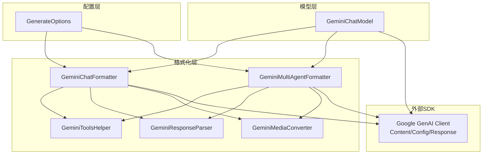
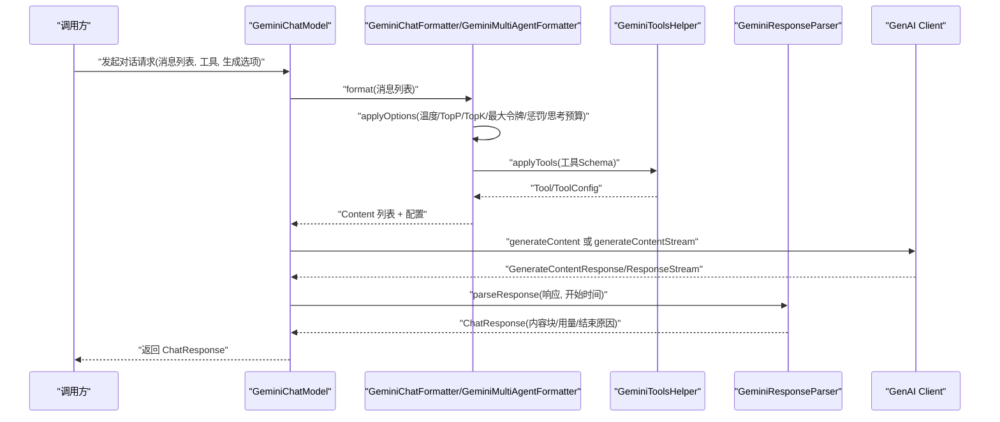
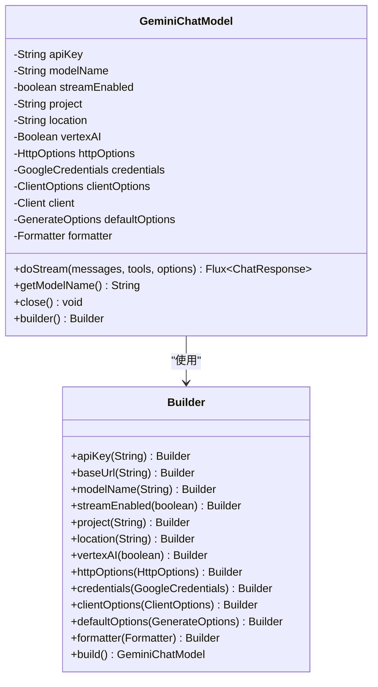
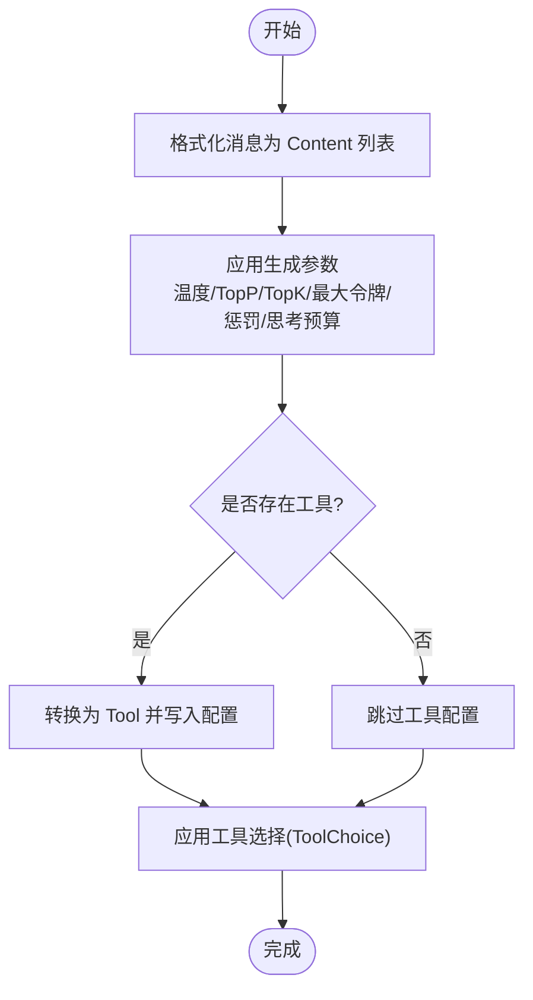
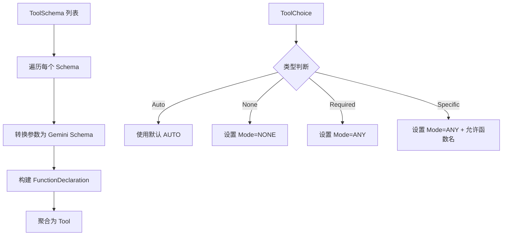
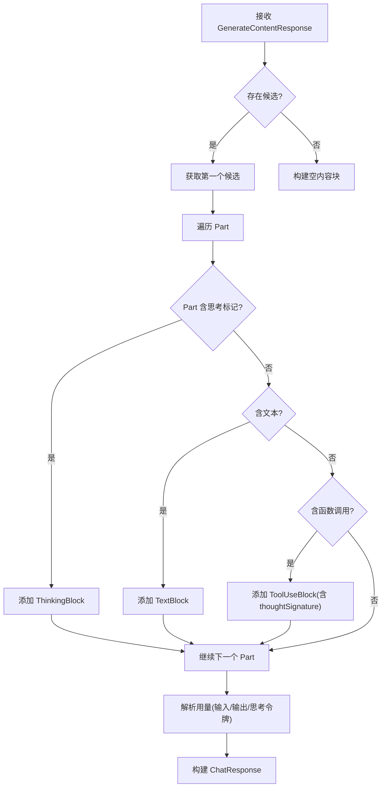
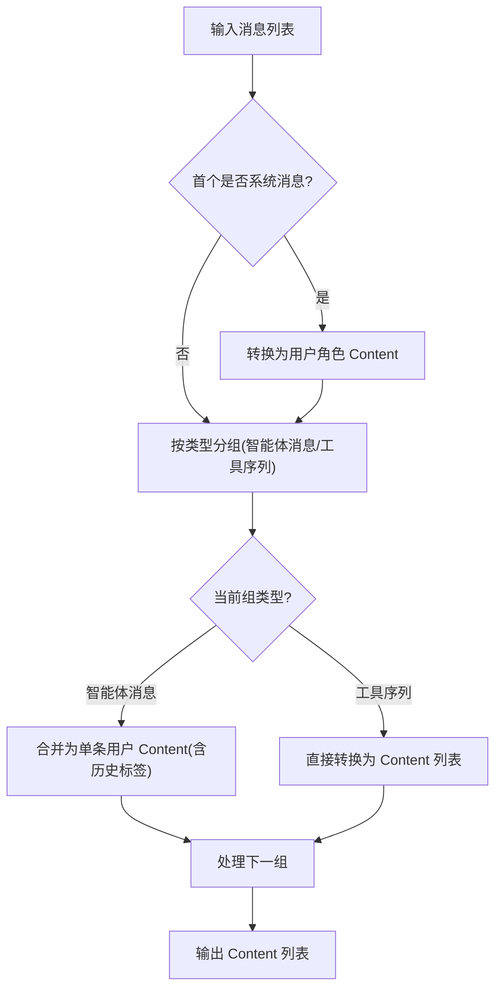
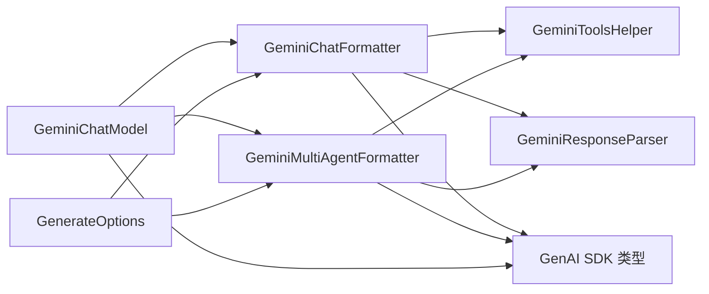

# Gemini 集成

<cite>
**本文引用的文件**
- [GeminiChatModel.java](file://agentscope-core/src/main/java/io/agentscope/core/model/GeminiChatModel.java)
- [GeminiChatFormatter.java](file://agentscope-core/src/main/java/io/agentscope/core/formatter/gemini/GeminiChatFormatter.java)
- [GeminiToolsHelper.java](file://agentscope-core/src/main/java/io/agentscope/core/formatter/gemini/GeminiToolsHelper.java)
- [GeminiResponseParser.java](file://agentscope-core/src/main/java/io/agentscope/core/formatter/gemini/GeminiResponseParser.java)
- [GeminiMultiAgentFormatter.java](file://agentscope-core/src/main/java/io/agentscope/core/formatter/gemini/GeminiMultiAgentFormatter.java)
- [GeminiMediaConverter.java](file://agentscope-core/src/main/java/io/agentscope/core/formatter/gemini/GeminiMediaConverter.java)
- [GenerateOptions.java](file://agentscope-core/src/main/java/io/agentscope/core/model/GenerateOptions.java)
- [GeminiProvider.java](file://agentscope-core/src/test/java/io/agentscope/core/e2e/providers/GeminiProvider.java)
- [GeminiChatFormatterTest.java](file://agentscope-core/src/test/java/io/agentscope/core/formatter/gemini/GeminiChatFormatterTest.java)
- [GeminiMultiAgentFormatterTest.java](file://agentscope-core/src/test/java/io/agentscope/core/formatter/gemini/GeminiMultiAgentFormatterTest.java)
</cite>

## 目录
1. [简介](#简介)
2. [项目结构](#项目结构)
3. [核心组件](#核心组件)
4. [架构总览](#架构总览)
5. [详细组件分析](#详细组件分析)
6. [依赖关系分析](#依赖关系分析)
7. [性能考虑](#性能考虑)
8. [故障排查指南](#故障排查指南)
9. [结论](#结论)
10. [附录：配置与使用示例](#附录配置与使用示例)

## 简介
本技术文档面向在 AgentScope 中集成 Google Gemini 模型提供商（含 Google AI Studio 与 Vertex AI）的开发者，系统性阐述 GeminiChatModel 的实现架构与关键特性，包括：
- 认证与端点配置（API Key、自定义 Base URL、Vertex AI 项目与区域）
- 多模态输入输出（文本、图像、音频、视频）
- 函数调用与工具使用
- 内容安全与生成配置映射
- 响应解析与用量统计
- 性能监控、成本控制与最佳实践

## 项目结构
Gemini 集成位于 agentscope-core 模块中，核心代码围绕以下层次组织：
- 模型层：GeminiChatModel 负责与官方 GenAI SDK 交互，封装请求构建、流式/非流式调用与资源关闭
- 格式化层：GeminiChatFormatter/GeminiMultiAgentFormatter 负责消息与工具配置到 Gemini Content/GenerateContentConfig 的转换
- 工具层：GeminiToolsHelper 负责将 ToolSchema 映射为 Gemini Tool/ToolConfig
- 响应层：GeminiResponseParser 负责将 GenerateContentResponse 解析为 AgentScope ChatResponse
- 多媒体层：GeminiMediaConverter 负责将 ImageBlock/AudioBlock/VideoBlock 转换为 Gemini Part.inlineData
- 配置层：GenerateOptions 提供统一的生成参数与默认值合并策略

图表来源
- [GeminiChatModel.java:55-149](file://agentscope-core/src/main/java/io/agentscope/core/model/GeminiChatModel.java#L55-L149)
- [GeminiChatFormatter.java:52-77](file://agentscope-core/src/main/java/io/agentscope/core/formatter/gemini/GeminiChatFormatter.java#L52-L77)
- [GeminiMultiAgentFormatter.java:48-81](file://agentscope-core/src/main/java/io/agentscope/core/formatter/gemini/GeminiMultiAgentFormatter.java#L48-L81)
- [GeminiToolsHelper.java:51-110](file://agentscope-core/src/main/java/io/agentscope/core/formatter/gemini/GeminiToolsHelper.java#L51-L110)
- [GeminiResponseParser.java:56-72](file://agentscope-core/src/main/java/io/agentscope/core/formatter/gemini/GeminiResponseParser.java#L56-L72)
- [GeminiMediaConverter.java:43-69](file://agentscope-core/src/main/java/io/agentscope/core/formatter/gemini/GeminiMediaConverter.java#L43-L69)

章节来源
- [GeminiChatModel.java:1-514](file://agentscope-core/src/main/java/io/agentscope/core/model/GeminiChatModel.java#L1-L514)
- [GeminiChatFormatter.java:1-209](file://agentscope-core/src/main/java/io/agentscope/core/formatter/gemini/GeminiChatFormatter.java#L1-L209)
- [GeminiMultiAgentFormatter.java:1-227](file://agentscope-core/src/main/java/io/agentscope/core/formatter/gemini/GeminiMultiAgentFormatter.java#L1-L227)
- [GeminiToolsHelper.java:1-248](file://agentscope-core/src/main/java/io/agentscope/core/formatter/gemini/GeminiToolsHelper.java#L1-L248)
- [GeminiResponseParser.java:1-219](file://agentscope-core/src/main/java/io/agentscope/core/formatter/gemini/GeminiResponseParser.java#L1-L219)
- [GeminiMediaConverter.java:1-200](file://agentscope-core/src/main/java/io/agentscope/core/formatter/gemini/GeminiMediaConverter.java#L1-L200)
- [GenerateOptions.java:1-874](file://agentscope-core/src/main/java/io/agentscope/core/model/GenerateOptions.java#L1-L874)

## 核心组件
- GeminiChatModel：基于官方 GenAI Java SDK 的客户端封装，支持 Gemini API 与 Vertex AI 双通道；负责构建 Client、组装 GenerateContentConfig、执行流式/非流式调用，并进行资源清理
- GeminiChatFormatter：将 AgentScope Msg 列表转换为 Gemini Content 列表，应用生成参数（温度、TopP、TopK、最大输出令牌、频率/存在惩罚、思考预算等），并处理工具与工具选择
- GeminiMultiAgentFormatter：针对多智能体对话场景，将历史消息合并为带标签的单条用户消息，保留工具序列的独立处理
- GeminiToolsHelper：将 ToolSchema 转换为 Gemini Tool（含函数声明与 JSON Schema 参数），并将 ToolChoice 转换为 ToolConfig（AUTO/NONE/ANY/ANY+allowedFunctionNames）
- GeminiResponseParser：解析 GenerateContentResponse，提取文本块、思考块、工具调用块与用量信息（输入/输出令牌、思考令牌）
- GeminiMediaConverter：将图片/音频/视频多媒体块转换为 Gemini Part.inlineData，支持 Base64 与 URL 源，校验扩展名与 MIME 类型
- GenerateOptions：统一的生成参数与默认值合并策略，支持连接级参数（API Key、Base URL、模型名、是否流式）与生成级参数（温度、TopP、TopK、最大令牌、思考预算、种子、缓存控制、并行工具调用等）

章节来源
- [GeminiChatModel.java:55-149](file://agentscope-core/src/main/java/io/agentscope/core/model/GeminiChatModel.java#L55-L149)
- [GeminiChatFormatter.java:52-209](file://agentscope-core/src/main/java/io/agentscope/core/formatter/gemini/GeminiChatFormatter.java#L52-L209)
- [GeminiMultiAgentFormatter.java:48-227](file://agentscope-core/src/main/java/io/agentscope/core/formatter/gemini/GeminiMultiAgentFormatter.java#L48-L227)
- [GeminiToolsHelper.java:51-248](file://agentscope-core/src/main/java/io/agentscope/core/formatter/gemini/GeminiToolsHelper.java#L51-L248)
- [GeminiResponseParser.java:56-219](file://agentscope-core/src/main/java/io/agentscope/core/formatter/gemini/GeminiResponseParser.java#L56-L219)
- [GeminiMediaConverter.java:43-200](file://agentscope-core/src/main/java/io/agentscope/core/formatter/gemini/GeminiMediaConverter.java#L43-L200)
- [GenerateOptions.java:31-874](file://agentscope-core/src/main/java/io/agentscope/core/model/GenerateOptions.java#L31-L874)

## 架构总览
下图展示从调用方到 Gemini API 的完整数据流，包括认证、参数映射、工具配置、多模态转换与响应解析。

图表来源
- [GeminiChatModel.java:224-311](file://agentscope-core/src/main/java/io/agentscope/core/model/GeminiChatModel.java#L224-L311)
- [GeminiChatFormatter.java:69-130](file://agentscope-core/src/main/java/io/agentscope/core/formatter/gemini/GeminiChatFormatter.java#L69-L130)
- [GeminiToolsHelper.java:198-246](file://agentscope-core/src/main/java/io/agentscope/core/formatter/gemini/GeminiToolsHelper.java#L198-L246)
- [GeminiResponseParser.java:72-126](file://agentscope-core/src/main/java/io/agentscope/core/formatter/gemini/GeminiResponseParser.java#L72-L126)

## 详细组件分析

### GeminiChatModel：模型适配与调用
- 支持 Gemini API 与 Vertex AI 双通道：通过 apiKey、project、location、vertexAI、credentials、clientOptions、httpOptions 控制端点与认证
- 流式与非流式两种模式：根据 streamEnabled 选择 generateContentStream 或 generateContent
- Builder 模式：提供丰富的可选参数，便于在不同环境（开发/生产/代理）灵活配置
- 资源管理：提供 close 方法确保 SDK 客户端正确释放

图表来源
- [GeminiChatModel.java:55-149](file://agentscope-core/src/main/java/io/agentscope/core/model/GeminiChatModel.java#L55-L149)
- [GeminiChatModel.java:343-512](file://agentscope-core/src/main/java/io/agentscope/core/model/GeminiChatModel.java#L343-L512)

章节来源
- [GeminiChatModel.java:73-198](file://agentscope-core/src/main/java/io/agentscope/core/model/GeminiChatModel.java#L73-L198)
- [GeminiChatModel.java:224-311](file://agentscope-core/src/main/java/io/agentscope/core/model/GeminiChatModel.java#L224-L311)
- [GeminiChatModel.java:336-512](file://agentscope-core/src/main/java/io/agentscope/core/model/GeminiChatModel.java#L336-L512)

### GeminiChatFormatter：消息与参数映射
- 将 AgentScope Msg 转换为 Gemini Content（角色映射、文本/多媒体 Part）
- 应用生成参数：温度、TopP、TopK（以 Float）、最大输出令牌、频率/存在惩罚、思考预算（ThinkingConfig）
- 工具与工具选择：将 ToolSchema 转为 Tool，ToolChoice 转为 ToolConfig

图表来源
- [GeminiChatFormatter.java:69-130](file://agentscope-core/src/main/java/io/agentscope/core/formatter/gemini/GeminiChatFormatter.java#L69-L130)
- [GeminiChatFormatter.java:192-207](file://agentscope-core/src/main/java/io/agentscope/core/formatter/gemini/GeminiChatFormatter.java#L192-L207)

章节来源
- [GeminiChatFormatter.java:69-130](file://agentscope-core/src/main/java/io/agentscope/core/formatter/gemini/GeminiChatFormatter.java#L69-L130)
- [GeminiChatFormatter.java:192-207](file://agentscope-core/src/main/java/io/agentscope/core/formatter/gemini/GeminiChatFormatter.java#L192-L207)

### GeminiToolsHelper：工具与工具选择
- ToolSchema → FunctionDeclaration（含 JSON Schema 参数）→ Tool
- ToolChoice 映射：
  - Auto：默认行为（不显式设置）
  - None：禁用工具调用（NONE）
  - Required：强制至少一次工具调用（ANY）
  - Specific：强制特定工具（ANY + allowedFunctionNames）

图表来源
- [GeminiToolsHelper.java:66-110](file://agentscope-core/src/main/java/io/agentscope/core/formatter/gemini/GeminiToolsHelper.java#L66-L110)
- [GeminiToolsHelper.java:212-246](file://agentscope-core/src/main/java/io/agentscope/core/formatter/gemini/GeminiToolsHelper.java#L212-L246)

章节来源
- [GeminiToolsHelper.java:66-110](file://agentscope-core/src/main/java/io/agentscope/core/formatter/gemini/GeminiToolsHelper.java#L66-L110)
- [GeminiToolsHelper.java:212-246](file://agentscope-core/src/main/java/io/agentscope/core/formatter/gemini/GeminiToolsHelper.java#L212-L246)

### GeminiResponseParser：响应解析与用量
- 提取候选内容中的文本、思考（thought=true）与函数调用（FunctionCall）
- 统计用量：输入令牌、候选输出令牌（剔除思考令牌后作为输出令牌）、耗时
- 将函数调用参数序列化为原始内容，必要时携带 thoughtSignature

图表来源
- [GeminiResponseParser.java:72-126](file://agentscope-core/src/main/java/io/agentscope/core/formatter/gemini/GeminiResponseParser.java#L72-L126)
- [GeminiResponseParser.java:135-161](file://agentscope-core/src/main/java/io/agentscope/core/formatter/gemini/GeminiResponseParser.java#L135-L161)
- [GeminiResponseParser.java:170-217](file://agentscope-core/src/main/java/io/agentscope/core/formatter/gemini/GeminiResponseParser.java#L170-L217)

章节来源
- [GeminiResponseParser.java:72-126](file://agentscope-core/src/main/java/io/agentscope/core/formatter/gemini/GeminiResponseParser.java#L72-L126)
- [GeminiResponseParser.java:135-161](file://agentscope-core/src/main/java/io/agentscope/core/formatter/gemini/GeminiResponseParser.java#L135-L161)
- [GeminiResponseParser.java:170-217](file://agentscope-core/src/main/java/io/agentscope/core/formatter/gemini/GeminiResponseParser.java#L170-L217)

### GeminiMultiAgentFormatter：多智能体对话
- 将系统消息转换为用户角色（Gemini 不支持系统角色）
- 将连续的智能体消息合并为单条用户消息，使用特殊标签包裹历史
- 工具序列保持独立（助手工具调用 + 用户工具结果）

图表来源
- [GeminiMultiAgentFormatter.java:84-130](file://agentscope-core/src/main/java/io/agentscope/core/formatter/gemini/GeminiMultiAgentFormatter.java#L84-L130)
- [GeminiMultiAgentFormatter.java:165-204](file://agentscope-core/src/main/java/io/agentscope/core/formatter/gemini/GeminiMultiAgentFormatter.java#L165-L204)

章节来源
- [GeminiMultiAgentFormatter.java:48-135](file://agentscope-core/src/main/java/io/agentscope/core/formatter/gemini/GeminiMultiAgentFormatter.java#L48-L135)
- [GeminiMultiAgentFormatter.java:165-204](file://agentscope-core/src/main/java/io/agentscope/core/formatter/gemini/GeminiMultiAgentFormatter.java#L165-L204)

### GeminiMediaConverter：多模态输入
- 支持图片、音频、视频的 Base64 与 URL 源
- 校验扩展名与 MIME 类型，构造 Blob.inlineData
- 对于 URL，支持本地路径与远程 URL 下载

章节来源
- [GeminiMediaConverter.java:43-126](file://agentscope-core/src/main/java/io/agentscope/core/formatter/gemini/GeminiMediaConverter.java#L43-L126)
- [GeminiMediaConverter.java:137-184](file://agentscope-core/src/main/java/io/agentscope/core/formatter/gemini/GeminiMediaConverter.java#L137-L184)

## 依赖关系分析
- GeminiChatModel 依赖格式化器与响应解析器，通过 Formatter 接口解耦消息与工具配置
- GeminiChatFormatter 与 GeminiMultiAgentFormatter 共享工具与响应解析能力
- GeminiToolsHelper 与 GeminiResponseParser 与 GenAI SDK 类型强相关，承担参数与响应的桥接
- GenerateOptions 在模型层与格式化层之间传递统一的生成参数

图表来源
- [GeminiChatModel.java:55-149](file://agentscope-core/src/main/java/io/agentscope/core/model/GeminiChatModel.java#L55-L149)
- [GeminiChatFormatter.java:52-77](file://agentscope-core/src/main/java/io/agentscope/core/formatter/gemini/GeminiChatFormatter.java#L52-L77)
- [GeminiMultiAgentFormatter.java:48-81](file://agentscope-core/src/main/java/io/agentscope/core/formatter/gemini/GeminiMultiAgentFormatter.java#L48-L81)
- [GeminiToolsHelper.java:51-110](file://agentscope-core/src/main/java/io/agentscope/core/formatter/gemini/GeminiToolsHelper.java#L51-L110)
- [GeminiResponseParser.java:56-72](file://agentscope-core/src/main/java/io/agentscope/core/formatter/gemini/GeminiResponseParser.java#L56-L72)
- [GenerateOptions.java:31-95](file://agentscope-core/src/main/java/io/agentscope/core/model/GenerateOptions.java#L31-L95)

章节来源
- [GeminiChatModel.java:55-149](file://agentscope-core/src/main/java/io/agentscope/core/model/GeminiChatModel.java#L55-L149)
- [GeminiChatFormatter.java:52-77](file://agentscope-core/src/main/java/io/agentscope/core/formatter/gemini/GeminiChatFormatter.java#L52-L77)
- [GeminiMultiAgentFormatter.java:48-81](file://agentscope-core/src/main/java/io/agentscope/core/formatter/gemini/GeminiMultiAgentFormatter.java#L48-L81)
- [GeminiToolsHelper.java:51-110](file://agentscope-core/src/main/java/io/agentscope/core/formatter/gemini/GeminiToolsHelper.java#L51-L110)
- [GeminiResponseParser.java:56-72](file://agentscope-core/src/main/java/io/agentscope/core/formatter/gemini/GeminiResponseParser.java#L56-L72)
- [GenerateOptions.java:31-95](file://agentscope-core/src/main/java/io/agentscope/core/model/GenerateOptions.java#L31-L95)

## 性能考虑
- 流式输出：启用流式可降低首字节延迟，适合实时交互；非流式适合批处理与稳定性要求高的场景
- 生成参数权衡：温度与 TopK/TopP 影响多样性与确定性；合理设置最大输出令牌避免超长响应
- 工具调用并发：并行工具调用可提升吞吐，但需评估后端并发限制与成本
- 多媒体传输：Base64 会增大体积，优先使用 URL 源并确保网络稳定
- 用量统计：利用响应中的输入/输出令牌统计进行成本控制与优化

## 故障排查指南
- 认证失败：检查 API Key 是否正确传入；Vertex AI 模式下确认 project、location、credentials 配置
- 端点问题：自定义 Base URL 仅在 Gemini API 场景生效；Vertex AI 使用 SDK 默认端点或通过 ClientOptions/HttpOptions 配置
- 工具调用异常：核对 ToolSchema 的 JSON Schema 结构与 ToolChoice 映射；确认 allowedFunctionNames 与工具名称一致
- 多媒体错误：检查扩展名是否在支持列表内；Base64 数据与 MIME 类型匹配；URL 可访问且文件存在
- 响应解析异常：关注 FunctionCall 参数序列化与 thoughtSignature 的处理；留意候选为空的情况

章节来源
- [GeminiChatModel.java:118-148](file://agentscope-core/src/main/java/io/agentscope/core/model/GeminiChatModel.java#L118-L148)
- [GeminiToolsHelper.java:118-171](file://agentscope-core/src/main/java/io/agentscope/core/formatter/gemini/GeminiToolsHelper.java#L118-L171)
- [GeminiMediaConverter.java:165-184](file://agentscope-core/src/main/java/io/agentscope/core/formatter/gemini/GeminiMediaConverter.java#L165-L184)
- [GeminiResponseParser.java:170-217](file://agentscope-core/src/main/java/io/agentscope/core/formatter/gemini/GeminiResponseParser.java#L170-L217)

## 结论
本集成以清晰的分层设计实现了 Gemini API 与 Vertex AI 的统一接入，覆盖多模态、工具调用、思考模式与用量统计等关键能力。通过 GenerateOptions 的参数合并策略与 Builder 模式的灵活配置，开发者可在不同部署环境下快速落地。

## 附录：配置与使用示例

### 认证与端点配置
- Gemini API：提供 apiKey 即可；可通过 baseUrl 自定义端点（如企业代理）
- Vertex AI：提供 project、location、credentials；可选 vertexAI 标志；通过 ClientOptions/HttpOptions 进一步定制

章节来源
- [GeminiChatModel.java:92-148](file://agentscope-core/src/main/java/io/agentscope/core/model/GeminiChatModel.java#L92-L148)
- [GeminiProvider.java:55-74](file://agentscope-core/src/test/java/io/agentscope/core/e2e/providers/GeminiProvider.java#L55-L74)

### 多模态输入
- 图片/音频/视频：支持 Base64 与 URL 源；自动校验扩展名与 MIME 类型
- 建议优先使用 URL 源以减少传输体积

章节来源
- [GeminiMediaConverter.java:67-126](file://agentscope-core/src/main/java/io/agentscope/core/formatter/gemini/GeminiMediaConverter.java#L67-L126)
- [GeminiChatFormatterTest.java:46-62](file://agentscope-core/src/test/java/io/agentscope/core/formatter/gemini/GeminiChatFormatterTest.java#L46-L62)

### 函数调用与工具使用
- 工具 Schema：遵循 JSON Schema；参数类型映射至 Gemini Type
- 工具选择：Auto/None/Required/Specific；Required/Speficic 会强制工具调用
- 并行工具调用：通过 GenerateOptions 启用

章节来源
- [GeminiToolsHelper.java:66-110](file://agentscope-core/src/main/java/io/agentscope/core/formatter/gemini/GeminiToolsHelper.java#L66-L110)
- [GeminiToolsHelper.java:212-246](file://agentscope-core/src/main/java/io/agentscope/core/formatter/gemini/GeminiToolsHelper.java#L212-L246)
- [GenerateOptions.java:728-731](file://agentscope-core/src/main/java/io/agentscope/core/model/GenerateOptions.java#L728-L731)

### 生成配置与思考模式
- 温度、TopP、TopK、最大输出令牌、频率/存在惩罚、思考预算
- 思考模式：通过 ThinkingConfig 启用并设置思考预算

章节来源
- [GeminiChatFormatter.java:80-130](file://agentscope-core/src/main/java/io/agentscope/core/formatter/gemini/GeminiChatFormatter.java#L80-L130)

### 多智能体对话
- 系统消息转换为用户角色
- 历史消息合并为带标签的单条用户消息
- 工具序列保持独立处理

章节来源
- [GeminiMultiAgentFormatter.java:84-130](file://agentscope-core/src/main/java/io/agentscope/core/formatter/gemini/GeminiMultiAgentFormatter.java#L84-L130)
- [GeminiMultiAgentFormatterTest.java:36-52](file://agentscope-core/src/test/java/io/agentscope/core/formatter/gemini/GeminiMultiAgentFormatterTest.java#L36-L52)

### 响应格式与用量
- 文本块、思考块、工具调用块
- 输入令牌、输出令牌（剔除思考令牌）、耗时

章节来源
- [GeminiResponseParser.java:72-126](file://agentscope-core/src/main/java/io/agentscope/core/formatter/gemini/GeminiResponseParser.java#L72-L126)
- [GeminiResponseParser.java:135-161](file://agentscope-core/src/main/java/io/agentscope/core/formatter/gemini/GeminiResponseParser.java#L135-L161)