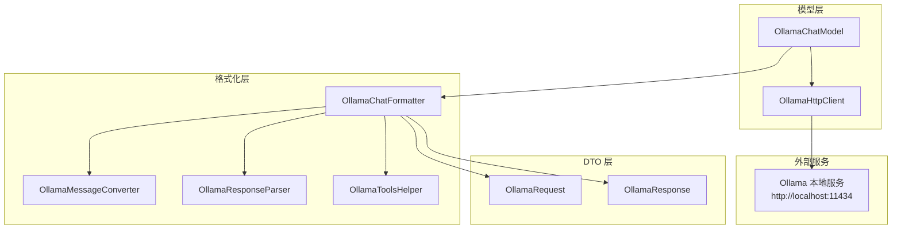
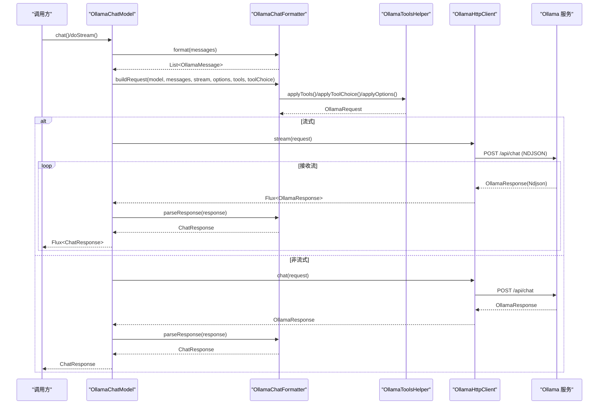
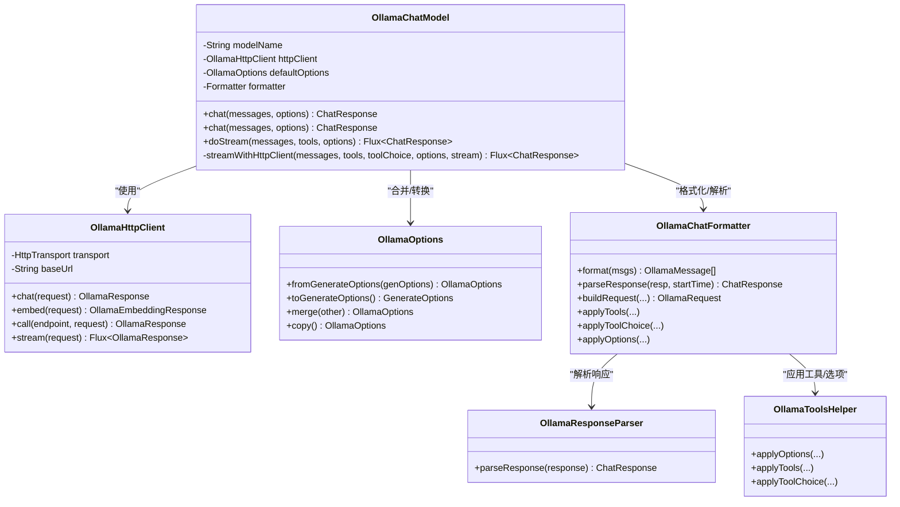
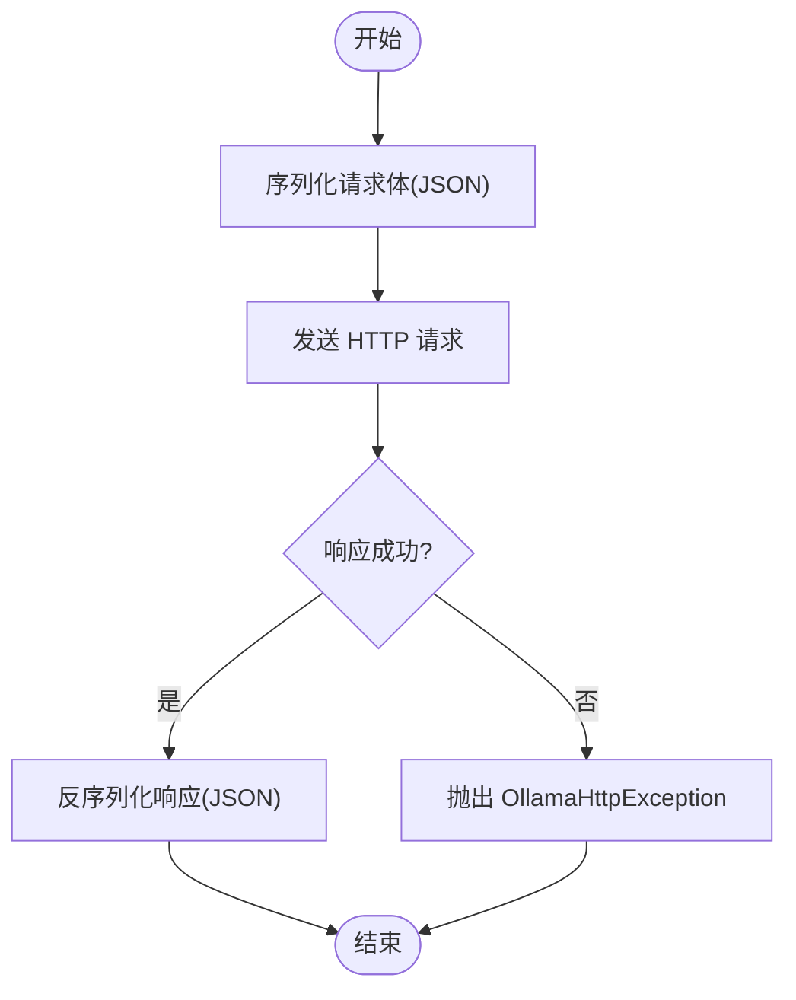
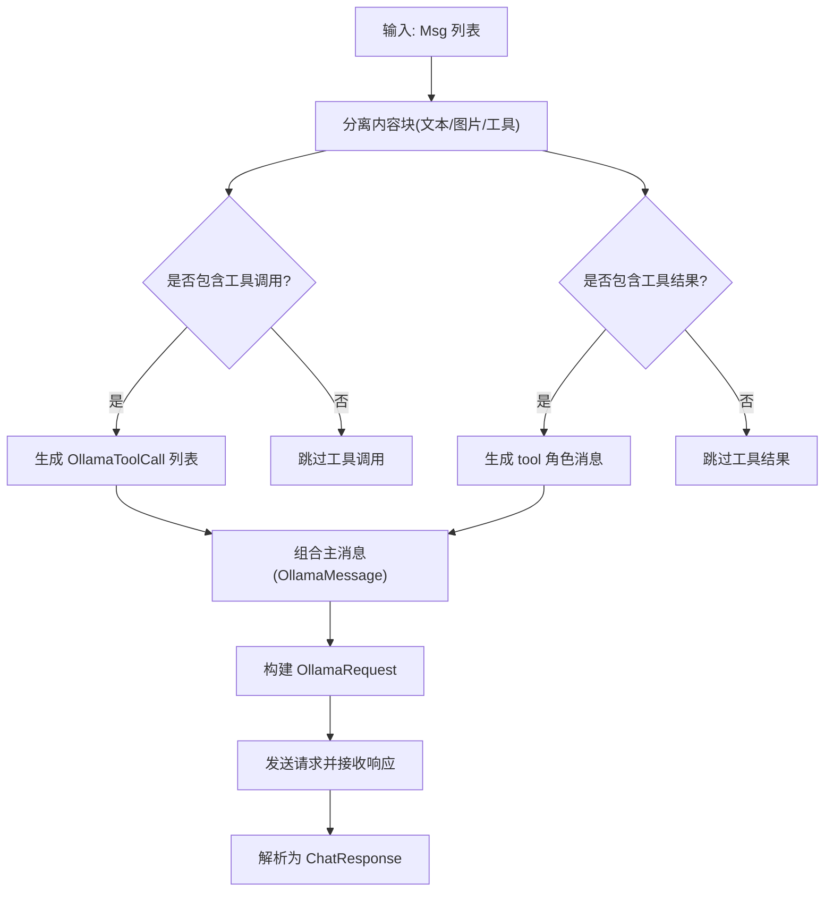
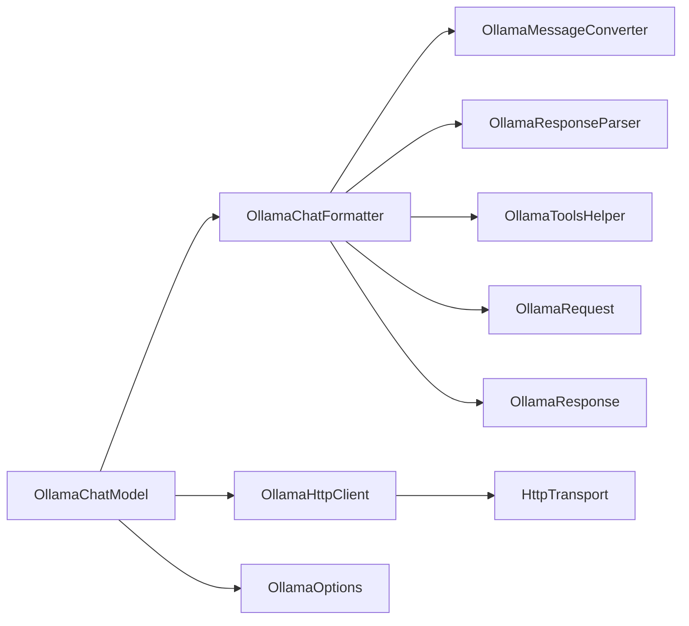

# Ollama 集成

<cite>
**本文引用的文件**
- [OllamaChatModel.java](file://agentscope-core/src/main/java/io/agentscope/core/model/OllamaChatModel.java)
- [OllamaHttpClient.java](file://agentscope-core/src/main/java/io/agentscope/core/model/OllamaHttpClient.java)
- [OllamaOptions.java](file://agentscope-core/src/main/java/io/agentscope/core/model/ollama/OllamaOptions.java)
- [OllamaChatFormatter.java](file://agentscope-core/src/main/java/io/agentscope/core/formatter/ollama/OllamaChatFormatter.java)
- [OllamaMessageConverter.java](file://agentscope-core/src/main/java/io/agentscope/core/formatter/ollama/OllamaMessageConverter.java)
- [OllamaResponseParser.java](file://agentscope-core/src/main/java/io/agentscope/core/formatter/ollama/OllamaResponseParser.java)
- [OllamaToolsHelper.java](file://agentscope-core/src/main/java/io/agentscope/core/formatter/ollama/OllamaToolsHelper.java)
- [OllamaRequest.java](file://agentscope-core/src/main/java/io/agentscope/core/formatter/ollama/dto/OllamaRequest.java)
- [OllamaResponse.java](file://agentscope-core/src/main/java/io/agentscope/core/formatter/ollama/dto/OllamaResponse.java)
- [OllamaChatFormatterTest.java](file://agentscope-core/src/test/java/io/agentscope/core/formatter/ollama/OllamaChatFormatterTest.java)
</cite>

## 目录
1. [简介](#简介)
2. [项目结构](#项目结构)
3. [核心组件](#核心组件)
4. [架构总览](#架构总览)
5. [详细组件分析](#详细组件分析)
6. [依赖关系分析](#依赖关系分析)
7. [性能考虑](#性能考虑)
8. [故障排除指南](#故障排除指南)
9. [结论](#结论)
10. [附录：配置与使用示例](#附录配置与使用示例)

## 简介
本文件面向在 AgentScope 中集成 Ollama 本地大语言模型（LLM）的开发者，系统性讲解 OllamaChatModel 的实现原理与使用方法，覆盖以下主题：
- 本地 LLM 服务的 HTTP API 调用机制
- 模型管理、本地部署与容器化部署方式
- 流式响应处理、模型参数配置与生成选项设置
- 完整配置示例（本地服务地址、模型名称与参数调整）
- Ollama 特有的模型列表获取、模型拉取与本地推理优化
- 性能调优、资源管理与故障排除

## 项目结构
Ollama 集成位于 agentscope-core 模块下，采用“模型层 + 格式化层 + DTO 层 + 工具层”的分层设计：
- 模型层：OllamaChatModel 提供统一的聊天接口，封装 HTTP 客户端与超时重试策略
- 格式化层：将 AgentScope 的 Msg 对象转换为 Ollama 请求/响应 DTO，并解析返回结果
- DTO 层：OllamaRequest/OllamaResponse 及其子对象，映射 Ollama API 的请求与响应结构
- 工具层：OllamaToolsHelper 负责工具定义、工具选择策略与参数合并

图表来源
- [OllamaChatModel.java:53-287](file://agentscope-core/src/main/java/io/agentscope/core/model/OllamaChatModel.java#L53-L287)
- [OllamaHttpClient.java:55-323](file://agentscope-core/src/main/java/io/agentscope/core/model/OllamaHttpClient.java#L55-L323)
- [OllamaChatFormatter.java:51-473](file://agentscope-core/src/main/java/io/agentscope/core/formatter/ollama/OllamaChatFormatter.java#L51-L473)
- [OllamaRequest.java:28-203](file://agentscope-core/src/main/java/io/agentscope/core/formatter/ollama/dto/OllamaRequest.java#L28-L203)
- [OllamaResponse.java:27-176](file://agentscope-core/src/main/java/io/agentscope/core/formatter/ollama/dto/OllamaResponse.java#L27-L176)

章节来源
- [OllamaChatModel.java:53-287](file://agentscope-core/src/main/java/io/agentscope/core/model/OllamaChatModel.java#L53-L287)
- [OllamaHttpClient.java:55-323](file://agentscope-core/src/main/java/io/agentscope/core/model/OllamaHttpClient.java#L55-L323)
- [OllamaChatFormatter.java:51-473](file://agentscope-core/src/main/java/io/agentscope/core/formatter/ollama/OllamaChatFormatter.java#L51-L473)

## 核心组件
- OllamaChatModel：面向 AgentScope 的聊天模型实现，支持同步与流式调用，内置超时与重试策略，支持工具调用与链式思考（think）能力
- OllamaHttpClient：封装 HTTP 传输，负责将请求序列化为 JSON 并发送到 /api/chat 或 /api/embed，支持流式 NDJSON 解析
- OllamaOptions：Ollama 参数的强类型封装，涵盖模型加载参数（如 GPU offload、上下文长度等）与推理采样参数（如温度、top_p、重复惩罚等），并可与通用 GenerateOptions 互转
- OllamaChatFormatter：消息格式化器，负责将 AgentScope 的 Msg 转换为 Ollama 请求 DTO，并将响应解析为 ChatResponse
- OllamaMessageConverter：单条消息转换器，处理文本、图片与工具调用
- OllamaResponseParser：响应解析器，将 OllamaResponse 映射为 ChatResponse，包含用量统计与元数据
- OllamaToolsHelper：工具与选项应用器，负责将工具定义、工具选择策略与 OllamaOptions 合并到请求中

章节来源
- [OllamaChatModel.java:53-287](file://agentscope-core/src/main/java/io/agentscope/core/model/OllamaChatModel.java#L53-L287)
- [OllamaHttpClient.java:55-323](file://agentscope-core/src/main/java/io/agentscope/core/model/OllamaHttpClient.java#L55-L323)
- [OllamaOptions.java:42-1348](file://agentscope-core/src/main/java/io/agentscope/core/model/ollama/OllamaOptions.java#L42-L1348)
- [OllamaChatFormatter.java:51-473](file://agentscope-core/src/main/java/io/agentscope/core/formatter/ollama/OllamaChatFormatter.java#L51-L473)
- [OllamaMessageConverter.java:41-225](file://agentscope-core/src/main/java/io/agentscope/core/formatter/ollama/OllamaMessageConverter.java#L41-L225)
- [OllamaResponseParser.java:38-127](file://agentscope-core/src/main/java/io/agentscope/core/formatter/ollama/OllamaResponseParser.java#L38-L127)
- [OllamaToolsHelper.java:41-200](file://agentscope-core/src/main/java/io/agentscope/core/formatter/ollama/OllamaToolsHelper.java#L41-L200)

## 架构总览
OllamaChatModel 通过格式化器将 AgentScope 的消息与工具信息转换为 OllamaRequest，再由 OllamaHttpClient 发送到本地 Ollama 服务；服务端返回的 OllamaResponse 经由 OllamaResponseParser 转换为 ChatResponse，最终返回给上层。

图表来源
- [OllamaChatModel.java:135-233](file://agentscope-core/src/main/java/io/agentscope/core/model/OllamaChatModel.java#L135-L233)
- [OllamaChatFormatter.java:441-462](file://agentscope-core/src/main/java/io/agentscope/core/formatter/ollama/OllamaChatFormatter.java#L441-L462)
- [OllamaToolsHelper.java:142-177](file://agentscope-core/src/main/java/io/agentscope/core/formatter/ollama/OllamaToolsHelper.java#L142-L177)
- [OllamaHttpClient.java:183-232](file://agentscope-core/src/main/java/io/agentscope/core/model/OllamaHttpClient.java#L183-L232)
- [OllamaResponseParser.java:46-126](file://agentscope-core/src/main/java/io/agentscope/core/formatter/ollama/OllamaResponseParser.java#L46-L126)

## 详细组件分析

### OllamaChatModel：本地 LLM 聊天模型
- 角色与职责
  - 封装 Ollama 服务访问，支持同步与流式两种调用模式
  - 统一消息格式化与响应解析流程
  - 应用默认与运行时 OllamaOptions，合并超时与重试策略
  - 支持工具调用与链式思考（think）能力
- 关键流程
  - chat()/chatWithOptions：构建请求并调用 HTTP 客户端，非流式阻塞等待
  - doStream：构建请求后通过 HTTP 客户端流式接收响应，逐条解析并返回
  - streamWithHttpClient：统一流与非流逻辑，负责合并选项、格式化消息、调用客户端、解析响应与应用超时重试
- 错误处理
  - 在非流式场景捕获异常并转为错误流
  - 在流式场景对单条 NDJSON 解析失败进行日志记录并跳过
- 性能与并发
  - 非流式调用使用有界弹性调度器执行网络请求
  - 流式调用基于 Reactor Flux 异步处理

图表来源
- [OllamaChatModel.java:53-287](file://agentscope-core/src/main/java/io/agentscope/core/model/OllamaChatModel.java#L53-L287)
- [OllamaHttpClient.java:55-323](file://agentscope-core/src/main/java/io/agentscope/core/model/OllamaHttpClient.java#L55-L323)
- [OllamaOptions.java:359-454](file://agentscope-core/src/main/java/io/agentscope/core/model/ollama/OllamaOptions.java#L359-L454)
- [OllamaChatFormatter.java:414-462](file://agentscope-core/src/main/java/io/agentscope/core/formatter/ollama/OllamaChatFormatter.java#L414-L462)
- [OllamaResponseParser.java:46-126](file://agentscope-core/src/main/java/io/agentscope/core/formatter/ollama/OllamaResponseParser.java#L46-L126)
- [OllamaToolsHelper.java:56-106](file://agentscope-core/src/main/java/io/agentscope/core/formatter/ollama/OllamaToolsHelper.java#L56-L106)

章节来源
- [OllamaChatModel.java:106-233](file://agentscope-core/src/main/java/io/agentscope/core/model/OllamaChatModel.java#L106-L233)

### OllamaHttpClient：HTTP 客户端与流式处理
- 角色与职责
  - 提供同步与异步（流式）调用能力
  - 负责 JSON 序列化/反序列化、HTTP 头部设置与 NDJSON 流解析
  - 统一封装错误类型，便于上层处理
- 关键点
  - 默认基础 URL 为 http://localhost:11434
  - 流式请求通过 TransportConstants.STREAM_FORMAT_NDJSON 指示 OkHttpTransport 进行逐行解析
  - 对 Ollama 返回的 error 字段进行包装抛出
- 异常体系
  - OllamaHttpException：携带状态码与响应体，便于诊断

图表来源
- [OllamaHttpClient.java:122-175](file://agentscope-core/src/main/java/io/agentscope/core/model/OllamaHttpClient.java#L122-L175)
- [OllamaHttpClient.java:183-232](file://agentscope-core/src/main/java/io/agentscope/core/model/OllamaHttpClient.java#L183-L232)

章节来源
- [OllamaHttpClient.java:59-248](file://agentscope-core/src/main/java/io/agentscope/core/model/OllamaHttpClient.java#L59-L248)

### OllamaOptions：参数配置与互转
- 角色与职责
  - 提供 Ollama 模型加载参数（如 num_ctx、num_gpu、low_vram 等）与推理参数（如 temperature、top_p、repeat_penalty 等）
  - 支持从通用 GenerateOptions 转换为 OllamaOptions，以及反向转换
  - 提供 merge 与 copy，便于默认值与运行时参数的合并
- 使用建议
  - 在 Builder 中按需设置采样参数与上下文控制
  - 通过 additionalBodyParams 注入未显式暴露的参数

章节来源
- [OllamaOptions.java:42-1348](file://agentscope-core/src/main/java/io/agentscope/core/model/ollama/OllamaOptions.java#L42-L1348)

### OllamaChatFormatter：消息格式化与工具应用
- 角色与职责
  - 将 AgentScope 的 Msg 列表转换为 OllamaMessage 列表
  - 构建 OllamaRequest，应用工具定义、工具选择策略与 OllamaOptions
  - 解析 OllamaResponse 为 ChatResponse
- 关键流程
  - format：遍历消息，分离文本、图片、工具调用与工具结果，生成 OllamaMessage
  - buildRequest：组装 model、messages、stream、tools、tool_choice、options
  - applyTools/applyToolChoice/applyOptions：将工具与参数写入请求
  - parseResponse：提取文本内容、工具调用、用量与元数据

图表来源
- [OllamaChatFormatter.java:72-310](file://agentscope-core/src/main/java/io/agentscope/core/formatter/ollama/OllamaChatFormatter.java#L72-L310)
- [OllamaChatFormatter.java:441-462](file://agentscope-core/src/main/java/io/agentscope/core/formatter/ollama/OllamaChatFormatter.java#L441-L462)
- [OllamaResponseParser.java:46-126](file://agentscope-core/src/main/java/io/agentscope/core/formatter/ollama/OllamaResponseParser.java#L46-L126)

章节来源
- [OllamaChatFormatter.java:51-473](file://agentscope-core/src/main/java/io/agentscope/core/formatter/ollama/OllamaChatFormatter.java#L51-L473)
- [OllamaResponseParser.java:38-127](file://agentscope-core/src/main/java/io/agentscope/core/formatter/ollama/OllamaResponseParser.java#L38-L127)

### OllamaMessageConverter 与 OllamaToolsHelper
- OllamaMessageConverter：将单条 Msg 转换为 OllamaMessage，处理文本、图片（Base64）与工具调用
- OllamaToolsHelper：
  - 将 ToolSchema 转换为 OllamaTool 并写入请求
  - 将 ToolChoice 转换为 Ollama 的字符串或函数对象
  - 将 OllamaOptions 合并为 Map 并写入 request.options，同时提升 format、keep_alive、think 等字段到顶层

章节来源
- [OllamaMessageConverter.java:41-225](file://agentscope-core/src/main/java/io/agentscope/core/formatter/ollama/OllamaMessageConverter.java#L41-L225)
- [OllamaToolsHelper.java:41-200](file://agentscope-core/src/main/java/io/agentscope/core/formatter/ollama/OllamaToolsHelper.java#L41-L200)

## 依赖关系分析
- 组件耦合
  - OllamaChatModel 依赖 OllamaChatFormatter、OllamaHttpClient 与 OllamaOptions
  - OllamaChatFormatter 依赖 OllamaMessageConverter、OllamaResponseParser、OllamaToolsHelper 与 DTO 层
  - OllamaHttpClient 依赖 HttpTransport 抽象，便于替换底层实现
- 外部依赖
  - Ollama 本地服务（默认 http://localhost:11434）
  - JsonUtils：统一 JSON 编解码
  - Reactor：流式处理与背压

图表来源
- [OllamaChatModel.java:53-287](file://agentscope-core/src/main/java/io/agentscope/core/model/OllamaChatModel.java#L53-L287)
- [OllamaChatFormatter.java:51-473](file://agentscope-core/src/main/java/io/agentscope/core/formatter/ollama/OllamaChatFormatter.java#L51-L473)
- [OllamaHttpClient.java:55-323](file://agentscope-core/src/main/java/io/agentscope/core/model/OllamaHttpClient.java#L55-L323)

章节来源
- [OllamaChatModel.java:53-287](file://agentscope-core/src/main/java/io/agentscope/core/model/OllamaChatModel.java#L53-L287)
- [OllamaChatFormatter.java:51-473](file://agentscope-core/src/main/java/io/agentscope/core/formatter/ollama/OllamaChatFormatter.java#L51-L473)
- [OllamaHttpClient.java:55-323](file://agentscope-core/src/main/java/io/agentscope/core/model/OllamaHttpClient.java#L55-L323)

## 性能考虑
- 上下文与批处理
  - num_ctx 控制上下文窗口大小，影响内存占用与推理速度
  - num_batch 控制提示评估时的批处理大小，影响吞吐
- GPU 加速与显存
  - num_gpu 指定 GPU offload 层数；low_vram 在显存紧张时启用
  - f16_kv 使用半精度缓存键值，平衡性能与显存
- 采样与多样性
  - temperature、top_k、top_p、min_p、tfs_z、typical_p、mirostat 等参数影响输出质量与稳定性
- 线程与 NUMA
  - num_thread 与 numa 可根据多核/多路 CPU 场景优化吞吐
- 流式与并发
  - 流式响应减少首字延迟，适合交互式场景
  - 非流式调用使用有界弹性线程池，避免阻塞主线程

## 故障排除指南
- 常见错误与定位
  - JSON 序列化/反序列化异常：检查请求/响应 DTO 字段映射与命名策略
  - HTTP 传输异常：确认本地服务可达与端口正确（默认 11434）
  - 流式解析失败：关注 NDJSON 行级解析日志，单行错误不会中断整体流
  - Ollama 返回 error：捕获 OllamaHttpException，读取状态码与响应体
- 单元测试参考
  - OllamaChatFormatterTest：验证消息格式化、工具应用与请求构建
  - OllamaChatModelTest/OllamaHttpClientTest：验证模型调用与 HTTP 客户端行为

章节来源
- [OllamaHttpClient.java:122-175](file://agentscope-core/src/main/java/io/agentscope/core/model/OllamaHttpClient.java#L122-L175)
- [OllamaHttpClient.java:229-231](file://agentscope-core/src/main/java/io/agentscope/core/model/OllamaHttpClient.java#L229-L231)
- [OllamaChatFormatterTest.java:442-457](file://agentscope-core/src/test/java/io/agentscope/core/formatter/ollama/OllamaChatFormatterTest.java#L442-L457)

## 结论
OllamaChatModel 通过清晰的分层设计与完善的错误处理，为 AgentScope 提供了稳定、可扩展的本地 LLM 集成方案。借助 OllamaOptions 的丰富参数与流式响应机制，可在不同硬件与业务场景下灵活调优性能与效果。

## 附录：配置与使用示例
以下示例展示如何在 AgentScope 中配置并使用 OllamaChatModel。请根据实际环境调整本地服务地址与模型名称。

- 基本配置
  - 本地服务地址：http://localhost:11434（默认）
  - 模型名称：例如 llama3、qwen 等已加载模型
- 生成选项与参数
  - 温度、top_k、top_p、最大生成长度、重复惩罚、停止词等
  - 通过 OllamaOptions.Builder 设置，或从通用 GenerateOptions 转换
- 工具调用
  - 定义 ToolSchema 并传入 chat/doStream，OllamaToolsHelper 会自动应用到请求
- 流式与非流式
  - 流式：适用于实时对话与增量输出
  - 非流式：适用于批量处理与一次性结果

章节来源
- [OllamaChatModel.java:70-95](file://agentscope-core/src/main/java/io/agentscope/core/model/OllamaChatModel.java#L70-L95)
- [OllamaOptions.java:359-454](file://agentscope-core/src/main/java/io/agentscope/core/model/ollama/OllamaOptions.java#L359-L454)
- [OllamaToolsHelper.java:142-177](file://agentscope-core/src/main/java/io/agentscope/core/formatter/ollama/OllamaToolsHelper.java#L142-L177)