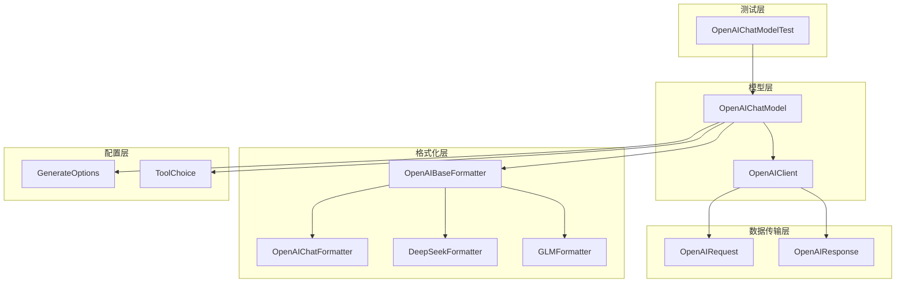
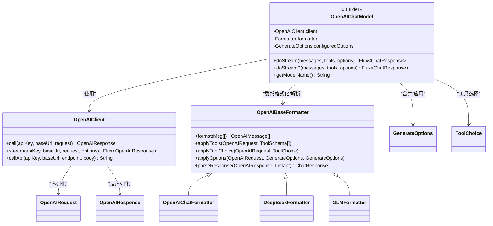
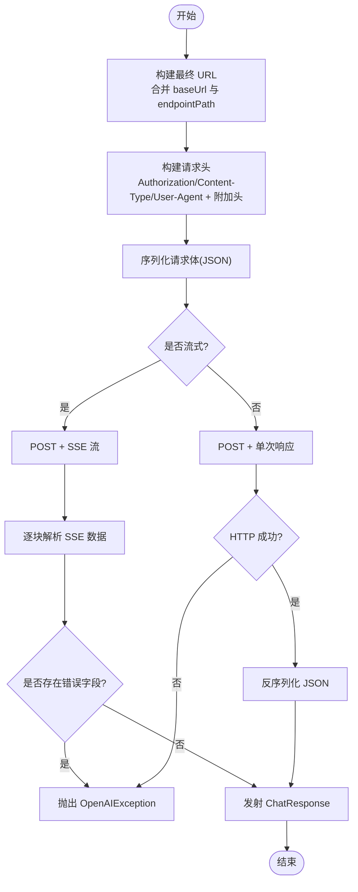
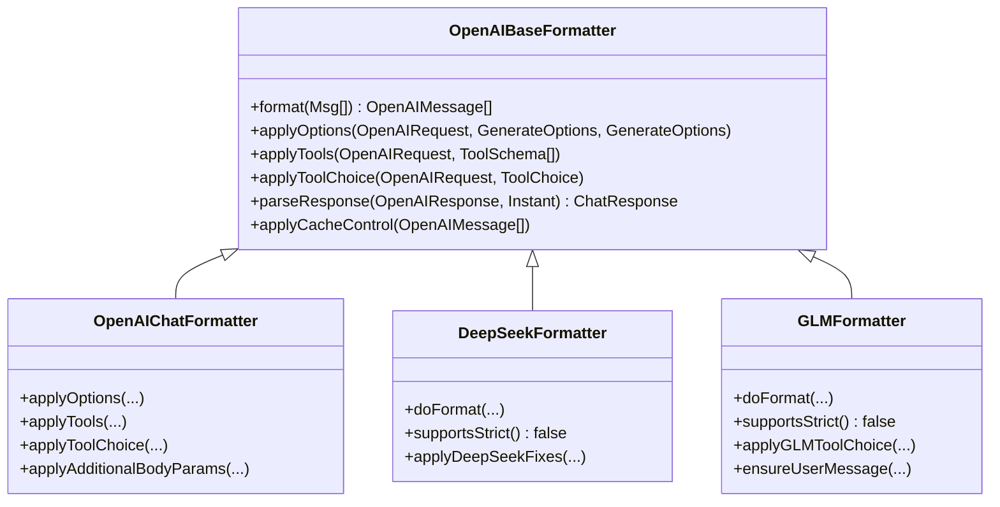
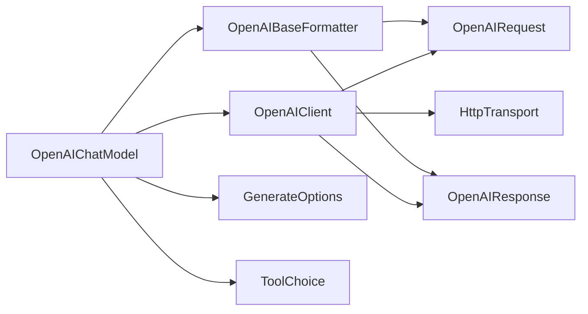
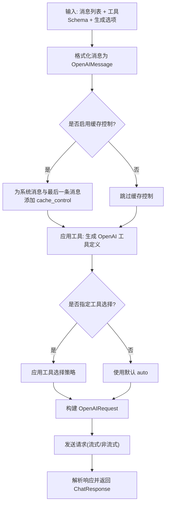

# OpenAI 集成

<cite>
**本文档引用的文件**
- [OpenAIChatModel.java](file://agentscope-core/src/main/java/io/agentscope/core/model/OpenAIChatModel.java)
- [OpenAIClient.java](file://agentscope-core/src/main/java/io/agentscope/core/model/OpenAIClient.java)
- [OpenAIBaseFormatter.java](file://agentscope-core/src/main/java/io/agentscope/core/formatter/openai/OpenAIBaseFormatter.java)
- [OpenAIChatFormatter.java](file://agentscope-core/src/main/java/io/agentscope/core/formatter/openai/OpenAIChatFormatter.java)
- [DeepSeekFormatter.java](file://agentscope-core/src/main/java/io/agentscope/core/formatter/openai/DeepSeekFormatter.java)
- [GLMFormatter.java](file://agentscope-core/src/main/java/io/agentscope/core/formatter/openai/GLMFormatter.java)
- [OpenAIRequest.java](file://agentscope-core/src/main/java/io/agentscope/core/formatter/openai/dto/OpenAIRequest.java)
- [OpenAIResponse.java](file://agentscope-core/src/main/java/io/agentscope/core/formatter/openai/dto/OpenAIResponse.java)
- [GenerateOptions.java](file://agentscope-core/src/main/java/io/agentscope/core/model/GenerateOptions.java)
- [ToolChoice.java](file://agentscope-core/src/main/java/io/agentscope/core/model/ToolChoice.java)
- [OpenAIChatModelTest.java](file://agentscope-core/src/test/java/io/agentscope/core/model/OpenAIChatModelTest.java)
</cite>

## 目录
1. [简介](#简介)
2. [项目结构](#项目结构)
3. [核心组件](#核心组件)
4. [架构总览](#架构总览)
5. [详细组件分析](#详细组件分析)
6. [依赖关系分析](#依赖关系分析)
7. [性能考虑](#性能考虑)
8. [故障排除指南](#故障排除指南)
9. [结论](#结论)
10. [附录](#附录)

## 简介
本文件面向需要在 AgentScope 中集成 OpenAI 及其兼容模型提供商（如 DeepSeek、Zhipu GLM）的开发者，系统性阐述 OpenAIChatModel 的实现架构与工作流程，重点覆盖：
- 基于 OpenAI 兼容 API 的直接 HTTP 调用机制
- 不同模型格式化器（OpenAI、DeepSeek、GLM）的差异与配置方法
- 认证机制（API Key）、请求构建、流式与非流式响应处理
- 工具调用支持、缓存控制与超时重试机制
- 完整配置示例（基础 URL、端点路径自定义）
- 错误处理策略、性能优化建议与最佳实践

## 项目结构
围绕 OpenAI 集成的核心代码主要分布在以下模块：
- 模型层：OpenAIChatModel（对外统一入口），OpenAIClient（HTTP 客户端）
- 格式化层：OpenAIBaseFormatter 及其子类（OpenAIChatFormatter、DeepSeekFormatter、GLMFormatter）
- 数据传输层：OpenAIRequest/Response DTO
- 配置层：GenerateOptions、ToolChoice
- 测试层：OpenAIChatModelTest（集成测试）



**图表来源**
- [OpenAIChatModel.java:58-358](file://agentscope-core/src/main/java/io/agentscope/core/model/OpenAIChatModel.java#L58-L358)
- [OpenAIClient.java:63-709](file://agentscope-core/src/main/java/io/agentscope/core/model/OpenAIClient.java#L63-L709)
- [OpenAIBaseFormatter.java:42-205](file://agentscope-core/src/main/java/io/agentscope/core/formatter/openai/OpenAIBaseFormatter.java#L42-L205)
- [OpenAIChatFormatter.java:46-278](file://agentscope-core/src/main/java/io/agentscope/core/formatter/openai/OpenAIChatFormatter.java#L46-L278)
- [DeepSeekFormatter.java:47-173](file://agentscope-core/src/main/java/io/agentscope/core/formatter/openai/DeepSeekFormatter.java#L47-L173)
- [GLMFormatter.java:48-121](file://agentscope-core/src/main/java/io/agentscope/core/formatter/openai/GLMFormatter.java#L48-L121)
- [OpenAIRequest.java:42-593](file://agentscope-core/src/main/java/io/agentscope/core/formatter/openai/dto/OpenAIRequest.java#L42-L593)
- [OpenAIResponse.java:68-294](file://agentscope-core/src/main/java/io/agentscope/core/formatter/openai/dto/OpenAIResponse.java#L68-L294)
- [GenerateOptions.java:31-800](file://agentscope-core/src/main/java/io/agentscope/core/model/GenerateOptions.java#L31-L800)
- [ToolChoice.java:45-85](file://agentscope-core/src/main/java/io/agentscope/core/model/ToolChoice.java#L45-L85)
- [OpenAIChatModelTest.java:54-534](file://agentscope-core/src/test/java/io/agentscope/core/model/OpenAIChatModelTest.java#L54-L534)

**章节来源**
- [OpenAIChatModel.java:58-358](file://agentscope-core/src/main/java/io/agentscope/core/model/OpenAIChatModel.java#L58-L358)
- [OpenAIClient.java:63-709](file://agentscope-core/src/main/java/io/agentscope/core/model/OpenAIClient.java#L63-L709)
- [OpenAIBaseFormatter.java:42-205](file://agentscope-core/src/main/java/io/agentscope/core/formatter/openai/OpenAIBaseFormatter.java#L42-L205)
- [OpenAIChatFormatter.java:46-278](file://agentscope-core/src/main/java/io/agentscope/core/formatter/openai/OpenAIChatFormatter.java#L46-L278)
- [DeepSeekFormatter.java:47-173](file://agentscope-core/src/main/java/io/agentscope/core/formatter/openai/DeepSeekFormatter.java#L47-L173)
- [GLMFormatter.java:48-121](file://agentscope-core/src/main/java/io/agentscope/core/formatter/openai/GLMFormatter.java#L48-L121)
- [OpenAIRequest.java:42-593](file://agentscope-core/src/main/java/io/agentscope/core/formatter/openai/dto/OpenAIRequest.java#L42-L593)
- [OpenAIResponse.java:68-294](file://agentscope-core/src/main/java/io/agentscope/core/formatter/openai/dto/OpenAIResponse.java#L68-L294)
- [GenerateOptions.java:31-800](file://agentscope-core/src/main/java/io/agentscope/core/model/GenerateOptions.java#L31-L800)
- [ToolChoice.java:45-85](file://agentscope-core/src/main/java/io/agentscope/core/model/ToolChoice.java#L45-L85)
- [OpenAIChatModelTest.java:54-534](file://agentscope-core/src/test/java/io/agentscope/core/model/OpenAIChatModelTest.java#L54-L534)

## 核心组件
- OpenAIChatModel：面向用户的统一入口，负责消息格式化、选项合并、流式/非流式调用、超时与重试包装、结果解析与返回。
- OpenAIClient：无状态 HTTP 客户端，封装 URL 构建、请求头、查询参数、JSON 序列化/反序列化、SSE 流解析、错误映射与传输执行。
- OpenAIBaseFormatter 及子类：将 AgentScope 的 Msg 对象转换为 OpenAI 请求格式，并应用生成参数、工具、工具选择策略；同时解析响应为 ChatResponse。
- OpenAIRequest/Response：标准请求/响应 DTO，涵盖温度、采样、工具、流式选项、使用量统计等字段。
- GenerateOptions：统一的生成与连接配置对象，支持每请求覆盖默认配置、附加头部/查询/请求体参数、缓存控制、并行工具调用、执行配置（超时与重试）。
- ToolChoice：工具调用策略枚举（自动、禁止、必须、特定工具）。

**章节来源**
- [OpenAIChatModel.java:58-358](file://agentscope-core/src/main/java/io/agentscope/core/model/OpenAIChatModel.java#L58-L358)
- [OpenAIClient.java:63-709](file://agentscope-core/src/main/java/io/agentscope/core/model/OpenAIClient.java#L63-L709)
- [OpenAIBaseFormatter.java:42-205](file://agentscope-core/src/main/java/io/agentscope/core/formatter/openai/OpenAIBaseFormatter.java#L42-L205)
- [OpenAIChatFormatter.java:46-278](file://agentscope-core/src/main/java/io/agentscope/core/formatter/openai/OpenAIChatFormatter.java#L46-L278)
- [OpenAIRequest.java:42-593](file://agentscope-core/src/main/java/io/agentscope/core/formatter/openai/dto/OpenAIRequest.java#L42-L593)
- [OpenAIResponse.java:68-294](file://agentscope-core/src/main/java/io/agentscope/core/formatter/openai/dto/OpenAIResponse.java#L68-L294)
- [GenerateOptions.java:31-800](file://agentscope-core/src/main/java/io/agentscope/core/model/GenerateOptions.java#L31-L800)
- [ToolChoice.java:45-85](file://agentscope-core/src/main/java/io/agentscope/core/model/ToolChoice.java#L45-L85)

## 架构总览
OpenAIChatModel 通过 OpenAIClient 发起 HTTP 请求，使用 OpenAIBaseFormatter 及其子类进行消息与参数的格式化与解析。请求可配置为流式或非流式，支持工具调用、缓存控制、并行工具调用、额外头部/查询/请求体参数，以及基于 GenerateOptions 的超时与重试策略。

```mermaid
sequenceDiagram
participant U as "用户"
participant M as "OpenAIChatModel"
participant F as "Formatter(OpenAIBaseFormatter)"
participant C as "OpenAIClient"
participant S as "OpenAI/兼容服务"
U->>M : "发起对话(消息列表, 工具, 生成选项)"
M->>M : "合并有效选项(优先级 : 调用时 > 构建时 > 默认)"
M->>F : "格式化消息为 OpenAIMessage 列表"
M->>F : "应用工具/工具选择/生成参数"
alt "启用缓存控制"
M->>F : "对系统消息与最后一条消息添加 cache_control"
end
opt "流式模式"
M->>C : "client.stream(apiKey, baseUrl, request, options)"
C->>S : "POST /v1/chat/completions (SSE)"
S-->>C : "SSE 数据块"
C-->>M : "OpenAIResponse 流"
M->>F : "parseResponse(chunk)"
F-->>U : "ChatResponse 流"
else "非流式模式"
M->>C : "client.call(apiKey, baseUrl, request, options)"
C->>S : "POST /v1/chat/completions"
S-->>C : "完整响应"
C-->>M : "OpenAIResponse"
M->>F : "parseResponse(response)"
F-->>U : "单个 ChatResponse"
end
```

**图表来源**
- [OpenAIChatModel.java:82-179](file://agentscope-core/src/main/java/io/agentscope/core/model/OpenAIChatModel.java#L82-L179)
- [OpenAIClient.java:238-442](file://agentscope-core/src/main/java/io/agentscope/core/model/OpenAIClient.java#L238-L442)
- [OpenAIBaseFormatter.java:57-60](file://agentscope-core/src/main/java/io/agentscope/core/formatter/openai/OpenAIBaseFormatter.java#L57-L60)

**章节来源**
- [OpenAIChatModel.java:82-179](file://agentscope-core/src/main/java/io/agentscope/core/model/OpenAIChatModel.java#L82-L179)
- [OpenAIClient.java:238-442](file://agentscope-core/src/main/java/io/agentscope/core/model/OpenAIClient.java#L238-L442)
- [OpenAIBaseFormatter.java:57-60](file://agentscope-core/src/main/java/io/agentscope/core/formatter/openai/OpenAIBaseFormatter.java#L57-L60)

## 详细组件分析

### OpenAIChatModel：统一入口与生命周期
- 责任边界
  - 合并调用时选项与构建时默认选项，确保模型名、流式模式、认证信息、基础 URL 等可用
  - 将消息格式化为 OpenAI 请求，应用工具、工具选择、生成参数、缓存控制
  - 调用 OpenAIClient 进行流式或非流式请求，解析响应为 ChatResponse
  - 统一超时与重试包装，保证健壮性
- 关键流程
  - doStream/doStream0：构建请求、应用选项、调用 client.stream 或 client.call，解析响应
  - builder：支持 apiKey、modelName、stream、generateOptions、baseUrl、endpointPath、formatter、httpTransport
- 特性
  - 支持多提供商：通过不同 Formatter 实现（OpenAIChatFormatter、DeepSeekFormatter、GLMFormatter）
  - 支持自定义端点路径，适配兼容 API
  - 支持缓存控制（自动为系统消息与最后一条消息添加 cache_control）



**图表来源**
- [OpenAIChatModel.java:58-358](file://agentscope-core/src/main/java/io/agentscope/core/model/OpenAIChatModel.java#L58-L358)
- [OpenAIClient.java:63-709](file://agentscope-core/src/main/java/io/agentscope/core/model/OpenAIClient.java#L63-L709)
- [OpenAIBaseFormatter.java:42-205](file://agentscope-core/src/main/java/io/agentscope/core/formatter/openai/OpenAIBaseFormatter.java#L42-L205)
- [OpenAIChatFormatter.java:46-278](file://agentscope-core/src/main/java/io/agentscope/core/formatter/openai/OpenAIChatFormatter.java#L46-L278)
- [DeepSeekFormatter.java:47-173](file://agentscope-core/src/main/java/io/agentscope/core/formatter/openai/DeepSeekFormatter.java#L47-L173)
- [GLMFormatter.java:48-121](file://agentscope-core/src/main/java/io/agentscope/core/formatter/openai/GLMFormatter.java#L48-L121)
- [OpenAIRequest.java:42-593](file://agentscope-core/src/main/java/io/agentscope/core/formatter/openai/dto/OpenAIRequest.java#L42-L593)
- [OpenAIResponse.java:68-294](file://agentscope-core/src/main/java/io/agentscope/core/formatter/openai/dto/OpenAIResponse.java#L68-L294)
- [GenerateOptions.java:31-800](file://agentscope-core/src/main/java/io/agentscope/core/model/GenerateOptions.java#L31-L800)
- [ToolChoice.java:45-85](file://agentscope-core/src/main/java/io/agentscope/core/model/ToolChoice.java#L45-L85)

**章节来源**
- [OpenAIChatModel.java:82-179](file://agentscope-core/src/main/java/io/agentscope/core/model/OpenAIChatModel.java#L82-L179)
- [OpenAIChatModel.java:196-356](file://agentscope-core/src/main/java/io/agentscope/core/model/OpenAIChatModel.java#L196-L356)

### OpenAIClient：HTTP 客户端与错误处理
- 能力
  - 无状态：每次请求携带 apiKey/baseUrl/endpointPath，便于共享
  - 支持同步与流式调用，SSE 解析，JSON 序列化/反序列化
  - URL 构建：智能拼接 baseUrl 与 endpointPath，处理版本路径冲突
  - 头部与查询参数：默认 Authorization、Content-Type、User-Agent，支持附加头部/查询
  - 错误处理：统一异常封装，区分 HTTP 状态码与 API 返回的错误字段
- 关键方法
  - call/callApi：同步请求
  - stream：流式请求（SSE）
  - buildApiUrl/buildUrl/buildHeaders：URL/头部构造
  - resolveErrorStatusCode：将 200 + body 错误映射为 4xx/5xx



**图表来源**
- [OpenAIClient.java:120-204](file://agentscope-core/src/main/java/io/agentscope/core/model/OpenAIClient.java#L120-L204)
- [OpenAIClient.java:252-347](file://agentscope-core/src/main/java/io/agentscope/core/model/OpenAIClient.java#L252-L347)
- [OpenAIClient.java:358-442](file://agentscope-core/src/main/java/io/agentscope/core/model/OpenAIClient.java#L358-L442)
- [OpenAIClient.java:487-516](file://agentscope-core/src/main/java/io/agentscope/core/model/OpenAIClient.java#L487-L516)

**章节来源**
- [OpenAIClient.java:120-204](file://agentscope-core/src/main/java/io/agentscope/core/model/OpenAIClient.java#L120-L204)
- [OpenAIClient.java:252-347](file://agentscope-core/src/main/java/io/agentscope/core/model/OpenAIClient.java#L252-L347)
- [OpenAIClient.java:358-442](file://agentscope-core/src/main/java/io/agentscope/core/model/OpenAIClient.java#L358-L442)
- [OpenAIClient.java:487-516](file://agentscope-core/src/main/java/io/agentscope/core/model/OpenAIClient.java#L487-L516)

### OpenAIBaseFormatter 及子类：消息与参数格式化
- OpenAIBaseFormatter
  - 提供通用的消息转换器与响应解析器
  - 抽象方法：applyOptions、applyTools、applyToolChoice（由子类实现）
  - 提供 buildRequest 辅助方法
  - 缓存控制：为系统消息与最后一条消息添加 cache_control
- OpenAIChatFormatter
  - 支持温度、top_p、频率/存在惩罚、最大 token、种子、并行工具调用
  - 支持 additionalBodyParams 映射（reasoning_effort、include_reasoning、stop、response_format 等）
  - 工具选择：支持 auto/none/required/指定工具
- DeepSeekFormatter
  - 移除消息中的 name 字段、系统消息转用户消息
  - 不支持 strict 参数
  - 思维内容（reasoning_content）按“当前轮次”保留/移除
- GLMFormatter
  - 强制至少一条用户消息
  - 工具选择仅支持 auto
  - 不支持 strict 参数



**图表来源**
- [OpenAIBaseFormatter.java:42-205](file://agentscope-core/src/main/java/io/agentscope/core/formatter/openai/OpenAIBaseFormatter.java#L42-L205)
- [OpenAIChatFormatter.java:68-277](file://agentscope-core/src/main/java/io/agentscope/core/formatter/openai/OpenAIChatFormatter.java#L68-L277)
- [DeepSeekFormatter.java:66-172](file://agentscope-core/src/main/java/io/agentscope/core/formatter/openai/DeepSeekFormatter.java#L66-L172)
- [GLMFormatter.java:56-120](file://agentscope-core/src/main/java/io/agentscope/core/formatter/openai/GLMFormatter.java#L56-L120)

**章节来源**
- [OpenAIBaseFormatter.java:57-204](file://agentscope-core/src/main/java/io/agentscope/core/formatter/openai/OpenAIBaseFormatter.java#L57-L204)
- [OpenAIChatFormatter.java:68-277](file://agentscope-core/src/main/java/io/agentscope/core/formatter/openai/OpenAIChatFormatter.java#L68-L277)
- [DeepSeekFormatter.java:66-172](file://agentscope-core/src/main/java/io/agentscope/core/formatter/openai/DeepSeekFormatter.java#L66-L172)
- [GLMFormatter.java:56-120](file://agentscope-core/src/main/java/io/agentscope/core/formatter/openai/GLMFormatter.java#L56-L120)

### OpenAIRequest/Response：数据契约
- OpenAIRequest
  - 必填：model、messages
  - 可选：stream、stream_options、temperature、top_p、max_tokens/max_completion_tokens、频率/存在惩罚、stop、seed、n、tools、tool_choice、user、response_format、logprobs/top_logprobs、reasoning_effort、parallel_tool_calls、service_tier、store、metadata、prediction、modalities、audio、include_reasoning、extraParams
- OpenAIResponse
  - 支持非流式与流式块（chat.completion 与 chat.completion.chunk）
  - 错误检测：标准 error 字段或非标准 code/message/status
  - 使用量：usage 字段

**章节来源**
- [OpenAIRequest.java:42-593](file://agentscope-core/src/main/java/io/agentscope/core/formatter/openai/dto/OpenAIRequest.java#L42-L593)
- [OpenAIResponse.java:68-294](file://agentscope-core/src/main/java/io/agentscope/core/formatter/openai/dto/OpenAIResponse.java#L68-L294)

### GenerateOptions：统一配置与超时重试
- 连接级：apiKey、baseUrl、endpointPath、modelName、stream
- 生成参数：temperature、topP、maxTokens、maxCompletionTokens、frequencyPenalty、presencePenalty、thinkingBudget、reasoningEffort、seed、parallelToolCalls、toolChoice、topK、cacheControl
- 执行配置：ExecutionConfig（超时、重试次数、退避、错误过滤）
- 附加参数：additionalHeaders、additionalBodyParams、additionalQueryParams
- 合并策略：主选项优先，Map 类型字段 fallback 后再覆盖主选项

**章节来源**
- [GenerateOptions.java:31-800](file://agentscope-core/src/main/java/io/agentscope/core/model/GenerateOptions.java#L31-L800)

### ToolChoice：工具调用策略
- Auto：模型自动决定
- None：禁止工具调用
- Required：强制至少一次工具调用
- Specific：强制调用指定工具名称

**章节来源**
- [ToolChoice.java:45-85](file://agentscope-core/src/main/java/io/agentscope/core/model/ToolChoice.java#L45-L85)

## 依赖关系分析
- 组件耦合
  - OpenAIChatModel 依赖 OpenAIClient 与 Formatter，耦合度低，便于替换不同 Provider 的 Formatter
  - OpenAIClient 依赖 HttpTransport（通过工厂获取），保持网络层可插拔
  - Formatter 依赖 OpenAIRequest/Response DTO，职责清晰
- 外部依赖
  - JSON 序列化/反序列化：JsonUtils
  - 日志：SLF4J
  - Reactor：Flux（流式处理）
- 潜在循环依赖
  - 未发现循环导入；各层职责清晰，接口方向单一



**图表来源**
- [OpenAIChatModel.java:58-358](file://agentscope-core/src/main/java/io/agentscope/core/model/OpenAIChatModel.java#L58-L358)
- [OpenAIClient.java:63-709](file://agentscope-core/src/main/java/io/agentscope/core/model/OpenAIClient.java#L63-L709)
- [OpenAIBaseFormatter.java:42-205](file://agentscope-core/src/main/java/io/agentscope/core/formatter/openai/OpenAIBaseFormatter.java#L42-L205)
- [OpenAIRequest.java:42-593](file://agentscope-core/src/main/java/io/agentscope/core/formatter/openai/dto/OpenAIRequest.java#L42-L593)
- [OpenAIResponse.java:68-294](file://agentscope-core/src/main/java/io/agentscope/core/formatter/openai/dto/OpenAIResponse.java#L68-L294)
- [GenerateOptions.java:31-800](file://agentscope-core/src/main/java/io/agentscope/core/model/GenerateOptions.java#L31-L800)
- [ToolChoice.java:45-85](file://agentscope-core/src/main/java/io/agentscope/core/model/ToolChoice.java#L45-L85)

**章节来源**
- [OpenAIChatModel.java:58-358](file://agentscope-core/src/main/java/io/agentscope/core/model/OpenAIChatModel.java#L58-L358)
- [OpenAIClient.java:63-709](file://agentscope-core/src/main/java/io/agentscope/core/model/OpenAIClient.java#L63-L709)
- [OpenAIBaseFormatter.java:42-205](file://agentscope-core/src/main/java/io/agentscope/core/formatter/openai/OpenAIBaseFormatter.java#L42-L205)

## 性能考虑
- 流式输出：优先使用流式模式，降低首字节延迟，提升交互体验
- 并行工具调用：在支持的模型上开启 parallel_tool_calls，减少往返次数
- 缓存控制：对系统提示与上下文末尾消息启用 cache_control，降低重复 token 消耗
- URL 构建优化：避免重复版本路径（/v1），减少字符串拼接与 URI 解析开销
- 超时与重试：合理设置 ExecutionConfig，避免长时间阻塞；对瞬时错误进行指数退避重试
- 线程模型：非流式调用使用 boundedElastic 线程池，避免阻塞事件线程

[本节为通用指导，无需具体文件引用]

## 故障排除指南
- 认证失败
  - 确认 apiKey 正确且未过期；检查 Authorization 头是否正确添加
- 基础 URL/端点路径问题
  - 自定义 endpointPath 时注意与 baseUrl 的版本路径冲突；客户端会自动处理 /v1 冲突
- 流式解析错误
  - SSE 数据块可能为空或 JSON 解析失败；客户端会跳过无效块并记录日志
- 错误状态码映射
  - 当 API 返回 200 但包含错误字段时，客户端会根据错误码映射为 4xx/5xx
- 工具调用限制
  - DeepSeek/GLM 对 tool_choice/strict 参数有限制；请使用对应 Formatter 并遵循其约束
- 缓存控制未生效
  - 确保启用 cacheControl 选项，并使用支持该功能的 Provider

**章节来源**
- [OpenAIClient.java:452-479](file://agentscope-core/src/main/java/io/agentscope/core/model/OpenAIClient.java#L452-L479)
- [OpenAIClient.java:487-516](file://agentscope-core/src/main/java/io/agentscope/core/model/OpenAIClient.java#L487-L516)
- [DeepSeekFormatter.java:77-79](file://agentscope-core/src/main/java/io/agentscope/core/formatter/openai/DeepSeekFormatter.java#L77-L79)
- [GLMFormatter.java:63-65](file://agentscope-core/src/main/java/io/agentscope/core/formatter/openai/GLMFormatter.java#L63-L65)
- [OpenAIChatModel.java:146-150](file://agentscope-core/src/main/java/io/agentscope/core/model/OpenAIChatModel.java#L146-L150)

## 结论
OpenAIChatModel 通过清晰的分层设计与可插拔的 Formatter 机制，实现了对 OpenAI 及其兼容模型的统一接入。借助 OpenAIClient 的 HTTP 能力与 GenerateOptions 的丰富配置，系统在工具调用、缓存控制、流式输出、超时重试等方面具备良好的扩展性与稳定性。配合测试用例，开发者可以快速验证不同 Provider 的行为差异并进行定制化集成。

[本节为总结性内容，无需具体文件引用]

## 附录

### 配置示例与最佳实践
- 基础 OpenAI 集成
  - 设置 apiKey、modelName、baseUrl（默认即可）
  - 使用 OpenAIChatFormatter，启用流式输出以获得更好交互体验
  - 如需工具调用，准备 ToolSchema 列表并通过 GenerateOptions 指定 toolChoice
- DeepSeek 集成
  - 使用 DeepSeekFormatter，设置 baseUrl 为 https://api.deepseek.com/v1
  - 注意 DeepSeek 不支持 strict 参数；必要时启用 appendEmptyUserIfEndsWithAssistant
- GLM 集成
  - 使用 GLMFormatter，设置 baseUrl 为 https://open.bigmodel.cn/api/paas/v4/
  - 确保至少有一条用户消息；工具选择仅支持 auto
- 自定义端点路径
  - 通过 builder.endpointPath 设置自定义路径（如 /v4/chat/completions）
  - 客户端会智能处理版本路径冲突
- 缓存控制
  - 在 GenerateOptions 中启用 cacheControl，自动为系统消息与最后一条消息添加 cache_control
- 超时与重试
  - 通过 ExecutionConfig 配置超时时间、最大重试次数与退避策略
- 并行工具调用
  - 在 GenerateOptions 中设置 parallelToolCalls 为 true（若 Provider 支持）

**章节来源**
- [OpenAIChatModel.java:216-356](file://agentscope-core/src/main/java/io/agentscope/core/model/OpenAIChatModel.java#L216-L356)
- [DeepSeekFormatter.java:35-46](file://agentscope-core/src/main/java/io/agentscope/core/formatter/openai/DeepSeekFormatter.java#L35-L46)
- [GLMFormatter.java:38-47](file://agentscope-core/src/main/java/io/agentscope/core/formatter/openai/GLMFormatter.java#L38-L47)
- [OpenAIChatModelTest.java:257-308](file://agentscope-core/src/test/java/io/agentscope/core/model/OpenAIChatModelTest.java#L257-L308)
- [OpenAIChatModelTest.java:310-366](file://agentscope-core/src/test/java/io/agentscope/core/model/OpenAIChatModelTest.java#L310-L366)
- [OpenAIChatModelTest.java:476-530](file://agentscope-core/src/test/java/io/agentscope/core/model/OpenAIChatModelTest.java#L476-L530)

### 关键流程图：工具调用与缓存控制


**图表来源**
- [OpenAIChatModel.java:117-179](file://agentscope-core/src/main/java/io/agentscope/core/model/OpenAIChatModel.java#L117-L179)
- [OpenAIBaseFormatter.java:181-194](file://agentscope-core/src/main/java/io/agentscope/core/formatter/openai/OpenAIBaseFormatter.java#L181-L194)
- [OpenAIChatFormatter.java:144-222](file://agentscope-core/src/main/java/io/agentscope/core/formatter/openai/OpenAIChatFormatter.java#L144-L222)