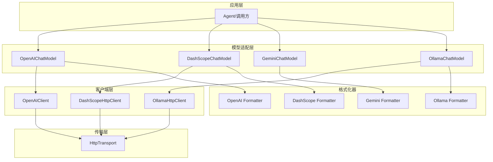
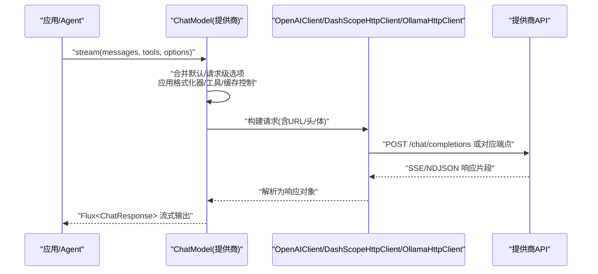
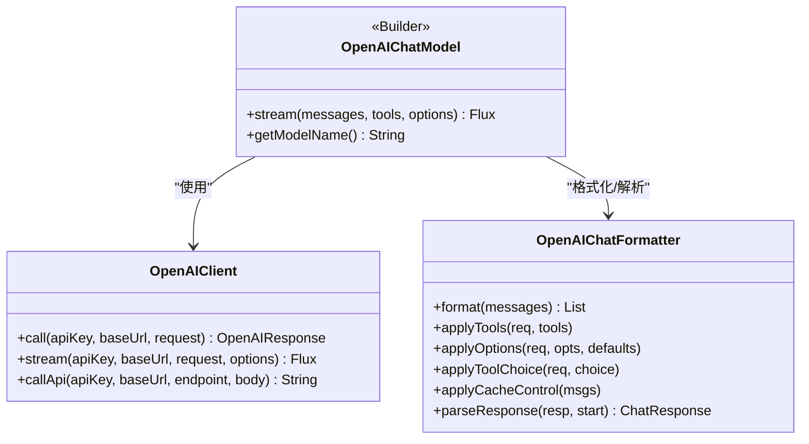
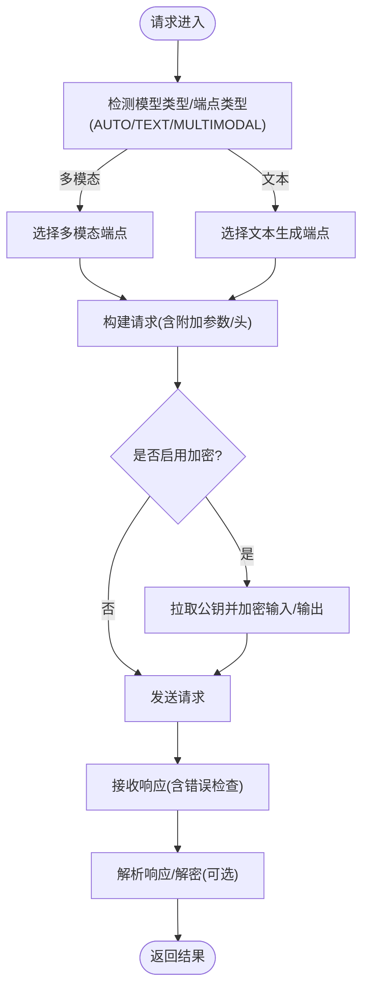
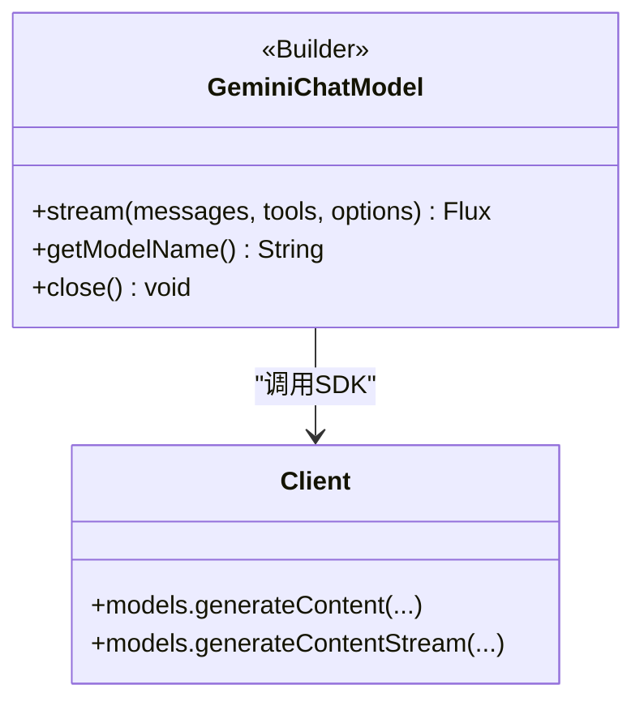
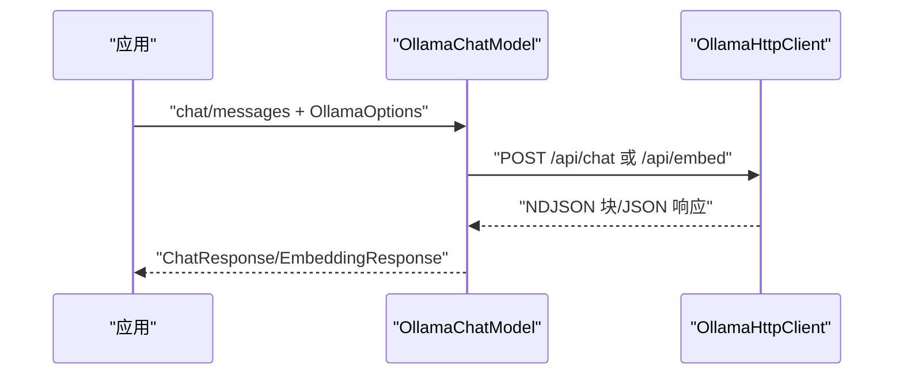
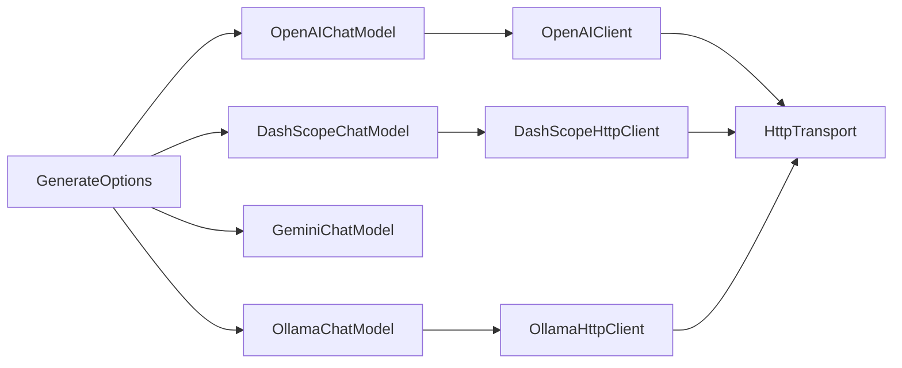

# 提供商集成

<cite>
**本文引用的文件**
- [OpenAIChatModel.java](file://agentscope-core/src/main/java/io/agentscope/core/model/OpenAIChatModel.java)
- [OpenAIClient.java](file://agentscope-core/src/main/java/io/agentscope/core/model/OpenAIClient.java)
- [DashScopeChatModel.java](file://agentscope-core/src/main/java/io/agentscope/core/model/DashScopeChatModel.java)
- [DashScopeHttpClient.java](file://agentscope-core/src/main/java/io/agentscope/core/model/DashScopeHttpClient.java)
- [GeminiChatModel.java](file://agentscope-core/src/main/java/io/agentscope/core/model/GeminiChatModel.java)
- [OllamaChatModel.java](file://agentscope-core/src/main/java/io/agentscope/core/model/OllamaChatModel.java)
- [OllamaHttpClient.java](file://agentscope-core/src/main/java/io/agentscope/core/model/OllamaHttpClient.java)
- [GenerateOptions.java](file://agentscope-core/src/main/java/io/agentscope/core/model/GenerateOptions.java)
- [OpenAIChatModelTest.java](file://agentscope-core/src/test/java/io/agentscope/core/model/OpenAIChatModelTest.java)
- [DashScopeChatModelTest.java](file://agentscope-core/src/test/java/io/agentscope/core/model/DashScopeChatModelTest.java)
</cite>

## 目录
1. [简介](#简介)
2. [项目结构](#项目结构)
3. [核心组件](#核心组件)
4. [架构总览](#架构总览)
5. [详细组件分析](#详细组件分析)
6. [依赖关系分析](#依赖关系分析)
7. [性能与可靠性](#性能与可靠性)
8. [故障排查指南](#故障排查指南)
9. [结论](#结论)
10. [附录：配置与测试](#附录配置与测试)

## 简介
本技术文档面向 AgentScope Java 的多大模型提供商集成，系统性解析 OpenAI、DashScope、Gemini、Ollama 四家主流提供商的接入实现。内容覆盖认证机制、API 调用方式、参数映射、特性差异与限制、完整配置示例、连接测试方法、错误处理与重试、超时配置、模型切换与负载均衡策略，以及成本控制、性能监控与故障转移的实践建议。

## 项目结构
围绕“模型适配层 + 客户端 + 传输层 + 格式化器”的分层设计：
- 模型适配层：各提供商的 ChatModel 实现（OpenAIChatModel、DashScopeChatModel、GeminiChatModel、OllamaChatModel）
- 客户端层：OpenAI、DashScope、Ollama 的专用 HTTP 客户端，负责请求构建、发送与响应解析
- 传输层：统一的 HttpTransport 抽象，封装 OkHttp 等底层网络栈
- 格式化器：针对不同提供商的消息格式转换与参数映射（openai、dashscope、gemini、ollama）

图表来源
- [OpenAIChatModel.java:58-358](file://agentscope-core/src/main/java/io/agentscope/core/model/OpenAIChatModel.java#L58-L358)
- [DashScopeChatModel.java:52-589](file://agentscope-core/src/main/java/io/agentscope/core/model/DashScopeChatModel.java#L52-L589)
- [GeminiChatModel.java:55-514](file://agentscope-core/src/main/java/io/agentscope/core/model/GeminiChatModel.java#L55-L514)
- [OllamaChatModel.java:53-288](file://agentscope-core/src/main/java/io/agentscope/core/model/OllamaChatModel.java#L53-L288)
- [OpenAIClient.java:63-709](file://agentscope-core/src/main/java/io/agentscope/core/model/OpenAIClient.java#L63-L709)
- [DashScopeHttpClient.java:62-800](file://agentscope-core/src/main/java/io/agentscope/core/model/DashScopeHttpClient.java#L62-L800)
- [OllamaHttpClient.java:55-324](file://agentscope-core/src/main/java/io/agentscope/core/model/OllamaHttpClient.java#L55-L324)

章节来源
- [OpenAIChatModel.java:58-358](file://agentscope-core/src/main/java/io/agentscope/core/model/OpenAIChatModel.java#L58-L358)
- [DashScopeChatModel.java:52-589](file://agentscope-core/src/main/java/io/agentscope/core/model/DashScopeChatModel.java#L52-L589)
- [GeminiChatModel.java:55-514](file://agentscope-core/src/main/java/io/agentscope/core/model/GeminiChatModel.java#L55-L514)
- [OllamaChatModel.java:53-288](file://agentscope-core/src/main/java/io/agentscope/core/model/OllamaChatModel.java#L53-L288)

## 核心组件
- OpenAIChatModel：OpenAI 兼容 API 的统一接入，支持流式/非流式、工具调用、消息格式化、缓存控制、自定义端点路径等
- DashScopeChatModel：阿里 DashScope 文本与视觉模型接入，自动端点路由、思维模式（Thinking）、搜索增强、加密通道
- GeminiChatModel：Google GenAI SDK 集成，支持工具调用、多模态、思维模式、Vertex AI/Genie API 切换
- OllamaChatModel：本地 Ollama 实例接入，支持同步/异步、工具调用、NDJSON 流解析、自定义 Ollama 选项
- OpenAIClient、DashScopeHttpClient、OllamaHttpClient：各提供商的 HTTP 客户端，负责 URL 构建、头部组装、请求发送、响应解析与错误映射
- GenerateOptions：统一的生成参数与连接配置载体，支持合并策略、执行配置（超时/重试/退避）与附加头/体/查询参数

章节来源
- [OpenAIChatModel.java:58-358](file://agentscope-core/src/main/java/io/agentscope/core/model/OpenAIChatModel.java#L58-L358)
- [DashScopeChatModel.java:52-589](file://agentscope-core/src/main/java/io/agentscope/core/model/DashScopeChatModel.java#L52-L589)
- [GeminiChatModel.java:55-514](file://agentscope-core/src/main/java/io/agentscope/core/model/GeminiChatModel.java#L55-L514)
- [OllamaChatModel.java:53-288](file://agentscope-core/src/main/java/io/agentscope/core/model/OllamaChatModel.java#L53-L288)
- [OpenAIClient.java:63-709](file://agentscope-core/src/main/java/io/agentscope/core/model/OpenAIClient.java#L63-L709)
- [DashScopeHttpClient.java:62-800](file://agentscope-core/src/main/java/io/agentscope/core/model/DashScopeHttpClient.java#L62-L800)
- [OllamaHttpClient.java:55-324](file://agentscope-core/src/main/java/io/agentscope/core/model/OllamaHttpClient.java#L55-L324)
- [GenerateOptions.java:31-800](file://agentscope-core/src/main/java/io/agentscope/core/model/GenerateOptions.java#L31-L800)

## 架构总览
下图展示一次典型“流式对话”在各提供商间的调用链路与关键处理点：

图表来源
- [OpenAIChatModel.java:82-179](file://agentscope-core/src/main/java/io/agentscope/core/model/OpenAIChatModel.java#L82-L179)
- [DashScopeChatModel.java:194-315](file://agentscope-core/src/main/java/io/agentscope/core/model/DashScopeChatModel.java#L194-L315)
- [OllamaChatModel.java:135-233](file://agentscope-core/src/main/java/io/agentscope/core/model/OllamaChatModel.java#L135-L233)
- [OpenAIClient.java:358-442](file://agentscope-core/src/main/java/io/agentscope/core/model/OpenAIClient.java#L358-L442)
- [DashScopeHttpClient.java:238-307](file://agentscope-core/src/main/java/io/agentscope/core/model/DashScopeHttpClient.java#L238-L307)
- [OllamaHttpClient.java:183-232](file://agentscope-core/src/main/java/io/agentscope/core/model/OllamaHttpClient.java#L183-L232)

## 详细组件分析

### OpenAI 集成
- 认证机制：通过 Authorization 头携带 Bearer Token；支持自定义 base URL 与端点路径
- API 调用：非流式走 call，流式走 stream；支持附加头、查询参数与请求体扩展
- 参数映射：温度、采样参数、最大 token、工具调用、并行工具调用、缓存控制等
- 特色与限制：支持流式增量输出、工具调用、缓存提示词；对 rate limit 等错误进行状态码归一化
- 错误处理：将 HTTP 200 中的错误体映射为 4xx 状态码，便于上层统一处理

图表来源
- [OpenAIChatModel.java:58-358](file://agentscope-core/src/main/java/io/agentscope/core/model/OpenAIChatModel.java#L58-L358)
- [OpenAIClient.java:63-709](file://agentscope-core/src/main/java/io/agentscope/core/model/OpenAIClient.java#L63-L709)

章节来源
- [OpenAIChatModel.java:82-179](file://agentscope-core/src/main/java/io/agentscope/core/model/OpenAIChatModel.java#L82-L179)
- [OpenAIClient.java:238-442](file://agentscope-core/src/main/java/io/agentscope/core/model/OpenAIClient.java#L238-L442)
- [OpenAIChatModelTest.java:88-308](file://agentscope-core/src/test/java/io/agentscope/core/model/OpenAIChatModelTest.java#L88-L308)

### DashScope 集成
- 认证机制：Authorization 头 + Bearer Token；支持公钥加密通道（RSA+AES-GCM），自动拉取最新公钥
- API 调用：文本生成与多模态生成自动路由；流式输出启用 SSE；支持附加头/体/查询参数
- 参数映射：温度、采样、最大 token、思维模式（enable_thinking + thinking_budget）、搜索增强（enable_search）
- 特色与限制：自动识别视觉模型（如 qwen-vl-*、qvq-* 等）并切换到多模态端点；思维模式需开启流式
- 错误处理：将 DashScope 自身错误码与 HTTP 状态码映射，抛出带上下文的异常

图表来源
- [DashScopeChatModel.java:194-315](file://agentscope-core/src/main/java/io/agentscope/core/model/DashScopeChatModel.java#L194-L315)
- [DashScopeHttpClient.java:317-422](file://agentscope-core/src/main/java/io/agentscope/core/model/DashScopeHttpClient.java#L317-L422)
- [DashScopeHttpClient.java:436-484](file://agentscope-core/src/main/java/io/agentscope/core/model/DashScopeHttpClient.java#L436-L484)

章节来源
- [DashScopeChatModel.java:194-345](file://agentscope-core/src/main/java/io/agentscope/core/model/DashScopeChatModel.java#L194-L345)
- [DashScopeHttpClient.java:165-307](file://agentscope-core/src/main/java/io/agentscope/core/model/DashScopeHttpClient.java#L165-L307)
- [DashScopeChatModelTest.java:549-765](file://agentscope-core/src/test/java/io/agentscope/core/model/DashScopeChatModelTest.java#L549-L765)

### Gemini 集成
- 认证机制：支持 API Key 与 Google Credentials；可切换 Vertex AI 或 Gemini API；可自定义 base URL
- API 调用：SDK 原生流式/非流式接口；支持工具调用、多模态内容（图像/音频/视频）
- 参数映射：温度、采样、最大 token、工具调用策略、思维模式（推理努力级别）
- 特色与限制：直接使用官方 GenAI SDK，具备更丰富的多模态与工具调用能力；支持关闭客户端资源

图表来源
- [GeminiChatModel.java:224-311](file://agentscope-core/src/main/java/io/agentscope/core/model/GeminiChatModel.java#L224-L311)

章节来源
- [GeminiChatModel.java:224-311](file://agentscope-core/src/main/java/io/agentscope/core/model/GeminiChatModel.java#L224-L311)

### Ollama 集成
- 认证机制：本地实例通常无需认证；可通过附加头传递自定义鉴权（由上层传入）
- API 调用：/api/chat（同步/流式）、/api/embed（嵌入）；流式采用 NDJSON 解析
- 参数映射：OllamaOptions 与 GenerateOptions 双向互转；支持工具调用（取决于模型与格式化器）
- 特色与限制：本地部署，低延迟；流式解析基于 NDJSON；支持嵌入接口

图表来源
- [OllamaChatModel.java:135-233](file://agentscope-core/src/main/java/io/agentscope/core/model/OllamaChatModel.java#L135-L233)
- [OllamaHttpClient.java:183-232](file://agentscope-core/src/main/java/io/agentscope/core/model/OllamaHttpClient.java#L183-L232)

章节来源
- [OllamaChatModel.java:135-233](file://agentscope-core/src/main/java/io/agentscope/core/model/OllamaChatModel.java#L135-L233)
- [OllamaHttpClient.java:183-232](file://agentscope-core/src/main/java/io/agentscope/core/model/OllamaHttpClient.java#L183-L232)

## 依赖关系分析
- 组件耦合：各 ChatModel 仅依赖对应的 HttpClient 与 Formatter，耦合度低，便于替换与扩展
- 传输共享：通过 HttpTransportFactory 获取默认传输，可在多个模型间复用以节省资源
- 执行配置：统一的 GenerateOptions 支持合并策略与执行配置（超时/重试/退避），贯穿所有提供商

图表来源
- [GenerateOptions.java:423-484](file://agentscope-core/src/main/java/io/agentscope/core/model/GenerateOptions.java#L423-L484)
- [OpenAIChatModel.java:344-355](file://agentscope-core/src/main/java/io/agentscope/core/model/OpenAIChatModel.java#L344-L355)
- [DashScopeChatModel.java:557-586](file://agentscope-core/src/main/java/io/agentscope/core/model/DashScopeChatModel.java#L557-L586)
- [OllamaChatModel.java:268-285](file://agentscope-core/src/main/java/io/agentscope/core/model/OllamaChatModel.java#L268-L285)

章节来源
- [GenerateOptions.java:423-484](file://agentscope-core/src/main/java/io/agentscope/core/model/GenerateOptions.java#L423-L484)

## 性能与可靠性
- 超时与重试：通过 GenerateOptions.executionConfig 配置超时、最大尝试次数、退避策略与错误过滤；各模型在 doStream 前后应用 ModelUtils.applyTimeoutAndRetry
- 流式优化：OpenAI/DashScope 使用 SSE，Ollama 使用 NDJSON；均在客户端侧进行增量解析，降低首字节延迟
- 连接复用：HttpTransport 默认单例，跨模型共享可减少连接开销
- 成本控制：OpenAI/DashScope 支持缓存提示词（cache_control），减少重复 token 消耗；Gemini 支持 seed 保证可重复性
- 监控与可观测性：建议在应用层记录请求/响应时间、错误码分布、重试次数与失败原因

章节来源
- [OpenAIChatModel.java:82-91](file://agentscope-core/src/main/java/io/agentscope/core/model/OpenAIChatModel.java#L82-L91)
- [DashScopeChatModel.java:194-212](file://agentscope-core/src/main/java/io/agentscope/core/model/DashScopeChatModel.java#L194-L212)
- [OllamaChatModel.java:135-144](file://agentscope-core/src/main/java/io/agentscope/core/model/OllamaChatModel.java#L135-L144)
- [GenerateOptions.java:257-267](file://agentscope-core/src/main/java/io/agentscope/core/model/GenerateOptions.java#L257-L267)

## 故障排查指南
- OpenAI
  - 确认 Authorization 头与 base URL/端点路径正确；检查附加头/查询参数是否合法
  - 关注 429/限流与 4xx/业务错误，必要时调整重试策略
  - 参考集成测试验证非流式、流式、工具调用与缓存控制行为
- DashScope
  - 视觉模型自动路由至多模态端点；开启思维模式需流式
  - 加密场景需确保公钥获取成功且加密头正确
  - 参考单元测试验证附加头/体/查询参数透传
- Gemini
  - SDK 异常需捕获并记录；注意关闭 Client 释放资源
- Ollama
  - 本地服务连通性与端口；NDJSON 流解析失败时检查模型与格式化器兼容性

章节来源
- [OpenAIClient.java:452-479](file://agentscope-core/src/main/java/io/agentscope/core/model/OpenAIClient.java#L452-L479)
- [DashScopeHttpClient.java:436-484](file://agentscope-core/src/main/java/io/agentscope/core/model/DashScopeHttpClient.java#L436-L484)
- [OllamaHttpClient.java:205-232](file://agentscope-core/src/main/java/io/agentscope/core/model/OllamaHttpClient.java#L205-L232)
- [OpenAIChatModelTest.java:197-248](file://agentscope-core/src/test/java/io/agentscope/core/model/OpenAIChatModelTest.java#L197-L248)
- [DashScopeChatModelTest.java:549-651](file://agentscope-core/src/test/java/io/agentscope/core/model/DashScopeChatModelTest.java#L549-L651)

## 结论
AgentScope Java 对四大提供商提供了统一而灵活的接入抽象：通过 ChatModel + Client + Formatter 的分层设计，既保证了跨提供商的一致体验，又保留了各提供商的差异化能力（如 DashScope 的思维模式、Gemini 的 SDK 能力、Ollama 的本地化）。配合 GenerateOptions 的统一配置与 ModelUtils 的超时/重试封装，能够满足生产环境对稳定性、性能与可观测性的要求。

## 附录：配置与测试

### 配置要点与示例（路径引用）
- OpenAI
  - 认证与基础配置：[OpenAIChatModel.java:206-355](file://agentscope-core/src/main/java/io/agentscope/core/model/OpenAIChatModel.java#L206-L355)
  - 自定义端点路径与附加参数：[OpenAIChatModelTest.java:257-308](file://agentscope-core/src/test/java/io/agentscope/core/model/OpenAIChatModelTest.java#L257-L308)
  - 缓存控制与并行工具调用：[OpenAIChatModelTest.java:310-366](file://agentscope-core/src/test/java/io/agentscope/core/model/OpenAIChatModelTest.java#L310-L366)
- DashScope
  - 思维模式与搜索增强：[DashScopeChatModel.java:317-345](file://agentscope-core/src/main/java/io/agentscope/core/model/DashScopeChatModel.java#L317-L345)
  - 加密通道与公钥获取：[DashScopeHttpClient.java:436-484](file://agentscope-core/src/main/java/io/agentscope/core/model/DashScopeHttpClient.java#L436-L484)
  - 附加头/体/查询参数透传：[DashScopeChatModelTest.java:549-651](file://agentscope-core/src/test/java/io/agentscope/core/model/DashScopeChatModelTest.java#L549-L651)
- Gemini
  - Vertex AI/Genie 切换与 SDK 调用：[GeminiChatModel.java:104-148](file://agentscope-core/src/main/java/io/agentscope/core/model/GeminiChatModel.java#L104-L148)
- Ollama
  - 本地服务地址与流式解析：[OllamaHttpClient.java:183-232](file://agentscope-core/src/main/java/io/agentscope/core/model/OllamaHttpClient.java#L183-L232)

### 连接测试方法
- OpenAI：使用 MockWebServer 模拟 /v1/chat/completions 与 SSE 流，验证非流式与流式响应、工具调用与缓存控制
  - 参考：[OpenAIChatModelTest.java:88-195](file://agentscope-core/src/test/java/io/agentscope/core/model/OpenAIChatModelTest.java#L88-L195)
- DashScope：模拟文本/多模态端点，验证附加头/体/查询参数透传与思维模式开关
  - 参考：[DashScopeChatModelTest.java:549-651](file://agentscope-core/src/test/java/io/agentscope/core/model/DashScopeChatModelTest.java#L549-L651)

章节来源
- [OpenAIChatModelTest.java:88-195](file://agentscope-core/src/test/java/io/agentscope/core/model/OpenAIChatModelTest.java#L88-L195)
- [DashScopeChatModelTest.java:549-651](file://agentscope-core/src/test/java/io/agentscope/core/model/DashScopeChatModelTest.java#L549-L651)