# AbstractBaseFormatter 基类

<cite>
**本文档引用的文件**
- [AbstractBaseFormatter.java](file://agentscope-core/src/main/java/io/agentscope/core/formatter/AbstractBaseFormatter.java)
- [Formatter.java](file://agentscope-core/src/main/java/io/agentscope/core/formatter/Formatter.java)
- [FormatterException.java](file://agentscope-core/src/main/java/io/agentscope/core/formatter/FormatterException.java)
- [OpenAIBaseFormatter.java](file://agentscope-core/src/main/java/io/agentscope/core/formatter/openai/OpenAIBaseFormatter.java)
- [OpenAIChatFormatter.java](file://agentscope-core/src/main/java/io/agentscope/core/formatter/openai/OpenAIChatFormatter.java)
- [DashScopeChatFormatter.java](file://agentscope-core/src/main/java/io/agentscope/core/formatter/dashscope/DashScopeChatFormatter.java)
- [GeminiChatFormatter.java](file://agentscope-core/src/main/java/io/agentscope/core/formatter/gemini/GeminiChatFormatter.java)
- [AnthropicBaseFormatter.java](file://agentscope-core/src/main/java/io/agentscope/core/formatter/anthropic/AnthropicBaseFormatter.java)
- [AnthropicChatFormatter.java](file://agentscope-core/src/main/java/io/agentscope/core/formatter/anthropic/AnthropicChatFormatter.java)
- [MediaUtils.java](file://agentscope-core/src/main/java/io/agentscope/core/formatter/MediaUtils.java)
</cite>

## 目录
1. [简介](#简介)
2. [项目结构](#项目结构)
3. [核心组件](#核心组件)
4. [架构概览](#架构概览)
5. [详细组件分析](#详细组件分析)
6. [依赖分析](#依赖分析)
7. [性能考虑](#性能考虑)
8. [故障排除指南](#故障排除指南)
9. [结论](#结论)

## 简介

AbstractBaseFormatter 是 AgentScope 框架中所有格式化器的基础抽象类，为不同大模型提供商（如 OpenAI、DashScope、Gemini、Anthropic）提供了统一的消息格式化和响应解析能力。该基类通过模板方法设计模式，将通用的格式化逻辑封装在抽象类中，具体提供商的格式化器只需实现特定的转换逻辑即可。

该基类的核心价值在于：
- 提供统一的消息提取、媒体内容检测、角色标签格式化等通用功能
- 实现模板方法模式，简化具体格式化器的实现复杂度
- 统一错误处理和日志记录机制
- 支持多模态内容处理（文本、图像、音频、视频）
- 提供工具处理的默认实现

## 项目结构

AgentScope 的格式化器模块采用按提供商分组的组织方式：

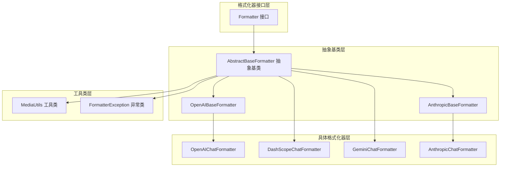

**图表来源**
- [AbstractBaseFormatter.java:1-302](file://agentscope-core/src/main/java/io/agentscope/core/formatter/AbstractBaseFormatter.java#L1-L302)
- [Formatter.java:1-136](file://agentscope-core/src/main/java/io/agentscope/core/formatter/Formatter.java#L1-L136)

**章节来源**
- [AbstractBaseFormatter.java:16-61](file://agentscope-core/src/main/java/io/agentscope/core/formatter/AbstractBaseFormatter.java#L16-L61)
- [Formatter.java:26-45](file://agentscope-core/src/main/java/io/agentscope/core/formatter/Formatter.java#L26-L45)

## 核心组件

### 抽象基类架构

AbstractBaseFormatter 作为所有格式化器的基类，定义了以下关键特性：

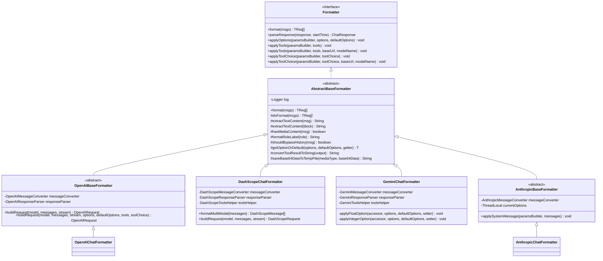

**图表来源**
- [AbstractBaseFormatter.java:60-302](file://agentscope-core/src/main/java/io/agentscope/core/formatter/AbstractBaseFormatter.java#L60-L302)
- [Formatter.java:45-136](file://agentscope-core/src/main/java/io/agentscope/core/formatter/Formatter.java#L45-L136)
- [OpenAIBaseFormatter.java:42-205](file://agentscope-core/src/main/java/io/agentscope/core/formatter/openai/OpenAIBaseFormatter.java#L42-L205)
- [DashScopeChatFormatter.java:42-208](file://agentscope-core/src/main/java/io/agentscope/core/formatter/dashscope/DashScopeChatFormatter.java#L42-L208)
- [GeminiChatFormatter.java:52-209](file://agentscope-core/src/main/java/io/agentscope/core/formatter/gemini/GeminiChatFormatter.java#L52-L209)
- [AnthropicBaseFormatter.java:37-107](file://agentscope-core/src/main/java/io/agentscope/core/formatter/anthropic/AnthropicBaseFormatter.java#L37-L107)

### 模板方法设计模式

AbstractBaseFormatter 实现了标准的模板方法模式，定义了完整的格式化流程：

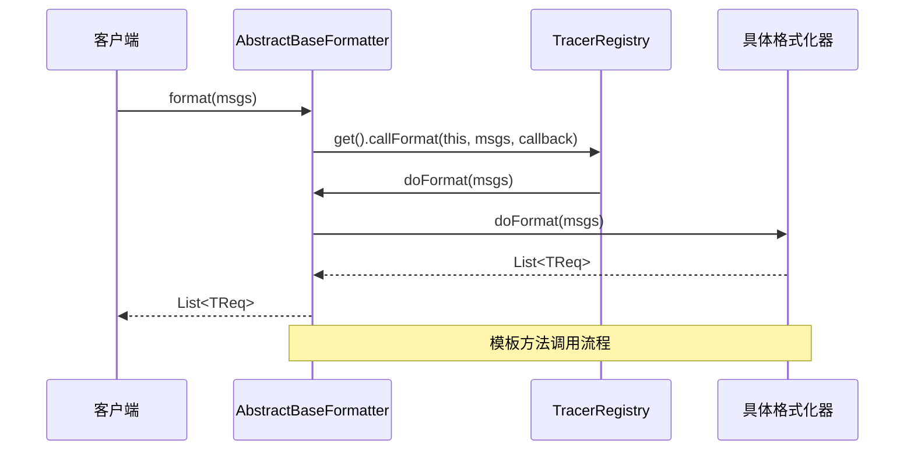

**图表来源**
- [AbstractBaseFormatter.java:71-76](file://agentscope-core/src/main/java/io/agentscope/core/formatter/AbstractBaseFormatter.java#L71-L76)

**章节来源**
- [AbstractBaseFormatter.java:60-76](file://agentscope-core/src/main/java/io/agentscope/core/formatter/AbstractBaseFormatter.java#L60-L76)

## 架构概览

### 继承链和扩展机制

AbstractBaseFormatter 通过泛型参数支持不同类型提供商的请求、响应和参数构建器类型：

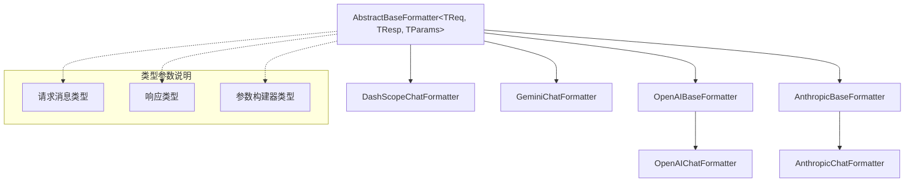

**图表来源**
- [AbstractBaseFormatter.java:56-61](file://agentscope-core/src/main/java/io/agentscope/core/formatter/AbstractBaseFormatter.java#L56-L61)

### 消息转换流程

AbstractBaseFormatter 提供了完整的消息转换和工具处理流程：

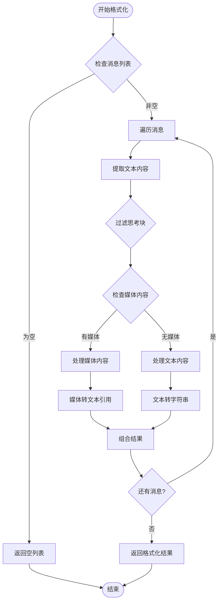

**图表来源**
- [AbstractBaseFormatter.java:84-107](file://agentscope-core/src/main/java/io/agentscope/core/formatter/AbstractBaseFormatter.java#L84-L107)
- [AbstractBaseFormatter.java:197-226](file://agentscope-core/src/main/java/io/agentscope/core/formatter/AbstractBaseFormatter.java#L197-L226)

**章节来源**
- [AbstractBaseFormatter.java:84-137](file://agentscope-core/src/main/java/io/agentscope/core/formatter/AbstractBaseFormatter.java#L84-L137)
- [AbstractBaseFormatter.java:197-255](file://agentscope-core/src/main/java/io/agentscope/core/formatter/AbstractBaseFormatter.java#L197-L255)

## 详细组件分析

### 文本内容提取功能

AbstractBaseFormatter 提供了智能的文本内容提取机制，能够正确处理不同类型的 ContentBlock：

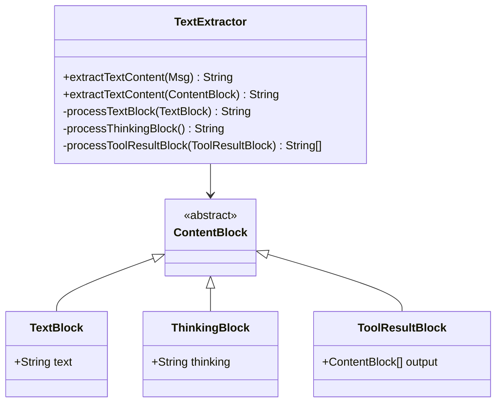

**图表来源**
- [AbstractBaseFormatter.java:84-120](file://agentscope-core/src/main/java/io/agentscope/core/formatter/AbstractBaseFormatter.java#L84-L120)

#### 思考块处理策略

思考块（ThinkingBlock）在格式化过程中被特殊处理：
- 不会被发送到 LLM API
- 仅存储在内存中用于调试和分析
- 在消息格式化时会被跳过

**章节来源**
- [AbstractBaseFormatter.java:84-107](file://agentscope-core/src/main/java/io/agentscope/core/formatter/AbstractBaseFormatter.java#L84-L107)

### 媒体内容处理机制

AbstractBaseFormatter 提供了完整的多模态内容处理能力：

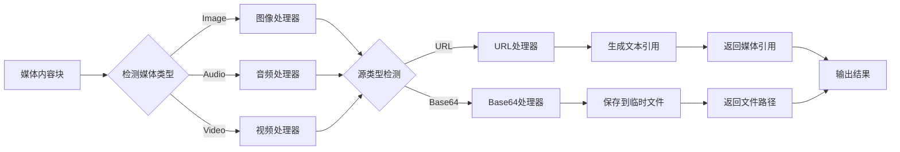

**图表来源**
- [AbstractBaseFormatter.java:235-255](file://agentscope-core/src/main/java/io/agentscope/core/formatter/AbstractBaseFormatter.java#L235-L255)

#### 媒体工具类集成

AbstractBaseFormatter 与 MediaUtils 工具类协同工作，提供更强大的媒体处理能力：

**章节来源**
- [AbstractBaseFormatter.java:235-300](file://agentscope-core/src/main/java/io/agentscope/core/formatter/AbstractBaseFormatter.java#L235-L300)
- [MediaUtils.java:41-415](file://agentscope-core/src/main/java/io/agentscope/core/formatter/MediaUtils.java#L41-L415)

### 角色标签格式化

AbstractBaseFormatter 提供了标准化的角色标签格式化功能：

| 源角色 | 格式化后标签 |
|--------|-------------|
| USER | "User" |
| ASSISTANT | "Assistant" |
| SYSTEM | "System" |
| TOOL | "Tool" |

这种标准化确保了不同提供商对角色标识的一致性。

**章节来源**
- [AbstractBaseFormatter.java:145-152](file://agentscope-core/src/main/java/io/agentscope/core/formatter/AbstractBaseFormatter.java#L145-L152)

### 历史合并控制

AbstractBaseFormatter 支持消息历史合并的细粒度控制：

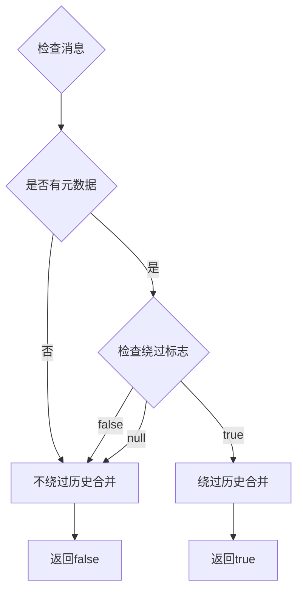

**图表来源**
- [AbstractBaseFormatter.java:162-169](file://agentscope-core/src/main/java/io/agentscope/core/formatter/AbstractBaseFormatter.java#L162-L169)

**章节来源**
- [AbstractBaseFormatter.java:154-169](file://agentscope-core/src/main/java/io/agentscope/core/formatter/AbstractBaseFormatter.java#L154-L169)

### 选项获取机制

AbstractBaseFormatter 提供了灵活的选项获取机制，支持主选项对象和默认选项对象的优先级处理：

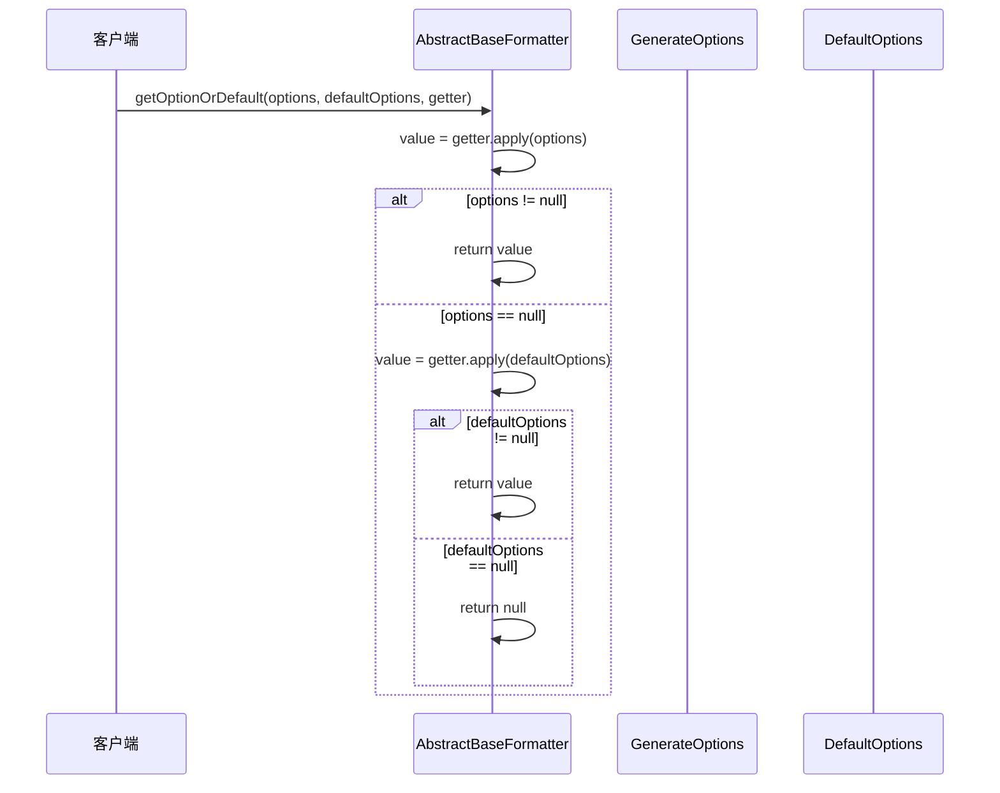

**图表来源**
- [AbstractBaseFormatter.java:180-188](file://agentscope-core/src/main/java/io/agentscope/core/formatter/AbstractBaseFormatter.java#L180-L188)

**章节来源**
- [AbstractBaseFormatter.java:171-188](file://agentscope-core/src/main/java/io/agentscope/core/formatter/AbstractBaseFormatter.java#L171-L188)

### 工具结果转换

AbstractBaseFormatter 提供了智能的工具结果转换功能，能够处理多种类型的工具输出：

```mermaid
flowchart TD
ToolOutput[工具结果输出] --> CheckEmpty{检查是否为空}
CheckEmpty --> |为空| ReturnEmpty[返回空字符串]
CheckEmpty --> |非空| ProcessBlocks[处理内容块]
ProcessBlocks --> IterateBlocks[遍历内容块]
IterateBlocks --> BlockType{检查块类型}
BlockType --> |TextBlock| AddText[添加文本内容]
BlockType --> |ImageBlock| ConvertImage[转换图像]
BlockType --> |AudioBlock| ConvertAudio[转换音频]
BlockType --> |VideoBlock| ConvertVideo[转换视频]
ConvertImage --> ImageRef[生成图像引用]
ConvertAudio --> AudioRef[生成音频引用]
ConvertVideo --> VideoRef[生成视频引用]
ImageRef --> CollectText[收集文本]
AudioRef --> CollectText
VideoRef --> CollectText
AddText --> CollectText
CollectText --> SingleOrMultiple{单个或多个输出?}
SingleOrMultiple --> |单个| ReturnSingle[直接返回文本]
SingleOrMultiple --> |多个| FormatList[格式化为列表]
FormatList --> PrefixLines[每行添加"- "前缀]
PrefixLines --> ReturnList[返回组合文本]
ReturnEmpty --> End([结束])
ReturnSingle --> End
ReturnList --> End
```

**图表来源**
- [AbstractBaseFormatter.java:197-226](file://agentscope-core/src/main/java/io/agentscope/core/formatter/AbstractBaseFormatter.java#L197-L226)

**章节来源**
- [AbstractBaseFormatter.java:190-226](file://agentscope-core/src/main/java/io/agentscope/core/formatter/AbstractBaseFormatter.java#L190-L226)

## 依赖分析

### 组件耦合关系

AbstractBaseFormatter 与其他组件的依赖关系如下：

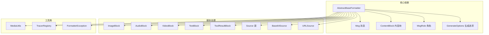

**图表来源**
- [AbstractBaseFormatter.java:18-43](file://agentscope-core/src/main/java/io/agentscope/core/formatter/AbstractBaseFormatter.java#L18-L43)

### 错误处理和异常传播

AbstractBaseFormatter 通过统一的异常处理机制确保错误的一致性：

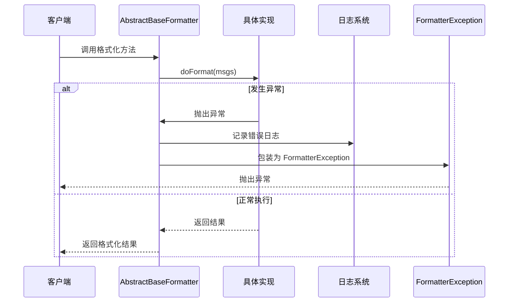

**图表来源**
- [AbstractBaseFormatter.java:248-251](file://agentscope-core/src/main/java/io/agentscope/core/formatter/AbstractBaseFormatter.java#L248-L251)

**章节来源**
- [FormatterException.java:24-44](file://agentscope-core/src/main/java/io/agentscope/core/formatter/FormatterException.java#L24-L44)

## 性能考虑

### 缓存策略

AbstractBaseFormatter 本身不直接实现缓存功能，但提供了以下性能优化点：

1. **线程安全的工具类使用**：通过静态工具类避免重复实例化
2. **延迟初始化**：具体格式化器的转换器和解析器采用延迟初始化
3. **流式处理**：使用 Java Stream API 进行高效的数据处理

### 媒体文件处理优化

AbstractBaseFormatter 在处理 Base64 数据时采用了以下优化策略：

- **临时文件管理**：自动清理临时文件，避免磁盘空间浪费
- **MIME 类型推断**：从 MIME 类型中提取文件扩展名，确保正确的文件格式
- **错误恢复**：当临时文件保存失败时，提供降级处理方案

### 扩展性考虑

AbstractBaseFormatter 的设计充分考虑了性能和扩展性的平衡：

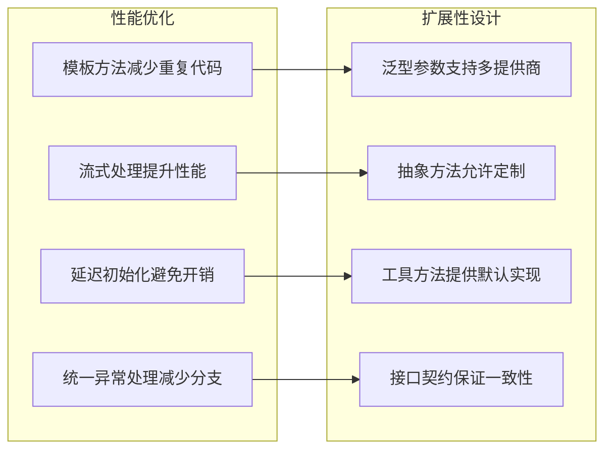

## 故障排除指南

### 常见问题诊断

#### 媒体文件保存失败

当 Base64 数据保存到临时文件失败时，AbstractBaseFormatter 会记录详细的错误信息并返回降级的错误消息：

**可能原因**：
- 磁盘空间不足
- 权限不足
- 文件路径无效
- Base64 数据格式错误

**解决方案**：
- 检查磁盘空间和权限
- 验证 Base64 数据格式
- 确认文件路径有效性

#### 思考块处理问题

如果发现思考块没有被正确过滤，需要检查：

**检查点**：
- 确认 MessageMetadataKeys.BYPASS_MULTIAGENT_HISTORY_MERGE 标志设置
- 验证 ThinkingBlock 的正确识别
- 检查日志输出确认过滤过程

#### 多模态内容处理异常

对于多模态内容处理异常，建议：

**诊断步骤**：
1. 检查媒体块的 Source 类型
2. 验证 MIME 类型和扩展名匹配
3. 确认 MediaUtils 工具类的配置

**章节来源**
- [AbstractBaseFormatter.java:248-251](file://agentscope-core/src/main/java/io/agentscope/core/formatter/AbstractBaseFormatter.java#L248-L251)

### 调试技巧

#### 启用详细日志

AbstractBaseFormatter 在关键处理点都添加了日志记录，可以通过调整日志级别来获取更多信息：

- **DEBUG 级别**：详细的操作过程和中间状态
- **ERROR 级别**：异常和错误信息
- **WARN 级别**：潜在问题和性能警告

#### 性能监控

建议监控以下指标来评估格式化器的性能：

- 格式化时间
- 媒体文件处理数量
- 异常发生频率
- 内存使用情况

## 结论

AbstractBaseFormatter 作为 AgentScope 框架的核心抽象类，通过精心设计的模板方法模式和工具方法，成功地将复杂的格式化逻辑标准化和简化。其主要优势包括：

1. **统一的接口设计**：通过泛型参数支持多种提供商的类型系统
2. **智能的内容处理**：自动识别和处理不同类型的 ContentBlock
3. **完善的错误处理**：提供一致的异常处理和日志记录机制
4. **灵活的扩展机制**：通过抽象方法允许具体实现定制特定需求
5. **性能优化考虑**：采用流式处理和延迟初始化等优化策略

该基类的设计为开发者提供了清晰的扩展点，使得新增新的大模型提供商格式化器变得简单而可靠。同时，其内置的工具处理和媒体内容支持确保了多模态应用的完整性。

通过遵循本文档中的最佳实践和重写指南，开发者可以快速实现高质量的格式化器，充分利用 AbstractBaseFormatter 提供的强大功能和性能优势。