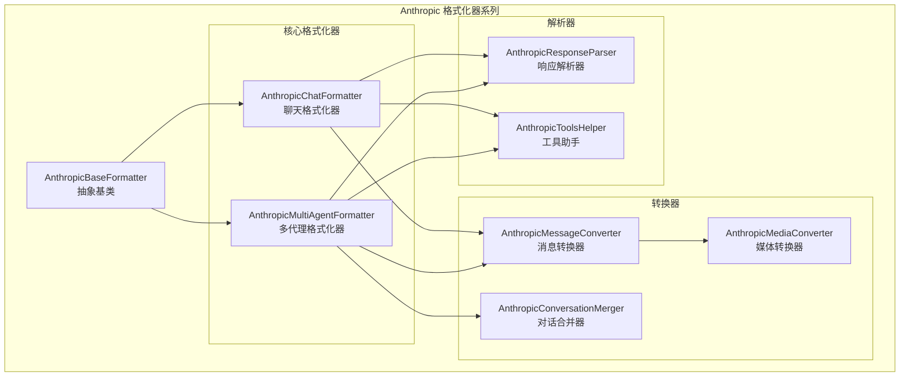
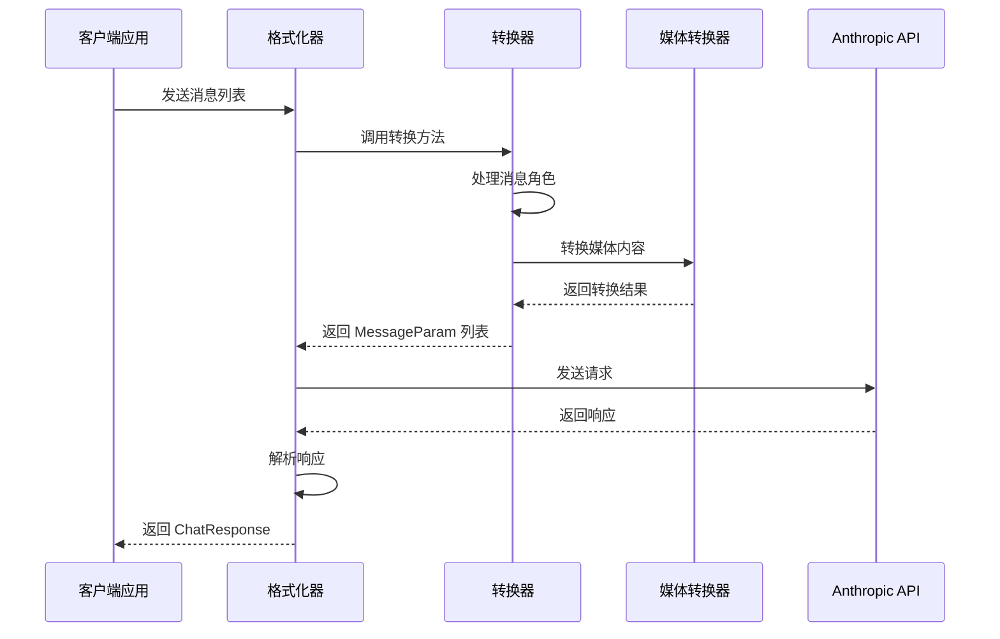
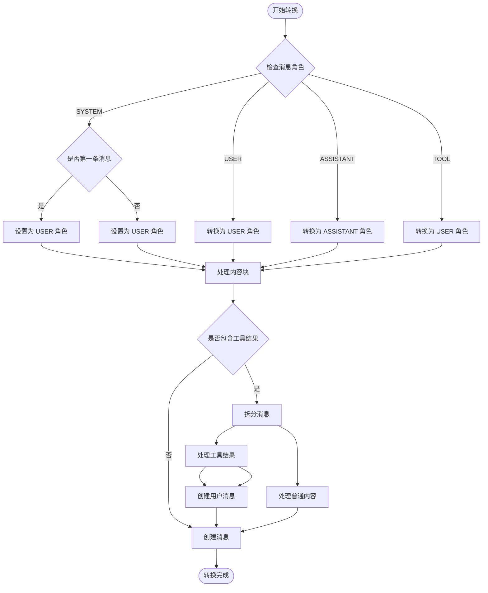
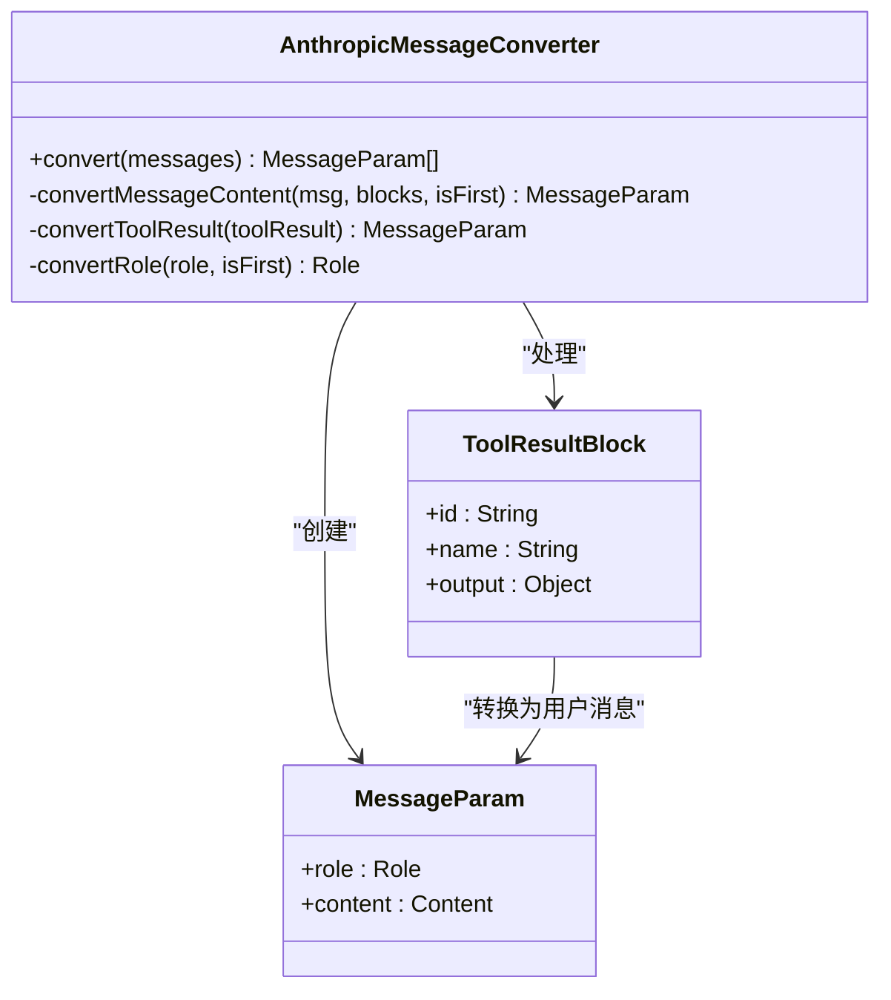
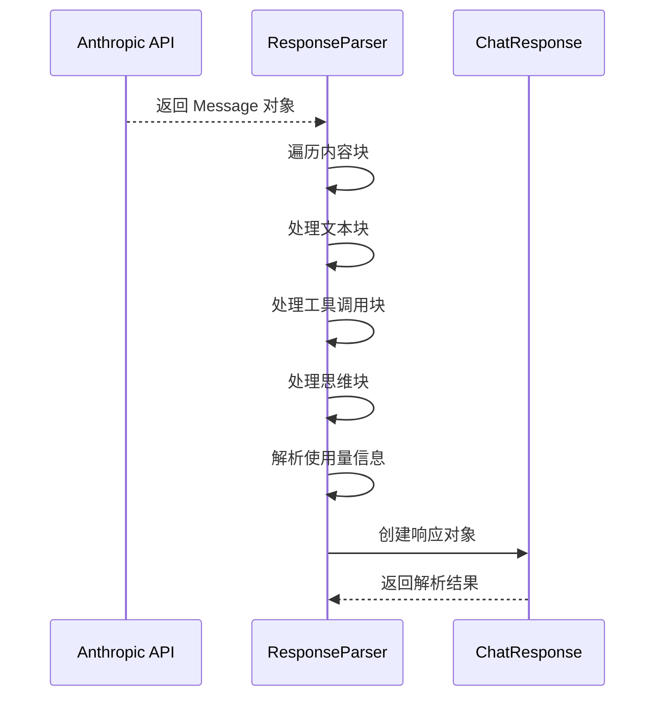
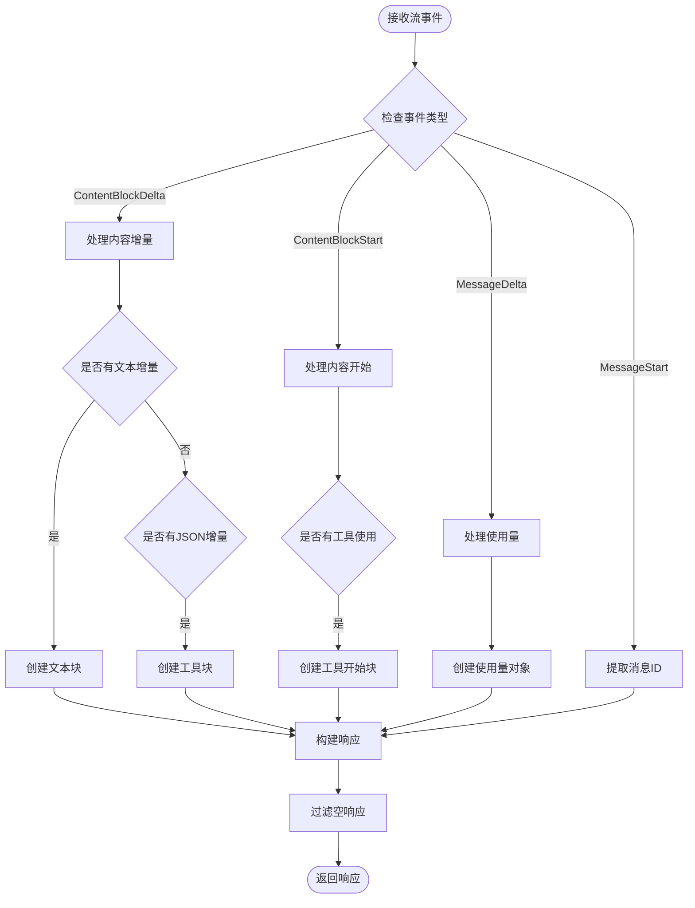
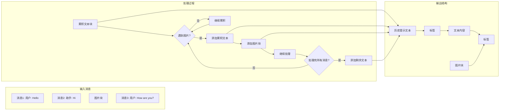
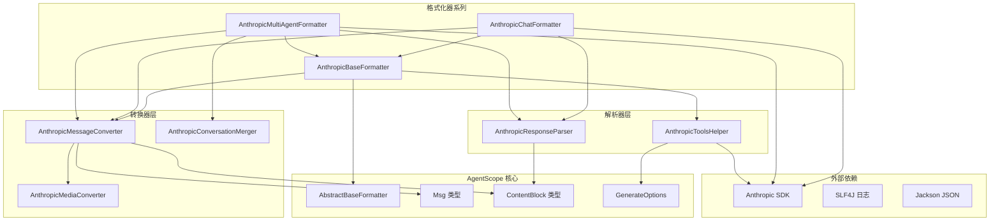
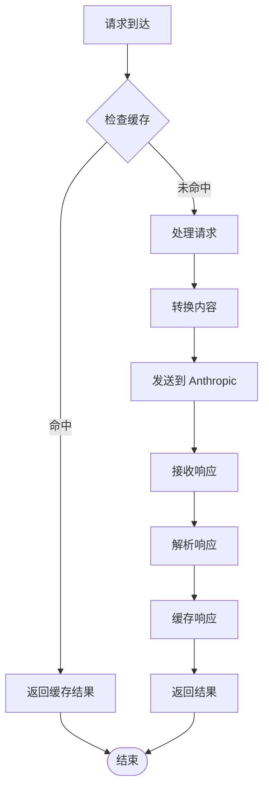

# Anthropic 格式化器

<cite>
**本文档引用的文件**
- [AnthropicChatFormatter.java](file://agentscope-core/src/main/java/io/agentscope/core/formatter/anthropic/AnthropicChatFormatter.java)
- [AnthropicBaseFormatter.java](file://agentscope-core/src/main/java/io/agentscope/core/formatter/anthropic/AnthropicBaseFormatter.java)
- [AnthropicMessageConverter.java](file://agentscope-core/src/main/java/io/agentscope/core/formatter/anthropic/AnthropicMessageConverter.java)
- [AnthropicResponseParser.java](file://agentscope-core/src/main/java/io/agentscope/core/formatter/anthropic/AnthropicResponseParser.java)
- [AnthropicConversationMerger.java](file://agentscope-core/src/main/java/io/agentscope/core/formatter/anthropic/AnthropicConversationMerger.java)
- [AnthropicToolsHelper.java](file://agentscope-core/src/main/java/io/agentscope/core/formatter/anthropic/AnthropicToolsHelper.java)
- [AnthropicMediaConverter.java](file://agentscope-core/src/main/java/io/agentscope/core/formatter/anthropic/AnthropicMediaConverter.java)
- [AnthropicMultiAgentFormatter.java](file://agentscope-core/src/main/java/io/agentscope/core/formatter/anthropic/AnthropicMultiAgentFormatter.java)
- [AbstractBaseFormatter.java](file://agentscope-core/src/main/java/io/agentscope/core/formatter/AbstractBaseFormatter.java)
- [AnthropicChatModel.java](file://agentscope-core/src/main/java/io/agentscope/core/model/AnthropicChatModel.java)
- [AnthropicChatFormatterTest.java](file://agentscope-core/src/test/java/io/agentscope/core/formatter/anthropic/AnthropicChatFormatterTest.java)
</cite>

## 目录
1. [简介](#简介)
2. [项目结构](#项目结构)
3. [核心组件](#核心组件)
4. [架构概览](#架构概览)
5. [详细组件分析](#详细组件分析)
6. [依赖关系分析](#依赖关系分析)
7. [性能考虑](#性能考虑)
8. [故障排除指南](#故障排除指南)
9. [结论](#结论)
10. [附录](#附录)

## 简介

Anthropic 格式化器系列是 AgentScope 框架中专门用于与 Anthropic Claude 模型进行交互的核心组件集合。该系列包含多个专门的格式化器，每个都针对 Anthropic API 的特定需求进行了优化。

本系列主要解决以下关键问题：
- 将 AgentScope 的通用消息格式转换为 Anthropic SDK 可识别的格式
- 处理 Anthropic API 的特殊要求（如系统消息、工具调用、多模态内容）
- 支持流式响应解析和非流式响应处理
- 提供多代理对话的历史管理功能
- 实现媒体内容的智能转换和处理

## 项目结构

Anthropic 格式化器系列位于 `agentscope-core/src/main/java/io/agentscope/core/formatter/anthropic/` 目录下，采用模块化设计，每个组件都有明确的职责分工：



**图表来源**
- [AnthropicBaseFormatter.java:1-107](file://agentscope-core/src/main/java/io/agentscope/core/formatter/anthropic/AnthropicBaseFormatter.java#L1-L107)
- [AnthropicChatFormatter.java:1-53](file://agentscope-core/src/main/java/io/agentscope/core/formatter/anthropic/AnthropicChatFormatter.java#L1-L53)
- [AnthropicMultiAgentFormatter.java:1-220](file://agentscope-core/src/main/java/io/agentscope/core/formatter/anthropic/AnthropicMultiAgentFormatter.java#L1-L220)

**章节来源**
- [AnthropicChatFormatter.java:1-53](file://agentscope-core/src/main/java/io/agentscope/core/formatter/anthropic/AnthropicChatFormatter.java#L1-L53)
- [AnthropicBaseFormatter.java:1-107](file://agentscope-core/src/main/java/io/agentscope/core/formatter/anthropic/AnthropicBaseFormatter.java#L1-L107)

## 核心组件

### AnthropicChatFormatter - 聊天格式化器

AnthropicChatFormatter 是最常用的格式化器，专门处理标准的单代理聊天场景。它继承自 AnthropicBaseFormatter，提供了简洁的接口来处理消息格式化和响应解析。

**核心特性：**
- 继承抽象基类的所有通用功能
- 专注于标准聊天消息的格式化
- 支持工具调用和系统消息处理
- 提供统一的响应解析接口

**章节来源**
- [AnthropicChatFormatter.java:25-53](file://agentscope-core/src/main/java/io/agentscope/core/formatter/anthropic/AnthropicChatFormatter.java#L25-L53)

### AnthropicMultiAgentFormatter - 多代理格式化器

AnthropicMultiAgentFormatter 专为多代理协作场景设计，能够将多个代理之间的对话历史整理成符合 Anthropic API 要求的格式。

**核心特性：**
- 自动分组系统消息、工具序列和代理对话
- 使用特殊标记结构化对话历史
- 合并多代理消息到单一用户消息中
- 支持首次代理消息组的特殊处理

**章节来源**
- [AnthropicMultiAgentFormatter.java:35-220](file://agentscope-core/src/main/java/io/agentscope/core/formatter/anthropic/AnthropicMultiAgentFormatter.java#L35-L220)

### AnthropicMessageConverter - 消息转换器

消息转换器是整个格式化器系列的核心，负责将 AgentScope 的通用消息格式转换为 Anthropic SDK 的 MessageParam 类型。

**核心功能：**
- 处理角色转换（系统消息、用户消息、助手消息、工具消息）
- 支持多模态内容（文本、图像、思维块、工具调用）
- 特殊处理工具结果（需要在单独的用户消息中）
- 系统消息提取和应用

**章节来源**
- [AnthropicMessageConverter.java:41-278](file://agentscope-core/src/main/java/io/agentscope/core/formatter/anthropic/AnthropicMessageConverter.java#L41-L278)

## 架构概览

Anthropic 格式化器系列采用分层架构设计，确保了高内聚低耦合的设计原则：



**图表来源**
- [AnthropicChatFormatter.java:39-51](file://agentscope-core/src/main/java/io/agentscope/core/formatter/anthropic/AnthropicChatFormatter.java#L39-L51)
- [AnthropicMessageConverter.java:74-116](file://agentscope-core/src/main/java/io/agentscope/core/formatter/anthropic/AnthropicMessageConverter.java#L74-L116)

## 详细组件分析

### AnthropicMessageConverter 深入分析

消息转换器实现了复杂的消息格式化逻辑，特别处理了 Anthropic API 的几个关键要求：

#### 角色转换策略



**图表来源**
- [AnthropicMessageConverter.java:74-116](file://agentscope-core/src/main/java/io/agentscope/core/formatter/anthropic/AnthropicMessageConverter.java#L74-L116)
- [AnthropicMessageConverter.java:243-251](file://agentscope-core/src/main/java/io/agentscope/core/formatter/anthropic/AnthropicMessageConverter.java#L243-L251)

#### 工具结果处理机制

工具结果在 Anthropic API 中有特殊的处理要求，必须在单独的用户消息中提供：



**图表来源**
- [AnthropicMessageConverter.java:182-237](file://agentscope-core/src/main/java/io/agentscope/core/formatter/anthropic/AnthropicMessageConverter.java#L182-L237)

**章节来源**
- [AnthropicMessageConverter.java:67-237](file://agentscope-core/src/main/java/io/agentscope/core/formatter/anthropic/AnthropicMessageConverter.java#L67-L237)

### AnthropicResponseParser 响应解析机制

响应解析器提供了对 Anthropic API 响应的完整支持，包括流式和非流式两种模式：

#### 非流式响应解析



**图表来源**
- [AnthropicResponseParser.java:49-98](file://agentscope-core/src/main/java/io/agentscope/core/formatter/anthropic/AnthropicResponseParser.java#L49-L98)

#### 流式响应处理

流式响应处理更加复杂，需要处理多种事件类型：



**图表来源**
- [AnthropicResponseParser.java:103-190](file://agentscope-core/src/main/java/io/agentscope/core/formatter/anthropic/AnthropicResponseParser.java#L103-L190)

**章节来源**
- [AnthropicResponseParser.java:38-211](file://agentscope-core/src/main/java/io/agentscope/core/formatter/anthropic/AnthropicResponseParser.java#L38-L211)

### AnthropicConversationMerger 对话历史管理

对话历史管理器专门处理多代理场景下的对话历史整理：

#### 历史标签结构



**图表来源**
- [AnthropicConversationMerger.java:38-99](file://agentscope-core/src/main/java/io/agentscope/core/formatter/anthropic/AnthropicConversationMerger.java#L38-L99)

**章节来源**
- [AnthropicConversationMerger.java:25-101](file://agentscope-core/src/main/java/io/agentscope/core/formatter/anthropic/AnthropicConversationMerger.java#L25-L101)

### AnthropicToolsHelper 工具调用支持

工具助手提供了完整的工具注册和配置支持：

#### 工具选择策略映射

| AgentScope ToolChoice | Anthropic ToolChoice |
|----------------------|---------------------|
| ToolChoice.Auto | ToolChoiceAuto |
| ToolChoice.None | ToolChoiceAny (退化处理) |
| ToolChoice.Required | ToolChoiceAny (强制工具使用) |
| ToolChoice.Specific | ToolChoiceTool |

**章节来源**
- [AnthropicToolsHelper.java:38-216](file://agentscope-core/src/main/java/io/agentscope/core/formatter/anthropic/AnthropicToolsHelper.java#L38-L216)

## 依赖关系分析

Anthropic 格式化器系列展现了清晰的依赖层次结构：



**图表来源**
- [AnthropicBaseFormatter.java:18-24](file://agentscope-core/src/main/java/io/agentscope/core/formatter/anthropic/AnthropicBaseFormatter.java#L18-L24)
- [AbstractBaseFormatter.java:18-31](file://agentscope-core/src/main/java/io/agentscope/core/formatter/AbstractBaseFormatter.java#L18-L31)

**章节来源**
- [AnthropicBaseFormatter.java:16-107](file://agentscope-core/src/main/java/io/agentscope/core/formatter/anthropic/AnthropicBaseFormatter.java#L16-L107)

## 性能考虑

### 内存优化策略

1. **流式处理**: 响应解析器使用 Reactor Flux 进行流式处理，避免大响应的内存峰值
2. **延迟转换**: 媒体内容转换采用按需处理，只在必要时进行转换
3. **对象复用**: 使用 ThreadLocal 存储生成选项，减少对象创建开销

### 缓存和重用机制



### 并发处理

- 使用线程本地存储避免并发冲突
- 异步流式处理支持高并发场景
- 媒体转换操作独立执行，减少阻塞

## 故障排除指南

### 常见问题诊断

#### 消息格式化错误

**症状**: 格式化后的消息不符合 Anthropic API 要求
**解决方案**: 
1. 检查消息角色转换逻辑
2. 验证工具结果是否正确拆分
3. 确认系统消息处理是否正确

#### 媒体内容处理失败

**症状**: 图片或视频无法正确转换
**解决方案**:
1. 检查媒体源类型（URL 或 Base64）
2. 验证文件扩展名和 MIME 类型
3. 确认临时文件权限

#### 工具调用解析异常

**症状**: 工具调用参数解析失败
**解决方案**:
1. 检查 JSON 序列化/反序列化
2. 验证工具参数模式
3. 确认工具选择策略映射

**章节来源**
- [AnthropicMessageConverter.java:142-152](file://agentscope-core/src/main/java/io/agentscope/core/formatter/anthropic/AnthropicMessageConverter.java#L142-L152)
- [AnthropicResponseParser.java:110-114](file://agentscope-core/src/main/java/io/agentscope/core/formatter/anthropic/AnthropicResponseParser.java#L110-L114)

## 结论

Anthropic 格式化器系列通过精心设计的架构和实现，成功解决了与 Anthropic Claude 模型集成的各种挑战。其主要优势包括：

1. **完整性**: 覆盖了从消息格式化到响应解析的完整流程
2. **灵活性**: 支持单代理和多代理场景的不同需求
3. **可靠性**: 提供了完善的错误处理和恢复机制
4. **性能**: 采用流式处理和缓存策略优化性能

该系列代码展现了优秀的软件工程实践，包括清晰的职责分离、良好的错误处理、以及充分的测试覆盖。

## 附录

### 配置指南

#### Claude 模型集成配置

```java
// 基本模型配置
AnthropicChatModel model = AnthropicChatModel.builder()
    .apiKey(System.getenv("ANTHROPIC_API_KEY"))
    .modelName("claude-3-5-sonnet-20241022")
    .stream(true)
    .build();

// 高级配置示例
GenerateOptions options = GenerateOptions.builder()
    .temperature(0.7)
    .maxTokens(1024)
    .topP(0.9)
    .additionalHeaders(Map.of("anthropic-version", "2023-06-01"))
    .build();
```

#### 性能优化建议

1. **合理设置超时时间**: 根据响应大小调整连接和读取超时
2. **启用流式处理**: 对于长响应启用流式处理以改善用户体验
3. **媒体内容预处理**: 在发送前进行必要的媒体内容压缩
4. **错误重试策略**: 配置适当的重试次数和退避策略

### API 参数映射参考

| AgentScope 参数 | Anthropic 参数 | 默认值 |
|----------------|----------------|--------|
| temperature | temperature | 1.0 |
| maxTokens | max_tokens | 4096 |
| topP | top_p | 1.0 |
| topK | top_k | 1.0 |
| toolChoice | tool_choice | auto |