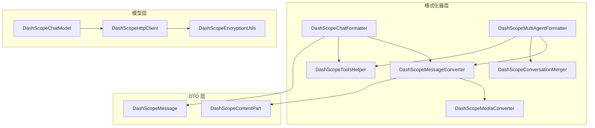
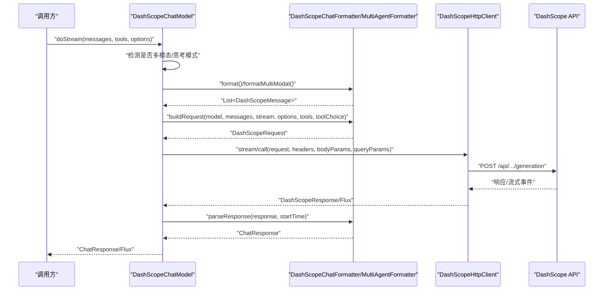
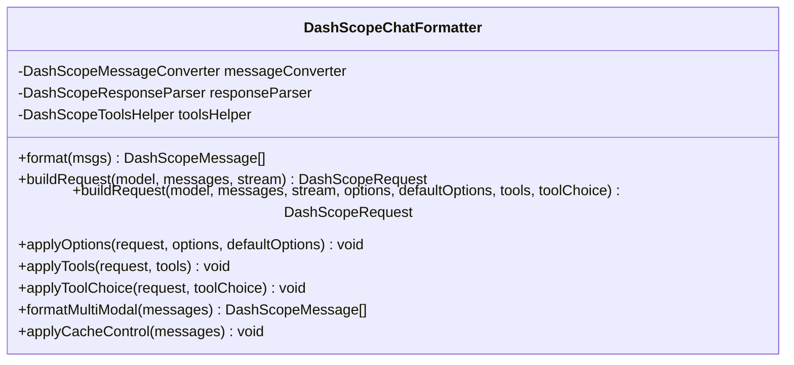
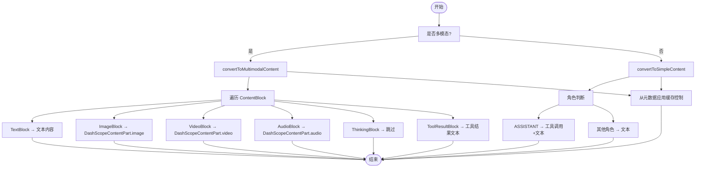
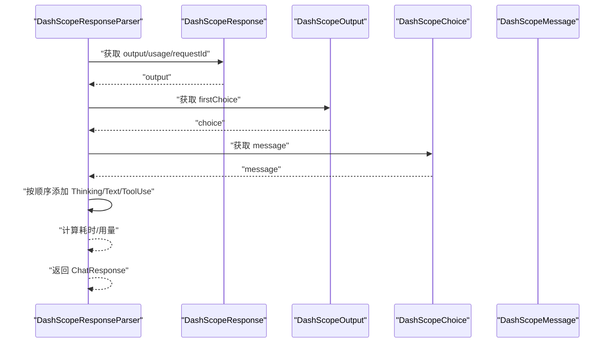
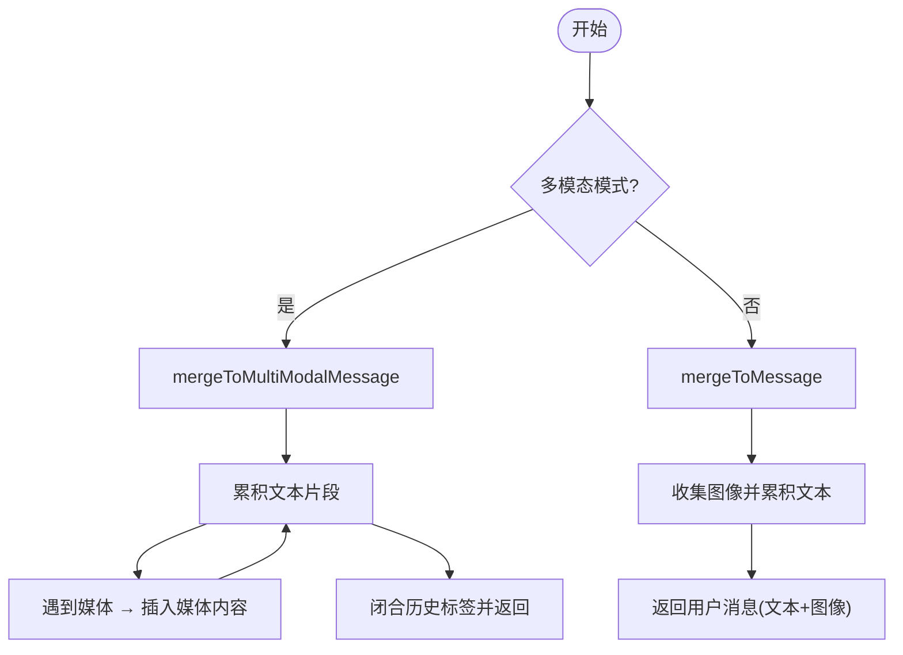
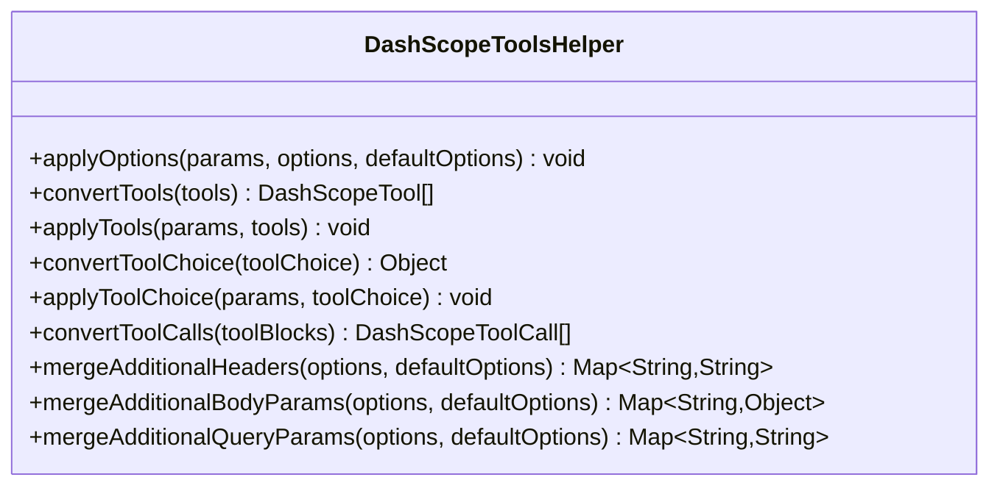
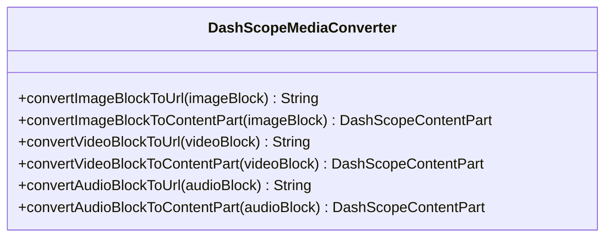
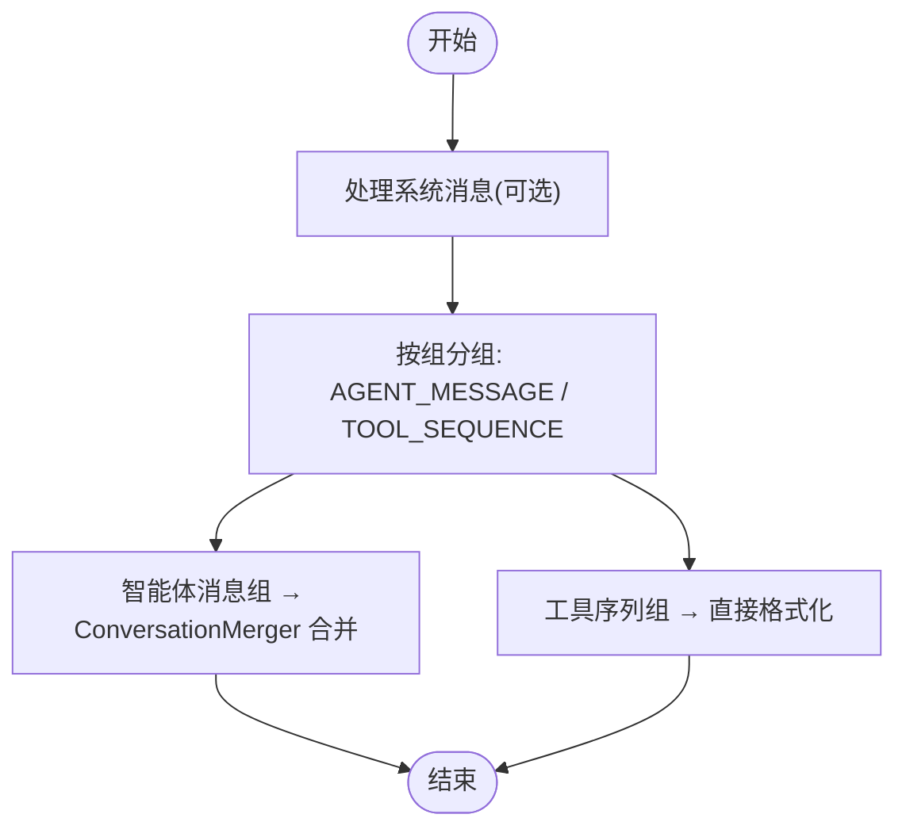
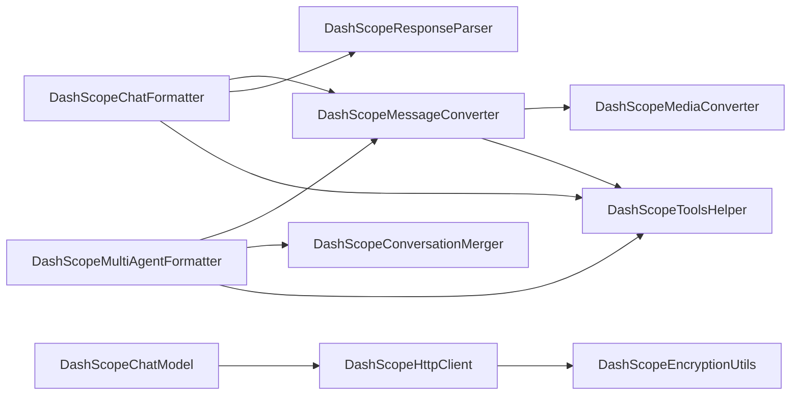

# DashScope 格式化器

<cite>
**本文档引用的文件**
- [DashScopeChatFormatter.java](file://agentscope-core/src/main/java/io/agentscope/core/formatter/dashscope/DashScopeChatFormatter.java)
- [DashScopeMessageConverter.java](file://agentscope-core/src/main/java/io/agentscope/core/formatter/dashscope/DashScopeMessageConverter.java)
- [DashScopeResponseParser.java](file://agentscope-core/src/main/java/io/agentscope/core/formatter/dashscope/DashScopeResponseParser.java)
- [DashScopeConversationMerger.java](file://agentscope-core/src/main/java/io/agentscope/core/formatter/dashscope/DashScopeConversationMerger.java)
- [DashScopeToolsHelper.java](file://agentscope-core/src/main/java/io/agentscope/core/formatter/dashscope/DashScopeToolsHelper.java)
- [DashScopeMediaConverter.java](file://agentscope-core/src/main/java/io/agentscope/core/formatter/dashscope/DashScopeMediaConverter.java)
- [DashScopeMultiAgentFormatter.java](file://agentscope-core/src/main/java/io/agentscope/core/formatter/dashscope/DashScopeMultiAgentFormatter.java)
- [DashScopeMessage.java](file://agentscope-core/src/main/java/io/agentscope/core/formatter/dashscope/dto/DashScopeMessage.java)
- [DashScopeContentPart.java](file://agentscope-core/src/main/java/io/agentscope/core/formatter/dashscope/dto/DashScopeContentPart.java)
- [DashScopeChatModel.java](file://agentscope-core/src/main/java/io/agentscope/core/model/DashScopeChatModel.java)
- [DashScopeHttpClient.java](file://agentscope-core/src/main/java/io/agentscope/core/model/DashScopeHttpClient.java)
- [DashScopeEncryptionUtils.java](file://agentscope-core/src/main/java/io/agentscope/core/model/DashScopeEncryptionUtils.java)
</cite>

## 目录
1. [简介](#简介)
2. [项目结构](#项目结构)
3. [核心组件](#核心组件)
4. [架构总览](#架构总览)
5. [详细组件分析](#详细组件分析)
6. [依赖关系分析](#依赖关系分析)
7. [性能考虑](#性能考虑)
8. [故障排除指南](#故障排除指南)
9. [结论](#结论)
10. [附录](#附录)

## 简介
本文件系统性地阐述 DashScope 格式化器系列在 AgentScope 中的实现与集成，重点覆盖以下方面：
- DashScopeChatFormatter：统一的消息格式化、请求构建与工具配置应用
- DashScopeMessageConverter：消息内容转换策略（文本/多模态）、工具调用映射与缓存控制
- DashScopeResponseParser：响应解析、流式工具调用片段处理与错误包装
- DashScopeConversationMerger：多智能体对话历史合并与多模态支持
- DashScopeToolsHelper：工具注册、参数映射、工具选择策略与附加参数合并
- DashScope 多媒体转换器：图像/视频/音频到 DashScope 内容部件的转换
- DashScope API 特殊要求与兼容性处理：端点路由、思考模式、搜索增强、加密传输
- 阿里云服务集成最佳实践：密钥管理、超时重试、头部与查询参数传递

## 项目结构
DashScope 格式化器位于 agentscope-core 模块的 formatter/dashscope 包中，配套 DTO 定义于同包下的 dto 子包；模型层通过 DashScopeChatModel 调用 DashScopeHttpClient 实现对 DashScope API 的直接访问。

**图表来源**
- [DashScopeChatFormatter.java:42-208](file://agentscope-core/src/main/java/io/agentscope/core/formatter/dashscope/DashScopeChatFormatter.java#L42-L208)
- [DashScopeMultiAgentFormatter.java:46-392](file://agentscope-core/src/main/java/io/agentscope/core/formatter/dashscope/DashScopeMultiAgentFormatter.java#L46-L392)
- [DashScopeMessageConverter.java:43-330](file://agentscope-core/src/main/java/io/agentscope/core/formatter/dashscope/DashScopeMessageConverter.java#L43-L330)
- [DashScopeConversationMerger.java:41-284](file://agentscope-core/src/main/java/io/agentscope/core/formatter/dashscope/DashScopeConversationMerger.java#L41-L284)
- [DashScopeToolsHelper.java:41-331](file://agentscope-core/src/main/java/io/agentscope/core/formatter/dashscope/DashScopeToolsHelper.java#L41-L331)
- [DashScopeMediaConverter.java:35-196](file://agentscope-core/src/main/java/io/agentscope/core/formatter/dashscope/DashScopeMediaConverter.java#L35-L196)
- [DashScopeMessage.java:56-247](file://agentscope-core/src/main/java/io/agentscope/core/formatter/dashscope/dto/DashScopeMessage.java#L56-L247)
- [DashScopeContentPart.java:43-298](file://agentscope-core/src/main/java/io/agentscope/core/formatter/dashscope/dto/DashScopeContentPart.java#L43-L298)
- [DashScopeChatModel.java:52-589](file://agentscope-core/src/main/java/io/agentscope/core/model/DashScopeChatModel.java#L52-L589)
- [DashScopeHttpClient.java:62-200](file://agentscope-core/src/main/java/io/agentscope/core/model/DashScopeHttpClient.java#L62-L200)

**章节来源**
- [DashScopeChatFormatter.java:16-208](file://agentscope-core/src/main/java/io/agentscope/core/formatter/dashscope/DashScopeChatFormatter.java#L16-L208)
- [DashScopeMessageConverter.java:16-330](file://agentscope-core/src/main/java/io/agentscope/core/formatter/dashscope/DashScopeMessageConverter.java#L16-L330)
- [DashScopeResponseParser.java:16-176](file://agentscope-core/src/main/java/io/agentscope/core/formatter/dashscope/DashScopeResponseParser.java#L16-L176)
- [DashScopeConversationMerger.java:16-284](file://agentscope-core/src/main/java/io/agentscope/core/formatter/dashscope/DashScopeConversationMerger.java#L16-L284)
- [DashScopeToolsHelper.java:16-331](file://agentscope-core/src/main/java/io/agentscope/core/formatter/dashscope/DashScopeToolsHelper.java#L16-L331)
- [DashScopeMediaConverter.java:16-196](file://agentscope-core/src/main/java/io/agentscope/core/formatter/dashscope/DashScopeMediaConverter.java#L16-L196)
- [DashScopeMultiAgentFormatter.java:16-392](file://agentscope-core/src/main/java/io/agentscope/core/formatter/dashscope/DashScopeMultiAgentFormatter.java#L16-L392)
- [DashScopeMessage.java:16-247](file://agentscope-core/src/main/java/io/agentscope/core/formatter/dashscope/dto/DashScopeMessage.java#L16-L247)
- [DashScopeContentPart.java:16-298](file://agentscope-core/src/main/java/io/agentscope/core/formatter/dashscope/dto/DashScopeContentPart.java#L16-L298)
- [DashScopeChatModel.java:16-589](file://agentscope-core/src/main/java/io/agentscope/core/model/DashScopeChatModel.java#L16-L589)
- [DashScopeHttpClient.java:16-200](file://agentscope-core/src/main/java/io/agentscope/core/model/DashScopeHttpClient.java#L16-L200)
- [DashScopeEncryptionUtils.java:16-182](file://agentscope-core/src/main/java/io/agentscope/core/model/DashScopeEncryptionUtils.java#L16-L182)

## 核心组件
- DashScopeChatFormatter：面向单智能体对话的统一格式化器，负责将 AgentScope Msg 转换为 DashScope DTO，并构建请求、应用生成选项与工具配置，支持缓存控制与多模态消息格式。
- DashScopeMessageConverter：消息内容转换的核心实现，支持文本、图像、视频、音频等多模态内容，处理工具调用与结果映射，支持从消息元数据应用缓存控制。
- DashScopeResponseParser：将 DashScope 响应解析为 AgentScope ChatResponse，正确处理思考内容、文本内容与工具调用，包含流式工具调用片段的聚合逻辑。
- DashScopeConversationMerger：多智能体对话历史合并器，将多个智能体的消息合并为单条用户消息，保留多模态内容并使用特定标签包裹历史。
- DashScopeToolsHelper：工具与参数的桥接器，负责将 AgentScope 的工具模式映射到 DashScope 支持的字符串或对象形式，合并额外头部/主体/查询参数。
- DashScopeMediaConverter：媒体内容转换器，将 ImageBlock/VideoBlock/AudioBlock 转换为 DashScope 兼容的 URL 或数据 URI，并设置像素与帧率等参数。
- DashScopeMultiAgentFormatter：多智能体专用格式化器，按组处理“智能体消息”和“工具序列”，支持多模态与缓存控制。

**章节来源**
- [DashScopeChatFormatter.java:42-208](file://agentscope-core/src/main/java/io/agentscope/core/formatter/dashscope/DashScopeChatFormatter.java#L42-L208)
- [DashScopeMessageConverter.java:43-330](file://agentscope-core/src/main/java/io/agentscope/core/formatter/dashscope/DashScopeMessageConverter.java#L43-L330)
- [DashScopeResponseParser.java:43-176](file://agentscope-core/src/main/java/io/agentscope/core/formatter/dashscope/DashScopeResponseParser.java#L43-L176)
- [DashScopeConversationMerger.java:41-284](file://agentscope-core/src/main/java/io/agentscope/core/formatter/dashscope/DashScopeConversationMerger.java#L41-L284)
- [DashScopeToolsHelper.java:41-331](file://agentscope-core/src/main/java/io/agentscope/core/formatter/dashscope/DashScopeToolsHelper.java#L41-L331)
- [DashScopeMediaConverter.java:35-196](file://agentscope-core/src/main/java/io/agentscope/core/formatter/dashscope/DashScopeMediaConverter.java#L35-L196)
- [DashScopeMultiAgentFormatter.java:46-392](file://agentscope-core/src/main/java/io/agentscope/core/formatter/dashscope/DashScopeMultiAgentFormatter.java#L46-L392)

## 架构总览
DashScopeChatModel 作为高层入口，根据模型名称自动选择文本或多模态 API 端点，调用对应格式化器构建请求，再通过 DashScopeHttpClient 发送 HTTP 请求，最后由格式化器解析响应。

**图表来源**
- [DashScopeChatModel.java:194-315](file://agentscope-core/src/main/java/io/agentscope/core/model/DashScopeChatModel.java#L194-L315)
- [DashScopeChatFormatter.java:133-173](file://agentscope-core/src/main/java/io/agentscope/core/formatter/dashscope/DashScopeChatFormatter.java#L133-L173)
- [DashScopeMultiAgentFormatter.java:217-266](file://agentscope-core/src/main/java/io/agentscope/core/formatter/dashscope/DashScopeMultiAgentFormatter.java#L217-L266)
- [DashScopeHttpClient.java:165-200](file://agentscope-core/src/main/java/io/agentscope/core/model/DashScopeHttpClient.java#L165-L200)

## 详细组件分析

### DashScopeChatFormatter 分析
- 主要职责
  - 将 AgentScope Msg 列表转换为 DashScopeMessage 列表，支持简单文本与多模态内容
  - 构建 DashScopeRequest，自动设置增量输出（流式）
  - 应用生成选项（温度、采样、最大令牌数、思考预算等）与工具配置
  - 应用缓存控制（系统消息与最后一条消息）
- 关键方法
  - format/doFormat：遍历消息，调用 MessageConverter 并过滤空结果
  - buildRequest/buildRequest（带完整参数）：封装模型名、消息列表与参数
  - applyOptions/applyTools/applyToolChoice：委托 ToolsHelper 完成参数映射
  - formatMultiModal：强制多模态格式
  - applyCacheControl：为系统消息与最后消息添加临时缓存控制
- 与其他组件的关系
  - 依赖 MessageConverter 进行内容转换
  - 依赖 ResponseParser 解析响应
  - 依赖 ToolsHelper 映射工具与选项

**图表来源**
- [DashScopeChatFormatter.java:42-208](file://agentscope-core/src/main/java/io/agentscope/core/formatter/dashscope/DashScopeChatFormatter.java#L42-L208)

**章节来源**
- [DashScopeChatFormatter.java:42-208](file://agentscope-core/src/main/java/io/agentscope/core/formatter/dashscope/DashScopeChatFormatter.java#L42-L208)

### DashScopeMessageConverter 分析
- 主要职责
  - 将 AgentScope Msg 转换为 DashScopeMessage，支持简单文本与多模态内容
  - 处理工具调用（ASSISTANT）与工具结果（TOOL）
  - 从消息元数据提取缓存控制标记
  - 多媒体内容转换（图像/视频/音频），异常时降级为文本占位
- 关键流程
  - convertToMessage：根据 useMultimodal 标志选择路径
  - convertToMultimodalContent：遍历 ContentBlock，分别处理文本/图像/视频/音频/思考/工具结果
  - convertToSimpleContent：处理非多模态场景，含工具调用与空内容填充
  - convertToolRoleMessage：TOOL 角色消息的特殊格式
  - convertContentBlocks：工具结果中的多媒体内容转换
- 错误处理
  - 媒体转换异常记录警告并插入占位文本
  - ThinkingBlock 在多模态与简单模式下均被跳过

**图表来源**
- [DashScopeMessageConverter.java:67-236](file://agentscope-core/src/main/java/io/agentscope/core/formatter/dashscope/DashScopeMessageConverter.java#L67-L236)

**章节来源**
- [DashScopeMessageConverter.java:43-330](file://agentscope-core/src/main/java/io/agentscope/core/formatter/dashscope/DashScopeMessageConverter.java#L43-L330)

### DashScopeResponseParser 分析
- 主要职责
  - 将 DashScopeResponse 解析为 ChatResponse，包含内容块（思考/文本/工具调用）
  - 计算用量与耗时
  - 流式工具调用片段的聚合：首块携带函数名与 ID，后续仅携带参数片段
- 关键点
  - 顺序处理：思考内容 → 文本内容 → 工具调用
  - 工具调用解析：支持首次块与片段块两种形态
  - 异常包装：捕获解析异常并抛出 FormatterException

**图表来源**
- [DashScopeResponseParser.java:59-121](file://agentscope-core/src/main/java/io/agentscope/core/formatter/dashscope/DashScopeResponseParser.java#L59-L121)

**章节来源**
- [DashScopeResponseParser.java:43-176](file://agentscope-core/src/main/java/io/agentscope/core/formatter/dashscope/DashScopeResponseParser.java#L43-L176)

### DashScopeConversationMerger 分析
- 主要职责
  - 将多智能体对话历史合并为单条用户消息，使用特定标签包裹历史
  - 支持文本模式与多模态模式，保留图像/视频/音频内容
  - 对工具结果进行字符串化处理
- 关键差异
  - mergeToMessage：纯文本模式，图像单独收集并在末尾保留
  - mergeToMultiModalMessage：多模态模式，文本与媒体交错插入，确保历史标签闭合
- 边界处理
  - 空内容时插入空文本占位
  - ThinkingBlock 被跳过
  - 工具结果为空时使用占位符

**图表来源**
- [DashScopeConversationMerger.java:73-162](file://agentscope-core/src/main/java/io/agentscope/core/formatter/dashscope/DashScopeConversationMerger.java#L73-L162)

**章节来源**
- [DashScopeConversationMerger.java:41-284](file://agentscope-core/src/main/java/io/agentscope/core/formatter/dashscope/DashScopeConversationMerger.java#L41-L284)

### DashScopeToolsHelper 分析
- 主要职责
  - 将 AgentScope 的 GenerateOptions 映射到 DashScopeParameters（温度、topP、maxTokens、思考预算、topK、seed、惩罚项等）
  - 将 ToolSchema 转换为 DashScopeTool 列表
  - 将 ToolChoice 转换为 DashScope 支持的字符串或对象形式
  - 合并额外头部/主体/查询参数（默认优先，主选项覆盖）
- 工具选择策略
  - Auto → "auto"
  - None → "none"
  - Required → 提示不直接支持，回退为 "auto"
  - Specific → {"type":"function","function":{"name":"..."}}

**图表来源**
- [DashScopeToolsHelper.java:41-331](file://agentscope-core/src/main/java/io/agentscope/core/formatter/dashscope/DashScopeToolsHelper.java#L41-L331)

**章节来源**
- [DashScopeToolsHelper.java:41-331](file://agentscope-core/src/main/java/io/agentscope/core/formatter/dashscope/DashScopeToolsHelper.java#L41-L331)

### DashScopeMediaConverter 分析
- 主要职责
  - 将 ImageBlock/VideoBlock/AudioBlock 转换为 DashScope 兼容的内容部件或 URL
  - 统一使用 file:// 协议处理本地文件，保持与 OpenAI 不同的协议差异
  - 设置像素阈值、帧率、帧数等参数
- 支持的源类型
  - URLSource：校验扩展名并转换为协议 URL
  - Base64Source：构造 data: 类型的数据 URI
  - 其他类型：抛出非法参数异常

**图表来源**
- [DashScopeMediaConverter.java:35-196](file://agentscope-core/src/main/java/io/agentscope/core/formatter/dashscope/DashScopeMediaConverter.java#L35-L196)

**章节来源**
- [DashScopeMediaConverter.java:35-196](file://agentscope-core/src/main/java/io/agentscope/core/formatter/dashscope/DashScopeMediaConverter.java#L35-L196)

### DashScopeMultiAgentFormatter 分析
- 主要职责
  - 处理多智能体对话：先处理系统消息，再按组处理“智能体消息”和“工具序列”
  - 支持多模态与缓存控制
  - 提供 formatMultiModal 与 buildRequest 的多模态版本
- 分组策略
  - 顺序扫描消息，将包含工具相关块的消息归为一组（TOOL_SEQUENCE），其余为 AGENT_MESSAGE
- 工具序列格式化
  - ASSISTANT：工具调用 + 文本
  - TOOL/SYSTEM(含工具结果)：工具结果文本

**图表来源**
- [DashScopeMultiAgentFormatter.java:80-118](file://agentscope-core/src/main/java/io/agentscope/core/formatter/dashscope/DashScopeMultiAgentFormatter.java#L80-L118)

**章节来源**
- [DashScopeMultiAgentFormatter.java:46-392](file://agentscope-core/src/main/java/io/agentscope/core/formatter/dashscope/DashScopeMultiAgentFormatter.java#L46-L392)

## 依赖关系分析
- 组件耦合
  - ChatFormatter 依赖 MessageConverter、ResponseParser、ToolsHelper
  - MessageConverter 依赖 MediaConverter、ToolsHelper 与工具结果转换器
  - MultiAgentFormatter 依赖 MessageConverter、ConversationMerger、ToolsHelper
  - ChatModel 依赖 HttpClient 与 Formatter
- 外部依赖
  - DashScope API 端点：文本生成与多模态生成
  - 加密：RSA 公钥交换 + AES-GCM 数据加解密
- 可能的循环依赖
  - 当前实现未见循环依赖，各组件职责清晰

**图表来源**
- [DashScopeChatFormatter.java:47-54](file://agentscope-core/src/main/java/io/agentscope/core/formatter/dashscope/DashScopeChatFormatter.java#L47-L54)
- [DashScopeMessageConverter.java:47-54](file://agentscope-core/src/main/java/io/agentscope/core/formatter/dashscope/DashScopeMessageConverter.java#L47-L54)
- [DashScopeMultiAgentFormatter.java:54-57](file://agentscope-core/src/main/java/io/agentscope/core/formatter/dashscope/DashScopeMultiAgentFormatter.java#L54-L57)
- [DashScopeChatModel.java:62-66](file://agentscope-core/src/main/java/io/agentscope/core/model/DashScopeChatModel.java#L62-L66)
- [DashScopeHttpClient.java:80-84](file://agentscope-core/src/main/java/io/agentscope/core/model/DashScopeHttpClient.java#L80-L84)
- [DashScopeEncryptionUtils.java:42-55](file://agentscope-core/src/main/java/io/agentscope/core/model/DashScopeEncryptionUtils.java#L42-L55)

**章节来源**
- [DashScopeChatFormatter.java:47-54](file://agentscope-core/src/main/java/io/agentscope/core/formatter/dashscope/DashScopeChatFormatter.java#L47-L54)
- [DashScopeMessageConverter.java:47-54](file://agentscope-core/src/main/java/io/agentscope/core/formatter/dashscope/DashScopeMessageConverter.java#L47-L54)
- [DashScopeMultiAgentFormatter.java:54-57](file://agentscope-core/src/main/java/io/agentscope/core/formatter/dashscope/DashScopeMultiAgentFormatter.java#L54-L57)
- [DashScopeChatModel.java:62-66](file://agentscope-core/src/main/java/io/agentscope/core/model/DashScopeChatModel.java#L62-L66)
- [DashScopeHttpClient.java:80-84](file://agentscope-core/src/main/java/io/agentscope/core/model/DashScopeHttpClient.java#L80-L84)
- [DashScopeEncryptionUtils.java:42-55](file://agentscope-core/src/main/java/io/agentscope/core/model/DashScopeEncryptionUtils.java#L42-L55)

## 性能考虑
- 多模态消息
  - 图像/视频/音频转换可能引入 I/O 与编码开销，建议在工具结果中谨慎使用大体积媒体
- 缓存控制
  - applyCacheControl 仅在必要时添加临时缓存标记，避免重复写入
- 流式响应
  - 流式模式下，工具调用片段需在上层聚合，避免频繁对象创建
- 端点选择
  - 自动检测模型类型以选择合适端点，减少不必要的失败重试

## 故障排除指南
- 媒体转换失败
  - 现象：日志出现警告，内容替换为占位文本
  - 排查：检查源类型与 URL 扩展名，确认 Base64 数据格式
- 工具调用解析异常
  - 现象：解析响应时抛出 FormatterException
  - 排查：确认 DashScopeResponse 结构与工具调用字段命名
- 加密配置问题
  - 现象：构建模型时报错或请求失败
  - 排查：确认公钥 ID 与公钥有效，网络可达 DashScope 公钥接口
- 思考模式与流式
  - 现象：启用思考模式但未开启流式导致行为不符合预期
  - 排查：确保 enableThinking 为真时流式自动启用

**章节来源**
- [DashScopeMessageConverter.java:104-110](file://agentscope-core/src/main/java/io/agentscope/core/formatter/dashscope/DashScopeMessageConverter.java#L104-L110)
- [DashScopeResponseParser.java:116-120](file://agentscope-core/src/main/java/io/agentscope/core/formatter/dashscope/DashScopeResponseParser.java#L116-L120)
- [DashScopeChatModel.java:320-345](file://agentscope-core/src/main/java/io/agentscope/core/model/DashScopeChatModel.java#L320-L345)
- [DashScopeEncryptionUtils.java:172-180](file://agentscope-core/src/main/java/io/agentscope/core/model/DashScopeEncryptionUtils.java#L172-L180)

## 结论
DashScope 格式化器系列在 AgentScope 中提供了完整的从消息格式化、请求构建、工具配置到响应解析与多模态支持的闭环能力。通过明确的组件分工与严格的错误处理，能够稳定地对接 DashScope 的文本与多模态 API，并在阿里云生态中实现安全传输与高效集成。

## 附录

### DashScope API 特殊要求与兼容性处理
- 端点路由
  - 文本模型：使用文本生成端点
  - 视觉/多模态模型：使用多模态生成端点
- 思考模式
  - 需要启用流式；budget 参数需显式启用思考模式
- 搜索增强
  - 通过参数开关启用互联网搜索
- 缓存控制
  - 通过 cache_control 字段控制提示缓存，系统消息与最后消息默认应用临时缓存
- 加密传输
  - 支持 RSA 公钥交换 + AES-GCM 数据加解密，遵循阿里云加密协议

**章节来源**
- [DashScopeChatModel.java:194-345](file://agentscope-core/src/main/java/io/agentscope/core/model/DashScopeChatModel.java#L194-L345)
- [DashScopeHttpClient.java:66-78](file://agentscope-core/src/main/java/io/agentscope/core/model/DashScopeHttpClient.java#L66-L78)
- [DashScopeChatFormatter.java:184-197](file://agentscope-core/src/main/java/io/agentscope/core/formatter/dashscope/DashScopeChatFormatter.java#L184-L197)
- [DashScopeEncryptionUtils.java:30-41](file://agentscope-core/src/main/java/io/agentscope/core/model/DashScopeEncryptionUtils.java#L30-L41)

### 阿里云服务集成最佳实践
- 密钥与证书
  - 使用 enableEncrypt 自动拉取最新公钥，避免硬编码密钥
- 超时与重试
  - 通过 GenerateOptions 配置超时与重试策略，结合模型层统一应用
- 头部与查询参数
  - 使用 ToolsHelper 合并额外头部/主体/查询参数，保证默认优先、主选项覆盖
- 多模态与缓存
  - 视觉模型必须使用多模态格式；合理使用缓存控制提升交互效率

**章节来源**
- [DashScopeChatModel.java:209-212](file://agentscope-core/src/main/java/io/agentscope/core/model/DashScopeChatModel.java#L209-L212)
- [DashScopeToolsHelper.java:271-329](file://agentscope-core/src/main/java/io/agentscope/core/formatter/dashscope/DashScopeToolsHelper.java#L271-L329)