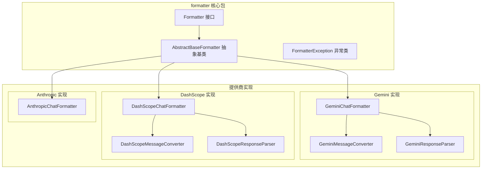
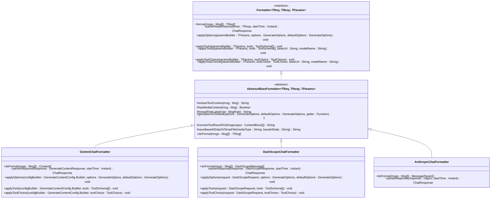
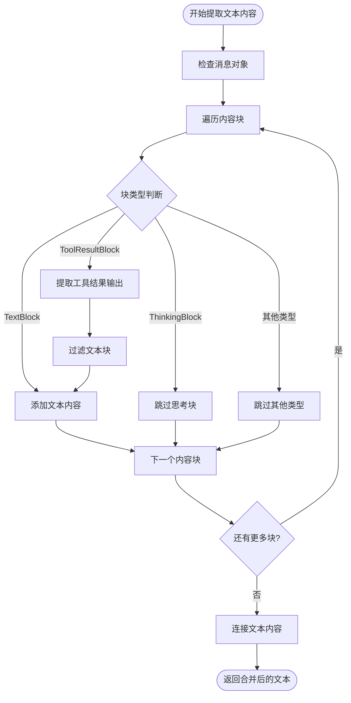
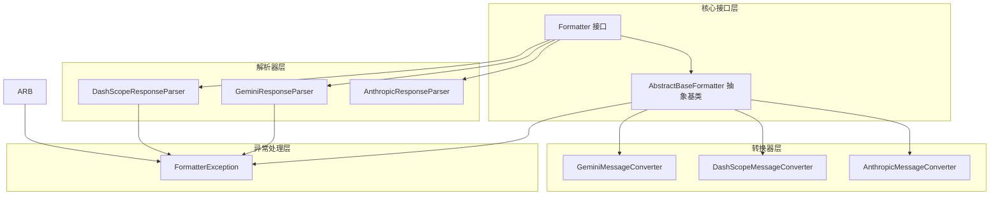

# Formatter 接口设计

<cite>
**本文档引用的文件**
- [Formatter.java](file://agentscope-core/src/main/java/io/agentscope/core/formatter/Formatter.java)
- [AbstractBaseFormatter.java](file://agentscope-core/src/main/java/io/agentscope/core/formatter/AbstractBaseFormatter.java)
- [FormatterException.java](file://agentscope-core/src/main/java/io/agentscope/core/formatter/FormatterException.java)
- [GeminiChatFormatter.java](file://agentscope-core/src/main/java/io/agentscope/core/formatter/gemini/GeminiChatFormatter.java)
- [DashScopeChatFormatter.java](file://agentscope-core/src/main/java/io/agentscope/core/formatter/dashscope/DashScopeChatFormatter.java)
- [AnthropicChatFormatter.java](file://agentscope-core/src/main/java/io/agentscope/core/formatter/anthropic/AnthropicChatFormatter.java)
- [GeminiMessageConverter.java](file://agentscope-core/src/main/java/io/agentscope/core/formatter/gemini/GeminiMessageConverter.java)
- [GeminiResponseParser.java](file://agentscope-core/src/main/java/io/agentscope/core/formatter/gemini/GeminiResponseParser.java)
- [DashScopeMessageConverter.java](file://agentscope-core/src/main/java/io/agentscope/core/formatter/dashscope/DashScopeMessageConverter.java)
- [DashScopeResponseParser.java](file://agentscope-core/src/main/java/io/agentscope/core/formatter/dashscope/DashScopeResponseParser.java)
</cite>

## 目录
1. [简介](#简介)
2. [项目结构](#项目结构)
3. [核心组件](#核心组件)
4. [架构概览](#架构概览)
5. [详细组件分析](#详细组件分析)
6. [依赖关系分析](#依赖关系分析)
7. [性能考虑](#性能考虑)
8. [故障排除指南](#故障排除指南)
9. [结论](#结论)

## 简介

Formatter 接口是 AgentScope 框架中用于在统一的消息格式与各模型提供商特定格式之间进行转换的核心抽象。该接口定义了四个核心功能域：消息格式化、响应解析、生成选项应用和工具模式处理。通过泛型参数 TReq、TResp、TParams，Formatter 实现能够针对不同提供商的 SDK 类型进行类型安全的转换。

## 项目结构

Formatter 相关代码主要位于 agentscope-core 模块的 formatter 包中，采用按提供商分包的组织方式：

**图表来源**
- [Formatter.java:45-135](file://agentscope-core/src/main/java/io/agentscope/core/formatter/Formatter.java#L45-L135)
- [AbstractBaseFormatter.java:60-301](file://agentscope-core/src/main/java/io/agentscope/core/formatter/AbstractBaseFormatter.java#L60-L301)

**章节来源**
- [Formatter.java:1-136](file://agentscope-core/src/main/java/io/agentscope/core/formatter/Formatter.java#L1-L136)
- [AbstractBaseFormatter.java:1-302](file://agentscope-core/src/main/java/io/agentscope/core/formatter/AbstractBaseFormatter.java#L1-L302)

## 核心组件

### 泛型参数设计

Formatter 接口使用三个泛型参数来确保类型安全：

- **TReq**: 提供商特定的请求消息类型
  - 示例：DashScope 的 com.alibaba.dashscope.common.Message
  - 示例：OpenAI 的 ChatCompletionMessageParam
  - 示例：Anthropic 的 MessageParam

- **TResp**: 提供商特定的响应类型
  - 示例：DashScope 的 GenerationResult
  - 示例：OpenAI 的 ChatCompletion/ChatCompletionChunk
  - 示例：Anthropic 的 Message

- **TParams**: 提供商特定的请求参数构建器类型
  - 示例：DashScope 的 GenerationParam
  - 示例：OpenAI 的 ChatCompletionCreateParams.Builder

### 四大核心功能域

1. **消息格式化 (format)**: 将 AgentScope 的 Msg 对象转换为提供商特定的请求消息格式
2. **响应解析 (parseResponse)**: 将提供商特定的响应对象解析为 AgentScope 的 ChatResponse
3. **生成选项应用 (applyOptions)**: 将 GenerateOptions 应用到提供商的参数构建器
4. **工具模式处理 (applyTools)**: 将工具模式定义应用到提供商的参数构建器

**章节来源**
- [Formatter.java:26-44](file://agentscope-core/src/main/java/io/agentscope/core/formatter/Formatter.java#L26-L44)
- [Formatter.java:47-80](file://agentscope-core/src/main/java/io/agentscope/core/formatter/Formatter.java#L47-L80)

## 架构概览

Formatter 架构采用抽象工厂模式，通过抽象基类提供通用功能，具体提供商实现负责特定的转换逻辑：

**图表来源**
- [Formatter.java:45-135](file://agentscope-core/src/main/java/io/agentscope/core/formatter/Formatter.java#L45-L135)
- [AbstractBaseFormatter.java:60-301](file://agentscope-core/src/main/java/io/agentscope/core/formatter/AbstractBaseFormatter.java#L60-L301)
- [GeminiChatFormatter.java:52-208](file://agentscope-core/src/main/java/io/agentscope/core/formatter/gemini/GeminiChatFormatter.java#L52-L208)
- [DashScopeChatFormatter.java:42-207](file://agentscope-core/src/main/java/io/agentscope/core/formatter/dashscope/DashScopeChatFormatter.java#L42-L207)
- [AnthropicChatFormatter.java:37-52](file://agentscope-core/src/main/java/io/agentscope/core/formatter/anthropic/AnthropicChatFormatter.java#L37-L52)

## 详细组件分析

### AbstractBaseFormatter 抽象基类

AbstractBaseFormatter 提供了所有 Formatter 实现共享的核心功能：

#### 文本内容提取

**图表来源**
- [AbstractBaseFormatter.java:84-107](file://agentscope-core/src/main/java/io/agentscope/core/formatter/AbstractBaseFormatter.java#L84-L107)

#### 媒体内容检测
AbstractBaseFormatter 能够智能识别包含图像、音频、视频等多媒体内容的消息，这对于选择合适的 API 调用方式（如多模态 vs 文本）至关重要。

#### 角色标签格式化
提供统一的角色标签格式化机制，支持 USER、ASSISTANT、SYSTEM、TOOL 等角色的标准化处理。

**章节来源**
- [AbstractBaseFormatter.java:63-301](file://agentscope-core/src/main/java/io/agentscope/core/formatter/AbstractBaseFormatter.java#L63-L301)

### GeminiChatFormatter 实现

GeminiChatFormatter 是 Google Gemini API 的专用实现，具有以下特点：

#### 生成选项映射
GeminiChatFormatter 将 AgentScope 的 GenerateOptions 映射到 Gemini SDK 的对应配置：

| AgentScope 选项 | Gemini 配置 | 数据类型 |
|----------------|-------------|----------|
| temperature | temperature | Float |
| topP | topP | Float |
| topK | topK | Float |
| seed | seed | Integer |
| maxTokens | maxOutputTokens | Integer |
| frequencyPenalty | frequencyPenalty | Float |
| presencePenalty | presencePenalty | Float |

#### 工具配置支持
- 支持完整的工具定义转换
- 支持工具选择配置（ToolChoice）
- 特殊的思维配置（ThinkingConfig）

**章节来源**
- [GeminiChatFormatter.java:79-207](file://agentscope-core/src/main/java/io/agentscope/core/formatter/gemini/GeminiChatFormatter.java#L79-L207)

### DashScopeChatFormatter 实现

DashScopeChatFormatter 提供了对阿里云 DashScope API 的完整支持：

#### 多模态消息处理
DashScopeChatFormatter 能够处理复杂的多模态消息，包括：
- 文本内容
- 图像、音频、视频媒体
- 工具体结果
- 思考内容

#### 缓存控制机制
实现了特殊的缓存控制功能，通过 `cache_control` 参数控制消息的缓存行为。

#### 请求构建器模式
提供了完整的请求构建器模式，支持：
- 模型名称设置
- 消息列表构建
- 流式输出配置
- 工具配置
- 工具选择配置

**章节来源**
- [DashScopeChatFormatter.java:42-207](file://agentscope-core/src/main/java/io/agentscope/core/formatter/dashscope/DashScopeChatFormatter.java#L42-L207)

### AnthropicChatFormatter 实现

AnthropicChatFormatter 专门处理 Anthropic Claude API 的特殊要求：

#### 系统消息限制
- 只有第一条消息可以是系统消息
- 其他消息需要通过特殊参数处理

#### 工具结果处理
- 工具结果必须在独立的用户消息中发送
- 支持原生的思考块（ThinkingBlock）处理

**章节来源**
- [AnthropicChatFormatter.java:37-52](file://agentscope-core/src/main/java/io/agentscope/core/formatter/anthropic/AnthropicChatFormatter.java#L37-L52)

## 依赖关系分析

Formatter 接口的实现遵循清晰的依赖层次结构：

**图表来源**
- [Formatter.java:45-135](file://agentscope-core/src/main/java/io/agentscope/core/formatter/Formatter.java#L45-L135)
- [AbstractBaseFormatter.java:60-301](file://agentscope-core/src/main/java/io/agentscope/core/formatter/AbstractBaseFormatter.java#L60-L301)
- [FormatterException.java:24-44](file://agentscope-core/src/main/java/io/agentscope/core/formatter/FormatterException.java#L24-L44)

**章节来源**
- [Formatter.java:1-136](file://agentscope-core/src/main/java/io/agentscope/core/formatter/Formatter.java#L1-L136)
- [AbstractBaseFormatter.java:1-302](file://agentscope-core/src/main/java/io/agentscope/core/formatter/AbstractBaseFormatter.java#L1-L302)
- [FormatterException.java:1-45](file://agentscope-core/src/main/java/io/agentscope/core/formatter/FormatterException.java#L1-L45)

## 性能考虑

### 内存管理
- Base64 数据临时文件管理：自动清理临时文件，避免内存泄漏
- 媒体内容处理：智能选择内联数据或文件引用策略

### 缓存策略
- 媒体内容缓存：重复的媒体数据避免重复处理
- 转换结果缓存：相同输入的转换结果可复用

### 并发处理
- 线程安全的消息转换
- 异步工具调用支持

## 故障排除指南

### 常见问题及解决方案

#### 格式化异常
当消息格式化失败时，FormatterException 会提供详细的错误信息和堆栈跟踪。

#### 响应解析错误
响应解析失败通常由以下原因引起：
- API 响应格式不匹配
- 缺少必要的字段
- 数据类型转换错误

#### 工具配置问题
- 工具定义格式不正确
- 工具选择配置冲突
- 供应商特定的工具限制

**章节来源**
- [FormatterException.java:24-44](file://agentscope-core/src/main/java/io/agentscope/core/formatter/FormatterException.java#L24-L44)

## 结论

Formatter 接口设计体现了良好的软件工程原则：

1. **类型安全**: 通过泛型参数确保编译时类型检查
2. **扩展性**: 抽象基类提供通用功能，具体实现专注于提供商特定逻辑
3. **解耦合**: 清晰的接口分离关注点，便于维护和测试
4. **健壮性**: 完善的异常处理和错误恢复机制

该设计为 AgentScope 框架提供了灵活而强大的消息格式化能力，能够支持多种主流的大语言模型提供商，同时保持代码的可维护性和可扩展性。