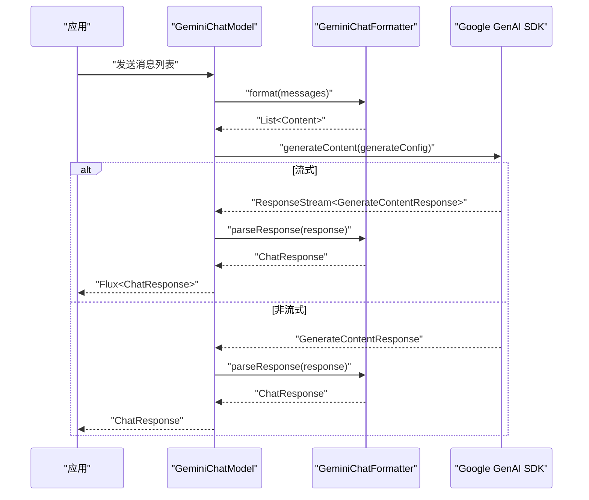
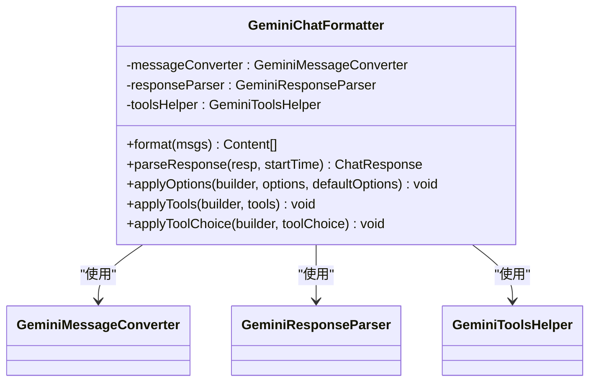
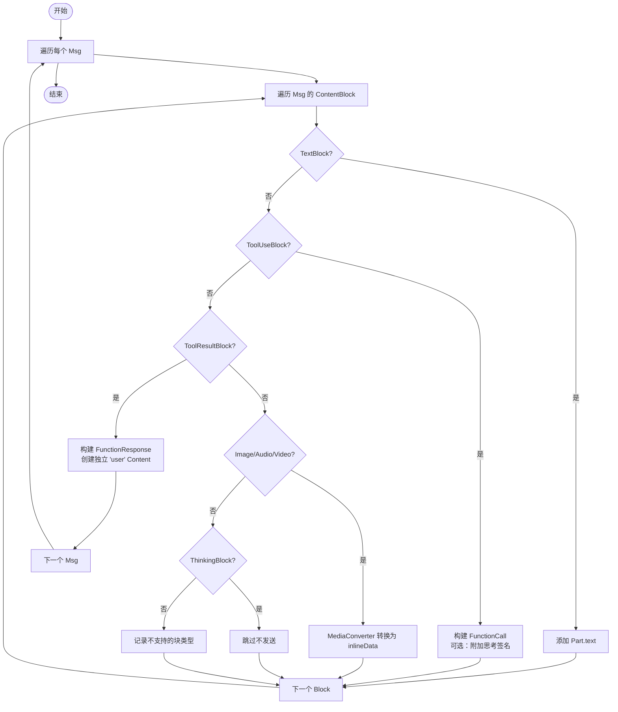
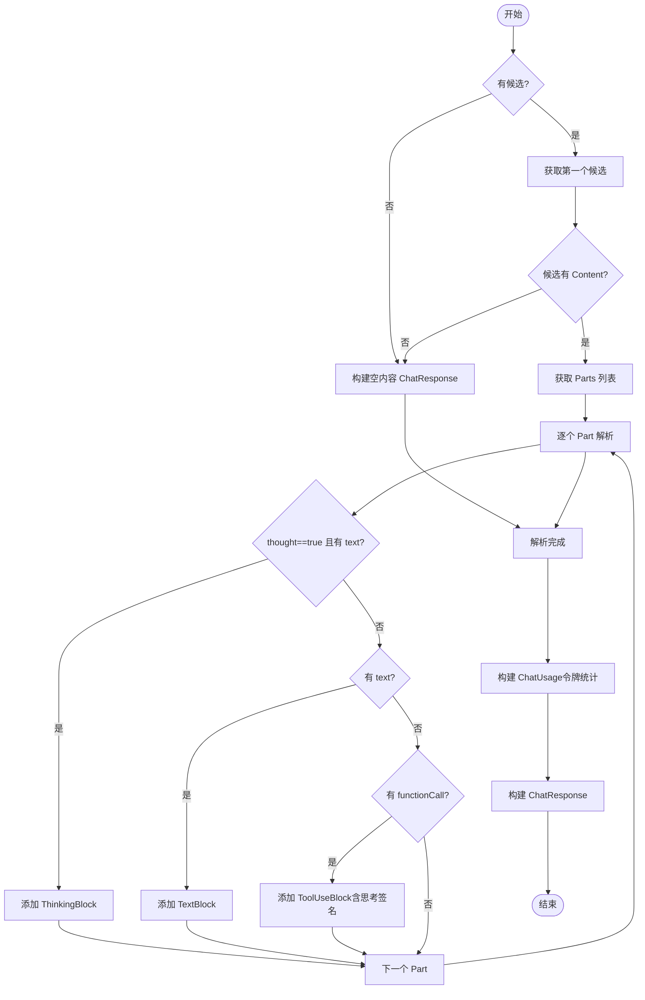
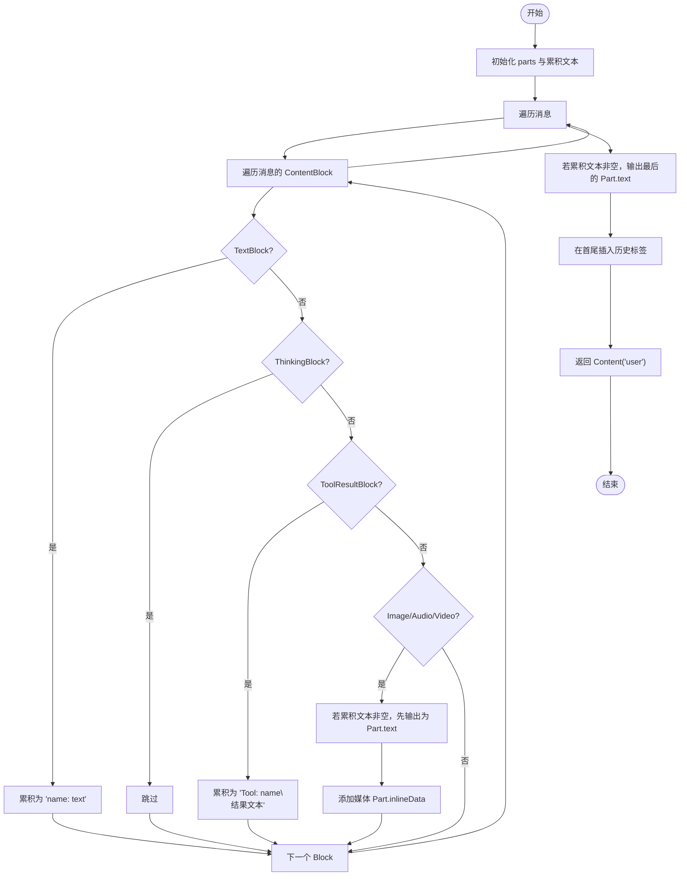
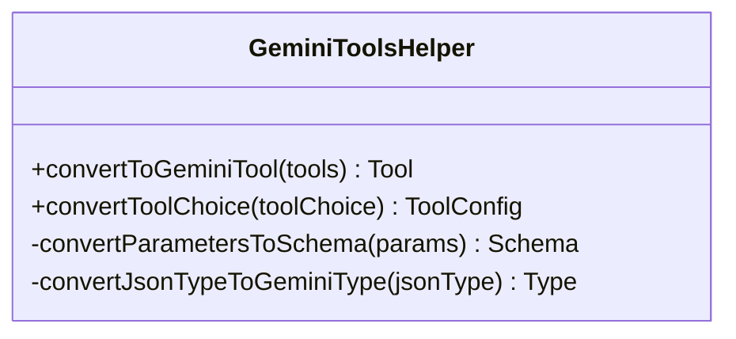
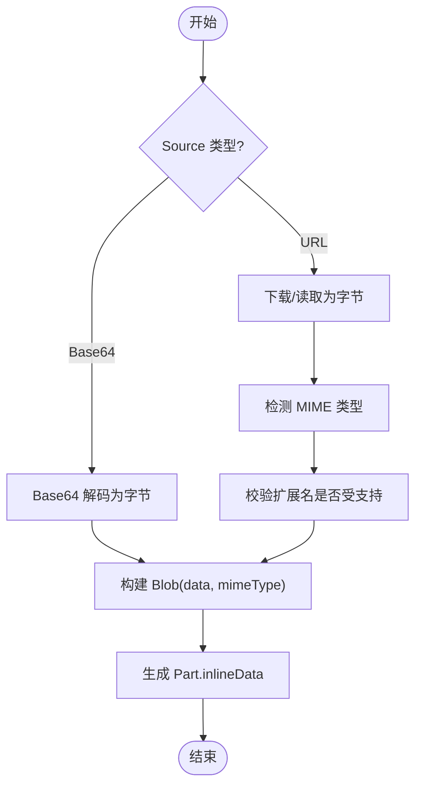
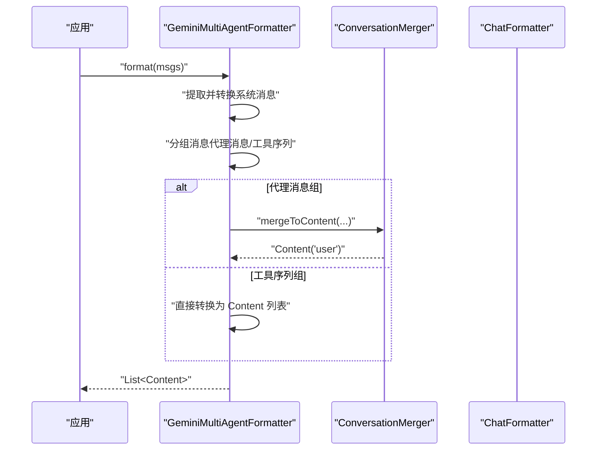
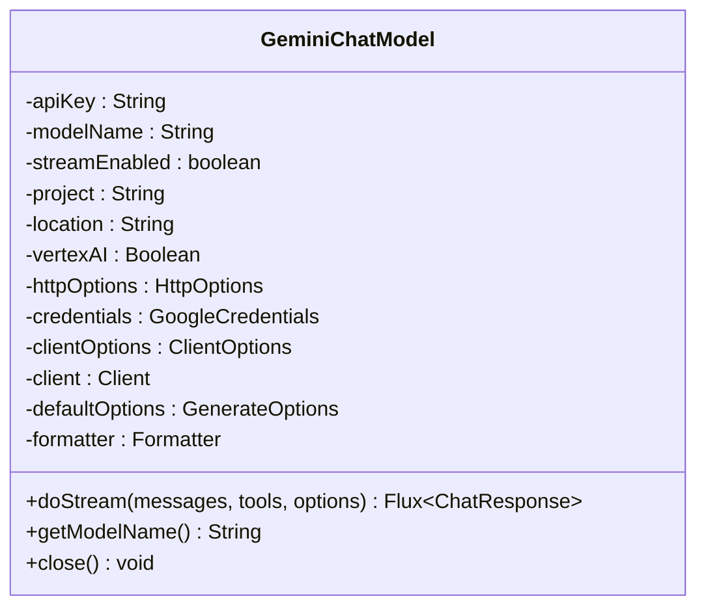
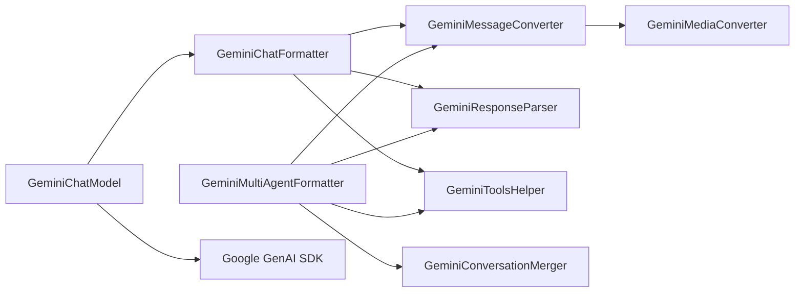

# Gemini 格式化器

<cite>
**本文档引用的文件**
- [GeminiChatFormatter.java](file://agentscope-core/src/main/java/io/agentscope/core/formatter/gemini/GeminiChatFormatter.java)
- [GeminiMessageConverter.java](file://agentscope-core/src/main/java/io/agentscope/core/formatter/gemini/GeminiMessageConverter.java)
- [GeminiResponseParser.java](file://agentscope-core/src/main/java/io/agentscope/core/formatter/gemini/GeminiResponseParser.java)
- [GeminiConversationMerger.java](file://agentscope-core/src/main/java/io/agentscope/core/formatter/gemini/GeminiConversationMerger.java)
- [GeminiToolsHelper.java](file://agentscope-core/src/main/java/io/agentscope/core/formatter/gemini/GeminiToolsHelper.java)
- [GeminiMediaConverter.java](file://agentscope-core/src/main/java/io/agentscope/core/formatter/gemini/GeminiMediaConverter.java)
- [GeminiMultiAgentFormatter.java](file://agentscope-core/src/main/java/io/agentscope/core/formatter/gemini/GeminiMultiAgentFormatter.java)
- [GeminiChatModel.java](file://agentscope-core/src/main/java/io/agentscope/core/model/GeminiChatModel.java)
- [AbstractBaseFormatter.java](file://agentscope-core/src/main/java/io/agentscope/core/formatter/AbstractBaseFormatter.java)
- [GeminiChatFormatterTest.java](file://agentscope-core/src/test/java/io/agentscope/core/formatter/gemini/GeminiChatFormatterTest.java)
</cite>

## 目录
1. [简介](#简介)
2. [项目结构](#项目结构)
3. [核心组件](#核心组件)
4. [架构总览](#架构总览)
5. [详细组件分析](#详细组件分析)
6. [依赖关系分析](#依赖关系分析)
7. [性能考虑](#性能考虑)
8. [故障排查指南](#故障排查指南)
9. [结论](#结论)
10. [附录](#附录)

## 简介
本文件面向需要在 AgentScope 中使用 Google Gemini 内容生成 API 的开发者，系统性地梳理并解释 Gemini 格式化器系列的设计与实现，包括：
- GeminiChatFormatter：将 AgentScope 的消息与生成选项转换为 Gemini SDK 的请求对象，并解析响应。
- GeminiMessageConverter：负责将 AgentScope 的消息内容块转换为 Gemini 的 Content/Part 结构，支持文本、工具调用、工具结果以及多模态内容。
- GeminiResponseParser：将 Gemini 的 GenerateContentResponse 解析为 AgentScope 的 ChatResponse，支持思考内容、工具调用与用量统计。
- GeminiConversationMerger：在多智能体场景下合并历史对话为单个 Content，保留角色与名称信息。
- GeminiToolsHelper：将工具定义与工具选择策略转换为 Gemini 的 Tool/ToolConfig。
- GeminiMediaConverter：将图片、音频、视频等多模态内容转换为 Gemini 的内联数据 Part。
- GeminiMultiAgentFormatter：在多智能体场景中对消息进行分组与合并，以适配 Gemini API 的输入约束。
- GeminiChatModel：基于官方 Google GenAI Java SDK 的模型封装，支持流式与非流式调用、工具调用、多模态与思维模式。

## 项目结构
Gemini 格式化器位于 agentscope-core 模块的 formatter/gemini 包中，配合 model 层的 GeminiChatModel 使用。整体采用“格式化器 + 模型”的分层设计，格式化器负责消息与参数的适配，模型负责与 Gemini API 的交互。

```mermaid
graph TB
subgraph "格式化器层"
FmtChat["GeminiChatFormatter"]
FmtMulti["GeminiMultiAgentFormatter"]
ConvMerge["GeminiConversationMerger"]
MsgConv["GeminiMessageConverter"]
RespParse["GeminiResponseParser"]
ToolsHelp["GeminiToolsHelper"]
MediaConv["GeminiMediaConverter"]
end
subgraph "模型层"
GptModel["GeminiChatModel"]
end
subgraph "SDK"
SDK["Google GenAI Java SDK"]
end
FmtChat --> MsgConv
FmtChat --> RespParse
FmtChat --> ToolsHelp
FmtMulti --> MsgConv
FmtMulti --> RespParse
FmtMulti --> ConvMerge
FmtMulti --> ToolsHelp
MsgConv --> MediaConv
GptModel --> FmtChat
GptModel --> FmtMulti
GptModel --> SDK
```

图表来源
- [GeminiChatFormatter.java:52-209](file://agentscope-core/src/main/java/io/agentscope/core/formatter/gemini/GeminiChatFormatter.java#L52-L209)
- [GeminiMultiAgentFormatter.java:48-227](file://agentscope-core/src/main/java/io/agentscope/core/formatter/gemini/GeminiMultiAgentFormatter.java#L48-L227)
- [GeminiMessageConverter.java:65-338](file://agentscope-core/src/main/java/io/agentscope/core/formatter/gemini/GeminiMessageConverter.java#L65-L338)
- [GeminiResponseParser.java:56-219](file://agentscope-core/src/main/java/io/agentscope/core/formatter/gemini/GeminiResponseParser.java#L56-L219)
- [GeminiConversationMerger.java:49-171](file://agentscope-core/src/main/java/io/agentscope/core/formatter/gemini/GeminiConversationMerger.java#L49-L171)
- [GeminiToolsHelper.java:51-248](file://agentscope-core/src/main/java/io/agentscope/core/formatter/gemini/GeminiToolsHelper.java#L51-L248)
- [GeminiMediaConverter.java:43-200](file://agentscope-core/src/main/java/io/agentscope/core/formatter/gemini/GeminiMediaConverter.java#L43-L200)
- [GeminiChatModel.java:55-514](file://agentscope-core/src/main/java/io/agentscope/core/model/GeminiChatModel.java#L55-L514)

章节来源
- [GeminiChatFormatter.java:35-51](file://agentscope-core/src/main/java/io/agentscope/core/formatter/gemini/GeminiChatFormatter.java#L35-L51)
- [GeminiChatModel.java:37-54](file://agentscope-core/src/main/java/io/agentscope/core/model/GeminiChatModel.java#L37-L54)

## 核心组件
- GeminiChatFormatter：实现与 AbstractBaseFormatter 的适配，负责将 Msg 列表转换为 Content 列表，将 GenerateContentResponse 转换为 ChatResponse，并应用 GenerateOptions 与工具配置。
- GeminiMessageConverter：将消息中的 ContentBlock 转换为 Part；处理工具调用、工具结果、多模态内容；遵循 Gemini API 的角色映射与独立工具结果 Content 的规则。
- GeminiResponseParser：解析候选内容，提取文本、思考内容与工具调用；计算用量统计（输入/输出令牌数）。
- GeminiConversationMerger：在多智能体场景中将多个消息合并为单个 Content，使用特殊标签包裹历史记录。
- GeminiToolsHelper：将工具 Schema 转换为 FunctionDeclaration 列表，将 ToolChoice 映射为 FunctionCallingConfig/ToolConfig。
- GeminiMediaConverter：将 Base64Source 与 URLSource 的媒体内容转换为 Gemini 的 Blob/inlineData Part。
- GeminiMultiAgentFormatter：在多智能体场景中对消息进行分组（代理消息与工具序列），分别处理并合并。
- GeminiChatModel：封装 Google GenAI Java SDK 客户端，支持流式与非流式调用、工具调用、多模态与思维模式。

章节来源
- [GeminiChatFormatter.java:52-209](file://agentscope-core/src/main/java/io/agentscope/core/formatter/gemini/GeminiChatFormatter.java#L52-L209)
- [GeminiMessageConverter.java:65-338](file://agentscope-core/src/main/java/io/agentscope/core/formatter/gemini/GeminiMessageConverter.java#L65-L338)
- [GeminiResponseParser.java:56-219](file://agentscope-core/src/main/java/io/agentscope/core/formatter/gemini/GeminiResponseParser.java#L56-L219)
- [GeminiConversationMerger.java:49-171](file://agentscope-core/src/main/java/io/agentscope/core/formatter/gemini/GeminiConversationMerger.java#L49-L171)
- [GeminiToolsHelper.java:51-248](file://agentscope-core/src/main/java/io/agentscope/core/formatter/gemini/GeminiToolsHelper.java#L51-L248)
- [GeminiMediaConverter.java:43-200](file://agentscope-core/src/main/java/io/agentscope/core/formatter/gemini/GeminiMediaConverter.java#L43-L200)
- [GeminiMultiAgentFormatter.java:48-227](file://agentscope-core/src/main/java/io/agentscope/core/formatter/gemini/GeminiMultiAgentFormatter.java#L48-L227)
- [GeminiChatModel.java:55-514](file://agentscope-core/src/main/java/io/agentscope/core/model/GeminiChatModel.java#L55-L514)

## 架构总览
GeminiChatFormatter 作为核心适配器，组合了消息转换、响应解析与工具配置能力；GeminiMultiAgentFormatter 在多智能体场景下进一步组织消息与工具序列；GeminiChatModel 负责与 Google GenAI SDK 的交互，统一处理流式与非流式响应。



图表来源
- [GeminiChatModel.java:224-311](file://agentscope-core/src/main/java/io/agentscope/core/model/GeminiChatModel.java#L224-L311)
- [GeminiChatFormatter.java:69-77](file://agentscope-core/src/main/java/io/agentscope/core/formatter/gemini/GeminiChatFormatter.java#L69-L77)

## 详细组件分析

### GeminiChatFormatter 分析
- 职责：消息格式化、响应解析、生成选项应用、工具配置应用。
- 关键点：
  - 将温度、topP、topK、种子、最大输出令牌、频率惩罚、存在惩罚等映射到 GenerateContentConfig.Builder。
  - 当设置思维预算时，启用 ThinkingConfig 并包含思考内容。
  - 工具定义通过 ToolsHelper 转换为 Tool 并注入到 config。
  - 工具选择策略通过 ToolsHelper 转换为 ToolConfig 并注入到 config。
- 设计模式：组合多个子组件（消息转换、响应解析、工具帮助器）以完成完整的请求/响应适配。



图表来源
- [GeminiChatFormatter.java:52-209](file://agentscope-core/src/main/java/io/agentscope/core/formatter/gemini/GeminiChatFormatter.java#L52-L209)

章节来源
- [GeminiChatFormatter.java:69-130](file://agentscope-core/src/main/java/io/agentscope/core/formatter/gemini/GeminiChatFormatter.java#L69-L130)
- [GeminiChatFormatter.java:192-208](file://agentscope-core/src/main/java/io/agentscope/core/formatter/gemini/GeminiChatFormatter.java#L192-L208)

### GeminiMessageConverter 分析
- 职责：将 AgentScope 的 Msg 转换为 Gemini 的 Content/Part。
- 关键点：
  - 文本块直接映射为 Part.text。
  - 工具调用块转换为 Part.functionCall，并支持思考签名。
  - 工具结果块转换为独立的“user”角色 Content，其中包含 Part.functionResponse。
  - 多模态内容通过 MediaConverter 转换为 Part.inlineData。
  - 思考块在格式化阶段被跳过（不发送给 LLM）。
  - 工具结果输出的多内容格式化遵循“单条直出，多条带前缀”的策略。
- 错误处理：对不支持的块类型发出警告；对 Base64 保存失败记录错误日志。



图表来源
- [GeminiMessageConverter.java:84-195](file://agentscope-core/src/main/java/io/agentscope/core/formatter/gemini/GeminiMessageConverter.java#L84-L195)

章节来源
- [GeminiMessageConverter.java:78-195](file://agentscope-core/src/main/java/io/agentscope/core/formatter/gemini/GeminiMessageConverter.java#L78-L195)
- [GeminiMessageConverter.java:208-252](file://agentscope-core/src/main/java/io/agentscope/core/formatter/gemini/GeminiMessageConverter.java#L208-L252)

### GeminiResponseParser 分析
- 职责：将 Gemini 的 GenerateContentResponse 转换为 AgentScope 的 ChatResponse。
- 关键点：
  - 优先解析第一个候选的 Content.parts。
  - 先处理带有 thought 标记的 Part 作为 ThinkingBlock，再处理文本与函数调用。
  - 工具调用解析为 ToolUseBlock，参数映射为输入与原始 JSON 字符串。
  - 用量统计：从 usageMetadata 中提取 promptTokenCount、candidatesTokenCount、thoughtsTokenCount，并按 Gemini 行为调整输出令牌（候选总数减去思考令牌）。
- 错误处理：解析异常包装为 FormatterException 抛出。



图表来源
- [GeminiResponseParser.java:72-126](file://agentscope-core/src/main/java/io/agentscope/core/formatter/gemini/GeminiResponseParser.java#L72-L126)
- [GeminiResponseParser.java:135-161](file://agentscope-core/src/main/java/io/agentscope/core/formatter/gemini/GeminiResponseParser.java#L135-L161)

章节来源
- [GeminiResponseParser.java:65-126](file://agentscope-core/src/main/java/io/agentscope/core/formatter/gemini/GeminiResponseParser.java#L65-L126)
- [GeminiResponseParser.java:163-217](file://agentscope-core/src/main/java/io/agentscope/core/formatter/gemini/GeminiResponseParser.java#L163-L217)

### GeminiConversationMerger 分析
- 职责：在多智能体场景中将多个消息合并为单个 Content，保留代理名称与角色信息，并用特殊标签包裹历史记录。
- 关键点：
  - 文本内容以“名称: 文本”形式累积；遇到多模态块则先输出累积文本，再单独添加该媒体 Part。
  - 工具结果转换为“Tool: 名称\n结果文本”格式。
  - 在首个文本 Part 前插入历史提示标签，在最后一个文本 Part 后追加结束标签。
  - 返回“user”角色的 Content。



图表来源
- [GeminiConversationMerger.java:82-169](file://agentscope-core/src/main/java/io/agentscope/core/formatter/gemini/GeminiConversationMerger.java#L82-L169)

章节来源
- [GeminiConversationMerger.java:69-169](file://agentscope-core/src/main/java/io/agentscope/core/formatter/gemini/GeminiConversationMerger.java#L69-L169)

### GeminiToolsHelper 分析
- 职责：将工具 Schema 转换为 FunctionDeclaration 列表，将 ToolChoice 转换为 ToolConfig。
- 关键点：
  - 参数 Schema 支持嵌套对象、数组、枚举、必填字段等 JSON Schema 特性。
  - ToolChoice 映射：
    - Auto：默认行为，不显式设置 ToolConfig。
    - None：禁用工具调用（NONE）。
    - Required：强制工具调用（ANY）。
    - Specific：强制特定工具（ANY + allowedFunctionNames）。
- 错误处理：工具 Schema 转换异常记录日志并跳过该工具。



图表来源
- [GeminiToolsHelper.java:51-248](file://agentscope-core/src/main/java/io/agentscope/core/formatter/gemini/GeminiToolsHelper.java#L51-L248)

章节来源
- [GeminiToolsHelper.java:60-110](file://agentscope-core/src/main/java/io/agentscope/core/formatter/gemini/GeminiToolsHelper.java#L60-L110)
- [GeminiToolsHelper.java:198-246](file://agentscope-core/src/main/java/io/agentscope/core/formatter/gemini/GeminiToolsHelper.java#L198-L246)

### GeminiMediaConverter 分析
- 职责：将媒体块转换为 Gemini 的内联数据 Part。
- 关键点：
  - 支持 Base64Source 与 URLSource 两种来源。
  - 对 URL 远程下载或本地文件读取，自动推断 MIME 类型。
  - 校验扩展名是否在支持列表中（图像、音频、视频）。
  - 将字节数据封装为 Blob 并生成 Part.inlineData。



图表来源
- [GeminiMediaConverter.java:98-126](file://agentscope-core/src/main/java/io/agentscope/core/formatter/gemini/GeminiMediaConverter.java#L98-L126)
- [GeminiMediaConverter.java:137-184](file://agentscope-core/src/main/java/io/agentscope/core/formatter/gemini/GeminiMediaConverter.java#L137-L184)

章节来源
- [GeminiMediaConverter.java:98-126](file://agentscope-core/src/main/java/io/agentscope/core/formatter/gemini/GeminiMediaConverter.java#L98-L126)
- [GeminiMediaConverter.java:158-184](file://agentscope-core/src/main/java/io/agentscope/core/formatter/gemini/GeminiMediaConverter.java#L158-L184)

### GeminiMultiAgentFormatter 分析
- 职责：在多智能体场景中对消息进行分组与合并，适配 Gemini API 的输入约束。
- 关键点：
  - 系统消息转换为“user”角色 Content。
  - 将连续的代理消息合并为单个 Content，使用历史标签包裹。
  - 工具序列（工具调用 + 工具结果）保持原样，分别转换为 Content。
  - 委托 ChatFormatter 应用生成选项与工具配置。



图表来源
- [GeminiMultiAgentFormatter.java:83-130](file://agentscope-core/src/main/java/io/agentscope/core/formatter/gemini/GeminiMultiAgentFormatter.java#L83-L130)
- [GeminiConversationMerger.java:82-169](file://agentscope-core/src/main/java/io/agentscope/core/formatter/gemini/GeminiConversationMerger.java#L82-L169)

章节来源
- [GeminiMultiAgentFormatter.java:83-130](file://agentscope-core/src/main/java/io/agentscope/core/formatter/gemini/GeminiMultiAgentFormatter.java#L83-L130)
- [GeminiMultiAgentFormatter.java:157-204](file://agentscope-core/src/main/java/io/agentscope/core/formatter/gemini/GeminiMultiAgentFormatter.java#L157-L204)

### GeminiChatModel 分析
- 职责：封装 Google GenAI Java SDK，提供统一的模型调用接口。
- 关键点：
  - 支持 Gemini API 与 Vertex AI 双通道，可通过 apiKey、project/location、credentials、vertexAI 等参数切换。
  - 支持自定义 baseUrl、HTTP 选项与客户端选项。
  - 流式与非流式调用：流式返回 Flux，非流式返回单一响应。
  - 统一通过 Formatter 执行消息格式化与响应解析。



图表来源
- [GeminiChatModel.java:55-149](file://agentscope-core/src/main/java/io/agentscope/core/model/GeminiChatModel.java#L55-L149)

章节来源
- [GeminiChatModel.java:100-149](file://agentscope-core/src/main/java/io/agentscope/core/model/GeminiChatModel.java#L100-L149)
- [GeminiChatModel.java:224-311](file://agentscope-core/src/main/java/io/agentscope/core/model/GeminiChatModel.java#L224-L311)

## 依赖关系分析
- 组件耦合：
  - GeminiChatFormatter 组合了消息转换、响应解析与工具帮助器，内聚性高，职责清晰。
  - GeminiMultiAgentFormatter 依赖消息转换器、响应解析器、工具帮助器与对话合并器，形成多智能体专用适配层。
  - GeminiChatModel 依赖 Formatter 接口，解耦具体格式化策略，便于替换与扩展。
- 外部依赖：
  - Google GenAI Java SDK：用于实际的 API 调用与响应流式处理。
  - Jackson/JsonUtils：用于参数与原始内容的序列化/反序列化。
- 潜在循环依赖：未发现循环依赖，各组件通过组合与接口隔离良好。



图表来源
- [GeminiChatModel.java:55-149](file://agentscope-core/src/main/java/io/agentscope/core/model/GeminiChatModel.java#L55-L149)
- [GeminiChatFormatter.java:52-209](file://agentscope-core/src/main/java/io/agentscope/core/formatter/gemini/GeminiChatFormatter.java#L52-L209)
- [GeminiMultiAgentFormatter.java:48-227](file://agentscope-core/src/main/java/io/agentscope/core/formatter/gemini/GeminiMultiAgentFormatter.java#L48-L227)

章节来源
- [GeminiChatFormatter.java:52-209](file://agentscope-core/src/main/java/io/agentscope/core/formatter/gemini/GeminiChatFormatter.java#L52-L209)
- [GeminiMultiAgentFormatter.java:48-227](file://agentscope-core/src/main/java/io/agentscope/core/formatter/gemini/GeminiMultiAgentFormatter.java#L48-L227)
- [GeminiChatModel.java:55-149](file://agentscope-core/src/main/java/io/agentscope/core/model/GeminiChatModel.java#L55-L149)

## 性能考虑
- 多模态处理：
  - Base64 数据直接解码后写入临时文件，注意磁盘 IO 与文件清理策略（当前实现不自动删除临时文件）。
  - URL 下载远程资源可能带来网络延迟，建议缓存与重试策略。
- 响应解析：
  - 仅解析第一个候选，避免不必要的遍历开销。
  - 令牌统计来自 SDK 提供的元数据，无需额外计算。
- 流式调用：
  - 流式响应通过 Reactor 调度器处理，避免阻塞主线程。
- 工具 Schema：
  - 参数 Schema 的递归转换在工具注册阶段完成，运行时解析成本低。

## 故障排查指南
- 认证失败（401）：
  - 检查 API Key 是否正确设置；确认是否使用了 Vertex AI 通道但缺少凭据。
  - 参考异常类型：AuthenticationException。
- 媒体转换失败：
  - Base64 保存临时文件失败会记录错误日志；检查 MIME 类型与扩展名匹配。
  - URL 不可达或文件不存在会导致读取异常。
- 工具调用失败：
  - 工具 Schema 转换异常会被记录并跳过该工具；检查 JSON Schema 的 type/properties/required/items/enum 字段。
  - 工具选择策略映射不当可能导致工具未被调用；确认 ToolChoice 类型与 allowedFunctionNames 设置。
- 响应解析异常：
  - FunctionCall 参数解析失败会记录告警；检查参数 JSON 的合法性。
- 单元测试参考：
  - 可参考测试用例验证格式化、选项应用、工具配置与响应解析的基本行为。

章节来源
- [GeminiChatFormatterTest.java:45-168](file://agentscope-core/src/test/java/io/agentscope/core/formatter/gemini/GeminiChatFormatterTest.java#L45-L168)
- [GeminiChatModel.java:303-308](file://agentscope-core/src/main/java/io/agentscope/core/model/GeminiChatModel.java#L303-L308)

## 结论
Gemini 格式化器系列通过模块化的组件设计，完整覆盖了从消息格式化、工具调用、多模态处理到响应解析与多智能体场景合并的全链路需求。结合 GeminiChatModel 对 Google GenAI SDK 的封装，开发者可以便捷地在 AgentScope 中接入 Gemini API，并根据业务场景灵活配置生成参数、工具策略与认证方式。

## 附录

### Google AI Studio 与认证机制
- Gemini API 与 Vertex AI 双通道：
  - Gemini API：通过 apiKey 直接访问。
  - Vertex AI：通过 project/location/credentials/vertexAI 参数启用，支持自定义 HTTP 与客户端选项。
- 认证方式：
  - API Key：适用于 Gemini API。
  - Google Credentials：适用于 Vertex AI。
- 最佳实践：
  - 在生产环境使用环境变量或安全配置中心管理密钥与凭据。
  - 对于 Vertex AI，确保项目与区域配置正确，避免权限不足导致的调用失败。

章节来源
- [GeminiChatModel.java:118-148](file://agentscope-core/src/main/java/io/agentscope/core/model/GeminiChatModel.java#L118-L148)

### Gemini Pro 模型配置与使用建议
- 模型选择：
  - 常用模型：gemini-2.0-flash、gemini-1.5-pro 等。
  - 默认模型：gemini-2.5-flash（Builder 默认值）。
- 生成参数：
  - 温度、topP、topK、最大输出令牌、频率/存在惩罚等均可通过 GenerateOptions 配置。
  - 思维模式：通过思维预算启用 ThinkingConfig，适合需要推理过程的场景。
- 工具调用：
  - 使用 ToolSchema 定义工具参数 Schema，支持嵌套对象与数组。
  - ToolChoice 支持 Auto/None/Required/Specific 四种策略。
- 多模态：
  - 支持图像、音频、视频的 Base64 与 URL 两种来源。
  - 注意媒体格式与扩展名的兼容性。
- 多智能体：
  - 使用 GeminiMultiAgentFormatter 合并历史对话，保留角色与名称信息。
  - 工具序列保持原样，避免历史合并影响工具调用链。

章节来源
- [GeminiChatModel.java:336-512](file://agentscope-core/src/main/java/io/agentscope/core/model/GeminiChatModel.java#L336-L512)
- [GeminiChatFormatter.java:80-130](file://agentscope-core/src/main/java/io/agentscope/core/formatter/gemini/GeminiChatFormatter.java#L80-L130)
- [GeminiToolsHelper.java:198-246](file://agentscope-core/src/main/java/io/agentscope/core/formatter/gemini/GeminiToolsHelper.java#L198-L246)
- [GeminiMultiAgentFormatter.java:83-130](file://agentscope-core/src/main/java/io/agentscope/core/formatter/gemini/GeminiMultiAgentFormatter.java#L83-L130)