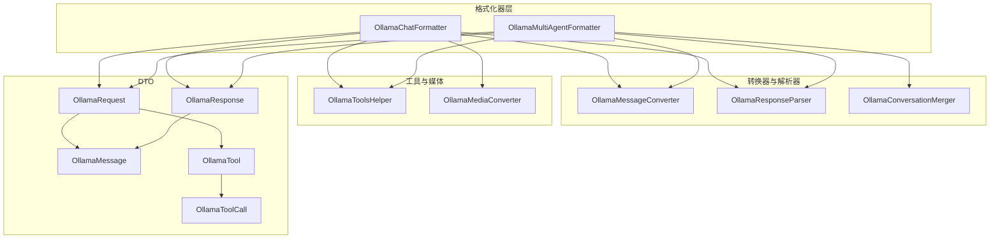
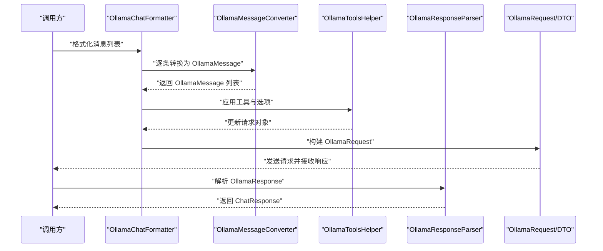
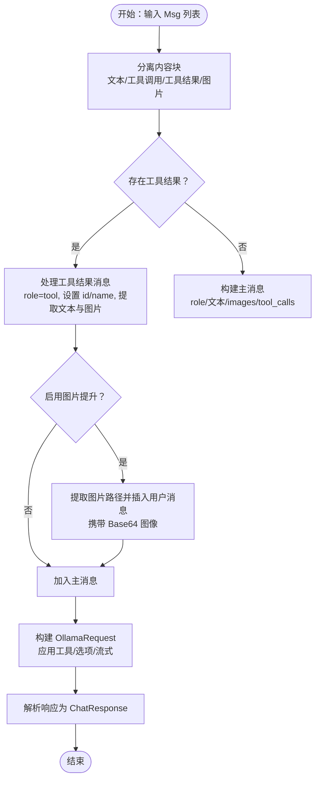
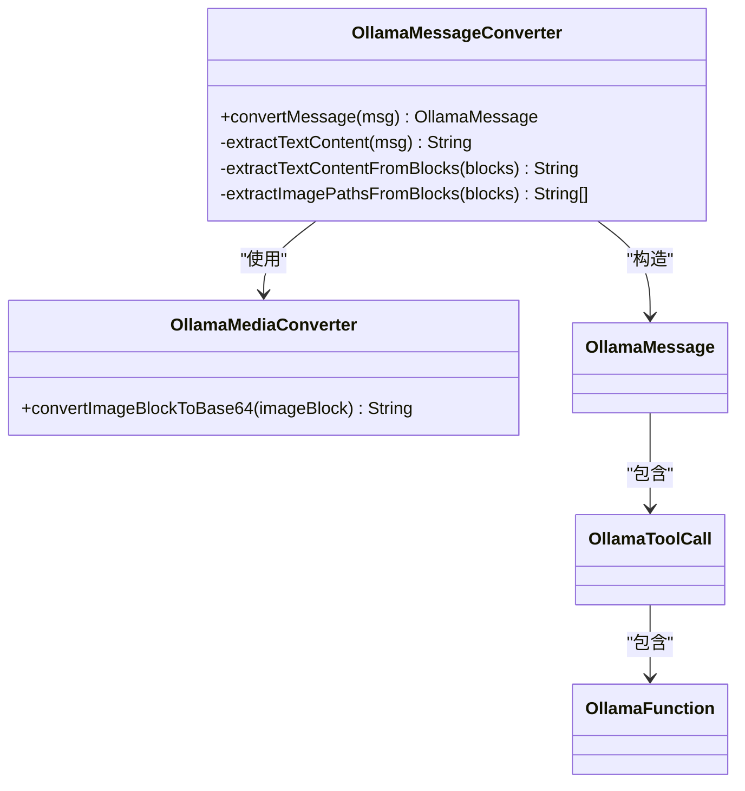
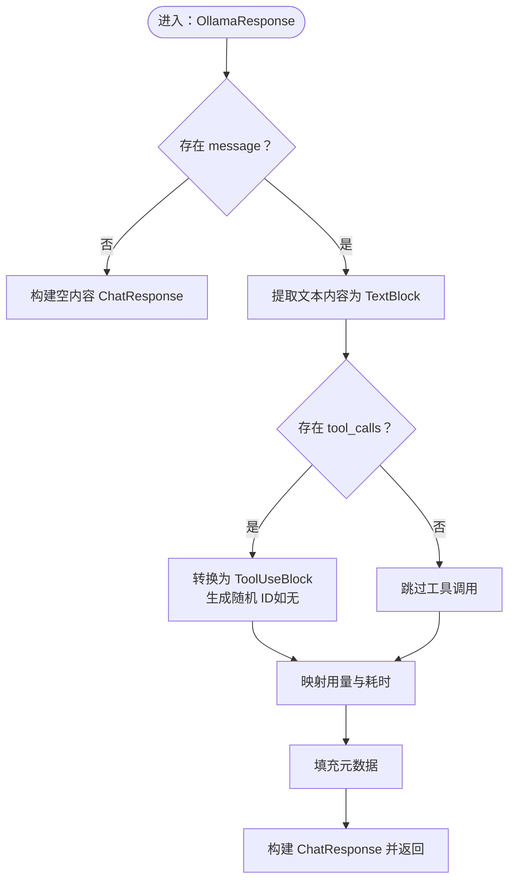
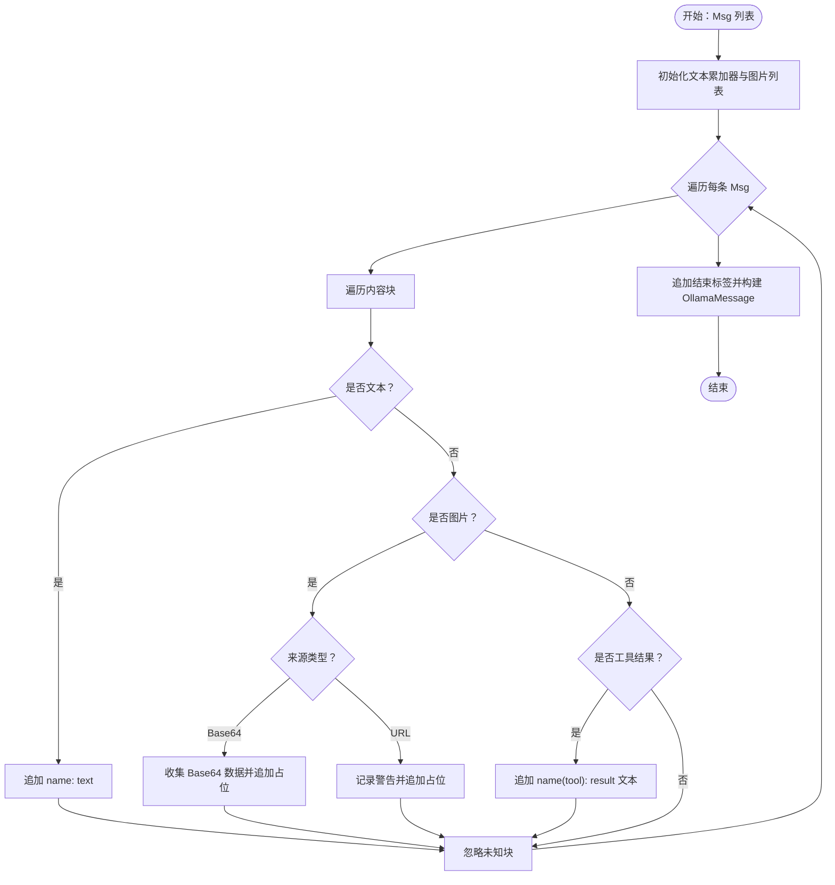
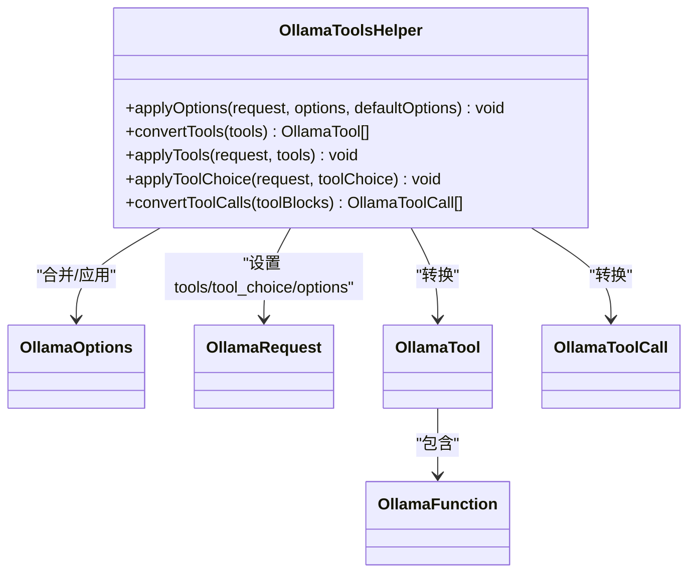
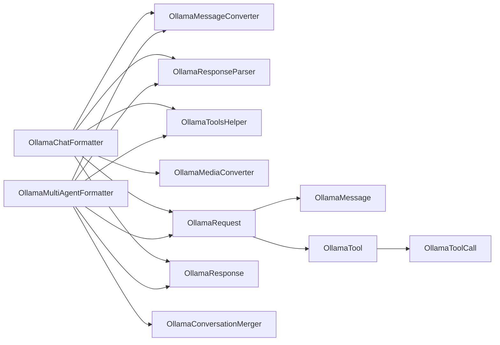

# Ollama 格式化器

<cite>
**本文引用的文件**
- [OllamaChatFormatter.java](file://agentscope-core/src/main/java/io/agentscope/core/formatter/ollama/OllamaChatFormatter.java)
- [OllamaMessageConverter.java](file://agentscope-core/src/main/java/io/agentscope/core/formatter/ollama/OllamaMessageConverter.java)
- [OllamaResponseParser.java](file://agentscope-core/src/main/java/io/agentscope/core/formatter/ollama/OllamaResponseParser.java)
- [OllamaConversationMerger.java](file://agentscope-core/src/main/java/io/agentscope/core/formatter/ollama/OllamaConversationMerger.java)
- [OllamaToolsHelper.java](file://agentscope-core/src/main/java/io/agentscope/core/formatter/ollama/OllamaToolsHelper.java)
- [OllamaMediaConverter.java](file://agentscope-core/src/main/java/io/agentscope/core/formatter/ollama/OllamaMediaConverter.java)
- [OllamaMultiAgentFormatter.java](file://agentscope-core/src/main/java/io/agentscope/core/formatter/ollama/OllamaMultiAgentFormatter.java)
- [OllamaRequest.java](file://agentscope-core/src/main/java/io/agentscope/core/formatter/ollama/dto/OllamaRequest.java)
- [OllamaResponse.java](file://agentscope-core/src/main/java/io/agentscope/core/formatter/ollama/dto/OllamaResponse.java)
- [OllamaMessage.java](file://agentscope-core/src/main/java/io/agentscope/core/formatter/ollama/dto/OllamaMessage.java)
- [OllamaTool.java](file://agentscope-core/src/main/java/io/agentscope/core/formatter/ollama/dto/OllamaTool.java)
- [OllamaToolCall.java](file://agentscope-core/src/main/java/io/agentscope/core/formatter/ollama/dto/OllamaToolCall.java)
- [OllamaChatFormatterTest.java](file://agentscope-core/src/test/java/io/agentscope/core/formatter/ollama/OllamaChatFormatterTest.java)
</cite>

## 目录
1. [简介](#简介)
2. [项目结构](#项目结构)
3. [核心组件](#核心组件)
4. [架构总览](#架构总览)
5. [详细组件分析](#详细组件分析)
6. [依赖关系分析](#依赖关系分析)
7. [性能考量](#性能考量)
8. [故障排查指南](#故障排查指南)
9. [结论](#结论)
10. [附录：本地部署与配置指南](#附录本地部署与配置指南)

## 简介
本文件系统性梳理 AgentScope 中 Ollama 格式化器系列的实现与集成方案，覆盖以下能力：
- 将 AgentScope 的消息模型（文本、图像、工具调用/结果）转换为 Ollama API 所需的消息结构，并支持工具函数定义与选择策略。
- 解析 Ollama 响应为统一的 ChatResponse，包含内容块、用量统计与元数据。
- 支持多智能体场景下的对话历史合并与图片提升（将工具返回的图片转为用户消息以增强上下文）。
- 提供媒体转换器，确保图像按 Ollama 要求进行 Base64 编码。
- 面向本地模型适配与流式处理的扩展点说明。

## 项目结构
Ollama 格式化器位于 agentscope-core 模块的 formatter/ollama 包下，采用“格式化器 + DTO + 工具类”的分层设计：
- 格式化器：负责消息格式化、请求构建、响应解析与工具选项应用。
- DTO 层：封装 Ollama 请求/响应与消息结构。
- 工具类：处理工具定义转换、选项合并、媒体转换等通用逻辑。
- 多代理格式化器：在多智能体场景中对历史进行折叠并保留工具序列。

图表来源
- [OllamaChatFormatter.java:51-474](file://agentscope-core/src/main/java/io/agentscope/core/formatter/ollama/OllamaChatFormatter.java#L51-L474)
- [OllamaMultiAgentFormatter.java:50-509](file://agentscope-core/src/main/java/io/agentscope/core/formatter/ollama/OllamaMultiAgentFormatter.java#L50-L509)
- [OllamaMessageConverter.java:41-226](file://agentscope-core/src/main/java/io/agentscope/core/formatter/ollama/OllamaMessageConverter.java#L41-L226)
- [OllamaResponseParser.java:38-128](file://agentscope-core/src/main/java/io/agentscope/core/formatter/ollama/OllamaResponseParser.java#L38-L128)
- [OllamaConversationMerger.java:35-114](file://agentscope-core/src/main/java/io/agentscope/core/formatter/ollama/OllamaConversationMerger.java#L35-L114)
- [OllamaToolsHelper.java:41-201](file://agentscope-core/src/main/java/io/agentscope/core/formatter/ollama/OllamaToolsHelper.java#L41-L201)
- [OllamaMediaConverter.java:31-74](file://agentscope-core/src/main/java/io/agentscope/core/formatter/ollama/OllamaMediaConverter.java#L31-L74)
- [OllamaRequest.java:29-204](file://agentscope-core/src/main/java/io/agentscope/core/formatter/ollama/dto/OllamaRequest.java#L29-L204)
- [OllamaResponse.java:29-177](file://agentscope-core/src/main/java/io/agentscope/core/formatter/ollama/dto/OllamaResponse.java#L29-L177)
- [OllamaMessage.java:28-109](file://agentscope-core/src/main/java/io/agentscope/core/formatter/ollama/dto/OllamaMessage.java#L28-L109)
- [OllamaTool.java:27-59](file://agentscope-core/src/main/java/io/agentscope/core/formatter/ollama/dto/OllamaTool.java#L27-L59)
- [OllamaToolCall.java:27-47](file://agentscope-core/src/main/java/io/agentscope/core/formatter/ollama/dto/OllamaToolCall.java#L27-L47)

章节来源
- [OllamaChatFormatter.java:51-474](file://agentscope-core/src/main/java/io/agentscope/core/formatter/ollama/OllamaChatFormatter.java#L51-L474)
- [OllamaMultiAgentFormatter.java:50-509](file://agentscope-core/src/main/java/io/agentscope/core/formatter/ollama/OllamaMultiAgentFormatter.java#L50-L509)

## 核心组件
- OllamaChatFormatter：面向单智能体的聊天格式化器，负责将 AgentScope 的 Msg 列表转换为 OllamaMessage 列表，支持工具调用、工具结果、图片与可选的“图片提升”策略；同时负责构建 OllamaRequest 并解析 OllamaResponse。
- OllamaMessageConverter：将单条 Msg 转换为 OllamaMessage，处理角色映射、文本拼接、工具调用与图片编码。
- OllamaResponseParser：将 OllamaResponse 转换为统一 ChatResponse，包括内容块、用量统计与元数据。
- OllamaConversationMerger：多智能体场景下将多轮对话历史折叠为一条用户消息，支持图片与工具结果的文本化呈现。
- OllamaToolsHelper：工具定义转换、工具选择策略应用、生成选项合并（含 format、keep_alive、think 等顶层字段）。
- OllamaMediaConverter：将 ImageBlock 转换为 Ollama 所需的 Base64 字符串，支持本地文件与远程 URL。
- OllamaMultiAgentFormatter：在多智能体场景中，按“智能体消息组 + 工具序列组”顺序格式化，并在需要时插入“图片提升”用户消息。

章节来源
- [OllamaChatFormatter.java:51-474](file://agentscope-core/src/main/java/io/agentscope/core/formatter/ollama/OllamaChatFormatter.java#L51-L474)
- [OllamaMessageConverter.java:41-226](file://agentscope-core/src/main/java/io/agentscope/core/formatter/ollama/OllamaMessageConverter.java#L41-L226)
- [OllamaResponseParser.java:38-128](file://agentscope-core/src/main/java/io/agentscope/core/formatter/ollama/OllamaResponseParser.java#L38-L128)
- [OllamaConversationMerger.java:35-114](file://agentscope-core/src/main/java/io/agentscope/core/formatter/ollama/OllamaConversationMerger.java#L35-L114)
- [OllamaToolsHelper.java:41-201](file://agentscope-core/src/main/java/io/agentscope/core/formatter/ollama/OllamaToolsHelper.java#L41-L201)
- [OllamaMediaConverter.java:31-74](file://agentscope-core/src/main/java/io/agentscope/core/formatter/ollama/OllamaMediaConverter.java#L31-L74)
- [OllamaMultiAgentFormatter.java:50-509](file://agentscope-core/src/main/java/io/agentscope/core/formatter/ollama/OllamaMultiAgentFormatter.java#L50-L509)

## 架构总览
下图展示从消息输入到请求构建与响应解析的关键流程，以及工具与媒体转换的协作关系。

图表来源
- [OllamaChatFormatter.java:71-462](file://agentscope-core/src/main/java/io/agentscope/core/formatter/ollama/OllamaChatFormatter.java#L71-L462)
- [OllamaMessageConverter.java:52-152](file://agentscope-core/src/main/java/io/agentscope/core/formatter/ollama/OllamaMessageConverter.java#L52-L152)
- [OllamaToolsHelper.java:56-106](file://agentscope-core/src/main/java/io/agentscope/core/formatter/ollama/OllamaToolsHelper.java#L56-L106)
- [OllamaResponseParser.java:46-126](file://agentscope-core/src/main/java/io/agentscope/core/formatter/ollama/OllamaResponseParser.java#L46-L126)
- [OllamaRequest.java:29-204](file://agentscope-core/src/main/java/io/agentscope/core/formatter/ollama/dto/OllamaRequest.java#L29-L204)
- [OllamaResponse.java:29-177](file://agentscope-core/src/main/java/io/agentscope/core/formatter/ollama/dto/OllamaResponse.java#L29-L177)

## 详细组件分析

### OllamaChatFormatter：单智能体本地模型适配
- 消息格式化策略
  - 分离内容块类型（文本、工具调用、工具结果、图片），优先处理工具结果消息，再构造主消息。
  - 对工具调用：从 ToolUseBlock 构造 OllamaToolCall；对工具结果：设置 role=tool、填充 tool_call_id 与 name，并提取文本输出与图片。
  - 图片处理：通过 OllamaMediaConverter 将 ImageBlock 转为 Base64 字符串并写入 images。
  - 可选“图片提升”：当启用 promoteToolResultImages 且工具结果包含图片路径提示时，额外插入一条用户消息，携带 Base64 图像以增强上下文。
- 请求构建
  - 使用 OllamaRequest.Builder 设置 model、messages、stream，并通过 OllamaToolsHelper 应用工具与选项。
  - 支持 ToolChoice 的多种策略（auto、none、specific），其中 Required 降级为 auto 并记录调试日志。
- 响应解析
  - 由 OllamaResponseParser 统一解析为 ChatResponse，包含内容块、用量与元数据。

图表来源
- [OllamaChatFormatter.java:71-462](file://agentscope-core/src/main/java/io/agentscope/core/formatter/ollama/OllamaChatFormatter.java#L71-L462)
- [OllamaMessageConverter.java:52-152](file://agentscope-core/src/main/java/io/agentscope/core/formatter/ollama/OllamaMessageConverter.java#L52-L152)
- [OllamaToolsHelper.java:142-177](file://agentscope-core/src/main/java/io/agentscope/core/formatter/ollama/OllamaToolsHelper.java#L142-L177)
- [OllamaResponseParser.java:46-126](file://agentscope-core/src/main/java/io/agentscope/core/formatter/ollama/OllamaResponseParser.java#L46-L126)

章节来源
- [OllamaChatFormatter.java:71-462](file://agentscope-core/src/main/java/io/agentscope/core/formatter/ollama/OllamaChatFormatter.java#L71-L462)

### OllamaMessageConverter：消息格式化策略与流式支持
- 角色映射：将 MsgRole 映射为小写的 role（system/user/assistant/tool）。
- 工具调用：将 ToolUseBlock 转为 OllamaToolCall；工具结果：提取文本与图片路径提示，用于后续图片提升。
- 图片处理：通过 OllamaMediaConverter 将 ImageBlock 转为 Base64；对 URLSource 进行校验与下载或本地读取。
- 流式处理：该转换器专注于单条消息的结构化转换，不直接处理流式分片；流式由上层调用方与 Ollama 客户端共同完成。

图表来源
- [OllamaMessageConverter.java:41-226](file://agentscope-core/src/main/java/io/agentscope/core/formatter/ollama/OllamaMessageConverter.java#L41-L226)
- [OllamaMediaConverter.java:31-74](file://agentscope-core/src/main/java/io/agentscope/core/formatter/ollama/OllamaMediaConverter.java#L31-L74)
- [OllamaMessage.java:28-109](file://agentscope-core/src/main/java/io/agentscope/core/formatter/ollama/dto/OllamaMessage.java#L28-L109)
- [OllamaToolCall.java:27-47](file://agentscope-core/src/main/java/io/agentscope/core/formatter/ollama/dto/OllamaToolCall.java#L27-L47)

章节来源
- [OllamaMessageConverter.java:52-152](file://agentscope-core/src/main/java/io/agentscope/core/formatter/ollama/OllamaMessageConverter.java#L52-L152)

### OllamaResponseParser：响应解析机制与本地推理集成
- 文本内容：将 OllamaMessage 的 content 转为 TextBlock。
- 工具调用：将 OllamaToolCall 转为 ToolUseBlock，若未提供 ID，则生成随机 UUID 以满足 AgentScope 要求。
- 用量与时间：从 OllamaResponse 中提取 prompt_eval_count、eval_count、total_duration 等，其中 total_duration 从纳秒转换为秒。
- 元数据：将 model、created_at、duration、计数等字段写入 ChatResponse.metadata。
- 结束原因：优先使用 done_reason，若缺失但 done=true 则回退为 stop。

图表来源
- [OllamaResponseParser.java:46-126](file://agentscope-core/src/main/java/io/agentscope/core/formatter/ollama/OllamaResponseParser.java#L46-L126)
- [OllamaResponse.java:29-177](file://agentscope-core/src/main/java/io/agentscope/core/formatter/ollama/dto/OllamaResponse.java#L29-L177)
- [OllamaMessage.java:28-109](file://agentscope-core/src/main/java/io/agentscope/core/formatter/ollama/dto/OllamaMessage.java#L28-L109)

章节来源
- [OllamaResponseParser.java:46-126](file://agentscope-core/src/main/java/io/agentscope/core/formatter/ollama/OllamaResponseParser.java#L46-L126)

### OllamaConversationMerger：对话历史管理
- 将多轮 Msg 合并为一条用户消息，使用固定标签包裹历史内容，便于模型识别上下文边界。
- 对图片：仅接受 Base64Source 的图片，将其 Base64 数据收集并注入 images；对 URLSource 的图片给出警告并标注处理失败。
- 对工具结果：简化为纯文本形式，便于模型理解历史中的工具执行结果。

图表来源
- [OllamaConversationMerger.java:46-112](file://agentscope-core/src/main/java/io/agentscope/core/formatter/ollama/OllamaConversationMerger.java#L46-L112)

章节来源
- [OllamaConversationMerger.java:46-112](file://agentscope-core/src/main/java/io/agentscope/core/formatter/ollama/OllamaConversationMerger.java#L46-L112)

### OllamaToolsHelper：工具调用支持与本地执行
- 工具定义转换：将 ToolSchema 转为 OllamaTool（function 类型），参数直接映射为 JSON Schema。
- 工具选择策略：
  - auto：允许模型自主决定是否调用工具。
  - none：禁止模型调用工具。
  - required：Ollama 不支持通用 required，降级为 auto 并记录调试日志。
  - specific：指定具体工具名，构造 function 对象。
- 生成选项合并：将 OllamaOptions 合并为 Map，并将 format、keep_alive、think 等顶层字段从 options 中移除后写入请求对象，其余放入 options 字段。

图表来源
- [OllamaToolsHelper.java:41-201](file://agentscope-core/src/main/java/io/agentscope/core/formatter/ollama/OllamaToolsHelper.java#L41-L201)
- [OllamaRequest.java:29-204](file://agentscope-core/src/main/java/io/agentscope/core/formatter/ollama/dto/OllamaRequest.java#L29-L204)
- [OllamaTool.java:27-59](file://agentscope-core/src/main/java/io/agentscope/core/formatter/ollama/dto/OllamaTool.java#L27-L59)
- [OllamaToolCall.java:27-47](file://agentscope-core/src/main/java/io/agentscope/core/formatter/ollama/dto/OllamaToolCall.java#L27-L47)

章节来源
- [OllamaToolsHelper.java:56-177](file://agentscope-core/src/main/java/io/agentscope/core/formatter/ollama/OllamaToolsHelper.java#L56-L177)

### OllamaMediaConverter：媒体转换与本地模型适配
- 支持三种来源：
  - Base64Source：直接返回原始 Base64 数据。
  - URLSource（本地文件）：去除 file:// 前缀后读取文件并转 Base64。
  - URLSource（远程 URL）：下载内容并转 Base64。
- 图像扩展名校验：通过 MediaUtils.validateImageExtension 确保 URL 后缀合法。

章节来源
- [OllamaMediaConverter.java:50-72](file://agentscope-core/src/main/java/io/agentscope/core/formatter/ollama/OllamaMediaConverter.java#L50-L72)

### OllamaMultiAgentFormatter：多智能体场景与图片提升
- 消息分组：将连续的智能体消息与工具序列分别归组，避免历史被过度包装。
- 历史折叠：使用 OllamaConversationMerger 将一组智能体消息折叠为一条用户消息，保留标签与图片。
- 工具序列：逐条转换工具消息，必要时插入“图片提升”用户消息以增强模型对工具返回图片的理解。
- 选项与工具：复用 OllamaToolsHelper 与 OllamaMessageConverter，保持一致性。

章节来源
- [OllamaMultiAgentFormatter.java:96-315](file://agentscope-core/src/main/java/io/agentscope/core/formatter/ollama/OllamaMultiAgentFormatter.java#L96-L315)

## 依赖关系分析
- 组件耦合
  - OllamaChatFormatter 依赖 OllamaMessageConverter、OllamaResponseParser、OllamaToolsHelper、OllamaMediaConverter。
  - OllamaMultiAgentFormatter 在前者基础上增加 OllamaConversationMerger。
  - DTO 层（OllamaRequest/OllamaResponse/OllamaMessage/OllamaTool/OllamaToolCall）作为契约被格式化器与解析器直接使用。
- 外部依赖
  - JSON 序列化：通过 JsonUtils 进行 OllamaOptions 与 Map 的互转。
  - 媒体工具：MediaUtils 提供文件读取与 URL 下载能力。
- 循环依赖
  - 未发现循环依赖；各组件职责清晰，遵循单向依赖。

图表来源
- [OllamaChatFormatter.java:51-474](file://agentscope-core/src/main/java/io/agentscope/core/formatter/ollama/OllamaChatFormatter.java#L51-L474)
- [OllamaMultiAgentFormatter.java:50-509](file://agentscope-core/src/main/java/io/agentscope/core/formatter/ollama/OllamaMultiAgentFormatter.java#L50-L509)
- [OllamaRequest.java:29-204](file://agentscope-core/src/main/java/io/agentscope/core/formatter/ollama/dto/OllamaRequest.java#L29-L204)
- [OllamaResponse.java:29-177](file://agentscope-core/src/main/java/io/agentscope/core/formatter/ollama/dto/OllamaResponse.java#L29-L177)
- [OllamaMessage.java:28-109](file://agentscope-core/src/main/java/io/agentscope/core/formatter/ollama/dto/OllamaMessage.java#L28-L109)
- [OllamaTool.java:27-59](file://agentscope-core/src/main/java/io/agentscope/core/formatter/ollama/dto/OllamaTool.java#L27-L59)
- [OllamaToolCall.java:27-47](file://agentscope-core/src/main/java/io/agentscope/core/formatter/ollama/dto/OllamaToolCall.java#L27-L47)

章节来源
- [OllamaChatFormatter.java:51-474](file://agentscope-core/src/main/java/io/agentscope/core/formatter/ollama/OllamaChatFormatter.java#L51-L474)
- [OllamaMultiAgentFormatter.java:50-509](file://agentscope-core/src/main/java/io/agentscope/core/formatter/ollama/OllamaMultiAgentFormatter.java#L50-L509)

## 性能考量
- 图像处理
  - Base64 编码与网络下载可能带来延迟；建议在工具结果中仅传递必要图片，并控制分辨率与大小。
  - 对于大量图片，优先使用 Base64Source 以减少网络开销。
- 工具调用
  - 工具 Schema 参数应尽量精简，避免过深嵌套导致序列化与传输成本上升。
- 选项合并
  - 合并 OllamaOptions 时会进行 JSON 转换，建议在高频调用场景中缓存已合并的 Map，减少重复计算。
- 多智能体历史
  - 历史折叠可显著降低 token 消耗；但需平衡上下文完整性与性能。

## 故障排查指南
- 图片无法显示或报错
  - 检查 ImageBlock 的 Source 类型是否为 Base64Source 或合法 URLSource；URL 必须有合法图片扩展名。
  - 若为 URL，确认网络可达与下载成功；本地文件需去除 file:// 前缀。
- 工具调用未生效
  - 确认已正确传入 ToolSchema 列表并调用 applyTools；检查 ToolChoice 是否为 none。
  - 若使用 Required，Ollama 不支持通用 required，将降级为 auto。
- 响应解析异常
  - 确认 OllamaResponse 的 message 字段非空；若为空，解析器将返回空内容 ChatResponse。
  - 检查 total_duration 单位为纳秒，解析器已自动转换为秒。
- 多智能体历史显示异常
  - URL 图片不会被折叠进历史，请确保使用 Base64Source；否则将标注处理失败。

章节来源
- [OllamaMediaConverter.java:50-72](file://agentscope-core/src/main/java/io/agentscope/core/formatter/ollama/OllamaMediaConverter.java#L50-L72)
- [OllamaToolsHelper.java:155-177](file://agentscope-core/src/main/java/io/agentscope/core/formatter/ollama/OllamaToolsHelper.java#L155-L177)
- [OllamaResponseParser.java:46-126](file://agentscope-core/src/main/java/io/agentscope/core/formatter/ollama/OllamaResponseParser.java#L46-L126)
- [OllamaConversationMerger.java:72-81](file://agentscope-core/src/main/java/io/agentscope/core/formatter/ollama/OllamaConversationMerger.java#L72-L81)

## 结论
Ollama 格式化器系列通过清晰的分层设计与职责划分，实现了从 AgentScope 消息到 Ollama API 的完整转换链路。其特性包括：
- 稳健的消息格式化与工具调用支持；
- 可选的图片提升策略，增强模型对工具返回图片的理解；
- 多智能体场景下的历史折叠与工具序列处理；
- 丰富的生成选项与工具选择策略整合；
- 本地模型适配与流式处理的良好扩展点。

## 附录：本地部署与配置指南
- 本地模型加载
  - 使用 Ollama 的本地服务，确保模型已拉取并可加载；通过 keep_alive 控制模型常驻内存的时间。
- 生成参数
  - 通过 OllamaOptions 设置 temperature、top_p、format 等参数；format 可强制 JSON 输出。
- 工具函数
  - 以 ToolSchema 形式提供工具定义，确保参数为标准 JSON Schema；ToolChoice 支持 auto/none/specific。
- 流式处理
  - 在构建请求时开启 stream=true，结合 ChatResponse 的增量内容块进行实时渲染。
- 图片输入
  - 推荐使用 Base64Source 以减少网络与 IO 开销；URLSource 需确保扩展名合法与可访问。
- 性能优化建议
  - 控制历史长度与图片数量；合理设置 keep_alive 与模型批处理大小；在工具调用前进行参数裁剪。

章节来源
- [OllamaRequest.java:29-204](file://agentscope-core/src/main/java/io/agentscope/core/formatter/ollama/dto/OllamaRequest.java#L29-L204)
- [OllamaToolsHelper.java:70-106](file://agentscope-core/src/main/java/io/agentscope/core/formatter/ollama/OllamaToolsHelper.java#L70-L106)
- [OllamaChatFormatterTest.java:508-531](file://agentscope-core/src/test/java/io/agentscope/core/formatter/ollama/OllamaChatFormatterTest.java#L508-L531)