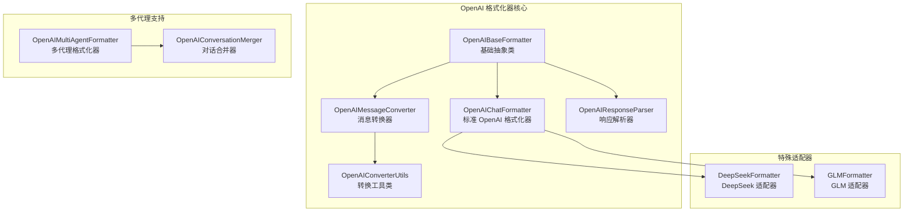
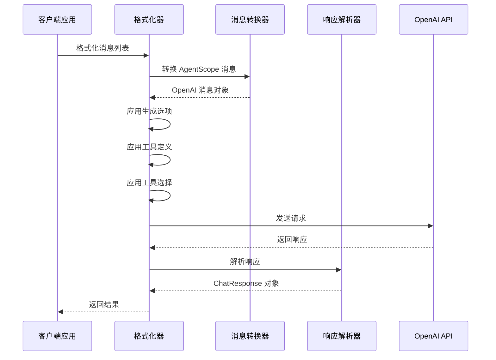
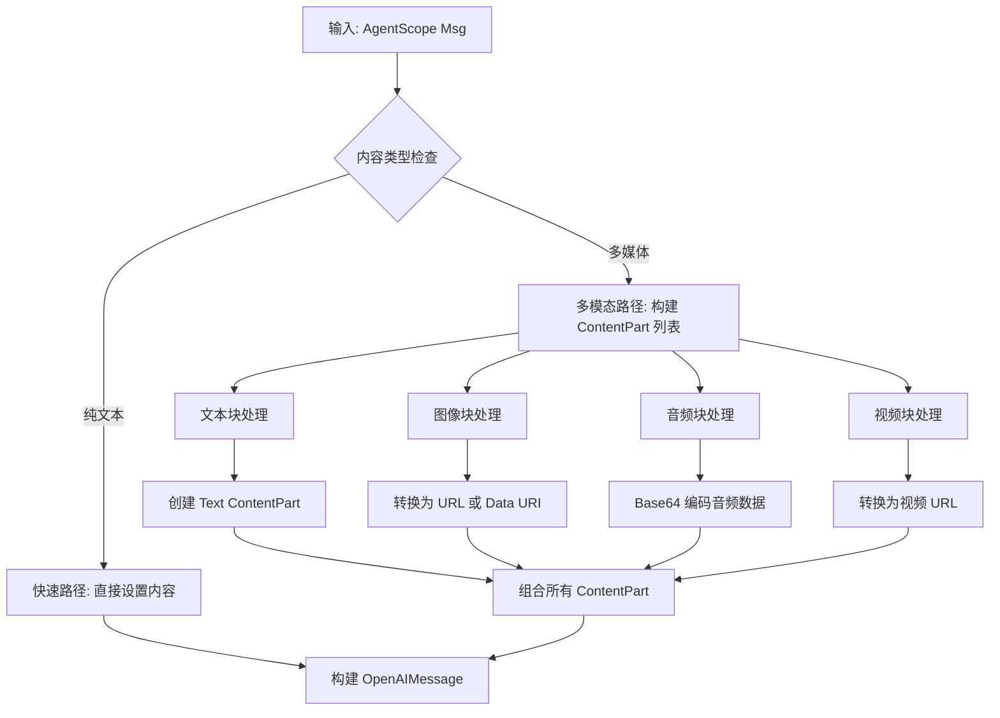
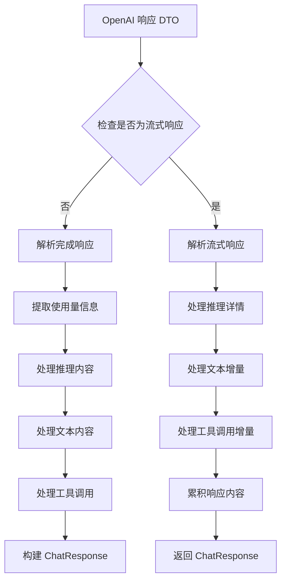
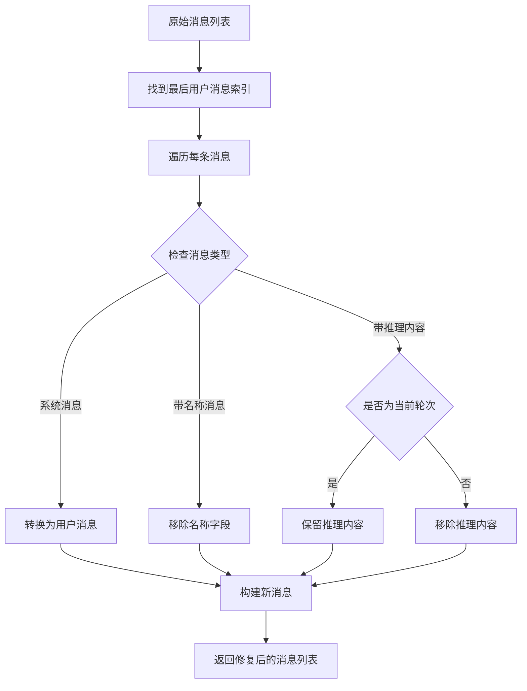
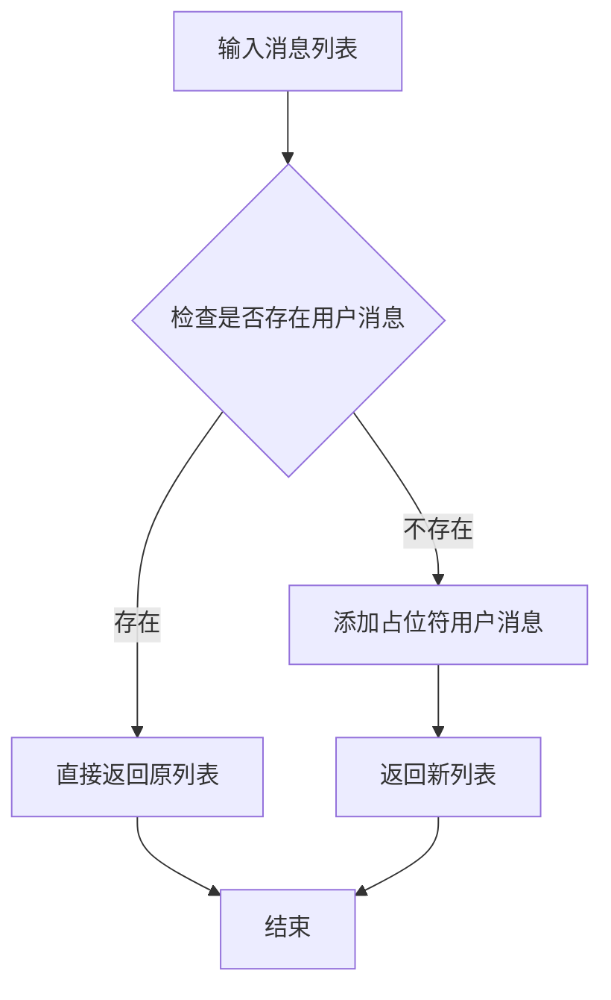
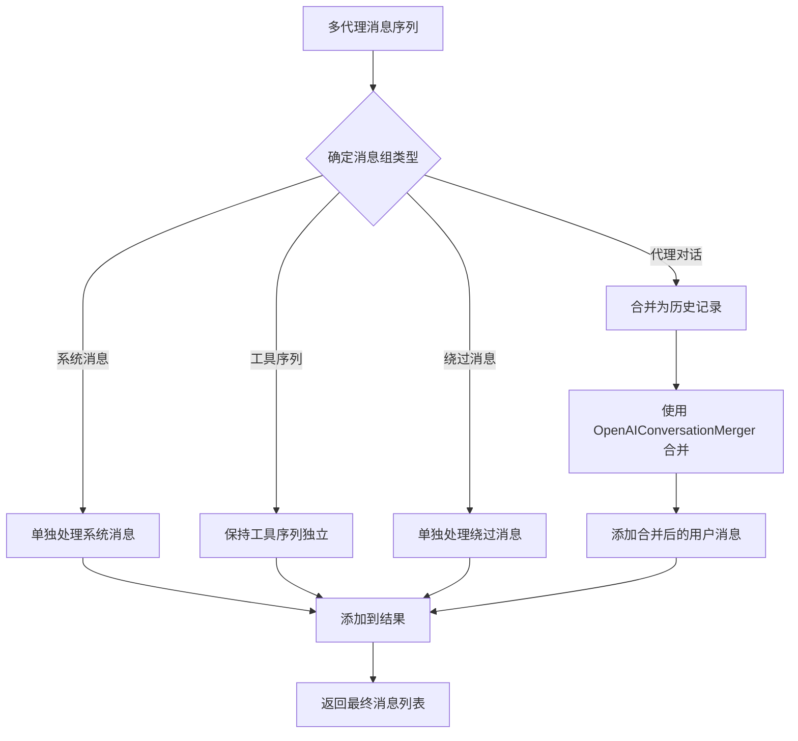
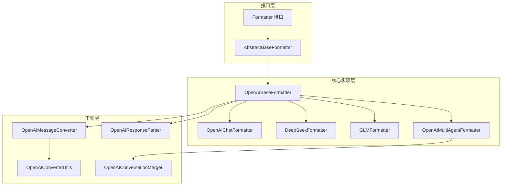

# OpenAI 格式化器

<cite>
**本文档引用的文件**
- [OpenAIChatFormatter.java](file://agentscope-core/src/main/java/io/agentscope/core/formatter/openai/OpenAIChatFormatter.java)
- [OpenAIBaseFormatter.java](file://agentscope-core/src/main/java/io/agentscope/core/formatter/openai/OpenAIBaseFormatter.java)
- [OpenAIMessageConverter.java](file://agentscope-core/src/main/java/io/agentscope/core/formatter/openai/OpenAIMessageConverter.java)
- [OpenAIResponseParser.java](file://agentscope-core/src/main/java/io/agentscope/core/formatter/openai/OpenAIResponseParser.java)
- [OpenAIConverterUtils.java](file://agentscope-core/src/main/java/io/agentscope/core/formatter/openai/OpenAIConverterUtils.java)
- [DeepSeekFormatter.java](file://agentscope-core/src/main/java/io/agentscope/core/formatter/openai/DeepSeekFormatter.java)
- [GLMFormatter.java](file://agentscope-core/src/main/java/io/agentscope/core/formatter/openai/GLMFormatter.java)
- [OpenAIMultiAgentFormatter.java](file://agentscope-core/src/main/java/io/agentscope/core/formatter/openai/OpenAIMultiAgentFormatter.java)
- [OpenAIConversationMerger.java](file://agentscope-core/src/main/java/io/agentscope/core/formatter/openai/OpenAIConversationMerger.java)
- [AbstractBaseFormatter.java](file://agentscope-core/src/main/java/io/agentscope/core/formatter/AbstractBaseFormatter.java)
- [Formatter.java](file://agentscope-core/src/main/java/io/agentscope/core/formatter/Formatter.java)
- [OpenAIChatFormatterTest.java](file://agentscope-core/src/test/java/io/agentscope/core/formatter/openai/OpenAIChatFormatterTest.java)
- [OpenAIMultiAgentFormatterTest.java](file://agentscope-core/src/test/java/io/agentscope/core/formatter/openai/OpenAIMultiAgentFormatterTest.java)
</cite>

## 目录
1. [简介](#简介)
2. [项目结构](#项目结构)
3. [核心组件](#核心组件)
4. [架构概览](#架构概览)
5. [详细组件分析](#详细组件分析)
6. [依赖关系分析](#依赖关系分析)
7. [性能考虑](#性能考虑)
8. [故障排除指南](#故障排除指南)
9. [结论](#结论)

## 简介

OpenAI 格式化器系列是 AgentScope 框架中用于处理 OpenAI API 兼容性的核心组件集合。该系列提供了完整的消息转换、请求构建、响应解析和工具调用支持，能够处理单代理和多代理场景下的复杂对话流程。

本系列包含多个专门的格式化器，每个都针对特定的 AI 服务提供商进行了优化，包括标准 OpenAI API、DeepSeek 和 GLM（智谱 AI）等。所有格式化器都基于统一的抽象层设计，确保了良好的可扩展性和兼容性。

## 项目结构

OpenAI 格式化器系列位于 `agentscope-core/src/main/java/io/agentscope/core/formatter/openai/` 目录下，采用模块化设计，每个组件都有明确的职责分工：

**图表来源**
- [OpenAIBaseFormatter.java:1-205](file://agentscope-core/src/main/java/io/agentscope/core/formatter/openai/OpenAIBaseFormatter.java#L1-L205)
- [OpenAIChatFormatter.java:1-278](file://agentscope-core/src/main/java/io/agentscope/core/formatter/openai/OpenAIChatFormatter.java#L1-L278)
- [OpenAIMessageConverter.java:1-487](file://agentscope-core/src/main/java/io/agentscope/core/formatter/openai/OpenAIMessageConverter.java#L1-L487)

**章节来源**
- [OpenAIBaseFormatter.java:1-205](file://agentscope-core/src/main/java/io/agentscope/core/formatter/openai/OpenAIBaseFormatter.java#L1-L205)
- [OpenAIChatFormatter.java:1-278](file://agentscope-core/src/main/java/io/agentscope/core/formatter/openai/OpenAIChatFormatter.java#L1-L278)

## 核心组件

### OpenAIBaseFormatter - 基础抽象层

OpenAIBaseFormatter 是整个 OpenAI 格式化器系列的抽象基类，提供了所有子类共享的核心功能：

- **消息转换基础设施**：集成 OpenAIMessageConverter 和 OpenAIResponseParser
- **请求构建支持**：提供 buildRequest 方法简化请求创建
- **缓存控制管理**：支持 ephemeral cache control 的应用
- **工具链适配**：为不同提供商提供工具定义的兼容性处理

该类继承自 AbstractBaseFormatter，复用了通用的消息处理能力，如文本内容提取、媒体内容检测和角色标签格式化。

**章节来源**
- [OpenAIBaseFormatter.java:30-205](file://agentscope-core/src/main/java/io/agentscope/core/formatter/openai/OpenAIBaseFormatter.java#L30-L205)
- [AbstractBaseFormatter.java:45-302](file://agentscope-core/src/main/java/io/agentscope/core/formatter/AbstractBaseFormatter.java#L45-L302)

### OpenAIChatFormatter - 标准 OpenAI 实现

OpenAIChatFormatter 是最完整的 OpenAI API 实现，支持以下特性：

- **完整采样参数支持**：temperature、top_p、频率惩罚、存在惩罚等
- **严格模式工具调用**：支持工具定义的 strict 参数
- **全面的工具选择选项**：auto、none、required、specific
- **高级请求配置**：支持 additionalBodyParams 的灵活配置

该实现特别处理了种子值的边界情况，当种子值超出 Integer 范围时会进行截断处理。

**章节来源**
- [OpenAIChatFormatter.java:34-278](file://agentscope-core/src/main/java/io/agentscope/core/formatter/openai/OpenAIChatFormatter.java#L34-L278)

## 架构概览

OpenAI 格式化器系列采用分层架构设计，确保了良好的关注点分离和可扩展性：

**图表来源**
- [OpenAIBaseFormatter.java:57-60](file://agentscope-core/src/main/java/io/agentscope/core/formatter/openai/OpenAIBaseFormatter.java#L57-L60)
- [OpenAIResponseParser.java:85-91](file://agentscope-core/src/main/java/io/agentscope/core/formatter/openai/OpenAIResponseParser.java#L85-L91)

## 详细组件分析

### OpenAIMessageConverter - 消息格式化策略

OpenAIMessageConverter 是消息转换的核心组件，负责将 AgentScope 的 Msg 对象转换为 OpenAI API 所需的 DTO 格式：

#### 多模态内容处理

该转换器支持多种内容类型的处理：

**图表来源**
- [OpenAIMessageConverter.java:159-256](file://agentscope-core/src/main/java/io/agentscope/core/formatter/openai/OpenAIMessageConverter.java#L159-L256)

#### 特殊消息类型处理

- **系统消息**：直接转换为 system 角色的消息
- **用户消息**：支持纯文本和多模态内容
- **助手消息**：处理思考内容和工具调用
- **工具消息**：转换工具执行结果

#### 工具调用支持

OpenAIMessageConverter 能够处理复杂的工具调用场景：

- **思考签名**：支持 Gemini 模型的 thought signature
- **推理详情**：保留详细的推理过程信息
- **参数解析**：将 JSON 参数字符串解析为结构化数据

**章节来源**
- [OpenAIMessageConverter.java:77-423](file://agentscope-core/src/main/java/io/agentscope/core/formatter/openai/OpenAIMessageConverter.java#L77-L423)

### OpenAIResponseParser - 响应解析算法

OpenAIResponseParser 提供了完整的响应解析能力，支持非流式和流式两种响应格式：

#### 非流式响应解析

**图表来源**
- [OpenAIResponseParser.java:85-91](file://agentscope-core/src/main/java/io/agentscope/core/formatter/openai/OpenAIResponseParser.java#L85-L91)

#### 流式响应处理

流式响应解析具有特殊的挑战性：

- **推理内容处理**：支持 reasoning_content 和 reasoning_details 的增量传输
- **工具调用累积**：处理工具调用参数的分片传输
- **错误处理**：及时检测和报告流式响应中的错误

#### 错误恢复机制

解析器实现了多层次的错误处理：

- **防御性编程**：对空值和异常情况进行安全检查
- **降级策略**：在解析失败时提供合理的回退方案
- **日志记录**：详细记录解析过程中的问题

**章节来源**
- [OpenAIResponseParser.java:100-303](file://agentscope-core/src/main/java/io/agentscope/core/formatter/openai/OpenAIResponseParser.java#L100-L303)
- [OpenAIResponseParser.java:312-580](file://agentscope-core/src/main/java/io/agentscope/core/formatter/openai/OpenAIResponseParser.java#L312-L580)

### OpenAIConverterUtils - 转换工具方法

OpenAIConverterUtils 提供了静态工具方法，支持各种媒体源到 URL 的转换：

#### 图像源转换

支持从 URLSource 和 Base64Source 创建图像 URL：

- **URLSource**：直接返回 URL 字符串
- **Base64Source**：转换为 data URI 格式
- **错误处理**：验证源的有效性并抛出适当的异常

#### 音频格式检测

提供智能的音频格式检测功能：

- **WAV 支持**：默认支持 WAV 格式
- **MP3 检测**：自动识别 MP3 格式
- **OPUS 支持**：检测 OPUS 编码
- **FLAC 支持**：识别 FLAC 格式
- **默认回退**：未知格式时回退到 MP3

**章节来源**
- [OpenAIConverterUtils.java:25-116](file://agentscope-core/src/main/java/io/agentscope/core/formatter/openai/OpenAIConverterUtils.java#L25-L116)

### DeepSeekFormatter - DeepSeek 特殊适配

DeepSeekFormatter 专门处理 DeepSeek API 的特殊要求：

#### API 兼容性修复

**图表来源**
- [DeepSeekFormatter.java:97-171](file://agentscope-core/src/main/java/io/agentscope/core/formatter/openai/DeepSeekFormatter.java#L97-L171)

#### 关键适配特性

- **名称字段移除**：DeepSeek API 不支持消息中的 name 字段
- **系统消息转换**：将 system 消息转换为 user 消息
- **推理内容管理**：仅在当前轮次保留推理内容
- **空用户消息支持**：可选地添加空用户消息避免 API 错误

**章节来源**
- [DeepSeekFormatter.java:24-173](file://agentscope-core/src/main/java/io/agentscope/core/formatter/openai/DeepSeekFormatter.java#L24-L173)

### GLMFormatter - GLM 特殊适配

GLMFormatter 处理智谱 AI GLM 模型的特定要求：

#### 用户消息强制保证

GLM API 要求至少有一个用户消息，因此实现了一个强制保证机制：

**图表来源**
- [GLMFormatter.java:83-95](file://agentscope-core/src/main/java/io/agentscope/core/formatter/openai/GLMFormatter.java#L83-L95)

#### 工具选择限制处理

GLM 仅支持 "auto" 工具选择模式，其他模式会被降级：

- **自动降级**：将非 auto 模式降级为 "auto"
- **日志记录**：记录降级操作以便调试
- **向后兼容**：保持与标准 OpenAI 工具选择的兼容性

**章节来源**
- [GLMFormatter.java:27-121](file://agentscope-core/src/main/java/io/agentscope/core/formatter/openai/GLMFormatter.java#L27-L121)

### OpenAIMultiAgentFormatter - 多代理支持

OpenAIMultiAgentFormatter 扩展了 OpenAIChatFormatter，增加了多代理场景的支持：

#### 对话合并策略

**图表来源**
- [OpenAIMultiAgentFormatter.java:65-96](file://agentscope-core/src/main/java/io/agentscope/core/formatter/openai/OpenAIMultiAgentFormatter.java#L65-L96)

#### 历史记录格式化

OpenAIConversationMerger 提供了专业的对话历史格式化功能：

- **历史标记**：使用 `<history>` 和 `</history>` 标记历史内容
- **多模态支持**：保留图像、音频和视频内容
- **工具结果处理**：格式化工具执行结果
- **思维内容集成**：包含思考过程的历史记录

**章节来源**
- [OpenAIMultiAgentFormatter.java:25-193](file://agentscope-core/src/main/java/io/agentscope/core/formatter/openai/OpenAIMultiAgentFormatter.java#L25-L193)

## 依赖关系分析

OpenAI 格式化器系列展现了清晰的依赖层次结构：

**图表来源**
- [Formatter.java:26-136](file://agentscope-core/src/main/java/io/agentscope/core/formatter/Formatter.java#L26-L136)
- [AbstractBaseFormatter.java:45-302](file://agentscope-core/src/main/java/io/agentscope/core/formatter/AbstractBaseFormatter.java#L45-L302)

### 组件耦合度分析

- **高内聚**：每个组件专注于特定的功能领域
- **低耦合**：通过接口和抽象类实现松散耦合
- **可替换性**：不同格式化器可以互换使用
- **扩展性**：新的提供商可以通过继承实现

**章节来源**
- [OpenAIBaseFormatter.java:42-205](file://agentscope-core/src/main/java/io/agentscope/core/formatter/openai/OpenAIBaseFormatter.java#L42-L205)

## 性能考虑

### 内存优化策略

1. **流式处理**：响应解析器支持增量处理，减少内存占用
2. **内容缓冲**：多模态内容处理使用高效的缓冲机制
3. **对象重用**：复用转换器实例以减少对象创建开销

### 处理效率优化

1. **快速路径**：纯文本用户消息使用快速路径避免不必要的处理
2. **延迟计算**：工具调用参数解析仅在需要时进行
3. **批量处理**：多代理场景下的消息分组处理

### 错误处理性能

1. **早期验证**：在转换前进行输入验证
2. **渐进式解析**：响应解析器采用渐进式处理策略
3. **资源清理**：及时释放临时资源和缓冲区

## 故障排除指南

### 常见问题诊断

#### 消息转换失败

**症状**：转换过程中出现异常或空消息

**解决方案**：
1. 检查消息内容的有效性
2. 验证媒体源的完整性
3. 确认消息角色的正确性

#### 工具调用解析错误

**症状**：工具调用参数解析失败

**解决方案**：
1. 检查 JSON 参数格式
2. 验证工具定义的完整性
3. 确认工具调用 ID 的唯一性

#### API 兼容性问题

**症状**：特定提供商 API 调用失败

**解决方案**：
1. 使用对应的专用格式化器
2. 检查提供商的特殊要求
3. 验证请求格式的正确性

**章节来源**
- [OpenAIResponseParser.java:290-295](file://agentscope-core/src/main/java/io/agentscope/core/formatter/openai/OpenAIResponseParser.java#L290-L295)
- [OpenAIMessageConverter.java:174-181](file://agentscope-core/src/main/java/io/agentscope/core/formatter/openai/OpenAIMessageConverter.java#L174-L181)

## 结论

OpenAI 格式化器系列展现了优秀的软件工程实践，通过模块化设计、清晰的抽象层次和完善的错误处理机制，为多样的 AI 服务提供商提供了统一且高效的接口。

该系列的主要优势包括：

1. **高度可扩展性**：基于抽象基类的设计允许轻松添加新的提供商支持
2. **完整的功能覆盖**：从基本的消息转换到复杂的工具调用和多代理场景
3. **健壮的错误处理**：多层次的错误检测和恢复机制
4. **性能优化**：针对内存使用和处理效率的精心优化
5. **测试完备性**：全面的单元测试确保代码质量

通过合理使用这些组件，开发者可以轻松集成各种 OpenAI 兼容的 AI 服务，同时保持代码的可维护性和扩展性。