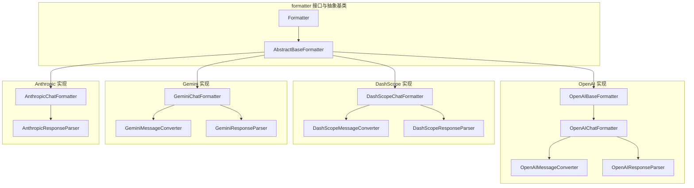
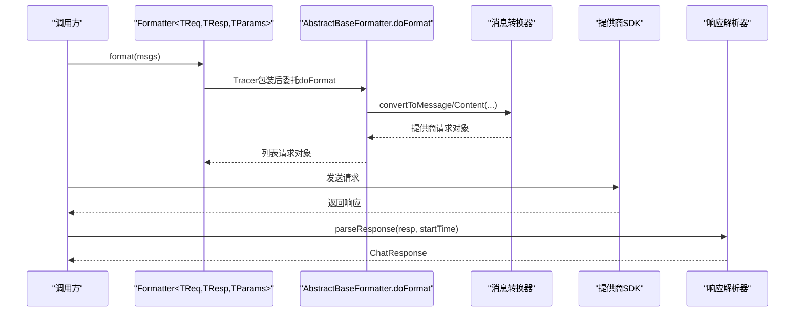
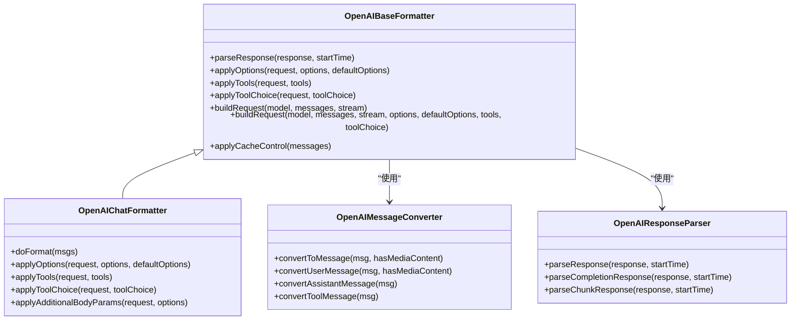
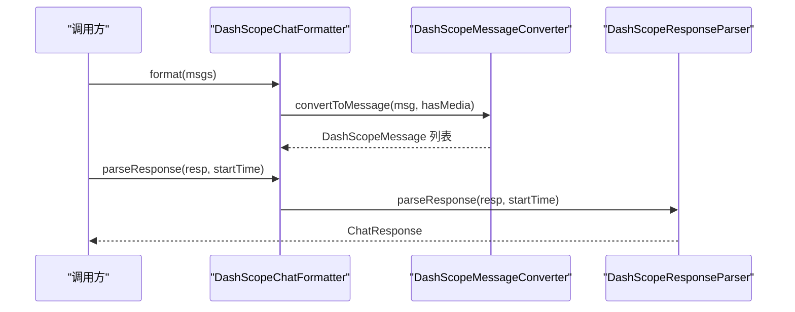
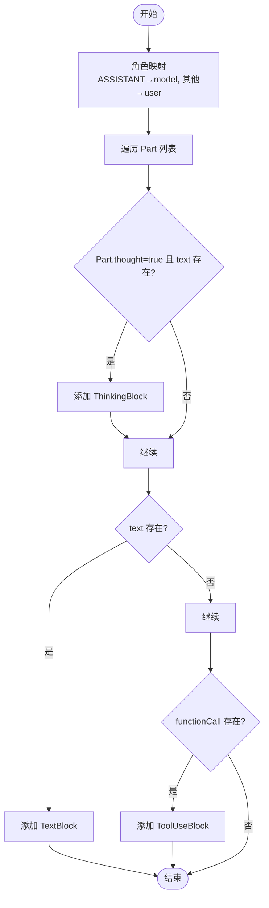
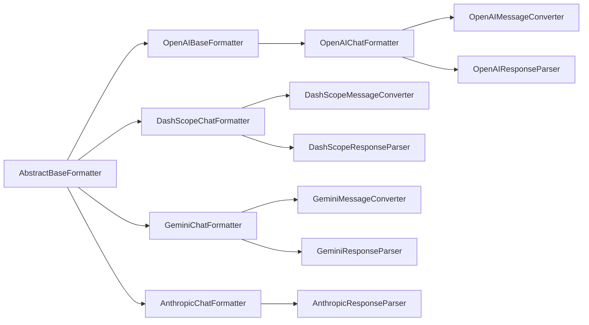

# 格式化器系统

<cite>
**本文档引用的文件**
- [Formatter.java](file://agentscope-core/src/main/java/io/agentscope/core/formatter/Formatter.java)
- [AbstractBaseFormatter.java](file://agentscope-core/src/main/java/io/agentscope/core/formatter/AbstractBaseFormatter.java)
- [OpenAIChatFormatter.java](file://agentscope-core/src/main/java/io/agentscope/core/formatter/openai/OpenAIChatFormatter.java)
- [OpenAIBaseFormatter.java](file://agentscope-core/src/main/java/io/agentscope/core/formatter/openai/OpenAIBaseFormatter.java)
- [OpenAIMessageConverter.java](file://agentscope-core/src/main/java/io/agentscope/core/formatter/openai/OpenAIMessageConverter.java)
- [OpenAIResponseParser.java](file://agentscope-core/src/main/java/io/agentscope/core/formatter/openai/OpenAIResponseParser.java)
- [DashScopeChatFormatter.java](file://agentscope-core/src/main/java/io/agentscope/core/formatter/dashscope/DashScopeChatFormatter.java)
- [DashScopeMessageConverter.java](file://agentscope-core/src/main/java/io/agentscope/core/formatter/dashscope/DashScopeMessageConverter.java)
- [DashScopeResponseParser.java](file://agentscope-core/src/main/java/io/agentscope/core/formatter/dashscope/DashScopeResponseParser.java)
- [GeminiChatFormatter.java](file://agentscope-core/src/main/java/io/agentscope/core/formatter/gemini/GeminiChatFormatter.java)
- [GeminiMessageConverter.java](file://agentscope-core/src/main/java/io/agentscope/core/formatter/gemini/GeminiMessageConverter.java)
- [GeminiResponseParser.java](file://agentscope-core/src/main/java/io/agentscope/core/formatter/gemini/GeminiResponseParser.java)
- [AnthropicChatFormatter.java](file://agentscope-core/src/main/java/io/agentscope/core/formatter/anthropic/AnthropicChatFormatter.java)
- [AnthropicResponseParser.java](file://agentscope-core/src/main/java/io/agentscope/core/formatter/anthropic/AnthropicResponseParser.java)
</cite>

## 目录
1. [简介](#简介)
2. [项目结构](#项目结构)
3. [核心组件](#核心组件)
4. [架构总览](#架构总览)
5. [详细组件分析](#详细组件分析)
6. [依赖分析](#依赖分析)
7. [性能考虑](#性能考虑)
8. [故障排查指南](#故障排查指南)
9. [结论](#结论)
10. [附录](#附录)

## 简介
本文件面向 AgentScope Java 的格式化器系统，系统性阐述 Formatter 接口的设计理念与消息转换机制，详解 AbstractBaseFormatter 提供的通用能力与模板方法，对比各提供商专用格式化器的实现差异与适配策略，并覆盖消息格式化、工具模式转换、多模态内容处理等关键主题。同时给出自定义格式化器的开发指南、性能优化与缓存策略建议，以及格式化器注册、动态切换与版本兼容性管理的最佳实践。

## 项目结构
格式化器体系位于 agentscope-core 模块的 formatter 包下，按“接口 + 抽象基类 + 各提供商实现”的分层组织方式构建。各提供商（OpenAI、DashScope、Gemini、Anthropic）均提供独立的格式化器、消息转换器、响应解析器与工具辅助类，形成清晰的职责边界与可扩展架构。

图表来源
- [Formatter.java:45-135](file://agentscope-core/src/main/java/io/agentscope/core/formatter/Formatter.java#L45-L135)
- [AbstractBaseFormatter.java:60-301](file://agentscope-core/src/main/java/io/agentscope/core/formatter/AbstractBaseFormatter.java#L60-L301)
- [OpenAIBaseFormatter.java:42-204](file://agentscope-core/src/main/java/io/agentscope/core/formatter/openai/OpenAIBaseFormatter.java#L42-L204)
- [OpenAIChatFormatter.java:46-277](file://agentscope-core/src/main/java/io/agentscope/core/formatter/openai/OpenAIChatFormatter.java#L46-L277)
- [OpenAIMessageConverter.java:50-486](file://agentscope-core/src/main/java/io/agentscope/core/formatter/openai/OpenAIMessageConverter.java#L50-L486)
- [OpenAIResponseParser.java:47-581](file://agentscope-core/src/main/java/io/agentscope/core/formatter/openai/OpenAIResponseParser.java#L47-L581)
- [DashScopeChatFormatter.java:42-207](file://agentscope-core/src/main/java/io/agentscope/core/formatter/dashscope/DashScopeChatFormatter.java#L42-L207)
- [DashScopeMessageConverter.java:43-329](file://agentscope-core/src/main/java/io/agentscope/core/formatter/dashscope/DashScopeMessageConverter.java#L43-L329)
- [DashScopeResponseParser.java:43-175](file://agentscope-core/src/main/java/io/agentscope/core/formatter/dashscope/DashScopeResponseParser.java#L43-L175)
- [GeminiChatFormatter.java:52-208](file://agentscope-core/src/main/java/io/agentscope/core/formatter/gemini/GeminiChatFormatter.java#L52-L208)
- [GeminiMessageConverter.java:65-337](file://agentscope-core/src/main/java/io/agentscope/core/formatter/gemini/GeminiMessageConverter.java#L65-L337)
- [GeminiResponseParser.java:56-218](file://agentscope-core/src/main/java/io/agentscope/core/formatter/gemini/GeminiResponseParser.java#L56-L218)
- [AnthropicChatFormatter.java:37-52](file://agentscope-core/src/main/java/io/agentscope/core/formatter/anthropic/AnthropicChatFormatter.java#L37-L52)
- [AnthropicResponseParser.java:42-210](file://agentscope-core/src/main/java/io/agentscope/core/formatter/anthropic/AnthropicResponseParser.java#L42-L210)

章节来源
- [Formatter.java:26-135](file://agentscope-core/src/main/java/io/agentscope/core/formatter/Formatter.java#L26-L135)
- [AbstractBaseFormatter.java:45-301](file://agentscope-core/src/main/java/io/agentscope/core/formatter/AbstractBaseFormatter.java#L45-L301)

## 核心组件
- Formatter 接口：定义统一的消息格式化、响应解析与参数应用契约，支持生成选项、工具定义与工具选择的注入，以及基于 baseUrl/modelName 的兼容性处理。
- AbstractBaseFormatter 抽象基类：提供文本提取、媒体检测、角色标签格式化、历史合并豁免标记、选项回退获取、工具结果转文本、媒体到文本引用转换与临时文件保存等通用能力，所有具体格式化器继承该基类以复用公共逻辑。
- 各提供商格式化器：在各自包内提供 ChatFormatter、MessageConverter、ResponseParser、ToolsHelper 等配套组件，完成与 SDK 类型的双向转换与细节适配。

章节来源
- [Formatter.java:45-135](file://agentscope-core/src/main/java/io/agentscope/core/formatter/Formatter.java#L45-L135)
- [AbstractBaseFormatter.java:60-301](file://agentscope-core/src/main/java/io/agentscope/core/formatter/AbstractBaseFormatter.java#L60-L301)

## 架构总览
格式化器系统采用“接口 + 抽象基类 + 具体实现 + 转换器/解析器”的分层设计。调用流程通常为：消息列表经格式化器转换为提供商请求类型；SDK 返回响应后由对应解析器转换为统一的 ChatResponse；工具定义与工具选择通过参数构建器注入。

图表来源
- [Formatter.java:53-62](file://agentscope-core/src/main/java/io/agentscope/core/formatter/Formatter.java#L53-L62)
- [AbstractBaseFormatter.java:71-76](file://agentscope-core/src/main/java/io/agentscope/core/formatter/AbstractBaseFormatter.java#L71-L76)
- [OpenAIChatFormatter.java:54-65](file://agentscope-core/src/main/java/io/agentscope/core/formatter/openai/OpenAIChatFormatter.java#L54-L65)
- [DashScopeChatFormatter.java:57-73](file://agentscope-core/src/main/java/io/agentscope/core/formatter/dashscope/DashScopeChatFormatter.java#L57-L73)
- [GeminiChatFormatter.java:69-77](file://agentscope-core/src/main/java/io/agentscope/core/formatter/gemini/GeminiChatFormatter.java#L69-L77)
- [AnthropicChatFormatter.java:39-51](file://agentscope-core/src/main/java/io/agentscope/core/formatter/anthropic/AnthropicChatFormatter.java#L39-L51)

## 详细组件分析

### Formatter 接口与模板方法
- 核心职责
  - format：将 AgentScope 的 Msg 列表转换为提供商请求消息列表。
  - parseResponse：将提供商响应对象解析为统一 ChatResponse。
  - applyOptions：将 GenerateOptions 应用到参数构建器，支持默认选项回退。
  - applyTools：将工具定义列表应用到参数构建器。
  - applyTools(baseUrl, modelName)：带提供商识别的工具兼容性处理。
  - applyToolChoice：将工具选择配置应用到参数构建器。
  - applyToolChoice(baseUrl, modelName)：带提供商识别的工具选择兼容性处理。
- 设计要点
  - 泛型约束明确请求/响应/参数构建器类型，保证类型安全。
  - 默认方法允许子类按需覆盖，保持向后兼容。
  - 为工具与工具选择提供两阶段方法签名，便于在已知 baseUrl/modelName 时做兼容性调整。

章节来源
- [Formatter.java:45-135](file://agentscope-core/src/main/java/io/agentscope/core/formatter/Formatter.java#L45-L135)

### AbstractBaseFormatter 抽象基类
- 文本内容提取：过滤 ThinkingBlock，仅保留 TextBlock 与 ToolResultBlock 中的文本，拼接为字符串。
- 多模态内容检测：判断消息是否包含 ImageBlock/AudioBlock/VideoBlock。
- 角色标签格式化：将 MsgRole 映射为 "User"/"Assistant"/"System"/"Tool"。
- 历史合并豁免：根据消息元数据标志决定是否跳过历史合并。
- 选项回退获取：从主选项或默认选项中安全取值。
- 工具结果转文本：对多模态输出进行统一文本化，单条直接返回，多条使用“- ”前缀分行。
- 媒体到文本引用：对 URLSource 直接引用，对 Base64Source 写入临时文件并返回路径，异常时记录错误信息。
- 临时文件保存：根据 MIME 类型推断扩展名，写入 Base64 数据并返回绝对路径。

章节来源
- [AbstractBaseFormatter.java:60-301](file://agentscope-core/src/main/java/io/agentscope/core/formatter/AbstractBaseFormatter.java#L60-L301)

### OpenAI 格式化器族
- OpenAIBaseFormatter
  - 统一消息转换器与响应解析器实例化。
  - 提供 buildRequest 基础与完整构建方法，支持缓存控制（ephemeral cache_control）。
  - 为工具与工具选择提供默认实现，子类可覆写。
- OpenAIChatFormatter
  - doFormat：逐条消息转换，依据是否有媒体内容选择不同消息格式。
  - applyOptions：温度、推理努力、top_p、频率/存在惩罚、最大令牌数、种子、并行工具调用、附加 body 参数。
  - applyTools：将 ToolSchema 转换为 OpenAI 函数工具，支持严格模式（可通过 supportsStrict 控制）。
  - applyToolChoice：支持 auto/none/required/specific，specific 使用函数调用格式。
  - applyAdditionalBodyParams：处理额外 body 参数（如 reasoning_effort/include_reasoning/stop/response_format），未知参数进入 extraParams。
- OpenAIMessageConverter
  - 角色映射：SYSTEM/USER/ASSISTANT/TOOL。
  - 纯文本快速路径：单 TextBlock 时直接设置 content，避免复杂结构。
  - 多模态内容：图像/音频/视频分别转换为 URL 或输入音频格式；音频对 Base64 与 URL 分支处理。
  - 思考内容：assistant 消息中的 reasoning_content 与 reasoning_details 保留。
  - 工具调用：ToolUseBlock 转为 OpenAIToolCall，支持 thought_signature 与 reasoning_detail。
  - 工具结果：ToolResultBlock 转为 tool 角色消息，多模态时拆分为内容部件。
  - 缓存控制：从消息元数据读取 cache_control 标志并应用。
- OpenAIResponseParser
  - 非流式：解析 usage、reasoning_content/reasoning_details、content、tool_calls，恢复 ThinkingBlock 与 ToolUseBlock。
  - 流式：增量解析 reasoning_text/summary、content、tool_calls 片段，支持 partial arguments 与 thought signature 片段，使用占位符聚合。
  - 错误处理：流式错误抛出 OpenAIException，非流式错误返回文本提示。

图表来源
- [OpenAIBaseFormatter.java:42-204](file://agentscope-core/src/main/java/io/agentscope/core/formatter/openai/OpenAIBaseFormatter.java#L42-L204)
- [OpenAIChatFormatter.java:46-277](file://agentscope-core/src/main/java/io/agentscope/core/formatter/openai/OpenAIChatFormatter.java#L46-L277)
- [OpenAIMessageConverter.java:50-486](file://agentscope-core/src/main/java/io/agentscope/core/formatter/openai/OpenAIMessageConverter.java#L50-L486)
- [OpenAIResponseParser.java:47-581](file://agentscope-core/src/main/java/io/agentscope/core/formatter/openai/OpenAIResponseParser.java#L47-L581)

章节来源
- [OpenAIBaseFormatter.java:42-204](file://agentscope-core/src/main/java/io/agentscope/core/formatter/openai/OpenAIBaseFormatter.java#L42-L204)
- [OpenAIChatFormatter.java:46-277](file://agentscope-core/src/main/java/io/agentscope/core/formatter/openai/OpenAIChatFormatter.java#L46-L277)
- [OpenAIMessageConverter.java:50-486](file://agentscope-core/src/main/java/io/agentscope/core/formatter/openai/OpenAIMessageConverter.java#L50-L486)
- [OpenAIResponseParser.java:47-581](file://agentscope-core/src/main/java/io/agentscope/core/formatter/openai/OpenAIResponseParser.java#L47-L581)

### DashScope 格式化器族
- DashScopeChatFormatter
  - doFormat：委托 DashScopeMessageConverter 转换消息。
  - parseResponse：委托 DashScopeResponseParser 解析响应。
  - applyOptions/applyTools/applyToolChoice：通过 DashScopeParameters 注入工具与选项。
  - formatMultiModal/buildRequest：针对视觉模型的多模态消息格式与请求构建。
  - applyCacheControl：为 system 与最后一条消息添加缓存控制（ephemeral）。
- DashScopeMessageConverter
  - 统一转换：根据 useMultimodalFormat 选择简单文本或内容部件列表。
  - TOOL 角色特殊处理：包含 toolCallId 与 name 字段。
  - ASSISTANT 工具调用：从 ToolUseBlock 转换为 toolCalls。
  - 缓存控制：从消息元数据读取 cache_control 并应用。
- DashScopeResponseParser
  - 解析 reasoning_content、content、tool_calls。
  - 流式工具调用：首块含 name/id/部分参数，后续块仅含参数片段，使用占位符聚合。

图表来源
- [DashScopeChatFormatter.java:42-207](file://agentscope-core/src/main/java/io/agentscope/core/formatter/dashscope/DashScopeChatFormatter.java#L42-L207)
- [DashScopeMessageConverter.java:43-329](file://agentscope-core/src/main/java/io/agentscope/core/formatter/dashscope/DashScopeMessageConverter.java#L43-L329)
- [DashScopeResponseParser.java:43-175](file://agentscope-core/src/main/java/io/agentscope/core/formatter/dashscope/DashScopeResponseParser.java#L43-L175)

章节来源
- [DashScopeChatFormatter.java:42-207](file://agentscope-core/src/main/java/io/agentscope/core/formatter/dashscope/DashScopeChatFormatter.java#L42-L207)
- [DashScopeMessageConverter.java:43-329](file://agentscope-core/src/main/java/io/agentscope/core/formatter/dashscope/DashScopeMessageConverter.java#L43-L329)
- [DashScopeResponseParser.java:43-175](file://agentscope-core/src/main/java/io/agentscope/core/formatter/dashscope/DashScopeResponseParser.java#L43-L175)

### Gemini 格式化器族
- GeminiChatFormatter
  - doFormat：委托 GeminiMessageConverter 将消息转换为 Content 列表。
  - parseResponse：委托 GeminiResponseParser 解析 GenerateContentResponse。
  - applyOptions：温度、topP、topK（Float）、种子（Integer）、最大输出令牌、频率/存在惩罚、思考配置（ThinkingConfig）。
  - applyTools/applyToolChoice：通过 Tool 与 ToolConfig 注入工具与工具选择。
- GeminiMessageConverter
  - 角色映射：ASSISTANT → model，其他 → user（Gemini API 要求）。
  - 工具调用：ToolUseBlock 转为 FunctionCall，支持 thought_signature 元数据。
  - 工具结果：ToolResultBlock 转为独立 user 角色 Content（FunctionResponse）。
  - 多模态：图像/音频/视频转为内联数据部件。
  - 临时文件：Base64 媒体保存至临时文件并返回路径。
- GeminiResponseParser
  - 解析 candidates 第一个候选的 content.parts。
  - 思考内容：通过 Part 的 thought 标记识别 text 内容作为 ThinkingBlock。
  - 工具调用：FunctionCall 转为 ToolUseBlock，支持 thought_signature 元数据。
  - 用量：promptTokenCount、candidatesTokenCount、thoughtsTokenCount，输出令牌需扣除思考令牌。

图表来源
- [GeminiMessageConverter.java:65-337](file://agentscope-core/src/main/java/io/agentscope/core/formatter/gemini/GeminiMessageConverter.java#L65-L337)
- [GeminiResponseParser.java:56-218](file://agentscope-core/src/main/java/io/agentscope/core/formatter/gemini/GeminiResponseParser.java#L56-L218)

章节来源
- [GeminiChatFormatter.java:52-208](file://agentscope-core/src/main/java/io/agentscope/core/formatter/gemini/GeminiChatFormatter.java#L52-L208)
- [GeminiMessageConverter.java:65-337](file://agentscope-core/src/main/java/io/agentscope/core/formatter/gemini/GeminiMessageConverter.java#L65-L337)
- [GeminiResponseParser.java:56-218](file://agentscope-core/src/main/java/io/agentscope/core/formatter/gemini/GeminiResponseParser.java#L56-L218)

### Anthropic 格式化器族
- AnthropicChatFormatter
  - doFormat：委托内部消息转换器将消息转换为 SDK 参数类型。
  - parseResponse：根据响应类型解析为 ChatResponse。
- AnthropicResponseParser
  - 非流式：解析 content 中的 text/toolUse/thinking，统计 usage。
  - 流式：解析 message_start/content_block_start/delta/message_delta，增量组装文本与工具调用片段，最终生成 ChatResponse。

章节来源
- [AnthropicChatFormatter.java:37-52](file://agentscope-core/src/main/java/io/agentscope/core/formatter/anthropic/AnthropicChatFormatter.java#L37-L52)
- [AnthropicResponseParser.java:42-210](file://agentscope-core/src/main/java/io/agentscope/core/formatter/anthropic/AnthropicResponseParser.java#L42-L210)

## 依赖分析
- 耦合与内聚
  - Formatter 接口与 AbstractBaseFormatter 提供高内聚的通用能力，具体格式化器仅关注提供商特定细节。
  - 各格式化器通过 Converter/Parser 与 SDK 类型解耦，便于替换与扩展。
- 外部依赖
  - OpenAI：HTTP API DTO 与响应对象。
  - DashScope：消息、输入、参数、响应与工具调用 DTO。
  - Gemini：Content/Part/FunctionCall/GenerateContentResponse 等 SDK 类型。
  - Anthropic：消息与流事件类型。
- 循环依赖
  - 未发现循环依赖；各格式化器与其转换器/解析器之间为单向依赖。

图表来源
- [AbstractBaseFormatter.java:60-301](file://agentscope-core/src/main/java/io/agentscope/core/formatter/AbstractBaseFormatter.java#L60-L301)
- [OpenAIBaseFormatter.java:42-204](file://agentscope-core/src/main/java/io/agentscope/core/formatter/openai/OpenAIBaseFormatter.java#L42-L204)
- [OpenAIChatFormatter.java:46-277](file://agentscope-core/src/main/java/io/agentscope/core/formatter/openai/OpenAIChatFormatter.java#L46-L277)
- [DashScopeChatFormatter.java:42-207](file://agentscope-core/src/main/java/io/agentscope/core/formatter/dashscope/DashScopeChatFormatter.java#L42-L207)
- [GeminiChatFormatter.java:52-208](file://agentscope-core/src/main/java/io/agentscope/core/formatter/gemini/GeminiChatFormatter.java#L52-L208)
- [AnthropicChatFormatter.java:37-52](file://agentscope-core/src/main/java/io/agentscope/core/formatter/anthropic/AnthropicChatFormatter.java#L37-L52)

## 性能考虑
- 文本提取与拼接
  - 优先使用纯文本快速路径（单 TextBlock 用户消息），减少复杂结构构造成本。
- 多模态处理
  - 对 Base64 媒体先写入临时文件再引用，避免大体积数据在 JSON 中膨胀；注意磁盘 IO 开销。
- 工具调用解析
  - 流式响应中对 partial arguments 与 thought signature 片段进行增量聚合，避免一次性解析大 JSON。
- 选项应用
  - 仅在值非空时设置参数，减少无效调用与序列化开销。
- 缓存控制
  - 为 system 与最后一条消息添加缓存控制，有助于降低重复上下文带来的 token 消耗。

[本节为通用指导，无需列出章节来源]

## 故障排查指南
- 媒体处理失败
  - 现象：图像/音频/视频转换失败或 Base64 写入临时文件异常。
  - 处理：检查 Source 类型与数据完整性；查看日志中的错误信息；确认 MIME 类型与扩展名匹配。
- 工具调用解析异常
  - 现象：JSON 解析失败或缺少必要字段。
  - 处理：确认 arguments 是否为完整 JSON；检查 thought_signature 与 reasoning_detail 的传递；在流式场景下等待片段聚合完成。
- 流式响应错误
  - 现象：流式错误抛出异常或片段为空。
  - 处理：捕获并记录错误信息；在解析器中过滤空响应；检查网络稳定性与 SDK 版本。
- 角色与内容丢失
  - 现象：ThinkingBlock 未出现在响应中或工具结果未正确拆分。
  - 处理：确认转换器对 ThinkingBlock 的处理逻辑；检查 TOOL 角色消息的 toolCallId 与 name 设置。

章节来源
- [OpenAIMessageConverter.java:166-255](file://agentscope-core/src/main/java/io/agentscope/core/formatter/openai/OpenAIMessageConverter.java#L166-L255)
- [OpenAIResponseParser.java:312-580](file://agentscope-core/src/main/java/io/agentscope/core/formatter/openai/OpenAIResponseParser.java#L312-L580)
- [DashScopeMessageConverter.java:168-191](file://agentscope-core/src/main/java/io/agentscope/core/formatter/dashscope/DashScopeMessageConverter.java#L168-L191)
- [DashScopeResponseParser.java:129-174](file://agentscope-core/src/main/java/io/agentscope/core/formatter/dashscope/DashScopeResponseParser.java#L129-L174)
- [GeminiMessageConverter.java:137-163](file://agentscope-core/src/main/java/io/agentscope/core/formatter/gemini/GeminiMessageConverter.java#L137-L163)
- [GeminiResponseParser.java:135-217](file://agentscope-core/src/main/java/io/agentscope/core/formatter/gemini/GeminiResponseParser.java#L135-L217)
- [AnthropicResponseParser.java:103-210](file://agentscope-core/src/main/java/io/agentscope/core/formatter/anthropic/AnthropicResponseParser.java#L103-L210)

## 结论
格式化器系统通过 Formatter 接口与 AbstractBaseFormatter 抽象基类实现了跨提供商的一致性与可扩展性。各提供商格式化器在消息转换、工具模式与多模态处理上提供了差异化适配，配合转换器与解析器完成端到端的消息往返。遵循本文的开发与优化建议，可在保证兼容性的前提下获得更好的性能与可维护性。

[本节为总结性内容，无需列出章节来源]

## 附录

### 自定义格式化器开发指南
- 继承策略
  - 单一 Agent 场景：继承 AbstractBaseFormatter<TReq, TResp, TParams>，实现 doFormat 与 parseResponse。
  - 多提供商场景：可参考 OpenAIBaseFormatter 的模式，将通用逻辑下沉，具体差异在子类中覆写。
- 关键步骤
  - 定义消息转换器：负责 Msg → 提供商消息类型；处理角色映射、多模态部件、工具调用与工具结果。
  - 定义响应解析器：负责提供商响应 → ChatResponse；处理 usage、finishReason、ThinkingBlock、ToolUseBlock。
  - 实现工具与工具选择：在参数构建器上注入工具定义与工具选择策略。
  - 处理缓存控制：根据提供商要求为消息添加缓存控制标记。
- 最佳实践
  - 优先使用纯文本快速路径，减少不必要的结构构造。
  - 在流式场景中谨慎处理片段聚合，避免过早提交不完整结果。
  - 对 Base64 媒体进行临时文件落盘并记录路径，便于调试与问题定位。
  - 为工具调用提供完备的元数据传递（如 thought_signature、reasoning_detail）。

章节来源
- [AbstractBaseFormatter.java:60-301](file://agentscope-core/src/main/java/io/agentscope/core/formatter/AbstractBaseFormatter.java#L60-L301)
- [OpenAIBaseFormatter.java:42-204](file://agentscope-core/src/main/java/io/agentscope/core/formatter/openai/OpenAIBaseFormatter.java#L42-L204)

### 格式化性能优化与缓存策略
- 性能优化
  - 文本快速路径：单 TextBlock 用户消息直接设置 content。
  - 条件写入：仅在值非空时设置参数，减少序列化与网络传输。
  - 增量聚合：流式响应中对片段进行增量聚合，避免一次性解析大 JSON。
- 缓存策略
  - 为 system 与最后一条消息添加缓存控制（ephemeral），减少上下文重复。
  - 对 Base64 媒体落地临时文件，避免在请求体中携带大体积数据。

章节来源
- [OpenAIBaseFormatter.java:181-194](file://agentscope-core/src/main/java/io/agentscope/core/formatter/openai/OpenAIBaseFormatter.java#L181-L194)
- [DashScopeChatFormatter.java:184-197](file://agentscope-core/src/main/java/io/agentscope/core/formatter/dashscope/DashScopeChatFormatter.java#L184-L197)
- [OpenAIMessageConverter.java:132-150](file://agentscope-core/src/main/java/io/agentscope/core/formatter/openai/OpenAIMessageConverter.java#L132-L150)
- [AbstractBaseFormatter.java:282-300](file://agentscope-core/src/main/java/io/agentscope/core/formatter/AbstractBaseFormatter.java#L282-L300)

### 格式化器注册、动态切换与版本兼容性管理
- 注册与发现
  - 可通过服务加载机制或工厂模式注册不同提供商的格式化器实现，便于在运行时选择。
- 动态切换
  - 基于 baseUrl/modelName 的 provider 检测方法（applyTools/applyToolChoice 重载）实现兼容性适配。
- 版本兼容
  - 对于不支持严格模式的提供商（如某些 DeepSeek），通过 supportsStrict 控制是否应用 strict 参数。
  - 对于工具选择格式差异（如 OpenAI 的 function 对象 vs 其他格式），在 applyToolChoice 中做格式转换或降级。

章节来源
- [Formatter.java:96-134](file://agentscope-core/src/main/java/io/agentscope/core/formatter/Formatter.java#L96-L134)
- [OpenAIChatFormatter.java:189-191](file://agentscope-core/src/main/java/io/agentscope/core/formatter/openai/OpenAIChatFormatter.java#L189-L191)