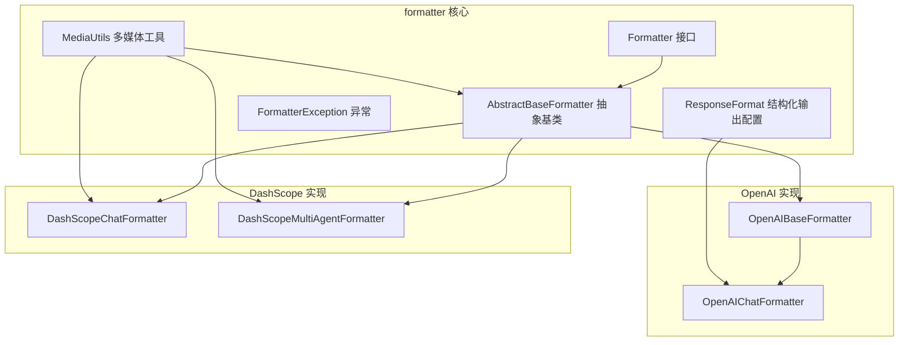
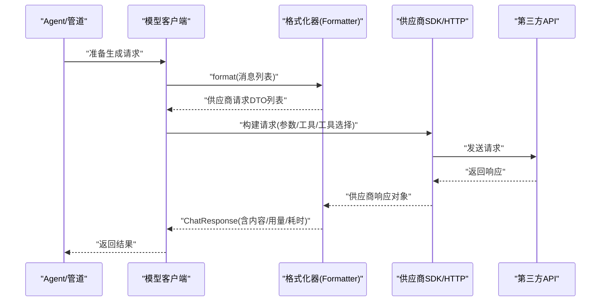
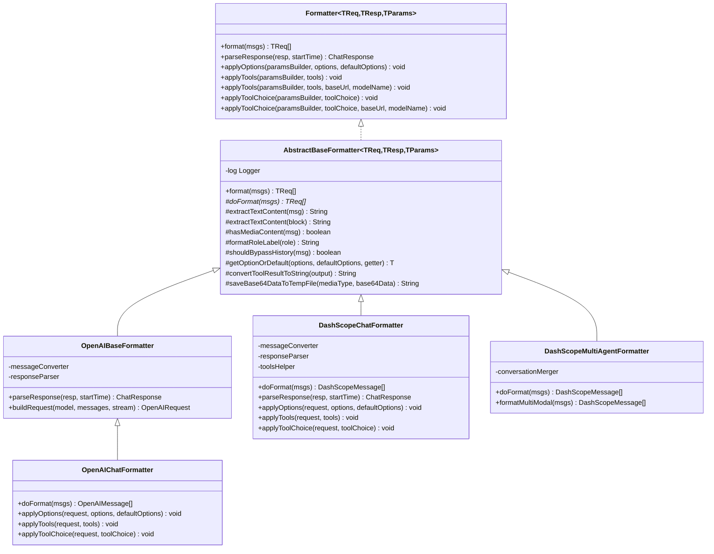
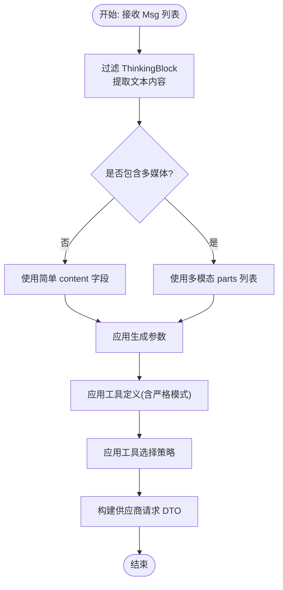
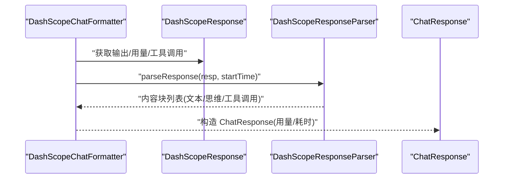
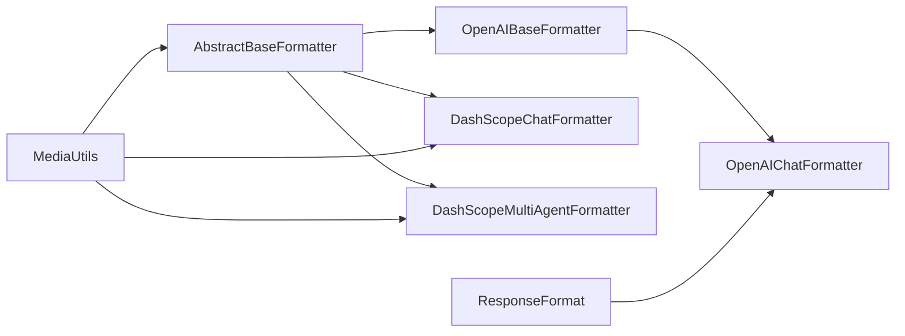

# 自定义格式化器开发

<cite>
**本文引用的文件**
- [Formatter.java](file://agentscope-core/src/main/java/io/agentscope/core/formatter/Formatter.java)
- [AbstractBaseFormatter.java](file://agentscope-core/src/main/java/io/agentscope/core/formatter/AbstractBaseFormatter.java)
- [FormatterException.java](file://agentscope-core/src/main/java/io/agentscope/core/formatter/FormatterException.java)
- [ResponseFormat.java](file://agentscope-core/src/main/java/io/agentscope/core/formatter/ResponseFormat.java)
- [MediaUtils.java](file://agentscope-core/src/main/java/io/agentscope/core/formatter/MediaUtils.java)
- [OpenAIBaseFormatter.java](file://agentscope-core/src/main/java/io/agentscope/core/formatter/openai/OpenAIBaseFormatter.java)
- [OpenAIChatFormatter.java](file://agentscope-core/src/main/java/io/agentscope/core/formatter/openai/OpenAIChatFormatter.java)
- [DashScopeChatFormatter.java](file://agentscope-core/src/main/java/io/agentscope/core/formatter/dashscope/DashScopeChatFormatter.java)
- [DashScopeMultiAgentFormatter.java](file://agentscope-core/src/main/java/io/agentscope/core/formatter/dashscope/DashScopeMultiAgentFormatter.java)
- [DashScopeChatFormatterTest.java](file://agentscope-core/src/test/java/io/agentscope/core/formatter/DashScopeChatFormatterTest.java)
</cite>

## 目录
1. [简介](#简介)
2. [项目结构](#项目结构)
3. [核心组件](#核心组件)
4. [架构总览](#架构总览)
5. [详细组件分析](#详细组件分析)
6. [依赖分析](#依赖分析)
7. [性能考虑](#性能考虑)
8. [故障排查指南](#故障排查指南)
9. [结论](#结论)
10. [附录](#附录)

## 简介
本指南面向需要在 AgentScope 中开发“自定义格式化器”的工程师，系统讲解如何基于 Formatter 接口与 AbstractBaseFormatter 抽象基类构建新的格式化器；详解格式化器的生命周期与注册机制；深入说明消息转换、响应解析与工具处理的实现步骤；强调泛型类型的正确使用与类型安全；提供测试策略与调试技巧；并给出性能优化与内存管理的最佳实践，以及第三方 API 集成时的兼容性处理要点。

## 项目结构
AgentScope 的格式化器位于 agentscope-core 模块的 formatter 包中，并按供应商拆分子包（如 openai、dashscope 等）。核心接口与抽象基类定义了统一的格式化契约与通用能力，具体供应商实现遵循该契约并扩展特定能力。

图表来源
- [Formatter.java:45-135](file://agentscope-core/src/main/java/io/agentscope/core/formatter/Formatter.java#L45-L135)
- [AbstractBaseFormatter.java:60-301](file://agentscope-core/src/main/java/io/agentscope/core/formatter/AbstractBaseFormatter.java#L60-L301)
- [OpenAIBaseFormatter.java:42-204](file://agentscope-core/src/main/java/io/agentscope/core/formatter/openai/OpenAIBaseFormatter.java#L42-L204)
- [OpenAIChatFormatter.java:46-277](file://agentscope-core/src/main/java/io/agentscope/core/formatter/openai/OpenAIChatFormatter.java#L46-L277)
- [DashScopeChatFormatter.java:42-207](file://agentscope-core/src/main/java/io/agentscope/core/formatter/dashscope/DashScopeChatFormatter.java#L42-L207)
- [DashScopeMultiAgentFormatter.java:46-391](file://agentscope-core/src/main/java/io/agentscope/core/formatter/dashscope/DashScopeMultiAgentFormatter.java#L46-L391)

章节来源
- [Formatter.java:26-135](file://agentscope-core/src/main/java/io/agentscope/core/formatter/Formatter.java#L26-L135)
- [AbstractBaseFormatter.java:45-301](file://agentscope-core/src/main/java/io/agentscope/core/formatter/AbstractBaseFormatter.java#L45-L301)

## 核心组件
- Formatter 接口：定义消息格式化、响应解析、生成参数与工具应用的契约，支持泛型以确保与具体供应商 SDK 类型一致。
- AbstractBaseFormatter 抽象基类：提供通用的消息文本提取、多媒体检测、角色标签格式化、历史合并控制、选项获取、工具结果转文本等能力。
- OpenAI 实现：OpenAIBaseFormatter 提供 OpenAI 通用能力，OpenAIChatFormatter 完成具体请求构建与工具严格模式、tool_choice 等细节。
- DashScope 实现：DashScopeChatFormatter 与 DashScopeMultiAgentFormatter 支持多模态与多代理场景，提供缓存控制、工具与参数封装。
- ResponseFormat：OpenAI 结构化输出配置（text/json_object/json_schema）。
- MediaUtils：本地文件读取、远程下载、MIME 推断、数据 URL 转换、尺寸校验等多媒体处理工具。
- FormatterException：格式化过程中的异常封装。

章节来源
- [Formatter.java:45-135](file://agentscope-core/src/main/java/io/agentscope/core/formatter/Formatter.java#L45-L135)
- [AbstractBaseFormatter.java:60-301](file://agentscope-core/src/main/java/io/agentscope/core/formatter/AbstractBaseFormatter.java#L60-L301)
- [OpenAIBaseFormatter.java:42-204](file://agentscope-core/src/main/java/io/agentscope/core/formatter/openai/OpenAIBaseFormatter.java#L42-L204)
- [OpenAIChatFormatter.java:46-277](file://agentscope-core/src/main/java/io/agentscope/core/formatter/openai/OpenAIChatFormatter.java#L46-L277)
- [DashScopeChatFormatter.java:42-207](file://agentscope-core/src/main/java/io/agentscope/core/formatter/dashscope/DashScopeChatFormatter.java#L42-L207)
- [DashScopeMultiAgentFormatter.java:46-391](file://agentscope-core/src/main/java/io/agentscope/core/formatter/dashscope/DashScopeMultiAgentFormatter.java#L46-L391)
- [ResponseFormat.java:49-141](file://agentscope-core/src/main/java/io/agentscope/core/formatter/ResponseFormat.java#L49-L141)
- [MediaUtils.java:41-414](file://agentscope-core/src/main/java/io/agentscope/core/formatter/MediaUtils.java#L41-L414)
- [FormatterException.java:24-44](file://agentscope-core/src/main/java/io/agentscope/core/formatter/FormatterException.java#L24-L44)

## 架构总览
下图展示格式化器在调用链中的位置与职责分工：上层 Agent/管道通过 Model 调用格式化器，格式化器负责将 Msg 转换为供应商请求 DTO，再由模型客户端发起 HTTP 请求；返回后由格式化器解析为 ChatResponse 并回传。

图表来源
- [Formatter.java:53-62](file://agentscope-core/src/main/java/io/agentscope/core/formatter/Formatter.java#L53-L62)
- [OpenAIBaseFormatter.java:57-60](file://agentscope-core/src/main/java/io/agentscope/core/formatter/openai/OpenAIBaseFormatter.java#L57-L60)
- [DashScopeChatFormatter.java:70-73](file://agentscope-core/src/main/java/io/agentscope/core/formatter/dashscope/DashScopeChatFormatter.java#L70-L73)

## 详细组件分析

### 组件一：Formatter 接口与 AbstractBaseFormatter 抽象基类
- 接口职责
  - format：将 AgentScope 的 Msg 列表转换为供应商请求消息类型。
  - parseResponse：将供应商响应对象解析为 ChatResponse。
  - applyOptions：将 GenerateOptions 应用到供应商请求参数构建器。
  - applyTools：将 ToolSchema 列表应用到请求参数构建器。
  - applyTools(baseUrl, modelName)：带供应商识别的工具兼容处理。
  - applyToolChoice：将 ToolChoice 应用到请求参数构建器。
  - applyToolChoice(baseUrl, modelName)：带供应商识别的工具选择兼容处理。
- 抽象基类增强
  - 统一的 format 生命周期：包装 Tracer 调用，委托 doFormat 实现。
  - 文本提取：过滤 ThinkingBlock，聚合文本内容。
  - 多媒体检测：判断是否包含图像/音频/视频。
  - 角色标签格式化：USER/ASSISTANT/SYSTEM/TOOL 映射。
  - 历史合并控制：支持 BYPASS_MULTIAGENT_HISTORY_MERGE 元数据标记。
  - 选项获取：优先从 options 获取，否则回退到 defaultOptions。
  - 工具结果转文本：对多模态输出进行统一字符串化。
  - 媒体转文本引用：URL 或临时文件路径引用。
  - 保存 Base64 数据到临时文件：用于无法直接上传的场景。

图表来源
- [Formatter.java:45-135](file://agentscope-core/src/main/java/io/agentscope/core/formatter/Formatter.java#L45-L135)
- [AbstractBaseFormatter.java:60-301](file://agentscope-core/src/main/java/io/agentscope/core/formatter/AbstractBaseFormatter.java#L60-L301)
- [OpenAIBaseFormatter.java:42-204](file://agentscope-core/src/main/java/io/agentscope/core/formatter/openai/OpenAIBaseFormatter.java#L42-L204)
- [OpenAIChatFormatter.java:46-277](file://agentscope-core/src/main/java/io/agentscope/core/formatter/openai/OpenAIChatFormatter.java#L46-L277)
- [DashScopeChatFormatter.java:42-207](file://agentscope-core/src/main/java/io/agentscope/core/formatter/dashscope/DashScopeChatFormatter.java#L42-L207)
- [DashScopeMultiAgentFormatter.java:46-391](file://agentscope-core/src/main/java/io/agentscope/core/formatter/dashscope/DashScopeMultiAgentFormatter.java#L46-L391)

章节来源
- [Formatter.java:45-135](file://agentscope-core/src/main/java/io/agentscope/core/formatter/Formatter.java#L45-L135)
- [AbstractBaseFormatter.java:60-301](file://agentscope-core/src/main/java/io/agentscope/core/formatter/AbstractBaseFormatter.java#L60-L301)

### 组件二：消息转换流程（以 OpenAI 为例）
- 输入：AgentScope 的 Msg 列表（可能包含 TextBlock、ImageBlock、AudioBlock、VideoBlock、ThinkingBlock、ToolUseBlock、ToolResultBlock 等）。
- 步骤：
  1) 过滤 ThinkingBlock，提取纯文本内容。
  2) 检测是否包含多媒体内容，决定使用简单 content 还是多模态 parts。
  3) 将工具调用与工具结果转换为供应商期望的结构。
  4) 应用生成参数（温度、采样策略、惩罚项、最大 token 等）。
  5) 应用工具定义与工具选择策略（auto/none/required/specific）。
- 输出：供应商请求 DTO 列表（例如 OpenAIMessage 列表）。

图表来源
- [OpenAIChatFormatter.java:54-125](file://agentscope-core/src/main/java/io/agentscope/core/formatter/openai/OpenAIChatFormatter.java#L54-L125)
- [OpenAIBaseFormatter.java:50-55](file://agentscope-core/src/main/java/io/agentscope/core/formatter/openai/OpenAIBaseFormatter.java#L50-L55)

章节来源
- [OpenAIBaseFormatter.java:50-55](file://agentscope-core/src/main/java/io/agentscope/core/formatter/openai/OpenAIBaseFormatter.java#L50-L55)
- [OpenAIChatFormatter.java:54-125](file://agentscope-core/src/main/java/io/agentscope/core/formatter/openai/OpenAIChatFormatter.java#L54-L125)

### 组件三：响应解析流程（以 DashScope 为例）
- 输入：DashScope 响应对象（包含 choices、usage、工具调用片段等）。
- 步骤：
  1) 解析 choices 获取第一条消息。
  2) 将文本内容与思维内容（reasoning）分别映射为 TextBlock 与 ThinkingBlock。
  3) 将工具调用（含片段）解析为 ToolUseBlock。
  4) 将工具结果（ToolResultBlock）映射为文本或多媒体引用。
  5) 计算耗时与用量（输入/输出 token），填充 ChatResponse。
- 输出：AgentScope 的 ChatResponse。

图表来源
- [DashScopeChatFormatter.java:70-73](file://agentscope-core/src/main/java/io/agentscope/core/formatter/dashscope/DashScopeChatFormatter.java#L70-L73)

章节来源
- [DashScopeChatFormatter.java:70-73](file://agentscope-core/src/main/java/io/agentscope/core/formatter/dashscope/DashScopeChatFormatter.java#L70-L73)

### 组件四：工具处理与兼容性
- 工具定义
  - OpenAI：将 ToolSchema 转换为 OpenAITool，支持 strict 参数（部分供应商不支持时可禁用）。
  - DashScope：通过 ToolsHelper 统一转换与参数注入。
- 工具选择
  - OpenAI：支持 auto/none/required/specific，specific 使用函数名映射。
  - DashScope：通过参数对象设置工具选择。
- 供应商兼容
  - 提供 applyTools(baseUrl, modelName) 与 applyToolChoice(baseUrl, modelName) 重载，允许根据 baseUrl/modelName 动态调整行为（如移除不支持的 strict 参数）。

章节来源
- [OpenAIChatFormatter.java:144-191](file://agentscope-core/src/main/java/io/agentscope/core/formatter/openai/OpenAIChatFormatter.java#L144-L191)
- [OpenAIBaseFormatter.java:103-122](file://agentscope-core/src/main/java/io/agentscope/core/formatter/openai/OpenAIBaseFormatter.java#L103-L122)
- [DashScopeChatFormatter.java:86-110](file://agentscope-core/src/main/java/io/agentscope/core/formatter/dashscope/DashScopeChatFormatter.java#L86-L110)

### 组件五：结构化输出（OpenAI）
- ResponseFormat 支持三种类型：text、json_object、json_schema。
- 可通过 ResponseFormat 或额外 body 参数传递给 OpenAI 请求。

章节来源
- [ResponseFormat.java:49-141](file://agentscope-core/src/main/java/io/agentscope/core/formatter/ResponseFormat.java#L49-L141)
- [OpenAIChatFormatter.java:255-276](file://agentscope-core/src/main/java/io/agentscope/core/formatter/openai/OpenAIChatFormatter.java#L255-L276)

### 组件六：多媒体处理
- MediaUtils 提供：
  - 本地文件读取与大小限制检查。
  - 远程 URL 下载与大小限制。
  - MIME 类型推断与扩展名提取。
  - 文件/URL 到 data URL 的转换。
  - 图像 RGBA 转换。
- AbstractBaseFormatter 在工具结果转文本时，对图片/音频/视频生成“可定位引用”，必要时保存 Base64 到临时文件。

章节来源
- [MediaUtils.java:41-414](file://agentscope-core/src/main/java/io/agentscope/core/formatter/MediaUtils.java#L41-L414)
- [AbstractBaseFormatter.java:196-300](file://agentscope-core/src/main/java/io/agentscope/core/formatter/AbstractBaseFormatter.java#L196-L300)

## 依赖分析
- 组件耦合
  - OpenAIBaseFormatter 依赖 OpenAIMessageConverter 与 OpenAIResponseParser；OpenAIChatFormatter 覆盖 doFormat、applyOptions、applyTools、applyToolChoice。
  - DashScopeChatFormatter 与 DashScopeMultiAgentFormatter 依赖各自的 Converter/Parser/ToolsHelper/ConversationMerger。
  - AbstractBaseFormatter 作为通用基类被多个供应商实现继承，降低重复逻辑。
- 外部依赖
  - Jackson 注解用于 ResponseFormat 的序列化。
  - SLF4J 日志门面用于记录警告与错误。
  - Java NIO/IO 用于文件与网络操作。

图表来源
- [OpenAIBaseFormatter.java:42-55](file://agentscope-core/src/main/java/io/agentscope/core/formatter/openai/OpenAIBaseFormatter.java#L42-L55)
- [OpenAIChatFormatter.java:46-52](file://agentscope-core/src/main/java/io/agentscope/core/formatter/openai/OpenAIChatFormatter.java#L46-L52)
- [DashScopeChatFormatter.java:42-55](file://agentscope-core/src/main/java/io/agentscope/core/formatter/dashscope/DashScopeChatFormatter.java#L42-L55)
- [DashScopeMultiAgentFormatter.java:46-77](file://agentscope-core/src/main/java/io/agentscope/core/formatter/dashscope/DashScopeMultiAgentFormatter.java#L46-L77)
- [ResponseFormat.java:49-141](file://agentscope-core/src/main/java/io/agentscope/core/formatter/ResponseFormat.java#L49-L141)
- [MediaUtils.java:41-414](file://agentscope-core/src/main/java/io/agentscope/core/formatter/MediaUtils.java#L41-L414)

章节来源
- [OpenAIBaseFormatter.java:42-55](file://agentscope-core/src/main/java/io/agentscope/core/formatter/openai/OpenAIBaseFormatter.java#L42-L55)
- [OpenAIChatFormatter.java:46-52](file://agentscope-core/src/main/java/io/agentscope/core/formatter/openai/OpenAIChatFormatter.java#L46-L52)
- [DashScopeChatFormatter.java:42-55](file://agentscope-core/src/main/java/io/agentscope/core/formatter/dashscope/DashScopeChatFormatter.java#L42-L55)
- [DashScopeMultiAgentFormatter.java:46-77](file://agentscope-core/src/main/java/io/agentscope/core/formatter/dashscope/DashScopeMultiAgentFormatter.java#L46-L77)
- [ResponseFormat.java:49-141](file://agentscope-core/src/main/java/io/agentscope/core/formatter/ResponseFormat.java#L49-L141)
- [MediaUtils.java:41-414](file://agentscope-core/src/main/java/io/agentscope/core/formatter/MediaUtils.java#L41-L414)

## 性能考虑
- 流式输出
  - 在请求构建阶段启用流式（stream=true），减少首字节延迟，提升交互体验。
- 媒体处理
  - 对于大文件或远程资源，优先使用 URL；仅在供应商要求时进行 Base64 编码，避免不必要的内存复制。
  - 合理设置下载与读取超时，避免阻塞。
- 文本聚合
  - 多个 TextBlock 合并为单条文本，减少消息数量与网络开销。
- 工具调用
  - 仅在存在工具时应用工具选择策略，避免无效参数写入。
- 缓存控制
  - 对系统提示与最后一条消息应用“瞬态缓存”策略，减少上下文污染与重复计算。

章节来源
- [OpenAIBaseFormatter.java:181-194](file://agentscope-core/src/main/java/io/agentscope/core/formatter/openai/OpenAIBaseFormatter.java#L181-L194)
- [DashScopeChatFormatter.java:184-197](file://agentscope-core/src/main/java/io/agentscope/core/formatter/dashscope/DashScopeChatFormatter.java#L184-L197)
- [MediaUtils.java:113-146](file://agentscope-core/src/main/java/io/agentscope/core/formatter/MediaUtils.java#L113-L146)

## 故障排查指南
- 常见异常
  - FormatterException：封装底层错误（JSON 解析、SDK 错误等），便于统一处理。
- 调试技巧
  - 使用日志：AbstractBaseFormatter 对跳过 ThinkingBlock、保存临时文件等关键路径有日志输出。
  - 单元测试：参考 DashScopeChatFormatterTest，覆盖消息格式化、响应解析、工具调用、多媒体处理、空输出、异常场景等。
  - 断点与最小复现：针对特定供应商参数（如 strict、tool_choice）与工具 schema 进行隔离测试。
- 媒体问题
  - 检查文件是否存在、可读、未超过大小限制；确认 MIME 类型与扩展名匹配；必要时使用 data URL 或 file:// 协议。

章节来源
- [FormatterException.java:24-44](file://agentscope-core/src/main/java/io/agentscope/core/formatter/FormatterException.java#L24-L44)
- [DashScopeChatFormatterTest.java:56-864](file://agentscope-core/src/test/java/io/agentscope/core/formatter/DashScopeChatFormatterTest.java#L56-L864)
- [AbstractBaseFormatter.java:94-96](file://agentscope-core/src/main/java/io/agentscope/core/formatter/AbstractBaseFormatter.java#L94-L96)
- [MediaUtils.java:88-99](file://agentscope-core/src/main/java/io/agentscope/core/formatter/MediaUtils.java#L88-L99)

## 结论
通过 Formatter 接口与 AbstractBaseFormatter 抽象基类，AgentScope 为第三方 API 集成提供了清晰、可扩展且类型安全的格式化框架。开发者只需专注于供应商特有的消息转换、参数与工具处理细节，即可快速实现高质量的格式化器，并在统一的生命周期与测试体系下保证稳定性与性能。

## 附录

### 开发步骤清单（自定义格式化器）
- 设计与规划
  - 明确目标供应商 SDK 的请求/响应类型与参数模型。
  - 确定是否需要支持多模态、工具调用、结构化输出、缓存控制等特性。
- 继承与实现
  - 继承 AbstractBaseFormatter 或 OpenAIBaseFormatter（若为 OpenAI 生态）。
  - 实现 doFormat(msgs)、parseResponse(resp, startTime)、applyOptions/applyTools/applyToolChoice。
  - 如需供应商兼容，实现带 baseUrl/modelName 的重载方法。
- 类型安全与泛型
  - 使用与供应商 SDK 对齐的泛型类型（TReq/TResp/TParams），避免原始类型。
  - 在 applyTools/applyToolChoice 中仅写入供应商支持的字段。
- 媒体与工具
  - 借助 AbstractBaseFormatter 的工具结果转文本与临时文件保存能力。
  - 使用 MediaUtils 进行媒体预处理（下载、编码、MIME 推断）。
- 生命周期与注册
  - 通过模型客户端实例化格式化器；在请求构建阶段调用 apply* 方法。
  - 若需服务发现或 SPI 注册，请参考模块内服务加载机制（如 META-INF/services）。
- 测试与验证
  - 编写单元测试覆盖：消息格式化、响应解析、工具调用、多媒体、空输出、异常路径。
  - 使用 Mock 对象模拟供应商响应，确保边界条件与错误处理正确。
- 性能与内存
  - 优先使用 URL；避免不必要的 Base64 编码；合理设置超时与大小限制。
  - 合并文本、启用流式输出、谨慎使用缓存控制。

章节来源
- [AbstractBaseFormatter.java:60-301](file://agentscope-core/src/main/java/io/agentscope/core/formatter/AbstractBaseFormatter.java#L60-L301)
- [OpenAIBaseFormatter.java:42-204](file://agentscope-core/src/main/java/io/agentscope/core/formatter/openai/OpenAIBaseFormatter.java#L42-L204)
- [OpenAIChatFormatter.java:46-277](file://agentscope-core/src/main/java/io/agentscope/core/formatter/openai/OpenAIChatFormatter.java#L46-L277)
- [DashScopeChatFormatter.java:42-207](file://agentscope-core/src/main/java/io/agentscope/core/formatter/dashscope/DashScopeChatFormatter.java#L42-L207)
- [DashScopeMultiAgentFormatter.java:46-391](file://agentscope-core/src/main/java/io/agentscope/core/formatter/dashscope/DashScopeMultiAgentFormatter.java#L46-L391)
- [MediaUtils.java:41-414](file://agentscope-core/src/main/java/io/agentscope/core/formatter/MediaUtils.java#L41-L414)
- [DashScopeChatFormatterTest.java:56-864](file://agentscope-core/src/test/java/io/agentscope/core/formatter/DashScopeChatFormatterTest.java#L56-L864)