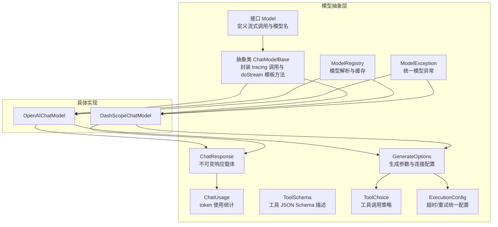
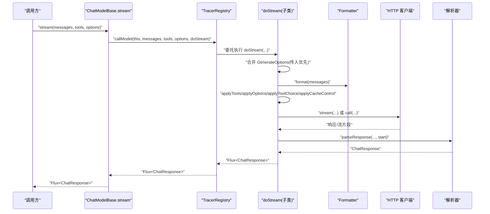
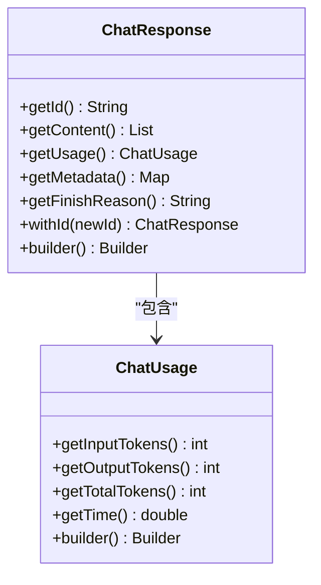
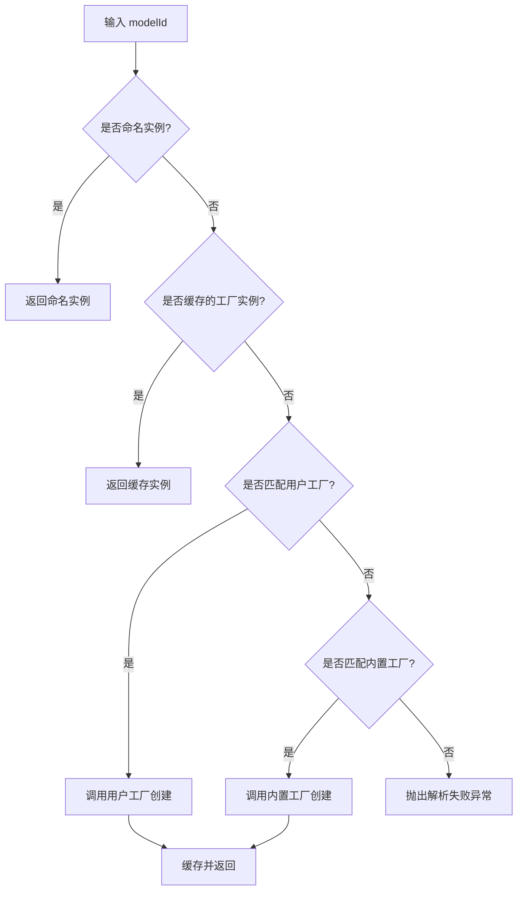
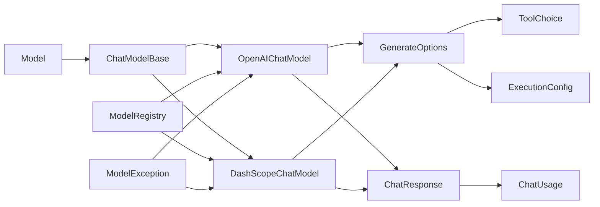

# 模型抽象层

<cite>
**本文引用的文件**
- [Model.java](file://agentscope-core/src/main/java/io/agentscope/core/model/Model.java)
- [ChatModelBase.java](file://agentscope-core/src/main/java/io/agentscope/core/model/ChatModelBase.java)
- [ChatResponse.java](file://agentscope-core/src/main/java/io/agentscope/core/model/ChatResponse.java)
- [GenerateOptions.java](file://agentscope-core/src/main/java/io/agentscope/core/model/GenerateOptions.java)
- [ChatUsage.java](file://agentscope-core/src/main/java/io/agentscope/core/model/ChatUsage.java)
- [ToolSchema.java](file://agentscope-core/src/main/java/io/agentscope/core/model/ToolSchema.java)
- [ToolChoice.java](file://agentscope-core/src/main/java/io/agentscope/core/model/ToolChoice.java)
- [ExecutionConfig.java](file://agentscope-core/src/main/java/io/agentscope/core/model/ExecutionConfig.java)
- [ModelRegistry.java](file://agentscope-core/src/main/java/io/agentscope/core/model/ModelRegistry.java)
- [ModelException.java](file://agentscope-core/src/main/java/io/agentscope/core/model/ModelException.java)
- [OpenAIChatModel.java](file://agentscope-core/src/main/java/io/agentscope/core/model/OpenAIChatModel.java)
- [DashScopeChatModel.java](file://agentscope-core/src/main/java/io/agentscope/core/model/DashScopeChatModel.java)
- [ModelRegistryTest.java](file://agentscope-core/src/test/java/io/agentscope/core/model/ModelRegistryTest.java)
</cite>

## 目录
1. [简介](#简介)
2. [项目结构](#项目结构)
3. [核心组件](#核心组件)
4. [架构总览](#架构总览)
5. [组件详解](#组件详解)
6. [依赖关系分析](#依赖关系分析)
7. [性能考量](#性能考量)
8. [故障排查指南](#故障排查指南)
9. [结论](#结论)
10. [附录：扩展与最佳实践](#附录扩展与最佳实践)

## 简介
本文件面向 AgentScope Java 的“模型抽象层”，系统性阐述 Model 接口的设计理念与统一抽象机制，覆盖流式响应处理、消息格式化、工具集成、响应数据结构与状态管理、生成参数配置与合并策略、以及模型注册与生命周期管理等主题。同时提供扩展指南、自定义实现示例路径、错误处理策略与性能优化建议。

## 项目结构
模型抽象层位于 agentscope-core 模块的 io.agentscope.core.model 包中，围绕接口 Model、基类 ChatModelBase、响应对象 ChatResponse、生成参数 GenerateOptions、工具描述 ToolSchema、工具选择策略 ToolChoice、执行配置 ExecutionConfig、模型注册中心 ModelRegistry、异常 ModelException，以及若干具体模型实现（如 OpenAIChatModel、DashScopeChatModel）协同工作。

图示来源
- [Model.java:22-41](file://agentscope-core/src/main/java/io/agentscope/core/model/Model.java#L22-L41)
- [ChatModelBase.java:29-61](file://agentscope-core/src/main/java/io/agentscope/core/model/ChatModelBase.java#L29-L61)
- [ChatResponse.java:29-207](file://agentscope-core/src/main/java/io/agentscope/core/model/ChatResponse.java#L29-L207)
- [GenerateOptions.java:31-95](file://agentscope-core/src/main/java/io/agentscope/core/model/GenerateOptions.java#L31-L95)
- [ToolSchema.java:28-182](file://agentscope-core/src/main/java/io/agentscope/core/model/ToolSchema.java#L28-L182)
- [ToolChoice.java:45-84](file://agentscope-core/src/main/java/io/agentscope/core/model/ToolChoice.java#L45-L84)
- [ExecutionConfig.java:56-394](file://agentscope-core/src/main/java/io/agentscope/core/model/ExecutionConfig.java#L56-L394)
- [ModelRegistry.java:35-259](file://agentscope-core/src/main/java/io/agentscope/core/model/ModelRegistry.java#L35-L259)
- [OpenAIChatModel.java:58-200](file://agentscope-core/src/main/java/io/agentscope/core/model/OpenAIChatModel.java#L58-L200)
- [DashScopeChatModel.java:52-200](file://agentscope-core/src/main/java/io/agentscope/core/model/DashScopeChatModel.java#L52-L200)

章节来源
- [Model.java:22-41](file://agentscope-core/src/main/java/io/agentscope/core/model/Model.java#L22-L41)
- [ChatModelBase.java:29-61](file://agentscope-core/src/main/java/io/agentscope/core/model/ChatModelBase.java#L29-L61)
- [ModelRegistry.java:35-259](file://agentscope-core/src/main/java/io/agentscope/core/model/ModelRegistry.java#L35-L259)

## 核心组件
- Model 接口：定义统一的流式对话生成入口，负责消息格式化、工具注入与生成选项传递，并返回响应流。
- ChatModelBase 抽象类：提供模板方法模式，封装 tracing 调用与 doStream 实现，子类仅需关注具体协议细节。
- ChatResponse：不可变响应载体，包含内容块、token 使用、元数据与停止原因；提供 Builder 与 withId 扩展。
- GenerateOptions：统一的生成参数与连接配置，支持按字段合并与 Map 类型参数合并，覆盖 API Key、基础 URL、端点路径、模型名、是否流式、采样参数、工具策略、缓存控制、并行工具调用、额外头/体/查询参数等。
- ToolSchema/ToolChoice：以 JSON Schema 描述工具接口，配合 ToolChoice 控制模型是否/何时/如何调用工具。
- ExecutionConfig：统一超时与重试配置，内置模型默认与工具默认策略，支持可插拔重试条件。
- ModelRegistry：基于命名实例、用户工厂与内置工厂的解析与缓存机制，支持环境变量自动创建内置模型。
- ModelException：统一模型异常类型，便于上层捕获与定位。

章节来源
- [ChatResponse.java:29-207](file://agentscope-core/src/main/java/io/agentscope/core/model/ChatResponse.java#L29-L207)
- [GenerateOptions.java:31-95](file://agentscope-core/src/main/java/io/agentscope/core/model/GenerateOptions.java#L31-L95)
- [ToolSchema.java:28-182](file://agentscope-core/src/main/java/io/agentscope/core/model/ToolSchema.java#L28-L182)
- [ToolChoice.java:45-84](file://agentscope-core/src/main/java/io/agentscope/core/model/ToolChoice.java#L45-L84)
- [ExecutionConfig.java:56-394](file://agentscope-core/src/main/java/io/agentscope/core/model/ExecutionConfig.java#L56-L394)
- [ModelRegistry.java:35-259](file://agentscope-core/src/main/java/io/agentscope/core/model/ModelRegistry.java#L35-L259)
- [ModelException.java:22-119](file://agentscope-core/src/main/java/io/agentscope/core/model/ModelException.java#L22-L119)

## 架构总览
下图展示从调用方到具体模型实现的完整链路，包括 tracing、参数合并、格式化、请求构建、调用与解析、以及响应流的组装。

图示来源
- [ChatModelBase.java:42-48](file://agentscope-core/src/main/java/io/agentscope/core/model/ChatModelBase.java#L42-L48)
- [OpenAIChatModel.java:82-179](file://agentscope-core/src/main/java/io/agentscope/core/model/OpenAIChatModel.java#L82-L179)
- [DashScopeChatModel.java:194-200](file://agentscope-core/src/main/java/io/agentscope/core/model/DashScopeChatModel.java#L194-L200)

## 组件详解

### Model 接口与 ChatModelBase 基类
- 设计理念
  - 统一抽象：所有模型均通过 Model.stream 提供一致的流式对话能力，屏蔽底层协议差异。
  - 消息格式化：由具体模型内部使用的 Formatter 负责消息格式转换，确保与不同提供商的 API 兼容。
  - 工具集成：通过 ToolSchema 列表与 ToolChoice 策略，实现函数/工具调用的统一接入。
  - tracing：ChatModelBase 在 stream 中通过 TracerRegistry.callModel 封装调用，便于可观测性。
- ChatModelBase 实现模式
  - 模板方法：stream 作为对外入口，内部调用 TracerRegistry.get().callModel(...)，再委托给子类的 doStream(...)。
  - 子类职责：仅实现 doStream(...)，完成参数合并、格式化、请求构建、调用与解析。
- 通用功能
  - tracing：在启用遥测时自动采集调用信息。
  - 可扩展：子类可覆盖 getModelName() 返回识别信息。

章节来源
- [Model.java:22-41](file://agentscope-core/src/main/java/io/agentscope/core/model/Model.java#L22-L41)
- [ChatModelBase.java:29-61](file://agentscope-core/src/main/java/io/agentscope/core/model/ChatModelBase.java#L29-L61)

### ChatResponse 数据结构与状态管理
- 不可变设计：id、content、usage、metadata、finishReason 一经构造不再变更，保证线程安全与可预测性。
- Builder 模式：提供灵活的构建流程，支持设置各字段并最终生成实例。
- 自动 id：当未显式设置或为空时，自动填充随机 UUID，兼容部分不返回 id 的提供商。
- 状态管理：finishReason 表征停止原因；usage 提供 token 输入/输出与耗时统计，便于成本与性能监控。

图示来源
- [ChatResponse.java:29-207](file://agentscope-core/src/main/java/io/agentscope/core/model/ChatResponse.java#L29-L207)
- [ChatUsage.java:24-139](file://agentscope-core/src/main/java/io/agentscope/core/model/ChatUsage.java#L24-L139)

章节来源
- [ChatResponse.java:29-207](file://agentscope-core/src/main/java/io/agentscope/core/model/ChatResponse.java#L29-L207)
- [ChatUsage.java:24-139](file://agentscope-core/src/main/java/io/agentscope/core/model/ChatUsage.java#L24-L139)

### GenerateOptions 配置选项与参数传递机制
- 字段分类
  - 连接级：apiKey、baseUrl、endpointPath、modelName、stream。
  - 生成参数：temperature、topP、maxTokens、maxCompletionTokens、frequencyPenalty、presencePenalty、thinkingBudget、reasoningEffort、toolChoice、topK、seed、cacheControl、parallelToolCalls。
  - 扩展参数：additionalHeaders、additionalBodyParams、additionalQueryParams。
  - 执行配置：executionConfig（与 ExecutionConfig 协作）。
- 参数合并策略
  - 逐字段优先级：primary != null ? primary : fallback。
  - Map 类型字段：先放入 fallback，再以 primary 覆盖，形成“主优先”的合并结果。
- 使用场景
  - 默认配置与请求级配置分层：通过 mergeOptions 合并，实现“请求级覆盖默认”的行为。
  - 与工具集成：结合 ToolChoice 控制工具调用策略；cacheControl 可触发格式化器对消息添加缓存提示。

章节来源
- [GenerateOptions.java:31-95](file://agentscope-core/src/main/java/io/agentscope/core/model/GenerateOptions.java#L31-L95)
- [GenerateOptions.java:423-484](file://agentscope-core/src/main/java/io/agentscope/core/model/GenerateOptions.java#L423-L484)

### 工具集成：ToolSchema 与 ToolChoice
- ToolSchema：以 JSON Schema 描述工具名称、描述、参数与输出模式，严格模式可选。
- ToolChoice：定义工具调用策略
  - Auto：由模型决定是否调用及调用哪些工具。
  - None：禁止工具调用。
  - Required：强制至少一次工具调用。
  - Specific(toolName)：强制调用指定工具。
- 传递机制
  - 通过 GenerateOptions 的 toolChoice 字段传递策略。
  - 通过 ToolSchema 列表传递工具定义，由格式化器应用到请求。

章节来源
- [ToolSchema.java:28-182](file://agentscope-core/src/main/java/io/agentscope/core/model/ToolSchema.java#L28-L182)
- [ToolChoice.java:45-84](file://agentscope-core/src/main/java/io/agentscope/core/model/ToolChoice.java#L45-L84)
- [GenerateOptions.java:48-82](file://agentscope-core/src/main/java/io/agentscope/core/model/GenerateOptions.java#L48-L82)

### 执行配置：ExecutionConfig
- 统一超时与重试：timeout、maxAttempts、initialBackoff、maxBackoff、backoffMultiplier、retryOn。
- 内置默认
  - MODEL_DEFAULTS：较长超时与适度重试，适合模型 API。
  - TOOL_DEFAULTS：较短超时且无重试，适合工具调用。
- 合并策略：逐字段优先，支持多层级合并（请求 > 组件 > 默认 > 系统）。
- 错误判定：内置 RETRYABLE_ERRORS，覆盖限流、服务端错误、超时、网络 IO 等。

章节来源
- [ExecutionConfig.java:56-394](file://agentscope-core/src/main/java/io/agentscope/core/model/ExecutionConfig.java#L56-L394)

### 模型注册与解析：ModelRegistry
- 解析顺序
  - 命名实例优先（精确匹配）。
  - 缓存的工厂实例复用。
  - 用户工厂（新注册优先于旧注册）。
  - 内置工厂（openai、dashscope、gemini、anthropic、ollama）。
- 自动创建
  - 通过环境变量（如 OPENAI_API_KEY、DASHSCOPE_API_KEY、OLLAMA_BASE_URL）自动创建内置模型。
- 缓存与重置
  - 工厂创建结果缓存，避免重复创建。
  - 提供 reset() 用于测试与隔离。

图示来源
- [ModelRegistry.java:142-173](file://agentscope-core/src/main/java/io/agentscope/core/model/ModelRegistry.java#L142-L173)

章节来源
- [ModelRegistry.java:35-259](file://agentscope-core/src/main/java/io/agentscope/core/model/ModelRegistry.java#L35-L259)
- [ModelRegistryTest.java:44-119](file://agentscope-core/src/test/java/io/agentscope/core/model/ModelRegistryTest.java#L44-L119)

### 具体模型实现示例：OpenAIChatModel 与 DashScopeChatModel
- OpenAIChatModel
  - 通过 OpenAIClient 与 OpenAIChatFormatter/DeepSeek/GLM 等格式化器协作。
  - 支持流式与非流式，自动注入 stream_options 以获取 usage。
  - 支持工具调用、工具选择策略、缓存控制、超时与重试。
- DashScopeChatModel
  - 自动端点路由（文本/多模态），支持思考模式（强制流式）。
  - 支持搜索增强、加密传输等高级特性。
  - 通过 GenerateOptions 与 Formatter 协同完成请求构建与解析。

章节来源
- [OpenAIChatModel.java:58-200](file://agentscope-core/src/main/java/io/agentscope/core/model/OpenAIChatModel.java#L58-L200)
- [DashScopeChatModel.java:52-200](file://agentscope-core/src/main/java/io/agentscope/core/model/DashScopeChatModel.java#L52-L200)

## 依赖关系分析
- 接口与基类
  - Model 定义对外契约；ChatModelBase 提供模板方法与 tracing。
- 响应与统计
  - ChatResponse 依赖 ChatUsage；二者共同承载响应与用量信息。
- 参数与策略
  - GenerateOptions 聚合 ToolChoice、ExecutionConfig、工具 Schema 与扩展参数。
- 注册与解析
  - ModelRegistry 依赖环境变量与内置工厂规则，支持用户工厂覆盖。
- 异常体系
  - ModelException 作为统一异常类型，便于上层捕获与日志记录。

图示来源
- [Model.java:22-41](file://agentscope-core/src/main/java/io/agentscope/core/model/Model.java#L22-L41)
- [ChatModelBase.java:29-61](file://agentscope-core/src/main/java/io/agentscope/core/model/ChatModelBase.java#L29-L61)
- [OpenAIChatModel.java:58-200](file://agentscope-core/src/main/java/io/agentscope/core/model/OpenAIChatModel.java#L58-L200)
- [DashScopeChatModel.java:52-200](file://agentscope-core/src/main/java/io/agentscope/core/model/DashScopeChatModel.java#L52-L200)
- [GenerateOptions.java:31-95](file://agentscope-core/src/main/java/io/agentscope/core/model/GenerateOptions.java#L31-L95)
- [ChatResponse.java:29-207](file://agentscope-core/src/main/java/io/agentscope/core/model/ChatResponse.java#L29-L207)
- [ChatUsage.java:24-139](file://agentscope-core/src/main/java/io/agentscope/core/model/ChatUsage.java#L24-L139)
- [ToolChoice.java:45-84](file://agentscope-core/src/main/java/io/agentscope/core/model/ToolChoice.java#L45-L84)
- [ExecutionConfig.java:56-394](file://agentscope-core/src/main/java/io/agentscope/core/model/ExecutionConfig.java#L56-L394)
- [ModelRegistry.java:35-259](file://agentscope-core/src/main/java/io/agentscope/core/model/ModelRegistry.java#L35-L259)
- [ModelException.java:22-119](file://agentscope-core/src/main/java/io/agentscope/core/model/ModelException.java#L22-L119)

## 性能考量
- 流式响应
  - 优先使用流式模式以降低首字节延迟，提升交互体验；非流式模式会阻塞等待完整响应。
- 超时与重试
  - 使用 ExecutionConfig 针对高并发场景设置合理的初始回退与最大回退，避免雪崩。
  - 对于工具调用，采用较短超时与无重试策略，减少长尾阻塞。
- 缓存控制
  - 启用 cacheControl 可显著降低重复提示的成本与延迟（需提供商支持）。
- 并行工具调用
  - parallelToolCalls 可提升工具执行吞吐，但需评估后端并发限制。
- 端点与格式化
  - 选择合适的格式化器与端点（如 DashScope 的多模态端点），避免不必要的转换开销。

## 故障排查指南
- 解析失败
  - 当 modelId 无法解析时，ModelRegistry 会抛出带帮助信息的异常，检查命名、正则匹配与环境变量。
- 认证失败
  - 确认 apiKey 是否正确设置；内置工厂依赖标准环境变量。
- 请求参数错误
  - 400 类错误通常为参数校验失败，检查 ToolSchema、参数类型与范围。
- 限流与网络异常
  - 429/5xx 与网络 IO 异常会被视为可重试；可通过 ExecutionConfig.retryOn 自定义策略。
- 响应缺失 id
  - 若提供商未返回 id，ChatResponse.Builder 会自动生成 UUID，不影响后续处理。

章节来源
- [ModelRegistry.java:244-258](file://agentscope-core/src/main/java/io/agentscope/core/model/ModelRegistry.java#L244-L258)
- [ExecutionConfig.java:101-134](file://agentscope-core/src/main/java/io/agentscope/core/model/ExecutionConfig.java#L101-L134)
- [ChatResponse.java:198-206](file://agentscope-core/src/main/java/io/agentscope/core/model/ChatResponse.java#L198-L206)
- [ModelException.java:22-119](file://agentscope-core/src/main/java/io/agentscope/core/model/ModelException.java#L22-L119)

## 结论
AgentScope Java 的模型抽象层通过清晰的接口与基类、统一的参数与响应模型、可插拔的格式化器与执行配置，实现了跨提供商的一致体验。借助 ModelRegistry 的解析与缓存机制，开发者可以快速接入多种模型；通过 GenerateOptions 与 ToolChoice 的组合，能够灵活控制生成行为与工具调用策略。配合 tracing、超时与重试、缓存控制等机制，可在复杂生产环境中获得稳定、可观测且高性能的推理能力。

## 附录：扩展与最佳实践

### 扩展指南
- 新增模型实现
  - 继承 ChatModelBase，实现 doStream(...)，完成以下步骤：
    - 合并 GenerateOptions（传入优先于已配置）。
    - 使用格式化器进行消息格式化与工具/选项应用。
    - 选择流式或非流式调用，解析响应为 ChatResponse。
    - 应用超时与重试（可复用 ModelUtils.applyTimeoutAndRetry）。
  - 示例参考路径：
    - [OpenAIChatModel.doStream0:93-179](file://agentscope-core/src/main/java/io/agentscope/core/model/OpenAIChatModel.java#L93-L179)
    - [DashScopeChatModel.doStream:194-200](file://agentscope-core/src/main/java/io/agentscope/core/model/DashScopeChatModel.java#L194-L200)
- 新增格式化器
  - 实现 Provider 特定的消息格式化与反格式化逻辑，确保与请求 DTO/响应 DTO 的映射正确。
- 新增工具 Schema
  - 使用 ToolSchema.builder() 构建工具描述，确保参数与输出模式符合 JSON Schema 规范。
- 新增执行配置
  - 使用 ExecutionConfig.builder() 配置超时、重试次数与回退策略，必要时自定义 retryOn 条件。

### 最佳实践
- 参数与配置
  - 将默认配置与请求级配置分离，使用 GenerateOptions.mergeOptions 实现分层覆盖。
  - 对工具调用使用明确的 ToolChoice，避免歧义。
- 生命周期与资源清理
  - 使用 ModelRegistry.register(...) 注册单例模型实例，避免重复创建。
  - 对于需要关闭的客户端或连接，结合 Spring/微框架的生命周期回调进行资源回收。
- 错误处理
  - 捕获 ModelException 并记录 modelName 与 provider，便于定位问题。
  - 对可重试错误使用 ExecutionConfig.retryOn，避免对永久性错误进行无意义重试。
- 性能优化
  - 优先使用流式响应；合理设置超时与回退，避免长时间阻塞。
  - 启用 cacheControl 与并行工具调用，平衡成本与性能。