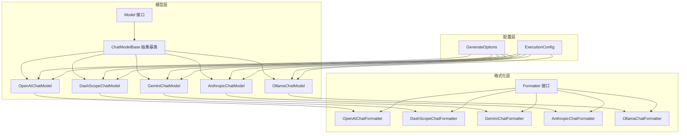
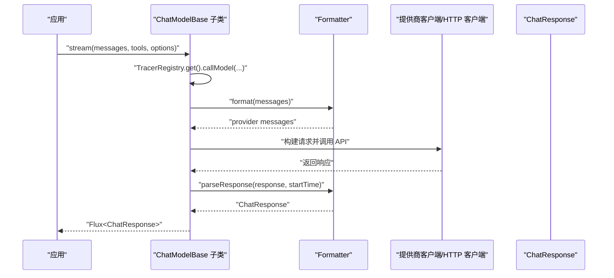
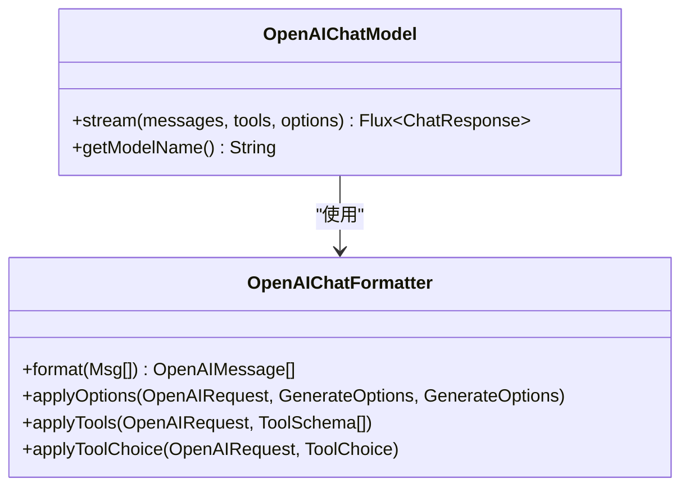
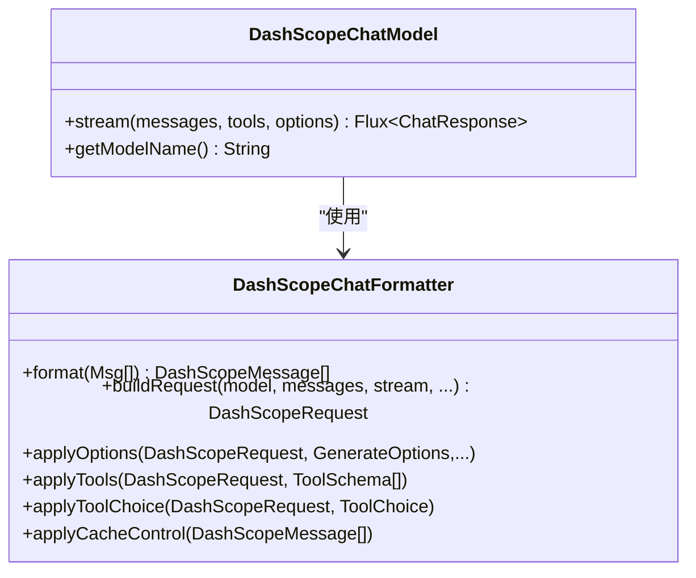
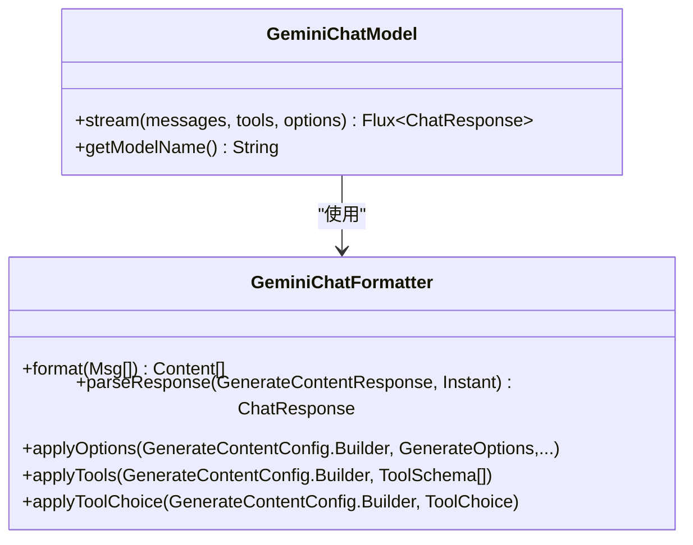
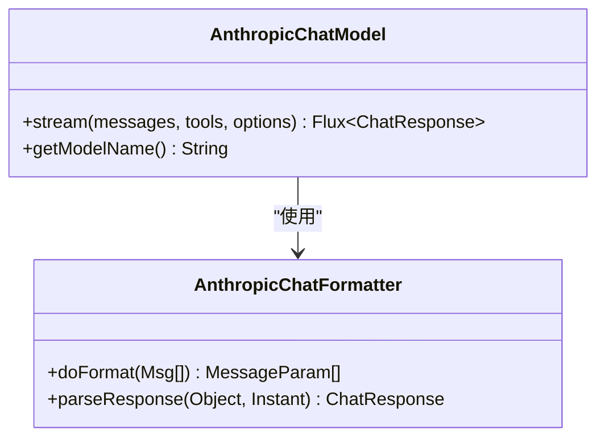
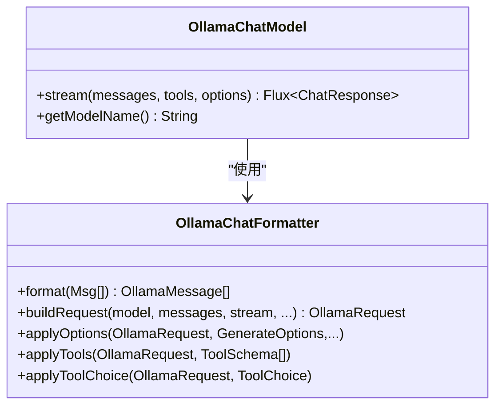
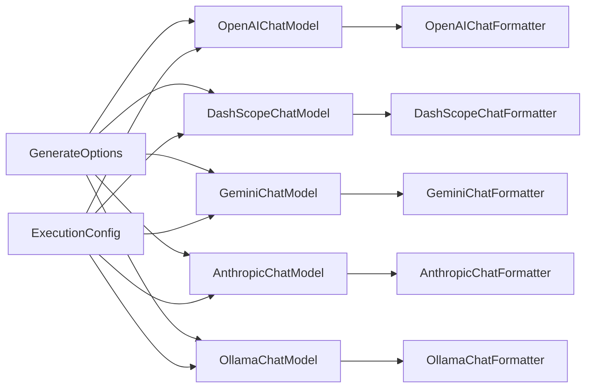

# 模型集成

<cite>
**本文引用的文件**
- [Model.java](file://agentscope-core/src/main/java/io/agentscope/core/model/Model.java)
- [Formatter.java](file://agentscope-core/src/main/java/io/agentscope/core/formatter/Formatter.java)
- [ExecutionConfig.java](file://agentscope-core/src/main/java/io/agentscope/core/model/ExecutionConfig.java)
- [GenerateOptions.java](file://agentscope-core/src/main/java/io/agentscope/core/model/GenerateOptions.java)
- [ChatModelBase.java](file://agentscope-core/src/main/java/io/agentscope/core/model/ChatModelBase.java)
- [OpenAIChatModel.java](file://agentscope-core/src/main/java/io/agentscope/core/model/OpenAIChatModel.java)
- [DashScopeChatModel.java](file://agentscope-core/src/main/java/io/agentscope/core/model/DashScopeChatModel.java)
- [GeminiChatModel.java](file://agentscope-core/src/main/java/io/agentscope/core/model/GeminiChatModel.java)
- [OllamaChatModel.java](file://agentscope-core/src/main/java/io/agentscope/core/model/OllamaChatModel.java)
- [AnthropicChatModel.java](file://agentscope-core/src/main/java/io/agentscope/core/model/AnthropicChatModel.java)
- [OpenAIChatFormatter.java](file://agentscope-core/src/main/java/io/agentscope/core/formatter/openai/OpenAIChatFormatter.java)
- [DashScopeChatFormatter.java](file://agentscope-core/src/main/java/io/agentscope/core/formatter/dashscope/DashScopeChatFormatter.java)
- [GeminiChatFormatter.java](file://agentscope-core/src/main/java/io/agentscope/core/formatter/gemini/GeminiChatFormatter.java)
- [AnthropicChatFormatter.java](file://agentscope-core/src/main/java/io/agentscope/core/formatter/anthropic/AnthropicChatFormatter.java)
- [OllamaChatFormatter.java](file://agentscope-core/src/main/java/io/agentscope/core/formatter/ollama/OllamaChatFormatter.java)
</cite>

## 目录
1. [简介](#简介)
2. [项目结构](#项目结构)
3. [核心组件](#核心组件)
4. [架构总览](#架构总览)
5. [详细组件分析](#详细组件分析)
6. [依赖关系分析](#依赖关系分析)
7. [性能考量](#性能考量)
8. [故障排查指南](#故障排查指南)
9. [结论](#结论)
10. [附录](#附录)

## 简介
本技术文档面向 AgentScope Java 的模型集成体系，系统阐述 Model 接口的设计理念与统一抽象，以及对 OpenAI、DashScope、Gemini、Anthropic、Ollama 等多提供商的支持方式；详解格式化器（Formatter）在消息转换与多模态支持中的作用；说明执行配置（ExecutionConfig）、生成选项（GenerateOptions）与模型参数的设置方法；提供模型选择的决策指南与性能对比；并覆盖模型切换、负载均衡与故障转移的实现思路，以及结构化输出、流式处理与批量请求等高级能力。

## 项目结构
AgentScope 将“模型”抽象与“消息格式化”解耦：Model 定义统一接口，各提供商通过各自的 ChatModel 实现对接；Formatter 负责将 AgentScope 的 Msg 对象转换为各提供商的请求体，并解析响应为统一的 ChatResponse。执行配置与生成选项集中管理超时、重试、采样参数、工具调用、缓存控制等横切关注点。

图表来源
- [Model.java:22-41](file://agentscope-core/src/main/java/io/agentscope/core/model/Model.java#L22-L41)
- [ChatModelBase.java:29-61](file://agentscope-core/src/main/java/io/agentscope/core/model/ChatModelBase.java#L29-L61)
- [OpenAIChatModel.java:58-80](file://agentscope-core/src/main/java/io/agentscope/core/model/OpenAIChatModel.java#L58-L80)
- [DashScopeChatModel.java:52-66](file://agentscope-core/src/main/java/io/agentscope/core/model/DashScopeChatModel.java#L52-L66)
- [GeminiChatModel.java:55-71](file://agentscope-core/src/main/java/io/agentscope/core/model/GeminiChatModel.java#L55-L71)
- [OllamaChatModel.java:53-60](file://agentscope-core/src/main/java/io/agentscope/core/model/OllamaChatModel.java#L53-L60)
- [AnthropicChatModel.java:53-64](file://agentscope-core/src/main/java/io/agentscope/core/model/AnthropicChatModel.java#L53-L64)
- [Formatter.java:45-135](file://agentscope-core/src/main/java/io/agentscope/core/formatter/Formatter.java#L45-L135)
- [OpenAIChatFormatter.java:46-52](file://agentscope-core/src/main/java/io/agentscope/core/formatter/openai/OpenAIChatFormatter.java#L46-L52)
- [DashScopeChatFormatter.java:42-55](file://agentscope-core/src/main/java/io/agentscope/core/formatter/dashscope/DashScopeChatFormatter.java#L42-L55)
- [GeminiChatFormatter.java:52-67](file://agentscope-core/src/main/java/io/agentscope/core/formatter/gemini/GeminiChatFormatter.java#L52-L67)
- [AnthropicChatFormatter.java:37-42](file://agentscope-core/src/main/java/io/agentscope/core/formatter/anthropic/AnthropicChatFormatter.java#L37-L42)
- [OllamaChatFormatter.java:51-70](file://agentscope-core/src/main/java/io/agentscope/core/formatter/ollama/OllamaChatFormatter.java#L51-L70)
- [GenerateOptions.java:31-95](file://agentscope-core/src/main/java/io/agentscope/core/model/GenerateOptions.java#L31-L95)
- [ExecutionConfig.java:56-179](file://agentscope-core/src/main/java/io/agentscope/core/model/ExecutionConfig.java#L56-L179)

章节来源
- [Model.java:22-41](file://agentscope-core/src/main/java/io/agentscope/core/model/Model.java#L22-L41)
- [Formatter.java:26-44](file://agentscope-core/src/main/java/io/agentscope/core/formatter/Formatter.java#L26-L44)
- [GenerateOptions.java:31-95](file://agentscope-core/src/main/java/io/agentscope/core/model/GenerateOptions.java#L31-L95)
- [ExecutionConfig.java:27-55](file://agentscope-core/src/main/java/io/agentscope/core/model/ExecutionConfig.java#L27-L55)

## 核心组件
- Model 接口：定义统一的流式对话调用入口，屏蔽提供商差异，返回统一的 ChatResponse 流。
- ChatModelBase 抽象类：封装通用的 tracing 与超时/重试逻辑，子类仅需实现 doStream。
- Formatter 接口：负责 Msg 与提供商请求/响应类型的双向转换，以及生成参数、工具、工具选择、缓存控制等应用。
- GenerateOptions：统一承载连接级（apiKey/baseUrl/modelName/endpointPath/stream）与生成级（温度、采样、惩罚、最大 token、思维预算、推理努力、并行工具调用、额外头/体/查询参数、工具选择、执行配置等）参数。
- ExecutionConfig：统一超时、最大尝试次数、指数退避的重试策略与可配置的错误过滤器。

章节来源
- [Model.java:22-41](file://agentscope-core/src/main/java/io/agentscope/core/model/Model.java#L22-L41)
- [ChatModelBase.java:29-61](file://agentscope-core/src/main/java/io/agentscope/core/model/ChatModelBase.java#L29-L61)
- [Formatter.java:45-135](file://agentscope-core/src/main/java/io/agentscope/core/formatter/Formatter.java#L45-L135)
- [GenerateOptions.java:31-95](file://agentscope-core/src/main/java/io/agentscope/core/model/GenerateOptions.java#L31-L95)
- [ExecutionConfig.java:56-179](file://agentscope-core/src/main/java/io/agentscope/core/model/ExecutionConfig.java#L56-L179)

## 架构总览
下图展示了从 AgentScope 消息到各提供商 API 的端到端调用链路，以及格式化器在其中的关键作用。

图表来源
- [ChatModelBase.java:42-60](file://agentscope-core/src/main/java/io/agentscope/core/model/ChatModelBase.java#L42-L60)
- [Formatter.java:53-62](file://agentscope-core/src/main/java/io/agentscope/core/formatter/Formatter.java#L53-L62)
- [OpenAIChatModel.java:82-179](file://agentscope-core/src/main/java/io/agentscope/core/model/OpenAIChatModel.java#L82-L179)
- [DashScopeChatModel.java:194-315](file://agentscope-core/src/main/java/io/agentscope/core/model/DashScopeChatModel.java#L194-L315)
- [GeminiChatModel.java:224-311](file://agentscope-core/src/main/java/io/agentscope/core/model/GeminiChatModel.java#L224-L311)
- [AnthropicChatModel.java:124-211](file://agentscope-core/src/main/java/io/agentscope/core/model/AnthropicChatModel.java#L124-L211)
- [OllamaChatModel.java:135-233](file://agentscope-core/src/main/java/io/agentscope/core/model/OllamaChatModel.java#L135-L233)

## 详细组件分析

### 统一接口与抽象基类
- Model 接口：定义 stream(List<Msg>, List<ToolSchema>, GenerateOptions) 返回 Flux<ChatResponse>，并提供 getModelName() 用于日志与识别。
- ChatModelBase：在 doStream 前后封装 TracerRegistry 调用，确保统一的遥测与可观测性；子类只需实现 doStream 即可。

章节来源
- [Model.java:22-41](file://agentscope-core/src/main/java/io/agentscope/core/model/Model.java#L22-L41)
- [ChatModelBase.java:29-61](file://agentscope-core/src/main/java/io/agentscope/core/model/ChatModelBase.java#L29-L61)

### OpenAI 集成
- 模型实现：OpenAIChatModel 使用 OpenAI HTTP 客户端，支持流式与非流式、工具调用、缓存控制、多提供商格式化器（如 DeepSeek、GLM）。
- 关键流程：
  - 合并 GenerateOptions（以调用参数优先于构建时默认值）。
  - 通过 Formatter 将 Msg 转换为 OpenAIMessage 列表。
  - 构建 OpenAIRequest（含 streamOptions 以保证使用统计可用）。
  - 应用工具与工具选择、缓存控制（当启用且为 OpenAIBaseFormatter）。
  - 调用 OpenAIClient 并映射为 ChatResponse。
- 执行配置：通过 ModelUtils.applyTimeoutAndRetry 应用 ExecutionConfig（默认 MODEL_DEFAULTS）。

图表来源
- [OpenAIChatModel.java:58-189](file://agentscope-core/src/main/java/io/agentscope/core/model/OpenAIChatModel.java#L58-L189)
- [OpenAIChatFormatter.java:46-278](file://agentscope-core/src/main/java/io/agentscope/core/formatter/openai/OpenAIChatFormatter.java#L46-L278)

章节来源
- [OpenAIChatModel.java:58-189](file://agentscope-core/src/main/java/io/agentscope/core/model/OpenAIChatModel.java#L58-L189)
- [OpenAIChatFormatter.java:46-278](file://agentscope-core/src/main/java/io/agentscope/core/formatter/openai/OpenAIChatFormatter.java#L46-L278)

### DashScope 集成
- 模型实现：DashScopeChatModel 支持文本与视觉模型自动路由、思考模式（enableThinking）、搜索增强（enableSearch）、加密传输（RSA 公钥拉取与 AES-GCM 加密）。
- 关键流程：
  - 自动判断是否为多模态模型并选择相应格式化器（DashScopeChatFormatter 或 DashScopeMultiAgentFormatter）。
  - 构建 DashScopeRequest，应用参数、工具、工具选择、思考模式与缓存控制。
  - 通过 DashScopeHttpClient 发起流式或非流式调用。
- 执行配置：applyTimeoutAndRetry 应用默认 MODEL_DEFAULTS。

图表来源
- [DashScopeChatModel.java:52-355](file://agentscope-core/src/main/java/io/agentscope/core/model/DashScopeChatModel.java#L52-L355)
- [DashScopeChatFormatter.java:42-208](file://agentscope-core/src/main/java/io/agentscope/core/formatter/dashscope/DashScopeChatFormatter.java#L42-L208)

章节来源
- [DashScopeChatModel.java:52-355](file://agentscope-core/src/main/java/io/agentscope/core/model/DashScopeChatModel.java#L52-L355)
- [DashScopeChatFormatter.java:42-208](file://agentscope-core/src/main/java/io/agentscope/core/formatter/dashscope/DashScopeChatFormatter.java#L42-L208)

### Gemini 集成
- 模型实现：GeminiChatModel 使用官方 Google GenAI Java SDK，支持工具调用、多代理历史合并、多模态（图像/音频/视频）、思考模式（ThinkingConfig）。
- 关键流程：
  - 通过 GeminiChatFormatter 将 Msg 转换为 Content，Apply 生成参数与工具配置。
  - 选择流式或非流式 API，解析响应为 ChatResponse。
- 执行配置：通过 ModelUtils.applyTimeoutAndRetry 应用默认 MODEL_DEFAULTS。

图表来源
- [GeminiChatModel.java:55-316](file://agentscope-core/src/main/java/io/agentscope/core/model/GeminiChatModel.java#L55-L316)
- [GeminiChatFormatter.java:52-209](file://agentscope-core/src/main/java/io/agentscope/core/formatter/gemini/GeminiChatFormatter.java#L52-L209)

章节来源
- [GeminiChatModel.java:55-316](file://agentscope-core/src/main/java/io/agentscope/core/model/GeminiChatModel.java#L55-L316)
- [GeminiChatFormatter.java:52-209](file://agentscope-core/src/main/java/io/agentscope/core/formatter/gemini/GeminiChatFormatter.java#L52-L209)

### Anthropic 集成
- 模型实现：AnthropicChatModel 使用官方 Anthropic Java SDK，支持工具调用、流式与非流式、系统消息特殊处理（system 参数）、扩展思考特性。
- 关键流程：
  - 通过 AnthropicChatFormatter 提取系统消息并应用到 MessageCreateParams。
  - 格式化消息列表，应用生成参数、工具与工具选择。
  - 流式/非流式调用，解析事件/响应为 ChatResponse。
- 执行配置：applyTimeoutAndRetry 应用默认 MODEL_DEFAULTS。

图表来源
- [AnthropicChatModel.java:53-221](file://agentscope-core/src/main/java/io/agentscope/core/model/AnthropicChatModel.java#L53-L221)
- [AnthropicChatFormatter.java:37-52](file://agentscope-core/src/main/java/io/agentscope/core/formatter/anthropic/AnthropicChatFormatter.java#L37-L52)

章节来源
- [AnthropicChatModel.java:53-221](file://agentscope-core/src/main/java/io/agentscope/core/model/AnthropicChatModel.java#L53-L221)
- [AnthropicChatFormatter.java:37-52](file://agentscope-core/src/main/java/io/agentscope/core/formatter/anthropic/AnthropicChatFormatter.java#L37-L52)

### Ollama 集成
- 模型实现：OllamaChatModel 适配本地 Ollama 实例，支持工具调用、多模态（图片）、流式与非流式、OllamaOptions 与 GenerateOptions 双通道配置。
- 关键流程：
  - 通过 OllamaChatFormatter/OllamaMultiAgentFormatter 格式化消息与工具。
  - 构建 OllamaRequest，应用 OllamaOptions/GenerateOptions，处理工具调用与工具选择。
  - 通过 OllamaHttpClient 发起流式/非流式调用，解析响应。
- 执行配置：将 OllamaOptions 合并为 GenerateOptions 后应用默认 MODEL_DEFAULTS。

图表来源
- [OllamaChatModel.java:53-233](file://agentscope-core/src/main/java/io/agentscope/core/model/OllamaChatModel.java#L53-L233)
- [OllamaChatFormatter.java:51-474](file://agentscope-core/src/main/java/io/agentscope/core/formatter/ollama/OllamaChatFormatter.java#L51-L474)

章节来源
- [OllamaChatModel.java:53-233](file://agentscope-core/src/main/java/io/agentscope/core/model/OllamaChatModel.java#L53-L233)
- [OllamaChatFormatter.java:51-474](file://agentscope-core/src/main/java/io/agentscope/core/formatter/ollama/OllamaChatFormatter.java#L51-L474)

### 格式化器（Formatter）设计与多模态支持
- 设计理念：Formatter<TReq, TResp, TParams> 将 AgentScope 的 Msg 与 ChatResponse 映射到各提供商的请求/响应类型；同时负责：
  - 生成参数应用（温度、topP、频率/存在惩罚、最大 token、思维预算、推理努力、并行工具调用、额外头/体/查询参数等）
  - 工具与工具选择的应用（兼容不同提供商的严格模式、工具选择枚举）
  - 多模态内容的转换（文本、图像、工具结果等）
  - 缓存控制（如 DashScope 的 cache_control）
- 多模态支持：
  - OpenAI：根据消息是否包含媒体决定是否使用多模态格式。
  - DashScope：显式区分文本与多模态 API，提供 formatMultiModal。
  - Gemini：将系统消息转换为用户角色内容，工具结果独立为用户角色内容，支持思考标记。
  - Anthropic：系统消息通过 system 参数传递，工具结果需单独用户消息。
  - Ollama：支持图片转 base64，工具结果可提升为用户消息以便模型理解。

章节来源
- [Formatter.java:26-135](file://agentscope-core/src/main/java/io/agentscope/core/formatter/Formatter.java#L26-L135)
- [OpenAIChatFormatter.java:46-278](file://agentscope-core/src/main/java/io/agentscope/core/formatter/openai/OpenAIChatFormatter.java#L46-L278)
- [DashScopeChatFormatter.java:42-208](file://agentscope-core/src/main/java/io/agentscope/core/formatter/dashscope/DashScopeChatFormatter.java#L42-L208)
- [GeminiChatFormatter.java:52-209](file://agentscope-core/src/main/java/io/agentscope/core/formatter/gemini/GeminiChatFormatter.java#L52-L209)
- [AnthropicChatFormatter.java:37-52](file://agentscope-core/src/main/java/io/agentscope/core/formatter/anthropic/AnthropicChatFormatter.java#L37-L52)
- [OllamaChatFormatter.java:51-474](file://agentscope-core/src/main/java/io/agentscope/core/formatter/ollama/OllamaChatFormatter.java#L51-L474)

### 执行配置与生成选项
- ExecutionConfig：
  - 统一超时、最大尝试次数、初始/最大退避、退避倍数与错误过滤器（RETRYABLE_ERRORS）。
  - 默认模型调用策略（较长初始/最大退避以应对高并发限流），工具调用默认不重试。
  - 合并策略：逐字段优先级合并，支持按层级叠加（请求 > 代理级别 > 组件默认 > 系统默认）。
- GenerateOptions：
  - 连接级：apiKey、baseUrl、endpointPath、modelName、stream。
  - 生成级：temperature、topP、maxTokens、maxCompletionTokens、frequencyPenalty、presencePenalty、thinkingBudget、reasoningEffort、seed、topK、parallelToolCalls、cacheControl、additionalHeaders/body/query params、toolChoice、executionConfig。
  - 合并策略：逐字段优先级合并，Map 类型采用“回退 + 主值覆盖”的合并方式。

章节来源
- [ExecutionConfig.java:56-297](file://agentscope-core/src/main/java/io/agentscope/core/model/ExecutionConfig.java#L56-L297)
- [GenerateOptions.java:31-484](file://agentscope-core/src/main/java/io/agentscope/core/model/GenerateOptions.java#L31-484)

### 结构化输出、流式处理与批量请求
- 结构化输出：通过 ResponseFormat 或提供商特定的 response_format 字段（如 OpenAIChatFormatter 中的 applyAdditionalBodyParams）实现。
- 流式处理：所有模型均返回 Flux<ChatResponse>，支持增量响应；非流式模式通过 defer + subscribeOn 弹出至弹性线程池。
- 批量请求：可通过多个模型实例并行发起请求，结合 Reactor 的 zip/merge 等组合操作实现；注意控制并发与资源限制。

章节来源
- [OpenAIChatFormatter.java:228-276](file://agentscope-core/src/main/java/io/agentscope/core/formatter/openai/OpenAIChatFormatter.java#L228-L276)
- [OpenAIChatModel.java:153-178](file://agentscope-core/src/main/java/io/agentscope/core/model/OpenAIChatModel.java#L153-L178)
- [DashScopeChatModel.java:283-314](file://agentscope-core/src/main/java/io/agentscope/core/model/DashScopeChatModel.java#L283-L314)
- [GeminiChatModel.java:263-301](file://agentscope-core/src/main/java/io/agentscope/core/model/GeminiChatModel.java#L263-L301)
- [AnthropicChatModel.java:166-197](file://agentscope-core/src/main/java/io/agentscope/core/model/AnthropicChatModel.java#L166-L197)
- [OllamaChatModel.java:188-223](file://agentscope-core/src/main/java/io/agentscope/core/model/OllamaChatModel.java#L188-L223)

### 模型选择与性能对比（概念性指导）
- OpenAI：生态成熟、工具调用完善、支持严格模式；适合通用对话与复杂工具编排。
- DashScope：阿里云生态内具备多模态与思考模式；支持加密传输；适合国内合规场景。
- Gemini：与 Google 生态深度整合，支持思考模式与多模态；适合需要与 Vertex AI/Cloud 集成的场景。
- Anthropic：原生支持系统消息与扩展思考；适合需要强推理与可控思考过程的场景。
- Ollama：本地部署、低延迟、成本可控；适合私有化与边缘场景。

（本节为概念性指导，不直接分析具体代码文件）

## 依赖关系分析
- 模型到格式化器：各 ChatModel 通过各自 Formatter 完成消息与参数的提供商适配。
- 配置到模型：GenerateOptions 与 ExecutionConfig 在 ChatModelBase.doStream 前后被合并与应用。
- 执行配置到模型：ModelUtils.applyTimeoutAndRetry 将 ExecutionConfig 应用于实际调用。

图表来源
- [OpenAIChatModel.java:82-91](file://agentscope-core/src/main/java/io/agentscope/core/model/OpenAIChatModel.java#L82-L91)
- [DashScopeChatModel.java:209-212](file://agentscope-core/src/main/java/io/agentscope/core/model/DashScopeChatModel.java#L209-L212)
- [GeminiChatModel.java:224-234](file://agentscope-core/src/main/java/io/agentscope/core/model/GeminiChatModel.java#L224-L234)
- [AnthropicChatModel.java:124-133](file://agentscope-core/src/main/java/io/agentscope/core/model/AnthropicChatModel.java#L124-L133)
- [OllamaChatModel.java:135-144](file://agentscope-core/src/main/java/io/agentscope/core/model/OllamaChatModel.java#L135-L144)

章节来源
- [OpenAIChatModel.java:82-91](file://agentscope-core/src/main/java/io/agentscope/core/model/OpenAIChatModel.java#L82-L91)
- [DashScopeChatModel.java:209-212](file://agentscope-core/src/main/java/io/agentscope/core/model/DashScopeChatModel.java#L209-L212)
- [GeminiChatModel.java:224-234](file://agentscope-core/src/main/java/io/agentscope/core/model/GeminiChatModel.java#L224-L234)
- [AnthropicChatModel.java:124-133](file://agentscope-core/src/main/java/io/agentscope/core/model/AnthropicChatModel.java#L124-L133)
- [OllamaChatModel.java:135-144](file://agentscope-core/src/main/java/io/agentscope/core/model/OllamaChatModel.java#L135-L144)

## 性能考量
- 超时与重试：默认模型调用采用较高初始/最大退避以应对限流；工具调用默认不重试以避免副作用。
- 流式优先：在高并发与长尾响应场景，优先使用流式以降低首字节延迟与内存占用。
- 缓存控制：启用 cache_control 可减少重复提示的往返开销（DashScope 等支持）。
- 并行工具调用：开启 parallelToolCalls 可提升工具执行吞吐（OpenAI 等支持）。
- 线程调度：非流式调用通过 boundedElastic 线程池隔离外部阻塞调用。

（本节为通用指导，不直接分析具体代码文件）

## 故障排查指南
- 错误分类与重试：
  - 429/5xx/超时/网络异常：默认可重试。
  - 400/鉴权/授权失败：默认不可重试。
  - 包装异常：递归检查 cause 直到可判定。
- 常见问题定位：
  - 模型名缺失：OpenAIChatModel 在 doStream0 中校验 modelName 必填。
  - 思考模式配置：DashScopeChatModel 对 thinkingBudget 与 enableThinking 的组合进行校验。
  - 工具调用未生效：确认工具已正确应用到请求（各 Formatter 的 applyTools/applyToolChoice）。
  - 多模态格式错误：确认使用正确的格式化器（DashScope 的 formatMultiModal、Ollama 的图片 base64 转换）。
- 日志与追踪：ChatModelBase 通过 TracerRegistry 记录调用信息，便于定位问题。

章节来源
- [ExecutionConfig.java:93-134](file://agentscope-core/src/main/java/io/agentscope/core/model/ExecutionConfig.java#L93-L134)
- [OpenAIChatModel.java:96-102](file://agentscope-core/src/main/java/io/agentscope/core/model/OpenAIChatModel.java#L96-L102)
- [DashScopeChatModel.java:320-345](file://agentscope-core/src/main/java/io/agentscope/core/model/DashScopeChatModel.java#L320-L345)
- [OpenAIChatFormatter.java:144-178](file://agentscope-core/src/main/java/io/agentscope/core/formatter/openai/OpenAIChatFormatter.java#L144-L178)
- [DashScopeChatFormatter.java:87-110](file://agentscope-core/src/main/java/io/agentscope/core/formatter/dashscope/DashScopeChatFormatter.java#L87-L110)
- [OllamaChatFormatter.java:261-268](file://agentscope-core/src/main/java/io/agentscope/core/formatter/ollama/OllamaChatFormatter.java#L261-L268)

## 结论
AgentScope Java 的模型集成体系通过统一的 Model 抽象与可插拔的 Formatter，实现了对多家提供商的一致接入；借助 GenerateOptions 与 ExecutionConfig，开发者可以灵活地控制参数、工具、缓存与重试策略；结合流式处理与多模态支持，能够满足从通用对话到复杂工具编排与多模态交互的多样化需求。在生产环境中，建议结合业务场景选择合适的提供商与参数组合，并通过统一的执行配置与日志追踪保障稳定性与可观测性。

## 附录

### 配置示例（路径指引）
- OpenAI：通过 OpenAIChatModel.builder().apiKey(...).modelName(...).generateOptions(...) 构建，默认开启流式。
- DashScope：通过 DashScopeChatModel.builder().apiKey(...).modelName(...).enableThinking(true).defaultOptions(...) 构建，支持加密传输。
- Gemini：通过 GeminiChatModel.builder().apiKey(...).modelName(...).streamEnabled(true).defaultOptions(...) 构建。
- Anthropic：通过 AnthropicChatModel.builder().apiKey(...).modelName(...).stream(true).defaultOptions(...) 构建。
- Ollama：通过 OllamaChatModel.builder().modelName(...).baseUrl(...).defaultOptions(...) 构建。

章节来源
- [OpenAIChatModel.java:196-356](file://agentscope-core/src/main/java/io/agentscope/core/model/OpenAIChatModel.java#L196-L356)
- [DashScopeChatModel.java:357-587](file://agentscope-core/src/main/java/io/agentscope/core/model/DashScopeChatModel.java#L357-L587)
- [GeminiChatModel.java:336-512](file://agentscope-core/src/main/java/io/agentscope/core/model/GeminiChatModel.java#L336-L512)
- [AnthropicChatModel.java:228-316](file://agentscope-core/src/main/java/io/agentscope/core/model/AnthropicChatModel.java#L228-L316)
- [OllamaChatModel.java:235-286](file://agentscope-core/src/main/java/io/agentscope/core/model/OllamaChatModel.java#L235-L286)

### 模型切换、负载均衡与故障转移（实现建议）
- 模型切换：通过统一的 Model 接口与工厂/注册表，动态选择不同提供商的 ChatModel 实例。
- 负载均衡：在上层聚合多个 ChatModel 实例，基于权重/延迟/错误率进行路由。
- 故障转移：结合 ExecutionConfig 的重试策略与熔断器（如 Resilience4j），在单一提供商失败时快速切换到备用实例。

（本节为通用实现建议，不直接分析具体代码文件）